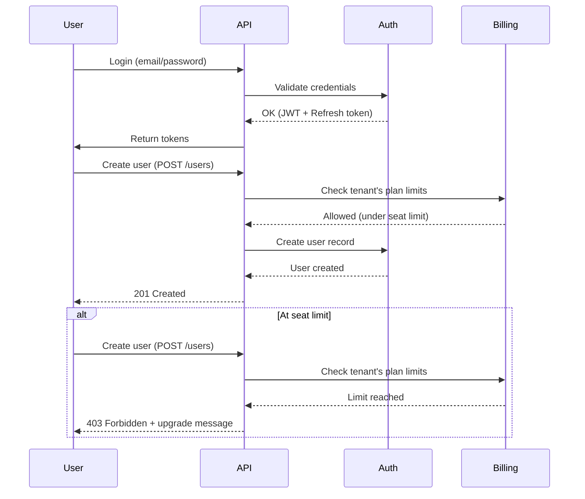

# Platform Account Sharing Policy

## Context

FunctionFly is a B2B platform where **tenants** (organizations) subscribe to plans and pay per-plan limits. Users belong to tenants and share access via credentials. This document defines a sharing policy that maximizes legitimate sharing while protecting revenue.

---

## Key Insight

**Billing is at the tenant level, not per-user.** A tenant pays a fixed/measured amount per their plan regardless of how many distinct humans share the credentials, as long as they stay within:

- Seat limits (user accounts)
- Rate limits (requests per minute/day/month)
- Spend caps (agent wallets)

This means **credential sharing within seat limits does not directly cost us money** — it just means the tenant is getting more value from their subscription.

---

## What to ALLOW (No Action Needed)

| Scenario | Why It's Fine |
|----------|---------------|
| Multiple employees sharing org credentials | Tenant pays; their internal policy |
| Family/household sharing a subscription | Tenant pays; common and acceptable |
| Same user logging in from multiple devices/locations | Standard usage pattern |
| Concurrent sessions for same user | Already supported by existing session model |
| Sharing API keys across team members | API keys are app-scoped; tenant owns them |
| Users logging in from different IPs simultaneously | Common for remote teams, VPNs, travel |

---

## What to PREVENT (Existing Controls)

| Risk | Control | Status |
|------|---------|--------|
| Exceeding request limits | `MaxRequestsPerMonth(plan)` per tenant | ✅ Implemented |
| Rate limit abuse | Per-token and per-IP rate limiting | ✅ Implemented |
| Agent wallet exhaustion | Spend caps per agent wallet | ✅ Implemented |
| Too many user seats | **Per-plan seat limits** | ⚠️ Need to implement |

---

## Recommended: Per-Plan Seat Limits

Add seat limits to enforce fair usage at the plan level:

```go
// In internal/plans/limits.go

// MaxUsersPerPlan returns the maximum number of users allowed per plan
func MaxUsersPerPlan(plan string) int {
    switch plan {
    case PlanStarter, "starter":
        return 3
    case PlanPro, "professional":
        return 10
    case PlanEnterprise, PlanAgentEnterprise:
        return -1 // unlimited
    default:
        return 3 // sensible default
    }
}

// SeatWarningThreshold returns the percentage at which to warn (80%)
func SeatWarningThreshold() float64 {
    return 0.80
}
```

### Behavior

- **Within limit**: User can be added freely
- **At 80%**: Soft warning notification (email + dashboard)
- **At limit**: API returns `403` with message to upgrade or remove existing users
- **Enterprise**: No limit enforcement (unlimited seats)

### Grace Period on Downgrade

When a tenant downgrades and exceeds the new limit:

```sql
ALTER TABLE tenants ADD COLUMN IF NOT EXISTS seat_grace_period_end TIMESTAMPTZ;
ALTER TABLE tenants ADD COLUMN IF NOT EXISTS seat_warning_sent_at TIMESTAMPTZ;
```

**Behavior**:

- If downgrade causes over-limit: set `seat_grace_period_end = now() + 30 days`
- Show warning: "Your new plan has a 10-seat limit. You have 13 users. Please remove 3 users within 30 days."
- Block new user creation during grace period (but don't lock existing users out)
- After grace period: block login for users beyond limit (oldest first)

---

## User Deactivation vs Deletion

Allow disabling users instead of deleting (preserves audit trail, frees up seat):

```go
// In internal/storage/models_core.go User model
type User struct {
    // ... existing fields
    DeactivatedAt *time.Time `json:"deactivated_at"`
    DeactivatedBy uuid.UUID  `json:"deactivated_by"`
}
```

### Behavior

- `DELETE /v1/users/{id}` → soft delete (set `deactivated_at`)
- Deactivated users:
  - Cannot log in
  - Do count toward seat limit initially
  - Can be "reactivated" by admin (clears `deactivated_at`)
  - Full deletion (GDPR, etc.) removes from seat count immediately
- "Remove user" button in dashboard → deactivates (not deletes)

### API Additions

| Endpoint | Description |
|----------|-------------|
| `POST /v1/users/{id}/deactivate` | Soft disable user |
| `POST /v1/users/{id}/reactivate` | Restore access |
| `DELETE /v1/users/{id}?hard=true` | Permanent deletion (admin only) |

---

## Audit Logging

Leverage existing audit repository to log user lifecycle events:

| Event | Log Data |
|-------|----------|
| `user.created` | user_id, tenant_id, created_by, email |
| `user.deactivated` | user_id, tenant_id, deactivated_by |
| `user.reactivated` | user_id, tenant_id, reactivated_by |
| `user.hard_deleted` | user_id, tenant_id, deleted_by, reason |
| `seat_limit_warning` | tenant_id, current_count, max_seats |
| `seat_grace_period_started` | tenant_id, grace_period_end, current_count, max_seats |

```go
// In internal/audit/events.go
const (
    EventUserCreated           = "user.created"
    EventUserDeactivated      = "user.deactivated"
    EventUserReactivated      = "user.reactivated"
    EventSeatLimitWarning     = "seat_limit_warning"
    EventSeatGracePeriodStart = "seat_grace_period_started"
)
```

---

## What NOT to Implement (Anti-Patterns)

### ❌ Credential Sharing Detection

Do not attempt to detect or prevent:

- Same credentials used by multiple IPs simultaneously
- Users sharing passwords with family/friends
- "Impossible travel" detection (user in US then EU in 30 min)

**Why**:

- Arms race with determined users (VPNs, credential managers)
- False positives harm legitimate users (remote workers, traveling executives)
- Engineering cost outweighs benefit in B2B context
- Tenant bears the risk of compromised credentials, not us

### ❌ Per-User Billing

Do not implement per-seat metering or per-user overage charges. This adds complexity and conflicts with "allow sharing" goal.

### ❌ Session Limits

Do not limit concurrent sessions per user. This harms legitimate multi-device usage.

---

## Mermaid: Current Flow



---

## Enforcement: Where to Check

| Operation | Check Location | Action if Exceeded |
|-----------|----------------|-------------------|
| Create user | `internal/api/handlers/users/users.go` | 403 + message |
| Invite user | `internal/api/handlers/users/invite.go` | 403 + message |
| Accept invitation | `internal/auth/gba/handlers.go` | 403 + message |
| OAuth signup | `internal/auth/oauth.go` | 403 + message |

---

## Dashboard UI Requirements

- [ ] Show "Seats: 8/10" progress bar in tenant settings
- [ ] Show warning banner when at 80%+
- [ ] "Remove user" button → deactivates user
- [ ] "Deactivated users" section showing can reactivate
- [ ] Grace period countdown when applicable

---

## Summary

| Goal | Approach |
|------|----------|
| Allow team sharing | ✅ Seat limits (tenant pays anyway) |
| Allow family/household sharing | ✅ Seat limits (tenant pays anyway) |
| Prevent revenue loss | ✅ Rate limits + request caps + agent spend caps |
| Detect credential sharing | ❌ Not recommended |
| Limit concurrent sessions | ❌ Not recommended |
| Per-user billing | ❌ Not recommended |

---

## Full Implementation Checklist

### Core (Required)

- [ ] Add `MaxUsersPerPlan(plan string)` function to `internal/plans/limits.go`
- [ ] Add `SeatWarningThreshold()` function
- [ ] Add user count check in user creation handlers (warn at 80%, block at 100%)
- [ ] Add user count check in invitation/accept handlers
- [ ] Add unit tests for seat limit enforcement
- [ ] Document seat limits in dashboard UI and error messages

### Enhanced (Recommended)

- [ ] Add `deactivated_at`, `deactivated_by` fields to User model
- [ ] Add `seat_grace_period_end` to tenants table
- [ ] Add `seat_warning_sent_at` to tenants table
- [ ] Implement user deactivation/reactivation endpoints
- [ ] Implement soft delete for user deletion
- [ ] Add notification trigger when at 80% threshold
- [ ] Add grace period logic on plan downgrade
- [ ] Add audit events for user lifecycle + seat management
- [ ] Add admin API `GET /admin/tenants/{id}/seat-usage`

### Dashboard UI

- [ ] Show "Seats: 8/10" progress bar in tenant settings
- [ ] Show warning banner when at 80%+
- [ ] "Remove user" button → deactivates user
- [ ] "Deactivated users" section showing can reactivate
