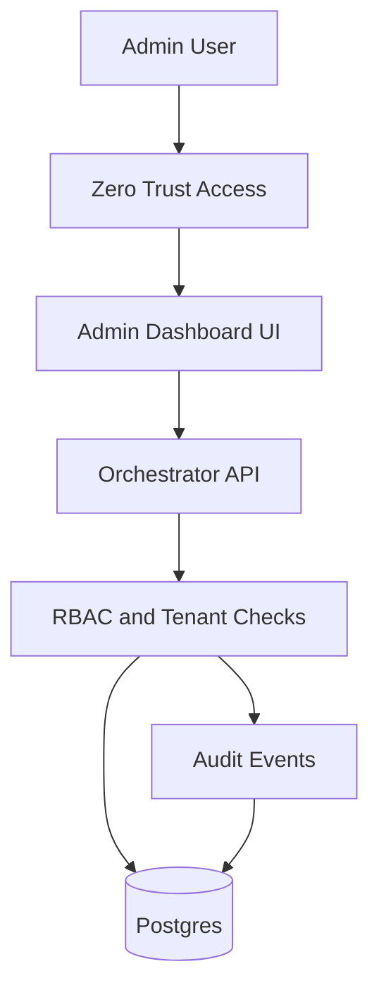

# Admin Dashboard Plan (Secure Platform Console)

This document defines a **secure-by-default** admin dashboard for FunctionFly that can manage all parts of the website/platform, including billing and support tooling.

## 1) Goals and non-goals

### Goals

- Provide a **platform admin console** to manage:
  - Tenants and users
  - Apps, backends/providers, routing, deployments, rollbacks
  - System health/observability
  - Audit logs
  - Billing: pricing tiers, subscriptions, invoices, usage metering, coupons
- Make admin access **extremely difficult to compromise** through layered controls:
  - Edge zero-trust (SSO + mandatory MFA)
  - In-app authorization (RBAC + tenant scoping)
  - Full auditability
  - Hardened session handling

### Non-goals (initially)

- “Unhackable” absolute guarantees (not achievable). Instead: defense-in-depth + monitoring + rapid response.
- Storing long-lived provider tokens in MVP unless encrypted-at-rest and access-controlled.

## 2) Recommended security posture (safest default for Vercel/Fly/Cloudflare)

### 2.1 Admin entrypoint and network boundary

- Host the admin UI on a **separate subdomain** such as `admin.<primary-domain>`.
- Protect the entire subdomain using a **zero-trust access proxy** (recommended: Cloudflare Access) with:
  - SSO (Google Workspace / Okta / Azure AD)
  - Mandatory MFA
  - Device posture checks if available
  - Country/IP restrictions where appropriate
- Result: the admin dashboard does **not need** a public signup flow.

### 2.2 In-app auth (still required)

Even with zero-trust, keep application-layer authZ, because:

- Zero-trust misconfigurations happen.
- Direct API access must also be protected.

Current repo has JWT-based auth described in [`plans/SECURITY.md`](plans/SECURITY.md:1) and login endpoint in [`plans/API_SPEC.md`](plans/API_SPEC.md:14).

Recommendation:

- Replace password login with **SSO-backed login** where feasible.
- Keep JWT, but make claims include role data.

### 2.3 Sessions

- Short-lived access tokens.
- Optional refresh tokens if needed (httpOnly, secure, SameSite strict) OR rely on SSO re-auth.
- Server-side revocation list for break-glass and rapid incident response.

### 2.4 Break-glass admin

- Separate “break-glass” identity not tied to normal SSO accounts.
- Stored offline (password manager + hardware key), highly monitored usage.

## 3) Roles and permissions (platform RBAC)

Define roles (platform-level):

- **super_admin**: full access to everything.
- **support**: view tenant/app status; limited mutation (e.g., disable backend, trigger redeploy with approvals).
- **billing_admin**: manage pricing tiers, coupons, subscriptions, invoices, refunds.
- **developer_admin**: manage apps/backends/deployments/routing; no billing changes.
- **read_only**: view-only.

Permission model:

- Permissions are explicit strings, e.g. `tenants.read`, `tenants.write`, `billing.write`, `deployments.rollback`.
- JWT includes `role` and/or `permissions`.

## 4) Admin surface areas (screens) and required capabilities

### Global (platform) screens

- Tenants
  - list/search tenants
  - view tenant detail (plan, usage, status)
  - suspend/unsuspend tenant
- Users
  - list users (global + per-tenant)
  - invite user (SSO-based) / disable user
  - assign roles
- Billing
  - pricing tiers CRUD
  - coupons CRUD
  - subscriptions: view, change plan, cancel
  - invoices: list, view, mark paid (if manual), refunds (if supported)
  - usage metering dashboard (by tenant/app)
- Audit Log
  - searchable immutable log; filters by actor, tenant, resource, action
- System Health
  - API health
  - worker health (if applicable)
  - incident banner controls (optional)

### Tenant-scoped screens (impersonation-aware)

- Apps: list/create/update
- Backends/providers: create/update/disable
- Deployments: deploy/list/rollback
- Routing: route debug and routing policies
- Observability: error rates, latency percentiles, health checks

## 5) Backend implications (data models + migrations)

Existing auth uses users with tenant IDs and password hashes in [`internal/auth/auth.go`](internal/auth/auth.go:1) and protected routes in [`internal/api/server.go`](internal/api/server.go:130).

Add/extend tables:

- `roles` / `user_roles` or `users.role`
- `audit_events`
- Billing entities:
  - `pricing_tiers`
  - `subscriptions`
  - `invoices`
  - `usage_events` or `usage_rollups`
  - `coupons`

Update migration narrative in [`MIGRATIONS.md`](MIGRATIONS.md:1).

## 6) API extensions (admin + billing)

Extend [`plans/API_SPEC.md`](plans/API_SPEC.md:1) with admin endpoints under `/v1/admin/...` (platform-wide) and tenant-scoped endpoints under `/v1/tenants/{tenantId}/...`.

Examples (illustrative):

- `GET /v1/admin/tenants`
- `PATCH /v1/admin/tenants/{tenantId}` (suspend, plan)
- `GET /v1/admin/audit-events`
- `POST /v1/admin/pricing-tiers`
- `POST /v1/admin/coupons`
- `GET /v1/admin/subscriptions?tenantId=...`

AuthZ requirements per endpoint:

- Must enforce both:
  - authentication (valid token)
  - authorization (role/permission)
  - tenant scoping (no cross-tenant IDOR)

## 7) Frontend (admin UI information architecture)

The existing dashboard lives under [`web/dashboard/src/pages`](web/dashboard/src/pages:1).

Add an Admin section (route group) with guarded routes:

- `/admin/tenants`
- `/admin/users`
- `/admin/billing/*`
- `/admin/audit-log`
- `/admin/system-health`

Guard strategy:

- Route guard checks JWT claims (role/permissions).
- Also expect upstream Access proxy headers, but do not rely on them alone.

## 8) Auditability requirements

- Every admin mutation writes an audit event with:
  - actor user ID/email
  - request ID
  - tenant ID (if relevant)
  - action name
  - before/after (redacted for secrets)
  - timestamp
- No secret values logged.

## 9) Threat model (high-level)

Primary threats and mitigations:

- Token theft: short TTL, secure storage, revocation, device-bound access proxy.
- IDOR/cross-tenant access: strict tenant checks on every handler (already pattern exists in [`internal/api/server.go`](internal/api/server.go:328)).
- Privilege escalation: explicit RBAC checks, deny by default, test coverage.
- SSRF via backend/provider URLs: validate allowed schemes/hosts; restrict internal ranges.
- Supply chain: lockfile hygiene, dependency scanning, CSP.

## 10) Implementation handoff (to Code mode)

Primary files that will be touched:

- Backend auth/claims and middleware in [`internal/auth/auth.go`](internal/auth/auth.go:1) and [`internal/api/server.go`](internal/api/server.go:130)
- Repository/migrations in [`internal/storage/sql/migrations`](internal/storage/sql/migrations:1)
- Frontend pages, routes, guards under [`web/dashboard/src/pages`](web/dashboard/src/pages:1) and auth store in [`web/dashboard/src/stores/authStore.ts`](web/dashboard/src/stores/authStore.ts:1)

Acceptance criteria:

- All admin endpoints require authN + authZ.
- All platform mutations emit audit events.
- Admin UI routes are inaccessible without proper role.
- Billing admin cannot access deployment mutation endpoints (and vice versa) unless explicitly allowed.

