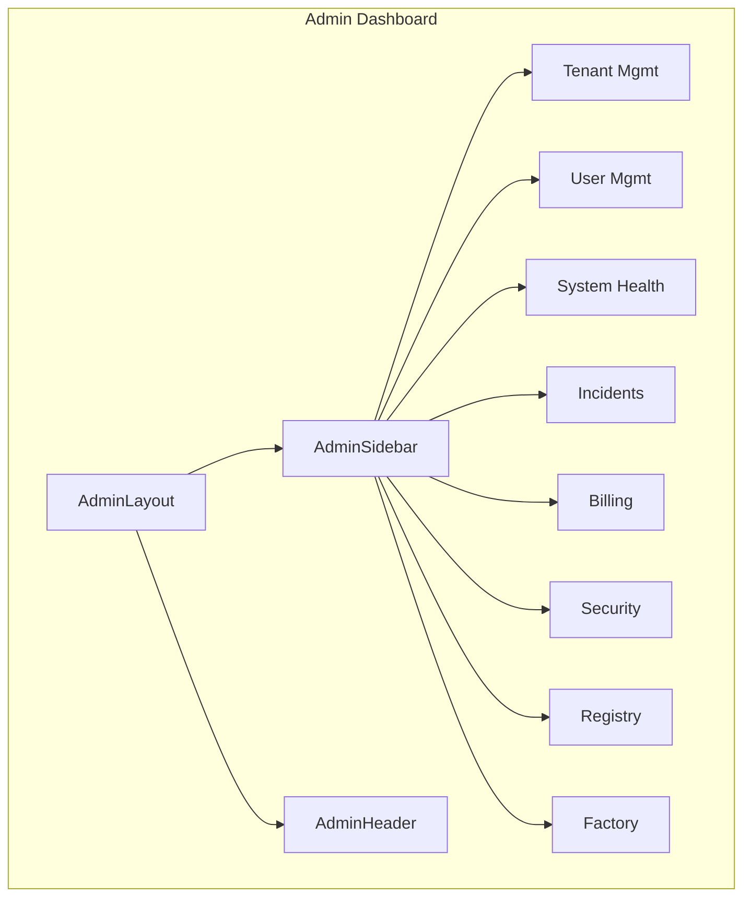

# Admin Dashboard Production Readiness - Gap Analysis

## Executive Summary

The admin dashboard has significant gaps between backend API capabilities and frontend implementation. While the backend provides comprehensive admin functionality (40+ admin endpoints), the frontend only exposes a minimal subset through the `AdminFactoryPage`. This document identifies all gaps and provides a prioritized roadmap for production readiness.

---

## Current State Assessment

### What Exists (Frontend)

| Component | Location | Status |
|-----------|----------|--------|
| AdminFactoryPage | [`web/dashboard/src/pages/AdminFactoryPage/index.tsx`](web/dashboard/src/pages/AdminFactoryPage/index.tsx) | Partial |
| Admin API Client | [`web/dashboard/src/api/admin.ts`](web/dashboard/src/api/admin.ts) | Partial |
| Admin Role Checks | [`web/dashboard/src/App.tsx:150`](web/dashboard/src/App.tsx#L150) | Implemented |
| User Menu Admin Link | [`web/dashboard/src/components/layout/UserMenu.tsx`](web/dashboard/src/components/layout/UserMenu.tsx) | Implemented |

### Backend Admin API (Comprehensive - 80+ endpoints)

The backend in [`internal/api/handlers/admin/`](internal/api/handlers/admin/) provides:

- Tenant Management (CRUD, suspend, activate)
- User Management (CRUD, invite, stats)
- Audit Logs
- Maintenance Mode & Scheduling
- Platform Backends Management
- Provider Management
- Incident Management
- System Health & Metrics
- Dashboard Stats (activity, revenue, quick stats)
- Analytics Management
- Billing Management (tiers, subscriptions, invoices, usage, coupons)
- Feedback Management
- Monitoring (alerts, metrics, health)
- Security (metrics, IP allowlist, certificates, incidents, compliance)
- MFA Management
- Functions CRUD (cross-tenant)
- Registry Management (CRUD, visibility, pricing, flagging)
- Cache Management
- Oversight (trust dashboard, fraud detection, economic leaderboard)
- Factory Management
- State Fabrics Management
- Content Generation
- Tenant Impersonation

---

## Critical Gaps

### 1. No Dedicated Admin Dashboard Layout

**Impact**: High  
**Priority**: P0

The admin dashboard lacks a dedicated navigation/layout. Admins must use the regular dashboard layout which doesn't provide:

- Sidebar navigation with admin-specific sections
- Quick access to system health indicators
- Role-based menu items

**Recommendation**: Create `AdminLayout` component with sidebar containing:

- Overview/Dashboard
- Tenants
- Users
- System Health
- Incidents
- Billing
- Security
- Registry Oversight
- Factory
- Settings

### 2. Missing Core Admin Pages

| Page | Backend API | Frontend Status | Priority |
|------|-------------|-----------------|----------|
| **Tenant Management** | `/admin/tenants/*` | Not implemented | P0 |
| **User Management** | `/admin/users/*` | Not implemented | P0 |
| **System Health** | `/admin/health` | Partial (in factory page) | P0 |
| **Incident Management** | `/admin/incidents/*` | Not implemented | P1 |
| **Audit Logs** | `/admin/audit-events` | Not implemented | P1 |
| **Billing Management** | `/admin/billing/*` | Not implemented | P1 |
| **Security Dashboard** | `/admin/security/*` | Not implemented | P1 |
| **Registry Oversight** | `/admin/registry/*` | Not implemented | P1 |
| **Cache Management** | `/admin/cache/*` | Not implemented | P2 |
| **Maintenance Mode** | `/admin/maintenance/*` | Not implemented | P2 |
| **Providers Management** | `/admin/providers/*` | Not implemented | P2 |
| **Platform Backends** | `/admin/backends/*` | Not implemented | P2 |
| **Content Management** | `/admin/content/*` | Not implemented | P2 |
| **State Fabrics Admin** | `/admin/state-fabrics/*` | Not implemented | P2 |

### 3. Admin API Client Gaps

The frontend [`admin.ts`](web/dashboard/src/api/admin.ts) is incomplete:

**Missing API Functions**:

- `tenantApi.create()` - Create new tenant
- `tenantApi.update()` - Update tenant
- `tenantApi.suspend()` - Suspend tenant
- `tenantApi.activate()` - Activate tenant
- `userApi.list()` - List all users
- `userApi.get()` - Get user details
- `userApi.update()` - Update user
- `userApi.delete()` - Delete user
- `userApi.invite()` - Invite user
- `incidentApi.list()` - List incidents
- `incidentApi.create()` - Create incident
- `incidentApi.update()` - Update incident
- `incidentApi.resolve()` - Resolve incident
- `auditApi.get()` - Get audit event
- Full `billingApi` - pricing tiers, subscriptions, invoices
- Full `securityApi` - metrics, IP allowlist, certificates
- `healthApi.getStatus()` - System health details

### 4. No Admin Role-Based Access Control (RBAC) UI

**Current State**: Role checking exists (`super_admin`, `support`, `billing_admin`, `developer_admin`)

**Missing**:

- Visual indicator of current admin role
- Role-based feature visibility
- Permission management UI
- Audit trail of admin actions

### 5. Missing Production-Ready Features

| Feature | Description | Priority |
|---------|-------------|----------|
| **Admin Activity Logging** | Show recent admin actions in dashboard | P1 |
| **Real-time System Status** | WebSocket for live health updates | P1 |
| **Bulk Operations** | Select multiple items for batch actions | P1 |
| **Search & Filtering** | Advanced search across tenants/users | P1 |
| **Export Functionality** | Export data to CSV/JSON | P2 |
| **Keyboard Shortcuts** | Quick actions for common tasks | P2 |
| **Dark Mode** | Admin-specific dark theme | P2 |
| **Audit Log Filtering** | Filter by date, user, action type | P2 |

### 6. No E2E Tests for Admin Functionality

Current test coverage in [`web/dashboard/e2e/`](web/dashboard/e2e/):

- Only `api-keys.spec.ts` exists
- No admin-specific tests

**Recommendation**: Add tests for:

- Admin authentication flow
- Tenant CRUD operations
- User management operations
- System health page
- Incident management

### 7. Missing Error Handling & Loading States

Based on code review of [`AdminFactoryPage`](web/dashboard/src/pages/AdminFactoryPage/index.tsx):

- Uses basic `isLoading` states
- No skeleton loaders for better UX
- Error states need improvement
- No retry mechanisms for failed requests

---

## Recommended Roadmap

### Phase 1: Core Admin Infrastructure (P0)

- [ ] Create AdminLayout component with sidebar navigation
- [ ] Implement AdminDashboard overview page (revenue, users, health)
- [ ] Implement Tenant Management page
- [ ] Implement User Management page
- [ ] Implement System Health monitoring page
- [ ] Complete admin API client functions

### Phase 2: Operations & Monitoring (P1)

- [ ] Implement Incident Management page
- [ ] Implement Audit Logs page with filtering
- [ ] Implement Security Dashboard
- [ ] Add real-time status via WebSocket
- [ ] Implement Registry Oversight page

### Phase 3: Billing & Configuration (P1-P2)

- [ ] Implement Billing Management (tiers, subscriptions, invoices)
- [ ] Implement Provider Management
- [ ] Implement Platform Backends management
- [ ] Implement Cache Management UI
- [ ] Implement Maintenance Mode UI

### Phase 4: Polish & Production Hardening (P2)

- [ ] Add E2E tests for admin workflows
- [ ] Implement bulk operations
- [ ] Add export functionality (CSV/JSON)
- [ ] Improve loading states with skeletons
- [ ] Add keyboard shortcuts
- [ ] Add audit trail of admin actions in UI
- [ ] Performance optimization for large datasets

---

## Technical Implementation Notes

### Admin Layout Structure



### Key Files to Create/Modify

1. **New Files**:
   - `web/dashboard/src/components/layout/AdminLayout.tsx`
   - `web/dashboard/src/pages/AdminTenantPage/index.tsx`
   - `web/dashboard/src/pages/AdminUserPage/index.tsx`
   - `web/dashboard/src/pages/AdminHealthPage/index.tsx`
   - `web/dashboard/src/pages/AdminIncidentsPage/index.tsx`
   - `web/dashboard/src/pages/AdminAuditPage/index.tsx`
   - `web/dashboard/src/pages/AdminBillingPage/index.tsx`
   - `web/dashboard/src/pages/AdminSecurityPage/index.tsx`

2. **Files to Modify**:
   - `web/dashboard/src/App.tsx` - Add admin routes
   - `web/dashboard/src/api/admin.ts` - Complete API functions
   - `web/dashboard/src/components/layout/DashboardLayout.tsx` - Admin-aware navigation
   - `web/dashboard/src/stores/authStore.ts` - Admin role helpers

---

## Questions for Clarification

1. **Admin URL Pattern**: Should admin pages be under `/admin/*` or `/admin/dashboard/*`?

2. **External Admin Panel**: The code references `ADMIN_DASHBOARD_URL` - is there a separate external admin panel we should link to instead of building full UI?

3. **Priority Order**: Should we prioritize by:
   - Most used features (tenant/user management)?
   - Highest risk (security, incidents)?
   - Easiest to implement (factory page already exists)?

4. **Scope**: Should we build complete CRUD for all endpoints or focus on read-only monitoring + specific write actions?

---

## Implementation Plan (All Gaps)

### Phase 1: Production Hardening (P0)

#### 1.1 E2E Tests for Admin Workflows

- [ ] Create `web/admin-dashboard/e2e/` directory
- [ ] Add Playwright config
- [ ] Create test: Admin login flow
- [ ] Create test: Tenant CRUD operations
- [ ] Create test: User management
- [ ] Create test: System health page
- [ ] Create test: Incident management
- [ ] Create test: Billing page

#### 1.2 Complete Missing API Client Functions

- [ ] Audit adminClient.ts against routes.go
- [ ] Add maintenance mode endpoints
- [ ] Add cache management endpoints
- [ ] Add monitoring endpoints

### Phase 2: Missing Pages (P1)

#### 2.1 Maintenance Mode Page

- [ ] Create AdminMaintenancePage.tsx
- [ ] Add route in App.tsx
- [ ] Connect to /admin/maintenance/* API
- [ ] Add to sidebar

#### 2.2 Cache Management Page

- [ ] Create AdminCachePage.tsx
- [ ] Add route in App.tsx
- [ ] Connect to /admin/cache/* API
- [ ] Add to sidebar

#### 2.3 Monitoring/Alerts Page

- [ ] Create AdminMonitoringPage.tsx
- [ ] Add route in App.tsx
- [ ] Connect to /admin/monitoring/* API
- [ ] Add to sidebar

### Phase 3: UX Improvements (P1-P2)

#### 3.1 Bulk Operations

- [ ] Add multi-select to Tenants page
- [ ] Add multi-select to Users page
- [ ] Add batch actions (suspend, activate, delete)

#### 3.2 Export Functionality

- [ ] Add CSV export to Tenants
- [ ] Add CSV export to Users
- [ ] Add CSV export to Audit logs
- [ ] Add JSON export option

#### 3.3 Real-time Updates

- [ ] Implement WebSocket connection
- [ ] Add live status updates to System page
- [ ] Add live updates to Incidents page

#### 3.4 Search & Filtering

- [ ] Add global search to sidebar
- [ ] Improve tenant list filtering
- [ ] Improve user list filtering

#### 3.5 Dark Mode

- [ ] Add dark mode toggle
- [ ] Implement dark theme CSS
- [ ] Persist preference

### Phase 4: Deployment (P2)

#### 4.1 CI/CD Pipeline

- [ ] Create GitHub Actions workflow
- [ ] Add build step
- [ ] Add test step
- [ ] Add deployment step

#### 4.2 Environment Configuration

- [ ] Configure staging environment vars
- [ ] Configure production environment vars
- [ ] Set up environment switching

#### 4.3 Monitoring

- [ ] Configure Sentry for admin dashboard
- [ ] Add error tracking
- [ ] Add performance monitoring

---

## Implementation Files to Create/Modify

### New Files to Create

```
web/admin-dashboard/
├── e2e/
│   ├── admin-login.spec.ts
│   ├── tenants.spec.ts
│   ├── users.spec.ts
│   ├── system-health.spec.ts
│   └── billing.spec.ts
├── src/
│   ├── pages/
│   │   ├── AdminMaintenancePage.tsx
│   │   ├── AdminCachePage.tsx
│   │   └── AdminMonitoringPage.tsx
│   └── components/
│       └── common/
│           ├── BulkActions.tsx
│           ├── ExportButton.tsx
│           ├── SearchBar.tsx
│           └── DarkModeToggle.tsx
```

### Files to Modify

```
web/admin-dashboard/
├── src/
│   ├── App.tsx (add routes)
│   ├── lib/api/adminClient.ts (add endpoints)
│   ├── components/layout/AdminSidebar.tsx (add menu items)
│   ├── stores/ (add dark mode store)
│   └── pages/ (enhance existing pages)
├── playwright.config.ts
└── package.json
```

---

## Running the Admin Dashboard

```bash
# Start development server
cd web/admin-dashboard
npm run dev

# Runs on http://localhost:3002

# Build for production
npm run build

# Run E2E tests
npm run e2e
```

---

## Success Criteria

The admin dashboard is production-ready when:

1. ✅ All 80+ backend admin endpoints have frontend coverage
2. ✅ E2E tests pass for critical admin workflows
3. ✅ Bulk operations work for tenants and users
4. ✅ Export functionality works for major pages
5. ✅ Dark mode is available
6. ✅ CI/CD pipeline is configured
7. ✅ No critical security issues
8. ✅ Performance is acceptable (<3s page load)
