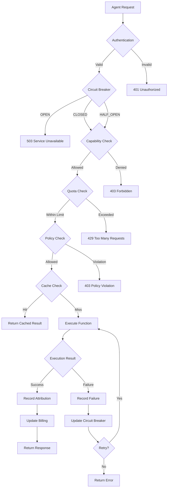

# Agent Capabilities Strengthening Plan

## Executive Summary

This plan outlines strategic improvements to make FunctionFly's agent platform production-ready, focusing on resilience, observability, security, performance, and advanced capabilities.

---

## Current State Assessment

### Existing Capabilities (Strong Foundation)

- ✅ Agent Identity & Registration (CRUD, API keys)
- ✅ Quota Management (rate limits, spend caps)
- ✅ Policy Engine (execution depth, recursion, wall time, memory)
- ✅ Attribution & Analytics (execution tracking, sessions, cost breakdown)
- ✅ Billing (credit management, spend tracking)
- ✅ Concurrency (priority scheduler with pools)
- ✅ Swarm (child spawning, messaging, marketplace, evolution, scheduling)
- ✅ Memory (vector search with pgvector)

### Gaps Identified

- ❌ No circuit breaker for agent execution
- ❌ Limited distributed tracing
- ❌ No execution caching for idempotent results
- ❌ Missing agent composition patterns
- ❌ No tool use framework
- ❌ Limited input/output validation
- ❌ No blue/green deployment for agents
- ❌ Missing chaos engineering capabilities

---

## Phase 1: Resilience & Fault Tolerance (Critical)

### 1.1 Circuit Breaker for Agent Execution

**Problem**: Agent execution has no protection against cascading failures.

**Solution**: Implement circuit breaker pattern in [`execute.go`](internal/api/handlers/agent/execute.go:44).

```go
// New: internal/agent/circuitbreaker/breaker.go
type AgentCircuitBreaker struct {
    agentID       string
    state         State // CLOSED, OPEN, HALF_OPEN
    failureCount  int
    successCount  int
    lastFailure   time.Time
    config        CircuitConfig
}

type CircuitConfig struct {
    FailureThreshold    int
    SuccessThreshold    int
    CooldownDuration    time.Duration
    HalfOpenMaxRequests int
}
```

**Integration Points**:

- Wrap [`HandleExecute`](internal/api/handlers/agent/execute.go:44) with circuit breaker
- Track failures per agent per function
- Emit metrics on state transitions
- Return 503 with `Retry-After` header when OPEN

### 1.2 Retry Policies with Exponential Backoff

**Problem**: No automatic retry for transient failures.

**Solution**: Add retry middleware for agent execution.

```go
// New: internal/agent/retry/policy.go
type RetryPolicy struct {
    MaxRetries      int
    InitialDelay    time.Duration
    MaxDelay        time.Duration
    BackoffFactor   float64
    RetryableErrors []string
}
```

**Default Policy**:

- Max 3 retries
- Initial delay: 100ms
- Max delay: 5s
- Backoff factor: 2.0
- Retryable: timeout, 5xx, rate limit

### 1.3 Graceful Degradation

**Problem**: Agent execution fails completely when dependencies are unavailable.

**Solution**: Implement fallback strategies.

**Strategies**:

1. **Registry Unavailable**: Return cached function metadata
2. **WASM Sandbox Unavailable**: Queue for later execution
3. **Attribution DB Unavailable**: Execute but log locally, sync later
4. **Billing Service Unavailable**: Execute with warning, reconcile later

---

## Phase 2: Observability & Monitoring (Critical)

### 2.1 Distributed Tracing (OpenTelemetry)

**Problem**: No end-to-end visibility into agent execution flows.

**Solution**: Integrate OpenTelemetry tracing.

**Implementation**:

```go
// New: internal/agent/telemetry/tracer.go
func InitTracer(serviceName string) (*sdktrace.TracerProvider, error) {
    // Configure OTLP exporter
    // Set up span processors
    // Return tracer provider
}
```

**Trace Points**:

- Agent authentication
- Quota check
- Policy evaluation
- Function lookup
- WASM execution
- Attribution recording
- Billing update

**Span Attributes**:

- `agent.id`
- `agent.tenant_id`
- `function.uri`
- `execution.id`
- `session.id`
- `call.depth`
- `outcome`
- `cost.usd`
- `latency.ms`

### 2.2 Real-Time Metrics Dashboard

**Problem**: No real-time visibility into agent performance.

**Solution**: Prometheus metrics + Grafana dashboards.

**Metrics to Add**:

```go
// New: internal/agent/metrics/metrics.go
var (
    agentExecutions = prometheus.NewCounterVec(
        prometheus.CounterOpts{
            Name: "agent_executions_total",
            Help: "Total agent executions",
        },
        []string{"agent_id", "function_uri", "outcome"},
    )
    
    agentExecutionDuration = prometheus.NewHistogramVec(
        prometheus.HistogramOpts{
            Name:    "agent_execution_duration_seconds",
            Help:    "Agent execution duration",
            Buckets: prometheus.ExponentialBuckets(0.01, 2, 15),
        },
        []string{"agent_id", "function_uri"},
    )
    
    agentCircuitState = prometheus.NewGaugeVec(
        prometheus.GaugeOpts{
            Name: "agent_circuit_state",
            Help: "Agent circuit breaker state (0=closed, 1=open, 2=half-open)",
        },
        []string{"agent_id"},
    )
    
    agentQuotaUsage = prometheus.NewGaugeVec(
        prometheus.GaugeOpts{
            Name: "agent_quota_usage_ratio",
            Help: "Agent quota usage ratio (0-1)",
        },
        []string{"agent_id", "quota_type"},
    )
)
```

### 2.3 Alerting Rules

**Problem**: No proactive alerting on anomalies.

**Solution**: Prometheus alerting rules.

```yaml
# New: deploy/monitoring/alerts/agent-alerts.yml
groups:
  - name: agent_alerts
    rules:
      - alert: AgentHighErrorRate
        expr: rate(agent_executions_total{outcome="error"}[5m]) > 0.1
        for: 2m
        labels:
          severity: warning
        annotations:
          summary: "Agent {{ $labels.agent_id }} has high error rate"
      
      - alert: AgentCircuitOpen
        expr: agent_circuit_state == 1
        for: 1m
        labels:
          severity: critical
        annotations:
          summary: "Agent {{ $labels.agent_id }} circuit breaker is OPEN"
      
      - alert: AgentQuotaExhausted
        expr: agent_quota_usage_ratio > 0.9
        for: 5m
        labels:
          severity: warning
        annotations:
          summary: "Agent {{ $labels.agent_id }} quota nearly exhausted"
```

---

## Phase 3: Security Hardening (Critical)

### 3.1 Agent Capability Scoping

**Problem**: Agents have broad permissions; no fine-grained capability control.

**Solution**: Implement capability-based access control.

```go
// New: internal/agent/capabilities/scope.go
type AgentCapabilities struct {
    AgentID           string
    AllowedFunctions  []string // glob patterns: "fx://functionfly/*"
    AllowedProviders  []string // ["workers", "vercel"]
    MaxCallDepth      int
    MaxConcurrent     int
    AllowedRegions    []string
    DeniedFunctions   []string
}
```

**Integration**:

- Check capabilities in [`HandleExecute`](internal/api/handlers/agent/execute.go:44)
- Store in agent metadata
- Enforce in policy engine

### 3.2 Input/Output Validation

**Problem**: No validation of agent inputs/outputs.

**Solution**: Add validation middleware.

```go
// New: internal/agent/validation/validator.go
type InputValidator struct {
    MaxSizeBytes      int
    AllowedMimeTypes  []string
    SchemaValidator   *jsonschema.Schema
    Sanitizer         *Sanitizer
}

type OutputValidator struct {
    MaxSizeBytes      int
    RedactPatterns    []*regexp.Regexp // PII patterns
    SchemaValidator   *jsonschema.Schema
}
```

**Default Rules**:

- Max input: 1MB
- Max output: 10MB
- Redact: emails, SSNs, credit cards
- Validate against function schema if available

### 3.3 Enhanced Audit Logging

**Problem**: Audit logs are minimal; missing critical security events.

**Solution**: Comprehensive audit trail.

```go
// New: internal/agent/audit/logger.go
type AuditEvent struct {
    Timestamp    time.Time
    EventType    string // "execute", "spawn", "message", "policy_violation"
    AgentID      string
    TenantID     uuid.UUID
    FunctionURI  string
    IPAddress    string
    UserAgent    string
    Outcome      string
    Details      map[string]interface{}
    RiskScore    float64
}
```

**Events to Log**:

- All executions
- Policy violations
- Quota violations
- Authentication failures
- Capability violations
- Unusual patterns (high call depth, rapid spawning)

---

## Phase 4: Performance Optimization (High)

### 4.1 Execution Caching

**Problem**: Idempotent functions are re-executed unnecessarily.

**Solution**: Redis-based result caching.

```go
// New: internal/agent/cache/executor.go
type CachedExecutor struct {
    executor  Executor
    cache     *redis.Client
    ttl       time.Duration
}

func (c *CachedExecutor) Execute(ctx context.Context, req *ExecuteRequest) (*ExecuteResponse, error) {
    // Generate cache key from function URI + input hash
    cacheKey := c.generateCacheKey(req)
    
    // Check cache
    if cached, err := c.cache.Get(ctx, cacheKey).Bytes(); err == nil {
        var resp ExecuteResponse
        json.Unmarshal(cached, &resp)
        resp.Cached = true
        return &resp, nil
    }
    
    // Execute
    resp, err := c.executor.Execute(ctx, req)
    if err != nil {
        return nil, err
    }
    
    // Cache result (only for idempotent functions)
    if c.isIdempotent(req.FunctionURI) {
        c.cache.Set(ctx, cacheKey, resp, c.ttl)
    }
    
    return resp, nil
}
```

**Cache Strategy**:

- Cache key: `agent:{id}:func:{uri}:input:{hash}`
- TTL: 5 minutes (configurable)
- Only cache idempotent functions
- Invalidate on function version update

### 4.2 Batch Execution

**Problem**: Multiple sequential executions incur overhead.

**Solution**: Batch execution API.

```go
// New: internal/api/handlers/agent/batch.go
type BatchExecuteRequest struct {
    Executions []AgentExecuteRequest `json:"executions"`
    Parallel   bool                  `json:"parallel"`
}

type BatchExecuteResponse struct {
    Results []AgentExecuteResponse `json:"results"`
    Total   int                    `json:"total"`
    Success int                    `json:"success"`
    Failed  int                    `json:"failed"`
}
```

**Benefits**:

- Reduced network overhead
- Shared quota check
- Parallel execution option
- Atomic attribution

### 4.3 Async Execution with Webhooks

**Problem**: Long-running executions block clients.

**Solution**: Async execution with webhook callbacks.

```go
// New: internal/api/handlers/agent/async.go
type AsyncExecuteRequest struct {
    Input       json.RawMessage `json:"input"`
    WebhookURL  string          `json:"webhook_url"`
    WebhookSecret string        `json:"webhook_secret"`
    Timeout     int             `json:"timeout_seconds"`
}

type WebhookPayload struct {
    ExecutionID string          `json:"execution_id"`
    Status      string          `json:"status"`
    Result      json.RawMessage `json:"result,omitempty"`
    Error       string          `json:"error,omitempty"`
    Timestamp   time.Time       `json:"timestamp"`
}
```

---

## Phase 5: Advanced Agent Features (Medium)

### 5.1 Agent Composition

**Problem**: No formal pattern for agents calling other agents.

**Solution**: Agent-to-agent invocation API.

```go
// New: internal/api/handlers/agent/compose.go
type AgentCallRequest struct {
    TargetAgentID string          `json:"target_agent_id"`
    FunctionURI   string          `json:"function_uri"`
    Input         json.RawMessage `json:"input"`
    Timeout       int             `json:"timeout_seconds"`
}

type AgentCallResponse struct {
    ExecutionID string          `json:"execution_id"`
    Result      json.RawMessage `json:"result"`
    CostUSD     float64         `json:"cost_usd"`
    DurationMs  int             `json:"duration_ms"`
}
```

**Features**:

- Call depth tracking (prevent infinite loops)
- Cost attribution to calling agent
- Permission checks (can agent A call agent B?)
- Timeout propagation

### 5.2 Tool Use Framework

**Problem**: Agents can only execute functions; no external tool access.

**Solution**: Tool use abstraction layer.

```go
// New: internal/agent/tools/registry.go
type Tool interface {
    Name() string
    Description() string
    Execute(ctx context.Context, params map[string]interface{}) (interface{}, error)
    Validate(params map[string]interface{}) error
}

type ToolRegistry struct {
    tools map[string]Tool
}

// Built-in tools
func NewToolRegistry() *ToolRegistry {
    return &ToolRegistry{
        tools: map[string]Tool{
            "http_request":  &HTTPTool{},
            "file_read":     &FileReadTool{},
            "file_write":    &FileWriteTool{},
            "database_query": &DatabaseTool{},
            "web_search":    &WebSearchTool{},
        },
    }
}
```

**Tool Categories**:

1. **HTTP Tools**: Make external API calls
2. **File Tools**: Read/write files (sandboxed)
3. **Database Tools**: Query databases (read-only by default)
4. **Search Tools**: Web search, knowledge base search
5. **Code Tools**: Execute code snippets

### 5.3 Planning & Reasoning

**Problem**: No built-in planning capabilities for complex tasks.

**Solution**: Planning engine integration.

```go
// New: internal/agent/planning/engine.go
type PlanningEngine struct {
    llmClient    LLMClient
    toolRegistry *ToolRegistry
    maxSteps     int
}

type Plan struct {
    Goal        string
    Steps       []PlanStep
    Status      string // "pending", "executing", "completed", "failed"
    CreatedAt   time.Time
}

type PlanStep struct {
    Order       int
    Action      string // "execute_function", "use_tool", "call_agent"
    Target      string
    Input       interface{}
    DependsOn   []int // step indices
    Status      string
    Result      interface{}
}
```

---

## Phase 6: Production Operations (Medium)

### 6.1 Blue/Green Deployments

**Problem**: No safe way to update agent configurations.

**Solution**: Blue/green deployment for agent versions.

```go
// New: internal/agent/deployment/manager.go
type DeploymentManager struct {
    repo        AgentRepository
    router      TrafficRouter
    healthCheck HealthChecker
}

type AgentVersion struct {
    AgentID     string
    Version     int
    Config      AgentConfig
    Status      string // "active", "staging", "deprecated"
    TrafficPercent int // 0-100
}

func (d *DeploymentManager) DeployNewVersion(ctx context.Context, agentID string, config AgentConfig) error {
    // Create new version in staging
    // Run health checks
    // Gradually shift traffic
    // Monitor metrics
    // Rollback if issues detected
}
```

### 6.2 A/B Testing

**Problem**: No way to test agent behavior changes.

**Solution**: A/B testing framework.

```go
// New: internal/agent/experiments/manager.go
type Experiment struct {
    ID          string
    AgentID     string
    Name        string
    Variants    []Variant
    TrafficSplit map[string]int // variant -> percentage
    Metrics     []string
    Status      string
}

type Variant struct {
    Name    string
    Config  AgentConfig
    Weight  int
}
```

### 6.3 Configuration Management

**Problem**: Agent configuration changes require restart.

**Solution**: Hot-reload configuration.

```go
// New: internal/agent/config/manager.go
type ConfigManager struct {
    cache       *redis.Client
    watchers    map[string][]ConfigWatcher
    version     int64
}

func (c *ConfigManager) Watch(agentID string, callback func(AgentConfig)) {
    // Subscribe to Redis pub/sub for config changes
    // Call callback when config updates
}
```

---

## Phase 7: Testing & Quality (High)

### 7.1 Agent Simulation Framework

**Problem**: No way to test agent behavior before deployment.

**Solution**: Simulation environment.

```go
// New: internal/agent/simulation/simulator.go
type Simulator struct {
    registry    FunctionRegistry
    mockTools   map[string]MockTool
    scenarios   []Scenario
}

type Scenario struct {
    Name        string
    AgentConfig AgentConfig
    Inputs      []json.RawMessage
    Expected    []ExpectedOutcome
    Constraints []Constraint
}

func (s *Simulator) Run(ctx context.Context, scenario Scenario) (*SimulationResult, error) {
    // Execute agent with scenario inputs
    // Track metrics
    // Validate against expected outcomes
    // Check constraints
    // Return result
}
```

### 7.2 Chaos Engineering

**Problem**: No resilience testing.

**Solution**: Chaos engineering for agents.

```go
// New: internal/agent/chaos/injector.go
type ChaosInjector struct {
    enabled     bool
    faults      []Fault
}

type Fault struct {
    Type        string // "latency", "error", "timeout", "resource_limit"
    Target      string // "registry", "wasm", "billing", "attribution"
    Probability float64
    Config      map[string]interface{}
}

// Fault types
func NewLatencyFault(target string, delay time.Duration, probability float64) Fault
func NewErrorFault(target string, errorCode int, probability float64) Fault
func NewTimeoutFault(target string, probability float64) Fault
```

### 7.3 Load Testing

**Problem**: No understanding of performance under load.

**Solution**: Load testing framework.

```go
// New: internal/agent/loadtest/runner.go
type LoadTestRunner struct {
    agentID     string
    concurrency int
    duration    time.Duration
    rampUp      time.Duration
}

type LoadTestResult struct {
    TotalRequests   int
    SuccessRate     float64
    AvgLatencyMs    float64
    P95LatencyMs    float64
    P99LatencyMs    float64
    ThroughputRPS   float64
    ErrorBreakdown  map[string]int
}
```

---

## Implementation Priority Matrix

| Phase | Category | Impact | Effort | Priority |
|-------|----------|--------|--------|----------|
| 1 | Resilience | Critical | Medium | P0 |
| 2 | Observability | Critical | Medium | P0 |
| 3 | Security | Critical | High | P0 |
| 4 | Performance | High | Medium | P1 |
| 5 | Advanced Features | Medium | High | P2 |
| 6 | Operations | Medium | Medium | P2 |
| 7 | Testing | High | Medium | P1 |

---

## Recommended Implementation Order

### Sprint 1 (Weeks 1-2): Foundation

1. Circuit breaker for agent execution
2. Retry policies with exponential backoff
3. Basic OpenTelemetry tracing
4. Input/output validation

### Sprint 2 (Weeks 3-4): Observability

1. Prometheus metrics
2. Grafana dashboards
3. Alerting rules
4. Enhanced audit logging

### Sprint 3 (Weeks 5-6): Security

1. Agent capability scoping
2. Enhanced authentication
3. Rate limiting per function
4. Security audit logging

### Sprint 4 (Weeks 7-8): Performance

1. Execution caching
2. Batch execution API
3. Async execution with webhooks
4. Connection pooling

### Sprint 5 (Weeks 9-10): Testing

1. Agent simulation framework
2. Load testing framework
3. Chaos engineering basics
4. Regression tests

### Sprint 6 (Weeks 11-12): Advanced Features

1. Agent composition API
2. Tool use framework (basic)
3. Blue/green deployments
4. Configuration hot-reload

---

## Success Metrics

### Reliability

- Agent execution success rate: >99.9%
- Mean time to recovery (MTTR): <5 minutes
- Circuit breaker activation rate: <0.1%

### Performance

- P50 execution latency: <100ms
- P95 execution latency: <500ms
- P99 execution latency: <2000ms
- Cache hit rate: >30%

### Security

- Zero unauthorized agent executions
- 100% audit coverage for sensitive operations
- Mean time to detect (MTTD) security issues: <1 minute

### Observability

- Trace coverage: >95% of executions
- Metric cardinality: <10,000 series
- Alert false positive rate: <5%

---

## Mermaid: Agent Execution Flow with Enhancements



---

## Next Steps

1. **Review this plan** with stakeholders
2. **Prioritize phases** based on business needs
3. **Assign ownership** for each phase
4. **Set up tracking** (Jira/Linear board)
5. **Begin Sprint 1** implementation

---

## Appendix: File Structure

```
internal/agent/
├── circuitbreaker/
│   ├── breaker.go
│   └── breaker_test.go
├── retry/
│   ├── policy.go
│   └── policy_test.go
├── telemetry/
│   ├── tracer.go
│   └── metrics.go
├── validation/
│   ├── validator.go
│   └── sanitizer.go
├── audit/
│   └── logger.go
├── cache/
│   └── executor.go
├── capabilities/
│   └── scope.go
├── tools/
│   ├── registry.go
│   ├── http.go
│   ├── file.go
│   └── database.go
├── planning/
│   └── engine.go
├── deployment/
│   └── manager.go
├── experiments/
│   └── manager.go
├── config/
│   └── manager.go
├── simulation/
│   └── simulator.go
├── chaos/
│   └── injector.go
└── loadtest/
    └── runner.go
```
