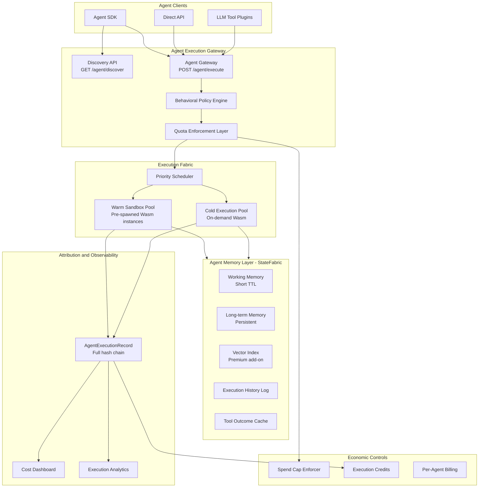
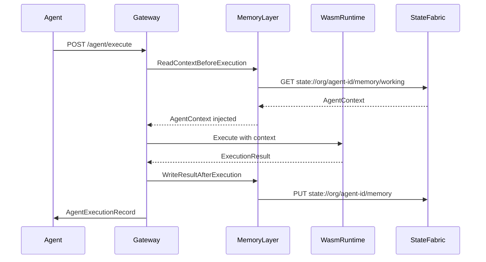

# FunctionFly Agent Execution Plan (AEP)

> **Positioning:** The native tool execution network for AI agents.

---

## Strategic Context

FunctionFly is pivoting from a developer-facing function registry to an **agent-native execution backbone**. The target customers are no longer individual developers — they are:

- AI startups building autonomous products
- Autonomous agent platforms (LangChain, CrewAI, AutoGen integrations)
- Internal AI teams at enterprises
- LLM product builders (OpenAI plugin authors, Anthropic tool-use builders)
- Workflow automation companies (n8n, Zapier AI, Make.com)

This is a fundamentally different revenue tier. A single AI startup customer can generate more MRR than 100 individual developers.

---

## What Already Exists (Leverage Points)

| Component | Location | Status |
|-----------|----------|--------|
| Wasm execution engine | `internal/api/handlers/registry/execution/` | ✅ Production |
| StateFabric / agent memory | `internal/storage/state/agent_memory.go` | ✅ Built |
| Rate limiting middleware | `internal/api/middleware/execution_coordinator.go` | ✅ Built |
| Billing / pricing tiers | `internal/storage/billing_repository.go` | ✅ Partial |
| Plan limits system | `internal/plans/limits.go` | ✅ Partial |
| Redis cache layer | `internal/cache/redis.go` | ✅ Built |
| Function registry + trust scoring | `internal/functionregistry/` | ✅ Built |
| Execution attribution logs | `internal/storage/registry_repository_executions.go` | ✅ Partial |
| Execution security middleware | `internal/api/middleware/execution_security.go` | ✅ Built |

**What is missing:**
- Agent identity model (`agent_id`, `agent://` URI scheme)
- Per-agent quota enforcement (separate from per-user rate limits)
- Concurrency pool reservation system
- Warm sandbox pool management
- Function Discovery API (`GET /agent/discover`)
- Behavioral policy engine (loop detection, depth limits, forbidden functions)
- `AgentExecutionRecord` with full attribution hashes
- AEP-specific pricing tiers in `internal/plans/limits.go`
- Economic controls (spend caps, credit pre-purchase, per-agent billing)
- Agent execution gateway (separate from registry execution path)

---

## Architecture Overview



---

## 7 Core Design Pillars

### Pillar 1: High Concurrency Burst Support

AI agents fan out unpredictably. A single user query can trigger 50+ parallel tool calls in under 1 second.

**New Components Required:**

#### `internal/agent/concurrency/pool.go`
```go
type ConcurrencyPool struct {
    AgentID         string
    PlanTier        string
    ReservedSlots   int       // Guaranteed slots for paid tiers
    BurstCeiling    int       // Max burst (e.g. 1000 calls/sec)
    WarmInstances   []*WasmInstance
    ActiveCount     int64     // atomic
}
```

#### `internal/agent/concurrency/scheduler.go`
```go
type PriorityScheduler struct {
    AgentPools      map[string]*ConcurrencyPool
    GlobalWarmPool  []*WasmInstance  // Shared warm instances
    PriorityQueues  map[string]*PriorityQueue  // per-tier
}
```

**Tier Concurrency Limits:**

| Tier | Reserved Slots | Burst Ceiling | Cold Start |
|------|---------------|---------------|------------|
| Agent Starter ($49) | 10 | 50/sec | Allowed |
| Agent Scale ($299) | 100 | 500/sec | Eliminated |
| Agent Pro ($999) | 500 | 2000/sec | Eliminated |
| Agent Enterprise ($2500+) | Dedicated pool | Unlimited | Eliminated |

**Warm Pool Strategy:**
- Phase 1 (<$10k MRR): No warm pool. Cold starts allowed for Starter tier.
- Phase 2 ($10k-$50k MRR): Warm pool for Scale+ tiers only (10 pre-spawned instances per active agent).
- Phase 3 ($50k+ MRR): Dedicated warm pools per Enterprise agent.

---

### Pillar 2: Native Memory Integration

Deep integration with the existing StateFabric (`internal/storage/state/`).

**Agent URI Scheme:**
```
agent://org/agent-id
state://org/agent-id/memory
state://org/agent-id/memory/working
state://org/agent-id/memory/longterm
state://org/agent-id/history
state://org/agent-id/tool-cache
```

**New Components Required:**

#### `internal/agent/memory/integration.go`
```go
type AgentMemoryIntegration struct {
    StateRepo    *state.StateRepository
    AgentID      string
    TenantID     uuid.UUID
}

// Called before every tool execution
func (m *AgentMemoryIntegration) ReadContextBeforeExecution(ctx context.Context, functionID string) (*AgentContext, error)

// Called after every tool execution
func (m *AgentMemoryIntegration) WriteResultAfterExecution(ctx context.Context, result *ExecutionResult) error

// Stores the call graph for the current agent session
func (m *AgentMemoryIntegration) StoreCallGraph(ctx context.Context, graph *CallGraph) error
```

**Memory Types (extending existing `AgentMemory` model):**

| Type | TTL | Storage | Tier |
|------|-----|---------|------|
| `working` | Session-scoped | Redis | All |
| `longterm` | Persistent | PostgreSQL | All |
| `vector` | Persistent | pgvector | Premium add-on |
| `execution_history` | Plan-defined retention | Object storage | All |
| `tool_outcome_cache` | Configurable TTL | Redis + PG | All |

**Execution Flow with Memory:**


---

### Pillar 3: Tool Execution Quotas

Per-agent quota enforcement, separate from the existing per-user rate limiting in `internal/api/middleware/execution_coordinator.go`.

**New Components Required:**

#### `internal/agent/quota/config.go`
```go
type AgentQuotaConfig struct {
    AgentID             string          `json:"agent_id"`
    MaxCallsPerMinute   int             `json:"max_calls_per_min"`
    MaxCallsPerDay      int             `json:"max_calls_per_day"`
    MaxStateWritesPerHr int             `json:"max_state_writes_per_hour"`
    MaxCostPerExecution float64         `json:"max_cost_per_execution"`
    MaxDailySpend       float64         `json:"max_daily_spend"`
    AllowedFunctions    []string        `json:"allowed_functions"`  // fx://org/* patterns
    ForbiddenFunctions  []string        `json:"forbidden_functions"`
    CreatedAt           time.Time       `json:"created_at"`
    UpdatedAt           time.Time       `json:"updated_at"`
}
```

#### `internal/agent/quota/enforcer.go`
```go
type QuotaEnforcer struct {
    Redis       *redis.Client
    DB          *gorm.DB
    BillingRepo *storage.BillingRepository
}

func (e *QuotaEnforcer) CheckAndConsume(ctx context.Context, agentID string, functionID string, estimatedCost float64) (*QuotaResult, error)
func (e *QuotaEnforcer) GetCurrentUsage(ctx context.Context, agentID string) (*AgentUsage, error)
func (e *QuotaEnforcer) ResetDailyCounters(ctx context.Context) error
```

**Quota Enforcement Architecture:**
- Counters stored in Redis (fast path) with Postgres as source of truth
- Atomic increment with Lua scripts to prevent race conditions
- Separate billing plane from execution plane (never block execution on billing DB)
- Quota violations return `429 Too Many Requests` with `Retry-After` header

**Plan Quota Defaults:**

| Tier | Calls/Min | Calls/Day | State Writes/Hr | Daily Spend Cap |
|------|-----------|-----------|-----------------|-----------------|
| Agent Starter | 100 | ~16,667 (500k/mo) | 1,000 | $5 |
| Agent Scale | 500 | ~166,667 (5M/mo) | 10,000 | $30 |
| Agent Pro | 2,000 | ~833,333 (25M/mo) | 50,000 | $100 |
| Agent Enterprise | Custom | Custom | Custom | Custom |

---

### Pillar 4: Function Discovery API

Agents need structured tool discovery. This is a new API surface that doesn't exist yet.

**New Routes:**
```
GET /agent/discover
GET /agent/discover?capability=payment
GET /agent/discover?tags=crm,email
GET /agent/discover?deterministic=true
GET /agent/discover?author=functionfly
GET /agent/discover?trust_score_min=0.8
```

**New Components Required:**

#### `internal/api/handlers/agent/discovery.go`
```go
type DiscoveryHandler struct {
    RegistryRepo *registry.RegistryRepository
    TrustScorer  *functionregistry.TrustScorer
}

type DiscoveryResult struct {
    URI              string          `json:"uri"`           // fx://org/name
    Schema           json.RawMessage `json:"schema"`
    InputFormat      json.RawMessage `json:"input_format"`
    OutputFormat     json.RawMessage `json:"output_format"`
    PricingPerCall   float64         `json:"pricing_per_call"`
    Deterministic    bool            `json:"deterministic"`
    TrustScore       float64         `json:"trust_score"`
    LatencyP50Ms     int             `json:"latency_p50_ms"`
    LatencyP95Ms     int             `json:"latency_p95_ms"`
    SuccessRate      float64         `json:"success_rate"`
    Tags             []string        `json:"tags"`
    Capabilities     []string        `json:"capabilities"`
    SideEffects      string          `json:"side_effects"`
}
```

**Discovery Response Format:**
```json
{
  "ok": true,
  "results": [
    {
      "uri": "fx://functionfly/json-to-csv",
      "schema": { ... },
      "input_format": { "type": "object", "properties": { "json": { "type": "string" } } },
      "output_format": { "type": "object", "properties": { "csv": { "type": "string" } } },
      "pricing_per_call": 0.0,
      "deterministic": true,
      "trust_score": 0.98,
      "latency_p50_ms": 12,
      "latency_p95_ms": 45,
      "success_rate": 0.9997,
      "tags": ["data", "formatting"],
      "capabilities": [],
      "side_effects": "none"
    }
  ],
  "total": 1,
  "page": 1
}
```

**Leverages existing:**
- `internal/functionregistry/trust_score.go` — trust scoring
- `internal/storage/registry_repository_search.go` — search/filter
- `internal/functionregistry/types.go` — `FunctionManifest` with tags, capabilities, deterministic flag

---

### Pillar 5: Agent Rate Control and Behavioral Policies

Production AI safety requires more than rate limiting. Agents can enter infinite loops, recurse deeply, or consume unbounded memory.

**New Components Required:**

#### `internal/agent/policy/engine.go`
```go
type BehavioralPolicy struct {
    AgentID              string   `json:"agent_id"`
    MaxExecutionDepth    int      `json:"max_execution_depth"`     // Max call chain depth
    MaxRecursionDepth    int      `json:"max_recursion_depth"`     // Recursive loop detection
    MaxWallTimeMs        int      `json:"max_wall_time_ms"`        // Time-boxed execution
    MaxMemoryGrowthMB    int      `json:"max_memory_growth_mb"`    // Memory growth limit
    ForbiddenFunctions   []string `json:"forbidden_functions"`     // Blocked fx:// URIs
    DeterministicOnly    bool     `json:"deterministic_only"`      // Only allow deterministic functions
    AllowedCapabilities  []string `json:"allowed_capabilities"`    // Capability whitelist
}

type PolicyEngine struct {
    Redis    *redis.Client
    Policies map[string]*BehavioralPolicy
}

func (pe *PolicyEngine) CheckPolicy(ctx context.Context, agentID string, req *AgentExecutionRequest) (*PolicyResult, error)
func (pe *PolicyEngine) DetectLoop(ctx context.Context, agentID string, callChain []string) (bool, error)
func (pe *PolicyEngine) TrackDepth(ctx context.Context, agentID string, sessionID string) (int, error)
```

**Loop Detection Algorithm:**
- Track call chain per agent session in Redis (TTL = session duration)
- Detect repeated `(functionID, inputHash)` pairs within a session
- Configurable threshold: default 3 identical calls = loop detected
- Return `PolicyViolation` error with `LOOP_DETECTED` code

**Depth Tracking:**
- Each agent execution request carries `X-Agent-Session-ID` header
- Depth counter stored in Redis per session
- Exceeding `MaxExecutionDepth` returns `DEPTH_EXCEEDED` error

---

### Pillar 6: Execution Attribution Logs

Every agent call produces a full `AgentExecutionRecord` with cryptographic hashes for auditability.

**New Data Model:**

#### `internal/agent/attribution/record.go`
```go
type AgentExecutionRecord struct {
    ID                 uuid.UUID       `json:"id"`
    AgentID            string          `json:"agent_id"`
    TenantID           uuid.UUID       `json:"tenant_id"`
    FunctionID         uuid.UUID       `json:"function_id"`
    FunctionURI        string          `json:"function_uri"`        // fx://org/name@version
    ExecutionID        string          `json:"execution_id"`
    SessionID          string          `json:"session_id"`
    CallDepth          int             `json:"call_depth"`
    InputHash          string          `json:"input_hash"`          // SHA-256 of input
    OutputHash         string          `json:"output_hash"`         // SHA-256 of output
    MemoryBeforeHash   string          `json:"memory_before_hash"`  // SHA-256 of agent context before
    MemoryAfterHash    string          `json:"memory_after_hash"`   // SHA-256 of agent context after
    CostUSD            float64         `json:"cost_usd"`
    LatencyMs          int             `json:"latency_ms"`
    Outcome            string          `json:"outcome"`             // success | error | timeout | policy_violation
    ErrorCode          *string         `json:"error_code,omitempty"`
    PolicyViolation    *string         `json:"policy_violation,omitempty"`
    Timestamp          time.Time       `json:"timestamp"`
    RetentionDays      int             `json:"retention_days"`
}
```

**Storage Strategy (cost-optimized):**
- **Hot path**: Write only `(id, agent_id, function_id, cost, timestamp, outcome)` to Postgres
- **Cold path**: Write full `AgentExecutionRecord` as compressed JSON (Zstd) to object storage (R2/B2)
- **Batch writes**: Group 100 records per object storage write to minimize API calls
- **Retention tiers**: 30d (Starter), 90d (Scale), 1yr (Pro), custom (Enterprise)

**Leverages existing:**
- `internal/storage/registry_repository_executions.go` — existing execution log infrastructure
- `internal/api/utils/audit.go` — audit trail utilities

---

### Pillar 7: Economic Controls Layer

AI companies need granular cost governance. This extends the existing billing system.

**New Components Required:**

#### `internal/agent/billing/controls.go`
```go
type AgentBillingControls struct {
    AgentID            string          `json:"agent_id"`
    TenantID           uuid.UUID       `json:"tenant_id"`
    SpendCapMonthlyUSD float64         `json:"spend_cap_monthly_usd"`
    SpendCapDailyUSD   float64         `json:"spend_cap_daily_usd"`
    CreditBalanceUSD   float64         `json:"credit_balance_usd"`
    BillingMode        string          `json:"billing_mode"`        // "per_agent" | "per_tenant" | "per_team"
    TeamID             *uuid.UUID      `json:"team_id,omitempty"`
    RevenueAttribution map[string]float64 `json:"revenue_attribution"` // function_id -> % of revenue
    AlertThresholds    []float64       `json:"alert_thresholds"`    // e.g. [0.5, 0.8, 0.95] of cap
}

type EconomicController struct {
    Redis       *redis.Client
    DB          *gorm.DB
    BillingRepo *storage.BillingRepository
    EmailSvc    *email.EmailService
}

func (ec *EconomicController) CheckSpendCap(ctx context.Context, agentID string, estimatedCost float64) (bool, error)
func (ec *EconomicController) ConsumeCredits(ctx context.Context, agentID string, amount float64) error
func (ec *EconomicController) GetAgentSpend(ctx context.Context, agentID string, period string) (*SpendSummary, error)
func (ec *EconomicController) SendAlertIfThresholdReached(ctx context.Context, agentID string) error
```

**Credit Pre-Purchase Flow:**
```
POST /agent/credits/purchase
{
  "agent_id": "my-agent",
  "amount_usd": 100.00,
  "payment_method_id": "pm_xxx"
}
```

**Per-Agent Billing Dashboard Data:**
```
GET /agent/{agent_id}/billing/summary
GET /agent/{agent_id}/billing/usage?period=2024-01
GET /agent/{agent_id}/billing/credits
```

---

## New API Routes

All new routes are prefixed with `/agent/` to clearly separate the agent execution plane from the existing registry execution plane.

```
# Discovery
GET  /agent/discover                          - Discover functions by capability/tags
GET  /agent/discover/{author}/{name}          - Get detailed function info for agents

# Execution
POST /agent/execute/{author}/{name}           - Execute a function as an agent
POST /agent/execute/{author}/{name}/{version} - Execute specific version

# Agent Management
POST /agent/register                          - Register a new agent identity
GET  /agent/{agent_id}                        - Get agent info
PUT  /agent/{agent_id}/quota                  - Update agent quota config
PUT  /agent/{agent_id}/policy                 - Update behavioral policy
DELETE /agent/{agent_id}                      - Deregister agent

# Attribution and Observability
GET  /agent/{agent_id}/executions             - List execution records
GET  /agent/{agent_id}/executions/{exec_id}   - Get specific execution record
GET  /agent/{agent_id}/analytics              - Execution analytics dashboard data
GET  /agent/{agent_id}/cost-breakdown         - Cost breakdown by function

# Economic Controls
GET  /agent/{agent_id}/billing/summary        - Billing summary
GET  /agent/{agent_id}/billing/usage          - Usage details
POST /agent/{agent_id}/credits/purchase       - Pre-purchase execution credits
GET  /agent/{agent_id}/credits/balance        - Current credit balance
PUT  /agent/{agent_id}/billing/spend-cap      - Set spend cap

# Session Management
POST /agent/{agent_id}/session/start          - Start a tracked agent session
POST /agent/{agent_id}/session/{session_id}/end - End a session
GET  /agent/{agent_id}/session/{session_id}   - Get session details with call graph
```

---

## New Data Models (Database Schema)

### `agent_identities` table
```sql
CREATE TABLE agent_identities (
    id          UUID PRIMARY KEY DEFAULT gen_random_uuid(),
    tenant_id   UUID NOT NULL REFERENCES tenants(id),
    agent_id    TEXT NOT NULL UNIQUE,  -- "org/agent-name"
    name        TEXT NOT NULL,
    description TEXT,
    plan_tier   TEXT NOT NULL DEFAULT 'agent_starter',
    status      TEXT NOT NULL DEFAULT 'active',  -- active | suspended | deleted
    api_key_hash TEXT,  -- hashed API key for agent auth
    created_at  TIMESTAMPTZ NOT NULL DEFAULT NOW(),
    updated_at  TIMESTAMPTZ NOT NULL DEFAULT NOW()
);
```

### `agent_quota_configs` table
```sql
CREATE TABLE agent_quota_configs (
    id                      UUID PRIMARY KEY DEFAULT gen_random_uuid(),
    agent_id                TEXT NOT NULL REFERENCES agent_identities(agent_id),
    max_calls_per_minute    INT NOT NULL DEFAULT 100,
    max_calls_per_day       INT NOT NULL DEFAULT 16667,
    max_state_writes_per_hr INT NOT NULL DEFAULT 1000,
    max_cost_per_execution  DECIMAL(10,6) NOT NULL DEFAULT 0.01,
    max_daily_spend_usd     DECIMAL(10,2) NOT NULL DEFAULT 5.00,
    allowed_functions       TEXT[],  -- NULL = all allowed
    forbidden_functions     TEXT[],
    created_at              TIMESTAMPTZ NOT NULL DEFAULT NOW(),
    updated_at              TIMESTAMPTZ NOT NULL DEFAULT NOW()
);
```

### `agent_behavioral_policies` table
```sql
CREATE TABLE agent_behavioral_policies (
    id                      UUID PRIMARY KEY DEFAULT gen_random_uuid(),
    agent_id                TEXT NOT NULL REFERENCES agent_identities(agent_id),
    max_execution_depth     INT NOT NULL DEFAULT 10,
    max_recursion_depth     INT NOT NULL DEFAULT 3,
    max_wall_time_ms        INT NOT NULL DEFAULT 300000,  -- 5 minutes
    max_memory_growth_mb    INT NOT NULL DEFAULT 512,
    forbidden_functions     TEXT[],
    deterministic_only      BOOLEAN NOT NULL DEFAULT FALSE,
    allowed_capabilities    TEXT[],
    created_at              TIMESTAMPTZ NOT NULL DEFAULT NOW(),
    updated_at              TIMESTAMPTZ NOT NULL DEFAULT NOW()
);
```

### `agent_execution_records` table (hot metadata only)
```sql
CREATE TABLE agent_execution_records (
    id              UUID PRIMARY KEY DEFAULT gen_random_uuid(),
    agent_id        TEXT NOT NULL,
    tenant_id       UUID NOT NULL,
    function_id     UUID NOT NULL,
    execution_id    TEXT NOT NULL,
    session_id      TEXT,
    call_depth      INT NOT NULL DEFAULT 0,
    cost_usd        DECIMAL(10,6) NOT NULL DEFAULT 0,
    latency_ms      INT NOT NULL,
    outcome         TEXT NOT NULL,  -- success | error | timeout | policy_violation
    error_code      TEXT,
    object_key      TEXT,  -- pointer to full record in object storage
    timestamp       TIMESTAMPTZ NOT NULL DEFAULT NOW()
);

CREATE INDEX idx_agent_exec_agent_id ON agent_execution_records(agent_id, timestamp DESC);
CREATE INDEX idx_agent_exec_tenant_id ON agent_execution_records(tenant_id, timestamp DESC);
```

### `agent_billing_controls` table
```sql
CREATE TABLE agent_billing_controls (
    id                      UUID PRIMARY KEY DEFAULT gen_random_uuid(),
    agent_id                TEXT NOT NULL REFERENCES agent_identities(agent_id),
    spend_cap_monthly_usd   DECIMAL(10,2),
    spend_cap_daily_usd     DECIMAL(10,2),
    credit_balance_usd      DECIMAL(10,2) NOT NULL DEFAULT 0,
    billing_mode            TEXT NOT NULL DEFAULT 'per_agent',
    team_id                 UUID REFERENCES teams(id),
    alert_thresholds        DECIMAL[] NOT NULL DEFAULT '{0.5, 0.8, 0.95}',
    created_at              TIMESTAMPTZ NOT NULL DEFAULT NOW(),
    updated_at              TIMESTAMPTZ NOT NULL DEFAULT NOW()
);
```

### `agent_sessions` table
```sql
CREATE TABLE agent_sessions (
    id              UUID PRIMARY KEY DEFAULT gen_random_uuid(),
    session_id      TEXT NOT NULL UNIQUE,
    agent_id        TEXT NOT NULL,
    tenant_id       UUID NOT NULL,
    status          TEXT NOT NULL DEFAULT 'active',  -- active | completed | terminated
    call_count      INT NOT NULL DEFAULT 0,
    total_cost_usd  DECIMAL(10,6) NOT NULL DEFAULT 0,
    call_graph      JSONB,  -- stored as compressed call graph
    started_at      TIMESTAMPTZ NOT NULL DEFAULT NOW(),
    ended_at        TIMESTAMPTZ,
    object_key      TEXT  -- pointer to full session data in object storage
);
```

---

## New Plan Tier Constants

Extending `internal/plans/limits.go`:

```go
// AEP Plan tier constants
const (
    PlanAgentStarter    = "agent_starter"
    PlanAgentScale      = "agent_scale"
    PlanAgentPro        = "agent_pro"
    PlanAgentEnterprise = "agent_enterprise"
)

// AEP Concurrency limits
const (
    AgentStarterMaxConcurrency    = 10
    AgentScaleMaxConcurrency      = 100
    AgentProMaxConcurrency        = 500
    AgentEnterpriseMaxConcurrency = -1  // Unlimited / dedicated pool
)

// AEP Tool call limits per month
const (
    AgentStarterMaxCallsPerMonth    = 500_000
    AgentScaleMaxCallsPerMonth      = 5_000_000
    AgentProMaxCallsPerMonth        = 25_000_000
    AgentEnterpriseMaxCallsPerMonth = -1  // Custom
)

// AEP Memory storage limits
const (
    AgentStarterMaxMemoryGB    = 10
    AgentScaleMaxMemoryGB      = 100
    AgentProMaxMemoryGB        = 500
    AgentEnterpriseMaxMemoryGB = -1  // Custom
)

// AEP Log retention days
const (
    AgentStarterLogRetentionDays    = 30
    AgentScaleLogRetentionDays      = 90
    AgentProLogRetentionDays        = 365
    AgentEnterpriseLogRetentionDays = -1  // Custom
)

// AEP Monthly pricing (cents)
const (
    AgentStarterPriceCents    = 4900   // $49/month
    AgentScalePriceCents      = 29900  // $299/month
    AgentProPriceCents        = 99900  // $999/month
    AgentEnterprisePriceCents = 250000 // $2500+/month base
)
```

---

## Infrastructure Scaling Strategy

### Stage 1: <$10k MRR

**Target:** Validate product-market fit with first 10-20 AI startup customers.

**Stack:**
- 1x powerful bare-metal server (Hetzner AX102: 24-core, 128GB RAM, ~$200/mo)
- 1x PostgreSQL instance (same server or Hetzner managed DB ~$30/mo)
- Cloudflare R2 for object storage (~$0.015/GB/mo)
- No Redis (in-process LRU cache per worker)
- No warm pool (cold starts allowed for Starter tier)
- Single region (Frankfurt or Ashburn)

**Total infra cost:** ~$300-500/month  
**Gross margin at $10k MRR:** ~95%

**Wasm execution capacity on AX102:**
- Wasmtime workers: ~2,000-5,000 concurrent Wasm executions
- Throughput: ~10,000-50,000 executions/second for simple functions
- This handles all Starter and Scale tier customers at this stage

### Stage 2: $10k-$50k MRR

**Additions:**
- 2nd compute node (horizontal scaling)
- Redis instance for quota counters and hot memory pointers
- Warm pool for Scale+ tiers (10 pre-spawned instances per active agent)
- Upgrade Postgres vertically (more RAM for connection pooling)
- Increase R2 storage allocation

**Total infra cost:** ~$1,000-2,000/month  
**Gross margin at $50k MRR:** ~96%

### Stage 3: $50k+ MRR

**Additions:**
- Regional replication (US + EU)
- Dedicated concurrency pools for Enterprise agents
- Horizontal DB scaling (read replicas)
- Tiered object storage (hot/warm/cold)
- Vector DB for premium memory add-on (pgvector already in schema)

**Total infra cost:** ~$5,000-15,000/month  
**Gross margin at $100k MRR:** ~90%

---

## Cost Optimization Techniques

### 1. Batch Object Storage Writes
Group 100 execution records per object write. At 1M executions/day, this reduces R2 API calls from 1M to 10,000.

### 2. Compress Everything
Apply Zstd compression to:
- Execution logs (typical 10:1 compression ratio)
- Agent memory snapshots
- Call graphs
- Session data

### 3. Separate Billing Plane from Execution Plane
Never block execution on billing DB writes. Use Redis atomic counters for real-time quota enforcement, flush to Postgres asynchronously every 60 seconds.

### 4. Tiered Log Retention
- Active logs (last 7 days): Postgres
- Recent logs (7-90 days): R2 standard
- Archive logs (90d+): R2 Infrequent Access or Backblaze B2 Deep Archive

### 5. Vector Index on Demand
Only provision pgvector index when customer explicitly enables the premium memory add-on. Don't pay for vector infrastructure for customers who don't use it.

---

## Implementation Phases

### Phase 1: Foundation (Agent Identity + Quota + Discovery)
**Goal:** Ship the minimum viable agent execution API.

1. Add AEP plan constants to `internal/plans/limits.go`
2. Create `agent_identities`, `agent_quota_configs` DB migrations
3. Build `internal/agent/quota/` package (enforcer + config)
4. Build `internal/api/handlers/agent/` package (registration + discovery)
5. Add `/agent/discover` and `/agent/register` routes to `internal/api/routes.go`
6. Add agent auth middleware (API key per agent)

### Phase 2: Execution Gateway (Attribution + Policy)
**Goal:** Full agent execution path with attribution and safety.

1. Create `agent_behavioral_policies`, `agent_execution_records`, `agent_sessions` DB migrations
2. Build `internal/agent/policy/` package (behavioral policy engine)
3. Build `internal/agent/attribution/` package (AgentExecutionRecord)
4. Build `/agent/execute` handler with full middleware chain
5. Integrate memory read/write into execution path
6. Add session tracking

### Phase 3: Economic Controls + Observability
**Goal:** Cost governance and analytics dashboards.

1. Create `agent_billing_controls` DB migration
2. Build `internal/agent/billing/` package (economic controller)
3. Build credit pre-purchase flow
4. Build `/agent/{id}/analytics` and `/agent/{id}/cost-breakdown` endpoints
5. Add spend cap alerting via existing email service
6. Build object storage integration for cold log archival

### Phase 4: Concurrency Pools + Warm Sandboxes
**Goal:** Eliminate cold starts for paid tiers.

1. Build `internal/agent/concurrency/` package (pool + scheduler)
2. Integrate warm pool with existing Wasmtime execution path
3. Add priority scheduling per tier
4. Add burst ceiling enforcement
5. Add concurrency metrics to Prometheus/Grafana dashboards

---

## Key Integration Points with Existing Code

| New Component | Integrates With | How |
|---------------|-----------------|-----|
| `agent/quota/enforcer.go` | `internal/api/middleware/execution_coordinator.go` | Quota check runs before existing rate limit middleware |
| `agent/memory/integration.go` | `internal/storage/state/agent_memory.go` | Wraps existing `StoreAgentMemory` / `GetAgentMemories` |
| `agent/attribution/record.go` | `internal/storage/registry_repository_executions.go` | Extends existing execution log with agent fields |
| `agent/policy/engine.go` | `internal/api/middleware/execution_security.go` | Policy check added to security middleware chain |
| `agent/billing/controls.go` | `internal/storage/billing_repository.go` | Extends existing billing with per-agent controls |
| Discovery handler | `internal/functionregistry/trust_score.go` | Uses existing trust scoring for discovery results |
| AEP plan constants | `internal/plans/limits.go` | New constants added to existing file |
| New routes | `internal/api/routes.go` | New `/agent/` route group added |

---

## Projected Revenue Model

### Conservative Scenario (12 months post-launch)

| Tier | Customers | MRR |
|------|-----------|-----|
| Agent Starter ($49) | 50 | $2,450 |
| Agent Scale ($299) | 20 | $5,980 |
| Agent Pro ($999) | 5 | $4,995 |
| Agent Enterprise ($2,500+) | 2 | $5,000 |
| **Total** | **77** | **$18,425** |

### Aggressive Scenario (12 months post-launch)

| Tier | Customers | MRR |
|------|-----------|-----|
| Agent Starter ($49) | 200 | $9,800 |
| Agent Scale ($299) | 80 | $23,920 |
| Agent Pro ($999) | 20 | $19,980 |
| Agent Enterprise ($2,500+) | 10 | $25,000 |
| **Total** | **310** | **$78,700** |

At $78k MRR with ~$2k/mo infra cost = **97% gross margin**.

---

## Strategic Moat

By building this stack, FunctionFly becomes:

1. **The structured tool registry for AI agents** — Discovery API with trust scores, latency metrics, and schema validation. No other platform offers this.

2. **The durable cognitive layer** — Agent memory that persists across sessions, with vector search for semantic recall. Agents become smarter over time on FunctionFly.

3. **The economic control infrastructure** — Spend caps, per-agent billing, credit pre-purchase. AI startups can ship to production without fear of runaway costs.

4. **The safety layer** — Behavioral policies, loop detection, depth limits. FunctionFly is the only platform that makes autonomous agents safe for production.

This is not just serverless. This is **agent-native compute**.
