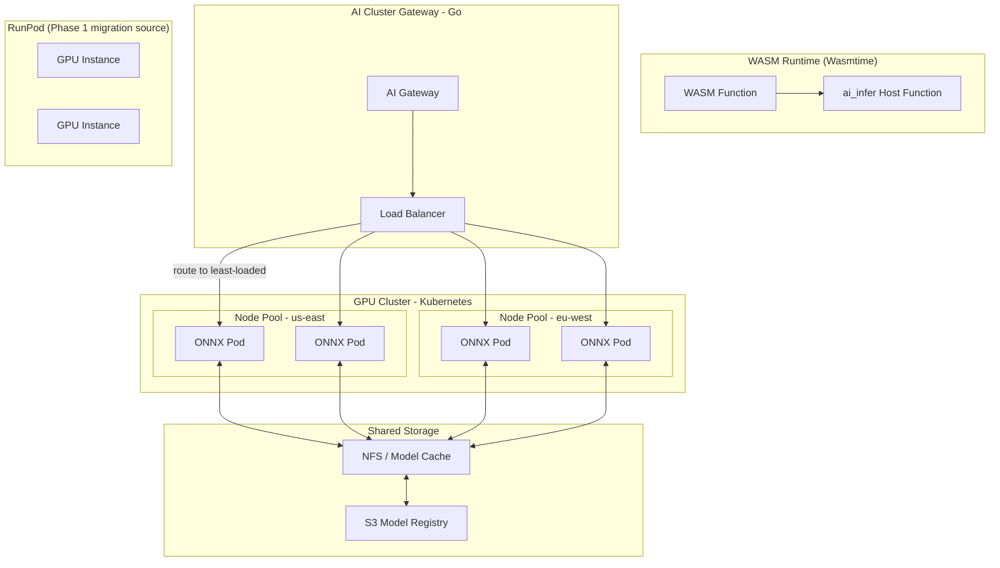
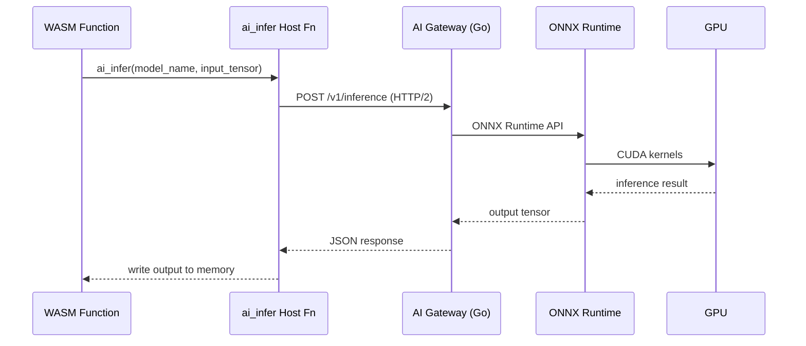
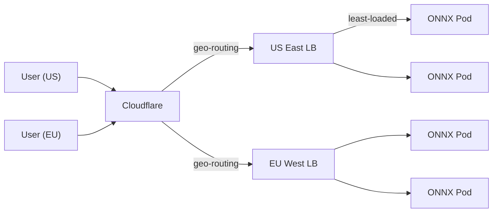
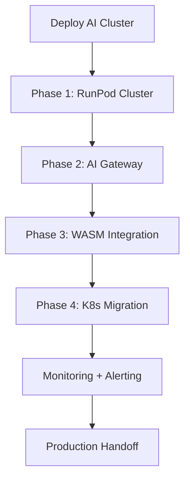

# AI Clusters Implementation Plan — FunctionFly Runtime-Secure Production System

> **Scope:** This document specifies the implementation plan for AI Clusters — GPU-accelerated inference infrastructure integrated with the FunctionFly WASM runtime. It builds on the existing RunPod GPU pool ([`internal/agent/runpod/`](internal/agent/runpod/)), FlyMind AI service ([`ai-service/`](ai-service/)), and WASM runtime ([`internal/wasm/`](internal/wasm/)).

---

## 1. Executive Summary

### 1.1 What

AI Clusters extend FunctionFly's serverless platform to support GPU-accelerated inference workloads directly from WASM functions. Functions declare the `ai:inference` capability and call a new `ai_infer` host function to run ONNX model inference on dedicated GPU infrastructure — without leaving the WASM sandbox.

### 1.2 Why

| Driver | Description |
|--------|-------------|
| **Inference gap** | WASM functions cannot access GPU hardware directly; all AI inference today routes through external API calls (OpenAI, Anthropic, etc.) |
| **Cost at scale** | External API inference costs become prohibitive at high volume; self-hosted GPU is 60–80% cheaper |
| **Latency** | Round-trip to external APIs adds 100–500ms; in-cluster GPU inference targets <50ms p95 |
| **Tenant isolation** | Multi-tenant GPU sharing requires strong isolation; current RunPod pool has no per-tenant partitioning |
| **CUDA-WASM barrier** | WASM cannot call CUDA kernels directly; a bridge layer is required |

### 1.3 High-Level Approach

```
WASM Function (ai:inference capability)
    │
    ▼
ai_infer host function ──────────────────────────────┐
    │                                                │
    ▼                                                ▼
AI Cluster Gateway (Go)              WASM Runtime (no GPU access)
    │                                     │
    ▼                                     ▼
ONNX Runtime Host (C++/Rust)        Existing host functions
    │                                     │
    ▼                                     ▼
GPU Cluster (Kubernetes)             CPU-only workloads
```

**Three-phase delivery:**

| Phase | Focus | Key Deliverable |
|-------|-------|-----------------|
| **Phase 1 — Foundation** | Expand RunPod pool, multi-region, basic clustering | Cluster-aware instance pool, API endpoints |
| **Phase 2 — WASM GPU Integration** | CUDA-WASM bridge, ONNX host function | `ai_infer` capability in WASM runtime |
| **Phase 3 — Production Scaling** | Kubernetes deployment, multi-region HA, auto-scaling | K8s manifests, Helm charts, global load balancing |

---

## 2. Architecture Design

### 2.1 AI Cluster Topology



### 2.2 Region Distribution

| Region | GPU Type | Instance Cap | Primary Use |
|--------|----------|--------------|-------------|
| `us-east-1` | NVIDIA A100 40GB | 16 | Production inference |
| `us-east-1` | NVIDIA RTX A5000 | 32 | Cost-effective inference |
| `eu-west-1` | NVIDIA A100 40GB | 8 | EU compliance |
| `ap-southeast-1` | NVIDIA A100 40GB | 8 | APAC latency |

### 2.3 Integration with Existing WASM Runtime

The WASM runtime at [`internal/wasm/runtime.go`](internal/wasm/runtime.go:1) provides host functions via [`defineHostFunctions()`](internal/wasm/host_functions.go:61). The new `ai_infer` host function follows the same pattern:

```go
// New AI capability signature (proposed)
linker.DefineFunc(store, "functionfly", "ai_infer",
    func(caller *wasmtime.Caller,
         modelPtr, modelLen int32,
         inputPtr, inputLen int32,
         outputPtr, outputLenPtr int32) int32 {
        // 1. Read model name from WASM memory
        // 2. Read input tensor data from WASM memory
        // 3. Call AI Gateway over secure channel
        // 4. Write output tensor back to WASM memory
        // 5. Return status code
    })
```

**Key difference from existing host functions:** `ai_infer` requires an out-of-process call to the GPU cluster (HTTP/gRPC), unlike `kv_get`/`kv_set` which are in-process. This demands async execution and connection pooling.

### 2.4 CUDA-WASM Bridge Design

WASM cannot call CUDA directly. The bridge architecture:



**Bridge components:**

| Layer | Technology | Purpose |
|-------|------------|---------|
| WASM Host Fn | Go + Wasmtime | Serializes tensor data, calls gateway |
| AI Gateway | Go HTTP/gRPC | Load balancing, auth, routing |
| ONNX Runtime | C++/Rust | Model execution, CUDA interop |
| GPU Driver | NVIDIA CUDA | Hardware access |

### 2.5 ONNX Runtime Integration

ONNX Runtime (ORT) provides hardware-accelerated inference for ONNX models. Integration approach:

```go
// internal/ai/onnx/runtime.go
type ONNXRuntime struct {
    session *onnxruntime.InferenceSession
    modelPath string
    inputNames  []string
    outputNames []string
}

func (r *ONNXRuntime) Infer(ctx context.Context, inputs map[string]*ort.Tensor) (map[string]*ort.Tensor, error) {
    outputs, err := r.session.Run(ctx, inputs)
    if err != nil {
        return nil, fmt.Errorf("ONNX inference failed: %w", err)
    }
    return outputs, nil
}
```

**Why ONNX over native CUDA:** ONNX Runtime abstracts CUDA/ROCml/CPU execution and handles memory management. Models are portable across hardware.

---

## 3. Implementation Phases

### Phase 1: Foundation (RunPod Expansion + Basic Clustering)

**Goal:** Make the existing RunPod GPU pool cluster-aware and production-ready.

#### 1.1 Cluster-Aware Instance Pool

Enhance [`internal/agent/runpod/instance.go`](internal/agent/runpod/instance.go:38) with cluster metadata:

```go
// GPUInstance - add cluster fields
type GPUInstance struct {
    ID           string
    Name         string
    PodID        string
    State        InstanceState
    Endpoint     string
    Region       string  // NEW: us-east-1, eu-west-1, etc.
    GPUType      string  // NEW: NVIDIA A100, RTX A5000
    ClusterID    string  // NEW: cluster identifier
    LastUsed     time.Time
    CreatedAt    time.Time
    RequestCount int
    mu           sync.RWMutex
}
```

#### 1.2 Multi-Region Support

```go
// internal/agent/runpod/factory.go
type ClusterFactory struct {
    clusters map[string]*ClusterConfig
    pool     *InstancePool
}

type ClusterConfig struct {
    Region         string
    GPUType        string
    MaxInstances   int
    MinInstances   int
    ContainerImage string
    BaseURL        string  // RunPod API base for this region
}
```

#### 1.3 AI Cluster API Endpoints

New endpoints in [`internal/api/routes.go`](internal/api/routes.go):

| Method | Path | Description |
|--------|------|-------------|
| `GET` | `/api/v1/ai/clusters` | List all GPU clusters |
| `GET` | `/api/v1/ai/clusters/{id}` | Get cluster status |
| `POST` | `/api/v1/ai/clusters/provision` | Manually provision instances |
| `DELETE` | `/api/v1/ai/clusters/{id}/instances/{iid}` | Terminate instance |
| `GET` | `/api/v1/ai/inference/stats` | Inference usage stats |

#### 1.4 FlyMind Integration

Enhance [`ai-service/src/providers/manager.py`](ai-service/src/providers/manager.py:21) to route inference requests to the GPU cluster when `ai:inference` capability is declared:

```python
class ClusterProvider(BaseProvider):
    """Self-hosted GPU inference via FunctionFly AI Cluster."""

    def __init__(self, cluster_endpoint: str):
        self.cluster_endpoint = cluster_endpoint
        # ... existing provider pattern

    async def complete(self, messages, model=None, ...) -> CompletionResponse:
        # Route to ONNX runtime in cluster
        response = await self._post("/v1/inference/onnx", {...})
        return response
```

#### 1.5 Deliverables

- [ ] Enhanced `InstancePool` with region/cluster fields
- [ ] Multi-region `ClusterFactory`
- [ ] `/api/v1/ai/clusters` CRUD endpoints
- [ ] `ClusterProvider` in FlyMind
- [ ] Inference stats endpoint

---

### Phase 2: WASM GPU Integration (CUDA-WASM Bridge)

**Goal:** Enable `ai:inference` capability in the WASM runtime.

#### 2.1 `ai_infer` Host Function

Add to [`internal/wasm/host_functions.go`](internal/wasm/host_functions.go:61):

```go
// ai_infer host function signature
// (param $model_ptr i32) (param $model_len i32)
// (param $input_ptr i32) (param $input_len i32)
// (param $output_ptr i32) (param $output_len_ptr i32)
// (result i32)  // 0=success, -1=error

linker.DefineFunc(store, "functionfly", "ai_infer",
    func(caller *wasmtime.Caller, modelPtr, modelLen, inputPtr, inputLen, outputPtr, outputLenPtr int32) int32 {
        // 1. Read model name from WASM memory
        // 2. Read input tensor serialized data
        // 3. Call AI Gateway (async, connection pooled)
        // 4. Write output tensor to WASM memory
        // 5. Write output length
        return 0 // or -1 on error
    })
```

#### 2.2 AI Gateway Service

New Go service at `internal/ai/gateway/`:

```go
// internal/ai/gateway/gateway.go
type AIGateway struct {
    clusterSelector *ClusterSelector  // least-loaded, geo-aware
    onnxRuntime     *ONNXRuntime     // local ONNX, or
    runPodPool      *runpod.InstancePool  // fallback
    authMiddleware  *AuthMiddleware
}

func (g *AIGateway) HandleInference(c *gin.Context) {
    var req InferenceRequest
    if err := c.BindJSON(&req); err != nil {
        c.JSON(400, Error{Error: "invalid request"})
        return
    }

    // Capability check
    if !req.Tenant.HasCapability("ai:inference") {
        c.JSON(403, Error{Error: "capability denied"})
        return
    }

    // Route to least-loaded node
    node := g.clusterSelector.Select(req.TenantID)
    result, err := node.Infer(ctx, req)
    // ...
}
```

#### 2.3 WASM Memory Transfer

The `ai_infer` call requires careful memory management:

```go
func writeInferenceOutput(store *wasmtime.Store, memory *wasmtime.Memory,
                         outputPtr int32, output []byte) error {
    // 1. Validate outputPtr bounds
    // 2. Write output bytes to WASM linear memory
    // 3. Write output length to outputLenPtr
    return nil
}
```

#### 2.4 Capability Declaration

Update [`functionfly.jsonc`](docs/functionfly.jsonc) schema:

```jsonc
{
    "capabilities": {
        "ai:inference": {
            "models": ["bert-base", "resnet-50", "llama-2-7b"],
            "max_input_tokens": 4096,
            "max_output_tokens": 1024,
            "gpu_required": true
        }
    }
}
```

#### 2.5 Deliverables

- [ ] `ai_infer` host function in WASM runtime
- [ ] AI Gateway service (`internal/ai/gateway/`)
- [ ] Connection pooling to cluster from WASM host
- [ ] Capability enforcement for `ai:inference`
- [ ] Memory-safe tensor serialization

---

### Phase 3: Production Scaling (Kubernetes, Multi-Region, Auto-Scaling)

**Goal:** Production-grade deployment with K8s orchestration.

#### 3.1 Kubernetes Deployment

```yaml
# deploy/k8s/ai-cluster/onnx-deployment.yaml
apiVersion: apps/v1
kind: Deployment
metadata:
  name: onnx-inference
  namespace: functionfly-ai
spec:
  replicas: 3
  selector:
    matchLabels:
      app: onnx-inference
  template:
    metadata:
      labels:
        app: onnx-inference
    spec:
      nodeSelector:
        gpu-type: nvidia-a100
      tolerations:
        - key: "gpu"
          operator: "Exists"
          effect: "NoSchedule"
      containers:
        - name: onnx-runtime
          image: functionfly/onnx-runtime:1.0.0
          resources:
            limits:
              nvidia.com/gpu: 1
              memory: "16Gi"
              cpu: "4"
          env:
            - name: ONNX_MODEL_PATH
              value: /models
            - name: CUDA_ENABLED
              value: "true"
          volumeMounts:
            - name: model-cache
              mountPath: /models
      volumes:
        - name: model-cache
          persistentVolumeClaim:
            claimName: model-cache-pvc
```

#### 3.2 Helm Chart Structure

```
deploy/k8s/ai-cluster/
├── Chart.yaml
├── values.yaml
├── templates/
│   ├── deployment.yaml
│   ├── service.yaml
│   ├── hpa.yaml           # Horizontal Pod Autoscaler
│   ├── pdb.yaml            # Pod Disruption Budget
│   ├── pvc.yaml
│   └── servicemonitor.yaml # Prometheus
```

#### 3.3 Horizontal Pod Autoscaler

```yaml
# deploy/k8s/ai-cluster/templates/hpa.yaml
apiVersion: autoscaling/v2
kind: HorizontalPodAutoscaler
metadata:
  name: onnx-inference-hpa
spec:
  scaleTargetRef:
    apiVersion: apps/v1
    kind: Deployment
    name: onnx-inference
  minReplicas: 2
  maxReplicas: 20
  metrics:
    - type: Resource
      resource:
        name: nvidia.com/gpu
        target:
          type: Utilization
          averageUtilization: 70
    - type: Pods
      pods:
        metric:
          name: inference_requests_per_second
        target:
          type: AverageValue
          averageValue: "10"
```

#### 3.4 Global Load Balancing



#### 3.5 Model Registry and Caching

```go
// internal/ai/modelregistry/registry.go
type ModelRegistry struct {
    s3Client     *s3.Client
    localCache   *lru.Cache[string, *Model]
    downloadOnce sync.Map
}

func (r *ModelRegistry) GetModel(ctx context.Context, modelName string) (*Model, error) {
    // 1. Check local LRU cache
    if m, ok := r.localCache.Get(modelName); ok {
        return m, nil
    }

    // 2. Download from S3 (once per model)
    do, _ := r.downloadOnce.LoadOrStore(modelName, new(sync.Once))
    // ... download and cache

    return m, nil
}
```

#### 3.6 Deliverables

- [ ] K8s Deployment manifests
- [ ] Helm chart with HPA, PDB
- [ ] Multi-region Global Load Balancer setup
- [ ] Model Registry with S3 backend + LRU cache
- [ ] GPU metric collection (DCGM exporter)
- [ ] Production-grade health checks

---

## 4. Security Model

### 4.1 Tenant Isolation in GPU Clusters

| Isolation Layer | Mechanism |
|-----------------|-----------|
| **Network** | Each tenant gets a unique VPC subnet; cross-tenant traffic denied by security groups |
| **Process** | ONNX Runtime runs in isolated container; no shared memory |
| **Memory** | GPU memory is allocated per-inference; no reuse across tenants until explicit memory free |
| **Storage** | Tenant's model weights stored in tenant-scoped S3 prefix |
| **Audit** | Every inference logged with tenant ID, model, input hash, timestamp |

### 4.2 Capability-Based AI Access

From [`internal/wasm/config.go`](internal/wasm/config.go:22), extend `WASMSecurityConfig`:

```go
type WASMSecurityConfig struct {
    // ... existing fields

    // AI Inference capabilities
    AIInferenceEnabled  bool     `json:"ai_inference_enabled"`
    AllowedModels       []string `json:"allowed_models"`  // whitelist of ONNX models
    MaxInputTokens      int      `json:"max_input_tokens"`
    MaxOutputTokens     int      `json:"max_output_tokens"`
    RequireGPU          bool     `json:"require_gpu"`     // fail if no GPU available
}
```

### 4.3 Audit Logging for AI Inference

```go
// internal/ai/audit/logger.go
type InferenceAuditLog struct {
    TenantID      string    `json:"tenant_id"`
    FunctionID    string    `json:"function_id"`
    ModelName     string    `json:"model_name"`
    InputHash     string    `json:"input_hash"`      // SHA-256 of input tensor
    OutputHash    string    `json:"output_hash"`     // SHA-256 of output tensor
    LatencyMs     float64   `json:"latency_ms"`
    GPUInstanceID string    `json:"gpu_instance_id"`
    Timestamp     time.Time `json:"timestamp"`
    Region        string    `json:"region"`
}
```

### 4.4 Security Summary

| Threat | Mitigation |
|--------|------------|
| Cross-tenant data leakage | VPC isolation + GPU memory clearing |
| Model theft | Encrypted model weights at rest; TLS in transit |
| Inference abuse | Rate limiting per tenant; capability enforcement |
| GPU escape | Containerized ONNX Runtime; no privileged containers |
| Timing side-channel | Disabled clocks in WASM; no timing in inference path |

---

## 5. API Surface

### 5.1 AI Cluster Management API

```go
// internal/api/handlers/ai/clusters.go

// GET /api/v1/ai/clusters
type ListClustersResponse struct {
    Clusters []ClusterInfo `json:"clusters"`
}

// GET /api/v1/ai/clusters/{cluster_id}
type GetClusterResponse struct {
    Cluster     ClusterInfo         `json:"cluster"`
    Instances   []InstanceInfo      `json:"instances"`
    Stats       ClusterStats        `json:"stats"`
}

// POST /api/v1/ai/clusters/provision
type ProvisionRequest struct {
    Region     string `json:"region" binding:"required"`
    GPUType    string `json:"gpu_type" binding:"required"`
    Count      int    `json:"count" binding:"min=1,max=10"`
}

// DELETE /api/v1/ai/clusters/{cluster_id}/instances/{instance_id}
type TerminateResponse struct {
    Success bool   `json:"success"`
    Message string `json:"message"`
}
```

### 5.2 Inference Request/Response Format

```go
// internal/ai/gateway/types.go

// POST /v1/inference/onnx
type InferenceRequest struct {
    Model   string                 `json:"model" binding:"required"`
    Inputs  map[string][]float32  `json:"inputs"`  // tensor name -> data
    Options InferenceOptions       `json:"options,omitempty"`
}

type InferenceOptions struct {
    Temperature float32 `json:"temperature,omitempty"`
    MaxTokens  int     `json:"max_tokens,omitempty"`
    TopP       float32 `json:"top_p,omitempty"`
}

type InferenceResponse struct {
    Outputs map[string][]float32 `json:"outputs"`
    LatencyMs float64            `json:"latency_ms"`
    Model   string               `json:"model"`
}
```

### 5.3 WASM Host Function ABI

```
module functionfly

// ai_infer executes an ONNX model inference
// @param model_ptr - pointer to model name string
// @param model_len - length of model name
// @param input_ptr - pointer to serialized input tensor (JSON)
// @param input_len - length of input
// @param output_ptr - pointer to output buffer
// @param output_len_ptr - pointer to store output length
// @returns 0 on success, -1 on error
func ai_infer(model_ptr i32, model_len i32, input_ptr i32, input_len i32, output_ptr i32, output_len_ptr i32) -> i32
```

---

## 6. Deployment Strategy

### 6.1 Kubernetes Deployment

**Cluster requirements:**

| Component | Spec |
|-----------|------|
| Kubernetes | 1.28+ |
| Node pools | CPU nodes (2xlarge) + GPU nodes (a100-1g) |
| Storage | NFS for model cache; S3 for model registry |
| Networking | VPC-CNI for pod networking; Calico for network policy |

### 6.2 Helm Chart Installation

```bash
# Install with overrides
helm install functionfly-ai-cluster ./deploy/k8s/ai-cluster \
  --namespace functionfly-ai \
  --create-namespace \
  --values ./deploy/k8s/ai-cluster/values.prod.yaml

# Upgrade
helm upgrade functionfly-ai-cluster ./deploy/k8s/ai-cluster \
  --namespace functionfly-ai \
  --values ./deploy/k8s/ai-cluster/values.prod.yaml
```

### 6.3 Rollout Strategy

| Stage | Strategy | Description |
|-------|----------|-------------|
| **Canary** | 5% traffic | Deploy to 1 pod in 1 region; monitor error rate |
| **Staged Rollout** | 25% → 50% → 100% | Increase traffic every 10 minutes if error rate < 0.1% |
| **Full Production** | 100% + rollback plan | Keep previous version as rollback |

**Rollback trigger:** Error rate > 1% OR p99 latency > 2x baseline

### 6.4 Deployment Sequence



---

## 7. Monitoring & Observability

### 7.1 GPU Metrics Collection

Using [DCGM (Data Center GPU Manager)](https://developer.nvidia.com/dcgm) exporter for Prometheus:

```yaml
# deploy/k8s/ai-cluster/templates/servicemonitor.yaml
apiVersion: monitoring.coreos.com/v1
kind: ServiceMonitor
metadata:
  name: onnx-gpu-metrics
spec:
  selector:
    matchLabels:
      app: onnx-inference
  endpoints:
    - port: metrics
      interval: 15s
  metricRelabelings:
    - sourceLabels: [gpu_uuid]
      targetLabel: gpu_instance
```

**Key GPU metrics:**

| Metric | Description | Alert Threshold |
|--------|-------------|------------------|
| `dcgm_gpu_utilization` | GPU compute utilization % | > 90% sustained |
| `dcgm_fb_used` | Frame buffer memory used MB | > 90% of total |
| `dcgm_gpu_temp` | GPU temperature C | > 85C |
| `dcgm_sm_clock` | SM clock frequency MHz | < baseline - 20% |

### 7.2 Inference Latency SLIs

| SLI | Target | Measurement |
|-----|--------|-------------|
| **Inference p50 latency** | < 20ms | Histogram bucket |
| **Inference p95 latency** | < 50ms | Histogram bucket |
| **Inference p99 latency** | < 100ms | Histogram bucket |
| **GPU availability** | >= 99.9% | Uptime / total time |
| **Inference error rate** | < 0.1% | 5xx / total requests |

### 7.3 Cost Tracking Per Tenant

```go
// internal/ai/billing/cost_tracker.go
type CostRecord struct {
    TenantID      string
    Timestamp     time.Time
    GPUType       string
    DurationMs    float64
    Region        string
    EstimatedCost float64  // based on RunPod GPU per-second pricing
}

func (t *CostTracker) RecordInference(tenantID string, gpuType string, durationMs float64, region string) {
    cost := calculateCost(gpuType, durationMs, region)
    t.db.Insert(&CostRecord{
        TenantID:   tenantID,
        GPUType:    gpuType,
        DurationMs: durationMs,
        Region:     region,
        EstimatedCost: cost,
    })
}
```

### 7.4 Dashboard Panels

| Panel | Visualization | Data Source |
|-------|---------------|-------------|
| GPU Utilization | Time series per node | Prometheus `dcgm_gpu_utilization` |
| Inference Latency | Heatmap (p50/p95/p99) | Prometheus histogram |
| Active Inferences | Gauge per region | Prometheus gauge |
| Cost by Tenant | Table | Postgres `ai_cost_records` |
| Error Rate | Line with threshold | Prometheus rate |

---

## 8. Migration Path

### 8.1 Existing RunPod User Transition

Users currently using RunPod via [`internal/agent/runpod/`](internal/agent/runpod/) will migrate to the new AI Cluster:

#### Phase A: Dual-write (Week 1-2)

```
Requests --> RunPod Pool (existing)
         --> AI Cluster (shadow, no traffic)
```

#### Phase B: Traffic Shift (Week 3-4)

| Week | RunPod Traffic | AI Cluster Traffic |
|------|----------------|-------------------|
| 3 | 80% | 20% |
| 4 | 50% | 50% |
| 5 | 20% | 80% |
| 6 | 0% | 100% |

#### Phase C: RunPod Pool Decommission (Week 6+)

- Terminate all RunPod instances
- Remove RunPod credentials from config
- Archive monitoring dashboards

### 8.2 Backward Compatibility

| Legacy Feature | Compatibility Layer |
|----------------|---------------------|
| FlyMind API inference | Routed to AI Cluster transparently |
| `functionfly.jsonc` `ai` capability | Mapped to `ai:inference` |
| RunPod config env vars | Aliases added for new names |
| Existing RunPod endpoints | Proxied to AI Cluster |

---

## 9. Risks and Mitigations

| Risk | Likelihood | Impact | Mitigation |
|------|------------|--------|------------|
| GPU shortage (A100) | Medium | High | Use RTX A5000 fallback; multi-GPU-type cluster |
| ONNX model compatibility | Medium | Medium | Test all models in staging before production |
| CUDA-WASM bridge latency | Medium | Medium | Connection pooling; local node routing |
| Tenant isolation breach | Low | Critical | VPC + security groups; penetration testing |
| Model cache miss (cold start) | Medium | Medium | Pre-warm popular models; S3 prefetch |
| K8s GPU scheduling conflicts | Low | Medium | Node affinity; resource quotas |
| Cost overrun (GPU runaway) | Medium | Medium | Hard spending limits per tenant; auto-scale caps |

---

## 10. Success Criteria

### 10.1 Functional Criteria

- [ ] WASM function with `ai:inference` capability can call `ai_infer` host function
- [ ] Inference returns result within 100ms p99 (including network)
- [ ] Multi-region deployment serves requests from closest cluster
- [ ] Existing RunPod users transparently migrated
- [ ] ONNX models load from S3 cache within 5s first request

### 10.2 Operational Criteria

- [ ] GPU utilization > 60% average (cost efficiency)
- [ ] Inference error rate < 0.1%
- [ ] HPA scales from 2 to 20 replicas based on load
- [ ] Zero tenant cross-contamination (verified by security audit)
- [ ] Cost tracking accurate to within 1% of RunPod billing

### 10.3 Migration Criteria

- [ ] 100% of RunPod traffic migrated to AI Cluster
- [ ] Rollback plan tested and documented
- [ ] RunPod credentials revoked
- [ ] Monitoring dashboards updated

---

## 11. Key Files to Create

```
internal/
├── ai/
│   ├── gateway/
│   │   ├── gateway.go          # Main gateway service
│   │   ├── cluster.go           # Cluster selection logic
│   │   ├── handlers.go          # HTTP handlers
│   │   └── middleware.go        # Auth, rate limiting
│   ├── onnx/
│   │   ├── runtime.go           # ONNX Runtime wrapper
│   │   ├── session.go           # Session management
│   │   └── tensor.go            # Tensor serialization
│   ├── modelregistry/
│   │   ├── registry.go          # Model registry
│   │   ├── cache.go             # LRU cache
│   │   └── s3.go                # S3 backend
│   └── audit/
│       └── logger.go            # Inference audit logging
├── agent/
│   └── runpod/
│       ├── cluster.go           # Cluster-aware pool (ENHANCE)
│       └── router.go            # Multi-cluster routing
internal/wasm/
├── host_functions.go            # ADD: ai_infer function (ENHANCE)
├── config.go                    # ADD: AI config fields (ENHANCE)
ai-service/src/
├── providers/
│   └── cluster.py               # ClusterProvider (ENHANCE)
deploy/
└── k8s/
    └── ai-cluster/
        ├── Chart.yaml
        ├── values.yaml
        └── templates/
            ├── deployment.yaml
            ├── service.yaml
            ├── hpa.yaml
            ├── pdb.yaml
            ├── pvc.yaml
            └── servicemonitor.yaml
plans/
└── AI_CLUSTERS_IMPLEMENTATION_PLAN.md  (this file)
```

---

## 12. References

| Document | Relevance |
|----------|-----------|
| [`plans/ARCHITECTURE.md`](plans/ARCHITECTURE.md) | AI Cluster target in runtime matrix |
| [`plans/RUNTIME_SANDBOX_2026.md`](plans/RUNTIME_SANDBOX_2026.md) | `ai_inference` capability design |
| [`plans/AI_FUNCTION_FACTORY_TODO.md`](plans/AI_FUNCTION_FACTORY_TODO.md) | RunPod GPU planning |
| [`internal/agent/runpod/`](internal/agent/runpod/) | Existing GPU pool implementation |
| [`internal/wasm/host_functions.go`](internal/wasm/host_functions.go:61) | Host function pattern |
| [`ai-service/src/providers/base.py`](ai-service/src/providers/base.py) | Provider abstraction |
| [`internal/wasm/config.go`](internal/wasm/config.go:22) | WASM security config |
