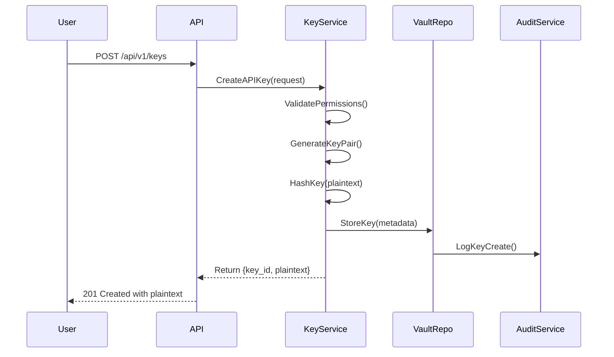
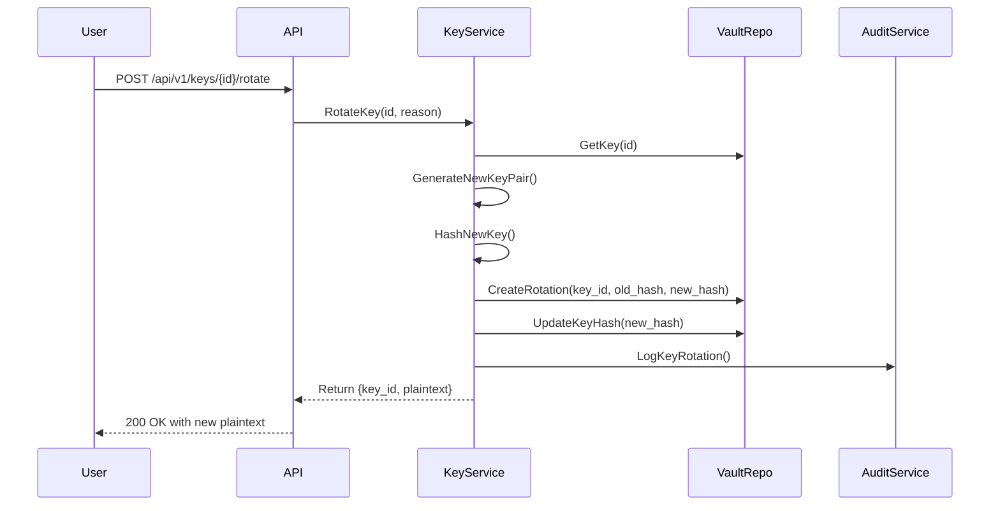
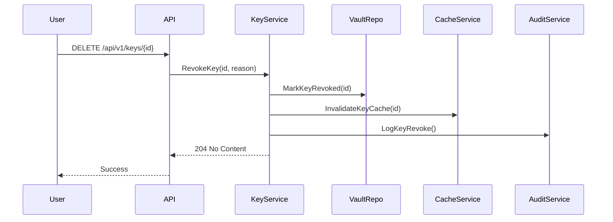

# FunctionFly Ultimate API Key System Architecture

> **Executive Summary**: This document specifies a comprehensive API key system for the FunctionFly platform that provides enterprise-grade key management while following DRY principles by reusing existing infrastructure patterns.

---

## Table of Contents

1. [Core API Key Concepts and Requirements](#1-core-api-key-concepts-and-requirements)
2. [Database Schema Design (DRY)](#2-database-schema-design-dry)
3. [Key Lifecycle Management](#3-key-lifecycle-management)
4. [Security Considerations](#4-security-considerations)
5. [Rate Limiting and Quota Enforcement](#5-rate-limiting-and-quota-enforcement)
6. [Audit Logging and Observability](#6-audit-logging-and-observability)
7. [Dashboard UI Integration Points](#7-dashboard-ui-integration-points)
8. [DRY Implementation Patterns](#8-dry-implementation-patterns)
9. [Edge Case Handling](#9-edge-case-handling)

---

## 1. Core API Key Concepts and Requirements

### 1.1 Key Types

| Key Type | Purpose | Prefix | Use Case |
|----------|---------|--------|----------|
| **Platform API Key** | Master keys for tenant administration | `ffp_` | Tenant owners managing their organization |
| **Function API Key** | Access to specific functions | `fff_` | Developers accessing published functions |
| **Agent API Key** | Agent identity authentication (existing) | `aep_` | Autonomous agents (already implemented) |
| **Environment Key** | Environment-scoped access | `ffe_` | CI/CD pipelines, multi-environment deployments |
| **OAuth Client Secret** | OAuth-based authentication | `ffo_` | Third-party integrations |

### 1.2 Requirements Matrix

```
┌─────────────────────────────────────────────────────────────────┐
│                    API Key Requirements                         │
├──────────────────────┬──────────────────────────────────────────┤
│ Requirement         │ Description                              │
├──────────────────────┼──────────────────────────────────────────┤
│ Key Generation       │ Cryptographically secure random keys     │
│ Key Rotation        │ Manual + automatic rotation support      │
│ Key Scoping         │ Per-function, per-environment, global   │
│ Rate Limiting       │ Per-key configurable limits             │
│ Audit Logging       │ All key operations logged                │
│ Permissions         │ Granular permission attachment           │
│ Expiration          │ Optional time-based expiration           │
│ Revocation          │ Immediate invalidation capability        │
│ Multi-Environment   │ Environment-aware key management         │
│ DRY Implementation  │ Reuse existing patterns                 │
└──────────────────────┴──────────────────────────────────────────┘
```

### 1.3 Key Structure

```plaintext
Format: {PREFIX}_{VERSION}_{RANDOM_BYTES}_{CHECKSUM}
Example: ffp_v1_a1b2c3d4e5f6...f0 (48 characters total)

Components:
- PREFIX:     Key type identifier (4 chars)
- VERSION:    Key format version (2 chars)
- RANDOM:     32 bytes of cryptographically secure random
- CHECKSUM:   First 8 chars of SHA-256 hash (for quick validation)
```

---

## 2. Database Schema Design (DRY)

### 2.1 Reuse Strategy

The schema design leverages existing infrastructure:

1. **Reuse `vault.secrets` table** - Extend for API key storage with new secret type
2. **Reuse `agent_identity` patterns** - Copy key hashing/rotation from [`internal/agent/identity/repository.go`](internal/agent/identity/repository.go:190)
3. **Reuse audit event system** - Extend existing audit logging ([`internal/auth/audit.go`](internal/auth/audit.go:27))
4. **Reuse tenant isolation** - Apply existing RLS policies

### 2.2 Schema Extensions

#### 2.2.1 New Columns in `secrets` table (or new `api_keys` table)

```sql
-- Option A: Extend existing secrets table (DRY - reuse encryption infrastructure)
ALTER TABLE secrets ADD COLUMN IF NOT EXISTS key_type VARCHAR(50) DEFAULT 'platform';
ALTER TABLE secrets ADD COLUMN IF NOT EXISTS key_prefix VARCHAR(10);
ALTER TABLE secrets ADD COLUMN IF NOT EXISTS key_scope JSONB;
ALTER TABLE secrets ADD COLUMN IF NOT EXISTS key_permissions JSONB;
ALTER TABLE secrets ADD COLUMN IF NOT EXISTS key_rate_limit JSONB;
ALTER TABLE secrets ADD COLUMN IF NOT EXISTS expires_at TIMESTAMP WITH TIME ZONE;
ALTER TABLE secrets ADD COLUMN IF NOT EXISTS last_used_at TIMESTAMP WITH TIME ZONE;
ALTER TABLE secrets ADD COLUMN IF NOT EXISTS rotation_enabled BOOLEAN DEFAULT false;
ALTER TABLE secrets ADD COLUMN IF NOT EXISTS rotation_period_days INTEGER;
ALTER TABLE secrets ADD COLUMN IF NOT EXISTS environment VARCHAR(50);
ALTER TABLE secrets ADD COLUMN IF NOT EXISTS metadata JSONB DEFAULT '{}';

-- Indexes for performance
CREATE INDEX IF NOT EXISTS idx_api_keys_key_prefix ON secrets(key_prefix) WHERE secret_type = 'api_key';
CREATE INDEX IF NOT EXISTS idx_api_keys_expires_at ON secrets(expires_at) WHERE expires_at IS NOT NULL;
CREATE INDEX IF NOT EXISTS idx_api_keys_environment ON secrets(environment);
```

#### 2.2.2 API Key Rotation History Table

```sql
-- Reuse audit_events pattern for rotation history
CREATE TABLE IF NOT EXISTS api_key_rotations (
    id UUID PRIMARY KEY DEFAULT gen_random_uuid(),
    api_key_id UUID NOT NULL REFERENCES secrets(id) ON DELETE CASCADE,
    created_at TIMESTAMP WITH TIME ZONE DEFAULT NOW(),
    created_by UUID REFERENCES users(id),
    key_hash VARCHAR(255) NOT NULL,
    expires_at TIMESTAMP WITH TIME ZONE,
    rotation_reason VARCHAR(50) DEFAULT 'manual', -- manual, automatic, compromised
    metadata JSONB DEFAULT '{}'
);

CREATE INDEX IF NOT EXISTS idx_api_key_rotations_key_id ON api_key_rotations(api_key_id);
```

#### 2.2.3 API Key Permissions Table

```sql
-- Granular permissions (extends vault patterns)
CREATE TABLE IF NOT EXISTS api_key_permissions (
    id UUID PRIMARY KEY DEFAULT gen_random_uuid(),
    api_key_id UUID NOT NULL REFERENCES secrets(id) ON DELETE CASCADE,
    resource_type VARCHAR(50) NOT NULL, -- function, app, tenant, registry
    resource_id UUID NOT NULL,
    permission VARCHAR(50) NOT NULL, -- read, write, execute, admin
    created_at TIMESTAMP WITH TIME ZONE DEFAULT NOW(),
    UNIQUE(api_key_id, resource_type, resource_id, permission)
);

CREATE INDEX IF NOT EXISTS idx_api_key_permissions_key_id ON api_key_permissions(api_key_id);
CREATE INDEX IF NOT EXISTS idx_api_key_permissions_resource ON api_key_permissions(resource_type, resource_id);
```

#### 2.2.4 Environment Mapping Table

```sql
-- Multi-environment support
CREATE TABLE IF NOT EXISTS api_key_environments (
    id UUID PRIMARY KEY DEFAULT gen_random_uuid(),
    name VARCHAR(50) NOT NULL UNIQUE,
    description TEXT,
    created_at TIMESTAMP WITH TIME ZONE DEFAULT NOW()
);

-- Default environments
INSERT INTO api_key_environments (name, description) VALUES 
    ('development', 'Local and staging environments'),
    ('staging', 'Pre-production testing'),
    ('production', 'Live production environment')
ON CONFLICT (name) DO NOTHING;
```

### 2.3 Entity Relationship Diagram

```mermaid
erDiagram
    TENANTS ||--o{ APPS : owns
    TENANTS ||--o{ USERS : has
    USERS ||--o{ API_KEY_PERMISSIONS : grants
    APPS ||--o{ BACKENDS : manages
    
    SECRETS ||--o{ API_KEY_ROTATIONS : has_history
    SECRETS ||--o{ API_KEY_PERMISSIONS : defines
    SECRETS }|--|| API_KEY_ENVIRONMENTS : scoped_to
    
    AUDIT_EVENTS ||--o{ SECRETS : logs
    
    note over SECRETS {
        Extended with key_* columns
        secret_type = 'api_key'
    }
```

---

## 3. Key Lifecycle Management

### 3.1 Key Creation Flow



### 3.2 Key Rotation Flow



### 3.3 Automatic Rotation

```go
// Reuse existing cron/scheduler patterns from FunctionFly
type RotationScheduler struct {
    repo     *Repository
    keyVault *vault.Service
    logger   *logrus.Logger
}

// Run daily to check for keys needing rotation
func (s *RotationScheduler) RunRotationChecks(ctx context.Context) error {
    keys, err := s.repo.KeysNeedingRotation(ctx)
    if err != nil {
        return err
    }
    
    for _, key := range keys {
        if err := s.rotateKey(ctx, key, "automatic"); err != nil {
            s.logger.WithError(err).Errorf("Failed to rotate key %s", key.ID)
        }
    }
    return nil
}
```

### 3.4 Expiration Management

| Expiration Type | Behavior | Use Case |
|-----------------|----------|----------|
| **Absolute** | Fixed date/time expiration | Contract workers, temporary access |
| **Sliding** | Activity-based expiration | Active development keys |
| **Rolling** | Auto-extend on use | Production keys |
| **Never** | No expiration | Permanent admin keys |

```sql
-- Expiration check query (run via cron)
SELECT id, name, expires_at 
FROM secrets 
WHERE secret_type = 'api_key' 
  AND expires_at < NOW() 
  AND expires_at IS NOT NULL;
```

### 3.5 Revocation Flow



---

## 4. Security Considerations

### 4.1 Key Hashing (DRY - Reuse Agent Pattern)

Extend the existing pattern from [`internal/agent/identity/repository.go`](internal/agent/identity/repository.go:190):

```go
package apikey

import (
    "crypto/rand"
    "crypto/sha256"
    "crypto/subtle"
    "encoding/hex"
)

// Key prefixes by type
const (
    PrefixPlatform  = "ffp_"
    PrefixFunction  = "fff_"
    PrefixAgent     = "aep_"  // Already exists
    PrefixEnvironment = "ffe_"
    PrefixOAuth     = "ffo_"
)

// Generate creates a new cryptographically secure API key
func Generate(prefix string) (plaintext, hash string, err error) {
    // 32 bytes of random data
    bytes := make([]byte, 32)
    if _, err := rand.Read(bytes); err != nil {
        return "", "", err
    }
    
    rawKey := prefix + "v1_" + hex.EncodeToString(bytes)
    return rawKey, Hash(rawKey), nil
}

// Hash returns the SHA-256 hash of the key
func Hash(key string) string {
    h := sha256.Sum256([]byte(key))
    return hex.EncodeToString(h[:])
}

// Verify compares a plaintext key with its hash in constant time
func Verify(plaintext, hash string) bool {
    return subtle.ConstantTimeCompare(Hash(plaintext), hash) == 1
}
```

### 4.2 Encryption at Rest

Reuse the existing vault encryption system ([`internal/api/handlers/vault/secrets.go`](internal/api/handlers/vault/secrets.go:41)):

```go
// API key encryption uses same vault encryption
type APIKeySecurity struct {
    encryptionService *vault.EncryptionService
}

// EncryptKey encrypts an API key for storage
func (s *APIKeySecurity) EncryptKey(ctx context.Context, key string) (*EncryptedKey, error) {
    return s.encryptionService.Encrypt(ctx, []byte(key))
}

// DecryptKey decrypts an API key from storage
func (s *APIKeySecurity) DecryptKey(ctx context.Context, encrypted *EncryptedKey) (string, error) {
    plaintext, err := s.encryptionService.Decrypt(ctx, encrypted)
    return string(plaintext), err
}
```

### 4.3 Security Best Practices

| Practice | Implementation |
|----------|----------------|
| **Key Display** | Show plaintext only once on creation |
| **Key Masking** | Never log or expose full keys |
| **Key Validation** | Constant-time comparison to prevent timing attacks |
| **Key Storage** | Salt + hash, never plaintext |
| **Key Transmission** | TLS required, Bearer token only |
| **Key Retention** | Rotation history kept for 90 days |

### 4.4 Compromise Handling

```go
// Compromised key handling
type CompromiseHandler struct {
    repo         *Repository
    auditService *AuditService
    cacheService *CacheService
}

func (h *CompromiseHandler) HandleCompromise(ctx context.Context, keyID uuid.UUID) error {
    // 1. Immediately revoke the key
    if err := h.repo.RevokeKey(ctx, keyID, "compromised"); err != nil {
        return err
    }
    
    // 2. Invalidate all caches
    h.cacheService.InvalidateKey(ctx, keyID)
    
    // 3. Log security event
    h.auditService.LogSecurityEvent(ctx, "key_compromised", map[string]interface{}{
        "key_id": keyID,
    })
    
    // 4. Notify tenant (via existing notification system)
    h.notifyTenantOfCompromise(ctx, keyID)
    
    return nil
}
```

---

## 5. Rate Limiting and Quota Enforcement

### 5.1 Rate Limit Structure

Reuse existing quota patterns from agent identity:

```go
type RateLimitConfig struct {
    RequestsPerMinute  int `json:"rpm"`
    RequestsPerHour    int `json:"rph"`
    RequestsPerDay     int `json:"rpd"`
    RequestsPerMonth   int `json:"rpmonth"`
    BurstLimit         int `json:"burst"`
}

type QuotaConfig struct {
    RateLimit           RateLimitConfig `json:"rate_limit"`
    MaxFunctions        int             `json:"max_functions"`
    MaxExecutions       int             `json:"max_executions"`
    DataTransferMB      int             `json:"data_transfer_mb"`
}
```

### 5.2 Rate Limiting Implementation

Extend existing middleware from [`internal/api/middleware/execution_security.go`](internal/api/middleware/execution_security.go:111):

```go
type APIKeyRateLimiter struct {
    redis     *redis.Client
    repo      *Repository
    limiter   *rate.Limiter
}

// Middleware applies rate limiting based on API key
func (rl *APIKeyRateLimiter) Middleware(next http.HandlerFunc) http.HandlerFunc {
    return func(w http.ResponseWriter, r *http.Request) {
        keyID := getAPIKeyID(r)
        if keyID == "" {
            next(w, r)
            return
        }
        
        config, err := rl.repo.GetRateLimitConfig(r.Context(), keyID)
        if err != nil || config == nil {
            // Fall back to default limits
            config = DefaultRateLimitConfig
        }
        
        // Check rate limits
        if !rl.checkLimits(r.Context(), keyID, config) {
            rl.respondRateLimited(w, config)
            return
        }
        
        // Record usage
        rl.recordUsage(r.Context(), keyID)
        
        next(w, r)
    }
}

func (rl *APIKeyRateLimiter) checkLimits(ctx context.Context, keyID string, config *RateLimitConfig) bool {
    now := time.Now()
    
    // Check per-minute limit
    if config.RequestsPerMinute > 0 {
        if !rl.limiter.AllowN(now, keyID+":minute", config.RequestsPerMinute) {
            return false
        }
    }
    
    // Check per-hour limit (via Redis)
    if config.RequestsPerHour > 0 {
        count, _ := rl.redis.Get(ctx, "ratelimit:"+keyID+":hour").Int()
        if count >= config.RequestsPerHour {
            return false
        }
    }
    
    return true
}
```

### 5.3 Quota Enforcement

```go
type QuotaEnforcer struct {
    repo     *Repository
    executor *Executor
}

// CheckQuota verifies key has remaining quota before execution
func (q *QuotaEnforcer) CheckQuota(ctx context.Context, keyID, functionID string) error {
    key, err := q.repo.GetKey(ctx, keyID)
    if err != nil {
        return err
    }
    
    if key.QuotaConfig == nil {
        return nil // No quota limits
    }
    
    // Check execution quota
    used, err := q.repo.GetUsage(ctx, keyID, "executions", time.Now().Month())
    if err != nil {
        return err
    }
    
    limit := key.QuotaConfig.MaxExecutions
    if limit > 0 && used >= limit {
        return ErrQuotaExceeded
    }
    
    return nil
}

// RecordUsage records usage for quota tracking
func (q *QuotaEnforcer) RecordUsage(ctx context.Context, keyID string, usageType string, amount int) error {
    return q.repo.RecordUsage(ctx, keyID, usageType, amount)
}
```

### 5.4 Rate Limit Response Headers

```go
// Standard rate limit headers
const (
    HeaderRateLimitLimit     = "X-RateLimit-Limit"
    HeaderRateLimitRemaining = "X-RateLimit-Remaining"
    HeaderRateLimitReset     = "X-RateLimit-Reset"
    HeaderRetryAfter         = "Retry-After"
)

func (rl *APIKeyRateLimiter) setRateLimitHeaders(w http.ResponseWriter, config *RateLimitConfig, remaining int, reset time.Time) {
    w.Header().Set(HeaderRateLimitLimit, strconv.Itoa(config.RequestsPerMinute))
    w.Header().Set(HeaderRateLimitRemaining, strconv.Itoa(remaining))
    w.Header().Set(HeaderRateLimitReset, strconv.FormatInt(reset.Unix(), 10))
}
```

---

## 6. Audit Logging and Observability

### 6.1 Reuse Existing Audit System

Extend existing audit events from [`internal/auth/audit.go`](internal/auth/audit.go:27):

```go
const (
    // API Key Events (extend existing)
    AuditEventAPIKeyCreate    = "api_key_create"
    AuditEventAPIKeyUse       = "api_key_use"
    AuditEventAPIKeyRevoke    = "api_key_revoke"
    AuditEventAPIKeyRotate    = "api_key_rotate"
    AuditEventAPIKeyExpire    = "api_key_expire"
    AuditEventAPIKeyAccess    = "api_key_access"    // Permission granted
    AuditEventAPIKeyScope     = "api_key_scope"     // Scope changed
)
```

### 6.2 Audit Log Schema

```sql
-- Extend existing audit_events for API keys
ALTER TABLE audit_events ADD COLUMN IF NOT EXISTS api_key_id UUID REFERENCES secrets(id);
ALTER TABLE audit_events ADD COLUMN IF NOT EXISTS key_name VARCHAR(255);
ALTER TABLE audit_events ADD COLUMN IF NOT EXISTS key_type VARCHAR(50);
ALTER TABLE audit_events ADD COLUMN IF NOT EXISTS rotation_id UUID REFERENCES api_key_rotations(id);
```

### 6.3 Audit Events to Log

| Event | When | Data |
|-------|------|------|
| `api_key_create` | Key created | key_id, name, type, scopes, permissions |
| `api_key_use` | Key used for API call | key_id, endpoint, response_code |
| `api_key_revoke` | Key revoked | key_id, reason |
| `api_key_rotate` | Key rotated | key_id, rotation_id, reason |
| `api_key_expire` | Key expired | key_id, expiration_date |
| `api_key_access` | Permission changed | key_id, resource_type, resource_id, permission |
| `api_key_rate_limit` | Rate limit hit | key_id, limit_type, count |

### 6.4 Observability Integration

Reuse existing logging infrastructure:

```go
type APIKeyLogger struct {
    logger   *logrus.Logger
    metrics  *metrics.Client
    tracer   *tracing.Client
}

// LogKeyUsage records key usage for observability
func (l *APIKeyLogger) LogKeyUsage(ctx context.Context, keyID, endpoint string, statusCode int, latency time.Duration) {
    // Structured logging
    l.logger.WithFields(logrus.Fields{
        "key_id":      keyID,
        "endpoint":    endpoint,
        "status_code": statusCode,
        "latency_ms":  latency.Milliseconds(),
    }).Info("api_key_used")
    
    // Metrics
    l.metrics.IncrementCounter("api_key_usage", metrics.Tag("key_id", keyID))
    l.metrics.RecordHistogram("api_key_latency", latency.Seconds(), metrics.Tag("endpoint", endpoint))
    
    // Distributed tracing
    l.tracer.AddEvent(ctx, "api_key_used", map[string]string{
        "key_id": keyID,
    })
}
```

---

## 7. Dashboard UI Integration Points

### 7.1 API Endpoints

Reuse existing routing patterns from [`internal/api/routes.go`](internal/api/routes.go):

```go
// API v1 routes for API keys
apiKeyRoutes := r.PathPrefix("/api/v1/keys").Subrouter()

// CRUD
apiKeyRoutes.HandleFunc("", authMiddleware.RequireAuth(handler.HandleListKeys)).Methods("GET")
apiKeyRoutes.HandleFunc("", authMiddleware.RequireAuth(handler.HandleCreateKey)).Methods("POST")
apiKeyRoutes.HandleFunc("/{id}", authMiddleware.RequireAuth(handler.HandleGetKey)).Methods("GET")
apiKeyRoutes.HandleFunc("/{id}", authMiddleware.RequireAuth(handler.HandleUpdateKey)).Methods("PUT")
apiKeyRoutes.HandleFunc("/{id}", authMiddleware.RequireAuth(handler.HandleDeleteKey)).Methods("DELETE")

// Key operations
apiKeyRoutes.HandleFunc("/{id}/rotate", authMiddleware.RequireAuth(handler.HandleRotateKey)).Methods("POST")
apiKeyRoutes.HandleFunc("/{id}/revoke", authMiddleware.RequireAuth(handler.HandleRevokeKey)).Methods("POST")
apiKeyRoutes.HandleFunc("/{id}/regenerate", authMiddleware.RequireAuth(handler.HandleRegenerateKey)).Methods("POST")

// Permissions
apiKeyRoutes.HandleFunc("/{id}/permissions", authMiddleware.RequireAuth(handler.HandleListKeyPermissions)).Methods("GET")
apiKeyRoutes.HandleFunc("/{id}/permissions", authMiddleware.RequireAuth(handler.HandleUpdateKeyPermissions)).Methods("PUT")

// Usage
apiKeyRoutes.HandleFunc("/{id}/usage", authMiddleware.RequireAuth(handler.HandleGetKeyUsage)).Methods("GET")
apiKeyRoutes.HandleFunc("/{id}/activity", authMiddleware.RequireAuth(handler.HandleGetKeyActivity)).Methods("GET")
```

### 7.2 React Dashboard Integration

Reuse existing dashboard patterns from `web/dashboard/`:

```typescript
// API key management hooks
export function useAPIKeys() {
  const { data, loading, error, refetch } = useQuery(GET_API_KEYS);
  const [createKey] = useMutation(CREATE_API_KEY);
  const [rotateKey] = useMutation(ROTATE_API_KEY);
  const [revokeKey] = useMutation(REVOKE_API_KEY);
  
  return { keys: data?.keys, loading, error, refetch, createKey, rotateKey, revokeKey };
}

// API key creation form
interface CreateKeyFormData {
  name: string;
  type: 'platform' | 'function' | 'environment';
  environment?: string;
  permissions: Permission[];
  rateLimit: RateLimitConfig;
  expiresAt?: Date;
  rotationEnabled: boolean;
  rotationPeriodDays: number;
}

// Key list component (reuse existing table patterns)
function APIKeyList() {
  const { keys, loading, rotateKey, revokeKey } = useAPIKeys();
  
  return (
    <Table
      data={keys}
      columns={[
        { key: 'name', label: 'Name' },
        { key: 'type', label: 'Type' },
        { key: 'environment', label: 'Environment' },
        { key: 'lastUsedAt', label: 'Last Used' },
        { key: 'expiresAt', label: 'Expires' },
        { key: 'actions', label: 'Actions' },
      ]}
    />
  );
}
```

### 7.3 Dashboard Pages

| Page | Route | Purpose |
|------|-------|---------|
| Key List | `/settings/api-keys` | List all API keys |
| Key Detail | `/settings/api-keys/:id` | View key details and usage |
| Create Key | `/settings/api-keys/new` | Create new API key |
| Key Activity | `/settings/api-keys/:id/activity` | View key activity log |
| Key Settings | `/settings/api-keys/:id/settings` | Edit key permissions/rate limits |

---

## 8. DRY Implementation Patterns

### 8.1 Shared Package Structure

```
internal/
├── apikey/
│   ├── generator.go      # Key generation (reused by all key types)
│   ├── hasher.go         # Key hashing (reused from agent identity)
│   ├── validator.go      # Key validation logic
│   ├── rate limiter.go   # Rate limiting (reused from execution security)
│   └── middleware.go     # HTTP middleware
├── api/
│   └── handlers/
│       └── apikey/
│           ├── handler.go    # HTTP handler (reuses vault patterns)
│           ├── repository.go # Database operations (reuses storage patterns)
│           └── service.go    # Business logic
```

### 8.2 Reuse Matrix

| Component | Reuse From | Adaptation |
|-----------|------------|------------|
| Key hashing | `agent/identity` | Extract to shared `apikey` package |
| Key storage | `vault/secrets` | Extend with key-specific columns |
| Encryption | `vault` | Already handles encryption |
| Audit logging | `auth/audit` | Extend event types |
| Rate limiting | `middleware/execution_security` | Adapt for API keys |
| Permissions | `middleware/permissions` | Extend resource types |
| Repository | `storage/vault` | Extend with key queries |
| HTTP handler | Existing handlers | Standard CRUD pattern |

### 8.3 Shared Key Generation

```go
// internal/apikey/generator.go
// Reused by platform keys, function keys, and agent keys

package apikey

// Generator handles API key generation
type Generator struct {
    prefix string
    randomReader io.Reader
}

// NewGenerator creates a new key generator with the specified prefix
func NewGenerator(prefix string) *Generator {
    return &Generator{
        prefix: prefix,
        randomReader: rand.Reader,
    }
}

// Generate creates a new API key
func (g *Generator) Generate() (plaintext, hash string, err error) {
    return Generate(g.prefix)
}

// GenerateForType creates a key of the specified type
func GenerateForType(keyType KeyType) (plaintext, hash string, err error) {
    return Generate(keyType.Prefix())
}
```

### 8.4 Shared Validation

```go
// Reuse validation patterns from existing systems
func ValidateKeyRequest(req *CreateKeyRequest) error {
    if req.Name == "" {
        return errors.New("name is required")
    }
    if len(req.Name) > 255 {
        return errors.New("name must be less than 255 characters")
    }
    if !ValidKeyType(req.Type) {
        return errors.New("invalid key type")
    }
    if req.RateLimit != nil {
        if err := ValidateRateLimit(req.RateLimit); err != nil {
            return err
        }
    }
    return nil
}
```

---

## 9. Edge Case Handling

### 9.1 Key Exhaustion

```go
// Handle case where key prefix exhausted (unlikely but possible)
func (g *Generator) HandleExhaustion(ctx context.Context) error {
    // Log warning
    logger.Warn("API key prefix nearly exhausted, consider rotating keys")
    
    // Alert via existing monitoring
    metrics.IncrementCounter("api_key_prefix_exhaustion_warning")
    
    return nil
}
```

### 9.2 Concurrent Rotation

```go
// Handle concurrent key rotation attempts
func (s *KeyService) HandleConcurrentRotation(ctx context.Context, keyID uuid.UUID) error {
    // Use database locking to prevent race conditions
    return s.repo.WithLock(ctx, keyID, func() error {
        key, err := s.repo.GetKey(ctx, keyID)
        if err != nil {
            return err
        }
        
        if key.Status == "rotating" {
            return errors.New("key rotation already in progress")
        }
        
        // Mark as rotating to prevent concurrent operations
        return s.repo.UpdateStatus(ctx, keyID, "rotating")
    })
}
```

### 9.3 Clock Skew

```go
// Handle expiration with clock skew tolerance
func (k *Key) IsExpired() bool {
    if k.ExpiresAt == nil {
        return false
    }
    // 5-minute tolerance for clock skew
    tolerance := 5 * time.Minute
    return time.Now().Add(tolerance).After(*k.ExpiresAt)
}
```

### 9.4 Rate Limit Bypass Detection

```go
// Detect rate limit bypass attempts
func (rl *RateLimiter) DetectBypass(ctx context.Context, keyID string, request *http.Request) bool {
    // Check for unusual patterns
    if rl.isMultipleKeysFromSameIP(keyID, request) {
        return true
    }
    if rl.isRapidKeyCreationAttempt(keyID) {
        return true
    }
    return false
}
```

### 9.5 Migration from Legacy Keys

```sql
-- Migrate existing keys to new schema
INSERT INTO secrets (id, tenant_id, name, secret_type, key_type, key_prefix, key_scope, created_at, updated_at)
SELECT 
    gen_random_uuid(),
    tenant_id,
    name,
    'api_key',
    'platform',
    'ffp_',
    '{"scope": "global"}',
    created_at,
    NOW()
FROM secrets 
WHERE secret_type = 'api_key' 
  AND key_type IS NULL;
```

### 9.6 Disaster Recovery

| Scenario | Recovery Procedure |
|----------|-------------------|
| Key database corruption | Restore from backup, replay rotation history |
| Key leak incident | Immediate revocation via API, notify affected tenants |
| Rate limit service down | Fall back to in-memory limits, log warning |
| Encryption key rotation | Decrypt with old key, re-encrypt with new key |

---

## Implementation Phases

### Phase 1: Foundation (Week 1-2)
- [ ] Create `internal/apikey` shared package
- [ ] Add database migrations for API key tables
- [ ] Implement key generation and hashing
- [ ] Add CRUD operations

### Phase 2: Security (Week 3)
- [ ] Integrate with vault encryption
- [ ] Add audit logging
- [ ] Implement rate limiting middleware
- [ ] Add permission system

### Phase 3: Lifecycle (Week 4)
- [ ] Implement key rotation
- [ ] Add expiration management
- [ ] Add revocation handling
- [ ] Implement usage tracking

### Phase 4: Multi-Environment (Week 5)
- [ ] Add environment support
- [ ] Implement environment-scoped keys
- [ ] Add cross-environment permissions

### Phase 5: Dashboard (Week 6-7)
- [ ] Add React components
- [ ] Create API key management pages
- [ ] Add usage visualization
- [ ] Add activity logs

### Phase 6: Polish (Week 8)
- [ ] Documentation
- [ ] Testing
- [ ] Performance optimization
- [ ] Security audit

---

## References

- Existing agent identity: [`internal/agent/identity/repository.go`](internal/agent/identity/repository.go)
- Vault secrets: [`internal/api/handlers/vault/secrets.go`](internal/api/handlers/vault/secrets.go)
- Audit system: [`internal/auth/audit.go`](internal/auth/audit.go)
- Rate limiting: [`internal/api/middleware/execution_security.go`](internal/api/middleware/execution_security.go)
- Tenant isolation: [`migrations/000210_add_security_hardening.up.sql`](migrations/000210_add_security_hardening.up.sql)
