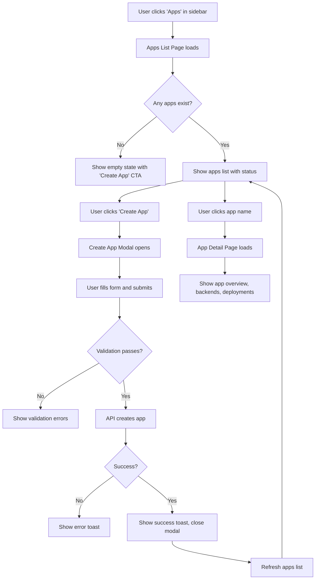

# Apps UI Implementation Plan

## Executive Summary

The backend already has complete App management capabilities via `/v1/apps` API endpoints, but the frontend lacks any UI for creating or managing Apps. This breaks the user flow since users cannot create apps through the dashboard.

## Current State Analysis

### Backend (Already Implemented)
- **API Endpoints** (`internal/api/routes.go`):
  - `GET /v1/apps` - List all apps
  - `POST /v1/apps` - Create new app
  - `GET /v1/apps/:appId` - Get app details
  - `GET /v1/apps/:appId/status` - Get app status
  - `GET /v1/apps/:appId/backends` - List app backends
  - `POST /v1/apps/:appId/backends` - Create backend
  - `POST /v1/apps/:appId/deploy` - Deploy app

- **Data Model** (`internal/storage/models_app.go`):
  - App: id, tenantId, name, slug, createdAt, updatedAt
  - Backend: id, appId, provider, region, url, sharedSecret, enabled, priority

### Frontend API Client (Already Implemented)
- **appsApi** (`web/dashboard/src/api/apps.ts`):
  - `list()` - Get all apps
  - `get(appId)` - Get app by ID
  - `create(data)` - Create new app
  - `getStatus(appId)` - Get app status with backends
  - `listBackends(appId)` - List backends
  - `createBackend(appId, data)` - Create backend

### Frontend Types (Already Implemented)
- `App` interface: id, name, slug, tenantId, createdAt
- `CreateAppRequest`: name, slug
- `Backend`: id, provider, region, url, sharedSecret, priority
- `AppStatus`: app, backends
- `Deployment`: id, appId, provider, region, status, artifactUrl, deployedUrl

### What's Missing
1. ❌ No `/apps` route in App.tsx
2. ❌ No AppsPage or AppsListPage
3. ❌ No AppDetailPage
4. ❌ No CreateAppModal or CreateAppPage
5. ❌ No navigation item for "Apps" in Sidebar
6. ❌ No ROUTES.APPS constant

---

## Implementation Plan

### Phase 1: Core Infrastructure

#### 1.1 Add ROUTES constant
**File**: `web/dashboard/src/lib/constants.ts`

Add:
```typescript
APPS: "/apps",
APP_DETAIL: "/apps/:appId",
```

#### 1.2 Add App icon to Sidebar
**File**: `web/dashboard/src/components/layout/Sidebar.tsx`

Add `App` or `Building` icon import from lucide-react and add to navigation sections.

### Phase 2: Apps List Page

#### 2.1 Create AppsPage
**New File**: `web/dashboard/src/pages/AppsPage/index.tsx`

Components:
- Page header with "Apps" title and "Create App" button
- Apps list/grid view showing:
  - App name (link to detail)
  - App slug
  - Created date
  - Status indicator
  - Quick actions (view, delete)
- Empty state with CTA to create first app
- Loading and error states

#### 2.2 Add route
**File**: `web/dashboard/src/App.tsx`

Add import and route:
```typescript
import { AppsPage } from "@/pages/AppsPage";
// Add route in protected section:
<Route path="apps" element={<AppsPage />} />
```

### Phase 3: Create App Modal

#### 3.1 Create CreateAppModal component
**New File**: `web/dashboard/src/components/apps/CreateAppModal.tsx`

Features:
- Form fields:
  - App name (required, text input)
  - App slug (auto-generated from name, editable)
- Validation:
  - Name: required, 3-50 chars
  - Slug: required, lowercase, hyphens only, unique
- Submit button with loading state
- Error handling and display

#### 3.2 Integrate modal into AppsPage
- Add "Create App" button that opens modal
- Handle form submission with appsApi.create()

### Phase 4: App Detail Page

#### 4.1 Create AppDetailPage
**New File**: `web/dashboard/src/pages/AppDetailPage/index.tsx`

Sections:
1. **Header**: App name, slug, created date, status badge
2. **Overview Cards**:
   - Total functions count
   - Active backends count
   - Recent deployments
3. **Backends Panel**:
   - List of connected backends with status
   - Add backend button
   - Health indicators per backend
4. **Deployments Panel**:
   - Recent deployment history
   - Deployment status (pending, success, failed)
   - Rollback option
5. **Functions Panel**:
   - List of functions in this app
   - Quick links to function details

#### 4.2 Add route
**File**: `web/dashboard/src/App.tsx`

```typescript
<Route path="apps/:appId" element={<AppDetailPage />} />
```

### Phase 5: Navigation Integration

#### 5.1 Update Sidebar
**File**: `web/dashboard/src/components/layout/Sidebar.tsx`

Add to navigationSections:
```typescript
{
  title: "Management",
  items: [
    { path: ROUTES.APPS, label: "Apps", icon: Building },
    // existing items...
  ]
}
```

### Phase 6: Contextual Integration (Optional Enhancement)

#### 6.1 Update Function Editor to support app selection
**File**: `web/dashboard/src/pages/FunctionsPage/FunctionEditorPage.tsx`

When creating/editing a function, allow selecting an existing app or creating a new one.

---

## File Structure Summary

```
web/dashboard/src/
├── api/
│   └── apps.ts                    (EXISTING - no changes)
├── components/
│   ├── apps/
│   │   ├── CreateAppModal.tsx    (NEW)
│   │   └── AppCard.tsx           (NEW - optional)
│   └── layout/
│       └── Sidebar.tsx           (MODIFY - add Apps nav)
├── lib/
│   └── constants.ts              (MODIFY - add ROUTES.APPS)
├── pages/
│   ├── AppsPage/
│   │   └── index.tsx             (NEW)
│   └── AppDetailPage/
│       └── index.tsx             (NEW)
└── App.tsx                       (MODIFY - add routes)
```

---

## Mermaid: User Flow Diagram



---

## Implementation Priority

| Priority | Task | Complexity |
|----------|------|------------|
| P0 | Add ROUTES constant | Low |
| P0 | Create AppsPage with list | Medium |
| P0 | Add Apps route to App.tsx | Low |
| P1 | Create CreateAppModal | Medium |
| P1 | Integrate modal into AppsPage | Low |
| P1 | Add Apps to Sidebar navigation | Low |
| P2 | Create AppDetailPage | High |
| P2 | Add app detail route | Low |

---

## Dependencies & Considerations

1. **Authentication**: Uses existing auth store - no changes needed
2. **API Client**: Uses existing appsApi - no changes needed
3. **UI Components**: Reuse existing UI components (Card, Button, Modal, etc.)
4. **Styling**: Follows existing design system using Tailwind CSS
5. **Error Handling**: Uses existing toast notifications (sonner)
6. **Loading States**: Uses existing pattern with TanStack Query

---

## Testing Checklist

- [ ] Apps list loads and displays apps (or empty state)
- [ ] Create app modal opens and closes properly
- [ ] Form validation shows appropriate errors
- [ ] App creation succeeds and list updates
- [ ] App detail page shows correct information
- [ ] Backends can be listed
- [ ] Deployments can be viewed
- [ ] Navigation between pages works
- [ ] Responsive design works on mobile
