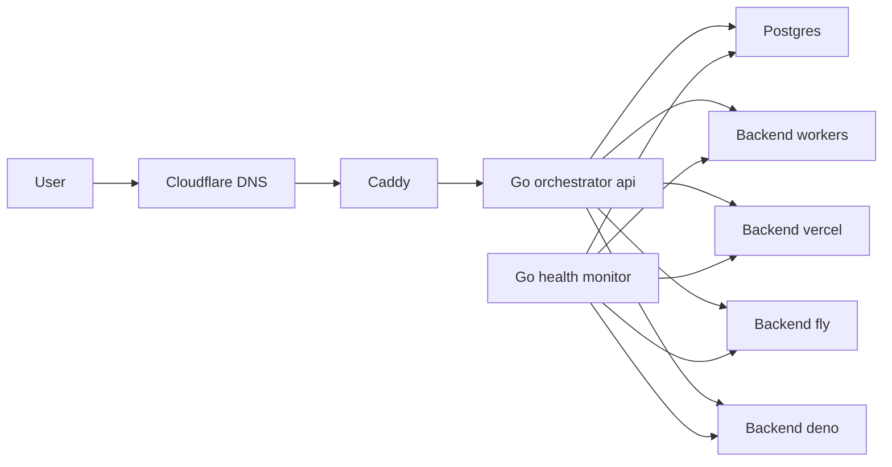
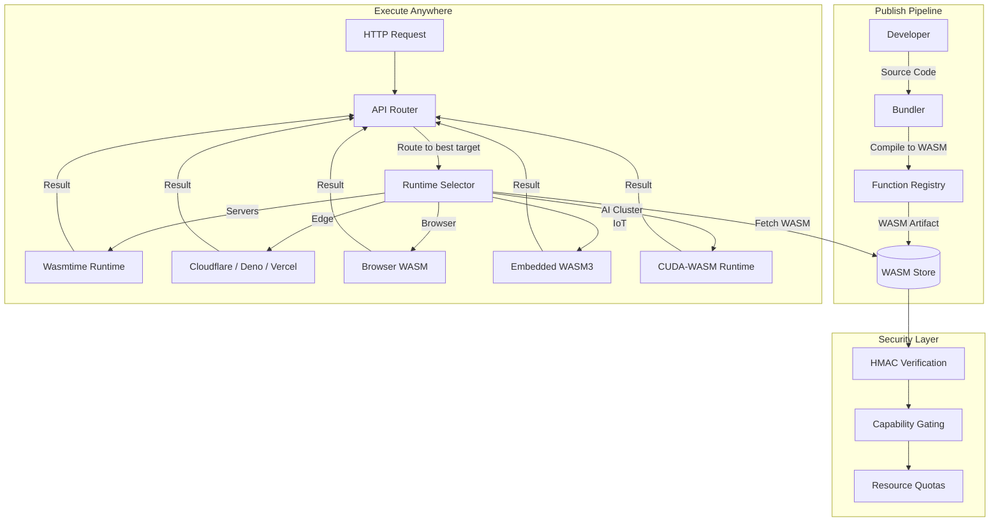
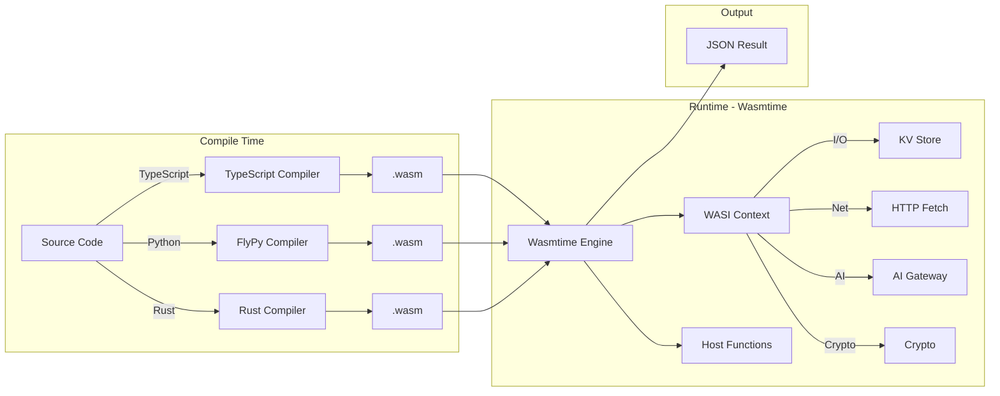
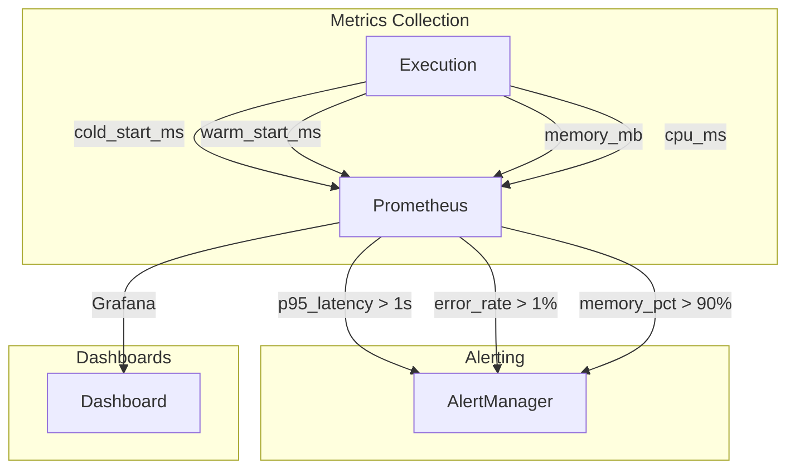

# FunctionFly Architecture

This document specifies the architecture for FunctionFly — **The Global Compute Fabric**.

## Vision: The Secret Weapon Runtime

> **WASM + Edge Runtime = Global Compute Fabric**

The most dangerous architecture for FunctionFly:

Functions compile to WebAssembly and run **everywhere**:

- **Servers** — High-performance dedicated hosting
- **Edge nodes** — Cloudflare Workers, Deno Deploy, Vercel Edge, Fly.io
- **Browsers** — Client-side execution with zero cold starts
- **IoT devices** — Embedded WASM runtimes on constrained hardware
- **AI clusters** — GPU-accelerated inference at the edge

This makes FunctionFly a **true global compute fabric** — not just a routing layer, but a unified execution platform that runs your code where it matters most.

---

## Architecture Phases

| Phase | Focus | Description |
|-------|-------|-------------|
| **MVP1** | Routing | Virtual edge layer routing to customer-provided backends |
| **Secret Weapon** | Execution | WASM + Edge runtime for universal code execution |

---

## MVP1: Virtual Edge Layer

### Goals (MVP1)

- Route incoming traffic to the best available customer-provided edge backend.
- Prefer stability and low tail latency via health checks, circuit breakers, and fast failover.
- Keep MVP1 secure and bootstrap-friendly by defaulting to BYO provider accounts and not storing provider tokens.

### Non-goals (MVP1)

- No multi-tenant code execution sandboxing (customers run their own edge targets).
- No automated deployments into customer provider accounts (MVP1 default).
- No global durable caching product (only provider-native caching + short TTL in orchestrator).

## High-level topology

### Control-plane (your infra)

- Go control-plane services
  - `orchestrator-api`: configuration, routing decisions, admin APIs
  - `health-monitor`: synthetic probing, state updates, circuit breaker transitions
- Postgres: source of truth
- Caddy: edge-facing reverse proxy and TLS termination
- Cloudflare DNS: public DNS for the platform

### Data-plane (customer compute)

Customers deploy “Edge Target” functions/apps into their own accounts:

- Cloudflare Workers
- Vercel (Edge Function or Serverless Function, depending on plan)
- Fly.io (small app, can be a proxy/handler)
- Deno Deploy

These targets expose a small, uniform HTTP surface that FunctionFly can probe and route to.

## Request flow

1. User requests arrive at Caddy for `/{appSlug}/*`.
2. Caddy forwards to `orchestrator-api` for a routing decision.
3. `orchestrator-api` selects the best backend using health + latency + circuit breaker state.
4. Caddy (or the orchestrator) proxies the request to the selected backend.
5. On error/timeout and for safe methods, instantly failover to next best backend.

## Routing approach

### Inputs

- Health status (last OK timestamp, last error, consecutive failures)
- Latency measurements
  - active probes (`/ping`)
  - passive measurements from real requests
- Coarse geo hint
  - request headers (when present)
  - provider edge location headers (when present)

### Scoring

Filter out backends in OPEN circuit state.

Compute score per candidate backend:

- `score = w1 * ewma_latency + w2 * error_rate + w3 * distance_penalty`

Pick the lowest score backend as primary, keep top-2 as ordered failover list.

### Circuit breaker

- OPEN when consecutive failures exceed threshold or error rate crosses threshold.
- HALF-OPEN after cooldown; allow limited test traffic.
- CLOSE after sufficient successes.

### Failover rules

- Default retry only for idempotent requests (`GET`, `HEAD`, `OPTIONS`).
- Allow opt-in retry for `POST` when customer marks endpoint idempotent.

## Storage model (Postgres)

Minimum tables:

- `tenants`, `users`
- `apps`
- `backends` (provider, region, url, enabled)
- `health_checks` (backend_id, ts, ok, status_code, latency_ms)
- `circuit_state` (backend_id, state, since_ts, fail_count)
- `routing_events` (app_id, backend_id, ts, latency_ms, outcome)

## Security model

- Tenant isolation with app-scoped API keys.
- JWT for dashboard session auth.
- HMAC request signing between orchestrator and customer edge targets.
- Rate limiting at Caddy (per app) and in Go API (per token).

## Mermaid overview



---

## The Secret Weapon Runtime: WASM + Edge

### Core Principle

**Compile once, run everywhere.** FunctionFly functions are compiled to WebAssembly and executed in a WASM runtime environment tailored to each target platform.

### Runtime Target Matrix

| Target | Runtime | Executor | Use Case | Cold Start | Isolation |
|--------|---------|----------|----------|------------|-----------|
| **Server** | Wasmtime (Rust) | `runtimes/local/` | High-throughput API functions | ~50ms | Process + WASM |
| **Cloudflare Workers** | V8 Isolates + WASM | workers-sdk | Global edge functions | <5ms | V8 isolate |
| **Deno Deploy** | Deno + WASM | `edge-targets/deno-deploy/` | TypeScript native | <10ms | Deno isolate |
| **Vercel Edge** | Edge Runtime + WASM | `@vercel/edge` | Serverless edge | <5ms | V8 isolate |
| **Fly.io** | Docker + Wasmtime | `edge-targets/functionfly-edge/` | Fly regions | ~100ms | Container |
| **Browser** | WebAssembly | Native browser WASM | Client-side execution | 0ms* | Tab sandbox |
| **IoT** | WASM3 / Wasmtime (minimal) | Embedded runtime | Constrained devices | ~500ms | MCU sandbox |
| **AI Cluster** | CUDA-WASM / WASM + GPU | Custom accelerator | ML inference | ~200ms | K8s pod |

*Browser execution has zero cold start for cached WASM modules.

### Supported Languages & Runtimes

| Language | Runtime | WASM Output | Status |
|----------|---------|-------------|--------|
| **Rust** | Native WASM | `.wasm` | ✅ Production |
| **Go** | TinyGo / WASM | `.wasm` | ✅ Production |
| **Python** | RustPython / CPython-WASM | `.wasm` | ✅ Production |
| **JavaScript/TypeScript** | Javy (QuickJS-WASM) | `.wasm` | 🔶 In Progress |
| **C/C++** | WASI SDK | `.wasm` | ✅ Production |
| **Java** | TeaVM-WASM | `.wasm` | 🔶 Planned |
| **C#** | Blazor WASM | `.wasm` | 🔶 Planned |

### Execution Flow: Global Compute Fabric



### WASM Runtime Architecture



### Instance Pooling Strategy

| Tier | Pool Strategy | Use Case |
|------|---------------|----------|
| **Hot** | Pre-warmed WASM instances, LRU eviction | High-traffic functions |
| **Warm** | Instance reuse up to N requests | Standard functions |
| **Cold** | Fresh instance per request | Infrequent functions |

### Resource Limits by Tier

| Resource | Starter | Pro | Enterprise |
|----------|---------|-----|------------|
| Memory | 128 MB | 512 MB | 4096 MB |
| CPU Time | 50 ms | 500 ms | 5000 ms |
| Concurrent | 5 | 50 | Unlimited |
| Storage | 1 MB | 100 MB | 10 GB |

### Edge Target Deployment

| Provider | Deployment Method | Runtime Binary | Status |
|----------|-------------------|-----------------|--------|
| Cloudflare Workers | wrangler | `functionfly-worker.wasm` | ✅ |
| Deno Deploy | deployctl | `functionfly-deno.wasm` | ✅ |
| Vercel Edge | `@vercel/edge` | `functionfly-vercel.wasm` | 🔶 |
| Fly.io | `fly deploy` | Docker + Wasmtime | ✅ |
| AWS Lambda@Edge | terraform | Lambda layer | 🔶 |
| Browser | CDN + module | `.wasm` direct | 🔶 |
| IoT | OTA update | WASM3 runtime | 🔶 |

### Security Model for WASM Execution

- **Capability-based security** — Functions declare required capabilities (`fetch`, `kv`, `email`, etc.) at publish time
- **HMAC request signing** — All function invocations are signed with timestamp validation
- **WASI capability gating** — Network access disabled by default; explicit opt-in per function
- **Resource quotas** — Per-function memory, CPU time, and concurrent execution limits
- **Deterministic execution** — Optional deterministic mode for AI/ML reproducibility

### Multi-Tenant Isolation

| Isolation Level | Technology | Use Case |
|-----------------|------------|----------|
| **WASM Memory** | Linear memory sandbox | All functions |
| **Process** | OS process per tenant | High-security |
| **MicroVM** | Firecracker | Enterprise |
| **Container** | Docker | Legacy compatibility |

### Metrics & Observability



### API Extensions for Secret Weapon Runtime

```
GET  /v1/functions/{id}/execute     - Execute function (existing)
POST /v1/functions/{id}/deploy     - Deploy to specific target
GET  /v1/runtime/targets           - List available targets
GET  /v1/runtime/targets/{target}  - Get target capabilities
POST /v1/execute                   - Multi-target execution
```
