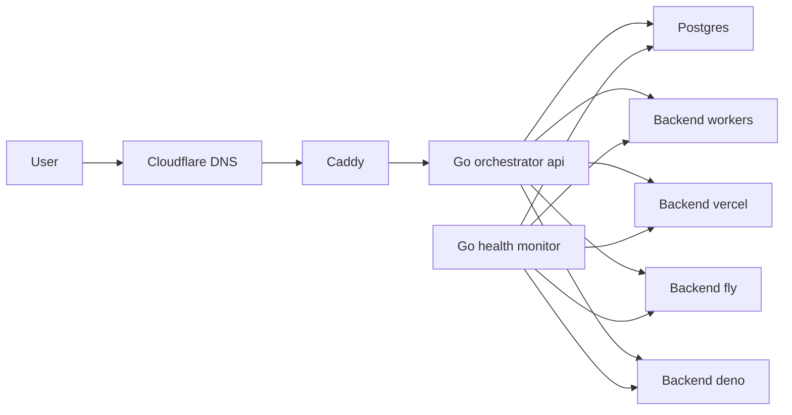

# FunctionFly (MVP1) Architecture

This document specifies the MVP1 architecture for the FunctionFly virtual edge layer.

## Goals

- Route incoming traffic to the best available customer-provided edge backend.
- Prefer stability and low tail latency via health checks, circuit breakers, and fast failover.
- Keep MVP1 secure and bootstrap-friendly by defaulting to BYO provider accounts and not storing provider tokens.

## Non-goals (MVP1)

- No multi-tenant code execution sandboxing (customers run their own edge targets).
- No automated deployments into customer provider accounts (MVP1 default).
- No global durable caching product (only provider-native caching + short TTL in orchestrator).

## High-level topology

### Control-plane (your infra)

- Go control-plane services
  - `orchestrator-api`: configuration, routing decisions, admin APIs
  - `health-monitor`: synthetic probing, state updates, circuit breaker transitions
- Postgres: source of truth
- Caddy: edge-facing reverse proxy and TLS termination
- Cloudflare DNS: public DNS for the platform

### Data-plane (customer compute)

Customers deploy “Edge Target” functions/apps into their own accounts:

- Cloudflare Workers
- Vercel (Edge Function or Serverless Function, depending on plan)
- Fly.io (small app, can be a proxy/handler)
- Deno Deploy

These targets expose a small, uniform HTTP surface that FunctionFly can probe and route to.

## Request flow

1. User requests arrive at Caddy for `/{appSlug}/*`.
2. Caddy forwards to `orchestrator-api` for a routing decision.
3. `orchestrator-api` selects the best backend using health + latency + circuit breaker state.
4. Caddy (or the orchestrator) proxies the request to the selected backend.
5. On error/timeout and for safe methods, instantly failover to next best backend.

## Routing approach

### Inputs

- Health status (last OK timestamp, last error, consecutive failures)
- Latency measurements
  - active probes (`/ping`)
  - passive measurements from real requests
- Coarse geo hint
  - request headers (when present)
  - provider edge location headers (when present)

### Scoring

Filter out backends in OPEN circuit state.

Compute score per candidate backend:

- `score = w1 * ewma_latency + w2 * error_rate + w3 * distance_penalty`

Pick the lowest score backend as primary, keep top-2 as ordered failover list.

### Circuit breaker

- OPEN when consecutive failures exceed threshold or error rate crosses threshold.
- HALF-OPEN after cooldown; allow limited test traffic.
- CLOSE after sufficient successes.

### Failover rules

- Default retry only for idempotent requests (`GET`, `HEAD`, `OPTIONS`).
- Allow opt-in retry for `POST` when customer marks endpoint idempotent.

## Storage model (Postgres)

Minimum tables:

- `tenants`, `users`
- `apps`
- `backends` (provider, region, url, enabled)
- `health_checks` (backend_id, ts, ok, status_code, latency_ms)
- `circuit_state` (backend_id, state, since_ts, fail_count)
- `routing_events` (app_id, backend_id, ts, latency_ms, outcome)

## Security model

- Tenant isolation with app-scoped API keys.
- JWT for dashboard session auth.
- HMAC request signing between orchestrator and customer edge targets.
- Rate limiting at Caddy (per app) and in Go API (per token).

## Mermaid overview

