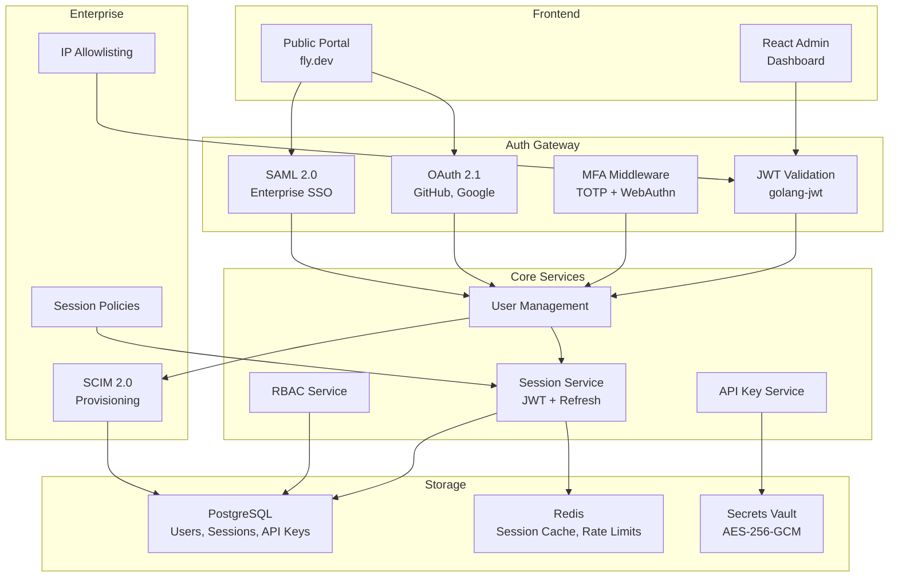
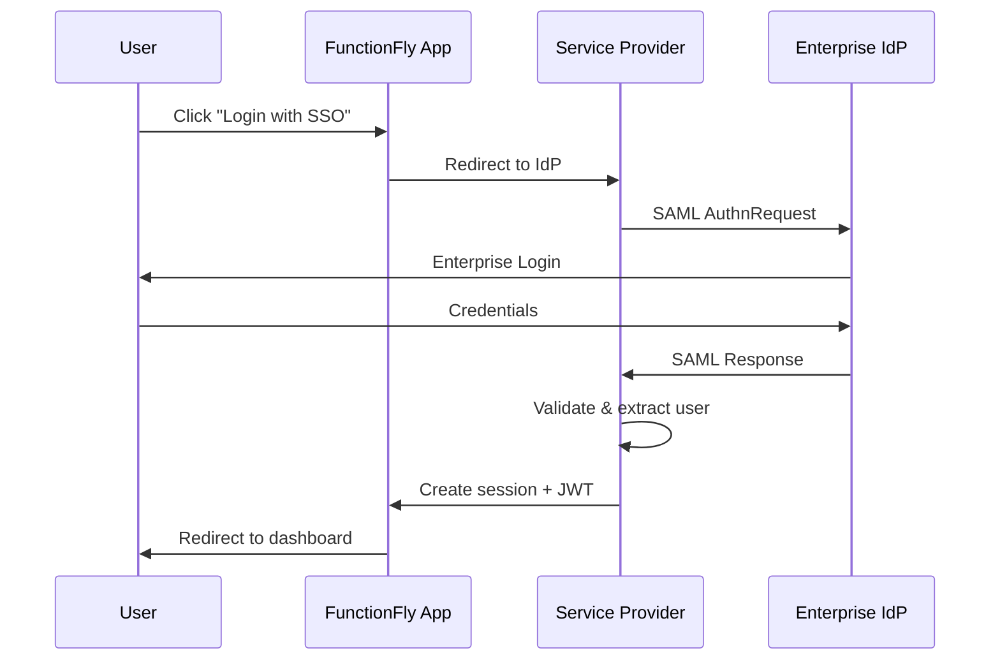

# FunctionFly 2026 Auth Stack - Complete Implementation Plan

## Executive Summary

Based on analysis of your codebase (Go backend, React admin dashboard, PostgreSQL + Redis), this plan provides a **hybrid approach** that builds on your existing robust auth system while adding modern 2026 capabilities and enterprise features.

**Key Decision**: Build your own auth (don't migrate to Clerk/Auth0) because:
- Your auth is already well-built
- You have custom requirements (API keys, secrets vault, agent identities)
- Full control over data and compliance
- No vendor lock-in

---

## Current State Analysis

### ✅ Your Auth Strengths

| Component | Status | Implementation |
|-----------|--------|----------------|
| JWT Tokens | ✅ Solid | golang-jwt/jwt v5, 30-min tokens |
| Email/Password | ✅ Working | bcrypt hashing, password strength validation |
| OAuth 2.1 | ✅ Working | GitHub, Google providers |
| TOTP MFA | ✅ Working | Full setup, verification, backup codes |
| Login Attempts | ✅ Working | Lockout after 5 failures, cleanup |
| Session Management | ✅ Working | JWT + refresh tokens |
| Password Reset | ✅ Working | Secure token-based flow |
| Email Verification | ✅ Working | Token-based verification |
| Rate Limiting | ✅ Robust | Per-user, per-tenant, global tiers |
| Input Validation | ✅ Comprehensive | Schema validation, XSS, SQL injection protection |
| Secrets Vault | ✅ Enterprise | AES-256-GCM encryption |
| Agent Auth | ✅ Unique | API key-based identity system |
| Audit Logging | ✅ Good | Vault audit, auth events |

### ⚠️ Gaps to Address

| Gap | Priority | Impact |
|-----|----------|--------|
| **WebAuthn/Passkeys** | High | 2026 passwordless standard |
| **Enterprise SSO** | High | SAML/OIDC for enterprises |
| **SCIM** | High | Automated user provisioning |
| **MFA Enforcement** | Medium | Currently optional |
| **IP Allowlisting** | Medium | Enterprise security |
| **Session Policies** | Medium | Configurable per-tenant |
| **Audit Export** | Low | SOC 2, ISO 27001 evidence |

---

## Architecture



---

## Implementation Phases

### Phase 1: Foundation (Q1 2026)

#### 1.1 Add WebAuthn/Passkeys

**Goal**: Enable passwordless authentication

**New Dependencies**:
```go
// go.mod additions
github.com/go-webauthn/webauthn v0.10.0
```

**Files to Create**:
- `internal/auth/webauthn.go` - WebAuthn registration/login
- `internal/api/handlers/auth/webauthn.go` - HTTP handlers
- `internal/storage/webauthn_credential_store.go` - Credential storage

**Database Schema**:
```sql
CREATE TABLE webauthn_credentials (
    id UUID PRIMARY KEY DEFAULT gen_random_uuid(),
    user_id UUID NOT NULL REFERENCES users(id),
    credential_id BYTEA NOT NULL,
    public_key BYTEA NOT NULL,
    sign_count INTEGER NOT NULL DEFAULT 0,
    backup_eligible BOOLEAN DEFAULT false,
    backup_state BOOLEAN DEFAULT false,
    created_at TIMESTAMP DEFAULT NOW(),
    last_used_at TIMESTAMP
);

CREATE INDEX idx_webauthn_user_id ON webauthn_credentials(user_id);
```

**API Endpoints**:
```
POST   /v1/auth/webauthn/register/begin
POST   /v1/auth/webauthn/register/complete
POST   /v1/auth/webauthn/login/begin
POST   /v1/auth/webauthn/login/complete
GET    /v1/auth/webauthn/credentials
DELETE /v1/auth/webauthn/credentials/{id}
```

**Frontend Changes** (`web/admin-dashboard/src`):
- Add WebAuthn registration UI
- Add passkey login option
- Update login page to support passkeys

---

#### 1.2 Enhance Audit Logging

**Goal**: Comprehensive audit trail for all auth events

**Database Schema**:
```sql
CREATE TABLE auth_audit_log (
    id UUID PRIMARY KEY DEFAULT gen_random_uuid(),
    tenant_id UUID REFERENCES tenants(id),
    user_id UUID REFERENCES users(id),
    event_type VARCHAR(50) NOT NULL,
    event_data JSONB DEFAULT '{}',
    ip_address INET,
    user_agent TEXT,
    success BOOLEAN NOT NULL DEFAULT true,
    failure_reason TEXT,
    created_at TIMESTAMP DEFAULT NOW()
);

CREATE INDEX idx_auth_audit_tenant_user ON auth_audit_log(tenant_id, user_id);
CREATE INDEX idx_auth_audit_created ON auth_audit_log(created_at);
```

**Events to Log**:
- login, login_failed, logout
- password_change, password_reset_request, password_reset_complete
- mfa_setup, mfa_verify, mfa_disable
- webauthn_register, webauthn_login, webauthn_delete
- session_create, session_expire, session_revoke
- api_key_create, api_key_use, api_key_revoke
- saml_login, scim_user_created, scim_user_deactivated

---

### Phase 2: Enterprise Core (Q2 2026)

#### 2.1 SAML 2.0 SSO

**Goal**: Enterprise single sign-on

**New Dependencies**:
```go
github.com/crewjam/saml v0.4.13
```

**Files to Create**:
- `internal/auth/saml.go` - SAML service provider
- `internal/api/handlers/auth/saml.go` - SAML endpoints
- `internal/storage/saml_session_store.go` - Session storage

**Database Schema**:
```sql
CREATE TABLE saml_configs (
    id UUID PRIMARY KEY DEFAULT gen_random_uuid(),
    tenant_id UUID NOT NULL REFERENCES tenants(id),
    enabled BOOLEAN DEFAULT false,
    idp_metadata XML,
    idp_entity_id VARCHAR(500),
    idp_sso_url VARCHAR(500),
    idp_certificate TEXT,
    sp_entity_id VARCHAR(500) DEFAULT 'functionfly',
    sp_acs_url VARCHAR(500),
    sp_metadata_url VARCHAR(500),
    name_id_format VARCHAR(100) DEFAULT 'emailAddress',
    authn_contexts TEXT[],
    created_at TIMESTAMP DEFAULT NOW(),
    updated_at TIMESTAMP DEFAULT NOW()
);

CREATE TABLE saml_sessions (
    id UUID PRIMARY KEY DEFAULT gen_random_uuid(),
    tenant_id UUID NOT NULL REFERENCES tenants(id),
    user_id UUID NOT NULL REFERENCES users(id),
    saml_name_id VARCHAR(255) NOT NULL,
    session_index VARCHAR(255) NOT NULL,
    not_on_or_after TIMESTAMP NOT NULL,
    attributes JSONB DEFAULT '{}',
    created_at TIMESTAMP DEFAULT NOW()
);
```

**API Endpoints**:
```
GET  /v1/auth/saml/metadata        -- SP metadata
POST /v1/auth/saml/sso              -- IdP callback
GET  /v1/auth/saml/login/{tenant_id}
POST /v1/auth/saml/slo              -- Single logout
GET  /v1/tenants/{id}/saml/config
PUT  /v1/tenants/{id}/saml/config
```

**SAML Flow**:


---

#### 2.2 SCIM 2.0 Provisioning

**Goal**: Automated user lifecycle management

**New Dependencies**:
```go
github.com/imulab/go-scim v0.3.0
```

**Database Schema**:
```sql
CREATE TABLE scim_configs (
    id UUID PRIMARY KEY DEFAULT gen_random_uuid(),
    tenant_id UUID NOT NULL REFERENCES tenants(id),
    enabled BOOLEAN DEFAULT false,
    idp_url VARCHAR(500),
    idp_token VARCHAR(500),
    secret_key BYTEA,  -- Encrypted
    sync_groups BOOLEAN DEFAULT true,
    sync_users BOOLEAN DEFAULT true,
    last_sync_at TIMESTAMP,
    created_at TIMESTAMP DEFAULT NOW(),
    updated_at TIMESTAMP DEFAULT NOW()
);

CREATE TABLE scim_sync_log (
    id UUID PRIMARY KEY DEFAULT gen_random_uuid(),
    tenant_id UUID NOT NULL REFERENCES tenants(id),
    direction VARCHAR(20),  -- inbound, outbound
    resource_type VARCHAR(50),
    resource_id VARCHAR(255),
    action VARCHAR(20),     -- create, update, delete
    success BOOLEAN,
    error_message TEXT,
    created_at TIMESTAMP DEFAULT NOW()
);
```

**SCIM Endpoints** (RFC 7644):
```
GET    /v1/scim/Users
POST   /v1/scim/Users
GET    /v1/scim/Users/{id}
PUT    /v1/scim/Users/{id}
PATCH  /v1/scim/Users/{id}
DELETE /v1/scim/Users/{id}
GET    /v1/scim/Groups
POST   /v1/scim/Groups
GET    /v1/scim/Groups/{id}
PATCH  /v1/scim/Groups/{id}
DELETE /v1/scim/Groups/{id}
```

**Supported Attributes**:
- User: userName, name, emails, phoneNumbers, displayName, active, groups, roles
- Group: displayName, members

---

### Phase 3: Enterprise Plus (Q3 2026)

#### 3.1 MFA Enforcement

**Goal**: Make MFA required for specific tenants/users

**Changes to Existing**:
- Update `internal/auth/mfa.go` with enforcement logic
- Add tenant settings for MFA policy

**Database Schema**:
```sql
ALTER TABLE tenants ADD COLUMN mfa_policy VARCHAR(20) DEFAULT 'optional';
-- optional, required, suspended

ALTER TABLE users ADD COLUMN mfa_enforced BOOLEAN DEFAULT false;
```

**Logic**:
```go
type MFARequirement int
const (
    MFAOptional MFARequirement = iota
    MFARequired
    MFASuspended
)

func (m *MFAService) IsMFARequiredForUser(userID uuid.UUID) (bool, error) {
    // Check user-level enforcement
    user, err := m.repo.GetUserByID(userID)
    if err != nil {
        return false, err
    }
    if user.MFAEnforced {
        return true, nil
    }
    
    // Check tenant-level enforcement
    tenant, err := m.repo.GetTenantByID(user.TenantID)
    if err != nil {
        return false, err
    }
    
    return tenant.MFAPolicy == "required", nil
}
```

---

#### 3.2 IP Allowlisting

**Goal**: Restrict access to corporate networks

**Database Schema**:
```sql
CREATE TABLE ip_allowlists (
    id UUID PRIMARY KEY DEFAULT gen_random_uuid(),
    tenant_id UUID NOT NULL REFERENCES tenants(id),
    name VARCHAR(255) NOT NULL,
    description TEXT,
    default_policy VARCHAR(20) DEFAULT 'deny',  -- allow, deny
    
    -- For users who need access outside corporate network
    mfa_required_for_unknown_ip BOOLEAN DEFAULT true,
    
    created_at TIMESTAMP DEFAULT NOW(),
    updated_at TIMESTAMP DEFAULT NOW()
);

CREATE TABLE ip_allowlist_entries (
    id UUID PRIMARY KEY DEFAULT gen_random_uuid(),
    allowlist_id UUID NOT NULL REFERENCES ip_allowlists(id),
    type VARCHAR(20) NOT NULL,  -- ip, cidr
    value VARCHAR(100) NOT NULL,  -- 192.168.1.1 or 10.0.0.0/8
    description TEXT,
    created_at TIMESTAMP DEFAULT NOW()
);
```

**Middleware Changes** (`internal/api/middleware/security.go`):
```go
func (sm *SecurityMiddleware) IPAllowlist(next http.HandlerFunc) http.HandlerFunc {
    return func(w http.ResponseWriter, r *http.Request) {
        // Get user from context
        user := middleware.GetUserFromContext(r)
        if user == nil {
            next(w, r)
            return
        }
        
        // Get tenant allowlist
        allowlist, err := sm.getIPAllowlist(user.TenantID)
        if err != nil || allowlist == nil {
            next(w, r)  // No allowlist configured
            return
        }
        
        clientIP := getClientIP(r)
        
        if sm.isIPAllowed(clientIP, allowlist) {
            next(w, r)
            return
        }
        
        // Check if MFA can grant access
        if allowlist.MFARequiredForUnknownIP && sm.isMFAVerified(r) {
            next(w, r)
            return
        }
        
        http.Error(w, "Access denied: IP not in allowlist", http.StatusForbidden)
    }
}
```

---

#### 3.3 Session Policies

**Goal**: Configurable session management

**Database Schema**:
```sql
ALTER TABLE tenants ADD COLUMN session_max_duration INT DEFAULT 1440;  -- minutes
ALTER TABLE tenants ADD COLUMN session_idle_timeout INT DEFAULT 480;  -- minutes
ALTER TABLE tenants ADD COLUMN concurrent_sessions INT DEFAULT 5;
ALTER TABLE tenants ADD COLUMN session_persistence VARCHAR(20) DEFAULT 'device';
```

**Session Management**:
```go
type SessionPolicy struct {
    MaxDuration       time.Duration `json:"max_duration"`
    IdleTimeout       time.Duration `json:"idle_timeout"`
    MaxConcurrent     int           `json:"max_concurrent"`
    RequireMFA        bool          `json:"require_mfa"`
    DevicePersistence bool          `json:"device_persistence"`
}

func (s *SessionService) EnforcePolicy(ctx context.Context, tenantID uuid.UUID, userID uuid.UUID) error {
    policy, err := s.getSessionPolicy(tenantID)
    if err != nil {
        return err
    }
    
    // Check concurrent sessions
    active, err := s.countActiveSessions(userID)
    if err != nil {
        return err
    }
    if active >= policy.MaxConcurrent {
        return ErrTooManySessions
    }
    
    return nil
}
```

---

### Phase 4: Compliance (Q4 2026)

#### 4.1 SIEM Integration

**Goal**: Export audit logs to security systems

**Supported Outputs**:
- Webhook (custom)
- AWS CloudWatch
- Azure Event Hub
- Google Cloud Logging
- Splunk HEC
- Datadog

**Implementation** (`internal/audit/siem.go`):
```go
type SIEMExporter interface {
    Export(events []AuditEvent) error
}

type WebhookExporter struct {
    URL     string
    Secret  string
    Client  *http.Client
}

func (e *WebhookExporter) Export(events []AuditEvent) error {
    payload, _ := json.Marshal(events)
    
    req, _ := http.NewRequest("POST", e.URL, bytes.NewReader(payload))
    req.Header.Set("Content-Type", "application/json")
    req.Header.Set("X-Signature", e.sign(payload))
    
    _, err := e.Client.Do(req)
    return err
}
```

**API Endpoints**:
```
GET  /v1/tenants/{id}/siem/config
PUT  /v1/tenants/{id}/siem/config
POST /v1/tenants/{id}/siem/test
GET  /v1/tenants/{id}/audit/export?from=&to=&format=json
```

---

#### 4.2 Compliance Reports

**Goal**: Generate evidence for audits

**Reports**:
- Access summary report
- Authentication events report
- MFA adoption report
- Session activity report
- API key usage report

**API Endpoints**:
```
GET /v1/tenants/{id}/reports/access-summary?period=30d
GET /v1/tenants/{id}/reports/auth-events?from=&to=
GET /v1/tenants/{id}/reports/mfa-adoption
```

---

## Integration with Existing Code

### Keep from Your Current System

✅ All of `internal/auth/*` (JWT, OAuth, MFA, password)
✅ `internal/storage/vault/*` (secrets, API keys)
✅ `internal/api/middleware/auth.go` (JWT validation)
✅ `internal/api/middleware/mfa.go` (MFA enforcement)
✅ `internal/api/handlers/auth/*` (login, signup, password reset)
✅ Agent identity system (`internal/agent/identity/*`)
✅ Rate limiting (`internal/api/middleware/execution_security.go`)

### Extend

🔄 `internal/auth/mfa.go` - Add WebAuthn verification
🔄 `internal/api/middleware/auth.go` - Add IP allowlist check
🔄 `internal/storage/repositories.go` - Add audit log queries

### Create New

🆕 `internal/auth/webauthn.go` - Passkey support
🆕 `internal/auth/saml.go` - Enterprise SSO
🆕 `internal/auth/scim.go` - User provisioning
🆕 `internal/audit/siem.go` - SIEM export

---

## Dependencies to Add

```go
// Phase 1
github.com/go-webauthn/webauthn v0.10.0

// Phase 2  
github.com/crewjam/saml v0.4.13
github.com/imulab/go-scim v0.3.0

// Phase 4
github.com/aws/aws-sdk-go-v2 v1.24.0  // For CloudWatch
```

---

## Data Migration Strategy

### Phase 1 - No Schema Changes Required
- WebAuthn credentials are additive
- Audit logs are additive

### Phase 2 - Additive Schema
- SAML configs are new tables
- SCIM configs are new tables
- No existing data migration

### Phase 3 - Small Migrations
```sql
-- Enable mfa_policy column
ALTER TABLE tenants ADD COLUMN IF NOT EXISTS mfa_policy VARCHAR(20) DEFAULT 'optional';

-- Enable session columns
ALTER TABLE tenants ADD COLUMN IF NOT EXISTS session_max_duration INT DEFAULT 1440;
ALTER TABLE tenants ADD COLUMN IF NOT EXISTS session_idle_timeout INT DEFAULT 480;
ALTER TABLE tenants ADD COLUMN IF NOT EXISTS concurrent_sessions INT DEFAULT 5;
```

---

## Testing Plan

### Unit Tests
- WebAuthn registration/complete flows
- SAML assertion parsing
- SCIM user mapping
- IP allowlist matching
- Session policy enforcement

### Integration Tests
- Full OAuth flow
- SAML login with test IdP (Okta/OneLogin)
- SCIM provisioning with test directory

### E2E Tests
- Complete user journey: signup → login → enable MFA → logout
- Enterprise journey: SAML setup → SSO login → user provisioning

---

## Rollout Strategy

### Phase 1 (Q1)
1. Deploy behind feature flag
2. Enable for internal testing
3. Gather feedback

### Phase 2 (Q2)
1. Enable SAML for beta enterprise customers
2. Test with real IdPs
3. Document setup guides

### Phase 3 (Q3)
1. Enable MFA enforcement for selected tenants
2. Launch IP allowlisting beta
3. Deploy session policies

### Phase 4 (Q4)
1. SOC 2 Type II evidence collection
2. ISO 27001 mapping
3. SIEM integrations

---

## Timeline Summary

| Phase | Timeline | Key Deliverables |
|-------|----------|------------------|
| Phase 1 | Q1 2026 | WebAuthn, Enhanced Audit |
| Phase 2 | Q2 2026 | SAML SSO, SCIM |
| Phase 3 | Q3 2026 | MFA Enforcement, IP Allowlist, Sessions |
| Phase 4 | Q4 2026 | SIEM, Compliance Reports |

---

## Cost Estimation

### Infrastructure
- Additional DB tables: ~1GB max
- Redis: Minimal increase
- No new services required

### Development
- Phase 1: ~2-3 weeks
- Phase 2: ~3-4 weeks
- Phase 3: ~3-4 weeks
- Phase 4: ~2-3 weeks

**Total**: ~10-14 weeks for full implementation
