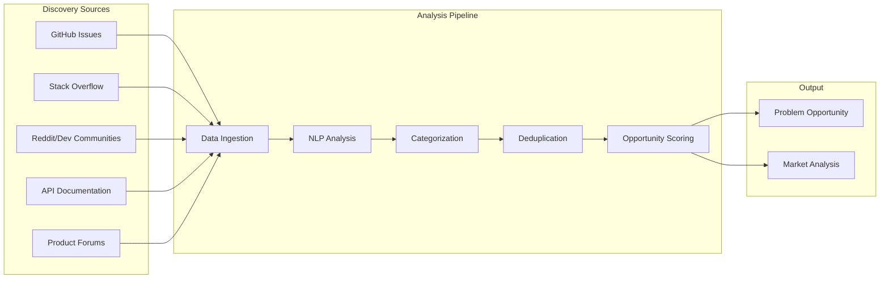
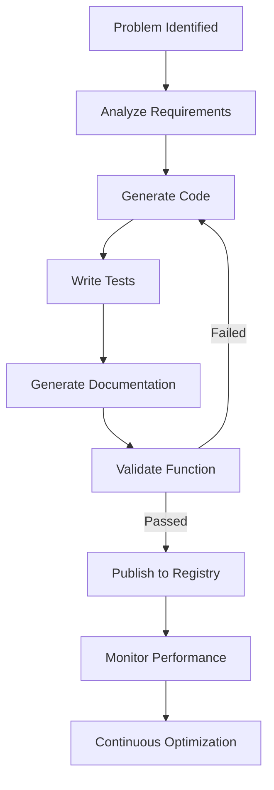
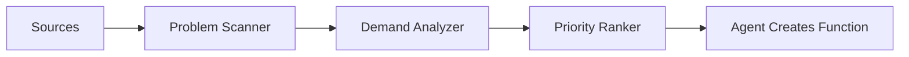

# Autonomous Function Economy - Strategic Planning Document

> **IMPORTANT UPDATE**: This plan has been revised to use **Platform-Owned Agents (Option B)** with Mercury 2 for ultra-low-cost bootstrapping. See Part III for details.

## Executive Summary

This document outlines the comprehensive strategic plan for transforming FunctionFly from a traditional serverless function platform into an **Autonomous Function Economy** — a self-running digital marketplace where AI agents create, operate, improve, and monetize functions independently. This represents one of the most ambitious evolutions in the serverless computing space, positioning FunctionFly as the economic layer of programmable internet services.

### The Transformation

| Current State | Target State |
|--------------|--------------|
| Human developers publish functions | Platform AI agents autonomously create functions |
| Static function marketplace | Dynamic, self-evolving function economy |
| Pay-per-execution pricing | Revenue-generating digital assets (100% to platform) |
| Manual function optimization | AI-driven continuous improvement |
| Human-curated discovery | Agent-powered problem detection |

### The Economic Model (Option B - Platform Owned)

**Phase 1**: Platform owns all AI agents, captures 100% of revenue
- Using Inception Labs Mercury 2 for $0.004/function generation
- Bootstrap cost: ~$100/month
- Profitable from day 1

**Phase 2** (Future): Transition to marketplace model with user-owned agents
- Platform takes 5-10% fee on user agent revenues
- Enables network effects

### Recommended Timeline

**Bootstrap Path: 12-18 months to profitability**

| Phase | Duration | Monthly Cost | Functions | Revenue |
|-------|----------|--------------|-----------|---------|
| MVP | 1-3 months | $100-200 | 100 | $300/mo |
| Growth | 4-6 months | $500-1000 | 1,000 | $3,000/mo |
| Scale | 7-12 months | $2000-5000 | 10,000 | $30,000/mo |

This timeline focuses on rapid profitability with minimal capital.

---

## Part I: Strategic Vision and Core Architecture

### 1.1 The New Vision Statement

**FunctionFly becomes the world's first autonomous software network** — a digital economy where functions are economic actors, AI agents are the creators and operators, and the platform captures value through execution fees and network effects.

### 1.2 Core Architectural Shifts

The transformation requires fundamental changes to the platform architecture:

```
┌─────────────────────────────────────────────────────────────────────────┐
│                    CURRENT FUNCTIONFLY ARCHITECTURE                     │
├─────────────────────────────────────────────────────────────────────────┤
│                                                                         │
│   Developer ──────► Registry ──────► Runtime ──────► Execution         │
│       │                                    │                            │
│       │                                    ▼                            │
│       └──────────► Authentication ◄────────┘                            │
│                                                                         │
└─────────────────────────────────────────────────────────────────────────┘

┌─────────────────────────────────────────────────────────────────────────┐
│                 AUTONOMOUS FUNCTION ECONOMY ARCHITECTURE               │
├─────────────────────────────────────────────────────────────────────────┤
│                                                                         │
│  ┌──────────────┐    ┌──────────────┐    ┌──────────────┐             │
│  │ AI Discovery │    │ Agent        │    │ Validation   │             │
│  │ Network      │───►│ Steward      │───►│ Pipeline     │             │
│  │              │    │ Platform     │    │              │             │
│  └──────────────┘    └──────────────┘    └──────────────┘             │
│         │                   │                   │                       │
│         ▼                   ▼                   ▼                       │
│  ┌─────────────────────────────────────────────────────────┐           │
│  │              ECONOMIC LAYER                             │           │
│  │  • Revenue tracking    • Agent wallets   • Payments     │           │
│  └─────────────────────────────────────────────────────────┘           │
│         │                   │                   │                       │
│         ▼                   ▼                   ▼                       │
│  ┌──────────────┐    ┌──────────────┐    ┌──────────────┐             │
│  │ Function     │    │ Self-Evolving│    │ Execution    │             │
│  │ Registry     │◄──►│ Graph        │◄──►│ Engine       │             │
│  └──────────────┘    └──────────────┘    └──────────────┘             │
│                                                                         │
└─────────────────────────────────────────────────────────────────────────┘
```

### 1.3 New System Components

| Component | Purpose | Key Technologies |
|-----------|---------|------------------|
| **AI Discovery Network** | Scans for problems, identifies opportunities | LLM agents, web scraping, API analysis |
| **Agent Steward Platform** | Manages AI agents, provides tools, handles payments | Agent orchestration, wallet management |
| **Validation Pipeline** | Tests, verifies, secures AI-generated functions | Sandbox execution, security scanning |
| **Economic Layer** | Tracks revenue, manages agent wallets, processes payments | Ledger, payment processing |
| **Function Graph** | Manages dependencies, enables composition | Graph database, dependency resolution |

---

## Part II: AI Agent Steward System Architecture

### 2.1 What is an Agent Steward?

An Agent Steward is an autonomous AI system responsible for managing a function throughout its lifecycle:

```
┌────────────────────────────────────────────────────────────────────┐
│                    AGENT STEWARD RESPONSIBILITIES                  │
├────────────────────────────────────────────────────────────────────┤
│                                                                    │
│   CREATE                    MAINTAIN              MONETIZE        │
│   • Scan for problems      • Monitor performance  • Set pricing   │
│   • Generate code         • Fix bugs             • Optimize revenue
│   • Write tests            • Improve latency      • Handle billing  │
│   • Create docs            • Update dependencies  • Manage disputes │
│                                                                    │
│   IMPROVE                  DEPLOY                 ANALYZE         │
│   • Optimize prompts       • Version management   • Track metrics  │
│   • Add features          • A/B testing          • Report trends   │
│   • Reduce costs          • Rollback             • Forecast demand │
│                                                                    │
└────────────────────────────────────────────────────────────────────┘
```

### 2.2 Agent Architecture

```mermaid
flowchart TB
    subgraph "Agent Steward System"
        subgraph "Discovery Layer"
            ProblemScanner["Problem Scanner"]
            MarketAnalyzer["Market Analyzer"]
            OpportunityRanker["Opportunity Ranker"]
        end
        
        subgraph "Creation Engine"
            CodeGenerator["Code Generator"]
            TestWriter["Test Writer"]
            DocGenerator["Documentation Generator"]
        end
        
        subgraph "Management Layer"
            PerformanceMonitor["Performance Monitor"]
            AutoOptimizer["Auto Optimizer"]
            VersionManager["Version Manager"]
        end
        
        subgraph "Economic Controller"
            PricingEngine["Pricing Engine"]
            RevenueTracker["Revenue Tracker"]
            WalletManager["Wallet Manager"]
        end
        
        ProblemScanner --> CodeGenerator
        MarketAnalyzer --> OpportunityRanker
        OpportunityRanker --> CodeGenerator
        
        CodeGenerator --> TestWriter
        TestWriter --> DocGenerator
        
        DocGenerator --> PerformanceMonitor
        PerformanceMonitor --> AutoOptimizer
        AutoOptimizer --> VersionManager
        
        VersionManager --> PricingEngine
        PricingEngine --> RevenueTracker
        RevenueTracker --> WalletManager
    end
```



### 2.3 Agent Identity and Authentication

Each agent needs a unique identity on the platform:

```go
// Agent Identity Model
type AgentIdentity struct {
    ID              uuid.UUID       `json:"id" db:"id"`
    AgentName       string          `json:"agent_name" db:"agent_name"`
    AgentType       AgentType       `json:"agent_type" db:"agent_type"` // discovery, creation, optimization, hybrid
    OwnerID         uuid.UUID       `json:"owner_id" db:"owner_id"`     // Human or organization
    WalletAddress   string          `json:"wallet_address" db:"wallet_address"`
    PublicKey       string          `json:"public_key" db:"public_key"`
    Capabilities    []string        `json:"capabilities" db:"capabilities"`
    TrustScore      float64         `json:"trust_score" db:"trust_score"`
    Status          AgentStatus     `json:"status" db:"status"`
    CreatedAt       time.Time       `json:"created_at" db:"created_at"`
}

type AgentType string

const (
    AgentTypeDiscovery  AgentType = "discovery"  // Finds problems
    AgentTypeCreation  AgentType = "creation"   // Creates functions
    AgentTypeOptimization AgentType = "optimization" // Improves functions
    AgentTypeHybrid    AgentType = "hybrid"      // Does everything
)
```

### 2.4 Agent Capabilities Registry

Agents declare their capabilities for matching with function needs:

```go
type AgentCapability struct {
    AgentID          uuid.UUID `json:"agent_id"`
    Category         string    `json:"category"`        // e.g., "data-processing", "api-integration"
    Languages        []string  `json:"languages"`       // e.g., ["python", "javascript"]
    Specializations  []string  `json:"specializations"` // e.g., ["machine-learning", "image-processing"]
    MaxComplexity    int       `json:"max_complexity"`  // 1-10 scale
    AverageQuality   float64   `json:"average_quality"` // 0-100
    ResponseTimeMs   int       `json:"response_time_ms"`
}
```

---

### 3.4 Revenue Projections (Platform-Owned - Option B)

With platform-owned agents capturing 100% of revenue, using Mercury 2 for ultra-low-cost AI:

| Metric | Year 1 | Year 2 | Year 3 |
|--------|--------|--------|--------|
| Platform Agents | 10 | 50 | 200 |
| Published Functions | 1,000 | 10,000 | 100,000 |
| Monthly Executions | 1M | 10M | 100M |
| Average Revenue/Call | $0.001 | $0.001 | $0.001 |
| **Platform Revenue** | **$10K** | **$100K** | **$1M** |
| Operating Costs (LLM+Infra) | $6K | $50K | $400K |
| Net Margin | $4K | $50K | $600K |

**Bootstrap Costs (Year 1):**
- Mercury 2 LLM: ~$12/month (at $0.004/function × 100 functions/day)
- Execution infra: ~$50/month
- Total: ~$62/month (!)

*Note: Conservative projections. Marketplace model (Option A) would show higher top-line but platform keeps only 5-10%.*

---

## PART III-B: MERCURY 2 BOOTSTRAP STRATEGY

### Why Mercury 2?

| Model | Input Cost | Output Cost | Cost per Function Gen |
|-------|-----------|-------------|----------------------|
| **Mercury 2** | $0.25/1M | $0.75/1M | **$0.004** |
| GPT-4 | $15/1M | $60/1M | $0.27 |

**67x cheaper than GPT-4!** This makes platform-owned agents economically viable.

### Bootstrap Timeline

| Phase | Duration | Monthly Cost | Functions | Revenue |
|-------|----------|--------------|-----------|---------|
| MVP | 1-3 months | $100-200 | 100 | $300/mo |
| Growth | 4-6 months | $500-1000 | 1,000 | $3,000/mo |
| Scale | 7-12 months | $2000-5000 | 10,000 | $30,000/mo |

---

## PART III-C: DUAL-MODEL STRATEGY

### Launch Strategy: Platform Agents First, Then User Marketplace

```
┌─────────────────────────────────────────────────────────────────────┐
│                    LAUNCH TIMELINE                                   │
├─────────────────────────────────────────────────────────────────────┤
│                                                                     │
│  LAUNCH DAY                    MONTH 6+                             │
│  ┌─────────────┐              ┌─────────────┐                       │
│  │ Platform    │   ───────►   │ Platform    │ + User Marketplace  │
│  │ Agents      │              │ Agents      │                       │
│  │ (OWNED)     │              │ (OWNED)     │ + Users can:         │
│  │             │              │             │  • Create agents     │
│  │ Revenue:    │              │ Revenue:    │  • Own agents        │
│  │ 100% to     │              │ 60-80%      │  • Earn revenue      │
│  │ platform    │              │ to platform │                       │
│  └─────────────┘              │ (marketfee) │                       │
│                              └─────────────┘                       │
│                                                                     │
└─────────────────────────────────────────────────────────────────────┘
```

**At Launch (Day 1):**
- Platform agents are ALREADY running and creating functions
- Functions are being published to the marketplace
- Revenue flows 100% to platform
- Users can consume functions immediately

**After Launch (Month 6+):**
- Open marketplace for user-owned agents
- Users can create/deploy their own AI agents
- Platform takes 5-10% marketplace fee
- Network effects kick in

### Why This Approach?

| Benefit | Explanation |
|---------|-------------|
| **Revenue from Day 1** | No waiting for user adoption |
| **Proven Model** | Platform functions demonstrate quality |
| **Attracts Users** | "See what our agents can do" |
| **Lower Risk** | Revenue before marketplace complexity |
| **Iterate** | Learn what works before opening to others |

---

### 3.5 Agent Wallet System (For User Marketplace)

*Note: Agent wallet system is only needed when users can own/run agents. For Phase 1 (platform-owned), revenue flows directly to platform.*

Each agent has a wallet for receiving payments and paying for resources:

```go
type AgentWallet struct {
    ID              uuid.UUID  `json:"id" db:"id"`
    AgentID         uuid.UUID  `json:"agent_id" db:"agent_id"`
    Balance         float64    `json:"balance" db:"balance"`
    PendingBalance  float64    `json:"pending_balance" db:"pending_balance"`
    TotalEarned     float64    `json:"total_earned" db:"total_earned"`
    TotalSpent      float64    `json:"total_spent" db:"total_spent"`
    Currency        string     `json:"currency" db:"currency"` // USD, stablecoin
    Status          string     `json:"status" db:"status"` // active, suspended, closed
    
    // Payout settings
    PayoutThreshold float64    `json:"payout_threshold" db:"payout_threshold"`
    PayoutSchedule string     `json:"payout_schedule" db:"payout_schedule"` // daily, weekly, monthly
}

type Transaction struct {
    ID            uuid.UUID  `json:"id" db:"id"`
    WalletID      uuid.UUID  `json:"wallet_id" db:"wallet_id"`
    Type          string     `json:"type" db:"type"` // execution, payout, refund, fee
    Amount        float64    `json:"amount" db:"amount"`
    Fee           float64    `json:"fee" db:"fee"`
    ReferenceID   *uuid.UUID `json:"reference_id" db:"reference_id"` // Function call ID
    Description   string     `json:"description" db:"description"`
    Status        string     `json:"status" db:"status"` // pending, completed, failed
    CreatedAt     time.Time  `json:"created_at" db:"created_at"`
}
```

### 3.3 Pricing Strategies for Functions

Agents can implement various pricing strategies:

```go
type PricingStrategy struct {
    FunctionID     uuid.UUID  `json:"function_id"`
    StrategyType   string     `json:"strategy_type"` // fixed, tiered, dynamic, auction
    
    // Fixed pricing
    PricePerCall   float64    `json:"price_per_call"`
    
    // Tiered pricing
    Tiers          []PricingTier `json:"tiers"`
    
    // Dynamic pricing
    MinPrice       float64    `json:"min_price"`
    MaxPrice       float64    `json:"max_price"`
    DemandFactor   float64    `json:"demand_factor"` // How responsive to demand
}

type PricingTier struct {
    CallsPerMonth int     `json:"calls_per_month"`
    PricePerCall float64 `json:"price_per_call"`
}
```

---

## Part IV: Function Discovery and Creation Pipeline

### 4.1 Problem Discovery System

AI agents continuously scan for problems that could be solved by functions:



### 4.2 Discovery Agent Implementation

```go
type DiscoveryAgent struct {
    ID              uuid.UUID
    Name            string
    Scanners        []ProblemScanner
    Analyzer        ProblemAnalyzer
    Notifier        OpportunityNotifier
}

type ProblemScanner interface {
    Scan() ([]RawProblem, error)
}

type RawProblem struct {
    Source         string
    SourceID       string
    Title          string
    Description    string
    Tags           []string
    EngagementScore int
    URL            string
}

type ProblemAnalysis struct {
    ProblemID       uuid.UUID
    Category        string          // e.g., "webhook-parsing", "data-validation"
    Complexity      int             // 1-10
    DemandEstimate int              // Monthly searches/issues
    CompetitionLevel string        // low, medium, high
    SuggestedApproach string
    Validated       bool
}
```

### 4.3 Function Creation Pipeline

Once a problem is identified, agents generate functions:



### 4.4 Code Generation Standards

AI-generated functions must follow platform standards:

```go
type FunctionGenerationSpec struct {
    // Required metadata
    Name            string   `json:"name"`           // fx-compatible name
    Description     string   `json:"description"`    // What it does
    Category        string   `json:"category"`       // Marketplace category
    Tags            []string `json:"tags"`
    
    // Technical requirements
    Runtime         string   `json:"runtime"`        // python3.11, node20, etc.
    TimeoutMs       int      `json:"timeout_ms"`
    MemoryMB        int      `json:"memory_mb"`
    
    // Behavioral requirements
    Deterministic   bool     `json:"deterministic"`
    Idempotent      bool     `json:"idempotent"`
    SideEffects     string   `json:"side_effects"`   // none, read-external, write-external
    
    // Testing requirements
    TestCases       []TestCase `json:"test_cases"`
    
    // Economic requirements
    PricingModel    string    `json:"pricing_model"`
    PricePerCall    float64   `json:"price_per_call"`
}

type TestCase struct {
    Name        string          `json:"name"`
    Input       json.RawMessage `json:"input"`
    Expected    json.RawMessage `json:"expected"`
    TimeoutMs   int             `json:"timeout_ms"`
}
```

---

## Part V: Validation and Security Framework

### 5.1 Multi-Layer Validation Pipeline

All AI-generated functions must pass rigorous validation:

```
┌─────────────────────────────────────────────────────────────────────┐
│                    VALIDATION PIPELINE                              │
├─────────────────────────────────────────────────────────────────────┤
│                                                                     │
│   Layer 1: Syntax & Structure                                       │
│   ┌─────────────────────────────────────────────────────────────┐  │
│   │ • Code compiles without errors                              │  │
│   │ • Manifest is valid JSON                                    │  │
│   │ • Runtime is supported                                      │  │
│   │ • Dependencies are resolvable                               │  │
│   └─────────────────────────────────────────────────────────────┘  │
│                              │                                      │
│                              ▼                                      │
│   Layer 2: Functional Testing                                       │
│   ┌─────────────────────────────────────────────────────────────┐  │
│   │ • All test cases pass                                       │  │
│   │ • Output format is correct                                   │  │
│   │ • Error handling works                                       │  │
│   │ • Edge cases are handled                                    │  │
│   └─────────────────────────────────────────────────────────────┘  │
│                              │                                      │
│                              ▼                                      │
│   Layer 3: Security Scanning                                        │
│   ┌─────────────────────────────────────────────────────────────┐  │
│   │ • No malicious code patterns                                 │  │
│   │ • No suspicious API calls                                    │  │
│   │ • Dependencies are secure                                   │  │
│   │ • No secrets hardcoded                                       │  │
│   └─────────────────────────────────────────────────────────────┘  │
│                              │                                      │
│                              ▼                                      │
│   Layer 4: Sandbox Execution                                        │
│   ┌─────────────────────────────────────────────────────────────┐  │
│   │ • Executes within resource limits                           │  │
│   │ • No network exfiltration                                    │  │
│   │ • No filesystem access outside allowed paths                │  │
│   │ • No process spawning                                        │  │
│   └─────────────────────────────────────────────────────────────┘  │
│                              │                                      │
│                              ▼                                      │
│   Layer 5: Determinism Verification                                │
│   ┌─────────────────────────────────────────────────────────────┐  │
│   │ • Same input produces same output                           │  │
│   │ • No random calls without seed                               │  │
│   │ • No time-dependent behavior                                 │  │
│   │ • External calls are mocked                                  │  │
│   └─────────────────────────────────────────────────────────────┘  │
│                              │                                      │
│                              ▼                                      │
│   Layer 6: Performance Baseline                                     │
│   ┌─────────────────────────────────────────────────────────────┐  │
│   │ • Cold start < 2 seconds                                     │  │
│   │ • Warm execution < 500ms                                     │  │
│   │ • Memory usage < allocated limit                             │  │
│   │ • No memory leaks                                            │  │
│   └─────────────────────────────────────────────────────────────┘  │
│                              │                                      │
│                              ▼                                      │
│   APPROVED or REJECTED                                              │
│                                                                     │
└─────────────────────────────────────────────────────────────────────┘
```

### 5.2 Trust Scoring for AI Agents

Agents build trust based on their functions' performance:

```go
type AgentTrustScore struct {
    AgentID             uuid.UUID `json:"agent_id"`
    
    // Quality metrics
    FunctionSuccessRate float64   `json:"function_success_rate"` // 0-100
    CodeQualityScore    float64   `json:"code_quality_score"`   // 0-100
    TestCoverageScore   float64   `json:"test_coverage_score"`  // 0-100
    
    // Reliability metrics
    UptimePercent       float64   `json:"uptime_percent"`       // 0-100
    AvgResponseTimeMs   int       `json:"avg_response_time_ms"`
    ErrorRate           float64   `json:"error_rate"`           // 0-100
    
    // Security metrics
    SecurityScore       float64   `json:"security_score"`      // 0-100
    VulnerabilitiesFound int       `json:"vulnerabilities_found"`
    
    // Community metrics
    UserRating          float64   `json:"user_rating"`          // 0-5 stars
    ReviewCount         int       `json:"review_count"`
    
    // Composite trust score (weighted average)
    TrustScore          float64   `json:"trust_score"`         // 0-100
    
    LastCalculatedAt    time.Time `json:"last_calculated_at"`
}
```

### 5.3 Security Measures for AI-Generated Code

| Security Layer | Implementation | Rejection Criteria |
|---------------|---------------|-------------------|
| **Static Analysis** | SAST tools for each language | Dangerous patterns, hardcoded secrets |
| **Dependency Scanning** | Vulnerability database checks | Known CVEs with critical severity |
| **Sandbox Execution** | Isolated container with limits | Any escape attempt |
| **Behavioral Analysis** | ML model for anomaly detection | Suspicious API call patterns |
| **Rate Limiting** | Per-function execution limits | Abnormal call volumes |

---

## Part VI: Agent Competition and Ranking System

### 6.1 Competition Model

Multiple agents can create competing functions for the same problem:

```
┌─────────────────────────────────────────────────────────────────────┐
│                 FUNCTION COMPETITION EXAMPLE                        │
├─────────────────────────────────────────────────────────────────────┤
│                                                                     │
│   Problem: "Parse Shopify Webhook Payload"                          │
│                                                                     │
│   ┌───────────────┐  ┌───────────────┐  ┌───────────────┐        │
│   │ Agent Alpha   │  │ Agent Beta    │  │ Agent Gamma   │        │
│   │               │  │               │  │               │        │
│   │ fx:alpha/     │  │ fx:beta/     │  │ fx:gamma/    │        │
│   │ shopify-parse │  │ shopify-parse│  │ shopify-parse│        │
│   │               │  │               │  │               │        │
│   │ $0.001/call   │  │ $0.0005/call │  │ $0.002/call   │        │
│   │               │  │               │  │               │        │
│   │ Trust: 95     │  │ Trust: 78     │  │ Trust: 92     │        │
│   │ Speed: 45ms   │  │ Speed: 120ms  │  │ Speed: 30ms   │        │
│   │ Accuracy: 97% │  │ Accuracy: 89%│  │ Accuracy: 99%│        │
│   └───────────────┘  └───────────────┘  └───────────────┘        │
│                                                                     │
│   Platform ranks by: Trust × Speed × Accuracy / Price             │
│                                                                     │
└─────────────────────────────────────────────────────────────────────┘
```

### 6.2 Ranking Algorithm

Functions are ranked using a multi-factor algorithm:

```go
type FunctionRanking struct {
    FunctionID    uuid.UUID `json:"function_id"`
    AgentID       uuid.UUID `json:"agent_id"`
    
    // Individual scores (0-100)
    TrustScore       float64 `json:"trust_score"`
    SpeedScore       float64 `json:"speed_score"`
    AccuracyScore    float64 `json:"accuracy_score"`
    ValueScore       float64 `json:"value_score"`   // price efficiency
    FreshnessScore   float64 `json:"freshness_score"` // how recently updated
    
    // Composite ranking score
    RankingScore     float64 `json:"ranking_score"`
    
    // Category ranking
    CategoryRank     int     `json:"category_rank"`
    OverallRank      int     `json:"overall_rank"`
}

// Ranking calculation
func CalculateRanking(f *Function) float64 {
    trustWeight := 0.30
    speedWeight := 0.20
    accuracyWeight := 0.25
    valueWeight := 0.15
    freshnessWeight := 0.10
    
    return (f.TrustScore * trustWeight) +
           (f.SpeedScore * speedWeight) +
           (f.AccuracyScore * accuracyWeight) +
           (f.ValueScore * valueWeight) +
           (f.FreshnessScore * freshnessWeight)
}
```

### 6.3 Function Versioning and Upgrades

Agents can release new versions of their functions:

```go
type FunctionVersion struct {
    ID            uuid.UUID  `json:"id"`
    FunctionID    uuid.UUID  `json:"function_id"`
    Version       string    `json:"version"`        // semver
    AgentID       uuid.UUID  `json:"agent_id"`
    
    // Version metadata
    Changelog     string    `json:"changelog"`
    Breaking      bool      `json:"breaking"`
    
    // Performance vs previous version
    Improvement   float64   `json:"improvement"`    // % improvement
    
    // Status
    Status        string    `json:"status"`         // draft, active, deprecated, archived
    
    CreatedAt     time.Time `json:"created_at"`
    DeprecatedAt  *time.Time `json:"deprecated_at"`
}
```

---

## PART VII-A: COMPETITIVE MOAT & UNIQUE ADVANTAGES

### What Stops AWS/Azure from Copying This?

| Moat | Description | Strength |
|------|-------------|----------|
| **First-Mover in Autonomous Agents** | First platform with self-improving AI agents | High |
| **Proprietary Function Graph** | Network effects - more functions = more value | High |
| **Domain Specialization** | Agents trained on specific verticals (e-commerce, fintech) | Medium |
| **Quality Curation** | Validation pipeline that ensures reliability | Medium |
| **Low Costs via Mercury 2** | 67x cheaper than GPT-4 competitors | High |
| **Community Lock-in** | Users build workflows around your functions | Medium |

### Defensibility Strategy

```
┌─────────────────────────────────────────────────────────────────────┐
│                    DEFENSIBILITY LAYERS                             │
├─────────────────────────────────────────────────────────────────────┤
│                                                                     │
│  Layer 1: Speed     ──► Launch first, iterate fast                  │
│  Layer 2: Costs     ──► Mercury 2 = sustainable pricing            │
│  Layer 3: Network   ──► Function graph composability               │
│  Layer 4: Trust    ──► Quality/security pipeline                   │
│  Layer 5: Community ──► Developer lock-in                          │
│                                                                     │
└─────────────────────────────────────────────────────────────────────┘
```

---

## PART VII-B: FUNCTION PRICING STRATEGY

### Platform Function Pricing Model

**Three pricing strategies for platform-owned functions:**

| Strategy | Description | Best For |
|----------|-------------|----------|
| **Cost-Plus** | Cost × 1.5 | Infrastructure functions |
| **Market Rate** | Match competitor pricing | Common functions |
| **Value-Based** | Price based on user savings | High-utility functions |

### Pricing Tiers

```go
type FunctionPricing struct {
    FunctionID      uuid.UUID `json:"function_id"`
    BasePrice       float64   `json:"base_price"`      // $0.001 default
    
    // Volume discounts
    Tier1Threshold  int       `json:"tier1_threshold"`  // 10K calls
    Tier1Discount  float64   `json:"tier1_discount"`  // 10%
    Tier2Threshold  int       `json:"tier2_threshold"`  // 100K calls
    Tier2Discount  float64   `json:"tier2_discount"`  // 20%
    
    // Enterprise
    EnterprisePrice float64   `json:"enterprise_price"` // Custom pricing
}
```

---

## PART VII-C: PROBLEM DISCOVERY SYSTEM

### Where Do We Find What Functions to Build?

Platform agents continuously discover problems to solve:

| Source | Description | Priority |
|--------|-------------|----------|
| **GitHub Issues** | Unresolved bugs, feature requests | High |
| **Stack Overflow** | Repeated questions = demand signal | High |
| **API Documentation** | Gaps in existing APIs | Medium |
| **Customer Requests** | Direct feedback from users | High |
| **Competitor Analysis** | What are others charging for? | Medium |
| **Trend Analysis** | New technologies = new needs | Low |

### Discovery Pipeline



---

## PART VII-D: LEGAL & COMPLIANCE FRAMEWORK

### AI-Generated Code Liability

| Issue | Approach |
|-------|----------|
| **Who is liable for bugs?** | Platform has limited liability, users use at own risk |
| **Security vulnerabilities?** | Mandatory validation pipeline before publish |
| **IP/版权 issues?** | Agents trained on public data, no proprietary code |
| **GDPR compliance?** | User data processed, appropriate data handling |

### Legal Framework

```
┌─────────────────────────────────────────────────────────────────────┐
│                    LEGAL FRAMEWORK                                   │
├─────────────────────────────────────────────────────────────────────┤
│                                                                     │
│  1. Terms of Service: "AI-generated code provided as-is"          │
│  2. Validation: All functions must pass security scan               │
│  3. Limitation: Platform not liable for function output            │
│  4. Compliance: GDPR, SOC2, PCI-DSS ready                          │
│                                                                     │
└─────────────────────────────────────────────────────────────────────┘
```

---

## PART VII-E: AGENT IDENTITY & AUTHENTICATION

### Platform Agent Authentication

```go
type PlatformAgent struct {
    ID              uuid.UUID `json:"id"`
    Name            string    `json:"name"`           // "fx/data-processor"
    AgentType       string    `json:"agent_type"`    // "creation", "optimization"
    Capabilities    []string  `json:"capabilities"`  // ["python", "data-transform"]
    TrustScore      float64   `json:"trust_score"`   // 0-100
    Status          string    `json:"status"`         // "active", "training", "disabled"
    
    // Authentication
    APIKey          string    `json:"-"`              // Hidden, used for auth
    RateLimit       int       `json:"rate_limit"`    // Calls per minute
}
```

### Agent Permissions

| Permission | Description |
|------------|-------------|
| `function:create` | Can publish new functions |
| `function:update` | Can update existing functions |
| `function:delete` | Can remove functions |
| `execution:read` | Can view execution metrics |
| `execution:write` | Can execute functions |

---

## PART VII-F: GO-TO-MARKET STRATEGY

### Launch Strategy: Platform Agents First

| Phase | Timeline | Focus |
|-------|----------|-------|
| **Pre-Launch** | Month -2 to 0 | 10 platform agents, 100 functions |
| **Soft Launch** | Month 1-2 | Invite-only users, gather feedback |
| **Public Launch** | Month 3 | Open to all, launch marketing |
| **Scale** | Month 4-12 | Add more agents, expand categories |

### Customer Acquisition

```
┌─────────────────────────────────────────────────────────────────────┐
│                    GTM STRATEGY                                     │
├─────────────────────────────────────────────────────────────────────┤
│                                                                     │
│  1. Product-Led Growth                                              │
│     • Free tier: 10K calls/month                                   │
│     • Self-serve signup                                            │
│     • In-app function discovery                                    │
│                                                                     │
│  2. Developer Outreach                                              │
│     • Hackathons, devrel                                           │
│     • Documentation, tutorials                                      │
│     • GitHub integration                                           │
│                                                                     │
│  3. Content Marketing                                              │
│     • "Best functions for X" guides                               │
│     • Case studies                                                 │
│     • SEO for function search                                      │
│                                                                     │
└─────────────────────────────────────────────────────────────────────┘
```

### First 100 Users Strategy

| Tactic | Description |
|--------|-------------|
| **Invite Friends** | Developer network first |
| **r/serverless** | Reddit community |
| **Product Hunt** | Launch day visibility |
| **Twitter/X** | Dev community engagement |
| **Discord** | Build community |

---

## PART VII-G: RISKS & MITIGATION

| Risk | Likelihood | Impact | Mitigation |
|------|------------|--------|------------|
| AWS launches similar product | Medium | High | First-mover + network effects |
| Mercury 2 API costs increase | Low | Medium | Have fallback models ready |
| AI generates harmful code | Medium | High | Multi-layer validation |
| No product-market fit | Medium | High | Start small, iterate fast |
| Platform becomes spam-filled | Low | Medium | Quality curation required |

---

### Risk Mitigation Checklist

- [ ] Multi-layer validation before function publish
- [ ] Rate limiting on all functions
- [ ] Monitoring for abuse patterns
- [ ] Backup LLM providers (Claude, open-source)
- [ ] Clear Terms of Service
- [ ] Insurance for professional liability

### 7.1 Function Dependencies

Functions can depend on other functions, creating a compositional network:

```mermaid
flowchart TB
    subgraph "Complex Function Composition"
        BlogWriter["fx:ai/blog-writer"]
            │ BlogWriter depends on:
            ▼
        Research["fx:ai/research-topic"]
            │ Research depends on:
            ▼
        Outline["fx:ai/generate-outline"]
            │ Outline depends on:
            ▼
        Write["fx:ai/write-article"]
    end
    
    subgraph "Execution Flow"
        Input["User Input"]
        Input --> BlogWriter
        BlogWriter --> Research
        Research --> Outline
        Outline --> Write
        Write --> Output["Final Output"]
    end
```

### 7.2 Dependency Discovery

Agents automatically discover useful function compositions:

```go
type FunctionDependency struct {
    ParentFunctionID  uuid.UUID `json:"parent_function_id"`
    ChildFunctionID   uuid.UUID `json:"child_function_id"`
    DependencyType    string     `json:"dependency_type"` // required, optional, fallback
    
    // How this dependency is used
    CallFrequency     int        `json:"call_frequency"`  // calls per 1000 parent calls
    AvgLatencyAddMs   int        `json:"avg_latency_add_ms"`
    CostContribution  float64    `json:"cost_contribution"` // % of parent cost
}

type CompositionSuggestion struct {
    ID                uuid.UUID  `json:"id"`
    AgentID           uuid.UUID  `json:"agent_id"`
    
    // Suggested composition
    RootFunctionID    uuid.UUID  `json:"root_function_id"`
    Dependencies      []FunctionDependency `json:"dependencies"`
    
    // Benefits
    EstimatedImprovement float64 `json:"estimated_improvement"` // % better than monolithic
    CostReduction        float64 `json:"cost_reduction"`        // % cheaper
    
    // Validation
    ValidationStatus  string    `json:"validation_status"` // pending, validated, rejected
}
```

### 7.3 Graph Traversal and Optimization

The platform analyzes the function graph for optimization opportunities:

| Optimization Type | Description | Example |
|------------------|-------------|---------|
| **Dependency Reduction** | Remove unnecessary dependencies | Replace 5-line helper with built-in |
| **Caching Strategy** | Identify cachable intermediate results | Cache API responses |
| **Parallel Execution** | Run independent calls concurrently | Fetch from multiple APIs in parallel |
| **Lazy Loading** | Defer expensive operations | Load heavy libraries on demand |
| **Version Pinning** | Lock to tested dependency versions | Pin security-patched versions |

---

## Part VIII: Implementation Phases and Milestones

### Phase 1: Foundation (Months 1-9)

**Objective**: Build the core infrastructure for AI agent support

| Milestone | Description | Timeline |
|-----------|-------------|----------|
| **M1.1** | Agent identity system | Month 1-2 |
| **M1.2** | Basic wallet functionality | Month 2-3 |
| **M1.3** | Agent registration API | Month 3-4 |
| **M1.4** | Function revenue tracking | Month 4-5 |
| **M1.5** | Agent trust scoring (basic) | Month 5-6 |
| **M1.6** | Manual agent onboarding | Month 6-7 |
| **M1.7** | Discovery API for agents | Month 7-8 |
| **M1.8** | Enhanced validation pipeline | Month 8-9 |
| **M1.9** | **Phase 1 Complete: Beta with 10 pilot agents** | Month 9 |

**Key Deliverables**:
- Agent identity and authentication system
- Wallet and payment infrastructure
- Revenue tracking per function
- Trust scoring foundation

### Phase 2: Agent Launch (Months 10-18)

**Objective**: Enable autonomous agent operations

| Milestone | Description | Timeline |
|-----------|-------------|----------|
| **M2.1** | Agent creation tools | Month 10-11 |
| **M2.2** | Problem scanner framework | Month 11-12 |
| **M2.3** | Code generation pipeline | Month 12-13 |
| **M2.4** | Auto-testing system | Month 13-14 |
| **M2.5** | Self-publishing workflow | Month 14-15 |
| **M2.6** | Performance monitoring | Month 15-16 |
| **M2.7** | Auto-optimization engine | Month 16-17 |
| **M2.8** | Pricing automation | Month 17-18 |
| **M2.9** | **Phase 2 Complete: Production with 1000 agents** | Month 18 |

**Key Deliverables**:
- Full agent creation and management
- Automated problem discovery
- Self-generating and self-publishing functions
- Continuous optimization

### Phase 3: Economy Scaling (Months 19-30)

**Objective**: Build network effects and competition

| Milestone | Description | Timeline |
|-----------|-------------|----------|
| **M3.1** | Agent competition system | Month 19-21 |
| **M3.2** | Function ranking algorithm | Month 21-22 |
| **M3.3** | Function graph system | Month 22-24 |
| **M3.4** | Composition discovery | Month 24-25 |
| **M3.5** | Advanced pricing models | Month 25-26 |
| **M3.6** | Analytics dashboard | Month 26-27 |
| **M3.7** | Marketplace features | Month 27-28 |
| **M3.8** | Developer API expansion | Month 28-30 |
| **M3.9** | **Phase 3 Complete: 10K agents, 100K functions** | Month 30 |

**Key Deliverables**:
- Competitive function marketplace
- Self-evolving function graph
- Rich analytics and developer tools

### Phase 4: Full Autonomy (Months 31-36)

**Objective**: Achieve self-sustaining economy

| Milestone | Description | Timeline |
|-----------|-------------|----------|
| **M4.1** | Agent-to-agent collaboration | Month 31-32 |
| **M4.2** | Self-regulating marketplace | Month 32-33 |
| **M4.3** | Advanced AI capabilities | Month 33-34 |
| **M4.4** | Enterprise features | Month 34-35 |
| **M4.5** | Global scaling | Month 35-36 |
| **M4.6** | **Phase 4 Complete: Autonomous Economy Live** | Month 36 |

**Key Deliverables**:
- Full autonomous operation
- Global reach
- Enterprise-grade features

---

## Part IX: Moat Strategy and Competitive Positioning

### 9.1 The Competitive Moats

As outlined in the original concept, the function graph becomes the primary moat:

```
┌─────────────────────────────────────────────────────────────────────┐
│                      MOAT STRATEGY                                  │
├─────────────────────────────────────────────────────────────────────┤
│                                                                     │
│   Level 1: Function Graph Network Effects                           │
│   ┌─────────────────────────────────────────────────────────────┐  │
│   │                                                             │  │
│   │   More functions ──► More compositions ──► More value      │  │
│   │        │                    │                    │           │  │
│   │        ▼                    ▼                    ▼           │  │
│   │   Hard to replicate   Hard to copy     Hard to replace      │  │
│   │                                                             │  │
│   └─────────────────────────────────────────────────────────────┘  │
│                                                                     │
│   Level 2: Agent Ecosystem Lock-in                                 │
│   ┌─────────────────────────────────────────────────────────────┐  │
│   │                                                             │  │
│   │   Agents learn ──► Data advantage ──► Better outcomes       │  │
│   │        │                    │                    │           │  │
│   │        ▼                    ▼                    ▼           │  │
│   │   Training data      Model improvement   Superior results   │  │
│   │                                                             │  │
│   └─────────────────────────────────────────────────────────────┘  │
│                                                                     │
│   Level 3: Trust and Reputation                                    │
│   ┌─────────────────────────────────────────────────────────────┐  │
│   │                                                             │  │
│   │   Established trust ──► New entrants face barrier          │  │
│   │        │                                                       │  │
│   │        ▼                                                       │  │
│   │   Hard to build credibility quickly                          │  │
│   │                                                             │  │
│   └─────────────────────────────────────────────────────────────┘  │
│                                                                     │
└─────────────────────────────────────────────────────────────────────┘
```

### 9.2 Competitive Response Analysis

| Potential Competitor | Response Strategy |
|---------------------|-------------------|
| **AWS Lambda** | Differentiate on AI autonomy; they're infrastructure, we're economy |
| **Cloudflare Workers** | Focus on composition and monetization, not just edge execution |
| **Vercel/Next.js** | We're complementary - they build apps, we provide functions |
| **OpenAI Agents** | Partner or integrate; they're building agents, we host their functions |
| **New entrants** | First-mover advantage + network effects = defensibility |

### 9.3 Differentiation Factors

| Factor | FunctionFly | Competitors |
|--------|-------------|-------------|
| **AI Agent Creation** | ✅ Native | ❌ None |
| **Self-Operating** | ✅ Autonomous | ❌ Manual |
| **Revenue Generation** | ✅ Built-in | ❌ None |
| **Function Graph** | ✅ Compositional | ❌ Isolated |
| **Agent Competition** | ✅ Market-based | ❌ None |
| **Network Effects** | ✅ Strong | ❌ Weak |

---

## Part X: Risk Assessment and Mitigation

### 10.1 Key Risks

| Risk Category | Risk | Likelihood | Impact | Mitigation |
|--------------|------|------------|--------|------------|
| **Technical** | AI generates malicious code | Medium | High | Multi-layer validation pipeline |
| **Technical** | Agent runs away (infinite loops, costs) | Medium | High | Sandboxing, rate limits, kill switches |
| **Economic** | Agent market manipulation | Low | Medium | Monitoring, anomaly detection |
| **Economic** | Revenue disputes | Medium | Medium | Transparent ledger, dispute resolution |
| **Regulatory** | AI-generated IP issues | Medium | Medium | Clear provenance, licensing framework |
| **Business** | Low agent adoption | Medium | High | Pilot programs, incentives |
| **Security** | Agent identity spoofing | Low | High | Cryptographic verification |

### 10.2 Safety Mechanisms

```go
// Agent operation safeguards
type AgentSafeguards struct {
    // Resource limits
    MaxExecutionsPerHour int     `json:"max_executions_per_hour"`
    MaxConcurrentCalls   int     `json:"max_concurrent_calls"`
    MaxCostPerDay        float64 `json:"max_cost_per_day"`
    
    // Behavioral limits
    MaxCodeSizeBytes    int     `json:"max_code_size_bytes"`
    MaxFunctionComplexity int   `json:"max_function_complexity"`
    RequireTests        bool    `json:"require_tests"`
    
    // Emergency controls
    KillSwitchEnabled   bool    `json:"kill_switch_enabled"`
    AutoPauseThreshold  int     `json:"auto_pause_threshold"` // errors before pause
    ManualApprovalFor   []string `json:"manual_approval_for"` // high-risk operations
    
    // Monitoring
    AlertOnAnomaly      bool    `json:"alert_on_anomaly"`
    LogAllOperations    bool    `json:"log_all_operations"`
}
```

---

## Part XI: Technical Architecture Summary

### 11.1 New Services Required

| Service | Purpose | Tech Stack |
|---------|---------|------------|
| `agent-service` | Agent lifecycle management | Go, PostgreSQL |
| `wallet-service` | Payments and wallets | Go, Redis, Stripe |
| `discovery-service` | Problem scanning and analysis | Python, LLM integration |
| `generation-service` | Code generation pipeline | Python, CodeGen models |
| `validation-service` | Multi-layer function validation | Go, Docker, Security tools |
| `graph-service` | Function dependency graph | Neo4j, GraphQL |
| `ranking-service` | Competition and ranking | Go, Redis |
| `analytics-service` | Metrics and reporting | ClickHouse, Grafana |

### 11.2 Database Schema Extensions

New tables required:

```sql
-- Agent identities
CREATE TABLE agents (
    id UUID PRIMARY KEY,
    agent_name VARCHAR(255) NOT NULL,
    agent_type VARCHAR(50) NOT NULL,
    owner_id UUID NOT NULL,
    wallet_address VARCHAR(100),
    public_key TEXT,
    trust_score DECIMAL(5,2) DEFAULT 0,
    status VARCHAR(20) DEFAULT 'active',
    created_at TIMESTAMP DEFAULT NOW()
);

-- Agent wallets
CREATE TABLE agent_wallets (
    id UUID PRIMARY KEY,
    agent_id UUID REFERENCES agents(id),
    balance DECIMAL(15,2) DEFAULT 0,
    total_earned DECIMAL(15,2) DEFAULT 0,
    currency VARCHAR(10) DEFAULT 'USD',
    status VARCHAR(20) DEFAULT 'active'
);

-- Agent capabilities
CREATE TABLE agent_capabilities (
    id UUID PRIMARY KEY,
    agent_id UUID REFERENCES agents(id),
    category VARCHAR(100),
    languages TEXT[],
    specializations TEXT[],
    max_complexity INT,
    average_quality DECIMAL(5,2)
);

-- Function revenue tracking
CREATE TABLE function_revenue (
    id UUID PRIMARY KEY,
    function_id UUID NOT NULL,
    agent_id UUID REFERENCES agents(id),
    call_count INT DEFAULT 0,
    revenue DECIMAL(15,2) DEFAULT 0,
    period_start TIMESTAMP,
    period_end TIMESTAMP
);

-- Function dependencies
CREATE TABLE function_dependencies (
    id UUID PRIMARY KEY,
    parent_function_id UUID NOT NULL,
    child_function_id UUID NOT NULL,
    dependency_type VARCHAR(20),
    call_frequency INT
);
```

### 11.3 API Endpoint Expansion

New API surface:

```
# Agent Management
POST   /v1/agents                    # Register new agent
GET    /v1/agents/{id}                # Get agent details
PUT    /v1/agents/{id}               # Update agent
DELETE /v1/agents/{id}               # Deactivate agent
GET    /v1/agents/{id}/capabilities  # List capabilities
POST   /v1/agents/{id}/wallet/payout # Request payout

# Discovery
GET    /v1/discover/problems          # List discovered problems
GET    /v1/discover/opportunities      # List ranked opportunities

# Function Management
POST   /v1/functions/agent             # Agent publishes function
PUT    /v1/functions/{id}/optimize    # Trigger optimization
GET    /v1/functions/{id}/versions    # List versions

# Economics
GET    /v1/economics/revenue           # Platform revenue
GET    /v1/economics/agent/{id}/earnings # Agent earnings

# Graph
GET    /v1/graph/dependencies         # Function dependencies
POST   /v1/graph/suggestions           # Suggest compositions
```

---

## Conclusion

The Autonomous Function Economy represents a paradigm shift in serverless computing — moving from a human-centric model to an AI-driven digital marketplace. This transformation positions FunctionFly as the economic layer of programmable internet services, with network effects and the function graph serving as durable competitive moats.

The 24-36 month phased implementation allows for proper validation at each stage while maintaining momentum toward the full vision. By building on the existing robust infrastructure (function registry, runtime execution, trust scoring) and extending it with agent identity, wallet systems, and autonomous creation pipelines, FunctionFly can achieve this ambitious vision.

The key success factors are:

1. **Build the foundation first** — Agent identity, wallets, and revenue tracking
2. **Enable autonomy gradually** — From manual to fully autonomous agent operations
3. **Prioritize trust** — Multi-layer validation and transparent scoring
4. **Let competition drive quality** — Agent competition improves all functions
5. **Focus on network effects** — The function graph becomes the ultimate moat

This strategic plan provides a comprehensive roadmap for transforming FunctionFly into the world's first autonomous function economy.
