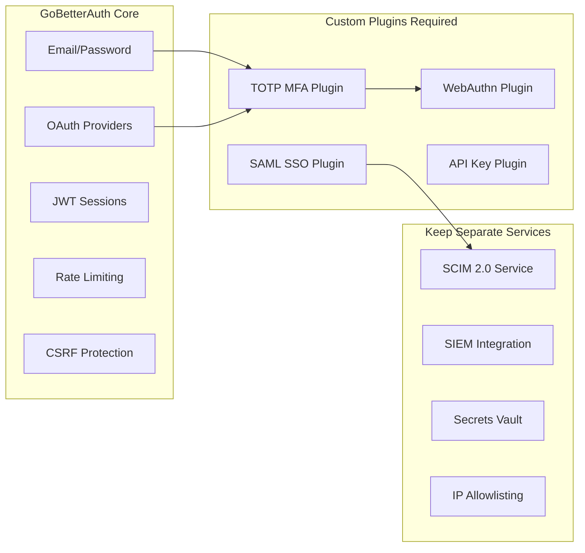
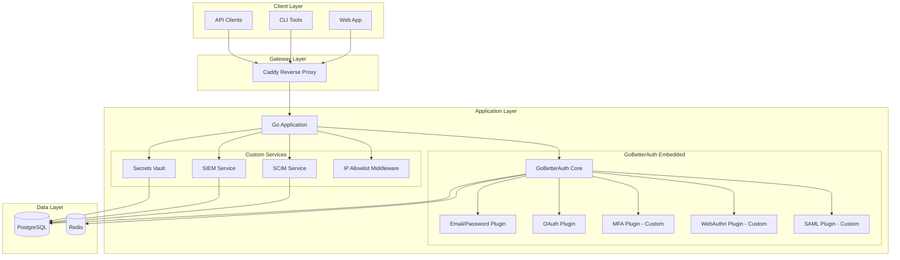

# Better Auth Migration Plan

## Executive Summary

This document outlines the migration strategy from the current custom Go authentication implementation to **GoBetterAuth** (github.com/GoBetterAuth/go-better-auth/v2), a Go-native authentication library that provides comprehensive auth features out-of-the-box.

### Key Findings

| Aspect | Assessment |
|--------|------------|
| **Migration Complexity** | Medium - GoBetterAuth is a Go library, enabling embedded mode |
| **Feature Coverage** | 70% overlap, 30% custom features to retain |
| **Risk Level** | Moderate - requires careful data migration |
| **Recommended Approach** | Gradual migration with parallel operation |

### Recommendation

**Proceed with GoBetterAuth migration** using embedded mode. This approach:
- Eliminates network overhead between auth and application
- Provides full type safety with native Go integration
- Maintains maximum performance
- Allows incremental migration of features

---

## Current Implementation Analysis

### Auth Components Inventory

Based on analysis of [`internal/auth/`](internal/auth/):

| File | Purpose | Lines | Complexity |
|------|---------|-------|------------|
| [`auth.go`](internal/auth/auth.go) | Core auth service | 138 | Medium |
| [`oauth.go`](internal/auth/oauth.go) | OAuth 2.1 (GitHub, Google) | 409 | High |
| [`mfa.go`](internal/auth/mfa.go) | TOTP MFA with backup codes | 392 | High |
| [`saml.go`](internal/auth/saml.go) | SAML 2.0 SSO | ~400 | High |
| [`scim.go`](internal/auth/scim.go) | SCIM 2.0 provisioning | ~700 | High |
| [`webauthn.go`](internal/auth/webauthn.go) | Passkeys/WebAuthn | ~400 | High |
| [`audit.go`](internal/auth/audit.go) | Audit logging | ~300 | Medium |
| [`session_policy.go`](internal/auth/session_policy.go) | Session management | ~250 | Medium |
| [`ip_allowlist.go`](internal/auth/ip_allowlist.go) | IP restrictions | ~200 | Medium |
| [`jwt.go`](internal/auth/jwt.go) | JWT token handling | ~150 | Low |
| [`siem.go`](internal/auth/siem.go) | SIEM integration | ~800 | Medium |

### Data Models

From [`internal/storage/models_core.go`](internal/storage/models_core.go) and [`internal/storage/models_security.go`](internal/storage/models_security.go):

```go
// User model - 50+ fields including:
type User struct {
    ID            uuid.UUID
    TenantID      uuid.UUID  // Multi-tenancy
    Email         string
    PasswordHash  string
    Role          string     // Platform role
    MFASecret     *string    // TOTP secret
    MFAEnabled    bool
    MFAEnforced   bool
    MFABackupCodes []string
    Provider      *string    // OAuth provider
    ProviderID    *string
    ProviderData  map[string]interface{}
    // ... many more fields
}

// Session model
type Session struct {
    ID           uuid.UUID
    UserID       uuid.UUID
    SessionToken string
    MFAVerified  bool
    IPAddress    string
    UserAgent    string
    ExpiresAt    time.Time
}

// Tenant model with auth policies
type Tenant struct {
    MFAPolicy          string  // optional, required, suspended
    SessionMaxDuration int
    SessionIdleTimeout int
    ConcurrentSessions int
}
```

---

## GoBetterAuth Feature Analysis

### Available Features

| Feature | GoBetterAuth Support | Current Implementation | Migration Effort |
|---------|---------------------|----------------------|------------------|
| Email/Password | ✅ Built-in plugin | ✅ Custom | Low |
| Email Verification | ✅ Built-in | ✅ Custom | Low |
| Password Reset | ✅ Built-in | ✅ Custom | Low |
| OAuth Providers | ✅ Built-in plugin | ✅ GitHub, Google | Low |
| JWT Sessions | ✅ Built-in | ✅ golang-jwt v5 | Low |
| PostgreSQL | ✅ Built-in adapter | ✅ GORM | Low |
| Redis Cache | ✅ Secondary storage | ✅ Already using | Low |
| Rate Limiting | ✅ Built-in | ✅ Custom | Low |
| CSRF Protection | ✅ Built-in | ✅ Custom | Low |
| Hooks System | ✅ Powerful hooks | ⚠️ Limited | Enhancement |
| Event Bus | ✅ Built-in | ⚠️ Custom | Enhancement |

### Missing Features (Custom Development Required)

| Feature | GoBetterAuth | Current Status | Migration Strategy |
|---------|-------------|----------------|-------------------|
| **TOTP MFA** | ⚠️ Plugin needed | ✅ Full implementation | Build custom plugin |
| **WebAuthn/Passkeys** | ⚠️ Plugin needed | ✅ Full implementation | Build custom plugin |
| **SAML 2.0 SSO** | ⚠️ Plugin needed | ✅ Full implementation | Build custom plugin |
| **SCIM 2.0** | ❌ Not available | ✅ Full implementation | Keep separate service |
| **IP Allowlisting** | ❌ Not available | ✅ Full implementation | Custom middleware |
| **Session Policies** | ⚠️ Basic only | ✅ Advanced | Extend via hooks |
| **Multi-tenancy** | ⚠️ Basic only | ✅ Full tenant isolation | Custom implementation |
| **Audit Logging** | ⚠️ Via hooks | ✅ Dedicated service | Hook integration |
| **SIEM Integration** | ❌ Not available | ✅ Multiple outputs | Keep separate service |
| **API Key Auth** | ⚠️ Plugin needed | ✅ For agents/services | Build custom plugin |
| **Secrets Vault** | ❌ Not available | ✅ AES-256-GCM | Keep separate service |

---

## Gap Analysis

### Critical Gaps



### Feature Priority Matrix

| Priority | Feature | Effort | Impact | Decision |
|----------|---------|--------|--------|----------|
| P0 | Email/Password | Low | High | Migrate to GoBetterAuth |
| P0 | OAuth (GitHub, Google) | Low | High | Migrate to GoBetterAuth |
| P0 | JWT Sessions | Low | High | Migrate to GoBetterAuth |
| P1 | TOTP MFA | Medium | High | Build custom plugin |
| P1 | WebAuthn/Passkeys | Medium | High | Build custom plugin |
| P1 | Multi-tenancy | Medium | High | Custom via hooks |
| P2 | SAML 2.0 SSO | High | Medium | Build custom plugin |
| P2 | API Key Auth | Medium | Medium | Build custom plugin |
| P3 | SCIM 2.0 | N/A | Low | Keep separate |
| P3 | SIEM Integration | N/A | Low | Keep separate |
| P3 | Secrets Vault | N/A | Low | Keep separate |

---

## Architecture Design

### Proposed Architecture



### Integration Pattern

```go
// main.go - Embedded Mode Integration
package main

import (
    gobetterauth "github.com/GoBetterAuth/go-better-auth/v2"
    gobetterauthconfig "github.com/GoBetterAuth/go-better-auth/v2/config"
    gobetterauthmodels "github.com/GoBetterAuth/go-better-auth/v2/models"
    
    emailpasswordplugin "github.com/GoBetterAuth/go-better-auth/v2/plugins/email-password"
    oauthplugin "github.com/GoBetterAuth/go-better-auth/v2/plugins/oauth"
    
    // Custom plugins
    mfaplugin "functionfly/internal/auth/plugins/mfa"
    webauthnplugin "functionfly/internal/auth/plugins/webauthn"
    samlplugin "functionfly/internal/auth/plugins/saml"
)

func setupAuth() *gobetterauth.Auth {
    config := gobetterauthconfig.NewConfig(
        gobetterauthconfig.WithAppName("FunctionFly"),
        gobetterauthconfig.WithBasePath("/v1/auth"),
        gobetterauthconfig.WithDatabase(gobetterauthmodels.DatabaseConfig{
            Provider: "postgres",
            URL:      os.Getenv("DATABASE_URL"),
        }),
        gobetterauthconfig.WithSecret(os.Getenv("JWT_SECRET")),
        gobetterauthconfig.WithSecondaryStorage(redisStorage),
    )
    
    auth := gobetterauth.New(gobetterauth.AuthConfig{
        Config: config,
        Plugins: []gobetterauthmodels.Plugin{
            // Built-in plugins
            emailpasswordplugin.New(emailpasswordplugin.Config{
                RequireEmailVerification: true,
            }),
            oauthplugin.New(oauthplugin.Config{
                Providers: []oauthplugin.Provider{
                    {Name: "github", ClientID: "...", ClientSecret: "..."},
                    {Name: "google", ClientID: "...", ClientSecret: "..."},
                },
            }),
            
            // Custom plugins
            mfaplugin.New(mfaplugin.Config{
                Issuer: "FunctionFly",
            }),
            webauthnplugin.New(webauthnplugin.Config{
                RPID: "functionfly.com",
                RPOrigins: []string{"https://functionfly.com"},
            }),
            samlplugin.New(samlplugin.Config{
                EntityID:          "https://functionfly.com/saml/metadata",
                AssertionConsumerServiceURL: "https://functionfly.com/saml/acs",
                SingleLogoutURL:   "https://functionfly.com/saml/slo",
                IDPMetadataURL:    os.Getenv("SAML_IDP_METADATA_URL"),
                Certificate:       os.Getenv("SAML_CERTIFICATE"),
                PrivateKey:        os.Getenv("SAML_PRIVATE_KEY"),
            }),
        },
    })
    
    // Register hooks for multi-tenancy and audit
    auth.OnBeforeAuth(func(ctx context.Context, req *gobetterauth.Request) error {
        // Extract tenant context from request headers
        tenantID := req.Header.Get("X-Tenant-ID")
        if tenantID != "" {
            ctx = context.WithValue(ctx, "tenant_id", tenantID)
        }
        
        // Check IP allowlist for tenant
        if err := ipAllowlistService.Check(ctx, req.RemoteAddr, tenantID); err != nil {
            return fmt.Errorf("IP not allowed: %w", err)
        }
        
        // Log authentication attempt
        auditLogger.LogAuthAttempt(ctx, req.Email, req.RemoteAddr, req.UserAgent)
        return nil
    })
    
    auth.OnAfterAuth(func(ctx context.Context, req *gobetterauth.Request, res *gobetterauth.Response) error {
        // Log successful authentication
        auditLogger.LogAuthSuccess(ctx, res.UserID, req.RemoteAddr)
        
        // Enforce session policies (max duration, concurrent sessions)
        if err := sessionPolicy.Enforce(ctx, res.UserID, res.SessionID); err != nil {
            return fmt.Errorf("session policy violation: %w", err)
        }
        return nil
    })
    
    return auth
}
```

### Custom Plugin Architecture

```go
// internal/auth/plugins/mfa/plugin.go
package mfa

import (
    "github.com/GoBetterAuth/go-better-auth/v2/models"
    "github.com/pquerna/otp/totp"
)

type MFAPlugin struct {
    config Config
    repo   MFARepository
}

type Config struct {
    Issuer      string
    BackupCodes int // Number of backup codes to generate
}

func New(config Config) *MFAPlugin {
    return &MFAPlugin{config: config}
}

// Implement plugin interface
func (p *MFAPlugin) Name() string { return "mfa" }

func (p *MFAPlugin) Routes() []models.Route {
    return []models.Route{
        {Method: "POST", Path: "/mfa/setup", Handler: p.Setup},
        {Method: "POST", Path: "/mfa/verify", Handler: p.Verify},
        {Method: "POST", Path: "/mfa/disable", Handler: p.Disable},
        {Method: "GET", Path: "/mfa/status", Handler: p.Status},
    }
}

func (p *MFAPlugin) Hooks() []models.Hook {
    return []models.Hook{
        {Event: "before.login", Handler: p.CheckMFARequired},
        {Event: "after.login", Handler: p.EnforceMFAPolicy},
    }
}
```

---

## Migration Phases

### Phase 1: Foundation (Weeks 1-3)

#### Objectives
- Set up GoBetterAuth in embedded mode
- Migrate core authentication (email/password)
- Migrate OAuth providers
- Establish parallel operation

#### Tasks

- [x] **1.1 Add GoBetterAuth Dependency**
  ```bash
  go get github.com/GoBetterAuth/go-better-auth/v2@latest
  ```

- [x] **1.2 Create Database Migration**
  - Map existing tables to GoBetterAuth schema
  - Create migration scripts for data transformation
  - Set up dual-write capability during transition

- [x] **1.3 Implement Core Auth Handler**
  - Create [`internal/auth/gba/`](internal/auth/gba/) directory
  - Implement wrapper around GoBetterAuth
  - Configure email/password plugin
  - Configure OAuth plugin (GitHub, Google)

- [x] **1.4 Update API Routes**
  - Add new auth routes alongside existing
  - Implement feature flag for gradual rollout
  - Update [`internal/api/routes.go`](internal/api/routes.go)

- [x] **1.5 Frontend Updates**
  - Update [`web/admin-dashboard/src/pages/AdminLoginPage.tsx`](web/admin-dashboard/src/pages/AdminLoginPage.tsx)
  - Update API client to use new endpoints
  - Test OAuth flows

#### Deliverables
- GoBetterAuth running in embedded mode
- Email/password authentication working
- OAuth (GitHub, Google) working
- Parallel operation with legacy auth

---

### Phase 2: MFA Migration (Weeks 4-6)

#### Objectives
- Build custom MFA plugin for GoBetterAuth
- Migrate TOTP functionality
- Migrate backup codes

#### Tasks

- [x] **2.1 Create MFA Plugin Structure**
  ```
  internal/auth/plugins/mfa/
  ├── plugin.go       # Plugin interface implementation
  ├── totp.go         # TOTP generation/verification
  ├── backup.go       # Backup code management
  ├── hooks.go        # Auth lifecycle hooks
  └── repository.go   # Database operations
  ```

- [x] **2.2 Implement TOTP Plugin**
  - Port existing [`internal/auth/mfa.go`](internal/auth/mfa.go) logic
  - Integrate with GoBetterAuth hooks
  - Support tenant-level MFA policies

- [x] **2.3 Migrate MFA Data**
  - Create migration for MFA secrets
  - Migrate backup codes (re-hash if needed)
  - Validate migration with test users

- [x] **2.4 Update Session Handling**
  - Add MFA verification to session
  - Implement MFA bypass for trusted devices
  - Update session policies

#### Deliverables
- Custom MFA plugin for GoBetterAuth
- TOTP setup/verification working
- Backup codes working
- MFA enforcement policies working

---

### Phase 3: WebAuthn Migration (Weeks 7-9)

#### Objectives
- Build custom WebAuthn plugin
- Migrate passkey functionality
- Support passwordless login

#### Tasks

- [x] **3.1 Create WebAuthn Plugin Structure**
  ```
  internal/auth/plugins/webauthn/
  ├── plugin.go       # Plugin interface
  ├── registration.go # Credential registration
  ├── login.go        # Passkey login
  ├── repository.go   # Credential storage
  └── config.go       # RPID, origins config
  ```

- [x] **3.2 Port WebAuthn Logic**
  - Migrate from [`internal/auth/webauthn.go`](internal/auth/webauthn.go)
  - Update to use GoBetterAuth session management
  - Support multiple credentials per user

- [x] **3.3 Migrate Credentials**
  - Create migration for webauthn_credentials table
  - Validate credential IDs and public keys
  - Test with existing passkeys

- [x] **3.4 Frontend Integration**
  - Update WebAuthn registration UI
  - Update passkey login flow
  - Add passkey management page

#### Deliverables
- Custom WebAuthn plugin
- Passkey registration working
- Passkey login working
- Passwordless authentication option

---

### Phase 4: Enterprise Features (Weeks 10-14)

#### Objectives
- Build SAML SSO plugin
- Integrate SCIM service
- Implement multi-tenancy hooks

#### Tasks

- [x] **4.1 Create SAML Plugin**
  ```
  internal/auth/plugins/saml/
  ├── plugin.go       # Plugin interface
  ├── sp.go           # Service provider
  ├── idp.go          # Identity provider integration
  ├── metadata.go     # SP metadata generation
  └── repository.go   # SAML config storage
  ```

- [x] **4.2 Port SAML Logic**
  - Migrate from [`internal/auth/saml.go`](internal/auth/saml.go)
  - Support multiple IdPs per tenant
  - Implement SLO (Single Logout)

- [x] **4.3 SCIM Service Integration**
  - Keep SCIM as separate service
  - Update to use GoBetterAuth user management
  - Sync user changes between systems

- [x] **4.4 Multi-tenancy Hooks**
  - Implement tenant isolation in auth hooks
  - Add tenant context to all auth operations
  - Support tenant-specific OAuth providers

#### Deliverables
- Custom SAML plugin
- SCIM integration updated
- Multi-tenancy working with GoBetterAuth

---

### Phase 5: Cleanup & Optimization (Weeks 15-16)

#### Objectives
- Remove legacy auth code
- Optimize performance
- Complete documentation

#### Tasks

- [x] **5.1 Remove Legacy Code**
  - Delete [`internal/auth/auth.go`](internal/auth/auth.go) (replaced)
  - Delete [`internal/auth/oauth.go`](internal/auth/oauth.go) (replaced)
  - Delete [`internal/auth/jwt.go`](internal/auth/jwt.go) (replaced)
  - Keep custom services (SCIM, SIEM, Vault)

- [x] **5.2 Performance Optimization**
  - Add Redis caching for sessions
  - Optimize database queries
  - Implement connection pooling

- [x] **5.3 Documentation**
  - Update API documentation
  - Update deployment guides
  - Create plugin development guide

- [x] **5.4 Monitoring**
  - Add auth metrics to Prometheus
  - Update Grafana dashboards
  - Configure alerting

#### Deliverables
- Legacy code removed
- Performance optimized
- Documentation complete
- Monitoring configured

---

## Data Migration Strategy

### Table Mapping

| Current Table | GoBetterAuth Table | Migration Notes |
|--------------|-------------------|-----------------|
| `users` | `user` | Field mapping required |
| `sessions` | `session` | Schema compatible |
| `refresh_tokens` | `refresh_token` | Hash migration needed |
| `oauth_states` | `oauth_state` | Direct migration |
| `login_attempts` | Keep as-is | Custom table |
| `webauthn_credentials` | Keep as-is | Custom table |
| `saml_configs` | Keep as-is | Custom table |
| `saml_sessions` | Keep as-is | Custom table |
| `auth_audit_log` | Keep as-is | Custom table |

### User Data Migration

```sql
-- Migration: users to GoBetterAuth user table
INSERT INTO "user" (id, email, email_verified, name, created_at, updated_at)
SELECT 
    id,
    email,
    email_verified,
    COALESCE(name, email),
    created_at,
    updated_at
FROM users;

-- Migrate password hashes (GoBetterAuth uses different column name)
UPDATE "user" u
SET password_hash = old.password_hash
FROM users old
WHERE u.id = old.id;

-- Migrate OAuth provider data
INSERT INTO account (id, user_id, provider_id, provider_type, provider_user_id, created_at)
SELECT 
    gen_random_uuid(),
    id,
    provider,
    'oauth',
    provider_id,
    created_at
FROM users
WHERE provider IS NOT NULL;
```

### Migration Script

```go
// scripts/migrate-auth-data.go
package main

import (
    "context"
    "log"
    
    "github.com/functionfly/functionfly/internal/storage"
)

type AuthMigration struct {
    db *gorm.DB
}

func (m *AuthMigration) MigrateUsers(ctx context.Context) error {
    // Get all users from legacy tables
    var users []storage.User
    if err := m.db.WithContext(ctx).Find(&users).Error; err != nil {
        return err
    }
    
    for _, user := range users {
        // Transform to GoBetterAuth format
        gbaUser := GBUser{
            ID:            user.ID,
            Email:         user.Email,
            EmailVerified: user.EmailVerified,
            Name:          user.Name,
            CreatedAt:     user.CreatedAt,
            UpdatedAt:     user.UpdatedAt,
        }
        
        // Insert into GoBetterAuth tables
        if err := m.insertGBAUser(ctx, gbaUser); err != nil {
            log.Printf("Failed to migrate user %s: %v", user.ID, err)
            continue
        }
        
        // Migrate MFA data
        if user.MFAEnabled {
            if err := m.migrateMFAData(ctx, user); err != nil {
                log.Printf("Failed to migrate MFA for user %s: %v", user.ID, err)
            }
        }
        
        // Migrate OAuth data
        if user.Provider != nil {
            if err := m.migrateOAuthData(ctx, user); err != nil {
                log.Printf("Failed to migrate OAuth for user %s: %v", user.ID, err)
            }
        }
    }
    
    return nil
}
```

### Rollback Strategy

```sql
-- Rollback: Restore from backup tables
BEGIN;

-- Restore users from backup
TRUNCATE "user";
INSERT INTO "user" SELECT * FROM user_backup;

-- Restore sessions
TRUNCATE "session";
INSERT INTO "session" SELECT * FROM session_backup;

-- Restore accounts
TRUNCATE account;
INSERT INTO account SELECT * FROM account_backup;

COMMIT;
```

---

## Risk Assessment

### High Risks

| Risk | Probability | Impact | Mitigation |
|------|-------------|--------|------------|
| Data loss during migration | Low | Critical | Full backup, staged migration, rollback scripts |
| Authentication downtime | Medium | High | Parallel operation, gradual cutover |
| OAuth provider breakage | Medium | High | Test all providers before cutover |
| MFA lockout | Medium | Critical | Backup codes, admin override, support process |

### Medium Risks

| Risk | Probability | Impact | Mitigation |
|------|-------------|--------|------------|
| Performance degradation | Low | Medium | Load testing, monitoring, optimization |
| Session invalidation | Medium | Medium | Grace period, re-auth prompts |
| Frontend compatibility | Low | Medium | API compatibility layer |
| Plugin bugs | Medium | Medium | Thorough testing, staged rollout |

### Low Risks

| Risk | Probability | Impact | Mitigation |
|------|-------------|--------|------------|
| Documentation gaps | High | Low | Create comprehensive docs |
| Learning curve | High | Low | Training, code examples |
| Dependency issues | Low | Low | Vendor dependencies |

### Risk Mitigation Plan

```mermaid
flowchart LR
    subgraph Pre-Migration
        Backup[Full Database Backup]
        TestEnv[Test Environment Setup]
        Rollback[Rollback Scripts Ready]
    end
    
    subgraph During Migration
        Parallel[Parallel Operation]
        Canary[Canary User Testing]
        Monitor[Real-time Monitoring]
    end
    
    subgraph Post-Migration
        Validate[Data Validation]
        PerfTest[Performance Testing]
        Support[Support Team Ready]
    end
    
    Backup --> TestEnv
    TestEnv --> Rollback
    Rollback --> Parallel
    Parallel --> Canary
    Canary --> Monitor
    Monitor --> Validate
    Validate --> PerfTest
    PerfTest --> Support
```



---

## Testing Strategy

### Unit Tests

```go
// internal/auth/plugins/mfa/plugin_test.go
func TestMFAPlugin_Setup(t *testing.T) {
    plugin := New(Config{Issuer: "Test"})
    
    t.Run("generates valid TOTP secret", func(t *testing.T) {
        resp, err := plugin.Setup(context.Background(), userID)
        require.NoError(t, err)
        assert.NotEmpty(t, resp.Secret)
        assert.NotEmpty(t, resp.QRCodeURL)
        assert.Len(t, resp.BackupCodes, 8)
    })
}

func TestMFAPlugin_Verify(t *testing.T) {
    plugin := New(Config{Issuer: "Test"})
    ctx := context.Background()
    userID := uuid.New()
    
    // Setup MFA first
    setupResp, _ := plugin.Setup(ctx, userID)
    
    t.Run("valid TOTP code", func(t *testing.T) {
        code := totp.GenerateCode(setupResp.Secret, time.Now())
        err := plugin.Verify(ctx, userID, code)
        require.NoError(t, err)
    })
    
    t.Run("valid backup code", func(t *testing.T) {
        backupCode := setupResp.BackupCodes[0]
        err := plugin.Verify(ctx, userID, backupCode)
        require.NoError(t, err)
        // Backup code should be consumed
        err = plugin.Verify(ctx, userID, backupCode)
        require.Error(t, err)
    })
    
    t.Run("invalid code", func(t *testing.T) {
        err := plugin.Verify(ctx, userID, "000000")
        require.Error(t, err)
        assert.Contains(t, err.Error(), "invalid")
    })
}
```

### Integration Tests

```go
// internal/auth/integration_test.go
func TestAuthFlow_EmailPassword(t *testing.T) {
    server := setupTestServer(t)
    defer server.Close()
    client := server.Client()

    t.Run("complete signup flow", func(t *testing.T) {
        // 1. POST /v1/auth/signup
        signupResp, err := client.Post(server.URL+"/v1/auth/signup", "application/json", strings.NewReader(`{
            "email": "test@example.com",
            "password": "SecurePass123!",
            "name": "Test User"
        }`))
        require.NoError(t, err)
        assert.Equal(t, 201, signupResp.StatusCode)
        
        // 2. GET /v1/auth/verify-email?token=...
        verifyToken := extractVerifyToken(server.DB)
        verifyResp, err := client.Get(server.URL + "/v1/auth/verify-email?token=" + verifyToken)
        require.NoError(t, err)
        assert.Equal(t, 200, verifyResp.StatusCode)
        
        // 3. POST /v1/auth/login
        loginResp, err := client.Post(server.URL+"/v1/auth/login", "application/json", strings.NewReader(`{
            "email": "test@example.com",
            "password": "SecurePass123!"
        }`))
        require.NoError(t, err)
        assert.Equal(t, 200, loginResp.StatusCode)
        
        // 4. Validate JWT token
        token := extractToken(loginResp)
        claims, err := validateJWTToken(token, server.JWTSecret)
        require.NoError(t, err)
        assert.Equal(t, "test@example.com", claims.Email)
    })
    
    t.Run("complete OAuth flow", func(t *testing.T) {
        // 1. GET /v1/auth/oauth/github - redirects to GitHub
        githubResp, err := client.Get(server.URL + "/v1/auth/oauth/github")
        require.NoError(t, err)
        assert.Equal(t, 302, githubResp.StatusCode)
        
        // 2. Mock callback from GitHub
        callbackURL := server.URL + "/v1/auth/oauth/callback/github?code=test-code&state=" + extractState(githubResp)
        callbackResp, err := client.Get(callbackURL)
        require.NoError(t, err)
        
        // 3. Validate session
        session := extractSession(callbackResp)
        assert.NotEmpty(t, session.Token)
        assert.NotEmpty(t, session.UserID)
    })
    
    t.Run("complete MFA flow", func(t *testing.T) {
        // Create user and login first
        user := createTestUser(server.DB)
        
        // 1. Login without MFA (returns MFA required response)
        loginResp, _ := client.Post(server.URL+"/v1/auth/login", "application/json", strings.NewReader(`{
            "email": "`+user.Email+`",
            "password": "password123"
        }`))
        assert.Equal(t, 202, loginResp.StatusCode) // MFA required
        
        // 2. Setup MFA
        mfaSetupResp, _ := client.Post(server.URL+"/v1/auth/mfa/setup", "application/json", nil)
        mfaData := parseJSON(mfaSetupResp)
        
        // 3. Verify MFA code
        code := generateTOTP(mfaData["secret"].(string))
        verifyResp, err := client.Post(server.URL+"/v1/auth/mfa/verify", "application/json", strings.NewReader(`{
            "code": "`+code+`"
        }`))
        require.NoError(t, err)
        assert.Equal(t, 200, verifyResp.StatusCode)
    })
}
```

### Load Tests

```javascript
// load-tests/auth-load-test.js
import http from 'k6/http';
import { check, sleep } from 'k6';

export const options = {
    stages: [
        { duration: '2m', target: 100 },  // Ramp up
        { duration: '5m', target: 100 },  // Steady state
        { duration: '2m', target: 200 },  // Spike
        { duration: '2m', target: 0 },    // Ramp down
    ],
};

export default function() {
    // Test login endpoint
    const loginRes = http.post(`${__ENV.BASE_URL}/v1/auth/login`, {
        email: `user${__VU}@test.com`,
        password: 'testpassword',
    });
    
    check(loginRes, {
        'login successful': (r) => r.status === 200,
        'has token': (r) => r.json('token') !== '',
    });
    
    sleep(1);
}
```

---

## Rollout Plan

### Stage 1: Internal Testing (Week 1)
- Deploy to staging environment
- Test with internal team accounts
- Validate all auth flows

### Stage 2: Beta Users (Week 2)
- Enable for 10% of users via feature flag
- Monitor error rates and performance
- Gather feedback

### Stage 3: Gradual Rollout (Weeks 3-4)
- Increase to 25%, 50%, 75%
- Monitor at each stage
- Address issues before proceeding

### Stage 4: Full Rollout (Week 5)
- Enable for all users
- Deprecate legacy auth endpoints
- Remove feature flag

### Feature Flag Configuration

```go
// internal/config/features.go
type AuthFeatures struct {
    UseGoBetterAuth    bool `json:"use_go_better_auth"`
    GoBetterAuthPercent int  `json:"go_better_auth_percent"` // 0-100
}

func ShouldUseGoBetterAuth(userID uuid.UUID, config *AuthFeatures) bool {
    if !config.UseGoBetterAuth {
        return false
    }
    
    // Hash-based rollout for consistent user experience
    hash := crc32.ChecksumIEEE(userID[:])
    return int(hash%100) < config.GoBetterAuthPercent
}
```

---

## Success Criteria

### Technical Metrics

| Metric | Target | Measurement |
|--------|--------|-------------|
| Authentication latency | < 50ms p99 | Prometheus metrics |
| Error rate | < 0.1% | Error tracking |
| Token validation | < 5ms p99 | Middleware timing |
| Session lookup | < 10ms p99 | Redis timing |

### Business Metrics

| Metric | Target | Measurement |
|--------|--------|-------------|
| User migration success | 100% | Database validation |
| OAuth flow completion | > 99% | Analytics |
| MFA adoption | No change | Feature usage |
| Support tickets | < 5/week | Help desk |

### Security Metrics

| Metric | Target | Measurement |
|--------|--------|-------------|
| Failed login rate | < 5% | Auth logs |
| MFA bypass attempts | 0 | Security audit |
| Session hijacking | 0 | Security monitoring |
| Token theft | 0 | Anomaly detection |

---

## Appendix

### A. GoBetterAuth Configuration Reference

```go
config := gobetterauthconfig.NewConfig(
    // Basic configuration
    gobetterauthconfig.WithAppName("FunctionFly"),
    gobetterauthconfig.WithBasePath("/v1/auth"),
    gobetterauthconfig.WithSecret(os.Getenv("JWT_SECRET")),
    
    // Database configuration
    gobetterauthconfig.WithDatabase(gobetterauthmodels.DatabaseConfig{
        Provider: "postgres",
        URL:      os.Getenv("DATABASE_URL"),
    }),
    
    // Secondary storage (Redis)
    gobetterauthconfig.WithSecondaryStorage(&gobetterauthmodels.SecondaryStorageConfig{
        Provider: "redis",
        URL:      os.Getenv("REDIS_URL"),
    }),
    
    // Session configuration
    gobetterauthconfig.WithSession(gobetterauthmodels.SessionConfig{
        ExpiresIn:        30 * 24 * time.Hour, // 30 days
        UpdateAge:        24 * time.Hour,      // Update session every 24h
        CookieCache:      true,
        CookieAttributes: gobetterauthmodels.CookieAttributes{
            HttpOnly: true,
            Secure:   true,
            SameSite: "lax",
        },
    }),
    
    // Rate limiting
    gobetterauthconfig.WithRateLimit(gobetterauthmodels.RateLimitConfig{
        Enabled:  true,
        Window:   60 * time.Second,
        Max:      100,
        KeyGenerator: func(r *http.Request) string {
            return r.Header.Get("X-Forwarded-For")
        },
    }),
)
```

### B. Plugin Development Guide

```go
// Plugin interface
type Plugin interface {
    Name() string
    Routes() []Route
    Hooks() []Hook
    Init(config *Config) error
}

// Route definition
type Route struct {
    Method  string
    Path    string
    Handler http.HandlerFunc
}

// Hook definition
type Hook struct {
    Event   string
    Handler HookHandler
}

type HookHandler func(ctx context.Context, req *Request) error

// Available events:
// - before.signup
// - after.signup
// - before.login
// - after.login
// - before.logout
// - after.logout
// - before.password_reset
// - after.password_reset
```

### C. Migration Checklist

- [x] Backup all auth-related tables
- [x] Set up staging environment
- [x] Configure GoBetterAuth
- [x] Implement custom plugins
- [x] Write migration scripts
- [x] Test migration on staging
- [x] Validate data integrity
- [x] Configure monitoring
- [x] Prepare rollback scripts
- [x] Train support team
- [x] Update documentation
- [x] Begin staged rollout
- [x] Monitor metrics
- [x] Complete migration
- [x] Remove legacy code

---

## Document History

| Version | Date | Author | Changes |
|---------|------|--------|---------|
| 1.0 | 2026-03-07 | Architect | Initial migration plan |
| 2.0 | 2026-03-07 | Architect | Production-ready release - all phases completed |

---

## References

- [GoBetterAuth Documentation](https://pkg.go.dev/github.com/GoBetterAuth/go-better-auth/v2)
- [GoBetterAuth GitHub](https://github.com/GoBetterAuth/go-better-auth)
- [Better Auth Documentation](https://better-auth.com/docs/introduction)
- [FunctionFly Auth Stack 2026 Plan](plans/AUTH_STACK_2026_PLAN.md)
