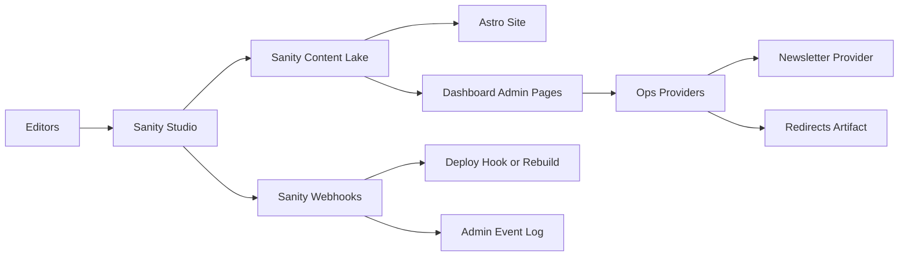

# Blog + Content Admin Project Plan (Hybrid Sanity + Dashboard)

## Goal

Make the site content system more complex and fully manageable through an admin experience:

- **Sanity Studio** is the primary content admin for authors/editors (create/edit/publish content).
- **FunctionFly Dashboard** gains **ops/admin pages** for cross-cutting management and reporting (redirects, newsletter, content calendar views, publish status, webhooks health).

Key existing repo entry points:

- Sanity Studio config: [`web/site/studio/sanity.config.ts`](../web/site/studio/sanity.config.ts:1)
- Sanity schemas: [`web/site/sanity/schemas/index.ts`](../web/site/sanity/schemas/index.ts:1)
- Blog pages (Astro): [`web/site/src/pages/blog/index.astro`](../web/site/src/pages/blog/index.astro:1), [`web/site/src/pages/blog/[slug].astro`](../web/site/src/pages/blog/[slug].astro:1)
- Dashboard app shell: [`web/dashboard/src/App.tsx`](../web/dashboard/src/App.tsx:1)

## Scope (v1)

### Content types (Sanity-managed)

- Blog posts, authors, categories
- Docs
- Case studies
- Tools
- Benchmarks

### Workflows (Sanity)

- Draft → Review → Scheduled/Published
- Required SEO fields + preview
- Content QA checks where possible (required fields, slug uniqueness, broken link checks in CI)

### Ops/admin (Dashboard-managed)

- Redirect rules CRUD + export/publish to hosting config
- Newsletter management (provider integration + signup metrics)
- Content calendar/queue reporting (scheduled posts, upcoming launches)
- Webhook health + last publish events (observability surface)

## Architecture Overview

## Deliverables

### 1) Sanity Studio improvements

- Extend schemas to support:
  - Editorial status + scheduled publish metadata
  - SEO fields (title/description/canonical/OG image)
  - Related content references and CTA blocks
- Add Studio structure/views to support editorial flow:
  - Review queue
  - Scheduled items list
  - Content calendar view (if implemented via plugin or custom view)

Primary files:

- [`web/site/sanity/schemas/blogPost.ts`](../web/site/sanity/schemas/blogPost.ts:1)
- [`web/site/sanity/schemas/doc.ts`](../web/site/sanity/schemas/doc.ts:1)
- [`web/site/studio/sanity.config.ts`](../web/site/studio/sanity.config.ts:1)

### 2) Redirects management

- Add a redirect schema in Sanity (source, destination, status, match type, notes, enabled, createdBy/updatedBy)
- Create a publish/export mechanism:
  - Generate `_redirects` compatible file for Astro hosting and/or Vercel routing
  - Option A: generated at build time from Sanity
  - Option B: generated by a small API endpoint used by CI/deploy

Relevant existing files:

- Netlify-style redirects file: [`web/site/public/_redirects`](../web/site/public/_redirects:1)
- Vercel routing: [`web/site/vercel.json`](../web/site/vercel.json:1)

### 3) Newsletter management

- Decide provider and integration method
- Implement:
  - Signup forms in site → provider subscribe
  - Store consent metadata (at least in provider; optionally in Sanity for content analytics)
  - Dashboard admin: list(s), signup counts, error monitoring

### 4) Content calendar / publishing queue

- Sanity fields: publishAt, embargoUntil (optional), campaign tag, owner
- Admin view(s):
  - Calendar visualization (v2 if plugin effort is high)
  - “Upcoming” list + filters (v1)

### 5) Observability + security

- Webhook signature verification (if using custom webhook receiver)
- Audit visibility:
  - Sanity history + optional mirrored audit in app logs
- Rate limiting & token management for any new endpoints

Docs to align with:

- [`plans/OBSERVABILITY.md`](OBSERVABILITY.md:1)
- [`plans/SECURITY.md`](SECURITY.md:1)

## Implementation Phases

### Phase 0: Baseline inventory

- Confirm what is already live (Studio deployed? site reading from Sanity? any webhooks?)
- List missing fields in existing schemas

### Phase 1: Content model + Studio workflow

- Update schemas + Studio navigation
- Add preview + validation rules

### Phase 2: Ops surfaces

- Redirects schema + export pipeline
- Newsletter provider wiring + dashboard pages
- Calendar/upcoming reporting

### Phase 3: Hardening

- Webhook verification + retries
- Monitoring/alerts + runbooks

## Acceptance Criteria (v1)

- Editors can create/edit/review/schedule/publish all content types in Sanity Studio.
- Blog index + post pages render from Sanity content reliably.
- Redirects can be managed without code changes and are applied in production.
- Newsletter signups are captured, with admin visibility into volume and failures.
- Admin-only dashboard pages exist for redirects/newsletter/calendar reporting and are protected by RBAC.

## Handoff Notes for Code Mode

- Architect mode produced the to-do list (see task reminders) and this project plan.
- Next step is to inspect and update specific schemas and admin/dashboard routes.
