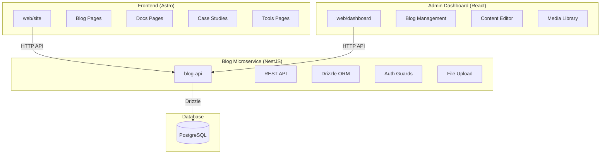

# Blog Migration: Sanity → NestJS Microservice

## Executive Summary

Migrate from Sanity CMS to a custom NestJS blog microservice using PostgreSQL with Drizzle ORM, integrated into the existing React dashboard and Astro frontend.

**Current Stack:**

- CMS: Sanity (headless)
- Frontend: Astro (static site generation)
- Dashboard: React + Vite
- Backend: Go (orchestrator-api)
- Database: PostgreSQL (Neon/Supabase)

**New Stack:**

- CMS: Custom NestJS microservice
- ORM: Drizzle ORM (PostgreSQL)
- Frontend: Astro (unchanged, just swap data source)
- Dashboard: React (unchanged, add blog management)
- Auth: Shared with existing orchestrator-api

---

## Architecture Diagram



---

## Tech Stack Recommendations (2026)

| Layer | Technology | Version |
|-------|------------|---------|
| Framework | NestJS | v11+ |
| ORM | Drizzle ORM | latest |
| Database | PostgreSQL | 16+ |
| Validation | Zod | latest |
| Documentation | Swagger/OpenAPI | - |
| File Storage | Local S3-compatible | - |
| Auth | JWT (shared with orchestrator) | - |

---

## Content Types to Migrate

Based on existing Sanity schemas:

1. **Blog Posts** - Technical articles with rich text
2. **Documentation** - API docs and guides
3. **Case Studies** - Customer success stories
4. **Tools & Templates** - Downloadable resources
5. **Benchmarks** - Performance comparisons
6. **Authors** - Content creator profiles
7. **Categories** - Content organization

---

## Database Schema (Drizzle ORM)

### Core Tables

```typescript
// src/db/schema/blog-post.ts
export const blogPosts = pgTable('blog_posts', {
  id: uuid('id').primaryKey().defaultRandom(),
  title: varchar('title', { length: 255 }).notNull(),
  slug: varchar('slug', { length: 96 }).notNull().unique(),
  description: text('description').notNull(),
  body: jsonb('body').notNull(), // Portable Text equivalent
  authorId: uuid('author_id').references(() => authors.id),
  categoryId: uuid('category_id').references(() => categories.id),
  tags: jsonb('tags').$type<string[]>(),
  heroImage: jsonb('hero_image'),
  status: varchar('status', { length: 20 }).notNull().default('draft'),
  // draft, in_review, approved, scheduled, published
  publishedAt: timestamp('published_at'),
  scheduledAt: timestamp('scheduled_at'),
  createdAt: timestamp('created_at').defaultNow(),
  updatedAt: timestamp('updated_at').defaultNow(),
});

// SEO fields
export const blogPosts Seo = columns.extend({
  seoTitle: varchar('seo_title', { length: 70 }),
  seoDescription: text('seo_description'),
  keywords: jsonb('keywords').$type<string[]>(),
  canonicalUrl: varchar('canonical_url', { length: 500 }),
  ogImage: jsonb('og_image'),
});
```

### Supporting Tables

```typescript
// Authors
export const authors = pgTable('authors', {
  id: uuid('id').primaryKey().defaultRandom(),
  name: varchar('name', { length: 255 }).notNull(),
  slug: varchar('slug', { length: 96 }).notNull().unique(),
  bio: text('bio'),
  photo: jsonb('photo'),
  email: varchar('email', { length: 255 }),
  website: varchar('website', { length: 255 }),
  socialLinks: jsonb('social_links'),
  role: varchar('role', { length: 100 }),
  active: boolean('active').default(true),
});

// Categories
export const categories = pgTable('categories', {
  id: uuid('id').primaryKey().defaultRandom(),
  title: varchar('title', { length: 255 }).notNull(),
  slug: varchar('slug', { length: 96 }).notNull().unique(),
  description: text('description'),
  color: varchar('color', { length: 7 }), // hex
  icon: varchar('icon', { length: 50 }),
  order: integer('order').default(0),
});
```

---

## API Design

### REST Endpoints

| Method | Endpoint | Description |
|--------|----------|-------------|
| GET | /api/v1/blog/posts | List published posts |
| GET | /api/v1/blog/posts/:slug | Get post by slug |
| POST | /api/v1/blog/posts | Create post (admin) |
| PUT | /api/v1/blog/posts/:id | Update post (admin) |
| DELETE | /api/v1/blog/posts/:id | Delete post (admin) |
| GET | /api/v1/blog/categories | List categories |
| GET | /api/v1/blog/authors | List authors |

### Request/Response Examples

```typescript
// GET /api/v1/blog/posts
{
  "data": [
    {
      "id": "uuid",
      "title": "Building Serverless Functions",
      "slug": "building-serverless-functions",
      "description": "A comprehensive guide...",
      "author": { "name": "John Doe", "slug": "john-doe" },
      "category": { "title": "Tutorials", "slug": "tutorials" },
      "tags": ["serverless", "aws", "lambda"],
      "heroImage": { "url": "...", "alt": "..." },
      "publishedAt": "2026-01-15T10:00:00Z"
    }
  ],
  "meta": {
    "total": 42,
    "page": 1,
    "limit": 10
  }
}
```

---

## Dashboard Integration

### New Pages to Add

1. `/admin/content` - Content overview
2. `/admin/content/blog` - Blog posts management
3. `/admin/content/blog/new` - Create post
4. `/admin/content/blog/:id/edit` - Edit post
5. `/admin/content/authors` - Author management
6. `/admin/content/categories` - Category management
7. `/admin/content/media` - Media library (optional)

### Existing Components to Reuse

- `@radix-ui/react-*` components (already in dashboard)
- React Hook Form + Zod validation (already in dashboard)
- Existing API client pattern

### Rich Text Editor Options

| Option | Pros | Cons |
|--------|------|------|
| TipTap | Modern, extensible, headless | More setup |
| Lexical | Meta-backed, stable | Larger bundle |
| Markdown | Simple, Git-friendly | Less visual |
| Quill | Quick setup | Older |

**Recommendation:** TipTap - best for 2026, excellent React integration

---

## Astro Frontend Migration

### Current: Sanity Client

```typescript
// web/site/src/lib/sanity.ts
import { createClient } from '@sanity/client'
export const sanityClient = createClient({...})
```

### New: NestJS API Client

```typescript
// web/site/src/lib/blog-api.ts
import axios from 'axios'

const blogApi = axios.create({
  baseURL: import.meta.env.PUBLIC_BLOG_API_URL || 'https://api.functionfly.com',
})

export const getBlogPosts = async (params) => {
  const { data } = await blogApi.get('/blog/posts', { params })
  return data
}

export const getBlogPostBySlug = async (slug: string) => {
  const { data } = await blogApi.get(`/blog/posts/${slug}`)
  return data
}
```

### Environment Variables

```env
# web/site/.env
PUBLIC_BLOG_API_URL=https://api.functionfly.com
```

---

## Content Migration Strategy

### Step 1: Export Sanity Data

```bash
# Using Sanity CLI
sanity dataset export production sanity-export.tar.gz
```

### Step 2: Transform to JSON

- Convert Portable Text to structured JSON
- Map image URLs to new storage
- Generate new slugs if needed

### Step 3: Import to PostgreSQL

- Use Drizzle seed scripts
- Bulk insert with transactions

### Step 4: Update Astro Pages

- Replace sanity client calls with blog-api calls
- Handle new response format

---

## File Storage

For images and media, use existing infrastructure:

1. **Option A:** Store in PostgreSQL (bytea) - simple but not scalable
2. **Option B:** S3-compatible storage (recommended) - works with existing setup
3. **Option C:** Cloudinary/ImageKit - managed CDN

**Recommendation:** Use existing S3-compatible storage (MinIO for local, AWS S3 for production)

---

## Deployment

### Docker Compose Addition

```yaml
# docker-compose.yml addition
blog-api:
  build:
    context: ./blog-api
    dockerfile: Dockerfile
  ports:
    - "3000:3000"
  environment:
    - DATABASE_URL=postgres://...
    - JWT_SECRET=${JWT_SECRET}
  depends_on:
    - postgres
```

### Caddy Route Update

```Caddyfile
# Add to Caddyfile
blog.functionfly.com {
    reverse_proxy localhost:3000
}
```

---

## Implementation Phases

### Phase 1: Foundation

- [ ] Set up NestJS project
- [ ] Configure Drizzle ORM + PostgreSQL
- [ ] Create database schema
- [ ] Set up authentication

### Phase 2: API Development

- [ ] Implement CRUD for blog posts
- [ ] Implement categories & authors
- [ ] Add file upload handling
- [ ] Swagger documentation

### Phase 3: Dashboard Integration

- [ ] Add blog management pages
- [ ] Implement rich text editor
- [ ] Connect to NestJS API

### Phase 4: Frontend Migration

- [ ] Update Astro to use new API
- [ ] Migrate all content types
- [ ] Test all pages

### Phase 5: Deployment

- [ ] Docker configuration
- [ ] Environment setup
- [ ] Monitoring & logging

---

## Security Considerations

1. **Authentication:** Use shared JWT from orchestrator-api
2. **Authorization:** Role-based access (admin, editor, viewer)
3. **Input Validation:** Zod schemas on all endpoints
4. **Rate Limiting:** Apply to public endpoints
5. **CORS:** Configure allowed origins

---

## Success Metrics

- [ ] All blog pages load from new API
- [ ] Dashboard can create/edit/delete posts
- [ ] Content migration complete (all posts transferred)
- [ ] SEO metadata preserved
- [ ] Media images display correctly
- [ ] Response times < 200ms for API calls
