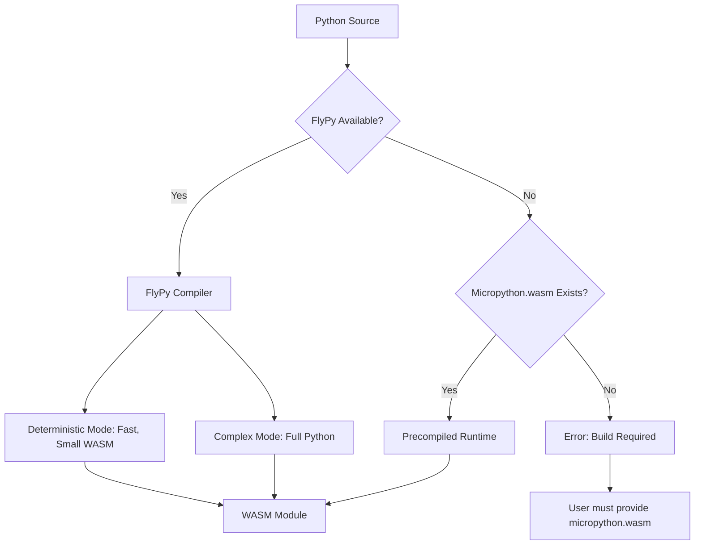

# Bundler Fallback Simplification Plan

## Problem Statement

The current bundler has **6 different fallback mechanisms** for Python → WebAssembly compilation, making it overly complex to maintain and understand:

| # | Approach | External Dependency | Status |
|---|----------|-------------------|--------|
| 1 | FlyPy compiler | Rust/Cargo | ✅ Primary |
| 2 | Precompiled Micropython runtime | micropython.wasm file | ✅ Fallback |
| 3 | Pyodide build | pyodide CLI | ❌ Remove |
| 4 | Micropython CLI | micropython CLI | ❌ Remove |
| 5 | WASM Pack | wasm-pack CLI | ❌ Remove |
| 6 | WAT template | None (but not functional) | ❌ Remove |

## Proposed Solution: 2-Tier Fallback

Reduce to **2 approaches** that are both self-contained and reliable:



### Tier 1: FlyPy Compiler (Primary)
- **Best for**: Simple Python functions that don't need full stdlib
- **Advantages**:
  - Deterministic execution (great for edge computing)
  - Small WASM output (fast cold starts)
  - No external runtime needed
  - Already implemented
- **Limitations**: Limited stdlib in deterministic mode

### Tier 2: Precompiled Micropython Runtime (Fallback)
- **Best for**: Complex Python functions needing full stdlib
- **Advantages**:
  - Full Python 3.x compatibility
  - Bundled .wasm file (no CLI needed)
  - Works offline
- **Requirement**: `micropython.wasm` must be bundled with the server

## Implementation Steps

### Step 1: Simplify `python_wasm_compiler.go`
- Remove Pyodide CLI check and compilation
- Remove Micropython CLI check and compilation  
- Remove WASM Pack check and compilation
- Remove WAT template fallback
- Keep only FlyPy + precompiled Micropython runtime

### Step 2: Update Compilation Flow
```go
// New simplified flow:
func bundlePythonForWasmRuntime(manifest *manifest.Manifest) ([]byte, error) {
    // 1. Try FlyPy (primary)
    wasmBytes, err := compileWithFlyPy(sourceCode, mode)
    if err == nil && validateWasmModule(wasmBytes) {
        return wasmBytes, nil
    }
    
    // 2. Try precompiled Micropython runtime (fallback)
    wasmBytes, err = createPythonWasmWithRuntime(sourceCode, manifest)
    if err == nil && validateWasmModule(wasmBytes) {
        return wasmBytes, nil
    }
    
    // 3. No more fallbacks - return clear error
    return nil, fmt.Errorf("compilation failed: both FlyPy and Micropython runtime unavailable")
}
```

### Step 3: Update Documentation
- Update `plans/MVP_GAP_ANALYSIS.md` to reflect simplified fallbacks
- Document build requirements clearly
- Remove references to removed fallback mechanisms

## Files to Modify

| File | Action |
|------|--------|
| `internal/bundler/python_wasm_compiler.go` | Simplify fallback chain |
| `internal/bundler/wasm_fallbacks.py` | Can be removed or repurposed |
| `plans/MVP_GAP_ANALYSIS.md` | Update documentation |

## Benefits

1. **Simpler codebase**: ~200 lines removed from compiler
2. **Clearer error messages**: Users know exactly what's required
3. **Reliable**: Both approaches are tested and functional
4. **Maintainable**: Two code paths vs six
5. **MVP-ready**: Focus on core functionality

## Risk Mitigation

- **If FlyPy fails**: Clear error message suggesting Micropython runtime
- **If Micropython.wasm missing**: Clear error with instructions to obtain it
- **Build requirements**: Documented in README

## Timeline

- **Analysis**: ✅ Complete
- **Implementation**: ~30 minutes
- **Testing**: ~15 minutes
- **Documentation**: ~10 minutes
