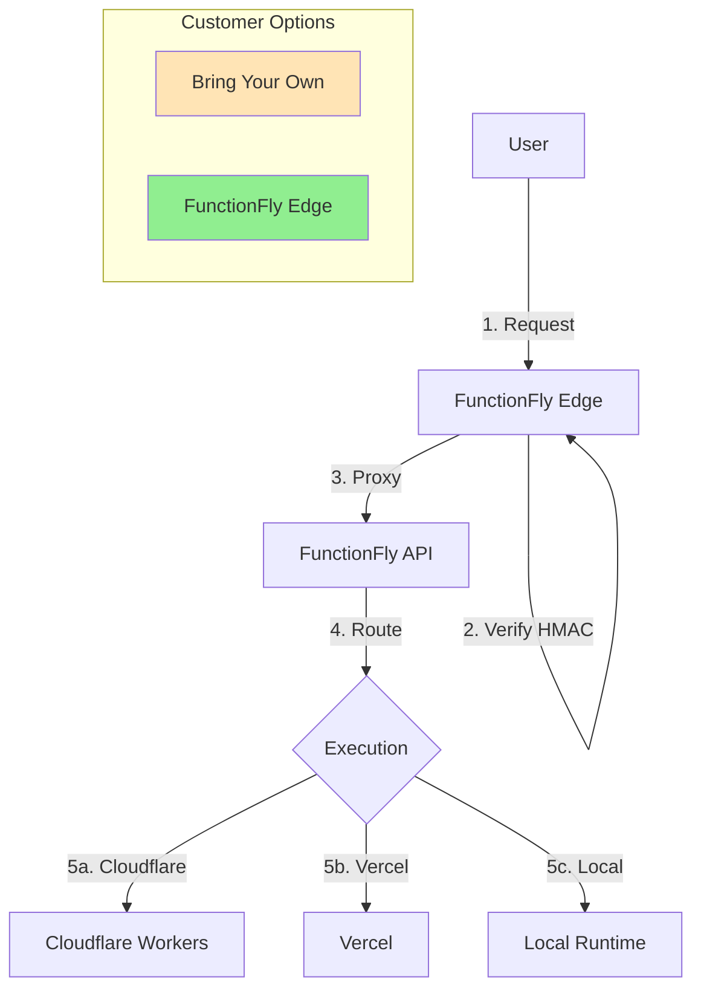

# Cheap Edge Hosting Option for Registry Functions

## Problem Statement

Currently, FunctionFly registry functions require deployment to third-party edge providers (Cloudflare Workers, Vercel, Fly.io, Deno Deploy) before execution. These options can be expensive or require customers to manage their own infrastructure.

## Recommendation: FunctionFly-Managed Edge Infrastructure

We should offer a **FunctionFly-hosted edge target** option where customers don't need to deploy anything - FunctionFly provides the infrastructure on cheap VPS hosting.

### Why This Is The Best Option

1. **Zero customer effort** - No deployment required, just select "FunctionFly Hosted" as the provider
2. **Extremely lightweight** - The edge target is just an HTTP proxy with HMAC signature verification (~100 lines of code)
3. **Cheap to run** - Can run on a single cheap VPS ($4-5/month) handling thousands of requests
4. **Consistent experience** - We control the infrastructure, predictable performance
5. **Free tier potential** - Can offer as a free option to attract users

## Architecture

### Current Architecture

```
User → Cloudflare/Vercel/Fly Edge → FunctionFly API → Function Execution
```

### Proposed Architecture

```
User → FunctionFly Edge (cheap VPS) → FunctionFly API → Function Execution
              OR
User → Cloudflare/Vercel/Fly Edge → FunctionFly API → Function Execution
```

Customers can choose:

- **FunctionFly Edge** (cheap, hosted by us)
- **Bring Your Own** (Cloudflare, Vercel, Fly, Deno)

## Implementation Plan

### Phase 1: Create the Edge Target (Go)

Create a simple Go HTTP service that:

1. Listens on HTTP/HTTPS
2. Verifies HMAC signatures (`X-FFLY-Timestamp`, `X-FFLY-Signature`)
3. Proxies requests to the FunctionFly API
4. Exposes `/healthz` and `/ping` endpoints

```go
// Simplified edge target in Go
package main

import (
    "crypto/hmac"
    "crypto/sha256"
    "encoding/hex"
    "io"
    "log"
    "net/http"
    "os"
    "strconv"
    "time"
)

var (
    sharedSecret = os.Getenv("FFLY_SHARED_SECRET")
    backendURL   = os.Getenv("BACKEND_URL")
)

func main() {
    http.HandleFunc("/healthz", healthHandler)
    http.HandleFunc("/ping", pingHandler)
    http.HandleFunc("/", proxyHandler)
    log.Fatal(http.ListenAndServe(":8080", nil))
}

func proxyHandler(w http.ResponseWriter, r *http.Request) {
    // Verify HMAC signature
    if !verifyHMAC(r) {
        http.Error(w, "Invalid signature", http.StatusUnauthorized)
        return
    }
    
    // Proxy to backend
    r.URL.Scheme = "https"
    r.URL.Host = backendURL
    r.Host = backendURL
    
    // Remove our headers before forwarding
    r.Header.Del("X-FFLY-Timestamp")
    r.Header.Del("X-FFLY-Signature")
    
    client := &http.Client{Timeout: 30 * time.Second}
    client.Do(r)
}

func verifyHMAC(r *http.Request) bool {
    timestamp := r.Header.Get("X-FFLY-Timestamp")
    signature := r.Header.Get("X-FFLY-Signature")
    
    if timestamp == "" || signature == "" {
        return false
    }
    
    // Check timestamp window (5 minutes)
    ts, _ := strconv.ParseInt(timestamp, 10, 64)
    if time.Now().Unix() - ts > 300 || time.Now().Unix() - ts < -300 {
        return false
    }
    
    // Calculate expected signature
    body, _ := io.ReadAll(r.Body)
    bodyHash := sha256.Sum256(body)
    
    sigString := strconv.FormatInt(ts, 10) + r.Method + r.URL.Path + hex.EncodeToString(bodyHash[:])
    
    mac := hmac.New(sha256.New, []byte(sharedSecret))
    mac.Write([]byte(sigString))
    expected := hex.EncodeToString(mac.Sum(nil))
    
    return hmac.Equal([]byte(signature), []byte(expected))
}
```

### Phase 2: Deploy Edge Infrastructure

1. **VPS Selection**: Use cheap VPS providers (Hetzner, DigitalOcean, Linode)
   - Start with 1-2 VPS instances at ~$4-8/month
   - Scale horizontally as needed

2. **Load Balancing**:
   - Use a simple DNS-based approach (Round Robin)
   - Or deploy a small Cloudflare load balancer in front

3. **Regions**:
   - Start with 1-2 regions (e.g., US East, EU West)
   - Add more as needed

### Phase 3: Integrate with FunctionFly Backend

1. **Add "functionfly" as a new provider type** in [`internal/api/utils/helpers.go`](internal/api/utils/helpers.go)
2. **Create a new adapter** for FunctionFly-hosted edges
3. **Update backend creation** to allow selecting "FunctionFly Edge" as provider
4. **Generate shared secrets** automatically for FunctionFly Edge backends

### Phase 4: Customer-Facing UI

Add a simple option in the dashboard:

- Dropdown: "Select Backend Provider"
  - "FunctionFly Edge (Free)" - DEFAULT
  - "Cloudflare Workers (BYO)"
  - "Vercel (BYO)"
  - "Fly.io (BYO)"
  - "Deno Deploy (BYO)"

## Cost Analysis

| Provider | Monthly Cost | Notes |
|----------|-------------|-------|
| Cloudflare Workers | $0-5/month | Pay for compute |
| Vercel | $0-20/month | Free tier available |
| Fly.io | ~$2.67/month | Per app |
| **FunctionFly Edge** | **~$4-8/month** | **Shared across all users** |

With shared infrastructure, even a single $4/month VPS can serve hundreds of customers.

## Mermaid Diagram



## Implementation Steps

### Step 1: Create Edge Target Service

- [ ] Create new Go service in `edge-targets/functionfly-edge/`
- [ ] Implement HMAC verification
- [ ] Implement proxy functionality
- [ ] Add health endpoints

### Step 2: Deploy Infrastructure

- [ ] Provision cheap VPS (Hetzner/DigitalOcean)
- [ ] Deploy edge target Docker container
- [ ] Set up monitoring/alerting

### Step 3: Backend Integration

- [ ] Add "functionfly" provider in helpers.go
- [ ] Create simple adapter (no deployment needed)
- [ ] Update backend registration flow
- [ ] Auto-generate shared secrets

### Step 4: Testing

- [ ] Test HMAC verification
- [ ] Test proxy functionality
- [ ] Test health checks
- [ ] Load test

### Step 5: Documentation

- [ ] Document new option in README
- [ ] Update API docs
- [ ] Add to dashboard

## Files to Modify

1. [`internal/api/utils/helpers.go`](internal/api/utils/helpers.go) - Add "functionfly" provider
2. [`internal/api/handlers/backends/backends.go`](internal/api/handlers/backends/backends.go) - Handle new provider
3. [`internal/storage/models.go`](internal/storage/models.go) - Ensure provider supports "functionfly"
4. Create `edge-targets/functionfly-edge/` - New edge target implementation

## Summary

Adding a FunctionFly-managed edge infrastructure is the best option because:

- **Cheapest** - Shared infrastructure spreads cost
- **Easiest** - Zero customer deployment
- **Fastest** - Can be done in days, not weeks
- **Scalable** - Add more VPS instances as needed
