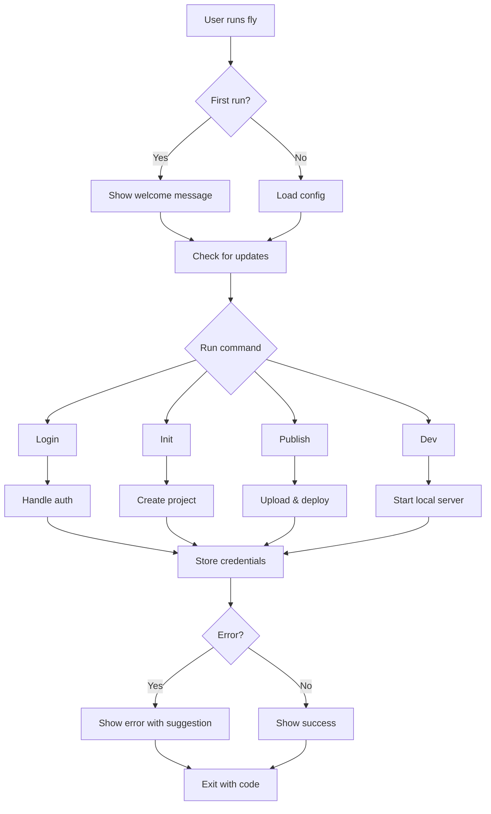

# FunctionFly CLI Production-Readiness Plan

## Executive Summary

This document outlines the comprehensive plan to make the FunctionFly CLI (`fly`) production-ready. The CLI is built with Cobra and Go, providing a developer interface for publishing functions to the global edge registry.

---

## Current State Assessment

Based on the codebase review, the CLI has a solid foundation with:
- ✅ Cobra-based command structure
- ✅ Authentication (OAuth + dev mode)
- ✅ Project initialization with templates
- ✅ Local development mode (`dev`)
- ✅ Publishing workflow
- ✅ Environment/secrets management
- ✅ Shell completion support
- ✅ Config and credentials management

---

## Production-Readiness Recommendations

### 1. Version Management & Auto-Update

**Priority: HIGH**

| Feature | Description | Implementation |
|---------|-------------|----------------|
| Version command | `fly version` showing git commit, date, built binary | Add `-ldflags` during build |
| Version check | `fly --version` / `fly version` | Already exists in root |
| Update command | `fly update` to self-update | Enhance existing update command |
| Update check | Check for new versions on startup | Add background check |
| Update channels | Stable/beta/nightly | Configurable in config |

**Files to modify:**
- `cmd/fly/cmd/update.go`
- Add `version.go` with build info

### 2. Error Handling & User Feedback

**Priority: HIGH**

| Feature | Description |
|---------|-------------|
| Structured errors | Wrap errors with context and suggestions |
| Error codes | Use exit codes: 0=success, 1=error, 2=auth error |
| Colored output | Use `lipgloss` for consistent styling |
| Warning messages | Distinguish warnings from errors |
| Debug info | Show stack traces in debug mode |

**Example improvements:**
```go
// Before
return fmt.Errorf("could not read config")

// After
return fmt.Errorf("could not read config from %s\n   → Try: fly config reset or fly login", path)
```

### 3. Input Validation & Sanitization

**Priority: HIGH**

| Area | Validation Rules |
|------|------------------|
| Function names | `[a-z0-9-]+`, max 63 chars, no leading/trailing hyphens |
| Emails | RFC 5322 validation |
| URLs | Must be valid HTTPS in production |
| File paths | Resolve symlinks, check for path traversal |
| API keys/tokens | Validate format before sending |

### 4. Progress Indicators & Spinners

**Priority: MEDIUM**

Use `charmbracelet/bubbles` or `spf13/viper` with progress bars for:

- `fly publish` - Upload progress
- `fly dev` - Starting local server
- `fly init` - Template generation
- `fly login` - OAuth flow
- `fly logs` - Connecting to stream

### 5. Debug Mode & Verbose Logging

**Priority: HIGH**

```bash
fly --debug          # Full debug output
fly --verbose -v     # Verbose API calls
fly --trace          # HTTP trace with bodies
```

- Add `--debug`, `--verbose`, `--trace` flags to root
- Use `log` package with levels
- Log to `~/.functionfly/logs/` with rotation

### 6. Configuration Management

**Priority: HIGH**

| Feature | Implementation |
|---------|----------------|
| Config validation | Validate on load, schema version |
| Config migration | Handle config version upgrades |
| Config reset | `fly config reset` to defaults |
| Config view | `fly config` to show current config |
| Environment override | `FFLY_*` env vars take precedence |
| Project config | `./.fly.yaml` for project-specific settings |

**Priority order (highest first):**
1. CLI flags
2. Environment variables (`FFLY_*`)
3. Project config (`.fly.yaml`)
4. Global config (`~/.functionfly/config.yaml`)
5. Defaults

### 7. Telemetry & Usage Tracking

**Priority: MEDIUM**

| Feature | Implementation |
|---------|----------------|
| Opt-in consent | `--telemetry` flag or config |
| Anonymized tracking | No PII, hashed device ID |
| Events to track | Commands run, errors, timing |
| Privacy policy | Link in `--help` output |

**Already partially implemented:**
```go
TelConfig struct {
    Enabled   bool `yaml:"enabled"   json:"enabled"`
    Anonymize bool `yaml:"anonymize" json:"anonymize"`
}
```

### 8. Shell Completion

**Priority: HIGH**

| Shell | Status | Enhancement |
|-------|--------|-------------|
| bash | Partial | Add to init scripts |
| zsh | Partial | Add completion function |
| fish | Missing | Implement |
| powershell | Missing | Implement |

**Enhancements needed:**
- Function name completion for `fly logs <name>`, `fly stats <name>`
- Flag completion for `--template`, `--region`
- Context-aware completions

### 9. Cross-Platform Build & Distribution

**Priority: HIGH**

Create `.goreleaser.yml`:

```yaml
# .goreleaser.yml
project_name: fly

archives:
  - id: default
    builds:
      - fly
    formats:
      - tar.gz
      - zip
    binary_name: fly
    goos:
      - linux
      - darwin
      - windows
    goarch:
      - amd64
      - arm64

checksum:
  name_template: 'checksums.txt'

release:
  github:
    owner: functionfly
    name: functionfly

nfpms:
  - id: default
    formats:
      - deb
      - rpm
      - apk
    maintainer: FunctionFly <support@functionfly.com>
    homepage: https://functionfly.com
```

**Homebrew tap:**
- Create `homebrew-functionfly` formula

### 10. CI/CD Integration (GitHub Actions)

**Priority: HIGH**

```yaml
# .github/workflows/cli.yml
name: CLI Release

on:
  push:
    tags:
      - 'v*'

jobs:
  goreleaser:
    runs-on: ubuntu-latest
    steps:
      - uses: actions/checkout@v4
      - uses: goreleaser/goreleaser-action@v5
        with:
          version: latest
          args: release --clean
        env:
          GITHUB_TOKEN: ${{ secrets.GITHUB_TOKEN }}
```

### 11. Man Pages

**Priority: MEDIUM**

Generate from Cobra docs:
- `fly manpage > fly.1`
- Install to `/man/man1/`

### 12. Documentation

**Priority: HIGH**

| Document | Location |
|----------|----------|
| Quick start | `docs/cli/quickstart.md` |
| Command reference | `docs/cli/commands.md` |
| Config reference | `docs/cli/config.md` |
| Troubleshooting | `docs/cli/troubleshooting.md` |
| Contributing | `CONTRIBUTING.md` (update) |

### 13. Security Best Practices

**Priority: HIGH**

| Feature | Implementation |
|---------|----------------|
| Credential storage | Use system keychain (keyring lib) |
| HTTPS enforcement | Reject HTTP in production |
| Token refresh | Auto-refresh before expiry |
| Secure defaults | `FFLY_TELEMETRY=false` by default |
| Audit logging | Log all API calls |

### 14. Plugin/Extension System

**Priority: LOW**

| Feature | Description |
|---------|-------------|
| Plugin directory | `~/.functionfly/plugins/` |
| Plugin discovery | Auto-load `fly-*` executables |
| Plugin API | Standard interface for plugins |
| Security | Verify plugin signatures |

### 15. Batch Operations

**Priority: MEDIUM**

- `fly publish --batch` - Publish multiple functions
- `fly delete --batch` - Delete multiple functions
- `fly deploy --parallel` - Deploy with concurrency

### 16. Interactive Wizard Mode

**Priority: MEDIUM**

Use `bubbletea` for interactive flows:
- `fly init --wizard` - Guided project creation
- `fly login --wizard` - Step-by-step auth
- `fly config --wizard` - Interactive config

### 17. Exit Codes

**Priority: HIGH**

| Code | Meaning |
|------|---------|
| 0 | Success |
| 1 | General error |
| 2 | Authentication/authorization error |
| 3 | Network error |
| 4 | Invalid input/validation error |
| 5 | Configuration error |
| 130 | Interrupted (Ctrl+C) |

### 18. Testing

**Priority: HIGH**

| Test Type | Coverage |
|-----------|----------|
| Unit tests | Core functions, validation |
| Integration tests | API calls, file operations |
| E2E tests | Full command flows |
| Golden tests | Output formatting |

---

## Implementation Phases

### Phase 1: Critical (Week 1-2)
1. Exit codes
2. Error handling improvements
3. Debug/verbose modes
4. Version/build info
5. Config validation

### Phase 2: High Priority (Week 2-3)
1. Auto-update with goreleaser
2. Shell completions
3. CI/CD setup
4. Progress indicators

### Phase 3: Medium Priority (Week 3-4)
1. Telemetry
2. Interactive wizards
3. Plugin system
4. Documentation

### Phase 4: Polish (Week 4+)
1. Man pages
2. Batch operations
3. Advanced features

---

## Files to Modify

```
cmd/fly/
├── commands/
│   ├── root.go           # Add debug flags, telemetry
│   ├── config.go         # Add validation, reset
│   ├── credentials.go    # Keychain integration
│   └── update.go        # Enhance with goreleaser
├── cmd/
│   └── root.go           # Add version command
└── main.go               # Add init logging

scripts/
├── goreleaser.yml        # New: Cross-platform builds
└── install.sh            # New: Install script

.github/workflows/
└── cli.yml               # New: Release workflow
```

---

## Dependencies to Add

```go
// go.mod additions
github.com/charmbracelet/lipgloss    // Styling
github.com/charmbracelet/bubbles    // Spinners/progress
github.com/keybase/go-keychain      // Secure credentials
github.com/google/renameio          // Config files
github.com/peterbourgon/ff          // Flags
mvdan.cc/sh/v3/shellcomplete        // Shell completion
```

---

## Success Metrics

| Metric | Target |
|--------|--------|
| Installation success rate | >99% |
| First command success | >95% |
| Error message clarity | >90% helpful |
| CLI size | <50MB |
| Cold start time | <100ms |
| Auto-update success | >99% |

---

## Appendix: Mermaid Workflow



---

## References

- [Cobra documentation](https://pkg.go.dev/github.com/spf13/cobra)
- [Goreleaser documentation](https://goreleaser.com/)
- [CLI best practices](https://clig.dev/)
