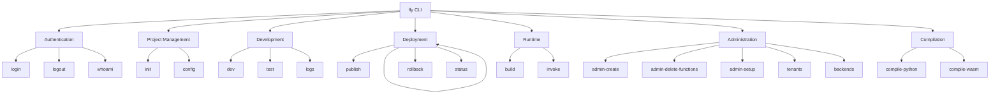

# CLI Unification Plan

## Executive Summary

This plan outlines the unification of multiple standalone CLI tools into a single, cohesive `fly` CLI. The goal is to provide developers with a unified interface for all FunctionFly operations, reducing cognitive load and improving developer experience.

## Current CLI Landscape

### Existing CLI Tools

| CLI | Location | Purpose | Technology |
|-----|----------|---------|------------|
| **fly** | `cmd/fly/` | Primary developer CLI (login, init, dev, publish, test, deploy, logs, metrics) | Go + Cobra |
| **ffly** | `cmd/ffly/` | Backend management and deployment operations | Go + flag |
| **flypy-go** | `cmd/flypy-go/` | Python-to-WASM compiler | Go |
| **create-admin** | `cmd/create-admin/` | Create admin users in database | Go |
| **delete-functions** | `cmd/delete-functions/` | Database cleanup utility | Go |
| **publish** | `cmd/publish/` | Publish WASM to registry | Go |
| **publish-tool** | `cmd/publish-tool/` | Alternative publishing tool | Go |
| **setup** | `cmd/setup/` | Initial setup and tenant creation | Go |

### Issues with Current State

1. **Duplication**: Multiple tools with overlapping functionality
2. **Inconsistent UX**: Each tool has different command patterns and flags
3. **Maintenance Burden**: Multiple codebases to maintain and update
4. **Discovery**: Users must find the right tool for their task
5. **No Unified Help**: No single entry point for CLI documentation

---

## Target Architecture

### Unified Command Structure

```
fly [global options] <command> [command options] [arguments...]
```

### Proposed Command Hierarchy



---

## Integration Plan

### Phase 1: Consolidate Core Developer Tools

#### 1.1 Merge ffly into fly

**Current ffly Commands:**
- `ffly init` → `fly init` (enhance existing)
- `ffly backend` → `fly backend` (new subcommand)
- `ffly deploy` → `fly deploy` (merge with existing)
- `ffly deployments` → `fly deploy list` (or `fly deployments`)
- `ffly rollback` → `fly rollback` (already exists in fly)
- `ffly status` → `fly status` (new subcommand)

**Tasks:**
- [ ] Analyze ffly's backend management logic
- [ ] Create `fly backend` subcommand group
- [ ] Integrate backend operations into fly
- [ ] Add backend-related flags to existing deploy command
- [ ] Create `fly status` command for project/backend status

#### 1.2 Integrate flypy-go Compiler

**Current flypy-go Commands:**
- `flypy-go compile` → `fly compile python` (or `fly build`)
- Test commands → `fly test` subcommands

**Tasks:**
- [ ] Create `fly compile` subcommand group
- [ ] Integrate Python-to-WASM compilation
- [ ] Add compilation options to existing build pipeline
- [ ] Migrate test commands to `fly test`

#### 1.3 Unify Publish Tools

**Current publish tools:**
- `cmd/publish/` - Publish WASM binary
- `cmd/publish-tool/` - Alternative publish with auto token

**Tasks:**
- [ ] Consolidate publish logic into single command
- [ ] Add token generation to `fly publish`
- [ ] Support both WASM and source-based publishing
- [ ] Enhance publish with conflict strategies

---

### Phase 2: Add Admin/DevOps Commands

#### 2.1 Create Admin Subcommand Group

**New commands under `fly admin`:**

| New Command | Source | Description |
|-------------|--------|-------------|
| `fly admin create-user` | create-admin | Create admin users |
| `fly admin delete-functions` | delete-functions | Cleanup database |
| `fly admin setup` | setup | Initial system setup |
| `fly admin db` | (new) | Database management |
| `fly admin tenants` | (new) | Tenant management |

**Tasks:**
- [ ] Create `fly admin` subcommand group
- [ ] Migrate create-admin functionality
- [ ] Migrate delete-functions with safety checks
- [ ] Migrate setup functionality
- [ ] Add database migration commands
- [ ] Add tenant management commands

---

### Phase 3: Shared Infrastructure

#### 3.1 Common CLI Library

Create shared libraries for:
- Configuration management
- Authentication/credential handling
- API client initialization
- Output formatting
- Error handling

#### 3.2 Plugin Architecture

Support for extensible commands:
```go
// Example plugin registration
fly.RegisterCommand(plugin.Plugin{
    Name: "custom-provider",
    Commands: []cobra.Command{...},
})
```

---

## Implementation Steps

### Step 1: Restructure fly CLI Directory

```
cmd/fly/
├── main.go              # Entry point
├── cmd/                 # Cobra commands (existing)
├── commands/            # Command implementations (existing)
├── internal/            # Shared CLI utilities (new)
│   ├── config/          # Configuration handling
│   ├── auth/            # Authentication utilities
│   ├── client/          # API client
│   └── utils/           # Common utilities
├── admin/               # Admin commands (migrated)
├── backend/             # Backend commands (from ffly)
├── compile/             # Compiler commands (from flypy-go)
└── plugins/             # Plugin system (new)
```

### Step 2: Migrate Commands (Priority Order)

1. **Priority 1 - Essential Developer Workflow**
   - `fly backend` (from ffly)
   - `fly compile` (from flypy-go)
   - `fly publish` enhancement

2. **Priority 2 - Deployment Operations**
   - Merge ffly deploy with fly deploy
   - Add ffly deployments functionality

3. **Priority 3 - Admin Operations**
   - `fly admin create-user`
   - `fly admin setup`
   - `fly admin delete-functions`

### Step 3: Update Build System

**Makefile changes:**
- Remove separate build targets for merged CLIs
- Add unified build: `make build-fly`
- Update NX project configuration

---

## Command Mapping Reference

### ffly → fly Mapping

| ffly Command | fly Command | Notes |
|--------------|-------------|-------|
| `ffly init` | `fly init` | Already exists, may need enhancement |
| `ffly backend add` | `fly backend add` | New subcommand |
| `ffly backend list` | `fly backend list` | New subcommand |
| `ffly deploy` | `fly deploy` | Merge with existing |
| `ffly deployments` | `fly deployments` | New or merge |
| `ffly rollback` | `fly rollback` | Already exists |
| `ffly status` | `fly status` | New command |

### flypy-go → fly Mapping

| flypy-go Command | fly Command | Notes |
|-------------------|-------------|-------|
| `flypy-go compile` | `fly compile python` | New subcommand |
| `flypy-go test-*` | `fly test` | Already exists |

### Admin Tools → fly Mapping

| Original | fly Command | Notes |
|----------|-------------|-------|
| `create-admin` | `fly admin create-user` | New subcommand |
| `delete-functions` | `fly admin db clean-functions` | New subcommand |
| `setup` | `fly admin setup` | New subcommand |

---

## Backward Compatibility

### Alias System

Provide command aliases for smooth migration:
```go
// Allow ffly as alias for fly
fly.AddCommand(fflyCmd)  // ffly → fly
fly.AddCommand(flypyCmd)  // flypy-go → fly compile
```

### Deprecation Timeline

1. **Phase 1 (3 months)**: Emit deprecation warnings for old commands
2. **Phase 2 (6 months)**: Remove old command binaries from builds
3. **Phase 3 (12 months)**: Remove alias support

### Migration Guide

Users will need to:
1. Replace `ffly init` with `fly init`
2. Replace `ffly deploy` with `fly deploy`
3. Use `fly backend` for backend management

---

## Testing Strategy

### Unit Tests
- Test each migrated command independently
- Test flag parsing and validation
- Test error handling

### Integration Tests
- Test command pipelines (init → dev → deploy)
- Test credential flow
- Test configuration loading

### CLI Behavior Tests
- Test help text generation
- Test completion scripts
- Test version output

---

## Documentation Updates

### User-Facing
- Update CLI documentation
- Add migration guide
- Update README examples

### Internal
- Update Makefile targets
- Update CI/CD pipelines
- Update project.json configurations

---

## Success Metrics

1. **Single Entry Point**: All operations accessible via `fly`
2. **Command Parity**: All existing functionality available
3. **User Satisfaction**: Developer feedback on unified experience
4. **Maintenance**: Single codebase to maintain

---

## Open Questions

1. Should `ffly` continue to work as an alias?
2. How to handle config file differences (.ffly vs .fly)?
3. Should backend management be a separate namespace or integrated into deploy?
4. What's the priority order for implementation?

---

## Additional Recommendations

### 1. Plugin Architecture with Community Extensions

Consider implementing a plugin system similar to kubectl's plugin model:
- Users can install community plugins via `fly plugin install`
- Plugins live in `~/.fly/plugins/`
- Discover plugins via `fly plugin search`

### 2. Interactive Configuration Wizard

Add `fly init --wizard` for guided project setup:
- Step-by-step runtime selection
- API key generation
- Initial deployment configuration

### 3. Unified Configuration File

Consolidate all config into `fly.yaml`:
```yaml
version: "1.0"
project:
  name: my-function
  runtime: python3.12
deploy:
  provider: aws
  region: us-east-1
backends:
  - name: production
    url: https://api.functionfly.com
```

### 4. Enhanced Output Formats

Support multiple output formats for all commands:
- `--output json` for machine-readable output
- `--output yaml` for configuration files
- `--output table` for human-readable (default)

### 5. Command Aliases

Allow users to define custom aliases:
```yaml
aliases:
  pp: "fly publish"
  d: "fly deploy"
  l: "fly logs --follow"
```

### 6. Built-in Tutorial System

Add interactive tutorials:
- `fly tutorial deploy-first` - Deploy your first function
- `fly tutorial local-dev` - Learn local development

### 7. Better Error Messages

Implement suggestion engine for typos:
```
$ fly publsih
Did you mean "fly publish"?
```

### 8. Dry-Run Mode

Add `--dry-run` flag to destructive commands:
- `fly publish --dry-run` - Show what would be published
- `fly admin delete-functions --dry-run` - Show what would be deleted

### 9. Progress Bars and Spinners

Use rich terminal UI for long-running operations:
- Publishing functions
- Building WASM
- Running test suites

### 10. Shell Completions

Generate completions for all shells:
- Bash, Zsh, Fish, PowerShell
- Include in `fly completion` command
