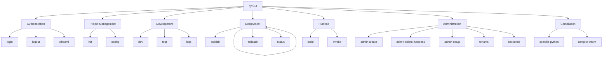

# CLI Unification Plan

## Executive Summary

This plan outlines the unification of multiple standalone CLI tools into a single, cohesive `fly` CLI. The goal is to provide developers with a unified interface for all FunctionFly operations, reducing cognitive load and improving developer experience.

## Current CLI Landscape

### Existing CLI Tools

| CLI | Location | Purpose | Technology | Status |
|-----|----------|---------|------------|--------|
| **fly** | `cmd/fly/` | Primary developer CLI (login, init, dev, publish, test, deploy, logs, metrics) | Go + Cobra | ✅ EXISTS |
| **flypy-go** | `cmd/flypy-go/` | Python-to-WASM compiler | Go + flag | ✅ EXISTS |
| **delete-functions** | `cmd/delete-functions/` | Database cleanup utility | Go + flag | ✅ EXISTS |
| **publish** | `cmd/publish/` | Publish WASM to registry | Go | ✅ EXISTS |
| **publish-tool** | `cmd/publish-tool/` | Alternative publishing tool | Go | ✅ EXISTS |
| **setup** | `cmd/setup/` | Initial setup and tenant creation | Go | ✅ EXISTS |
| **test-publish** | `cmd/test-publish/` | Dev test utility (should be deprecated) | Go | ⚠️ EXISTS (dev-only) |
| **test-rust-gen** | `cmd/test-rust-gen/` | Rust codegen test (should be deprecated) | Go | ⚠️ EXISTS (dev-only) |

### New Commands to Create

| New Command | Purpose | Notes |
|-------------|---------|-------|
| `fly backend` | Backend management | Replaces missing ffly functionality |
| `fly admin create-user` | Create admin users | Replaces missing create-admin functionality |

> **Note:** The plan previously referenced `ffly` and `create-admin` CLI tools that do not exist in the codebase. These functionalities need to be CREATED as new subcommands rather than migrated.

### Issues with Current State

1. **Duplication**: Multiple tools with overlapping functionality
2. **Inconsistent UX**: Each tool has different command patterns and flags
3. **Maintenance Burden**: Multiple codebases to maintain and update
4. **Discovery**: Users must find the right tool for their task
5. **No Unified Help**: No single entry point for CLI documentation

---

## Target Architecture

### Unified Command Structure

```
fly [global options] <command> [command options] [arguments...]
```

### Proposed Command Hierarchy



---

## Integration Plan

### Phase 1: Consolidate Core Developer Tools

#### 1.1 Create Backend Management Commands (NEW - no existing tool)

**New commands to create:**
- `fly backend add` - Add a new backend
- `fly backend list` - List all configured backends
- `fly backend remove` - Remove a backend
- `fly backend status` - Check backend health

**Tasks:**
- [ ] Design backend management API
- [ ] Create `fly backend` subcommand group
- [ ] Implement backend add/list/remove commands
- [ ] Add status checking functionality

#### 1.2 Integrate flypy-go Compiler

**Current flypy-go Commands:**
- `flypy-go compile` → `fly compile python` (or `fly build`)
- Test commands → `fly test` subcommands

**Tasks:**
- [ ] Create `fly compile` subcommand group
- [ ] Integrate Python-to-WASM compilation
- [ ] Add compilation options to existing build pipeline
- [ ] Migrate test commands to `fly test`

#### 1.3 Unify Publish Tools

**Current publish tools:**
- `cmd/publish/` - Publish WASM binary
- `cmd/publish-tool/` - Alternative publish with auto token

**Tasks:**
- [ ] Consolidate publish logic into single command
- [ ] Add token generation to `fly publish`
- [ ] Support both WASM and source-based publishing
- [ ] Enhance publish with conflict strategies

---

### Phase 2: Add Admin/DevOps Commands

#### 2.1 Create Admin Subcommand Group

**New commands under `fly admin`:**

| New Command | Source | Description |
|-------------|--------|-------------|
| `fly admin create-user` | (NEW - create-admin doesn't exist) | Create admin users |
| `fly admin delete-functions` | delete-functions | Cleanup database |
| `fly admin setup` | setup | Initial system setup |
| `fly admin db` | (new) | Database management |
| `fly admin tenants` | (new) | Tenant management |

**Tasks:**
- [ ] Create `fly admin` subcommand group
- [ ] Implement admin user creation (create-admin tool doesn't exist)
- [ ] Migrate delete-functions with safety checks
- [ ] Migrate setup functionality
- [ ] Add database migration commands
- [ ] Add tenant management commands

---

### Phase 3: Shared Infrastructure

#### 3.1 Common CLI Library

Create shared libraries for:
- Configuration management
- Authentication/credential handling
- API client initialization
- Output formatting
- Error handling

#### 3.2 Plugin Architecture

Support for extensible commands:
```go
// Example plugin registration
fly.RegisterCommand(plugin.Plugin{
    Name: "custom-provider",
    Commands: []cobra.Command{...},
})
```

---

## Implementation Steps

### Step 1: Restructure fly CLI Directory

```
cmd/fly/
├── main.go              # Entry point
├── cmd/                 # Cobra commands (existing)
├── commands/            # Command implementations (existing)
├── internal/            # Shared CLI utilities (new)
│   ├── config/          # Configuration handling
│   ├── auth/            # Authentication utilities
│   ├── client/          # API client
│   └── utils/           # Common utilities
├── admin/               # Admin commands (from setup/delete-functions - CONVERT)
├── backend/             # Backend commands (NEW - create from scratch)
├── compile/             # Compiler commands (from flypy-go)
└── plugins/             # Plugin system (new)
```

### Step 2: Migrate Commands (Priority Order)

1. **Priority 1 - Essential Developer Workflow**
   - `fly backend` (NEW - create backend management)
   - `fly compile` (from flypy-go)
   - `fly publish` enhancement

2. **Priority 2 - Deployment Operations**
   - Merge publish tools
   - Add status command

3. **Priority 3 - Admin Operations**
   - `fly admin create-user` (NEW - create admin user management)
   - `fly admin setup` (from setup)
   - `fly admin delete-functions` (from delete-functions)

### Step 3: Update Build System

**Makefile changes:**
- Remove separate build targets for merged CLIs
- Add unified build: `make build-fly`
- Update NX project configuration

---

## Technical Specifications

### Shared CLI Library Structure

```
cmd/fly/
├── main.go                      # Entry point
├── cmd/                         # Cobra commands
│   ├── root.go                 # Root command
│   ├── login.go                # Authentication
│   ├── init.go                 # Project initialization
│   ├── dev.go                  # Local development
│   ├── publish.go              # Publish function
│   ├── deploy.go               # Deployment operations
│   ├── test.go                 # Testing commands
│   ├── logs.go                 # Log viewing
│   ├── metrics.go              # Metrics display
│   ├── rollback.go             # Version rollback
│   ├── status.go               # Status checking
│   ├── backend/                # Backend management (NEW)
│   │   ├── backend_add.go
│   │   ├── backend_list.go
│   │   └── backend_remove.go
│   ├── compile/                # Compilation commands
│   │   ├── compile_python.go  # From flypy-go
│   │   └── compile_wasm.go     # WASM compilation
│   └── admin/                  # Admin commands (NEW/CONVERTED)
│       ├── admin_create_user.go    # From create-admin
│       ├── admin_delete_functions.go
│       ├── admin_setup.go
│       ├── admin_tenants.go
│       └── admin_db.go
├── commands/                    # Command implementations
│   ├── api.go                  # API client
│   ├── config.go               # Configuration management
│   ├── credentials.go          # Credential handling
│   ├── errors.go               # Error definitions
│   ├── spinner.go              # Progress UI
│   └── ...
└── internal/                    # Shared utilities (NEW)
    ├── config/
    │   └── config.go           # Configuration handling
    ├── auth/
    │   └── auth.go             # Authentication utilities
    ├── client/
    │   └── api.go              # API client initialization
    ├── output/
    │   └── format.go           # Output formatting (JSON/YAML/Table)
    └── utils/
        └── utils.go            # Common utilities
```

### Configuration File Format (fly.yaml)

```yaml
version: "1.0"
project:
  name: my-function
  runtime: python3.12
  entrypoint: handler

deploy:
  provider: functionfly
  region: us-east-1
  environments:
    - name: production
      url: https://api.functionfly.com
    - name: staging
      url: https://staging.functionfly.com

backends:
  - name: production
    url: https://api.functionfly.com
    default: true
  - name: staging
    url: https://staging.functionfly.com

compilation:
  python:
    optimize: true
    strip_debug: true

output:
  format: table  # table, json, yaml
  color: auto    # auto, always, never

aliases:
  pp: "fly publish"
  d: "fly deploy"
  l: "fly logs --follow"
```

### API Client Interface

```go
type APIClient interface {
    // Authentication
    Login(ctx context.Context, opts LoginOptions) (*User, error)
    Logout(ctx context.Context) error
    Whoami(ctx context.Context) (*User, error)
    
    // Functions
    CreateFunction(ctx context.Context, fn *Function) (*Function, error)
    GetFunction(ctx context.Context, id string) (*Function, error)
    ListFunctions(ctx context.Context, opts ListOptions) ([]Function, error)
    UpdateFunction(ctx context.Context, id string, fn *Function) (*Function, error)
    DeleteFunction(ctx context.Context, id string) error
    
    // Deployments
    Deploy(ctx context.Context, opts DeployOptions) (*Deployment, error)
    GetDeployment(ctx context.Context, id string) (*Deployment, error)
    ListDeployments(ctx context.Context, fnID string) ([]Deployment, error)
    Rollback(ctx context.Context, fnID string, version int) error
    
    // Backend Management (NEW)
    AddBackend(ctx context.Context, backend *Backend) (*Backend, error)
    ListBackends(ctx context.Context) ([]Backend, error)
    RemoveBackend(ctx context.Context, name string) error
    
    // Admin (NEW)
    CreateUser(ctx context.Context, email, password string, role string) (*User, error)
    ListTenants(ctx context.Context) ([]Tenant, error)
    CreateTenant(ctx context.Context, name string) (*Tenant, error)
}
```

### Error Handling Standards

All CLI commands must follow these error handling patterns:

1. **User-friendly errors**: Display actionable messages, not stack traces
2. **Exit codes**: Use standard exit codes (0=success, 1=error, 2=invalid usage)
3. **Verbose mode**: Show detailed error info with `--debug` flag
4. **Suggestions**: Implement typo detection for command suggestions

```go
// Error codes
const (
    ExitSuccess = 0
    ExitError = 1
    ExitInvalidArgs = 2
    ExitAuthError = 3
    ExitNetworkError = 4
    ExitNotFound = 5
)

// Example error handling
if err != nil {
    if DebugMode {
        fmt.Fprintf(os.Stderr, "Debug: %v\n", err)
    }
    fmt.Fprintf(os.Stderr, "Error: %s\n", err.UserMessage())
    os.Exit(ExitError)
}
```

### Output Formatting

All commands must support `--output` flag with values: `table` (default), `json`, `yaml`.

```go
type OutputFormatter interface {
    FormatFunction(fn *Function) string
    FormatFunctions(fns []Function) string
    FormatDeployment(d *Deployment) string
    FormatError(err error) string
}
```

---

## Risk Assessment and Rollback Strategies

### Risk Analysis

| Risk | Likelihood | Impact | Mitigation |
|------|------------|--------|------------|
| **API breaking changes** | Medium | High | Maintain backward compatibility with versioned API client |
| **Command conflicts** | Medium | Medium | Use subcommand groups to prevent namespace collisions |
| **Credential migration** | Low | High | Test credential flow thoroughly, provide fallback |
| **Configuration format changes** | Medium | Medium | Support both old and new config formats during transition |
| **User workflow disruption** | Medium | Medium | Provide aliases for old commands during deprecation period |
| **Build system issues** | Low | Medium | Test unified build before release |

### Rollback Procedures

1. **Immediate Rollback**: Keep old CLI binaries available until Phase 3
   - Build system produces both `fly` and individual CLI binaries
   - Users can revert to old CLI if issues occur

2. **Configuration Rollback**: Support `~/.ffly` alongside `~/.fly`
   - Check both locations for config
   - Migrate config on first run but keep backup

3. **Credential Rollback**: Tokens are API-specific, not CLI-specific
   - Same auth tokens work with both old and new CLI
   - No credential re-entry required

4. **Database Rollback**: Admin commands are non-destructive
   - `fly admin create-user` only adds users
   - `fly admin delete-functions` requires `--force` flag

### Contingency Plans

| Scenario | Response |
|----------|----------|
| Unified CLI crashes | Users revert to individual CLI binaries |
| API client incompatible | Pin API client version in go.mod |
| Config migration fails | Prompt user to manually update config |
| New command conflicts | Use namespace prefix (e.g., `fly backend add`) |

---

## Timeline and Milestones

### Phase 1: Core Unification (Weeks 1-4)

| Week | Milestone | Deliverables |
|------|-----------|--------------|
| 1 | Project Setup | Create shared CLI library structure, update Makefile |
| 2 | Backend Commands | Implement `fly backend` subcommand group |
| 3 | Compile Integration | Integrate flypy-go as `fly compile` |
| 4 | Publish Enhancement | Unify publish tools, add token auto-generation |

**Resource Estimate**: 1 Senior Go Engineer

### Phase 2: Admin Commands (Weeks 5-8)

| Week | Milestone | Deliverables |
|------|-----------|--------------|
| 5 | Admin Group | Create `fly admin` subcommand group |
| 6 | User Management | Implement `fly admin create-user` |
| 7 | Setup Migration | Migrate setup tool to `fly admin setup` |
| 8 | Delete Functions | Migrate delete-functions to `fly admin db clean` |

**Resource Estimate**: 1 Senior Go Engineer

### Phase 3: Polish (Weeks 9-12)

| Week | Milestone | Deliverables |
|------|-----------|--------------|
| 9 | Aliases | Implement backward-compatible aliases |
| 10 | Output Formats | Add JSON/YAML output to all commands |
| 11 | Testing | Integration tests, CLI behavior tests |
| 12 | Documentation | Update docs, create migration guide |

**Resource Estimate**: 1 Senior Go Engineer + 1 Technical Writer

### Total Timeline: 3 months

---

## Command Mapping Reference (Corrected)

> **Important Correction**: The plan previously referenced `ffly` and `create-admin` CLI tools that do NOT exist in the codebase. These functionalities must be CREATED as new subcommands, not migrated.

### Backend Management - NEW (Does not exist, must create)

| Target Command | Description | Priority |
|----------------|-------------|----------|
| `fly backend add` | Add a new backend | High |
| `fly backend list` | List all configured backends | High |
| `fly backend remove` | Remove a backend | Medium |
| `fly backend status` | Check backend health status | Medium |

### flypy-go → fly Mapping

| flypy-go Command | fly Command | Status | Notes |
|------------------|-------------|--------|-------|
| `flypy-go compile` | `fly compile python` | ✅ To be implemented | Python-to-WASM compilation |
| `flypy-go test-*` | `fly test` | ✅ Already exists | Integrated in fly CLI |

### Admin/DevOps Tools → fly Mapping

| Original Tool | fly Command | Status | Notes |
|---------------|-------------|--------|-------|
| `cmd/setup/` | `fly admin setup` | ✅ To be converted | Initial system setup |
| `cmd/delete-functions/` | `fly admin db clean-functions` | ✅ To be converted | Database cleanup (add safety flags) |
| `cmd/publish/` | `fly publish` | ✅ Already exists | Publish WASM binary |
| `cmd/publish-tool/` | `fly publish` | ✅ Merge | Alternative publish tool |

### Admin Commands - NEW (Must create)

| New Command | Description | Priority |
|-------------|-------------|----------|
| `fly admin create-user` | Create admin user | High |
| `fly admin list-users` | List all users | Medium |
| `fly admin tenants` | Tenant management | Medium |
| `fly admin db` | Database management | Medium |

### Dev Utilities (To be Deprecated)

| Tool | Recommendation |
|------|----------------|
| `cmd/test-publish/` | Deprecate - use `fly publish` instead |
| `cmd/test-rust-gen/` | Deprecate - internal development tool |

---

## Backward Compatibility

### Alias System

Provide command aliases for smooth migration (for existing CLI tools that actually exist):
```go
// Allow legacy commands as aliases
root.AddCommand(legacyPublishCmd)  // publish → fly publish
root.AddCommand(legacySetupCmd)   // setup → fly admin setup
```

> **Note**: Unlike the original plan, we cannot provide aliases for `ffly` or `create-admin` as these tools do not exist. The backend management and admin user creation must be created as new commands.

### Deprecation Timeline

1. **Phase 1 (3 months)**: Emit deprecation warnings for old command binaries
2. **Phase 2 (6 months)**: Remove old command binaries from builds (keep `fly` only)
3. **Phase 3 (12 months)**: Remove deprecated dev utilities (`test-publish`, `test-rust-gen`)

### Migration Guide

Users will need to:
1. Use `fly backend` for backend management (new functionality)
2. Use `fly admin` commands for system administration
3. Use `fly compile python` for Python-to-WASM compilation

---

## Testing Strategy

### Unit Tests
- Test each migrated command independently
- Test flag parsing and validation
- Test error handling

### Integration Tests
- Test command pipelines (init → dev → deploy)
- Test credential flow
- Test configuration loading

### CLI Behavior Tests
- Test help text generation
- Test completion scripts
- Test version output

---

## Documentation Updates

### User-Facing
- Update CLI documentation
- Add migration guide
- Update README examples

### Internal
- Update Makefile targets
- Update CI/CD pipelines
- Update project.json configurations

---

## Success Metrics

1. **Single Entry Point**: All operations accessible via `fly`
2. **Command Parity**: All existing functionality available
3. **User Satisfaction**: Developer feedback on unified experience
4. **Maintenance**: Single codebase to maintain

---

## Open Questions

1. Should `ffly` continue to work as an alias?
2. How to handle config file differences (.ffly vs .fly)?
3. Should backend management be a separate namespace or integrated into deploy?
4. What's the priority order for implementation?

---

## Additional Recommendations

### 1. Plugin Architecture with Community Extensions

Consider implementing a plugin system similar to kubectl's plugin model:
- Users can install community plugins via `fly plugin install`
- Plugins live in `~/.fly/plugins/`
- Discover plugins via `fly plugin search`

### 2. Interactive Configuration Wizard

Add `fly init --wizard` for guided project setup:
- Step-by-step runtime selection
- API key generation
- Initial deployment configuration

### 3. Unified Configuration File

Consolidate all config into `fly.yaml`:
```yaml
version: "1.0"
project:
  name: my-function
  runtime: python3.12
deploy:
  provider: aws
  region: us-east-1
backends:
  - name: production
    url: https://api.functionfly.com
```

### 4. Enhanced Output Formats

Support multiple output formats for all commands:
- `--output json` for machine-readable output
- `--output yaml` for configuration files
- `--output table` for human-readable (default)

### 5. Command Aliases

Allow users to define custom aliases:
```yaml
aliases:
  pp: "fly publish"
  d: "fly deploy"
  l: "fly logs --follow"
```

### 6. Built-in Tutorial System

Add interactive tutorials:
- `fly tutorial deploy-first` - Deploy your first function
- `fly tutorial local-dev` - Learn local development

### 7. Better Error Messages

Implement suggestion engine for typos:
```
$ fly publsih
Did you mean "fly publish"?
```

### 8. Dry-Run Mode

Add `--dry-run` flag to destructive commands:
- `fly publish --dry-run` - Show what would be published
- `fly admin delete-functions --dry-run` - Show what would be deleted

### 9. Progress Bars and Spinners

Use rich terminal UI for long-running operations:
- Publishing functions
- Building WASM
- Running test suites

### 10. Shell Completions

Generate completions for all shells:
- Bash, Zsh, Fish, PowerShell
- Include in `fly completion` command
