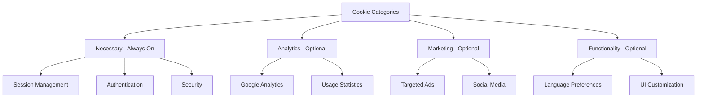
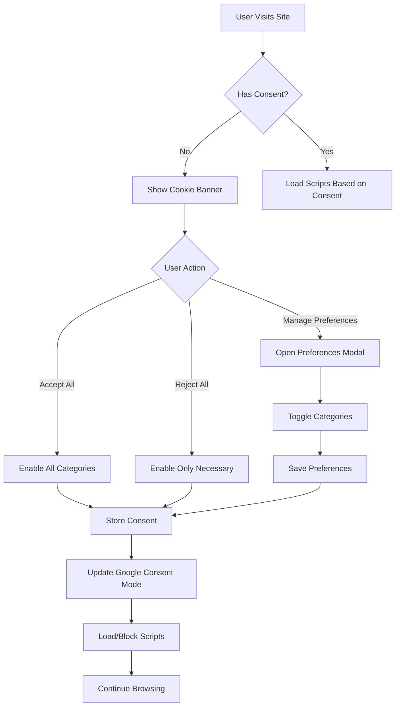

# GDPR/CCPA Cookie Consent Implementation Plan

## Overview

This plan outlines the implementation of a comprehensive GDPR/CCPA compliant cookie consent flow stack for the FunctionFly dashboard application using modern npm libraries and best practices for 2026.

## Tech Stack Analysis

### Current Project Stack
- **Framework**: React 19 with TypeScript
- **Build Tool**: Vite 6
- **State Management**: Zustand 5
- **Styling**: Tailwind CSS 4
- **UI Components**: Radix UI primitives
- **Routing**: React Router 7

### Recommended Cookie Consent Library
**vanilla-cookieconsent** (v3.x) by orestbida
- Lightweight, GDPR/CCPA compliant
- Excellent React integration
- Multi-category support
- Google Consent Mode v2 integration
- High reputation, actively maintained
- 104+ code examples available

## Architecture

### Component Structure

```
web/dashboard/src/
├── components/
│   └── cookie-consent/
│       ├── CookieConsentProvider.tsx    # Main provider with vanilla-cookieconsent init
│       ├── CookieBanner.tsx             # Custom styled banner component
│       ├── CookiePreferencesModal.tsx   # Detailed preferences modal
│       ├── CookieCategoryToggle.tsx     # Individual category toggle
│       └── index.ts                     # Exports
├── stores/
│   └── cookieConsentStore.ts            # Zustand store for consent state
├── hooks/
│   └── useCookieConsent.ts              # Hook for consent status checking
├── config/
│   └── cookieConsentConfig.ts           # Cookie consent configuration
└── pages/
    └── PrivacyPage/
        └── index.tsx                    # Privacy & cookie policy page
```

### Cookie Categories



## Implementation Details

### 1. NPM Package Installation

```bash
npm install vanilla-cookieconsent
```

### 2. Cookie Consent Store - Zustand

```typescript
// stores/cookieConsentStore.ts
interface CookieConsentState {
  hasConsent: boolean;
  consentTimestamp: Date | null;
  categories: {
    necessary: boolean;
    analytics: boolean;
    marketing: boolean;
    functionality: boolean;
  };
  setConsent: (categories: CookieCategories) => void;
  resetConsent: () => void;
}
```

### 3. Cookie Consent Configuration

```typescript
// config/cookieConsentConfig.ts
export const cookieConsentConfig = {
  categories: {
    necessary: {
      enabled: true,
      readOnly: true,
    },
    analytics: {
      enabled: false,
      autoClear: {
        cookies: [
          { name: /^_ga/ },
          { name: '_gid' },
        ],
      },
    },
    marketing: {
      enabled: false,
    },
    functionality: {
      enabled: false,
    },
  },
  language: {
    default: 'en',
    translations: {
      en: {
        consentModal: {
          title: 'We value your privacy',
          description: 'We use cookies to enhance your experience...',
          acceptAllBtn: 'Accept All',
          acceptNecessaryBtn: 'Reject All',
          showPreferencesBtn: 'Manage Preferences',
        },
        preferencesModal: {
          title: 'Cookie Preferences',
          acceptAllBtn: 'Accept All',
          acceptNecessaryBtn: 'Reject All',
          savePreferencesBtn: 'Save Preferences',
        },
      },
    },
  },
};
```

### 4. Google Consent Mode v2 Integration

```typescript
// Google Consent Mode v2 integration
gtag('consent', 'default', {
  ad_storage: 'denied',
  ad_user_data: 'denied',
  ad_personalization: 'denied',
  analytics_storage: 'denied',
  functionality_storage: 'denied',
  personalization_storage: 'denied',
  security_storage: 'granted',
});
```

## User Flow



## GDPR/CCPA Compliance Features

### GDPR Requirements
- ✅ Explicit opt-in consent before setting non-essential cookies
- ✅ Granular control over cookie categories
- ✅ Easy withdrawal of consent
- ✅ Clear information about cookie purposes
- ✅ Consent records with timestamps

### CCPA Requirements
- ✅ Do Not Sell/Share My Personal Information option
- ✅ Opt-out mechanism for data selling
- ✅ Clear privacy notice
- ✅ Equal treatment for opted-out users

## UI Components

### Cookie Banner Design
- Bottom-right positioned banner
- Dark theme matching existing dashboard
- Three action buttons: Accept All, Reject All, Manage Preferences
- Smooth animations using Framer Motion

### Preferences Modal
- Category toggles with descriptions
- Individual service toggles within categories
- Links to privacy policy
- Save and Cancel buttons

## Integration Points

### App.tsx Integration
```typescript
import { CookieConsentProvider } from '@/components/cookie-consent';

function App() {
  return (
    <QueryClientProvider client={queryClient}>
      <CookieConsentProvider>
        <BrowserRouter>
          {/* existing routes */}
        </BrowserRouter>
      </CookieConsentProvider>
    </QueryClientProvider>
  );
}
```

### Conditional Script Loading
```typescript
// Example: Load analytics only if consented
if (cookieConsentStore.getState().categories.analytics) {
  // Initialize Google Analytics
}
```

## Files to Create

| File | Purpose |
|------|---------|
| `components/cookie-consent/CookieConsentProvider.tsx` | Main provider component |
| `components/cookie-consent/CookieBanner.tsx` | Banner UI component |
| `components/cookie-consent/CookiePreferencesModal.tsx` | Preferences modal |
| `components/cookie-consent/CookieCategoryToggle.tsx` | Category toggle component |
| `components/cookie-consent/index.ts` | Barrel exports |
| `stores/cookieConsentStore.ts` | Zustand store |
| `hooks/useCookieConsent.ts` | Consent status hook |
| `config/cookieConsentConfig.ts` | Configuration |
| `pages/PrivacyPage/index.tsx` | Privacy policy page |

## Testing Checklist

- [ ] Banner appears on first visit
- [ ] Accept All enables all categories
- [ ] Reject All enables only necessary
- [ ] Preferences modal allows granular control
- [ ] Consent persists across sessions
- [ ] Google Consent Mode updates correctly
- [ ] Scripts load/block based on consent
- [ ] CCPA opt-out works correctly
- [ ] Mobile responsive design
- [ ] Keyboard accessible

## Dependencies

```json
{
  "vanilla-cookieconsent": "^3.0.1"
}
```

## Next Steps

1. Switch to Code mode to implement the components
2. Install vanilla-cookieconsent package
3. Create the Zustand store
4. Build the UI components
5. Integrate with App.tsx
6. Add privacy policy page
7. Test all consent flows
