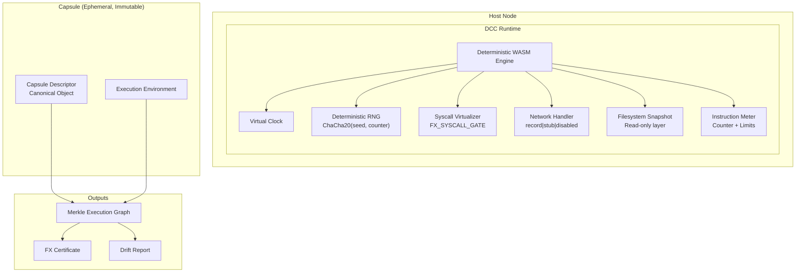

# DCC Protocol Implementation Plan

## Executive Summary

The Deterministic Compute Capsule (DCC) Protocol v1.0 is already partially implemented in the FunctionFly codebase. This document identifies the gaps between the current implementation and the complete DCC v1.0 specification, and provides an implementation roadmap.

## Current Implementation Status

### ✅ Already Implemented

| Component | Location | Status |
|-----------|----------|--------|
| CapsuleDescriptor | `internal/dre/capsule/descriptor.go` | Complete |
| DeterminismFlags | `internal/dre/capsule/descriptor.go` | Complete |
| TimeSeed/RNGSeed derivation | `internal/dre/capsule/descriptor.go` | Partial |
| NetworkMode enum | `internal/dre/capsule/descriptor.go` | Defined but not enforced |
| FloatMode (ieee754-strict) | `internal/dre/capsule/descriptor.go` | Defined but not enforced |
| InstructionLimit | `internal/dre/capsule/descriptor.go` | Defined but not tracked |
| DeterminismTier (full/lite) | `internal/dre/capsule/descriptor.go` | Defined |
| DriftCategory classification | `internal/dre/capsule/drift.go` | Complete |
| DriftReport structure | `internal/dre/capsule/drift.go` | Complete |
| Anti-manipulation detector | `internal/dre/antimanip/detector.go` | Complete |
| MEG building | `internal/dre/crypto/meg.go` | Complete |
| FXCert certificate | `internal/dre/cert/certificate.go` | Complete |
| Replay verification | `internal/api/handlers/registry/execution/verification.go` | Complete |
| Trust scoring integration | Multiple files | Complete |

### ⚠️ Gaps Identified

| Gap | Priority | Description |
|-----|----------|-------------|
| Deterministic RNG | HIGH | No ChaCha20-based RNG implementation |
| Virtual Clock | HIGH | TimeSeed exists but no virtual time progression |
| Syscall Virtualization | HIGH | No syscall gate with recording |
| Network Recording | MEDIUM | NetworkMode defined but not enforced |
| Network Stubbing | MEDIUM | No stub_manifest.json support |
| FS Snapshot | MEDIUM | FSSnapshotHash defined but not implemented |
| Instruction Metering | MEDIUM | No instruction counting |
| Trace Recording | LOW | TraceChunks set to nil |

---

## Implementation Roadmap

### Phase 1: Core Determinism Primitives

#### 1.1 Deterministic RNG (`internal/dre/rng/`)

```
internal/dre/rng/
├── rng.go           # ChaCha20-based deterministic RNG
├── rng_test.go      # Unit tests
└── doc.go           # Package documentation
```

**Requirements:**
- ChaCha20 cipher with seed from `H(InputHash || EnvironmentHash)`
- Counter strictly incremented per call
- No hardware/OS entropy
- Thread-safe for potential future multi-threading

#### 1.2 Virtual Clock (`internal/dre/clock/`)

```
internal/dre/clock/
├── clock.go         # Virtual clock implementation
├── clock_test.go    # Unit tests
└── doc.go           # Package documentation
```

**Requirements:**
- `virtual_time = base_time + tick_counter`
- `base_time = H(execution_id) mod 2^64`
- Time advances only on: explicit sleep, syscall, batch threshold
- No wall clock access allowed

---

### Phase 2: Execution Environment

#### 2.1 Syscall Virtualization (`internal/dre/syscall/`)

```
internal/dre/syscall/
├── gate.go          # FX_SYSCALL_GATE implementation
├── recorder.go      # Syscall recording for trace
├── allowed.go       # Allowed deterministic syscalls
├── blocked.go       # Blocked syscalls list
└── doc.go           # Package documentation
```

**Allowed syscalls:**
- Memory allocation
- Virtual FS read
- Virtual clock read
- Deterministic RNG
- Structured logging

**Blocked syscalls:**
- Raw socket creation
- Direct system clock
- Direct disk access
- Process spawning
- Host file system

#### 2.2 Network Modes (`internal/dre/network/`)

```
internal/dre/network/
├── mode.go          # NetworkMode enum and enforcement
├── recorder.go      # Record mode: capture + store responses
├── stub.go          # Stub mode: serve from manifest
├── manifest.go      # Stub manifest structure
├── disabled.go      # Disabled mode: abort on network call
└── doc.go           # Package documentation
```

**Record Mode:**
- First execution: allow outbound, record request/response
- Replay: return recorded stub
- Store response hash in DependencyHash

**Stub Mode:**
- Load `stub_manifest.json`
- Map URL → deterministic response payload

---

### Phase 3: Filesystem & Resources

#### 3.1 Filesystem Snapshot (`internal/dre/fs/`)

```
internal/dre/fs/
├── snapshot.go      # FS snapshot creation
├── layer.go         # Read-only snapshot layer
├── ephemeral.go     # /tmp tracking and hashing
├── hash.go          # Snapshot hashing
└── doc.go           # Package documentation
```

**Requirements:**
- Read-only snapshot from `fs_snapshot_hash`
- Include: dependencies, compiled artifacts, static assets
- `/tmp` is ephemeral, tracked, hashed into OutputHash
- Replay reconstructs from hash

#### 3.2 Instruction Metering (`internal/dre/meter/`)

```
internal/dre/meter/
├── meter.go         # Instruction counter
├── limits.go        # Limit enforcement
├── resource.go      # Resource tracking
└── doc.go           # Package documentation
```

**Tracked metrics:**
- Total instructions executed
- Peak memory usage
- Syscall count
- Output → ResourceHash

---

### Phase 4: Trace & Full Tier

#### 4.1 Trace Recording (`internal/dre/trace/`)

```
internal/dre/trace/
├── recorder.go      # Trace chunk recording
├── chunker.go       # Chunk management
├── hasher.go        # Trace chunk hashing
└── doc.go           # Package documentation
```

**Requirements:**
- Record each syscall as: `H("FX_SYSCALL" || syscall_type || canonical_args || result)`
- Include in TraceHash
- Lite tier: disable detailed tracing

---

### Phase 5: Protocol Enhancements

#### 5.1 Forward Compatibility

```go
// In CapsuleDescriptor
type CapsuleDescriptor struct {
    ProtocolVersion string `json:"protocol_version"` // "dcc/1.0"
    // ... existing fields
}

// Validation rule:
// - Minor version = backward compatible
// - Major version = root hash domain separation
```

---

## Architecture Diagram



---

## Key Interfaces

### Deterministic RNG Interface

```go
type DeterministicRNG interface {
    // Seed initializes the RNG with a deterministic seed
    Seed(seed []byte)
    
    // Next returns the next deterministic random value
    Next() uint32
    
    // Next64 returns the next 64-bit deterministic random value
    Next64() uint64
    
    // Read fills the given slice with deterministic random bytes
    Read(p []byte) (n int, err error)
    
    // Counter returns the current call count
    Counter() uint64
}
```

### Virtual Clock Interface

```go
type VirtualClock interface {
    // Now returns the current virtual time
    Now() uint64
    
    // Advance advances the virtual time
    Advance(delta uint64)
    
    // Tick advances by one tick (instruction batch)
    Tick()
    
    // SetBase sets the base time (from execution_id)
    SetBase(base uint64)
}
```

### Syscall Gate Interface

```go
type SyscallGate interface {
    // Allowed returns true if the syscall is allowed
    Allowed(syscallID int) bool
    
    // Record records a syscall for trace hashing
    RecordSyscall(syscallID int, args, result []byte)
    
    // Hash returns the syscall trace hash
    Hash() string
}
```

---

## Next Steps

1. **Implement Phase 1**: Deterministic RNG and Virtual Clock
2. **Implement Phase 2**: Syscall virtualization and Network modes
3. **Implement Phase 3**: Filesystem snapshots and instruction metering
4. **Implement Phase 4**: Trace recording for full tier
5. **Implement Phase 5**: Forward compatibility handling
6. **Testing**: Comprehensive unit and integration tests
7. **Documentation**: RFC-style protocol specification

---

## Version History

| Version | Date | Changes |
|---------|------|---------|
| 1.0 | 2026-03-01 | Initial implementation plan |
