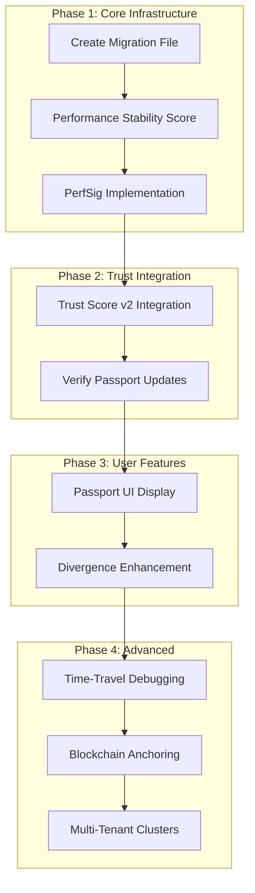

# DRE 2.0 Gap Analysis & Implementation Plan

## Executive Summary

The Deterministic Replay Engine (DRE) 2.0 is already substantially implemented. This document identifies gaps and prioritizes remaining work to achieve the full vision of "Execution as a Verifiable Artifact."

---

## Current Implementation Status

### ✅ Completed Components

| Component | Location | Status |
|-----------|----------|--------|
| MEG Builder | `internal/dre/crypto/meg.go` | Complete |
| Capsule Descriptor | `internal/dre/capsule/descriptor.go` | Complete |
| Drift Categories | `internal/dre/capsule/drift.go` | Complete |
| FXCert Generator | `internal/dre/cert/certificate.go` | Complete |
| Anti-Manipulation Detector | `internal/dre/antimanip/detector.go` | Complete |
| DRE Storage Models | `internal/storage/registry/types.go` | Complete |
| DRE Repository | `internal/storage/registry/dre_repository.go` | Complete |
| DRE API Handlers | `internal/api/handlers/registry/dre/handlers.go` | Complete |
| Trust Score v2 Calculator | `internal/functionregistry/trust_score.go` | Complete |
| MEG Integration in Execution | `internal/api/handlers/registry/execution/handlers.go` | Complete |

---

## Identified Gaps

### 🔴 Critical (Must Implement)

#### 1. Database Migration File
**Issue:** DRE models defined in `types.go` but no migration file exists.

**Location:** Missing `migrations/0004_dre_v2.up.sql`

**Required Tables:**
- `execution_meg_records` - MEG hashes per execution
- `execution_certificates` - FXCERT storage
- `drift_reports` - Divergence tracking
- `function_execution_passports` - Per-function DRE stats

**Impact:** Storage layer cannot persist DRE data without migration.

---

#### 2. Performance Stability Score Computation
**Issue:** `PerformanceStabilityScore` always returns 0 because there's no actual computation.

**Location:** `internal/storage/registry/dre_repository.go`

**Current Code:**
```go
passport.PerformanceStabilityScore = 0 // Never updated!
```

**Required:** Track resource hash variance over time and compute:
```
PerformanceStabilityScore = 1 - stddev(resource_hash_variance)
```

---

#### 3. Resource Usage Signature 2.0 (PerfSig)
**Issue:** Not implemented - requirement from spec for cryptographic performance fingerprint.

**Required:**
```go
// In internal/dre/crypto/perfsig.go
type PerfSig struct {
    CPUCycles      uint64 `json:"cpu_cycles"`
    MemoryPeak     uint64 `json:"memory_peak"`
    SyscallCount   uint32 `json:"syscall_count"`
    IOPatterns     string `json:"io_patterns"`   // hash
    WasmOpCounts   map[string]uint64 `json:"wasm_op_counts"`
    SchedulingTrace string `json:"scheduling_trace"` // hash
}

func ComputePerfSig(usage ResourceUsage) (string, error)
```

**Purpose:**
- Detect replay manipulation
- Anti-optimization fraud detection
- Trust Score integration
- Marketplace fairness

---

### 🟡 Important (Should Implement)

#### 4. Trust Score v2 Integration in Execution Flow
**Issue:** `CalculateV2` exists but may not be called during execution.

**Required:** Call Trust Score v2 calculation after each verified execution:
```go
// After successful replay verification in execution/handlers.go
dreScores, _ := repo.GetDREScoresForTrust(fn.ID)
calc := functionregistry.NewTrustScoreCalculator()
result := calc.CalculateV2(dreMetrics)
repo.UpdateTrustScoreV2(fn.ID, dreScores, result.TrustScoreV2)
```

---

#### 5. Execution Passport Marketplace Display
**Issue:** API returns passport data but may not be displayed in UI.

**Required:** Add to function profile pages:
```
Deterministic Reliability: 99.9987%
Replay Drift Incidents: 0
Verified Executions: 1,240,554
```

---

### 🟢 Nice to Have (Phase 2)

#### 6. Time-Travel Debugging Mode
**Issue:** Not implemented - stepwise deterministic replay with memory inspection.

**Required Features:**
- Step-by-step execution replay
- Memory state inspection at each checkpoint
- Diff two executions
- Trace fingerprint comparison

**Use Case:** GitHub-level debugging for serverless functions.

---

#### 7. Blockchain Anchoring (Optional)
**Issue:** Not implemented - optional layer for tamper-proof timestamping.

**Required:**
- Batch execution root hashes periodically
- Create Merkle root of batch
- Anchor to blockchain (optional, enterprise)

**Note:** Make optional - not required for core functionality.

---

#### 8. Multi-Tenant Replay Clusters (Enterprise)
**Issue:** Not implemented - enterprise tier offering.

**Required:**
- Private replay clusters
- Re-run historical executions
- Validate compliance
- Regulatory audits

**Note:** This is a SaaS product on top of DRE.

---

#### 9. Divergence Simulation Enhancement
**Issue:** Basic implementation exists but needs real execution.

**Current:** Simulated response in `HandleDivergenceSimulation`

**Required:** Actual re-execution under modified constraints:
- Change memory limit
- Change runtime version  
- Change region
- Measure divergence delta

---

## Implementation Priority

### Phase 1: Core Infrastructure (Week 1-2)

1. **Create database migration** - `migrations/0004_dre_v2.up.sql`
2. **Implement Performance Stability Score** - Track and compute
3. **Implement PerfSig** - Cryptographic performance signature

### Phase 2: Trust Integration (Week 2-3)

4. **Integrate Trust Score v2** - Call during execution flow
5. **Verify passport updates** - Ensure scores persist correctly

### Phase 3: User Features (Week 3-4)

6. **Passport UI display** - Add to marketplace
7. **Enhance divergence simulation** - Real execution, not mock

### Phase 4: Advanced Features (Week 5+)

8. **Time-Travel Debugging** - Stepwise replay
9. **Blockchain Anchoring** - Optional layer
10. **Multi-Tenant Clusters** - Enterprise tier

---

## Mermaid: Implementation Flow



---

## Files to Modify

| File | Change Type |
|------|-------------|
| `migrations/0004_dre_v2.up.sql` | CREATE |
| `migrations/0004_dre_v2.down.sql` | CREATE |
| `internal/dre/crypto/perfsig.go` | CREATE |
| `internal/storage/registry/dre_repository.go` | MODIFY |
| `internal/api/handlers/registry/execution/handlers.go` | MODIFY |
| `internal/functionregistry/aggregator.go` | MODIFY |
| `web/dashboard/...` (function profile) | MODIFY |

---

## Verification Checklist

After implementation, verify:

- [ ] Migration runs successfully
- [ ] MEG records stored for deterministic executions
- [ ] FXCert generated and retrievable
- [ ] Replay verification creates DriftReport on divergence
- [ ] Passport shows correct statistics
- [ ] Trust Score v2 includes DRE sub-scores
- [ ] PerformanceStabilityScore computes correctly (not 0)
- [ ] PerfSig generated for each execution
