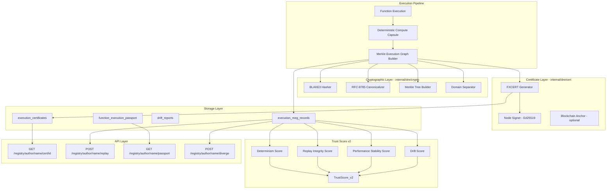
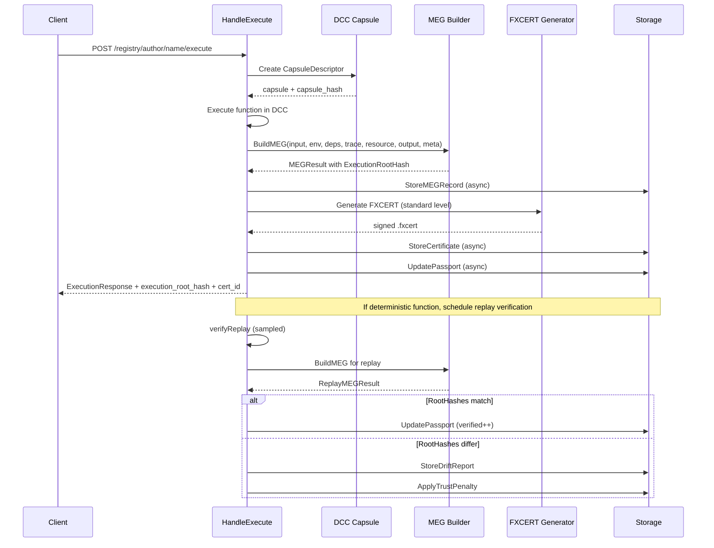

# Deterministic Replay Engine (DRE) 2.0 — Protocol Specification & Implementation Plan

> **"Execution as a Verifiable Artifact"**
>
> Every execution becomes a cryptographic object. Not a log. Not a trace. A sealed, replayable, legally-defensible universe.

---

## Strategic Context

The current DRE in FunctionFly is a **logging feature**: it re-runs deterministic functions and compares outputs. The upgrade transforms it into a **core protocol primitive** — a cryptographic layer that makes every execution a verifiable asset.

### What Changes

| Current DRE | DRE 2.0 |
|---|---|
| Output hash comparison | Merkle Execution Graph (MEG) root hash |
| Simple replay verification | Sealed Deterministic Compute Capsule (DCC) |
| Verification status field | Legal-Grade Execution Certificate (.fxcert) |
| Trust score input | Trust Score v2 with 4 DRE-derived sub-scores |
| No drift classification | Structured DriftReport with 7 categories |
| No public proof | Execution Passport on marketplace |

---

## Architecture Overview



---

## Phase 1: Core Cryptographic Primitives

### New Package: `internal/dre/crypto`

This package implements the MEG hash protocol. It has **zero external dependencies** beyond BLAKE3 (to be added to `go.mod`).

#### File: `internal/dre/crypto/hasher.go`

```go
package crypto

// Domain separation tags — fixed forever in protocol
const (
    TagInput     = "FX_INPUT"
    TagEnv       = "FX_ENV"
    TagDeps      = "FX_DEPS"
    TagDepNode   = "FX_DEP_NODE"
    TagTrace     = "FX_TRACE"
    TagTraceChunk = "FX_TRACE_CHUNK"
    TagResource  = "FX_RES"
    TagOutput    = "FX_OUT"
    TagMeta      = "FX_META"
    TagNode      = "FX_NODE"
    TagSyscall   = "FX_SYSCALL"
    TagCert      = "FX_CERT"
    TagReplayProof = "FX_REPLAY_PROOF"
)

// Hash computes BLAKE3(tag || data)
func Hash(tag string, data []byte) []byte

// HashString returns hex-encoded hash
func HashString(tag string, data []byte) string

// MerkleRoot computes the Merkle root of a list of leaf hashes.
// If odd number of leaves, duplicates the last (Bitcoin-style).
func MerkleRoot(leaves [][]byte) []byte
```

#### File: `internal/dre/crypto/canonicalize.go`

```go
package crypto

// Canonicalize serializes any value to RFC-8785 canonical JSON:
//   - Sorted keys
//   - No whitespace
//   - UTF-8 encoded
//   - Floats normalized
//   - Timestamps in ISO-8601 UTC
//   - Binary as base64
func Canonicalize(v interface{}) ([]byte, error)
```

#### File: `internal/dre/crypto/meg.go`

The core MEG builder. Accepts component payloads, computes all 7 component hashes, builds the Merkle tree, returns `ExecutionRootHash`.

```go
package crypto

type MEGComponents struct {
    InputPayload    interface{}   // args, caller, fx:// URI, seed
    EnvironmentData interface{}   // runtime versions, capsule descriptor
    Dependencies    []Dependency  // name, version, content_hash per dep
    TraceChunks     [][]byte      // raw trace segments
    ResourceUsage   interface{}   // cpu_cycles, memory_peak, etc.
    OutputPayload   interface{}   // return value, exit code, events
    Metadata        interface{}   // execution_id, function_id, nonce, etc.
}

type Dependency struct {
    Name        string
    Version     string
    ContentHash string
}

type MEGResult struct {
    InputHash       string
    EnvironmentHash string
    DependencyHash  string
    TraceHash       string
    ResourceHash    string
    OutputHash      string
    MetadataHash    string
    ExecutionRootHash string  // The canonical identity
    LeafHashes      []string // For partial verification
}

// BuildMEG computes the full Merkle Execution Graph
func BuildMEG(components MEGComponents) (*MEGResult, error)
```

**Leaf ordering is fixed forever:**
1. InputHash
2. EnvironmentHash
3. DependencyHash
4. TraceHash
5. ResourceHash
6. OutputHash
7. MetadataHash

---

## Phase 2: Deterministic Compute Capsule (DCC)

### New Package: `internal/dre/capsule`

#### File: `internal/dre/capsule/descriptor.go`

```go
package capsule

// CapsuleDescriptor is the canonical object describing the sealed execution universe.
// It is canonicalized and hashed into EnvironmentHash.
type CapsuleDescriptor struct {
    ProtocolVersion  string            `json:"protocol_version"`   // "dcc/1.0"
    RuntimeVersion   string            `json:"runtime_version"`    // "wasm/1.12.3"
    EngineVersion    string            `json:"engine_version"`     // "fx-wasm/2.4.1"
    CapsuleVersion   string            `json:"capsule_version"`    // "dcc-core/1.0"
    CPUArch          string            `json:"cpu_arch"`           // "x86_64"
    MemoryLimit      int64             `json:"memory_limit"`       // bytes
    InstructionLimit int64             `json:"instruction_limit"`
    TimeSeed         string            `json:"time_seed"`          // H(execution_id)
    RNGSeed          string            `json:"rng_seed"`           // H(input_hash || env_hash)
    FSSnapshotHash   string            `json:"fs_snapshot_hash"`
    NetworkMode      string            `json:"network_mode"`       // "record"|"stub"|"disabled"
    SyscallProfile   string            `json:"syscall_profile"`    // "strict-v1"
    FloatMode        string            `json:"float_mode"`         // "ieee754-strict"
    DeterminismFlags DeterminismFlags  `json:"determinism_flags"`
    DeterminismTier  string            `json:"determinism_tier"`   // "full"|"lite"
}

type DeterminismFlags struct {
    LockScheduler       bool `json:"lock_scheduler"`
    DisableJITVariance  bool `json:"disable_jit_variance"`
    FixedThreadCount    int  `json:"fixed_thread_count"`
}

// Hash returns the canonical hash of this descriptor
func (d *CapsuleDescriptor) Hash() (string, error)

// Default returns a DCC v1.0 descriptor with safe defaults
func Default(executionID, inputHash, envHash string) *CapsuleDescriptor
```

#### File: `internal/dre/capsule/drift.go`

```go
package capsule

// DriftCategory classifies why a replay diverged
type DriftCategory string

const (
    DriftRNG              DriftCategory = "rng_divergence"
    DriftSyscall          DriftCategory = "syscall_mismatch"
    DriftNetwork          DriftCategory = "network_mismatch"
    DriftFloatingPoint    DriftCategory = "floating_point_mismatch"
    DriftInstructionCount DriftCategory = "instruction_count_mismatch"
    DriftMemoryAccess     DriftCategory = "memory_access_mismatch"
    DriftDependencyMutation DriftCategory = "dependency_mutation"
)

// DriftReport is the structured output when replay diverges
type DriftReport struct {
    ExecutionID     string        `json:"execution_id"`
    OriginalRoot    string        `json:"original_root"`
    ReplayRoot      string        `json:"replay_root"`
    Category        DriftCategory `json:"category"`
    ComponentDiff   []string      `json:"component_diff"` // which hashes differ
    DetectedAt      time.Time     `json:"detected_at"`
    TrustPenalty    float64       `json:"trust_penalty"`
}
```

---

## Phase 3: Execution Certificate (FXCERT)

### New Package: `internal/dre/cert`

#### File: `internal/dre/cert/certificate.go`

```go
package cert

// FXCert is the legal-grade execution certificate
type FXCert struct {
    FXCertVersion string          `json:"fxcert_version"` // "1.0"
    CertificateID string          `json:"certificate_id"` // "fxc_01H..."
    Execution     ExecutionSection  `json:"execution"`
    Capsule       CapsuleSection    `json:"capsule"`
    Integrity     IntegritySection  `json:"integrity"`
    Trust         TrustSection      `json:"trust"`
    Signatures    SignatureSection  `json:"signatures"`
    Anchoring     AnchoringSection  `json:"anchoring"`
    ReplayCert    *ReplayCertSection `json:"replay_certification,omitempty"`
}

type ExecutionSection struct {
    ExecutionID      string `json:"execution_id"`
    FunctionID       string `json:"function_id"`       // "fx://acme/compute/1.2.4"
    OwnerID          string `json:"owner_id"`
    CallerID         string `json:"caller_id"`
    NodeID           string `json:"node_id"`
    Region           string `json:"region"`
    TimestampVirtual string `json:"timestamp_virtual"` // deterministic
    TimestampRealUTC string `json:"timestamp_real_utc"` // informational
    ProtocolVersion  string `json:"protocol_version"`  // "dre/1.0"
}

type IntegritySection struct {
    ExecutionRootHash string `json:"execution_root_hash"`
    InputHash         string `json:"input_hash"`
    EnvironmentHash   string `json:"environment_hash"`
    DependencyHash    string `json:"dependency_hash"`
    TraceHash         string `json:"trace_hash"`
    ResourceHash      string `json:"resource_hash"`
    OutputHash        string `json:"output_hash"`
    MetadataHash      string `json:"metadata_hash"`
    CertificateHash   string `json:"certificate_hash"` // H("FX_CERT" || canonical_cert_without_this_field)
}

type TrustSection struct {
    TrustScore              float64 `json:"trust_score"`
    DeterminismScore        float64 `json:"determinism_score"`
    ReplayConsistencyScore  float64 `json:"replay_consistency_score"`
    DriftIncidentsTotal     int     `json:"drift_incidents_total"`
    VerifiedExecutionsTotal int64   `json:"verified_executions_total"`
}

type SignatureSection struct {
    NodeSignature     *Signature `json:"node_signature"`
    PlatformSignature *Signature `json:"platform_signature,omitempty"`
}

type Signature struct {
    Algorithm string `json:"algorithm"` // "Ed25519"
    PublicKey string `json:"public_key"` // base64
    Signature string `json:"signature"`  // base64
}

// CertLevel controls how much data is included
type CertLevel string
const (
    CertLevelLite      CertLevel = "lite"
    CertLevelStandard  CertLevel = "standard"
    CertLevelLegal     CertLevel = "legal_grade"
)

// Generate creates a signed FXCERT from a completed MEG result
func Generate(meg *crypto.MEGResult, exec ExecutionSection, capsule CapsuleSection,
    trust TrustSection, level CertLevel, nodeKey ed25519.PrivateKey) (*FXCert, error)

// Verify validates all hashes and signatures in an FXCERT
func Verify(cert *FXCert, nodePublicKey ed25519.PublicKey) error
```

---

## Phase 4: Database Schema Migrations

### New Migration: `migrations/0004_dre_v2.up.sql`

```sql
-- Merkle Execution Graph records (one per execution)
CREATE TABLE execution_meg_records (
    id                   UUID PRIMARY KEY DEFAULT gen_random_uuid(),
    execution_id         UUID NOT NULL REFERENCES registry_function_executions(id) ON DELETE CASCADE,
    function_id          UUID NOT NULL,
    version              TEXT NOT NULL,

    -- MEG component hashes
    execution_root_hash  TEXT NOT NULL,
    input_hash           TEXT NOT NULL,
    environment_hash     TEXT NOT NULL,
    dependency_hash      TEXT NOT NULL,
    trace_hash           TEXT,          -- NULL in lite tier
    resource_hash        TEXT NOT NULL,
    output_hash          TEXT NOT NULL,
    metadata_hash        TEXT NOT NULL,

    -- Capsule
    capsule_descriptor_hash TEXT NOT NULL,
    determinism_tier     TEXT NOT NULL DEFAULT 'full',  -- 'full' | 'lite'
    protocol_version     TEXT NOT NULL DEFAULT 'dre/1.0',

    -- Replay state
    replay_root_hash     TEXT,          -- set after successful replay
    replay_verified_at   TIMESTAMPTZ,
    replay_node_id       TEXT,

    created_at           TIMESTAMPTZ NOT NULL DEFAULT NOW(),
    INDEX idx_meg_execution_id (execution_id),
    INDEX idx_meg_function_id (function_id),
    INDEX idx_meg_root_hash (execution_root_hash)
);

-- Execution certificates (.fxcert)
CREATE TABLE execution_certificates (
    id                   UUID PRIMARY KEY DEFAULT gen_random_uuid(),
    certificate_id       TEXT NOT NULL UNIQUE,          -- "fxc_01H..."
    execution_id         UUID NOT NULL REFERENCES registry_function_executions(id),
    meg_record_id        UUID NOT NULL REFERENCES execution_meg_records(id),
    function_id          UUID NOT NULL,

    cert_level           TEXT NOT NULL DEFAULT 'standard', -- 'lite'|'standard'|'legal_grade'
    cert_json            JSONB NOT NULL,                -- full FXCERT document
    execution_root_hash  TEXT NOT NULL,
    certificate_hash     TEXT NOT NULL,

    -- Signatures
    node_signature       TEXT,
    platform_signature   TEXT,

    -- Blockchain anchoring (optional)
    anchored             BOOLEAN NOT NULL DEFAULT FALSE,
    anchor_chain         TEXT,
    anchor_block_number  BIGINT,
    anchor_tx_hash       TEXT,
    anchor_merkle_root   TEXT,
    anchored_at          TIMESTAMPTZ,

    created_at           TIMESTAMPTZ NOT NULL DEFAULT NOW(),
    INDEX idx_cert_execution_id (execution_id),
    INDEX idx_cert_function_id (function_id),
    INDEX idx_cert_root_hash (execution_root_hash)
);

-- Drift reports (when replay diverges)
CREATE TABLE drift_reports (
    id                   UUID PRIMARY KEY DEFAULT gen_random_uuid(),
    execution_id         UUID NOT NULL REFERENCES registry_function_executions(id),
    function_id          UUID NOT NULL,
    version              TEXT NOT NULL,

    original_root_hash   TEXT NOT NULL,
    replay_root_hash     TEXT NOT NULL,
    drift_category       TEXT NOT NULL,  -- DriftCategory enum
    component_diff       JSONB,          -- which component hashes differ
    trust_penalty        FLOAT NOT NULL DEFAULT 0,

    detected_at          TIMESTAMPTZ NOT NULL DEFAULT NOW(),
    INDEX idx_drift_function_id (function_id),
    INDEX idx_drift_detected_at (detected_at)
);

-- Execution Passport (per-function aggregate)
CREATE TABLE function_execution_passports (
    id                          UUID PRIMARY KEY DEFAULT gen_random_uuid(),
    function_id                 UUID NOT NULL UNIQUE REFERENCES registry_functions(id),

    -- Determinism stats
    deterministic_reliability   FLOAT NOT NULL DEFAULT 0,  -- 0.0-1.0
    replay_drift_incidents      INT NOT NULL DEFAULT 0,
    verified_executions_total   BIGINT NOT NULL DEFAULT 0,
    total_executions            BIGINT NOT NULL DEFAULT 0,

    -- DRE sub-scores (feed into TrustScore v2)
    determinism_score           FLOAT NOT NULL DEFAULT 0,
    replay_integrity_score      FLOAT NOT NULL DEFAULT 0,
    performance_stability_score FLOAT NOT NULL DEFAULT 0,
    drift_score                 FLOAT NOT NULL DEFAULT 1,  -- 1.0 = no drift

    -- Capsule version history
    capsule_versions_used       JSONB,  -- array of capsule descriptor hashes seen

    updated_at                  TIMESTAMPTZ NOT NULL DEFAULT NOW(),
    INDEX idx_passport_function_id (function_id)
);

-- Extend registry_function_ratings with DRE v2 scores
ALTER TABLE registry_function_ratings
    ADD COLUMN IF NOT EXISTS determinism_score        FLOAT DEFAULT 0,
    ADD COLUMN IF NOT EXISTS replay_integrity_score   FLOAT DEFAULT 0,
    ADD COLUMN IF NOT EXISTS performance_stability_score FLOAT DEFAULT 0,
    ADD COLUMN IF NOT EXISTS drift_score              FLOAT DEFAULT 1,
    ADD COLUMN IF NOT EXISTS trust_score_v2           FLOAT DEFAULT 0,
    ADD COLUMN IF NOT EXISTS trust_v2_updated_at      TIMESTAMPTZ;
```

---

## Phase 5: Storage Layer

### New File: `internal/storage/registry/dre_repository.go`

Key methods:

```go
// StoreMEGRecord persists a Merkle Execution Graph record
func (r *RegistryRepository) StoreMEGRecord(rec *MEGRecord) error

// GetMEGByExecutionID retrieves the MEG record for an execution
func (r *RegistryRepository) GetMEGByExecutionID(executionID uuid.UUID) (*MEGRecord, error)

// StoreCertificate persists an FXCERT
func (r *RegistryRepository) StoreCertificate(cert *ExecutionCertificate) error

// GetCertificateByID retrieves a certificate by its certificate_id
func (r *RegistryRepository) GetCertificateByID(certID string) (*ExecutionCertificate, error)

// GetCertificatesByFunctionID lists certificates for a function (paginated)
func (r *RegistryRepository) GetCertificatesByFunctionID(functionID uuid.UUID, limit, offset int) ([]*ExecutionCertificate, error)

// StoreDriftReport persists a drift report and updates passport
func (r *RegistryRepository) StoreDriftReport(report *DriftReport) error

// GetOrCreatePassport retrieves or initializes the execution passport for a function
func (r *RegistryRepository) GetOrCreatePassport(functionID uuid.UUID) (*ExecutionPassport, error)

// UpdatePassport updates the execution passport after each verified execution
func (r *RegistryRepository) UpdatePassport(functionID uuid.UUID, update PassportUpdate) error

// GetDREScoresForTrust retrieves the 4 DRE sub-scores for TrustScore v2 calculation
func (r *RegistryRepository) GetDREScoresForTrust(functionID uuid.UUID) (*DREScores, error)
```

---

## Phase 6: Execution Pipeline Integration

### Changes to `internal/api/handlers/registry/execution/handlers.go`

The `HandleExecute` function gains a new post-execution step: **MEG construction**.

```
After execution completes:
1. Build MEGComponents from execution data
2. Call crypto.BuildMEG(components) → MEGResult
3. Store MEGRecord in DB (async, non-blocking)
4. If deterministic function: generate FXCERT (standard level)
5. Attach execution_root_hash to ExecutionResponse
6. If replay verification triggered: compare replay MEG root vs original
7. If roots differ: create DriftReport, update passport, apply trust penalty
```

### Changes to `internal/api/handlers/registry/execution/verification.go`

The `verifyReplay` function is upgraded:

```
Old: compare JSON output bytes
New:
1. Re-execute in same DCC (same capsule descriptor hash)
2. Build MEG for replay execution
3. Compare ExecutionRootHash (not just output)
4. If mismatch: classify drift category from component diff
5. Return enhanced ReplayVerificationResult with MEG data
```

### New File: `internal/api/handlers/registry/execution/meg_builder.go`

```go
// BuildMEGFromExecution constructs MEGComponents from execution context
func BuildMEGFromExecution(
    fnVersion *storage.RegistryFunctionVersion,
    input json.RawMessage,
    output json.RawMessage,
    resourceUsage *ResourceUsage,
    capsule *capsule.CapsuleDescriptor,
    execMeta ExecutionMetadata,
) (*crypto.MEGComponents, error)
```

### Changes to `internal/api/handlers/registry/execution/types.go`

```go
// ReplayVerificationResult gains MEG fields
type ReplayVerificationResult struct {
    // ... existing fields ...
    OriginalRootHash string
    ReplayRootHash   string
    DriftCategory    capsule.DriftCategory
    ComponentDiff    []string
    MEGRecord        *MEGRecord
}

// ExecutionMetadata for MEG construction
type ExecutionMetadata struct {
    ExecutionID     string
    FunctionID      string
    OwnerID         string
    CallerID        string
    NodeID          string
    Region          string
    Nonce           string
    ProtocolVersion string
}
```

---

## Phase 7: Trust Score v2

### Changes to `internal/storage/registry/statistics_ratings.go`

The existing `TrustScoreCalculator` gains 4 new DRE-derived inputs:

```
TrustScore_v2 = (success_rate * 0.15) +
                (latency_score * 0.10) +
                (reliability_score * 0.15) +
                (volume_score * 0.08) +
                (diversity_score * 0.17) +
                (determinism_score * 0.10) +      ← NEW
                (replay_integrity_score * 0.10) + ← NEW
                (performance_stability_score * 0.08) + ← NEW
                (drift_score * 0.07)              ← NEW
```

**DRE sub-score definitions:**

| Score | Formula | Range |
|---|---|---|
| `determinism_score` | `verified_executions / total_executions` | 0.0–1.0 |
| `replay_integrity_score` | `1 - (drift_incidents / verified_executions)` | 0.0–1.0 |
| `performance_stability_score` | `1 - stddev(resource_hash_variance)` | 0.0–1.0 |
| `drift_score` | `exp(-drift_incidents * 0.1)` | 0.0–1.0 |

---

## Phase 8: Anti-Manipulation Layer

### New File: `internal/dre/antimanip/detector.go`

```go
package antimanip

// DriftDetector analyzes replay results and classifies manipulation attempts
type DriftDetector struct{}

// Analyze compares original and replay MEG results, returns DriftReport if diverged
func (d *DriftDetector) Analyze(original, replay *crypto.MEGResult) (*capsule.DriftReport, error)

// ClassifyDrift determines the most likely drift category from component diff
func ClassifyDrift(componentDiff []string) capsule.DriftCategory

// TrustPenalty returns the trust score penalty for a given drift category
func TrustPenalty(category capsule.DriftCategory) float64
```

**Penalty table:**

| Drift Category | Trust Penalty |
|---|---|
| `rng_divergence` | -0.05 |
| `syscall_mismatch` | -0.10 |
| `network_mismatch` | -0.03 |
| `floating_point_mismatch` | -0.02 |
| `instruction_count_mismatch` | -0.08 |
| `memory_access_mismatch` | -0.08 |
| `dependency_mutation` | -0.15 |

---

## Phase 9: API Endpoints

### New Routes (added to `internal/api/routes.go`)

```
GET  /registry/{author}/{name}/cert/{cert_id}
     → Returns FXCERT JSON for a specific execution certificate

GET  /registry/{author}/{name}/certs
     → Lists certificates for a function (paginated)

POST /registry/{author}/{name}/replay/{execution_id}
     → Triggers a deterministic replay, returns new MEG + comparison

GET  /registry/{author}/{name}/passport
     → Returns the Execution Passport (public determinism stats)

POST /registry/{author}/{name}/diverge
     → Divergence simulation: replay under modified constraints
       Body: { "memory_limit": 512, "runtime_version": "wasm/1.13.0", "region": "eu-west" }
       Returns: DivergenceDelta report
```

### New Handler File: `internal/api/handlers/registry/dre/handlers.go`

```go
package dre

type Handler struct {
    Repo        *registry.RegistryRepository
    DRERepo     *storage.DRERepository
    NodeSigner  ed25519.PrivateKey
}

func (h *Handler) HandleGetCertificate(w http.ResponseWriter, r *http.Request)
func (h *Handler) HandleListCertificates(w http.ResponseWriter, r *http.Request)
func (h *Handler) HandleReplay(w http.ResponseWriter, r *http.Request)
func (h *Handler) HandleGetPassport(w http.ResponseWriter, r *http.Request)
func (h *Handler) HandleDivergenceSimulation(w http.ResponseWriter, r *http.Request)
```

---

## Phase 10: Execution Passport (Marketplace)

### Passport API Response Shape

```json
{
  "function": "fx://acme/compute",
  "passport": {
    "deterministic_reliability": 0.999987,
    "replay_drift_incidents": 0,
    "verified_executions_total": 1240554,
    "total_executions": 1240601,
    "determinism_score": 1.0,
    "replay_integrity_score": 0.9999,
    "performance_stability_score": 0.9987,
    "drift_score": 1.0,
    "capsule_version": "dcc/1.0",
    "determinism_tier": "full",
    "last_verified_at": "2026-02-27T23:00:00Z"
  }
}
```

This data is surfaced on the marketplace function listing page as:

```
Deterministic Reliability: 99.9987%
Replay Drift Incidents: 0
Verified Executions: 1,240,554
Capsule: dcc/1.0 | Full Tier
```

---

## File Change Summary

| File | Action | Description |
|---|---|---|
| `internal/dre/crypto/hasher.go` | **NEW** | BLAKE3 + domain separation + Merkle tree |
| `internal/dre/crypto/canonicalize.go` | **NEW** | RFC-8785 canonical JSON |
| `internal/dre/crypto/meg.go` | **NEW** | MEG builder — 7 component hashes → root |
| `internal/dre/capsule/descriptor.go` | **NEW** | DCC protocol descriptor + hash |
| `internal/dre/capsule/drift.go` | **NEW** | DriftReport + DriftCategory types |
| `internal/dre/cert/certificate.go` | **NEW** | FXCERT generation + verification |
| `internal/dre/antimanip/detector.go` | **NEW** | Drift classification + trust penalties |
| `internal/api/handlers/registry/dre/handlers.go` | **NEW** | DRE API handlers |
| `internal/api/handlers/registry/execution/meg_builder.go` | **NEW** | MEG construction from execution context |
| `internal/api/handlers/registry/execution/types.go` | **MODIFY** | Add MEG fields to ReplayVerificationResult |
| `internal/api/handlers/registry/execution/handlers.go` | **MODIFY** | Post-execution MEG construction + cert generation |
| `internal/api/handlers/registry/execution/verification.go` | **MODIFY** | Upgrade replay to MEG root comparison |
| `internal/storage/registry/dre_repository.go` | **NEW** | DRE storage methods |
| `internal/storage/registry/types.go` | **MODIFY** | Add MEGRecord, ExecutionCertificate, DriftReport, ExecutionPassport models |
| `internal/storage/registry/statistics_ratings.go` | **MODIFY** | TrustScore v2 with 4 DRE sub-scores |
| `internal/api/routes.go` | **MODIFY** | Register DRE API routes |
| `migrations/0004_dre_v2.up.sql` | **NEW** | DB schema for DRE 2.0 tables |
| `migrations/0004_dre_v2.down.sql` | **NEW** | Rollback migration |
| `go.mod` | **MODIFY** | Add `lukechampine.com/blake3` dependency |

---

## Dependency Addition

```
go get lukechampine.com/blake3
```

BLAKE3 is the default hash algorithm. For compliance mode (FIPS environments), the hasher can be swapped to SHA-256 via a build tag or config flag — the domain separation and Merkle structure remain identical.

---

## Execution Flow Diagram (DRE 2.0 Integrated)



---

## FXCERT Verification Algorithm

```
1. Canonicalize the FXCERT JSON (RFC-8785)
2. Recompute ExecutionRootHash from component hashes via MerkleRoot
3. Assert: computed_root == integrity.execution_root_hash
4. Recompute CertificateHash = H("FX_CERT" || canonical_cert_without_certificate_hash)
5. Assert: computed_cert_hash == integrity.certificate_hash
6. Verify Ed25519 signature: Verify(node_public_key, execution_root_hash, node_signature)
7. (Optional) Check blockchain anchor if anchored == true
```

---

## Certificate Levels

| Level | Contents | Use Case |
|---|---|---|
| `lite` | root hash + node sig + minimal trust | High-volume, low-cost |
| `standard` | all component hashes + capsule hash + trust snapshot | Default for all executions |
| `legal_grade` | standard + full trace Merkle root + dep root + platform sig + replay cert | Enterprise compliance, audit, court |

---

## Blockchain Anchoring (Optional Enterprise Add-On)

Every N executions (configurable, default 1000):

```
Batch ExecutionRootHash[] → MerkleRoot → Anchor on-chain
```

Only the root hash is anchored — not the full certificate. This keeps on-chain costs minimal while providing tamper-proof timestamping.

The anchoring section in FXCERT is populated after the on-chain transaction confirms.

---

## Forward Compatibility Rules

1. **Minor version** (`dcc/1.1`, `dre/1.1`): backward compatible, new optional fields only
2. **Major version** (`dcc/2.0`, `dre/2.0`): domain separation tags updated, new leaf ordering
3. **Never silently change behavior** — any behavioral change requires a version bump
4. **Leaf array is append-only** — new components added at the end, never reordered

---

## Strategic Positioning

After DRE 2.0 ships, FunctionFly can publicly claim:

> **"Every function execution on FunctionFly is a cryptographically verifiable artifact. Not a log. A sealed, replayable, legally-defensible proof of compute."**

Marketplace differentiators:
- `Deterministic Reliability: 99.9987%` — mathematically verified, not self-reported
- `Replay Drift Incidents: 0` — anti-manipulation proof
- `Verified Executions: 1,240,554` — social proof with cryptographic backing
- `.fxcert` download — enterprise compliance artifact

This positions FunctionFly for:
- Government contracts (audit trail)
- Financial compliance (SOC 2, ISO 27001 alignment)
- AI audit infrastructure (verifiable model inference)
- Blockchain-native credibility (optional anchoring)
