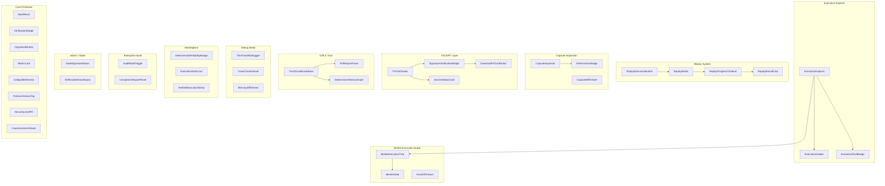

# DRE UI Component Architecture Plan

## Executive Summary

This document outlines the React component architecture for the **Verifiable Execution OS UI** - a comprehensive frontend implementation for the Deterministic Replay Engine (DRE) 2.0, Deterministic Capsule (DCC), FXCERT, Trust/Drift systems, and Enterprise Audit Mode.

This plan builds upon the existing specifications in:
- [`plans/DRE_2_PROTOCOL.md`](/plans/DRE_2_PROTOCOL.md) - Protocol specifications
- [`plans/EXECUTION_ROOT_HASH_EXPLORER_PLAN.md`](/plans/EXECUTION_ROOT_HASH_EXPLORER_PLAN.md) - Initial UI concepts
- [`web/dashboard/src/api/dre.ts`](/web/dashboard/src/api/dre.ts:1) - Existing API client

---

## Component File Organization

```
web/dashboard/src/
├── components/
│   └── dre/                          # DRE Component Library
│       ├── primitives/               # Core Utility Components
│       │   ├── HashBlock.tsx
│       │   ├── VerificationBadge.tsx
│       │   ├── CopyHashButton.tsx
│       │   ├── CanonicalJsonViewer.tsx
│       │   ├── CollapsibleSection.tsx
│       │   ├── MetricCard.tsx
│       │   ├── ProtocolVersionTag.tsx
│       │   └── SecurityLevelPill.tsx
│       ├── execution/               # Execution Explorer Surface
│       │   ├── ExecutionExplorer.tsx
│       │   ├── ExecutionHeader.tsx
│       │   └── ExecutionRootBadge.tsx
│       ├── merkle/                  # Merkle Execution Graph UI
│       │   ├── MerkleExecutionTree.tsx
│       │   ├── MerkleNode.tsx
│       │   └── HashDiffViewer.tsx
│       ├── replay/                  # Replay System UI
│       │   ├── ReplayExecutionButton.tsx
│       │   ├── ReplayModal.tsx
│       │   ├── ReplayProgressTimeline.tsx
│       │   └── ReplayResultCard.tsx
│       ├── capsule/                 # Capsule Inspection UI
│       │   ├── CapsuleInspector.tsx
│       │   ├── DeterminismBadge.tsx
│       │   └── CapsuleDiffViewer.tsx
│       ├── fxcert/                  # FXCERT UI Layer
│       │   ├── FXCertViewer.tsx
│       │   ├── SignatureVerificationBadge.tsx
│       │   ├── DownloadFXCertButton.tsx
│       │   └── AnchorStatusCard.tsx
│       ├── drift/                   # Drift & Trust UI
│       │   ├── DriftReportPanel.tsx
│       │   ├── TrustScoreBreakdown.tsx
│       │   └── DeterminismHistoryGraph.tsx
│       ├── debug/                   # Debug Mode Components
│       │   ├── TimeTravelDebugger.tsx
│       │   ├── TraceChunkViewer.tsx
│       │   └── MemoryDiffViewer.tsx
│       ├── marketplace/            # Marketplace Surface
│       │   ├── DeterministicReliabilityBadge.tsx
│       │   ├── ExecutionStatsCard.tsx
│       │   └── VerifiedExecutionStamp.tsx
│       ├── enterprise/             # Enterprise Audit Mode
│       │   ├── AuditModeToggle.tsx
│       │   └── ComplianceExportPanel.tsx
│       └── admin/                   # Admin / Node UI
│           ├── NodeSignatureStatus.tsx
│           └── DriftIncidentDashboard.tsx
├── api/
│   └── dre.ts                       # Existing - Extend with new endpoints
├── hooks/
│   └── useDRE.ts                    # New - DRE-specific hooks
├── types/
│   └── dre.ts                       # New - Extended TypeScript types
└── pages/
    └── ExecutionExplorer/
        └── index.tsx                # New - Standalone explorer page
```

---

## TypeScript Type Definitions

### Extended Types for DRE UI

```typescript
// web/dashboard/src/types/dre.ts

// ============= Capsule Types =============
export interface CapsuleDescriptor {
  protocol_version: string;
  runtime_version: string;
  engine_version: string;
  capsule_version: string;
  cpu_arch: string;
  memory_limit: number;
  instruction_limit: number;
  time_seed: string;
  rng_seed: string;
  fs_snapshot_hash: string;
  network_mode: 'record' | 'stub' | 'disabled';
  syscall_profile: string;
  float_mode: string;
  determinism_flags: DeterminismFlags;
  determinism_tier: 'full' | 'lite' | 'partial';
}

export interface DeterminismFlags {
  lock_scheduler: boolean;
  disable_jit_variance: boolean;
  fixed_thread_count: number;
}

// ============= Drift Types =============
export type DriftCategory = 
  | 'rng_divergence'
  | 'syscall_mismatch'
  | 'network_mismatch'
  | 'floating_point_mismatch'
  | 'instruction_count_mismatch'
  | 'memory_access_mismatch'
  | 'dependency_mutation';

export interface DriftReport {
  execution_id: string;
  original_root: string;
  replay_root: string;
  category: DriftCategory;
  component_diff: string[];
  detected_at: string;
  trust_penalty: number;
}

// ============= Trust Types =============
export interface TrustScore {
  overall: number;
  determinism_score: number;
  replay_consistency_score: number;
  performance_stability_score: number;
  drift_score: number;
  verified_executions_total: number;
  drift_incidents_total: number;
}

export interface TrustHistoryPoint {
  timestamp: string;
  trust_score: number;
  determinism_score: number;
  drift_events: number;
}

// ============= FXCERT Types =============
export type CertLevel = 'lite' | 'standard' | 'legal_grade';

export interface Signature {
  algorithm: string;
  public_key: string;
  signature: string;
}

export interface FXCert {
  fxcert_version: string;
  certificate_id: string;
  execution: ExecutionSection;
  capsule: CapsuleSection;
  integrity: IntegritySection;
  trust: TrustSection;
  signatures: SignatureSection;
  anchoring?: AnchoringSection;
  replay_certification?: ReplayCertSection;
}

export interface ExecutionSection {
  execution_id: string;
  function_id: string;
  owner_id: string;
  caller_id: string;
  node_id: string;
  region: string;
  timestamp_virtual: string;
  timestamp_real_utc: string;
  protocol_version: string;
}

export interface CapsuleSection {
  descriptor_hash: string;
  runtime_version: string;
  determinism_tier: string;
}

export interface IntegritySection {
  execution_root_hash: string;
  input_hash: string;
  environment_hash: string;
  dependency_hash: string;
  trace_hash: string;
  resource_hash: string;
  output_hash: string;
  metadata_hash: string;
  certificate_hash: string;
}

export interface TrustSection {
  trust_score: number;
  determinism_score: number;
  replay_consistency_score: number;
  drift_incidents_total: number;
  verified_executions_total: number;
}

export interface SignatureSection {
  node_signature?: Signature;
  platform_signature?: Signature;
}

export interface AnchoringSection {
  anchored: boolean;
  chain?: string;
  block_number?: number;
  tx_hash?: string;
  merkle_root?: string;
  anchored_at?: string;
}

export interface ReplayCertSection {
  replay_id: string;
  replay_node_id: string;
  replay_timestamp: string;
  roots_match: boolean;
}

// ============= Replay Types =============
export type ReplayMode = 'strict' | 'lite' | 'debug';

export interface ReplayRequest {
  execution_id: string;
  mode: ReplayMode;
  node_id?: string;
}

export interface ReplayResult {
  replay_id: string;
  execution_id: string;
  replay_root_hash: string;
  roots_match: boolean;
  mode: ReplayMode;
  node_id: string;
  completed_at: string;
  drift_report?: DriftReport;
}

// ============= Marketplace Types =============
export interface ExecutionPassport {
  function_id: string;
  deterministic_reliability: number;
  replay_drift_incidents: number;
  verified_executions_total: number;
  total_executions: number;
  determinism_score: number;
  replay_integrity_score: number;
  performance_stability_score: number;
  drift_score: number;
}

// ============= Extended Execution Types =============
export interface ExecutionDetail extends Execution {
  capsule?: CapsuleDescriptor;
  certificate?: ExecutionCertificate;
  replay_result?: ReplayResult;
  trust_score?: TrustScore;
}
```

---

## Component Specifications

### Phase 1: MVP Components (Launch Priority)

#### 1.1 Core Utility Components (Primitives)

These components form the design language and are reused everywhere.

| Component | Purpose | Props | Key Features |
|-----------|---------|-------|--------------|
| [`HashBlock`](/web/dashboard/src/components/dre/primitives/HashBlock.tsx:1) | Display hashes with copy functionality | `hash: string`, `label?: string`, `truncated?: boolean` | Monospace font, copy button, tooltip for full hash |
| [`VerificationBadge`](/web/dashboard/src/components/dre/primitives/VerificationBadge.tsx:1) | Show verification state | `verified: boolean`, `size?: 'sm' \| 'md' \| 'lg'` | Green checkmark / Red X, animated |
| [`CopyHashButton`](/web/dashboard/src/components/dre/primitives/CopyHashButton.tsx:1) | Copy-to-clipboard for hashes | `value: string`, `label?: string` | Click feedback, tooltip |
| [`MetricCard`](/web/dashboard/src/components/dre/primitives/MetricCard.tsx:1) | Display numeric metrics | `title: string`, `value: number \| string`, `trend?: 'up' \| 'down' \| 'neutral'` | Icon support, trend indicator |
| [`CollapsibleSection`](/web/dashboard/src/components/dre/primitives/CollapsibleSection.tsx:1) | Expandable content areas | `title: string`, `defaultExpanded?: boolean` | Smooth animation, chevron icon |
| [`ProtocolVersionTag`](/web/dashboard/src/components/dre/primitives/ProtocolVersionTag.tsx:1) | Display protocol versions | `version: string`, `type?: 'protocol' \| 'runtime' \| 'capsule'` | Color-coded badges |
| [`SecurityLevelPill`](/web/dashboard/src/components/dre/primitives/SecurityLevelPill.tsx:1) | Show security classification | `level: 'public' \| 'internal' \| 'confidential' \| 'restricted'` | Color-coded |

#### 1.2 Execution Explorer Components

| Component | Purpose | Props |
|-----------|---------|-------|
| [`ExecutionExplorer`](/web/dashboard/src/components/dre/execution/ExecutionExplorer.tsx:1) | Top-level container for viewing executions | `author: string`, `name: string`, `executionId?: string` |
| [`ExecutionHeader`](/web/dashboard/src/components/dre/execution/ExecutionHeader.tsx:1) | Display execution summary metadata | `execution: ExecutionDetail` |
| [`ExecutionRootBadge`](/web/dashboard/src/components/dre/execution/ExecutionRootBadge.tsx:1) | Visualize root hash with verification | `hash: string`, `verified: boolean`, `anchored?: boolean` |

#### 1.3 Merkle Execution Graph Components

| Component | Purpose | Props |
|-----------|---------|-------|
| [`MerkleExecutionTree`](/web/dashboard/src/components/dre/merkle/MerkleExecutionTree.tsx:1) | Interactive tree of component hashes | `componentHashes: ComponentHashes`, `onNodeClick?: (node) => void` |
| [`MerkleNode`](/web/dashboard/src/components/dre/merkle/MerkleNode.tsx:1) | Individual hash node in tree | `type: HashType`, `hash: string`, `verified: boolean`, `children?: MerkleNode[]` |

#### 1.4 Replay System Components

| Component | Purpose | Props |
|-----------|---------|-------|
| [`ReplayExecutionButton`](/web/dashboard/src/components/dre/replay/ReplayExecutionButton.tsx:1) | Primary CTA for replay | `executionId: string`, `capsuleVersion: string` |
| [`ReplayModal`](/web/dashboard/src/components/dre/replay/ReplayModal.tsx:1) | Replay configuration dialog | `execution: ExecutionDetail`, `onSubmit: (config) => void` |
| [`ReplayResultCard`](/web/dashboard/src/components/dre/replay/ReplayResultCard.tsx:1) | Display replay outcome | `result: ReplayResult` |

#### 1.5 FXCERT UI Components

| Component | Purpose | Props |
|-----------|---------|-------|
| [`FXCertViewer`](/web/dashboard/src/components/dre/fxcert/FXCertViewer.tsx:1) | Full certificate rendering | `certificate: FXCert` |
| [`SignatureVerificationBadge`](/web/dashboard/src/components/dre/fxcert/SignatureVerificationBadge.tsx:1) | Show signature states | `nodeVerified: boolean`, `platformVerified: boolean`, `expired?: boolean` |
| [`AnchorStatusCard`](/web/dashboard/src/components/dre/fxcert/AnchorStatusCard.tsx:1) | Display blockchain anchoring | `anchoring: AnchoringSection` |

#### 1.6 Trust & Drift Components

| Component | Purpose | Props |
|-----------|---------|-------|
| [`TrustScoreBreakdown`](/web/dashboard/src/components/dre/drift/TrustScoreBreakdown.tsx:1) | Pie/stacked breakdown of trust | `trustScore: TrustScore` |
| [`DeterministicReliabilityBadge`](/web/dashboard/src/components/dre/marketplace/DeterministicReliabilityBadge.tsx:1) | Show reliability percentage | `reliability: number` |

---

### Phase 2: Extended Components

#### 2.1 Replay System (Extended)

| Component | Purpose |
|-----------|---------|
| [`ReplayProgressTimeline`](/web/dashboard/src/components/dre/replay/ReplayProgressTimeline.tsx:1) | Visual timeline of replay stages |

#### 2.2 Capsule Inspection

| Component | Purpose |
|-----------|---------|
| [`CapsuleInspector`](/web/dashboard/src/components/dre/capsule/CapsuleInspector.tsx:1) | Display capsule configuration details |
| [`DeterminismBadge`](/web/dashboard/src/components/dre/capsule/DeterminismBadge.tsx:1) | Show determinism tier (FULL/LITE/PARTIAL/DRIFTED) |
| [`CapsuleDiffViewer`](/web/dashboard/src/components/dre/capsule/CapsuleDiffViewer.tsx:1) | Compare capsule descriptors |

#### 2.3 Merkle (Extended)

| Component | Purpose |
|-----------|---------|
| [`HashDiffViewer`](/web/dashboard/src/components/dre/merkle/HashDiffViewer.tsx:1) | Side-by-side hash comparison |

#### 2.4 Drift & Trust (Extended)

| Component | Purpose |
|-----------|---------|
| [`DriftReportPanel`](/web/dashboard/src/components/dre/drift/DriftReportPanel.tsx:1) | Detailed drift analysis |
| [`DeterminismHistoryGraph`](/web/dashboard/src/components/dre/drift/DeterminismHistoryGraph.tsx:1) | Time-series reliability chart |

#### 2.5 Marketplace Surface

| Component | Purpose |
|-----------|---------|
| [`ExecutionStatsCard`](/web/dashboard/src/components/dre/marketplace/ExecutionStatsCard.tsx:1) | Function execution statistics |
| [`VerifiedExecutionStamp`](/web/dashboard/src/components/dre/marketplace/VerifiedExecutionStamp.tsx:1) | Small verification badge |

---

### Phase 3: Enterprise & Debug Components

#### 3.1 Debug Mode Components

| Component | Purpose |
|-----------|---------|
| [`TimeTravelDebugger`](/web/dashboard/src/components/dre/debug/TimeTravelDebugger.tsx:1) | Instruction-by-instruction stepping |
| [`TraceChunkViewer`](/web/dashboard/src/components/dre/debug/TraceChunkViewer.tsx:1) | View hashed trace segments |
| [`MemoryDiffViewer`](/web/dashboard/src/components/dre/debug/MemoryDiffViewer.tsx:1) | Compare memory between executions |

#### 3.2 Enterprise Audit Mode

| Component | Purpose |
|-----------|---------|
| [`AuditModeToggle`](/web/dashboard/src/components/dre/enterprise/AuditModeToggle.tsx:1) | Toggle audit mode visibility |
| [`ComplianceExportPanel`](/web/dashboard/src/components/dre/enterprise/ComplianceExportPanel.tsx:1) | Export audit packages |

#### 3.3 Admin / Node UI

| Component | Purpose |
|-----------|---------|
| [`NodeSignatureStatus`](/web/dashboard/src/components/dre/admin/NodeSignatureStatus.tsx:1) | Node key status display |
| [`DriftIncidentDashboard`](/web/dashboard/src/components/dre/admin/DriftIncidentDashboard.tsx:1) | Admin drift overview |

#### 3.4 FXCERT (Extended)

| Component | Purpose |
|-----------|---------|
| [`DownloadFXCertButton`](/web/dashboard/src/components/dre/fxcert/DownloadFXCertButton.tsx:1) | Export certificate in various formats |

#### 3.5 Utility (Extended)

| Component | Purpose |
|-----------|---------|
| [`CanonicalJsonViewer`](/web/dashboard/src/components/dre/primitives/CanonicalJsonViewer.tsx:1) | Display canonical JSON with syntax highlighting |

---

## Component Hierarchy Diagram



---

## Integration with Existing Dashboard

### Route Configuration

Add new routes in [`web/dashboard/src/App.tsx`](/web/dashboard/src/App.tsx:1):

```tsx
// Execution Explorer routes
<Route path="registry/:author/:name/executions" element={<ExecutionExplorerPage />} />
<Route path="registry/:author/:name/executions/:executionId" element={<ExecutionExplorerPage />} />

// Admin routes (protected)
<Route path="admin/dre" element={<DREAdminPage />} />
<Route path="admin/dre/drift" element={<DriftIncidentsPage />} />
```

### API Extension

Extend [`web/dashboard/src/api/dre.ts`](/web/dashboard/src/api/dre.ts:1) with new endpoints:

```typescript
// New API methods to add
class DreApi {
  // Existing methods...
  
  // Capsule
  async getCapsule(executionId: string): Promise<CapsuleDescriptor>;
  
  // FXCERT
  async getCertificate(certificateId: string): Promise<FXCert>;
  async downloadCertificate(certificateId: string, format: 'json' | 'cbor' | 'pdf'): Promise<Blob>;
  
  // Replay
  async replayExecution(request: ReplayRequest): Promise<ReplayResult>;
  async getReplayStatus(replayId: string): Promise<ReplayResult>;
  
  // Trust
  async getTrustScore(functionId: string): Promise<TrustScore>;
  async getTrustHistory(functionId: string, from: string, to: string): Promise<TrustHistoryPoint[]>;
  
  // Drift
  async getDriftReport(executionId: string): Promise<DriftReport>;
  
  // Marketplace
  async getExecutionPassport(author: string, name: string): Promise<ExecutionPassport>;
  
  // Enterprise
  async exportAuditPackage(functionId: string, from: string, to: string): Promise<Blob>;
  async exportComplianceBundle(functionIds: string[]): Promise<Blob>;
}
```

---

## Implementation Priority Matrix

| Priority | Component | Complexity | Dependencies |
|----------|-----------|------------|--------------|
| P0 | HashBlock | Low | None |
| P0 | VerificationBadge | Low | None |
| P0 | CopyHashButton | Low | None |
| P0 | ExecutionExplorer | High | API, HashBlock, VerificationBadge |
| P0 | ExecutionHeader | Medium | HashBlock |
| P0 | ExecutionRootBadge | Low | HashBlock, VerificationBadge |
| P0 | MerkleExecutionTree | High | MerkleNode |
| P0 | MerkleNode | Medium | HashBlock, VerificationBadge |
| P0 | ReplayExecutionButton | Medium | API |
| P0 | ReplayResultCard | Medium | VerificationBadge |
| P0 | FXCertViewer | High | Multiple primitives |
| P0 | SignatureVerificationBadge | Low | VerificationBadge |
| P0 | TrustScoreBreakdown | Medium | MetricCard |
| P0 | DeterministicReliabilityBadge | Low | None |
| P1 | ReplayModal | Medium | ReplayExecutionButton |
| P1 | AnchorStatusCard | Low | None |
| P1 | MetricCard | Low | None |
| P1 | CollapsibleSection | Low | None |
| P1 | ProtocolVersionTag | Low | None |
| P1 | SecurityLevelPill | Low | None |
| P1 | ExecutionStatsCard | Medium | MetricCard |
| P1 | VerifiedExecutionStamp | Low | VerificationBadge |
| P2 | ReplayProgressTimeline | Medium | None |
| P2 | CapsuleInspector | Medium | CollapsibleSection, ProtocolVersionTag |
| P2 | DeterminismBadge | Low | None |
| P2 | CapsuleDiffViewer | Medium | CapsuleInspector |
| P2 | HashDiffViewer | Medium | HashBlock |
| P2 | DriftReportPanel | Medium | None |
| P2 | DeterminismHistoryGraph | High | None |
| P2 | AuditModeToggle | Low | None |
| P3 | DownloadFXCertButton | Low | API |
| P3 | ComplianceExportPanel | Medium | API |
| P3 | TimeTravelDebugger | High | None |
| P3 | TraceChunkViewer | Medium | None |
| P3 | MemoryDiffViewer | High | None |
| P3 | NodeSignatureStatus | Low | None |
| P3 | DriftIncidentDashboard | High | None |
| P3 | CanonicalJsonViewer | Medium | None |

---

## Design System Integration

### Color Palette

```typescript
// Extend existing theme with DRE-specific colors
const dreTheme = {
  // Verification states
  verified: {
    bg: 'bg-emerald-50',
    text: 'text-emerald-700',
    border: 'border-emerald-200',
    icon: 'text-emerald-500',
  },
  unverified: {
    bg: 'bg-red-50',
    text: 'text-red-700',
    border: 'border-red-200',
    icon: 'text-red-500',
  },
  pending: {
    bg: 'bg-amber-50',
    text: 'text-amber-700',
    border: 'border-amber-200',
    icon: 'text-amber-500',
  },
  
  // Determinism tiers
  determinismFull: {
    bg: 'bg-emerald-50',
    text: 'text-emerald-700',
  },
  determinismLite: {
    bg: 'bg-blue-50',
    text: 'text-blue-700',
  },
  determinismPartial: {
    bg: 'bg-amber-50',
    text: 'text-amber-700',
  },
  determinismDrifted: {
    bg: 'bg-red-50',
    text: 'text-red-700',
  },
  
  // Drift categories
  drift: {
    rng: 'text-purple-600',
    syscall: 'text-orange-600',
    network: 'text-cyan-600',
    floatingPoint: 'text-pink-600',
  },
};
```

### Typography

```typescript
const dreTypography = {
  // Hash displays
  hash: 'font-mono text-sm tracking-wider',
  hashTruncated: 'font-mono text-xs tracking-wider truncate',
  
  // Metrics
  metricLarge-3xl font-bold tracking: 'text-tight',
  metricMedium: 'text-2xl font-semibold',
  metricSmall: 'text-lg font-medium',
  
  // Labels
  label: 'text-xs font-medium uppercase tracking-wide',
  labelMuted: 'text-xs font-medium uppercase tracking-wide text-muted-foreground',
};
```

---

## Testing Strategy

### Unit Tests
- Each primitive component: snapshot tests
- Each container component: render tests with mock data
- Utility functions: unit tests

### Integration Tests
- ExecutionExplorer flow: fetch → render → interact
- Replay flow: initiate → progress → result
- FXCertViewer: parse → render → verify badges

### E2E Tests
- Full execution exploration flow
- Replay initiation and completion
- Certificate download
- Audit export

---

## Performance Considerations

1. **Lazy Loading**: Load debug components and advanced viewers only when needed
2. **Virtualization**: Use virtual lists for long execution histories
3. **Memoization**: Memoize expensive hash computations and tree rendering
4. **Caching**: Cache trust scores and passport data with appropriate TTL
5. **Code Splitting**: Split FXCertViewer into separate chunks per section

---

## Success Criteria

1. **Functionality**: All Phase 1 components render correctly with mock data
2. **Integration**: Connected to existing DRE API endpoints
3. **Design**: Consistent with existing dashboard design language
4. **Performance**: Initial page load < 1s, interaction response < 100ms
5. **Accessibility**: All components meet WCAG 2.1 AA standards

---

## Next Steps

1. Create TypeScript type definitions in [`web/dashboard/src/types/dre.ts`](/web/dashboard/src/types/dre.ts:1)
2. Create core utility components (primitives)
3. Build ExecutionExplorer and related components
4. Integrate with existing API
5. Add to existing function detail pages
6. Build Phase 2 components
7. Build Phase 3 components

---

## Appendix: Component API Contracts

### HashBlock

```typescript
interface HashBlockProps {
  hash: string;
  label?: string;
  truncated?: boolean;
  truncateLength?: number;
  showCopyButton?: boolean;
  size?: 'sm' | 'md' | 'lg';
  className?: string;
}
```

### ExecutionExplorer

```typescript
interface ExecutionExplorerProps {
  author: string;
  name: string;
  executionId?: string;
  mode?: 'list' | 'detail';
  className?: string;
}
```

### MerkleExecutionTree

```typescript
interface MerkleExecutionTreeProps {
  componentHashes: ComponentHashes;
  highlightedHash?: string;
  onNodeClick?: (type: HashType, hash: string) => void;
  className?: string;
}
```

### TrustScoreBreakdown

```typescript
interface TrustScoreBreakdownProps {
  trustScore: TrustScore;
  showDetailed?: boolean;
  chartType?: 'pie' | 'stacked' | 'bar';
  className?: string;
}
```
