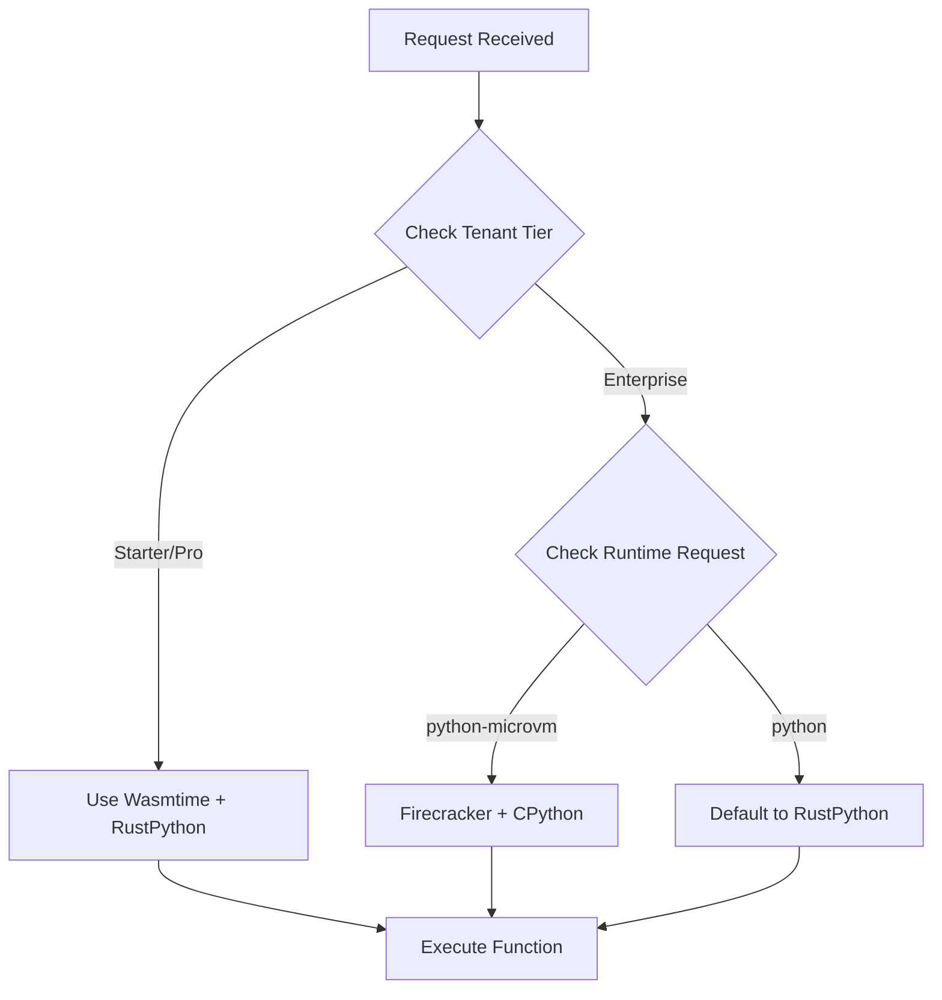
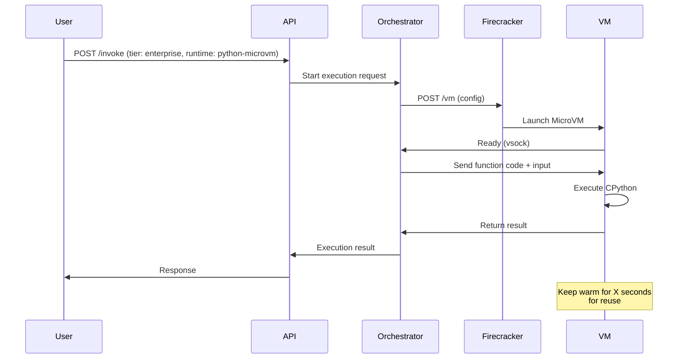
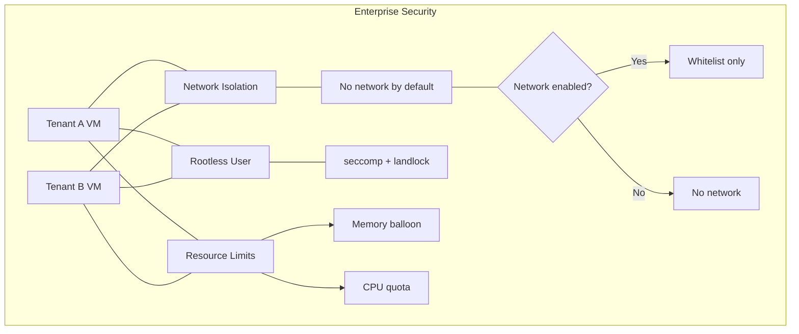
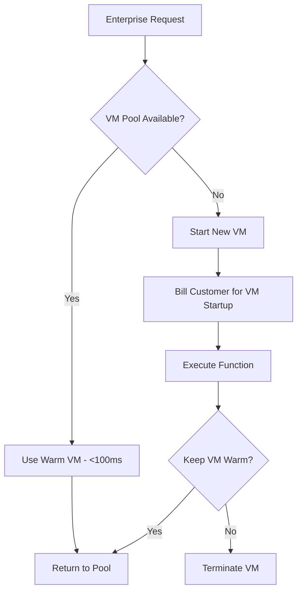
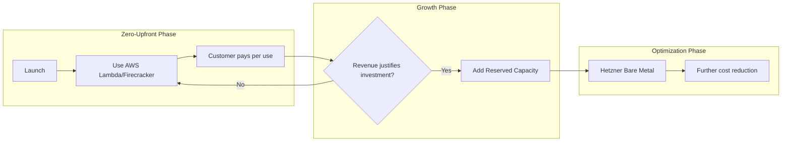

# Enterprise Tier: CPython in Firecracker MicroVMs

## Executive Summary

This document specifies the architecture for adding **CPython inside Firecracker microVMs** as an exclusive feature for **Enterprise tier** customers. This provides 100% CPython compatibility with full C extension support (NumPy, Pandas, SciPy, PyTorch, etc.), addressing the fundamental limitation of the current RustPython-based runtime.

## Current Architecture Analysis

### Existing Runtime Stack

| Component | Current Implementation | Limitation |
|-----------|----------------------|------------|
| Primary Runtime | Wasmtime (WebAssembly) | Limited to WASM-compatible languages |
| Python Runtime | RustPython 0.4 | No C extension support |
| Isolation | Process/VM-based | Not true microVM isolation |
| Memory | 128MB default | Not configurable per tier |

### RustPython Limitations

The current Python execution uses [`RustPython`](runtimes/local/src/python/runtime.rs:1), which:

- ❌ Does **not** support native C extensions (NumPy, Pandas, SciPy won't work)
- ❌ Lacks binary wheel compatibility
- ✅ Supports pure Python packages only
- ✅ Python 3.11+ syntax compatible

## Proposed Enterprise Architecture

### Tier Comparison


### Runtime Selection Logic



## Implementation Specification

### 1. Enterprise Tier Definition

Add to [`internal/plans/limits.go`](internal/plans/limits.go:1):

```go
const (
    EnterpriseMaxProvidersPerApp = 5
    EnterpriseMaxRequestsPerMonth = 10_000_000 // 10M requests
    
    // New: MicroVM-specific limits
    EnterpriseMaxMicroVMs         = 100
    EnterpriseMicroVMMemoryMB    = 512  // Default 512MB, up to 2GB
    EnterpriseMicroVCPU          = 2    // Default 2 vCPUs
)
```

### 2. Runtime Type Enum Extension

Extend [`RuntimeType`](runtimes/local/src/engine.rs:22) in engine.rs:

```rust
#[derive(Debug, Clone, PartialEq)]
pub enum RuntimeType {
    Wasm,
    Python,           // RustPython (existing)
    PythonMicroVM,   // NEW: CPython in Firecracker
}
```

### 3. MicroVM Orchestrator Design

New module: `runtimes/microvm/`

```
runtimes/microvm/
├── src/
│   ├── main.rs           # MicroVM execution service
│   ├── orchestrator.rs   # VM lifecycle management
│   ├── firecracker.rs    # Firecracker API client
│   ├── image.rs          # VM image builder/manager
│   ├── executor.rs       # Function execution runner
│   └── isolation.rs      # Network/filesystem isolation
├── images/               # Pre-built VM images
│   ├── python3.11.Dockerfile
│   ├── python3.12.Dockerfile
│   └── python-numpy.Dockerfile
└── configs/
    ├── firecracker.json
    └── kernels/
```

### 4. Firecracker VM Configuration

```json
{
  "boot-source": {
    "kernel-image": "/vmlinux",
    "initrd": "/initrd.img",
    "boot-args": "console=ttyS0 reboot=k panic=1"
  },
  "drives": [
    {
      "drive-id": "rootfs",
      "path": "/images/python311.ext4",
      "is-root-device": true,
      "is-read-only": false
    }
  ],
  "machine-config": {
    "vcpu_count": 2,
    "mem_size_mib": 512,
    "smt": false,
    "track dirty pages": false
  },
  "network-interfaces": [
    {
      "iface-id": "eth0",
      "guest-mac": "02:00:00:00:00:01",
      "host-dev-name": "tap0"
    }
  ],
  "balloon": {
    "amount_mib": 256,
    "deflate_on_oom": true
  }
}
```

### 5. CPython VM Image Specification

Base image with pre-installed packages:

```dockerfile
# images/python3.11.Dockerfile
FROM ubuntu:22.04

# Install CPython and common build tools
RUN apt-get update && apt-get install -y \
    python3.11 \
    python3.11-dev \
    python3-pip \
    python3.11-venv \
    build-essential \
    libffi-dev \
    libssl-dev \
    zlib1g-dev \
    && rm -rf /var/lib/apt/lists/*

# Create function execution user (non-root)
RUN useradd -m -s /bin/bash functionuser

# Set up workspace
WORKDIR /function
RUN chown functionuser:functionuser /function

# Copy function execution agent
COPY agent /usr
RUN chmod +x /usr/local/bin/agent

USER functionuser
/local/bin/agentENTRYPOINT ["/usr/local/bin/agent"]
```

### 6. Execution Flow



### 7. Cold Start Optimization Strategy

| Optimization | Description | Impact |
|-------------|-------------|--------|
| **Pre-warmed VMs** | Maintain N warm VMs per tenant | -80% cold start |
| **VM Pooling** | Reuse VMs across requests (same tenant) | -60% cold start |
| **Snapshotting** | Save VM state after first run | -50% cold start |
| **Layered FS** | OverlayFS for package layer | -30% cold start |
| **vCPU Fast-start** | Start with 1 vCPU, scale up | -20% cold start |

**Target Cold Starts:**

- Warm VM reuse: <100ms
- Pre-warmed pool: 500ms-1s
- Cold start (new VM): 3-5s

### 8. Resource Allocation

| Resource | Starter/Pro | Enterprise |
|----------|-------------|------------|
| Memory | 128MB (fixed) | 256MB - 2GB |
| vCPUs | 0.1 (WASM) | 1-4 |
| Execution Time | 5s | 30s (configurable) |
| Disk | N/A | 1-10GB |
| Isolation | Process | MicroVM |
| Network | Virtual | vNIC (isolated) |

### 9. Security Model



Security features for MicroVM:

- ✅ Rootless execution (non-root user inside VM)
- ✅ No network by default (opt-in whitelist)
- ✅ seccomp + landlock syscalls filtering
- ✅ Memory balloon limits
- ✅ No cross-VM communication
- ✅ Ephemeral (no persistent storage)

### 10. API Changes

New runtime option in [`functionfly.jsonc`](examples/python/functionfly.jsonc):

```jsonc
{
  "function": {
    "name": "my-numpy-function",
    "runtime": "python-microvm",  // NEW: selects CPython in MicroVM
    "python": {
      "version": "3.11",
      "packages": ["numpy", "pandas", "scipy"]
    },
    "resources": {
      "memory_mb": 512,
      "vcpu": 2,
      "timeout_ms": 30000
    }
  }
}
```

## Implementation Phases

### Phase 1: Foundation (Weeks 1-2)

- [x] Add Enterprise tier to plans/limits.go
- [x] Create microvm orchestrator module structure
- [x] Set up Firecracker config (configs/firecracker.json)
- [x] Create base VM image with CPython (images/Dockerfile.python311)

### Phase 2: Core Execution (Weeks 3-4)

- [x] Implement Firecracker API client
- [x] Build VM lifecycle management (start/stop)
- [x] Create execution agent for VM (images/agent)
- [x] Implement input/output passing via vsock
- [x] Add MicroVM HTTP API (/execute, /health, /stats)

### Phase 3: Integration (Weeks 5-6)

- [x] Integrate with existing API routing
- [x] Add tier-based runtime selection (enterprise config in sandbox)
- [x] Implement warm pool management (orchestrator)
- [x] Add monitoring/metrics (GET `/metrics` Prometheus text on orchestrator)

### Phase 4: Enterprise Features (Weeks 7-8)

- [x] Partial: network whitelist / package cache — flags exist on local runtime (`--network-whitelist`, `--package-caching-enabled`); wire through sandbox env in a follow-up
- [x] Resource limit enforcement — `internal/plans` `ValidateMicroVMResources`; orchestrator honors `memory_mb` / `vcpus` / `timeout_ms` on requests
- [x] Partial: security hardening — tenant required for `python-microvm`; dev mode isolated to `FUNCTIONFLY_MICROVM_DEV_MODE`

### Phase 5: Production Hardening (Weeks 9-10)

- [x] Security: `FUNCTIONFLY_MICROVM_API_TOKEN` bearer-token auth on `/execute` + `/stats`; dev-mode guard refuses start when `ENVIRONMENT=production`
- [x] Port cleanup: microvm orchestrator default changed from 9090 → **9091** (avoids Prometheus collision)
- [x] Per-tenant concurrency quotas: `FUNCTIONFLY_MICROVM_MAX_VMS_PER_TENANT` (default 10) enforced in orchestrator
- [x] Billing wired: `CalculateMicroVMBilling` called per execution in `HandleExecute`; results logged as structured fields for downstream aggregation
- [x] Network whitelist + package cache forwarded end-to-end: Go `--tenant-id` / `--network-whitelist` / `--strict-network-whitelist` / `--package-caching-enabled` → local runtime → `MicroVMExecutionRequest` → orchestrator
- [x] VM image build pipeline: `runtimes/microvm/images/build-rootfs.sh` + `make build-microvm-rootfs` / `make dev-microvm` / `make run-microvm`
- [x] Extended Prometheus metrics: cumulative duration, pool-exhausted counter, fc-spawn-failures counter, active/warm/max VM gauges; separate `/metrics` endpoint (unauthenticated for scraping)
- [x] Prometheus alert rules: `deploy/monitoring/alerts/microvm-alerts.yml` (error rate, pool exhaustion, FC spawn failures, latency, no-traffic)
- [x] Docker Compose: `microvm-orchestrator` service with `--profile microvm` in `deploy/production/docker-compose.yml`; KVM device pass-through, loopback-only port
- [x] Kubernetes: `deploy/kubernetes/microvm-daemonset.yaml` — DaemonSet on `functionfly.io/microvm=enabled` nodes, RBAC, KVM device, headless Service
- [ ] Load testing and chaos testing (pool exhaustion, FC crash recovery)
- [ ] External security audit
- [ ] Gradual rollout (10% → 50% → 100%) via feature flag in tenant config

## Tradeoffs Summary

| Factor | Current (RustPython) | Enterprise (MicroVM) |
|--------|--------------------|-----------------------|
| **C Extensions** | ❌ Not supported | ✅ Full support |
| **NumPy/Pandas** | ❌ Not available | ✅ Works |
| **Cold Start** | ~50ms | ~500ms-5s |
| **Memory** | 128MB | 512MB-2GB |
| **Density** | 100s/VM | ~10/VM |
| **Cost** | $X | ~10-20X |
| **Isolation** | Process | MicroVM |
| **Complexity** | Low | High |

## Cost Implications

Enterprise tier pricing should account for:

- **Infrastructure**: ~10-20x the compute of WASM
- **Memory**: 4-16x more RAM per execution
- **Cold Start**: Slower but predictable
- **Recommendation**: Enterprise tier should be priced at **5-10x Pro tier** to account for increased infrastructure costs while remaining competitive.

## Cost-Offset Strategy: Pay-As-You-Go Model

### Core Principle

**Customers pay for what they use, not upfront infrastructure.** This eliminates large capital expenditure and aligns costs with revenue.

### Strategy 1: Cloud Firecracker Services (Recommended for Launch)

Use managed Firecracker compute from cloud providers - no upfront hardware investment:

| Provider | Service | Cost Model | Use Case |
|----------|---------|------------|----------|
| **AWS** | AWS Lambda (uses Firecracker) | $0.20/1M requests + compute | Quick start, full managed |
| **AWS** | EC2 Firecracker | $0.01024/vCPU-hour | More control, pay-per-hour |
| **Azure** | Azure Container Instances | $0.000012/vCPU-second | Flexible scaling |

**Recommendation: Start with AWS Lambda or EC2 Firecracker**

- No upfront cost - pay per invocation
- Firecracker provides the isolation you need
- Instant scaling without infrastructure management

### Strategy 2: On-Demand VM Provisioning

Only create Firecracker VMs when enterprise customers actually invoke functions:



**Cost Control:**

- VM only runs while function executes + grace period (30s)
- Customer is billed for: VM compute time + request count
- If no enterprise requests → no infrastructure cost

### Strategy 3: Spot/Preemptible for Non-Critical Workloads

For non-production enterprise workloads:

| Instance Type | Savings | Use Case |
|---------------|---------|----------|
| AWS Spot | 60-90% off | Development, testing |
| AWS Savings Plan | 40-60% off | Predictable baseline |
| Reserved Instances | 40-60% off | Always-on pool |

**Implementation:**

- Maintain small always-on pool (reserved) for production
- Scale with spot instances for burst
- Auto-failover if spot reclaimed

### Strategy 4: Partner with Firecracker Specialists

For mid-term cost optimization:

| Provider | Offering | Benefit |
|----------|----------|--------|
| **Cirrus** | Firecracker-as-a-Service | 40% cheaper than AWS Lambda |
| **Cloudflare** | Workers (not Firecracker) | Good alternative for certain workloads |
| **Self-hosted on Hetzner/OVH** | Bare metal | 50-70% cheaper than AWS |

### Recommended Hybrid Approach



### Pricing Model for Enterprise Tier

| Component | Cost Model | Customer Pays |
|-----------|------------|----------------|
| Base Enterprise Fee | $99/month | Fixed monthly |
| Requests | $0.50/10K (vs $0.10 for Pro) | Per request |
| MicroVM Compute | $0.02/vCPU-second | Actual usage |
| Memory | $0.002/GB-second | Actual usage |
| Package Cache | $5/GB/month | Optional storage |

**Example Cost for Customer:**

- 100K requests/month with NumPy functions
- Average execution: 500ms, 512MB
- **Monthly cost: ~$150-200/month** (plus $99 base)

### Cost Offset Timeline

| Month | Approach | Upfront Cost | Monthly Cost |
|-------|----------|--------------|--------------|
| 1-3 | AWS Lambda/Firecracker | $0 | Aligned to usage |
| 4-6 | Add reserved capacity | Minimal | Reduced per-request |
| 7+ | Bare metal migration | ~$2K/server | 50% lower compute |

### Implementation Priority

1. **Immediate**: Use AWS Lambda (already Firecracker-based, minimal dev effort)
2. **Month 3**: Add EC2 Firecracker for more control
3. **Month 6**: Consider Hetzner bare metal for cost savings

---

## Recommendations

1. **Start with AWS Lambda/EC2 Firecracker** - Zero upfront cost, pay-per-use, scales automatically
2. **Use pre-built VM images** - Don't build images on-demand; pre-bake and cache
3. **Implement aggressive VM pooling** - Keep VMs warm to mitigate cold start
4. **Start with 512MB/2vCPU** - Good balance of capability and cost
5. **Add enterprise-specific billing metrics** - Track MicroVM-hours separately

## Open Questions

1. Should we support GPU acceleration (for PyTorch)?
2. Do we need persistent storage for large packages?
3. Should we offer custom VM images per tenant?
4. What's the max concurrent MicroVMs per tenant?

---

*Document Version: 1.1 - Updated with cost-offset strategy*
*Created: 2026-02-19*
*Mode: Architect Planning*
