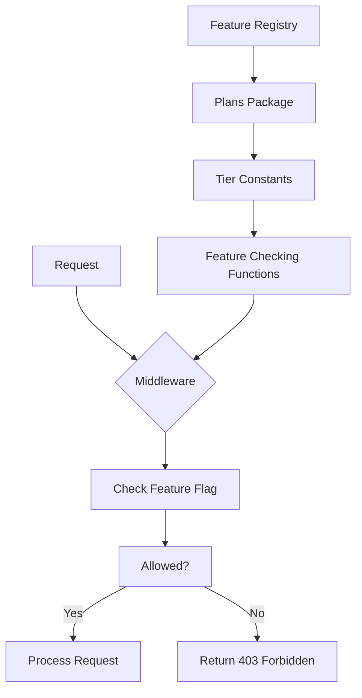

# Tier Feature Specification

## Overview
This document outlines the feature specification for each membership tier before MVP launch.

## Current Tiers

### Main Plans
- `starter` - Entry level
- `pro` - Professional tier  
- `enterprise` - Enterprise tier

### Agent Plans (AEP)
- `agent_starter` - Entry level agents
- `agent_scale` - Scale tier agents
- `agent_pro` - Professional agents
- `agent_enterprise` - Enterprise agents

## Proposed Feature Matrix

### Enterprise-Only Features

| Feature | Description | Implementation |
|---------|-------------|----------------|
| MicroVMs | Python MicroVM runtime (Firecracker) | Already implemented in `plans.RuntimePythonMicroVM` |
| Dedicated Pool | Unlimited agent concurrency | Check `AgentEnterpriseMaxConcurrency = -1` |
| Custom Limits | Configurable request/limits | Already via env vars |
| Advanced Security | Enhanced security middleware | Check `AdvancedSecurityMiddleware` |
| SLA | Service Level Agreement | New feature flag |
| Priority Support | 24/7 priority support | New feature flag |
| Custom Domains | Branded custom domains | New feature flag |
| SSO/SAML | Single Sign-On integration | New feature flag |
| Audit Logs | Extended audit logging | New feature flag |
| Data Residency | Region-specific data storage | New feature flag |
| API Rate Limits | Custom rate limiting | New feature flag |

### Pro-Only Features

| Feature | Description | Implementation |
|---------|-------------|----------------|
| Extended Providers | 3 providers per app | `ProMaxProvidersPerApp = 3` |
| Higher Requests | 500K requests/month | `DefaultProMaxRequestsPerMonth` |
| Agent Scale Tier | Access to agent_scale plan | New feature check |
| Basic Analytics | Usage analytics dashboard | New feature flag |
| Webhook Retries | Automatic webhook retries | New feature flag |
| Custom Headers | Custom HTTP headers | New feature flag |

### Starter Features (Default)

| Feature | Description |
|---------|-------------|
| Base Providers | 2 providers per app |
| 100K Requests | 100K requests/month |
| Agent Starter | Basic agent access |
| Community Support | Community forum support |
| Basic Logging | 7-day log retention |

## Feature Implementation Architecture



## Files to Modify/Create

1. `internal/plans/features.go` - Feature constants and types
2. `internal/plans/feature_checker.go` - Feature validation utilities  
3. `internal/api/middleware/features.go` - Feature checking middleware
4. `internal/api/handlers/admin/features.go` - Feature management endpoints
5. Database migration for default features

## API Endpoints

- `GET /admin/features` - List all available features
- `GET /admin/tiers/{id}/features` - Get features for a tier
- `PUT /admin/tiers/{id}/features` - Update features for a tier
- `GET /tenant/features` - Get tenant's enabled features

## Feature Check Pattern

```go
// Example usage
func Handler(w http.ResponseWriter, r *http.Request) {
    tenant := getTenant(r)
    
    if !plans.HasFeature(tenant.Plan, plans.FeatureMicroVMs) {
        http.Error(w, "MicroVMs require Enterprise tier", http.StatusForbidden)
        return
    }
    
    // Handle request
}
```
