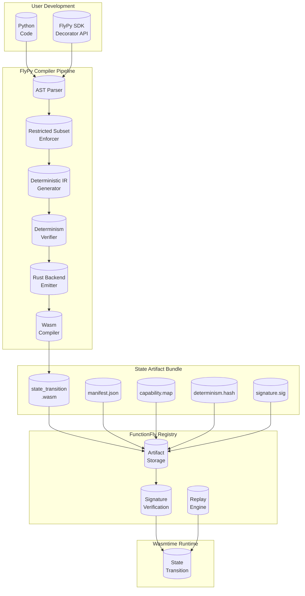
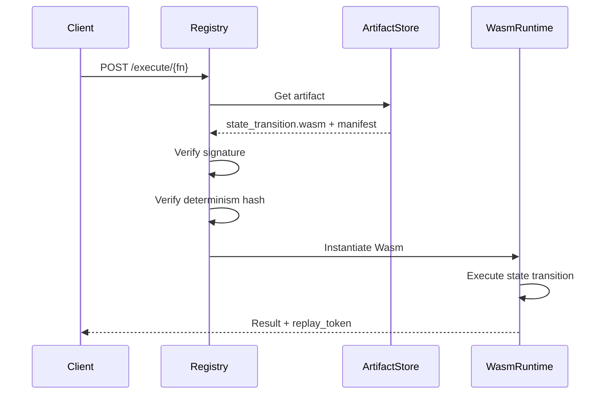

# FlyPy: Deterministic Python Compilation Architecture

## Executive Summary

FlyPy is FunctionFly's Python-to-Deterministic-State-Artifact compiler. Instead of running Python in an interpreter or container, FlyPy compiles Python into signed Wasm modules that represent pure state transitions. This creates a new category: **Deterministic Execution as a Service**.

### Strategic Positioning

| Traditional Python Platforms | FlyPy |
|------------------------------|-------|
| Runtime interpreter | Compile-time transform |
| Full Python compatibility | Defined subset |
| Hard to debug | Controlled output |
| Not unique | New category |

---

## Architecture Overview



---

## Core Design Principles

### 1. Python-as-Compile-Target

Users write Python, but the system doesn't "support Python." Instead, it defines a **restricted deterministic subset** that compiles predictably to Wasm. This subset:

- Eliminates non-deterministic operations at compile time
- Enforces capability declarations
- Produces verifiable state transitions

### 2. State Transition Semantics

Instead of "running code," FlyPy executes **state transitions**:

```
(Input State + Artifact) → (Output State + Determinism Proof)
```

This model supports:
- Mathematical replay verification
- Capability-constrained execution
- Audit trails with cryptographic guarantees

### 3. No Hidden Fallbacks

Unlike "compile-first, fallback-to-interpreter" approaches, FlyPy:

- Fails at compile time if code isn't deterministic
- Never silently switches to non-deterministic execution
- Provides clear error messages explaining what's not supported

---

## Phase 1: FlyPy Compiler Pipeline

### 1.1 Python AST Parser

**Location**: `internal/flypy/parser/`

**Components**:
- `ast_parser.go` — Parse Python source into AST
- `ast_visitor.go` — Traverse and analyze AST
- `error_reporter.go` — Generate user-friendly compilation errors

**Dependencies**:
- Use `go/parser` (Go's native parser) for Go-based parsing
- Alternative: Python AST via subprocess if needed

### 1.2 Restricted Subset Enforcer

**Location**: `internal/flypy/restrictions/`

**Allowed Constructs**:
```python
# ✅ Supported
def handler(input: dict) -> dict:
    x = input.get("value", 0)
    result = x * 2
    return {"output": result}

# ✅ Type hints (optional)
def process(data: List[int]) -> Dict[str, int]:
    return {"sum": sum(data)}

# ✅ Pure functions
def pure_add(a: int, b: int) -> int:
    return a + b
```

**Disallowed Constructs**:
```python
# ❌ Blocked at compile time
import os                    # No dynamic imports
from random import *         # No wildcard imports
exec("code")                 # No eval/exec
open("/etc/passwd")         # No file I/O
__import__("os")            # No dynamic module loading
threading.Thread(...)       # No threading
subprocess.run(...)         # No subprocess
os.environ["KEY"] = "val"   # No environment mutation
print()                     # No stdout (use return)
sys.exit()                  # No process exit
```

**Implementation**:
```go
// restrictions/enforcer.go
type RestrictionVisitor struct {
    AllowedImports map[string]bool
    ForbiddenBuiltins map[string]bool
    Errors []CompileError
}

func (v *RestrictionVisitor) Visit(node ast.Node) ast.Visitor {
    switch n := node.(type) {
    case *ast.Import:
        v.checkImport(n)
    case *ast.ImportFrom:
        v.checkImportFrom(n)
    case *ast.Call:
        v.checkCall(n)
    case *ast.Attribute:
        v.checkAttribute(n)
    // ... more checks
    }
    return v
}
```

### 1.3 Deterministic IR Generator

**Location**: `internal/flypy/ir/`

**IR Design**:
```go
// ir/node.go
type IRNode interface {
    NodeType() string
    Deterministic() bool
    Capabilities() []string
}

type Function struct {
    Name       string
    Parameters []Parameter
    Body       []IRNode
    Returns    IRNode
    Deterministic bool
    Pure       bool
}

type Operation struct {
    OpType   string  // "add", "multiply", "dict_get", etc.
    Operands []IRNode
    Type     IRType  // "int", "float", "dict", "list", "bool"
}
```

**IR Operations** (Deterministic Subset):
- Arithmetic: `add`, `sub`, `mul`, `div`, `mod`, `pow`
- Comparison: `eq`, `ne`, `lt`, `le`, `gt`, `ge`
- Logical: `and`, `or`, `not`
- Collections: `dict_get`, `dict_set`, `list_get`, `list_append`, `slice`
- Type conversion: `to_int`, `to_float`, `to_str`, `to_bool`
- Control flow: `if`, `for`, `while`, `return`

### 1.4 Determinism Verifier

**Location**: `internal/flypy/verifier/`

**Verification Checks**:

1. **No Non-Deterministic Calls**
   - Block `random.*`, `time.time()`, `uuid.uuid4()`, `hash()` on mutable objects

2. **No Side Effects**
   - No assignment to globals
   - No I/O operations
   - No state mutation outside function scope

3. **Deterministic Type Usage**
   - Hash of dicts must be order-independent
   - Floating-point operations must be IEEE 754 compliant

```go
// verifier/determinism.go
type DeterminismVerifier struct {
    IR           *ir.Module
    Errors       []DeterminismError
    ContextStack []string
}

func (v *DeterminismVerifier) Verify() error {
    for _, fn := range v.IR.Functions {
        v.verifyFunction(fn)
    }
    if len(v.Errors) > 0 {
        return v.Errors
    }
    return nil
}

func (v *DeterminismVerifier) verifyFunction(fn *ir.Function) {
    // Check each operation for determinism
    for _, op := range fn.Body {
        v.verifyOperation(op)
    }
}
```

### 1.5 Rust Backend Emitter

**Location**: `internal/flypy/backend/`

**Output**: Rust code that compiles to Wasm

```rust
// Output example for handler(input: dict) -> dict
use wasm_bindgen::prelude::*;

#[wasm_bindgen]
pub fn init() {}

#[wasm_bindgen]
pub fn execute(input_ptr: i32, input_len: i32) -> i32 {
    // Parse input from WASM memory
    let input = parse_json_input(input_ptr, input_len);
    
    // Compile deterministic operations
    let x = input.get("value").unwrap_or(&json!(0));
    let result = x.as_i64().unwrap_or(0) * 2;
    
    // Return output
    let output = serde_json::json!({"output": result});
    serialize_json_output(&output)
}
```

**Wasm Interface**:
```rust
#[wasm_bindgen]
pub extern "C" fn execute(input_ptr: i32, input_len: i32) -> i32;

#[wasm_bindgen]
pub extern "C" fn get_output_ptr() -> i32;

#[wasm_bindgen]
pub extern "C" fn get_output_len() -> i32;

#[wasm_bindgen]
pub extern "C" fn deallocate(ptr: i32, len: i32);
```

### 1.6 Wasm Compilation

**Location**: `internal/flypy/compiler/`

**Process**:
1. Generate Rust source from IR
2. Compile Rust → Wasm using `wasm-pack` or `cargo`
3. Strip debugging info
4. Validate Wasm module

```go
// compiler/compile.go
func Compile(irModule *ir.Module, outputPath string) error {
    // Generate Rust code
    rustCode := GenerateRust(irModule)
    
    // Write to temp directory
    tempDir := createTempDir()
    writeFile(filepath.Join(tempDir, "src/lib.rs"), rustCode)
    
    // Compile with wasm-pack
    cmd := exec.Command("wasm-pack", "build", tempDir, 
        "--target", "web",
        "--out-dir", outputPath,
        "--release")
    
    return cmd.Run()
}
```

---

## Phase 2: Artifact Structure

### 2.1 Artifact Bundle

When user runs `flypy build`, output:

```
my-function/
├── state_transition.wasm    # Compiled Wasm module
├── manifest.json            # Function metadata
├── capability.map         # Declared capabilities
├── determinism.hash        # SHA-256 of deterministic IR
├── signature.sig          # Ed25519 signature
└── source.map             # Source map for debugging
```

### 2.2 Manifest.json

```json
{
  "flypy_version": "1.0.0",
  "name": "my-function",
  "runtime": "flypy-deterministic",
  "input_schema": {
    "type": "object",
    "properties": {
      "value": {"type": "number"}
    },
    "required": ["value"]
  },
  "output_schema": {
    "type": "object", 
    "properties": {
      "output": {"type": "number"}
    }
  },
  "deterministic": true,
  "idempotent": true,
  "side_effects": "none",
  "capabilities": [],
  "compiled_at": "2026-02-20T00:00:00Z",
  "python_version": "3.12"
}
```

### 2.3 Capability Map

```json
{
  "function_id": "abc123",
  "requested": ["fetch:read"],
  "approved": ["fetch:read"],
  "denied": [],
  "restrictions": {
    "network": {"allow_list": ["api.example.com"]},
    "rate": {"max_per_minute": 100}
  }
}
```

### 2.4 Determinism Hash

```
# SHA-256 of canonical IR representation
determinism.hash:
a1b2c3d4e5f6... = deterministic_ir_v1|handler|input_schema_hash
```

This hash enables:
- Replay verification
- Caching with confidence
- Tampering detection

---

## Phase 3: FlyPy SDK

### 3.1 CLI Installation

```bash
pip install flypy
# or
npm install -g flypy-cli
```

### 3.2 Decorator-Based API

```python
import flypy

@flypy.function(
    name="calculate-total",
    deterministic=True,
    idempotent=True,
    cache_ttl=3600
)
def handler(event):
    """Calculate order total with tax."""
    items = event.get("items", [])
    tax_rate = event.get("tax_rate", 0.08)
    
    subtotal = sum(item["price"] * item["quantity"] for item in items)
    tax = subtotal * tax_rate
    total = subtotal + tax
    
    return {
        "subtotal": subtotal,
        "tax": tax,
        "total": total
    }

# Optional: explicit type hints for schema generation
@flypy.input_schema({
    "items": [{"price": "number", "quantity": "number"}],
    "tax_rate": "number"
})
@flypy.output_schema({
    "subtotal": "number",
    "tax": "number", 
    "total": "number"
})
def handler(event):
    pass
```

### 3.3 Build Command

```bash
$ flypy build

🔨 Compiling calculate-total to deterministic Wasm...

✓ Parsed Python AST
✓ Enforced restricted subset
✓ Generated deterministic IR
✓ Verified determinism
✓ Emitted Rust code
✓ Compiled to Wasm
✓ Generated manifest
✓ Signed artifact

✅ Build complete: ./dist/
```

### 3.4 Deployment

```bash
$ flypy deploy

📦 Uploading artifact...
✓ Verified signature
✓ Validated determinism hash
✓ Stored in registry

🚀 Deployed to FunctionFly!
   Function: yourorg/calculate-total:v1.0.0
   Deterministic: ✓
   Replayable: ✓
```

---

## Phase 4: Registry Integration

### 4.1 Artifact Storage

```go
// internal/flypy/storage/store.go
type ArtifactStore interface {
    Store(ctx context.Context, artifact *Artifact) error
    Get(ctx context.Context, id string) (*Artifact, error)
    VerifySignature(ctx context.Context, artifact *Artifact) error
    VerifyDeterminism(ctx context.Context, artifact *Artifact) error
}
```

### 4.2 Execution Flow



### 4.3 Replay Verification

```go
// internal/flypy/replay/verifier.go
type ReplayVerifier struct {
    store ArtifactStore
}

func (v *ReplayVerifier) Verify(inputHash string, outputHash string, 
                                 artifactID string, executionLog []byte) error {
    // 1. Get deterministic IR hash from manifest
    artifact, _ := v.store.Get(artifactID)
    
    // 2. Verify execution matches deterministic operations
    expectedHash := ComputeDeterminismHash(executionLog)
    
    // 3. Compare with stored hash
    if expectedHash != artifact.DeterminismHash {
        return fmt.Errorf("determinism violation detected")
    }
    
    return nil
}
```

---

## Phase 5: Revenue Tier Integration

### 5.1 Execution Mode Tiers

| Tier | Mode | Price | Capabilities |
|------|------|-------|--------------|
| 🟢 Starter | Deterministic (FlyPy) | $0.0001/call | Limited to 5 capabilities |
| 🟡 Pro | Compatible (MicroPython) | $0.001/call | Full capability set |
| 🔴 Enterprise | Compute (MicroVM) | $0.01/call | GPU, large memory |

### 5.2 Tier Selection

Users explicitly choose their execution mode:

```json
{
  "runtime": "flypy-deterministic",
  "fallback": "micropython-wasi"
}
```

Or via CLI:
```bash
flypy deploy --mode deterministic
flypy deploy --mode compatible
flypy deploy --mode compute
```

---

## Implementation Roadmap

### Phase 1: Core Compiler (Weeks 1-4)

- [ ] AST parser implementation
- [ ] Restricted subset enforcer
- [ ] Basic IR generator
- [ ] Determinism verifier
- [ ] CLI scaffold

### Phase 2: Backend & Wasm (Weeks 5-8)

- [ ] Rust backend emitter
- [ ] Wasm compilation pipeline
- [ ] Artifact bundle generation
- [ ] Manifest generation

### Phase 3: Registry Integration (Weeks 9-12)

- [ ] Artifact storage
- [ ] Signature verification
- [ ] Determinism hash verification
- [ ] Execution engine integration

### Phase 4: SDK & DX (Weeks 13-16)

- [ ] Python SDK (decorator API)
- [ ] Type hints support
- [ ] Schema generation
- [ ] Error messages

### Phase 5: Production Hardening (Weeks 17-20)

- [ ] Performance optimization
- [ ] Coverage improvements
- [ ] Documentation
- [ ] Beta testing

---

## Comparison: FlyPy vs Alternative Approaches

| Aspect | RustPython | Pyodide | MicroPython WASM | **FlyPy** |
|--------|-----------|---------|------------------|-----------|
| Runtime needed | Yes | Yes (JS) | Yes | No |
| Deterministic | No | No | Partial | **Yes** |
| Compile-time | No | No | No | **Yes** |
| Replayable | No | No | Limited | **Full** |
| Security surface | Large | Large | Medium | **Small** |
| Unique positioning | No | No | No | **Yes** |

---

## Key Files to Create

```
internal/flypy/
├── parser/
│   ├── ast_parser.go
│   ├── ast_visitor.go
│   └── error_reporter.go
├── restrictions/
│   ├── enforcer.go
│   ├── allowed_builtins.go
│   └── forbidden_patterns.go
├── ir/
│   ├── node.go
│   ├── generator.go
│   └── canonicalizer.go
├── verifier/
│   ├── determinism.go
│   ├── side_effects.go
│   └── capability_checker.go
├── backend/
│   ├── rust_emitter.go
│   ├── templates.go
│   └── wasm_interface.go
├── compiler/
│   ├── compile.go
│   ├── wasm_builder.go
│   └── validator.go
├── artifact/
│   ├── builder.go
│   ├── manifest.go
│   └── signer.go
├── storage/
│   ├── store.go
│   └── verifier.go
└── sdk/
    ├── decorators.py
    ├── cli.py
    └── schema.py
```

---

## Success Metrics

1. **Compilation Success Rate**: >90% for common patterns
2. **Determinism Verification**: 100% of deployed artifacts verified
3. **Execution Latency**: <5ms cold start, <1ms warm
4. **Bundle Size**: <50KB for typical functions
5. **Developer Satisfaction**: >4.0 NPS from beta users

---

## Conclusion

FlyPy represents FunctionFly's architectural differentiation: instead of competing on Python compatibility, we define a new category of **deterministic state compilation**. This aligns with:

- Wasm-first strategy
- Registry-driven architecture
- Deterministic replay capabilities
- Capability-constrained security model

The coexist approach (Option 2) allows gradual adoption while preserving existing functionality. Over time, FlyPy becomes the default and dominant execution path—not by force, but by superiority.
