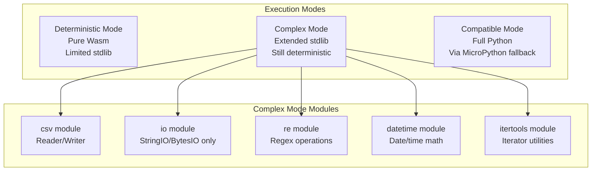

# FlyPy Complex Mode Architecture

## Executive Summary

This document defines the architecture for a new "complex" execution mode in FlyPy that enables support for Python standard library modules like `csv`, `io` (StringIO/BytesIO), `re`, `datetime`, and other deterministic-friendly features that are currently blocked in deterministic mode.

## Problem Statement

The current FlyPy compiler has two modes:
- **Deterministic Mode**: Strict restrictions, only allows `json`, `math`, `typing`, `collections`
- **Compatible Mode**: Allows some non-deterministic operations with warnings

Users cannot compile functions that use common stdlib modules like:
- `csv` - CSV parsing and writing
- `io.StringIO` / `io.BytesIO` - In-memory streams
- `re` - Regular expressions
- `datetime` - Date/time operations
- `itertools` - Iterator utilities

These modules can be used deterministically but are currently blocked.

## Proposed Solution: Complex Mode

Add a third execution mode: **ComplexMode**



## Module Support Matrix

| Module | Deterministic | Complex | Compatible | Notes |
|--------|--------------|---------|------------|-------|
| `json` | ✅ | ✅ | ✅ | Full support |
| `math` | ✅ | ✅ | ✅ | Full support |
| `typing` | ✅ | ✅ | ✅ | Type hints only |
| `collections` | ✅ | ✅ | ✅ | Full support |
| `csv` | ❌ | ✅ | ✅ | Reader/Writer to/from strings |
| `io` | ❌ | ✅ | ✅ | StringIO/BytesIO only, no file I/O |
| `re` | ❌ | ✅ | ✅ | Pattern matching |
| `datetime` | ❌ | ✅ | ✅ | Date/time operations |
| `itertools` | ❌ | ✅ | ✅ | Iterator utilities |
| `functools` | ❌ | ✅ | ✅ | Partial, reduce |
| `operator` | ❌ | ✅ | ✅ | Operator functions |
| `string` | ❌ | ✅ | ✅ | String constants |
| `textwrap` | ❌ | ✅ | ✅ | Text wrapping |
| `hashlib` | ❌ | ✅ | ✅ | Deterministic hashing |
| `base64` | ❌ | ✅ | ✅ | Encoding/decoding |
| `uuid` | ❌ | ⚠️ | ✅ | UUID5 only (deterministic) |

## Architecture Changes

### 1. Execution Mode Enum Update

**File**: [`internal/flypy/flypy.go`](internal/flypy/flypy.go)

```go
type ExecutionMode string

const (
    DeterministicMode ExecutionMode = "deterministic"
    ComplexMode       ExecutionMode = "complex"      // NEW
    CompatibleMode    ExecutionMode = "compatible"
)
```

### 2. Module Allowlists

**File**: [`internal/flypy/restrictions/enforcer.go`](internal/flypy/restrictions/enforcer.go)

```go
// DeterministicModules - minimal set for pure Wasm
var DeterministicModules = map[string]bool{
    "json":        true,
    "math":        true,
    "typing":      true,
    "collections": true,
}

// ComplexModules - extended set for complex mode
var ComplexModules = map[string]bool{
    // Include all deterministic modules
    "json":        true,
    "math":        true,
    "typing":      true,
    "collections": true,
    
    // Additional modules for complex mode
    "csv":         true,
    "io":          true,   // StringIO/BytesIO only
    "re":          true,
    "datetime":    true,
    "itertools":   true,
    "functools":   true,
    "operator":    true,
    "string":      true,
    "textwrap":    true,
    "hashlib":     true,
    "base64":      true,
    "uuid":        true,   // UUID5 only
}
```

### 3. Module-Specific Restrictions

Some modules have restricted subsets:

```go
// AllowedIOOperations - only in-memory stream operations
var AllowedIOOperations = map[string]bool{
    "StringIO":  true,
    "BytesIO":   true,
    "StringIO.write": true,
    "StringIO.read":  true,
    "StringIO.getvalue": true,
    "BytesIO.write":  true,
    "BytesIO.read":   true,
    "BytesIO.getvalue": true,
}

// ForbiddenIOOperations - no file I/O
var ForbiddenIOOperations = map[string]bool{
    "open":       true,
    "FileIO":     true,
    "BufferedReader": true,
    "BufferedWriter": true,
}
```

### 4. IR Generator Extensions

**File**: [`internal/flypy/ir/generator.go`](internal/flypy/ir/generator.go)

Add new operation types for complex modules:

```go
const (
    // Existing operations...
    
    // CSV operations
    OpCSVReader    = "csv_reader"
    OpCSVWriter    = "csv_writer"
    OpCSVReadRow   = "csv_read_row"
    OpCSVWriteRow  = "csv_write_row"
    
    // IO operations
    OpStringIO     = "string_io"
    OpBytesIO      = "bytes_io"
    OpIOWrite      = "io_write"
    OpIORead       = "io_read"
    OpIOGetValue   = "io_getvalue"
    
    // Regex operations
    OpReMatch      = "re_match"
    OpReSearch     = "re_search"
    OpReSub        = "re_sub"
    OpReFindall    = "re_findall"
    OpReSplit      = "re_split"
    
    // Datetime operations
    OpDatetimeNow  = "datetime_now"     // Requires seed
    OpDatetimeParse = "datetime_parse"
    OpDatetimeFormat = "datetime_format"
    OpTimedelta    = "timedelta"
)
```

### 5. Rust Backend Extensions

**File**: [`internal/flypy/backend/rust_emitter.go`](internal/flypy/backend/rust_emitter.go)

Add Rust crate dependencies for complex mode:

```rust
// Cargo.toml additions for complex mode
[dependencies]
serde = { version = "1.0", features = ["derive"] }
serde_json = "1.0"
regex = "1.10"           // For re module
csv = "1.3"              // For csv module
chrono = "0.4"           // For datetime module
base64 = "0.21"          // For base64 module
sha2 = "0.10"            // For hashlib module
uuid = { version = "1.0", features = ["v5"] }  // For uuid module
```

#### CSV Module Implementation

```rust
// CSV reading
fn csv_reader(input: &str) -> Vec<Vec<String>> {
    let mut reader = csv::Reader::from_reader(input.as_bytes());
    let mut rows = Vec::new();
    for result in reader.records() {
        match result {
            Ok(record) => {
                rows.push(record.iter().map(|s| s.to_string()).collect());
            }
            Err(_) => break,
        }
    }
    rows
}

// CSV writing
fn csv_writer(rows: &Vec<Vec<String>>) -> String {
    let mut wtr = csv::Writer::from_writer(vec![]);
    for row in rows {
        wtr.write_record(row).unwrap();
    }
    wtr.into_inner().unwrap()
        .into_iter()
        .map(|b| b as char)
        .collect()
}
```

#### StringIO Implementation

```rust
use std::io::Write;

struct StringIO {
    buffer: Vec<u8>,
}

impl StringIO {
    fn new() -> Self {
        StringIO { buffer: Vec::new() }
    }
    
    fn from_string(s: &str) -> Self {
        StringIO { buffer: s.as_bytes().to_vec() }
    }
    
    fn write(&mut self, s: &str) {
        self.buffer.extend(s.as_bytes());
    }
    
    fn getvalue(&self) -> String {
        String::from_utf8_lossy(&self.buffer).to_string()
    }
}
```

#### Regex Implementation

```rust
use regex::Regex;

fn re_match(pattern: &str, text: &str) -> Option<Vec<String>> {
    let re = Regex::new(pattern).ok()?;
    re.captures(text).map(|caps| {
        caps.iter()
            .filter_map(|c| c.map(|m| m.as_str().to_string()))
            .collect()
    })
}

fn re_sub(pattern: &str, repl: &str, text: &str) -> String {
    let re = Regex::new(pattern).unwrap();
    re.replace_all(text, repl).to_string()
}

fn re_findall(pattern: &str, text: &str) -> Vec<String> {
    let re = Regex::new(pattern).unwrap();
    re.find_iter(text)
        .map(|m| m.as_str().to_string())
        .collect()
}
```

### 6. Compiler Pipeline Update

**File**: [`internal/flypy/flypy.go`](internal/flypy/flypy.go)

```go
func (c *Compiler) Compile(ctx context.Context, source string, name string) (*Result, error) {
    // ... existing phases ...
    
    // Phase 2: Enforce restricted subset (mode-aware)
    restrictionErrors := restrictions.EnforceWithMode(pythonAST, c.config.Mode)
    if len(restrictionErrors) > 0 {
        return nil, fmt.Errorf("restriction violations: %v", restrictionErrors)
    }
    
    // Phase 3: Generate IR (mode-aware)
    irModule, err := ir.GenerateWithMode(pythonAST, name, c.config.Mode)
    
    // Phase 5: Emit Rust code (mode-aware)
    rustCode, err := backend.GenerateRustWithMode(irModule, c.config.Mode)
    
    // ... rest of pipeline ...
}
```

### 7. CLI Support

**File**: [`cmd/flypy-go/compile.go`](cmd/flypy-go/compile.go)

```go
flags := &compileFlags{
    mode:     "deterministic",  // default
    output:   "./dist",
}

// Add complex mode support
flag.StringVar(&flags.mode, "mode", "deterministic", 
    "execution mode: deterministic, complex, compatible")
```

Usage:
```bash
# Deterministic mode (default)
flypy build handler.py

# Complex mode - extended stdlib
flypy build handler.py --mode complex

# Compatible mode - full Python via MicroPython
flypy build handler.py --mode compatible
```

## Example: JSON to CSV Conversion

### Python Source (Complex Mode)

```python
import flypy
import json
import csv
import io

@flypy.function(
    name="json-to-csv",
    execution_mode="complex"
)
def json_to_csv(data: dict) -> dict:
    """Convert JSON data to CSV format."""
    records = data.get("records", [])
    
    if not records:
        return {"csv": ""}
    
    # Use StringIO for in-memory CSV writing
    output = io.StringIO()
    
    # Get fieldnames from first record
    fieldnames = list(records[0].keys())
    
    writer = csv.DictWriter(output, fieldnames=fieldnames)
    writer.writeheader()
    
    for record in records:
        writer.writerow(record)
    
    return {"csv": output.getvalue()}
```

### Generated Rust Code

```rust
use serde::{Deserialize, Serialize};
use std::io::Write;

#[derive(Serialize, Deserialize, Debug)]
pub struct Input {
    pub data: serde_json::Value,
}

#[derive(Serialize, Deserialize, Debug)]
pub struct Output {
    pub csv: String,
}

fn handler_func(input: Input) -> Output {
    let records = input.data.get("records")
        .and_then(|v| v.as_array())
        .cloned()
        .unwrap_or_default();
    
    if records.is_empty() {
        return Output { csv: String::new() };
    }
    
    // Get fieldnames from first record
    let fieldnames: Vec<String> = if let Some(first) = records.first() {
        first.as_object()
            .map(|obj| obj.keys().cloned().collect())
            .unwrap_or_default()
    } else {
        vec![]
    };
    
    // Write CSV
    let mut output = Vec::new();
    {
        let mut wtr = csv::Writer::from_writer(&mut output);
        
        // Write header
        wtr.write_record(&fieldnames).unwrap();
        
        // Write rows
        for record in &records {
            if let Some(obj) = record.as_object() {
                let row: Vec<String> = fieldnames.iter()
                    .map(|f| obj.get(f)
                        .and_then(|v| v.as_str())
                        .unwrap_or("")
                        .to_string())
                    .collect();
                wtr.write_record(&row).unwrap();
            }
        }
    }
    
    Output {
        csv: String::from_utf8_lossy(&output).to_string(),
    }
}
```

## Implementation Checklist

### Phase 1: Core Infrastructure
- [ ] Add `ComplexMode` to ExecutionMode enum
- [ ] Create `ComplexModules` allowlist in enforcer.go
- [ ] Add `EnforceWithMode()` function that respects mode
- [ ] Update CLI to accept `--mode complex`

### Phase 2: Module Support
- [ ] Add csv module IR operations
- [ ] Add io module IR operations (StringIO/BytesIO)
- [ ] Add re module IR operations
- [ ] Add datetime module IR operations
- [ ] Add itertools module IR operations

### Phase 3: Backend Implementation
- [ ] Add Rust crate dependencies for complex mode
- [ ] Implement csv reader/writer in Rust
- [ ] Implement StringIO/BytesIO in Rust
- [ ] Implement regex operations in Rust
- [ ] Implement datetime operations in Rust

### Phase 4: Testing
- [ ] Add unit tests for complex mode restrictions
- [ ] Add integration tests for csv module
- [ ] Add integration tests for io module
- [ ] Add integration tests for re module
- [ ] Add integration tests for datetime module

### Phase 5: Documentation
- [ ] Update FLYPY_ARCHITECTURE.md with complex mode
- [ ] Add complex mode examples to SDK docs
- [ ] Update CLI help text

## Trade-offs

| Aspect | Deterministic | Complex | Compatible |
|--------|--------------|---------|------------|
| Stdlib Support | Minimal | Extended | Full |
| Wasm Size | ~100KB | ~500KB | ~2MB |
| Cold Start | ~1ms | ~5ms | ~50ms |
| Determinism | Guaranteed | Guaranteed | Best-effort |
| Replay | Yes | Yes | No |
| Use Case | Simple transforms | Data processing | Full Python |

## Security Considerations

1. **No File I/O**: Even in complex mode, file operations are blocked
2. **No Network**: All network operations remain blocked
3. **Memory Limits**: StringIO/BytesIO have configurable size limits
4. **Regex DoS**: Complex regex patterns have execution time limits

## Conclusion

The Complex Mode provides a middle ground between the strict deterministic mode and the full Python compatible mode. It enables common data processing tasks (CSV, regex, datetime) while maintaining deterministic execution guarantees for replay and caching.
