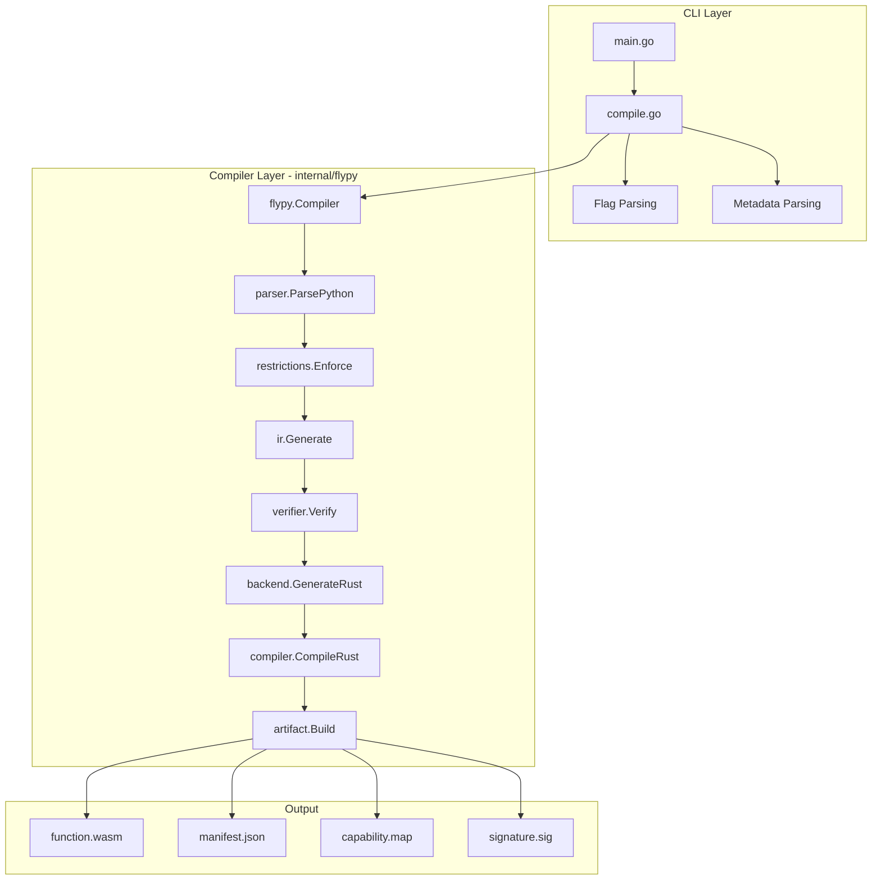

# Production-Ready FlyPy Go Compiler Plan

## Overview

The current `cmd/flypy-go/compile.go` is explicitly marked as a **stub/test implementation** with placeholder WASM generation. This plan outlines how to make it production-ready by integrating with the existing `internal/flypy` compiler infrastructure.

## Current State Analysis

### What compile.go Currently Does (Stub)
- Defines CLI flags for compilation
- Validates restrictions using regex patterns (duplicated logic)
- Generates a minimal WASM module with hardcoded bytecode
- Creates manifest files with mock signatures
- Does NOT actually compile Python to executable WASM

### What internal/flypy Already Provides
The `internal/flypy/` package contains a complete Python-to-WASM compiler:

| Package | Purpose | Status |
|---------|---------|--------|
| `parser/ast_parser.go` | Python AST parsing via Python subprocess | ✅ Complete |
| `restrictions/enforcer.go` | AST-based restriction enforcement | ✅ Complete |
| `ir/generator.go` | IR generation from Python AST | ✅ Complete |
| `verifier/determinism.go` | Determinism verification | ✅ Complete |
| `verifier/side_effects.go` | Side effect analysis | ✅ Complete |
| `backend/rust_emitter.go` | Rust code generation from IR | ✅ Complete |
| `compiler/wasm_compiler.go` | WASM compilation via wasm-pack/cargo | ✅ Complete |
| `artifact/builder.go` | Artifact bundle creation | ✅ Complete |
| `flypy.go` | Main compiler orchestration | ✅ Complete |

## Architecture



## Implementation Plan

### Phase 1: Core Refactoring

#### 1.1 Remove Duplicate Code
Delete the following from `compile.go` (already in `internal/flypy`):
- `forbiddenPatterns` slice - use `restrictions.Enforce()` instead
- `allowedBuiltins` map - handled by IR generator
- `allowedModules` map - handled by restriction enforcer
- `validateRestrictions()` function - use `restrictions.Enforce()`
- `validateImports()` function - use `restrictions.Enforce()`
- `checkWarnings()` function - use `verifier` package

#### 1.2 Remove Placeholder WASM Generation
Delete the following stub functions:
- `generateWASMModule()` - use `flypy.Compiler.Compile()`
- `buildTypeSection()` - handled by Rust/WASM toolchain
- `buildFunctionSection()` - handled by Rust/WASM toolchain
- `buildExportSection()` - handled by Rust/WASM toolchain
- `buildCodeSection()` - handled by Rust/WASM toolchain
- `generateWasmFromRust()` - completely placeholder
- `buildCustomSection()` - handled by artifact builder
- `leb128Encode()` - not needed

#### 1.3 Integrate with internal/flypy
Rewrite `compilePythonToWASM()` to:
```go
func compilePythonToWASM(sourceCode string, metadata *Metadata, flags *CompileFlags) *CompilationResult {
    // Create compiler config
    config := &flypy.Config{
        Mode:      flypy.ExecutionMode(flags.mode),
        OutputDir: flags.output,
        Verbose:   flags.verbose,
        Version:   metadata.Version,
    }
    
    // Create compiler and compile
    compiler := flypy.NewCompiler(config)
    result, err := compiler.Compile(context.Background(), sourceCode, metadata.Name)
    
    // Convert result
    return convertResult(result, err)
}
```

### Phase 2: Enhanced Error Handling

#### 2.1 Structured Error Types
```go
type CompileError struct {
    Phase   string // parse, restrict, ir, verify, compile
    Message string
    Line    int
    Column  int
    Source  string
}

func (e *CompileError) Error() string {
    return fmt.Sprintf("[%s] %s at line %d", e.Phase, e.Message, e.Line)
}
```

#### 2.2 Error Handling Improvements
- Wrap all errors with context
- Convert restriction violations to structured errors
- Convert IR generation errors to structured errors
- Convert WASM compilation errors to structured errors
- Add exit codes for different error types

### Phase 3: Input Validation

#### 3.1 Flag Validation
```go
func validateFlags(flags *CompileFlags) error {
    // Input file must exist
    if _, err := os.Stat(flags.input); os.IsNotExist(err) {
        return fmt.Errorf("input file does not exist: %s", flags.input)
    }
    
    // Metadata file must exist
    if _, err := os.Stat(flags.metadata); os.IsNotExist(err) {
        return fmt.Errorf("metadata file does not exist: %s", flags.metadata)
    }
    
    // Mode must be valid
    if flags.mode != "deterministic" && flags.mode != "compatible" {
        return fmt.Errorf("invalid mode: %s (must be deterministic or compatible)", flags.mode)
    }
    
    // Optimize level must be valid
    validOpts := map[string]bool{"minimal": true, "balanced": true, "aggressive": true}
    if !validOpts[flags.optimize] {
        return fmt.Errorf("invalid optimization level: %s", flags.optimize)
    }
    
    return nil
}
```

#### 3.2 Metadata Validation
```go
func validateMetadata(metadata *Metadata) error {
    if metadata.Name == "" {
        return errors.New("metadata.name is required")
    }
    if metadata.EntryPoint == "" {
        return errors.New("metadata.entry_point is required")
    }
    if metadata.Version == "" {
        metadata.Version = "1.0.0" // Default
    }
    return nil
}
```

#### 3.3 Source Code Validation
```go
func validateSource(source string) error {
    if len(source) == 0 {
        return errors.New("source file is empty")
    }
    if len(source) > 10*1024*1024 { // 10MB limit
        return errors.New("source file exceeds 10MB limit")
    }
    return nil
}
```

### Phase 4: Compilation Modes

#### 4.1 Deterministic Mode (Default)
- Full restriction enforcement
- No external state access
- No network operations
- No random without seed
- Strict verification

#### 4.2 Compatible Mode
- Relaxed restrictions (warnings only)
- Allow some non-deterministic operations with warnings
- Useful for migration path

```go
func getModeConfig(mode string) flypy.Config {
    switch mode {
    case "deterministic":
        return flypy.Config{
            Mode: flypy.DeterministicMode,
            StrictRestrictions: true,
        }
    case "compatible":
        return flypy.Config{
            Mode: flypy.CompatibleMode,
            StrictRestrictions: false,
        }
    default:
        return flypy.Config{Mode: flypy.DeterministicMode}
    }
}
```

### Phase 5: Optimization Levels

#### 5.1 Minimal Optimization
- Fast compilation
- Larger WASM output
- Better debugging

#### 5.2 Balanced Optimization (Default)
- Good compilation speed
- Reasonable WASM size
- Standard optimization

#### 5.3 Aggressive Optimization
- Slower compilation
- Smallest WASM output
- LTO enabled

```go
func getOptimizationFlags(level string) []string {
    switch level {
    case "minimal":
        return []string{"--opt-level", "0"}
    case "balanced":
        return []string{"--opt-level", "s"}
    case "aggressive":
        return []string{"--opt-level", "z", "--lto"}
    default:
        return []string{"--opt-level", "s"}
    }
}
```

### Phase 6: Output Generation

#### 6.1 Output Files
The compiler should generate:
- `function.wasm` - Main WASM module
- `state_transition.wasm` - Copy for compatibility
- `manifest.json` - Function metadata
- `capabilities.json` - Declared capabilities
- `determinism.hash` - SHA-256 of WASM for verification
- `source.hash` - SHA-256 of source code
- `signature.sig` - Ed25519 signature (if key provided)

#### 6.2 Manifest Structure
```json
{
  "name": "slugify",
  "version": "1.0.0",
  "runtime": "flypy",
  "entry_point": "handler",
  "mode": "deterministic",
  "build_time": "2024-01-15T10:30:00Z",
  "optimization_level": "balanced",
  "cold_start_optimized": true,
  "wasm_file": "function.wasm",
  "wasm_size_bytes": 12345,
  "source_size_bytes": 890,
  "hashes": {
    "source_sha256": "...",
    "wasm_sha256": "...",
    "wasm_sha512": "...",
    "determinism_hash": "..."
  },
  "capabilities": {
    "allowed_modules": ["json", "re", "unicodedata"],
    "allowed_builtins": ["len", "str", "isinstance"],
    "restricted": true
  },
  "side_effects": {
    "pure": true,
    "network": false,
    "io": false,
    "state": false
  }
}
```

### Phase 7: Logging and Observability

#### 7.1 Verbose Logging
```go
func logCompilationStart(flags *CompileFlags, metadata *Metadata) {
    if !flags.verbose {
        return
    }
    log.Println("=== FlyPy Compiler v1.0.0 ===")
    log.Printf("Input: %s", flags.input)
    log.Printf("Metadata: %s", flags.metadata)
    log.Printf("Output: %s", flags.output)
    log.Printf("Mode: %s", flags.mode)
    log.Printf("Optimization: %s", flags.optimize)
}

func logPhase(phase string, verbose bool) {
    if verbose {
        log.Printf("✓ %s", phase)
    }
}
```

#### 7.2 Progress Reporting
```go
type ProgressReporter interface {
    Start(phase string)
    Complete(phase string)
    Error(phase string, err error)
}

type ConsoleReporter struct {
    verbose bool
}

func (r *ConsoleReporter) Start(phase string) {
    if r.verbose {
        fmt.Printf("  → %s...", phase)
    }
}

func (r *ConsoleReporter) Complete(phase string) {
    if r.verbose {
        fmt.Println(" ✓")
    }
}
```

### Phase 8: Testing

#### 8.1 Unit Tests
```go
func TestValidateFlags(t *testing.T) {
    tests := []struct {
        name    string
        flags   *CompileFlags
        wantErr bool
    }{
        {
            name: "valid flags",
            flags: &CompileFlags{
                input:    "test.py",
                metadata: "meta.json",
                output:   "./dist",
                mode:     "deterministic",
            },
            wantErr: false,
        },
        // ... more cases
    }
    // ...
}
```

#### 8.2 Integration Tests
- Test full compilation pipeline
- Test with sample Python functions
- Verify WASM output validity
- Verify manifest correctness

#### 8.3 Test Cases
1. Simple function with no imports
2. Function with `re` module
3. Function with `json` module
4. Function with `unicodedata` module
5. Function with forbidden imports (should fail)
6. Function with eval (should fail)
7. Large function (performance test)

## File Structure After Refactoring

```
cmd/flypy-go/
├── main.go           # Entry point (minimal)
├── compile.go        # CLI handling, uses internal/flypy
├── compile_test.go   # Unit tests
├── errors.go         # Error types
├── validate.go       # Input validation
└── go.mod            # Dependencies

internal/flypy/       # Existing (unchanged)
├── flypy.go
├── parser/
├── restrictions/
├── ir/
├── verifier/
├── backend/
├── compiler/
└── artifact/
```

## Dependencies

The refactored `compile.go` will depend on:
```go
import (
    "context"
    "encoding/json"
    "fmt"
    "os"
    
    "github.com/functionfly/functionfly/internal/flypy"
    "github.com/functionfly/functionfly/internal/flypy/parser"
    "github.com/functionfly/functionfly/internal/flypy/restrictions"
    "github.com/functionfly/functionfly/internal/flypy/verifier"
)
```

## External Requirements

For WASM compilation, the system needs:
1. **Python 3.x** - For AST parsing
2. **Rust toolchain** - For WASM compilation
3. **wasm-pack** OR **cargo** - For building WASM
4. **wasm32-unknown-unknown target** - Rust WASM target

## Migration Checklist

- [ ] Remove all stub/placeholder code from compile.go
- [ ] Integrate with internal/flypy.Compiler
- [ ] Add proper error types and handling
- [ ] Add input validation
- [ ] Add comprehensive logging
- [ ] Support both compilation modes
- [ ] Support optimization levels
- [ ] Write unit tests
- [ ] Write integration tests
- [ ] Update documentation
- [ ] Remove stub comments from main.go

## Estimated Complexity

| Phase | Complexity | Risk |
|-------|------------|------|
| Phase 1: Core Refactoring | Medium | Low (existing code works) |
| Phase 2: Error Handling | Low | Low |
| Phase 3: Input Validation | Low | Low |
| Phase 4: Compilation Modes | Medium | Low |
| Phase 5: Optimization Levels | Low | Low |
| Phase 6: Output Generation | Low | Low |
| Phase 7: Logging | Low | Low |
| Phase 8: Testing | Medium | Low |

## Success Criteria

1. ✅ Compiles valid Python functions to working WASM
2. ✅ Rejects invalid Python with clear error messages
3. ✅ Enforces all restrictions correctly
4. ✅ Generates valid manifest files
5. ✅ Supports deterministic and compatible modes
6. ✅ All tests pass
7. ✅ No placeholder code remains
