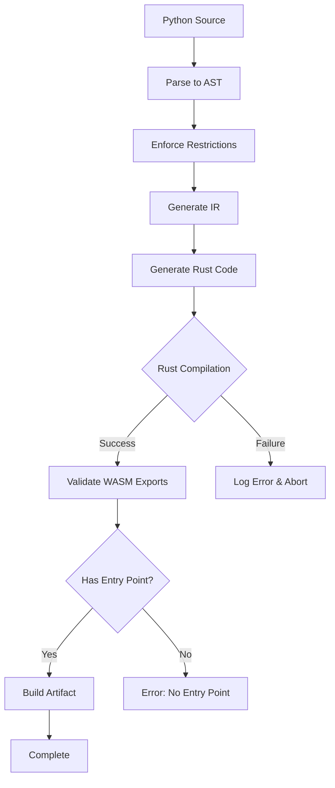

# FlyPy WASM Entry Point Fix Plan

## Problem Statement

The FlyPy compiler fails to generate proper WASM entry points (`_start`, `main`, or `handler` functions) for complex Python functions. The execution test returned an error because the generated WASM module doesn't have valid entry points that the runtime can invoke.

## Root Cause Analysis

Based on analysis of the codebase:

### 1. Entry Point Requirements (from `runtimes/local/src/engine.go`)
The runtime expects WASM modules to have one of these entry points:
- `_start` function (WASI standard)
- `main` function  
- `handler` function with signature `(i32, i32) -> i32` (pointer, length)

### 2. Current Template Support
Both `ComplexModeRustTemplate` and `DeterministicModeRustTemplate` define:
- `handler(input_ptr: i32, input_len: i32) -> i32` - direct handler
- `_start()` - WASI entry point

### 3. Potential Issues
1. **Rust Compilation Failures**: Complex Python features might generate invalid Rust code
2. **Missing Dependencies**: Complex mode template might be missing required imports
3. **Export Issues**: The `#[no_mangle]` and `pub extern "C"` attributes might not be properly applied
4. **Return Type Mismatch**: The handler function must return a properly encoded pointer/length

## Affected Function

The function in `publish_csv_to_json.json` uses:
- `import csv`, `import io`, `import json`
- try/except blocks
- dict operations
- list comprehensions
- type conversions (int, float, bool)

This requires "complex" mode compilation.

## Solution Plan

### Phase 1: Diagnose and Fix Template Issues

1. **Verify Complex Mode Template**
   - Check that `ComplexModeRustTemplate` has all required imports (csv, regex, etc.)
   - Ensure `_start` function is properly defined
   - Verify `handler` function has correct signature

2. **Add Missing Helper Functions**
   - Ensure all CSV helper functions are included
   - Verify type conversion helpers exist

3. **Fix Export Attributes**
   - Ensure all entry points have `#[no_mangle]`
   - Verify `pub extern "C"` is correctly applied

### Phase 2: Fix Rust Code Generation

1. **Improve Error Handling**
   - Add better error messages during Rust compilation
   - Capture and display cargo build errors

2. **Validate Generated Code**
   - Add step to validate generated Rust code before compilation
   - Log the generated code for debugging

### Phase 3: Test and Verify

1. **Test with Complex Functions**
   - Compile `csv-to-json` function
   - Verify WASM has valid entry points
   - Execute and verify output

2. **Add Integration Tests**
   - Test complex mode compilation
   - Test WASM execution

## Implementation Steps

### Step 1: Review and Fix Complex Mode Template
Location: `internal/flypy/backend/templates.go`

Check and fix:
- All required imports for complex mode
- `_start` function definition
- `handler` function signature
- CSV/IO helper functions

### Step 2: Improve Compilation Error Handling
Location: `internal/flypy/compiler/wasm_compiler.go`

Add:
- Better error messages from cargo build failures
- Debug logging of generated Rust code

### Step 3: Add WASM Export Validation
Location: `internal/flypy/compiler/wasm_compiler.go`

Add function to verify exports:
```go
func ValidateExports(wasmBytes []byte) error {
    // Check for _start, main, or handler exports
}
```

### Step 4: Test the Fix
Compile and test with the csv-to-json function:
```bash
go run ./cmd/flypy-go --input <python_file> --metadata <metadata_file> --output ./dist --mode complex
```

## Mermaid Diagram: Compilation Flow



## Files to Modify

1. `internal/flypy/backend/templates.go` - Fix complex mode template
2. `internal/flypy/compiler/wasm_compiler.go` - Add export validation
3. `internal/flypy/backend/operations.go` - Ensure handler_func generates proper returns

## Success Criteria

1. Complex Python functions compile to valid WASM
2. Generated WASM has `_start`, `main`, or `handler` export
3. WASM execution produces correct output
4. Compilation errors are clear and actionable
