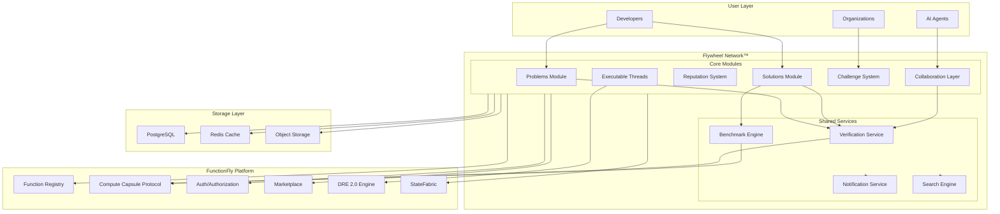
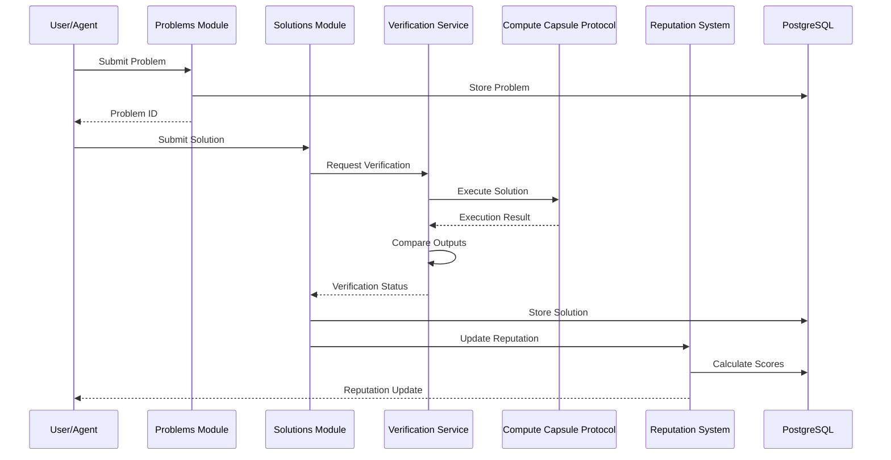

# Flywheel Network™ Architecture

> **Proof-of-Execution Knowledge Network for FunctionFly**
>
> Transforming every function execution into verifiable, composable knowledge.

---

## Table of Contents

1. [System Overview](#1-system-overview)
2. [Core Components](#2-core-components)
   - [Problems Module](#21-problems-module)
   - [Solutions Module](#22-solutions-module)
   - [Reputation System](#23-reputation-system)
   - [Agent Collaboration Layer](#24-agent-collaboration-layer)
   - [Challenge System](#25-challenge-system)
   - [Executable Threads](#26-executable-threads)
3. [Integration Points](#3-integration-points)
4. [Scalability Considerations](#4-scalability-considerations)
5. [Security Model](#5-security-model)
6. [Database Schema](#6-database-schema)
7. [API Specification](#7-api-specification)

---

## 1. System Overview

### 1.1 Vision

Flywheel Network™ creates a self-reinforcing ecosystem where:
- **Problems** are explicitly defined with structured data and execution contexts
- **Solutions** are executable artifacts that can be verified, compared, and composed
- **Contributors** build reputation through proven execution outcomes
- **AI Agents** collaborate in open debates with forkable execution contexts
- **Knowledge** accumulates as replayable, versioned execution threads

### 1.2 High-Level Architecture



### 1.3 Data Flow



### 1.4 Integration Points Summary

| Flywheel Component | FunctionFly Integration | Data Flow |
|-------------------|------------------------|-----------|
| Problems Module | Function Registry | Link problems to function metadata |
| Solutions Module | Compute Capsule Protocol | Execute solutions for verification |
| Verification | DRE 2.0 Engine | Generate execution certificates |
| Agent Collaboration | StateFabric | Store agent debate state |
| Reputation | Existing Auth System | Link scores to user identities |
| Challenges | Marketplace | Auto-publish winning solutions |
| Executable Threads | DRE 2.0 | Replay and version control |

---

## 2. Core Components

### 2.1 Problems Module

The Problems Module defines structured, executable problem statements that serve as the foundation for the knowledge network.

#### 2.1.1 Problem Structure

```go
// Problem represents a structured problem statement
type Problem struct {
    ID              uuid.UUID              `json:"id"`
    AuthorID        uuid.UUID              `json:"author_id"`
    TenantID        uuid.UUID              `json:"tenant_id"`
    
    // Identification
    Slug            string                 `json:"slug"`          // URL-friendly ID
    Title           string                 `json:"title"`
    Description     string                 `json:"description"`
    
    // Categorization
    Category        ProblemCategory        `json:"category"`      // algorithm, integration, optimization
    Tags            []string               `json:"tags"`
    Difficulty      DifficultyLevel        `json:"difficulty"`    // beginner, intermediate, advanced, expert
    
    // Environment Specification
    Environment     EnvironmentSpec        `json:"environment"`
    
    // Test Cases
    TestCases       []TestCase             `json:"test_cases"`
    HiddenTests     []HiddenTest           `json:"-"`             // Not exposed via API
    
    // Attachments
    Attachments     []ProblemAttachment    `json:"attachments"`
    
    // Compute Capsule Context
    CapsuleContext  *CapsuleContext        `json:"capsule_context,omitempty"`
    
    // AI Formatting
    AIFormatted     bool                   `json:"ai_formatted"`
    FormattedBy     *uuid.UUID             `json:"formatted_by,omitempty"`  // Agent ID if formatted by AI
    
    // Metadata
    Status          ProblemStatus          `json:"status"`        // draft, published, archived
    Visibility      Visibility             `json:"visibility"`    // public, private, unlisted
    BountyAmount    decimal.Decimal        `json:"bounty_amount,omitempty"`
    
    // Statistics
    ViewCount       int64                  `json:"view_count"`
    SolutionCount   int64                  `json:"solution_count"`
    SuccessRate     float64                `json:"success_rate"`
    
    // Timestamps
    CreatedAt       time.Time              `json:"created_at"`
    UpdatedAt       time.Time              `json:"updated_at"`
    PublishedAt     *time.Time             `json:"published_at,omitempty"`
}

// EnvironmentSpec defines the execution environment
type EnvironmentSpec struct {
    Runtime         string                 `json:"runtime"`           // python, javascript, rust, etc.
    RuntimeVersion  string                 `json:"runtime_version"`
    Dependencies    map[string]string      `json:"dependencies"`      // package -> version
    EnvironmentVars map[string]string      `json:"env_vars,omitempty"`
    
    // Resource Limits
    TimeoutMs       int                    `json:"timeout_ms"`
    MemoryMB        int                    `json:"memory_mb"`
    CPUShares       int                    `json:"cpu_shares,omitempty"`
    
    // Network Policy
    NetworkAccess   NetworkPolicy          `json:"network_access"`    // none, limited, full
    AllowedHosts    []string               `json:"allowed_hosts,omitempty"`
    
    // Filesystem
    ReadOnlyFS      bool                   `json:"read_only_fs"`
    AllowedPaths    []string               `json:"allowed_paths,omitempty"`
}

// TestCase defines a public test case
type TestCase struct {
    ID              uuid.UUID              `json:"id"`
    Name            string                 `json:"name"`
    Description     string                 `json:"description,omitempty"`
    Input           json.RawMessage        `json:"input"`
    ExpectedOutput  json.RawMessage        `json:"expected_output"`
    
    // Scoring
    Weight          float64                `json:"weight"`            // Contribution to total score
    TimeoutMs       int                    `json:"timeout_ms,omitempty"`
    
    // Validation
    ValidationType  ValidationType         `json:"validation_type"`   // exact, fuzzy, custom
    Tolerance       *float64               `json:"tolerance,omitempty"`  // For fuzzy matching
    CustomValidator *string                `json:"custom_validator,omitempty"`
}

// ProblemAttachment links to Compute Capsules or other resources
type ProblemAttachment struct {
    ID              uuid.UUID              `json:"id"`
    Type            AttachmentType         `json:"type"`              // capsule, dataset, code, document
    Name            string                 `json:"name"`
    Description     string                 `json:"description,omitempty"`
    
    // Reference
    ResourceURI     string                 `json:"resource_uri"`      // fx://author/name or internal://id
    Version         string                 `json:"version,omitempty"`
    
    // Inline content for small attachments
    Content         []byte                 `json:"-"`
    ContentType     string                 `json:"content_type,omitempty"`
    
    // Metadata
    SizeBytes       int64                  `json:"size_bytes"`
    Checksum        string                 `json:"checksum"`
}
```

#### 2.1.2 AI Auto-Formatting Service

```go
// ProblemFormatter uses AI to structure and enhance problem definitions
type ProblemFormatter struct {
    llmClient       LLMClient
    templateEngine  TemplateEngine
    validator       ProblemValidator
}

// FormatProblem takes raw problem description and produces structured format
func (pf *ProblemFormatter) FormatProblem(ctx context.Context, raw RawProblemInput) (*Problem, error) {
    // Step 1: Analyze input to determine problem type
    problemType := pf.classifyProblem(raw.Description)
    
    // Step 2: Extract structured components
    components, err := pf.extractComponents(ctx, raw)
    if err != nil {
        return nil, fmt.Errorf("component extraction failed: %w", err)
    }
    
    // Step 3: Generate test cases
    testCases, err := pf.generateTestCases(ctx, components)
    if err != nil {
        return nil, fmt.Errorf("test case generation failed: %w", err)
    }
    
    // Step 4: Infer environment requirements
    env := pf.inferEnvironment(components, raw.CodeExamples)
    
    // Step 5: Assemble problem
    problem := &Problem{
        Title:       components.Title,
        Description: components.Description,
        Category:    problemType,
        Tags:        components.Tags,
        Difficulty:  components.Difficulty,
        Environment: env,
        TestCases:   testCases,
        AIFormatted: true,
    }
    
    // Step 6: Validate
    if err := pf.validator.Validate(problem); err != nil {
        return nil, fmt.Errorf("validation failed: %w", err)
    }
    
    return problem, nil
}

// ExtractionResult contains structured problem components
type ExtractionResult struct {
    Title           string
    Description     string
    InputSpec       InputSpecification
    OutputSpec      OutputSpecification
    Constraints     []Constraint
    Examples        []Example
    Tags            []string
    Difficulty      DifficultyLevel
}
```

#### 2.1.3 Problem API Endpoints

```yaml
# Problems API

POST /api/v1/flywheel/problems
  description: Create a new problem
  requestBody:
    schema: ProblemCreateRequest
  responses:
    201: { schema: Problem }

GET /api/v1/flywheel/problems
  description: List problems with filtering
  parameters:
    - category: string (optional)
    - difficulty: string (optional)
    - tags: array[string] (optional)
    - author: uuid (optional)
    - status: string (optional)
    - search: string (optional)
    - sort: enum[created_at, popularity, difficulty]
  responses:
    200: { schema: PaginatedProblems }

GET /api/v1/flywheel/problems/{slug}
  description: Get problem details
  responses:
    200: { schema: Problem }
    404: Problem not found

PUT /api/v1/flywheel/problems/{slug}
  description: Update problem
  requestBody:
    schema: ProblemUpdateRequest
  responses:
    200: { schema: Problem }

POST /api/v1/flywheel/problems/{slug}/format
  description: Request AI formatting for problem
  responses:
    202: Formatting job accepted
    200: { schema: Problem } # If synchronous

POST /api/v1/flywheel/problems/{slug}/attachments
  description: Attach a resource to problem
  requestBody:
    contentType: multipart/form-data
  responses:
    201: { schema: ProblemAttachment }

DELETE /api/v1/flywheel/problems/{slug}/attachments/{attachment_id}
  description: Remove attachment
  responses:
    204: Deleted
```

### 2.2 Solutions Module

The Solutions Module manages executable replies including code submissions, compute capsule references, agent forks, and patches.

#### 2.2.1 Solution Structure

```go
// Solution represents an executable reply to a problem
type Solution struct {
    ID              uuid.UUID              `json:"id"`
    ProblemID       uuid.UUID              `json:"problem_id"`
    AuthorID        uuid.UUID              `json:"author_id"`
    TenantID        uuid.UUID              `json:"tenant_id"`
    
    // Parent relationship for forks/patches
    ParentID        *uuid.UUID             `json:"parent_id,omitempty"`
    ForkChain       []uuid.UUID            `json:"fork_chain,omitempty"`  // Full ancestry
    
    // Solution Type
    Type            SolutionType           `json:"type"`              // code, capsule, agent_fork, patch
    
    // Content based on type
    CodeSolution    *CodeSolution          `json:"code_solution,omitempty"`
    CapsuleSolution *CapsuleSolution       `json:"capsule_solution,omitempty"`
    AgentFork       *AgentForkSolution     `json:"agent_fork,omitempty"`
    PatchSolution   *PatchSolution         `json:"patch_solution,omitempty"`
    
    // Verification
    Verification    *VerificationResult    `json:"verification,omitempty"`
    
    // Benchmark Results
    Benchmarks      *BenchmarkResults      `json:"benchmarks,omitempty"`
    
    // Compute Cost
    ComputeCost     ComputeCostBreakdown   `json:"compute_cost"`
    
    // Metadata
    Status          SolutionStatus         `json:"status"`            // pending, verified, rejected, optimized
    Visibility      Visibility             `json:"visibility"`
    
    // Reputation Impact
    ReputationDelta ReputationImpact       `json:"reputation_delta,omitempty"`
    
    // Timestamps
    CreatedAt       time.Time              `json:"created_at"`
    UpdatedAt       time.Time              `json:"updated_at"`
    SubmittedAt     *time.Time             `json:"submitted_at,omitempty"`
}

// CodeSolution contains inline code
type CodeSolution struct {
    Language        string                 `json:"language"`
    Code            string                 `json:"code"`
    EntryPoint      string                 `json:"entry_point"`       // Function name to call
    Dependencies    []Dependency           `json:"dependencies"`
    
    // Optimized version
    OptimizedCode   *string                `json:"optimized_code,omitempty"`
    OptimizationNotes string               `json:"optimization_notes,omitempty"`
}

// CapsuleSolution references a Compute Capsule
type CapsuleSolution struct {
    CapsuleURI      string                 `json:"capsule_uri"`       // fx://author/name
    Version         string                 `json:"version"`
    FunctionName    string                 `json:"function_name"`
    
    // Verification that capsule solves problem
    InvocationTemplate json.RawMessage     `json:"invocation_template"`  // How to call with problem input
    
    // Pre-execution validation
    Preverified     bool                   `json:"preverified"`
    VerificationID  *uuid.UUID             `json:"verification_id,omitempty"`
}

// AgentForkSolution captures an agent execution context
type AgentForkSolution struct {
    AgentID         string                 `json:"agent_id"`
    AgentName       string                 `json:"agent_name"`
    
    // Execution context snapshot
    ContextSnapshot json.RawMessage        `json:"context_snapshot"`  // Serialized agent state
    
    // Conversation/thread history
    ThreadID        uuid.UUID              `json:"thread_id"`
    MessageRange    MessageRange           `json:"message_range"`     // Start-end messages
    
    // Reproducibility
    Seed            int64                  `json:"seed,omitempty"`
    Temperature     float64                `json:"temperature,omitempty"`
    
    // Fork metadata
    Forkable        bool                   `json:"forkable"`          // Can others fork this?
    ForkCount       int                    `json:"fork_count"`
}

// PatchSolution represents a diff/patch to existing solution
type PatchSolution struct {
    TargetSolutionID uuid.UUID             `json:"target_solution_id"`
    PatchType       PatchType              `json:"patch_type"`        // optimization, bugfix, enhancement
    
    // The patch
    Diff            string                 `json:"diff"`              // Unified diff format
    PatchFormat     string                 `json:"patch_format"`      // unified, git, etc.
    
    // Description
    Description     string                 `json:"description"`
    Changes         []ChangeDescription    `json:"changes"`
    
    // Performance comparison
    PerformanceDelta PerformanceComparison `json:"performance_delta"`
}
```

#### 2.2.2 Execution Verification System

```go
// VerificationService executes and validates solutions
type VerificationService struct {
    ccpClient       *ccp.Client
    sandboxPool     *SandboxPool
    benchmarkEngine *BenchmarkEngine
    dreEngine       *dre.Engine
}

// VerificationResult contains execution verification outcomes
type VerificationResult struct {
    ID              uuid.UUID              `json:"id"`
    SolutionID      uuid.UUID              `json:"solution_id"`
    
    // Execution Results
    TestResults     []TestResult           `json:"test_results"`
    
    // Summary
    Status          VerificationStatus     `json:"status"`            // passed, failed, partial, error
    Score           float64                `json:"score"`             // 0-100
    PassedTests     int                    `json:"passed_tests"`
    TotalTests      int                    `json:"total_tests"`
    
    // DRE Integration
    ExecutionID     *uuid.UUID             `json:"execution_id,omitempty"`
    DRECertificate  *dre.ExecutionCertificate `json:"dre_certificate,omitempty"`
    
    // Security
    SecurityScan    *SecurityScanResult    `json:"security_scan,omitempty"`
    
    // Performance
    ExecutionTimeMs int64                  `json:"execution_time_ms"`
    MemoryUsageMB   float64                `json:"memory_usage_mb"`
    
    // Errors
    Errors          []ExecutionError       `json:"errors,omitempty"`
    
    // Replay
    Replayable      bool                   `json:"replayable"`
    ReplayID        *uuid.UUID             `json:"replay_id,omitempty"`
    
    VerifiedAt      time.Time              `json:"verified_at"`
}

// TestResult for individual test case
type TestResult struct {
    TestCaseID      uuid.UUID              `json:"test_case_id"`
    Status          TestStatus             `json:"status"`            // passed, failed, timeout, error
    
    // Output comparison
    ActualOutput    json.RawMessage        `json:"actual_output,omitempty"`
    ExpectedOutput  json.RawMessage        `json:"expected_output,omitempty"`
    MatchType       MatchType              `json:"match_type"`        // exact, fuzzy, custom
    MatchScore      float64                `json:"match_score"`       // 0-1
    
    // Performance
    ExecutionTimeMs int64                  `json:"execution_time_ms"`
    MemoryUsageMB   float64                `json:"memory_usage_mb"`
    
    // Error details
    ErrorMessage    string                 `json:"error_message,omitempty"`
    StackTrace      string                 `json:"stack_trace,omitempty"`
    
    // DRE proof
    OutputHash      string                 `json:"output_hash"`
}

// VerifySolution executes and validates a solution
func (vs *VerificationService) VerifySolution(ctx context.Context, solution *Solution) (*VerificationResult, error) {
    // Step 1: Load problem with test cases
    problem, err := vs.loadProblem(ctx, solution.ProblemID)
    if err != nil {
        return nil, fmt.Errorf("load problem: %w", err)
    }
    
    // Step 2: Security scan (if code solution)
    var securityScan *SecurityScanResult
    if solution.Type == SolutionTypeCode {
        securityScan, err = vs.scanSecurity(ctx, solution.CodeSolution)
        if err != nil {
            return nil, fmt.Errorf("security scan: %w", err)
        }
    }
    
    // Step 3: Execute against all test cases
    results := make([]TestResult, 0, len(problem.TestCases)+len(problem.HiddenTests))
    
    for _, tc := range append(problem.TestCases, problem.HiddenTests...) {
        result, err := vs.executeTestCase(ctx, solution, tc, problem.Environment)
        if err != nil {
            return nil, fmt.Errorf("execute test %s: %w", tc.ID, err)
        }
        results = append(results, *result)
    }
    
    // Step 4: Calculate score
    score := vs.calculateScore(results)
    
    // Step 5: Generate DRE certificate if deterministic
    var cert *dre.ExecutionCertificate
    if problem.Environment.Deterministic {
        cert, err = vs.dreEngine.SealExecution(ctx, solution.ID, results)
        if err != nil {
            log.Printf("DRE sealing failed: %v", err)
        }
    }
    
    // Step 6: Build verification result
    verification := &VerificationResult{
        ID:             uuid.New(),
        SolutionID:     solution.ID,
        TestResults:    results,
        Status:         vs.determineStatus(results),
        Score:          score,
        PassedTests:    vs.countPassed(results),
        TotalTests:     len(results),
        SecurityScan:   securityScan,
        DRECertificate: cert,
        VerifiedAt:     time.Now(),
    }
    
    return verification, nil
}
```

#### 2.2.3 Benchmark Comparison Engine

```go
// BenchmarkEngine compares solution performance
type BenchmarkEngine struct {
    ccpClient       *ccp.Client
    metricsStore    *MetricsStore
}

// BenchmarkResults contains performance benchmarks
type BenchmarkResults struct {
    ID              uuid.UUID              `json:"id"`
    SolutionID      uuid.UUID              `json:"solution_id"`
    
    // Execution metrics
    Latency         LatencyMetrics         `json:"latency"`
    Throughput      ThroughputMetrics      `json:"throughput"`
    ResourceUsage   ResourceMetrics        `json:"resource_usage"`
    
    // Comparison to baseline
    BaselineComparison *BaselineComparison `json:"baseline_comparison,omitempty"`
    
    // Rankings
    GlobalRanking   *Ranking               `json:"global_ranking,omitempty"`
    CategoryRanking *Ranking               `json:"category_ranking,omitempty"`
    
    BenchmarkedAt   time.Time              `json:"benchmarked_at"`
}

// LatencyMetrics for execution timing
type LatencyMetrics struct {
    MinMs           float64                `json:"min_ms"`
    MaxMs           float64                `json:"max_ms"`
    MeanMs          float64                `json:"mean_ms"`
    P50Ms           float64                `json:"p50_ms"`
    P95Ms           float64                `json:"p95_ms"`
    P99Ms           float64                `json:"p99_ms"`
    StdDevMs        float64                `json:"std_dev_ms"`
}

// BenchmarkSolution runs comprehensive benchmarks
func (be *BenchmarkEngine) BenchmarkSolution(ctx context.Context, solution *Solution, iterations int) (*BenchmarkResults, error) {
    problem, err := be.loadProblem(ctx, solution.ProblemID)
    if err != nil {
        return nil, err
    }
    
    // Warm-up runs
    for i := 0; i < 3; i++ {
        _, _ = be.executeOnce(ctx, solution, problem.TestCases[0])
    }
    
    // Benchmark runs
    latencies := make([]float64, 0, iterations*len(problem.TestCases))
    var totalMemory float64
    
    for i := 0; i < iterations; i++ {
        for _, tc := range problem.TestCases {
            result, err := be.executeOnce(ctx, solution, tc)
            if err != nil {
                return nil, err
            }
            latencies = append(latencies, result.ExecutionTimeMs)
            totalMemory += result.MemoryUsageMB
        }
    }
    
    // Calculate statistics
    metrics := be.calculateMetrics(latencies, totalMemory, iterations*len(problem.TestCases))
    
    // Compare to baseline
    baseline, err := be.getBaseline(ctx, solution.ProblemID)
    if err == nil && baseline != nil {
        metrics.BaselineComparison = be.compareToBaseline(metrics, baseline)
    }
    
    // Calculate rankings
    metrics.GlobalRanking = be.calculateRanking(ctx, solution.ProblemID, metrics)
    
    return metrics, nil
}

// CompareSolutions generates a detailed comparison
func (be *BenchmarkEngine) CompareSolutions(ctx context.Context, solutionIDs []uuid.UUID) (*ComparisonReport, error) {
    solutions := make([]*BenchmarkResults, len(solutionIDs))
    for i, id := range solutionIDs {
        results, err := be.getBenchmarkResults(ctx, id)
        if err != nil {
            return nil, err
        }
        solutions[i] = results
    }
    
    return &ComparisonReport{
        Solutions:  solutions,
        Winner:     be.determineWinner(solutions),
        Tradeoffs:  be.analyzeTradeoffs(solutions),
        RadarChart: be.generateRadarData(solutions),
    }, nil
}
```

#### 2.2.4 Compute Cost Tracking

```go
// ComputeCostBreakdown tracks resource consumption
type ComputeCostBreakdown struct {
    // Execution costs
    ExecutionTimeMs int64                  `json:"execution_time_ms"`
    CPUSeconds      float64                `json:"cpu_seconds"`
    MemoryMBSeconds float64                `json:"memory_mb_seconds"`
    
    // Storage costs
    StorageBytes    int64                  `json:"storage_bytes"`
    StorageDuration time.Duration          `json:"storage_duration"`
    
    // Network costs
    IngressBytes    int64                  `json:"ingress_bytes"`
    EgressBytes     int64                  `json:"egress_bytes"`
    
    // DRE verification costs
    VerificationRuns int                   `json:"verification_runs"`
    DREComputeMs    int64                  `json:"dre_compute_ms"`
    
    // Cost calculation
    TotalCostUnits  float64                `json:"total_cost_units"`  // Platform cost units
    EstimatedUSD    decimal.Decimal        `json:"estimated_usd"`
    
    // Carbon footprint
    EstimatedCO2g   float64                `json:"estimated_co2_g"`
}

// CostCalculator computes solution costs
type CostCalculator struct {
    pricing         PricingConfig
    carbonEstimator *CarbonEstimator
}

func (cc *CostCalculator) CalculateCost(usage ComputeCostBreakdown) ComputeCostBreakdown {
    // CPU cost: $0.0001 per vCPU-second
    cpuCost := float64(usage.CPUSeconds) * cc.pricing.CPUPerSecond
    
    // Memory cost: $0.00001 per MB-second
    memCost := usage.MemoryMBSeconds * cc.pricing.MemoryPerMBSecond
    
    // Storage cost: $0.0000001 per byte-hour
    storageHours := usage.StorageDuration.Hours()
    storageCost := float64(usage.StorageBytes) * storageHours * cc.pricing.StoragePerByteHour
    
    // Network cost
    networkCost := float64(usage.IngressBytes+usage.EgressBytes) * cc.pricing.NetworkPerByte
    
    totalCost := cpuCost + memCost + storageCost + networkCost
    
    return ComputeCostBreakdown{
        ExecutionTimeMs: usage.ExecutionTimeMs,
        CPUSeconds:      usage.CPUSeconds,
        MemoryMBSeconds: usage.MemoryMBSeconds,
        StorageBytes:    usage.StorageBytes,
        IngressBytes:    usage.IngressBytes,
        EgressBytes:     usage.EgressBytes,
        TotalCostUnits:  totalCost,
        EstimatedUSD:    decimal.NewFromFloat(totalCost),
        EstimatedCO2g:   cc.carbonEstimator.EstimateCO2(usage),
    }
}
```

### 2.3 Reputation System

The Reputation System tracks contributor scores across multiple dimensions, creating a multi-faceted trust and expertise metric.

#### 2.3.1 Score Types

```go
// ReputationProfile contains all contributor scores
type ReputationProfile struct {
    UserID          uuid.UUID              `json:"user_id"`
    TenantID        uuid.UUID              `json:"tenant_id"`
    
    // Core Scores (0-10000, allows for decimal precision)
    BuilderScore    int                    `json:"builder_score"`      // Publishes working functions
    OptimizerScore  int                    `json:"optimizer_score"`    // Improves cost/speed
    MentorScore     int                    `json:"mentor_score"`       // Helps beginners
    AgentWhispererScore int                `json:"agent_whisperer_score"` // Improves AI outputs
    
    // Derived Metrics
    ReliabilityIndex float64               `json:"reliability_index"`  // 0-1 execution success rate
    ConsistencyScore float64               `json:"consistency_score"`  // Score stability over time
    
    // Composite
    OverallScore    int                    `json:"overall_score"`
    
    // Badges and Tiers
    Tier            ContributorTier        `json:"tier"`
    Badges          []Badge                `json:"badges"`
    
    // Statistics
    Stats           ContributorStats       `json:"stats"`
    
    // History
    ScoreHistory    []ScoreHistoryPoint    `json:"score_history,omitempty"`
    
    UpdatedAt       time.Time              `json:"updated_at"`
}

// BuilderScore tracks function creation and success
type BuilderScore struct {
    // Base score from 0-10000
    Score           int                    `json:"score"`
    
    // Components
    FunctionsPublished int                 `json:"functions_published"`
    VerifiedSolutions  int                 `json:"verified_solutions"`
    AvgSolutionScore   float64              `json:"avg_solution_score"`
    
    // Quality metrics
    DocumentationScore float64              `json:"documentation_score"`
    TestCoverageScore  float64              `json:"test_coverage_score"`
    
    // Community impact
    TotalUses          int64                `json:"total_uses"`
    ForkCount          int                  `json:"fork_count"`
    PositiveRatings    int                  `json:"positive_ratings"`
}

// OptimizerScore tracks performance improvements
type OptimizerScore struct {
    Score           int                    `json:"score"`
    
    // Optimization metrics
    OptimizationsSubmitted int              `json:"optimizations_submitted"`
    AcceptedOptimizations  int              `json:"accepted_optimizations"`
    
    // Performance deltas
    AvgSpeedupPercent      float64          `json:"avg_speedup_percent"`
    AvgCostReductionPercent float64         `json:"avg_cost_reduction_percent"`
    
    // Impact
    TotalComputeSaved      float64          `json:"total_compute_saved"`  // Cost units
    TotalLatencyReducedMs  int64            `json:"total_latency_reduced_ms"`
}

// MentorScore tracks educational contributions
type MentorScore struct {
    Score           int                    `json:"score"`
    
    // Teaching metrics
    ProblemsAnswered       int              `json:"problems_answered"`
    HelpfulResponses       int              `json:"helpful_responses"`
    
    // Beginner support
    BeginnersHelped        int              `json:"beginners_helped"`
    ResponseQualityScore   float64          `json:"response_quality_score"`
    
    // Knowledge sharing
    ExplanationsWritten    int              `json:"explanations_written"`
    DocumentationImprovements int           `json:"documentation_improvements"`
    
    // Community recognition
    ThanksReceived         int              `json:"thanks_received"`
    MentionsInSolutions    int              `json:"mentions_in_solutions"`
}

// AgentWhispererScore tracks AI collaboration
type AgentWhispererScore struct {
    Score           int                    `json:"score"`
    
    // Prompt engineering
    SuccessfulPrompts      int              `json:"successful_prompts"`
    PromptOptimizationRate float64          `json:"prompt_optimization_rate"`
    
    // Agent collaboration
    AgentForksCreated      int              `json:"agent_forks_created"`
    SuccessfulAgentForks   int              `json:"successful_agent_forks"`
    
    // AI output quality
    AIFormattedProblems    int              `json:"ai_formatted_problems"`
    AIAcceptanceRate       float64          `json:"ai_acceptance_rate"`
    
    // Multi-agent success
    MultiAgentThreads      int              `json:"multi_agent_threads"`
    DebateVictories        int              `json:"debate_victories"`
}

// ReliabilityIndex tracks execution success
type ReliabilityIndex struct {
    Index           float64                `json:"index"`              // 0-1
    
    // Execution stats
    TotalExecutions        int64            `json:"total_executions"`
    SuccessfulExecutions   int64            `json:"successful_executions"`
    FailedExecutions       int64            `json:"failed_executions"`
    
    // Time-based metrics
    RecentSuccessRate      float64          `json:"recent_success_rate"`  // Last 30 days
    HistoricalSuccessRate  float64          `json:"historical_success_rate"`
    
    // Drift detection
    DriftIncidents         int              `json:"drift_incidents"`
    LastDriftAt            *time.Time       `json:"last_drift_at,omitempty"`
}
```

#### 2.3.2 Score Calculation Algorithms

```go
// ScoreCalculator computes reputation scores
type ScoreCalculator struct {
    config          ScoringConfig
    weights         ScoreWeights
}

// ScoreWeights for composite score calculation
type ScoreWeights struct {
    Builder         float64                `json:"builder"`            // 0.35
    Optimizer       float64                `json:"optimizer"`          // 0.25
    Mentor          float64                `json:"mentor"`             // 0.20
    AgentWhisperer  float64                `json:"agent_whisperer"`    // 0.20
}

// CalculateBuilderScore computes builder reputation
func (sc *ScoreCalculator) CalculateBuilderScore(stats BuilderStats) int {
    // Base points for published functions
    basePoints := stats.FunctionsPublished * 100
    
    // Bonus for verified solutions
    verifiedBonus := stats.VerifiedSolutions * 50
    
    // Quality multiplier (0.5 - 1.5)
    qualityMultiplier := 0.5 + (stats.AvgSolutionScore/100)*0.5 +
                         (stats.DocumentationScore/100)*0.3 +
                         (stats.TestCoverageScore/100)*0.2
    
    // Impact bonus (logarithmic scaling)
    impactBonus := math.Log10(float64(stats.TotalUses+1)) * 100
    
    // Community recognition
    communityBonus := float64(stats.PositiveRatings) * 10
    
    score := float64(basePoints+verifiedBonus) * qualityMultiplier
    score += impactBonus + communityBonus
    
    // Cap at 10000
    return int(math.Min(score, 10000))
}

// CalculateOptimizerScore computes optimizer reputation
func (sc *ScoreCalculator) CalculateOptimizerScore(stats OptimizerStats) int {
    // Base points for accepted optimizations
    basePoints := stats.AcceptedOptimizations * 200
    
    // Performance improvement bonus
    speedupBonus := stats.AvgSpeedupPercent * 10
    costBonus := stats.AvgCostReductionPercent * 15
    
    // Impact multiplier
    impactMultiplier := 1.0 + math.Log10(stats.TotalComputeSaved+1)*0.1
    
    // Efficiency score (accepted / submitted ratio)
    efficiency := 0.0
    if stats.OptimizationsSubmitted > 0 {
        efficiency = float64(stats.AcceptedOptimizations) / float64(stats.OptimizationsSubmitted)
    }
    
    score := float64(basePoints) * impactMultiplier * (0.5 + efficiency*0.5)
    score += speedupBonus + costBonus
    
    return int(math.Min(score, 10000))
}

// CalculateMentorScore computes mentor reputation
func (sc *ScoreCalculator) CalculateMentorScore(stats MentorStats) int {
    // Base points for responses
    basePoints := stats.ProblemsAnswered * 25
    
    // Quality weighting
    qualityWeight := stats.ResponseQualityScore / 100
    
    // Beginner support bonus (weighted higher)
    beginnerBonus := float64(stats.BeginnersHelped) * 50
    
    // Knowledge sharing
    knowledgePoints := float64(stats.ExplanationsWritten) * 75
    knowledgePoints += float64(stats.DocumentationImprovements) * 100
    
    // Community recognition
    recognitionBonus := float64(stats.ThanksReceived) * 20
    
    score := float64(basePoints) * (0.5 + qualityWeight*0.5)
    score += beginnerBonus + knowledgePoints + recognitionBonus
    
    return int(math.Min(score, 10000))
}

// CalculateAgentWhispererScore computes AI collaboration reputation
func (sc *ScoreCalculator) CalculateAgentWhispererScore(stats AgentWhispererStats) int {
    // Prompt engineering
    promptPoints := float64(stats.SuccessfulPrompts) * 30
    promptPoints *= stats.PromptOptimizationRate
    
    // Agent forks
    forkSuccessRate := 0.0
    if stats.AgentForksCreated > 0 {
        forkSuccessRate = float64(stats.SuccessfulAgentForks) / float64(stats.AgentForksCreated)
    }
    forkPoints := float64(stats.SuccessfulAgentForks) * 100 * (0.5 + forkSuccessRate*0.5)
    
    // AI acceptance
    aiPoints := float64(stats.AIFormattedProblems) * 50 * stats.AIAcceptanceRate
    
    // Multi-agent success
    debatePoints := float64(stats.MultiAgentThreads) * 25
    debatePoints += float64(stats.DebateVictories) * 75
    
    score := promptPoints + forkPoints + aiPoints + debatePoints
    
    return int(math.Min(score, 10000))
}

// CalculateOverallScore computes weighted composite
func (sc *ScoreCalculator) CalculateOverallScore(scores ReputationProfile) int {
    builder := float64(scores.BuilderScore) * sc.weights.Builder
    optimizer := float64(scores.OptimizerScore) * sc.weights.Optimizer
    mentor := float64(scores.MentorScore) * sc.weights.Mentor
    agent := float64(scores.AgentWhispererScore) * sc.weights.AgentWhisperer
    
    // Reliability penalty/bonus (-1000 to +1000)
    reliabilityBonus := (scores.ReliabilityIndex - 0.5) * 2000
    
    total := builder + optimizer + mentor + agent + reliabilityBonus
    
    return int(math.Min(math.Max(total, 0), 10000))
}
```

#### 2.3.3 Tier and Badge System

```go
// ContributorTier represents reputation level
type ContributorTier string

const (
    TierNovice      ContributorTier = "novice"       // 0-999
    TierApprentice  ContributorTier = "apprentice"   // 1000-2499
    TierJourneyman  ContributorTier = "journeyman"   // 2500-4999
    TierExpert      ContributorTier = "expert"       // 5000-7499
    TierMaster      ContributorTier = "master"       // 7500-8999
    TierLegend      ContributorTier = "legend"       // 9000-10000
)

// Tier thresholds
var TierThresholds = map[ContributorTier]int{
    TierNovice:     0,
    TierApprentice: 1000,
    TierJourneyman: 2500,
    TierExpert:     5000,
    TierMaster:     7500,
    TierLegend:     9000,
}

// DetermineTier calculates tier from overall score
func DetermineTier(score int) ContributorTier {
    tiers := []ContributorTier{TierLegend, TierMaster, TierExpert, TierJourneyman, TierApprentice, TierNovice}
    for _, tier := range tiers {
        if score >= TierThresholds[tier] {
            return tier
        }
    }
    return TierNovice
}

// Badge represents an achievement
type Badge struct {
    ID              string                 `json:"id"`
    Name            string                 `json:"name"`
    Description     string                 `json:"description"`
    IconURL         string                 `json:"icon_url"`
    Category        BadgeCategory          `json:"category"`
    
    // Unlock criteria
    Criteria        BadgeCriteria          `json:"criteria"`
    
    // Metadata
    UnlockedAt      time.Time              `json:"unlocked_at"`
    Rarity          BadgeRarity            `json:"rarity"`             // common, rare, epic, legendary
}

// Badge categories
const (
    BadgeCategoryBuilder       BadgeCategory = "builder"
    BadgeCategoryOptimizer     BadgeCategory = "optimizer"
    BadgeCategoryMentor        BadgeCategory = "mentor"
    BadgeCategoryAgent         BadgeCategory = "agent"
    BadgeCategorySpecial       BadgeCategory = "special"
    BadgeCategoryChallenge     BadgeCategory = "challenge"
)

// Predefined badges
var AvailableBadges = []BadgeDefinition{
    // Builder badges
    {ID: "first_function", Name: "Hello World", Category: BadgeCategoryBuilder, Rarity: "common"},
    {ID: "ten_functions", Name: "Function Factory", Category: BadgeCategoryBuilder, Rarity: "common"},
    {ID: "hundred_functions", Name: "Function Foundry", Category: BadgeCategoryBuilder, Rarity: "rare"},
    {ID: "perfect_score", Name: "Flawless Victory", Category: BadgeCategoryBuilder, Rarity: "epic"},
    {ID: "trending", Name: "Rising Star", Category: BadgeCategoryBuilder, Rarity: "rare"},
    
    // Optimizer badges
    {ID: "first_optimization", Name: "Speed Demon", Category: BadgeCategoryOptimizer, Rarity: "common"},
    {ID: "ten_optimizations", Name: "Efficiency Expert", Category: BadgeCategoryOptimizer, Rarity: "rare"},
    {ID: "hundred_x_speedup", Name: "Lightning Fast", Category: BadgeCategoryOptimizer, Rarity: "epic"},
    {ID: "cost_saver", Name: "Penny Pincher", Category: BadgeCategoryOptimizer, Rarity: "rare"},
    
    // Mentor badges
    {ID: "first_help", Name: "Helping Hand", Category: BadgeCategoryMentor, Rarity: "common"},
    {ID: "ten_helps", Name: "Community Pillar", Category: BadgeCategoryMentor, Rarity: "rare"},
    {ID: "documentation_hero", Name: "Documentarian", Category: BadgeCategoryMentor, Rarity: "epic"},
    
    // Agent badges
    {ID: "first_agent_fork", Name: "Agent Handler", Category: BadgeCategoryAgent, Rarity: "common"},
    {ID: "agent_debate_win", Name: "Debate Champion", Category: BadgeCategoryAgent, Rarity: "rare"},
    {ID: "prompt_master", Name: "Prompt Engineer", Category: BadgeCategoryAgent, Rarity: "epic"},
    {ID: "ai_collaborator", Name: "Human-AI Hybrid", Category: BadgeCategoryAgent, Rarity: "legendary"},
    
    // Special badges
    {ID: "early_adopter", Name: "Early Adopter", Category: BadgeCategorySpecial, Rarity: "legendary"},
    {ID: "bug_hunter", Name: "Bug Hunter", Category: BadgeCategorySpecial, Rarity: "epic"},
    {ID: "open_source", Name: "Open Source Hero", Category: BadgeCategorySpecial, Rarity: "rare"},
}

// CheckBadges evaluates which badges a user has earned
func (sc *ScoreCalculator) CheckBadges(profile ReputationProfile) []Badge {
    earned := make([]Badge, 0)
    
    for _, def := range AvailableBadges {
        if sc.meetsCriteria(profile, def.Criteria) {
            earned = append(earned, Badge{
                ID:          def.ID,
                Name:        def.Name,
                Description: def.Description,
                Category:    def.Category,
                Rarity:      def.Rarity,
                UnlockedAt:  time.Now(),
            })
        }
    }
    
    return earned
}
```

### 2.4 Agent Collaboration Layer

The Agent Collaboration Layer enables multi-agent interactions, debates, and forkable execution contexts.

#### 2.4.1 Agent Attachment System

```go
// AgentAttachment represents an agent participating in a thread
type AgentAttachment struct {
    ID              uuid.UUID              `json:"id"`
    ThreadID        uuid.UUID              `json:"thread_id"`
    
    // Agent Identity
    AgentID         string                 `json:"agent_id"`          // fx://org/agent-name
    AgentName       string                 `json:"agent_name"`
    AgentOwnerID    uuid.UUID              `json:"agent_owner_id"`
    
    // Role in thread
    Role            AgentRole              `json:"role"`              // primary, secondary, observer, challenger
    
    // Capabilities
    Capabilities    []AgentCapability      `json:"capabilities"`
    
    // Context
    ContextSnapshot json.RawMessage        `json:"context_snapshot,omitempty"`
    SystemPrompt    string                 `json:"system_prompt,omitempty"`
    
    // State
    Status          AttachmentStatus       `json:"status"`            // active, paused, disconnected
    
    // Participation metrics
    MessagesSent    int                    `json:"messages_sent"`
    SolutionsProposed int                  `json:"solutions_proposed"`
    
    AttachedAt      time.Time              `json:"attached_at"`
    LastActivityAt  time.Time              `json:"last_activity_at"`
}

// AgentRole defines participation role
type AgentRole string

const (
    AgentRolePrimary     AgentRole = "primary"      // Main problem solver
    AgentRoleSecondary   AgentRole = "secondary"    // Supporting agent
    AgentRoleObserver    AgentRole = "observer"     // Watching/learning
    AgentRoleChallenger  AgentRole = "challenger"   // Debate opponent
    AgentRoleReviewer    AgentRole = "reviewer"     // Code review
    AgentRoleOptimizer   AgentRole = "optimizer"    // Performance optimization
)

// AgentCapability represents what an agent can do
type AgentCapability struct {
    Name            string                 `json:"name"`
    Description     string                 `json:"description"`
    Confidence      float64                `json:"confidence"`        // 0-1
    
    // Execution
    CanExecute      bool                   `json:"can_execute"`
    Runtimes        []string               `json:"runtimes,omitempty"`
    
    // Special abilities
    CanVerify       bool                   `json:"can_verify"`
    CanBenchmark    bool                   `json:"can_benchmark"`
    CanOptimize     bool                   `json:"can_optimize"`
}
```

#### 2.4.2 Multi-Agent Debate System

```go
// Debate represents a multi-agent discussion
type Debate struct {
    ID              uuid.UUID              `json:"id"`
    ThreadID        uuid.UUID              `json:"thread_id"`
    ProblemID       uuid.UUID              `json:"problem_id"`
    
    // Configuration
    Topic           string                 `json:"topic"`
    Format          DebateFormat           `json:"format"`            // socratic, competitive, collaborative
    
    // Participants
    Proponents      []AgentAttachment      `json:"proponents"`
    Opponents       []AgentAttachment      `json:"opponents"`
    Judges          []AgentAttachment      `json:"judges,omitempty"`
    
    // Rounds
    CurrentRound    int                    `json:"current_round"`
    TotalRounds     int                    `json:"total_rounds"`
    Rounds          []DebateRound          `json:"rounds"`
    
    // State
    Status          DebateStatus           `json:"status"`            // pending, active, voting, concluded
    
    // Outcome
    Winner          *AgentAttachment       `json:"winner,omitempty"`
    Consensus       *DebateConsensus       `json:"consensus,omitempty"`
    
    StartedAt       time.Time              `json:"started_at"`
    EndedAt         *time.Time             `json:"ended_at,omitempty"`
}

// DebateRound represents one round of debate
type DebateRound struct {
    RoundNumber     int                    `json:"round_number"`
    
    // Arguments
    Arguments       []DebateArgument       `json:"arguments"`
    
    // Scores (if judged)
    Scores          map[string]float64     `json:"scores,omitempty"`  // agent_id -> score
    
    // Meta
    StartedAt       time.Time              `json:"started_at"`
    EndedAt         time.Time              `json:"ended_at"`
}

// DebateArgument represents a single contribution
type DebateArgument struct {
    ID              uuid.UUID              `json:"id"`
    AgentID         string                 `json:"agent_id"`
    RoundNumber     int                    `json:"round_number"`
    
    // Content
    Type            ArgumentType           `json:"type"`              // claim, evidence, rebuttal, synthesis
    Content         string                 `json:"content"`
    Evidence        []ArgumentEvidence     `json:"evidence,omitempty"`
    
    // Execution proof (if applicable)
    SolutionID      *uuid.UUID             `json:"solution_id,omitempty"`
    VerificationID  *uuid.UUID             `json:"verification_id,omitempty"`
    
    // Quality metrics
    QualityScore    float64                `json:"quality_score"`     // Calculated post-hoc
    
    // References
    RespondsTo      *uuid.UUID             `json:"responds_to,omitempty"`
    
    CreatedAt       time.Time              `json:"created_at"`
}

// DebateManager manages multi-agent debates
type DebateManager struct {
    agentClient     *agent.Client
    debateStore     *DebateStore
    llmClient       LLMClient
}

// StartDebate initiates a new debate
func (dm *DebateManager) StartDebate(ctx context.Context, req StartDebateRequest) (*Debate, error) {
    debate := &Debate{
        ID:           uuid.New(),
        ThreadID:     req.ThreadID,
        ProblemID:    req.ProblemID,
        Topic:        req.Topic,
        Format:       req.Format,
        TotalRounds:  req.TotalRounds,
        Status:       DebateStatusPending,
        StartedAt:    time.Now(),
    }
    
    // Attach agents
    for _, agentRef := range req.Proponents {
        attachment, err := dm.attachAgent(ctx, debate.ID, agentRef, AgentRolePrimary)
        if err != nil {
            return nil, fmt.Errorf("attach proponent: %w", err)
        }
        debate.Proponents = append(debate.Proponents, *attachment)
    }
    
    for _, agentRef := range req.Opponents {
        attachment, err := dm.attachAgent(ctx, debate.ID, agentRef, AgentRoleChallenger)
        if err != nil {
            return nil, fmt.Errorf("attach opponent: %w", err)
        }
        debate.Opponents = append(debate.Opponents, *attachment)
    }
    
    // Start first round
    debate.Status = DebateStatusActive
    debate.CurrentRound = 1
    
    if err := dm.startRound(ctx, debate, 1); err != nil {
        return nil, fmt.Errorf("start round: %w", err)
    }
    
    return debate, nil
}

// AdvanceRound progresses to next debate round
func (dm *DebateManager) AdvanceRound(ctx context.Context, debateID uuid.UUID) (*DebateRound, error) {
    debate, err := dm.debateStore.Get(ctx, debateID)
    if err != nil {
        return nil, err
    }
    
    // Conclude current round
    currentRound := debate.Rounds[len(debate.Rounds)-1]
    currentRound.EndedAt = time.Now()
    
    // Check if debate should conclude
    if debate.CurrentRound >= debate.TotalRounds {
        return dm.concludeDebate(ctx, debate)
    }
    
    // Start next round
    debate.CurrentRound++
    return dm.startRound(ctx, debate, debate.CurrentRound)
}
```

#### 2.4.3 Live Agent Forking

```go
// AgentFork represents a forked agent instance
type AgentFork struct {
    ID              uuid.UUID              `json:"id"`
    ParentID        *uuid.UUID             `json:"parent_id,omitempty"`  // Original agent
    
    // Source context
    SourceThreadID  uuid.UUID              `json:"source_thread_id"`
    SourceMessageID uuid.UUID              `json:"source_message_id"`
    
    // Fork configuration
    Name            string                 `json:"name"`
    Description     string                 `json:"description"`
    
    // Context modifications
    BaseContext     json.RawMessage        `json:"base_context"`      // Serialized from source
    ContextDiff     *ContextDiff           `json:"context_diff,omitempty"`  // Changes from base
    
    // Execution parameters
    Parameters      ForkParameters         `json:"parameters"`
    
    // New thread for fork
    ThreadID        uuid.UUID              `json:"thread_id"`
    
    // State
    Status          ForkStatus             `json:"status"`            // preparing, active, completed, archived
    
    // Results
    Results         *ForkResults           `json:"results,omitempty"`
    
    // Fork metadata
    ForkedBy        uuid.UUID              `json:"forked_by"`         // User who created fork
    ForkReason      string                 `json:"fork_reason"`
    
    CreatedAt       time.Time              `json:"created_at"`
    ActivatedAt     *time.Time             `json:"activated_at,omitempty"`
    CompletedAt     *time.Time             `json:"completed_at,omitempty"`
}

// ContextDiff represents changes to agent context
type ContextDiff struct {
    // Prompt modifications
    SystemPromptDelta   string             `json:"system_prompt_delta,omitempty"`
    
    // Parameter changes
    TemperatureDelta    float64            `json:"temperature_delta,omitempty"`
    MaxTokensDelta      int                `json:"max_tokens_delta,omitempty"`
    
    // Capability modifications
    AddedCapabilities   []string           `json:"added_capabilities,omitempty"`
    RemovedCapabilities []string           `json:"removed_capabilities,omitempty"`
    
    // Memory/context modifications
    MemoryInjections    []MemoryInjection  `json:"memory_injections,omitempty"`
    MemorySuppressions  []string           `json:"memory_suppressions,omitempty"`
}

// ForkParameters for execution
type ForkParameters struct {
    // LLM parameters
    Model           string                 `json:"model"`
    Temperature     float64                `json:"temperature"`
    MaxTokens       int                    `json:"max_tokens"`
    TopP            float64                `json:"top_p"`
    
    // Execution limits
    MaxRounds       int                    `json:"max_rounds"`
    TimeoutMinutes  int                    `json:"timeout_minutes"`
    
    // Special modes
    ExplorationMode bool                   `json:"exploration_mode"`  // Higher creativity
    VerificationMode bool                  `json:"verification_mode"` // Focus on correctness
    
    // Seeds for reproducibility
    Seed            int64                  `json:"seed,omitempty"`
}

// ForkManager handles agent forking
type ForkManager struct {
    agentClient     *agent.Client
    stateFabric     *statefabric.Client
    threadManager   *ThreadManager
}

// CreateFork creates a new agent fork
func (fm *ForkManager) CreateFork(ctx context.Context, req ForkRequest) (*AgentFork, error) {
    // Step 1: Capture source context
    sourceContext, err := fm.captureContext(ctx, req.SourceThreadID, req.SourceMessageID)
    if err != nil {
        return nil, fmt.Errorf("capture context: %w", err)
    }
    
    // Step 2: Create new thread for fork
    thread, err := fm.threadManager.CreateThread(ctx, ThreadCreateRequest{
        Title:       fmt.Sprintf("Fork: %s", req.Name),
        ProblemID:   req.ProblemID,
        ParentThreadID: &req.SourceThreadID,
    })
    if err != nil {
        return nil, fmt.Errorf("create thread: %w", err)
    }
    
    // Step 3: Create fork record
    fork := &AgentFork{
        ID:              uuid.New(),
        ParentID:        req.ParentAgentID,
        SourceThreadID:  req.SourceThreadID,
        SourceMessageID: req.SourceMessageID,
        Name:            req.Name,
        Description:     req.Description,
        BaseContext:     sourceContext,
        ContextDiff:     req.ContextDiff,
        Parameters:      req.Parameters,
        ThreadID:        thread.ID,
        Status:          ForkStatusPreparing,
        ForkedBy:        req.UserID,
        ForkReason:      req.Reason,
        CreatedAt:       time.Now(),
    }
    
    // Step 4: Initialize forked agent with modified context
    if err := fm.initializeForkAgent(ctx, fork); err != nil {
        return nil, fmt.Errorf("initialize fork: %w", err)
    }
    
    fork.Status = ForkStatusActive
    now := time.Now()
    fork.ActivatedAt = &now
    
    return fork, nil
}

// captureContext serializes agent state at a point in time
func (fm *ForkManager) captureContext(ctx context.Context, threadID, messageID uuid.UUID) (json.RawMessage, error) {
    // Get thread state
    thread, err := fm.threadManager.GetThread(ctx, threadID)
    if err != nil {
        return nil, err
    }
    
    // Get message context
    messages, err := fm.threadManager.GetMessagesUpTo(ctx, threadID, messageID)
    if err != nil {
        return nil, err
    }
    
    // Get agent memory from StateFabric
    memory, err := fm.stateFabric.GetAgentMemory(ctx, thread.AgentID, threadID)
    if err != nil {
        return nil, err
    }
    
    context := AgentContextSnapshot{
        ThreadState:    thread.State,
        Messages:       messages,
        WorkingMemory:  memory.Working,
        LongTermMemory: memory.LongTerm,
        ToolOutputs:    memory.ToolOutputs,
    }
    
    return json.Marshal(context)
}

// ReplayFork replays a fork with different parameters
func (fm *ForkManager) ReplayFork(ctx context.Context, forkID uuid.UUID, newParams ForkParameters) (*AgentFork, error) {
    original, err := fm.getFork(ctx, forkID)
    if err != nil {
        return nil, err
    }
    
    // Create new fork from same source with different parameters
    req := ForkRequest{
        SourceThreadID:  original.SourceThreadID,
        SourceMessageID: original.SourceMessageID,
        ParentAgentID:   original.ParentID,
        Name:            fmt.Sprintf("%s (replay)", original.Name),
        Description:     fmt.Sprintf("Replay of %s with modified parameters", original.Name),
        ContextDiff:     original.ContextDiff,
        Parameters:      newParams,
        ProblemID:       original.ProblemID,
        UserID:          original.ForkedBy,
        Reason:          fmt.Sprintf("Parameter exploration: temp=%.2f", newParams.Temperature),
    }
    
    return fm.CreateFork(ctx, req)
}
```

#### 2.4.4 Agent Reputation Tracking

```go
// AgentReputation tracks agent-specific reputation
type AgentReputation struct {
    AgentID         string                 `json:"agent_id"`
    OwnerID         uuid.UUID              `json:"owner_id"`
    
    // Core metrics
    TasksCompleted  int64                  `json:"tasks_completed"`
    SuccessRate     float64                `json:"success_rate"`
    
    // Collaboration metrics
    DebatesWon      int                    `json:"debates_won"`
    DebatesParticipated int                `json:"debates_participated"`
    
    // Fork metrics
    ForksCreated    int                    `json:"forks_created"`
    SuccessfulForks int                    `json:"successful_forks"`
    ForkAdoptionRate float64               `json:"fork_adoption_rate"`  // % of forks that succeeded
    
    // Solution quality
    SolutionsProposed int                  `json:"solutions_proposed"`
    SolutionsAccepted int                  `json:"solutions_accepted"`
    AvgSolutionScore  float64              `json:"avg_solution_score"`
    
    // Efficiency
    AvgRoundsToSolution float64            `json:"avg_rounds_to_solution"`
    AvgComputeUsed      float64            `json:"avg_compute_used"`
    
    // Trust score (composite)
    TrustScore      float64                `json:"trust_score"`       // 0-100
    
    // Specialization
    Specializations []AgentSpecialization  `json:"specializations"`
    
    UpdatedAt       time.Time              `json:"updated_at"`
}

// AgentSpecialization tracks domain expertise
type AgentSpecialization struct {
    Domain          string                 `json:"domain"`
    Proficiency     float64                `json:"proficiency"`       // 0-1
    TasksCompleted  int                    `json:"tasks_completed"`
    SuccessRate     float64                `json:"success_rate"`
}

// UpdateAgentReputation recalculates agent reputation
func (ar *AgentReputationTracker) UpdateReputation(ctx context.Context, agentID string) (*AgentReputation, error) {
    // Aggregate all agent activities
    activities, err := ar.getAgentActivities(ctx, agentID)
    if err != nil {
        return nil, err
    }
    
    reputation := &AgentReputation{
        AgentID:   agentID,
        UpdatedAt: time.Now(),
    }
    
    // Calculate metrics
    for _, activity := range activities {
        switch activity.Type {
        case ActivityTypeTaskComplete:
            reputation.TasksCompleted++
            if activity.Success {
                reputation.SuccessRate = movingAverage(
                    reputation.SuccessRate,
                    1.0,
                    reputation.TasksCompleted,
                )
            }
            
        case ActivityTypeDebateParticipation:
            reputation.DebatesParticipated++
            if activity.Won {
                reputation.DebatesWon++
            }
            
        case ActivityTypeFork:
            reputation.ForksCreated++
            if activity.Successful {
                reputation.SuccessfulForks++
            }
            
        case ActivityTypeSolution:
            reputation.SolutionsProposed++
            if activity.Accepted {
                reputation.SolutionsAccepted++
                reputation.AvgSolutionScore = movingAverage(
                    reputation.AvgSolutionScore,
                    activity.Score,
                    float64(reputation.SolutionsAccepted),
                )
            }
        }
    }
    
    // Calculate trust score
    reputation.TrustScore = ar.calculateTrustScore(reputation)
    
    // Identify specializations
    reputation.Specializations = ar.identifySpecializations(activities)
    
    return reputation, nil
}

func (ar *AgentReputationTracker) calculateTrustScore(rep *AgentReputation) float64 {
    // Weighted components
    successWeight := 0.30
    debateWeight := 0.20
    forkWeight := 0.20
    solutionWeight := 0.20
    efficiencyWeight := 0.10
    
    // Success rate component (30%)
    successComponent := rep.SuccessRate * 100 * successWeight
    
    // Debate performance (20%)
    debateRate := 0.0
    if rep.DebatesParticipated > 0 {
        debateRate = float64(rep.DebatesWon) / float64(rep.DebatesParticipated)
    }
    debateComponent := debateRate * 100 * debateWeight
    
    // Fork adoption (20%)
    forkRate := 0.0
    if rep.ForksCreated > 0 {
        forkRate = float64(rep.SuccessfulForks) / float64(rep.ForksCreated)
    }
    forkComponent := forkRate * 100 * forkWeight
    
    // Solution acceptance (20%)
    solutionRate := 0.0
    if rep.SolutionsProposed > 0 {
        solutionRate = float64(rep.SolutionsAccepted) / float64(rep.SolutionsProposed)
    }
    solutionComponent := solutionRate * rep.AvgSolutionScore * solutionWeight
    
    // Efficiency bonus (10%)
    efficiencyComponent := math.Max(0, 100-rep.AvgRoundsToSolution*10) * efficiencyWeight
    
    return successComponent + debateComponent + forkComponent + solutionComponent + efficiencyComponent
}
```

### 2.5 Challenge System

The Challenge System provides weekly competitive events with leaderboards and rewards.

#### 2.5.1 Challenge Structure

```go
// Challenge represents a weekly competitive event
type Challenge struct {
    ID              uuid.UUID              `json:"id"`
    
    // Identification
    Slug            string                 `json:"slug"`
    Title           string                 `json:"title"`
    Description     string                 `json:"description"`
    
    // Problem reference
    ProblemID       uuid.UUID              `json:"problem_id"`
    Problem         *Problem               `json:"problem,omitempty"`
    
    // Schedule
    StartTime       time.Time              `json:"start_time"`
    EndTime         time.Time              `json:"end_time"`
    
    // Challenge type
    Type            ChallengeType          `json:"type"`              // speed, efficiency, accuracy, creative
    
    // Scoring criteria
    ScoringConfig   ScoringConfiguration   `json:"scoring_config"`
    
    // Rewards
    Rewards         ChallengeRewards       `json:"rewards"`
    
    // Participation
    MaxParticipants int                    `json:"max_participants,omitempty"`
    MinParticipants int                    `json:"min_participants"`
    
    // Current state
    Status          ChallengeStatus        `json:"status"`            // upcoming, active, judging, completed
    
    // Statistics
    ParticipantCount int                   `json:"participant_count"`
    SubmissionCount  int                   `json:"submission_count"`
    
    // Results
    Winners         []ChallengeWinner      `json:"winners,omitempty"`
    Leaderboard     *Leaderboard           `json:"leaderboard,omitempty"`
    
    CreatedAt       time.Time              `json:"created_at"`
    UpdatedAt       time.Time              `json:"updated_at"`
}

// ScoringConfiguration defines how solutions are scored
type ScoringConfiguration struct {
    // Primary metric
    PrimaryMetric   ScoringMetric          `json:"primary_metric"`    // execution_time, memory_usage, code_size, accuracy
    
    // Secondary metrics (tiebreakers)
    SecondaryMetrics []ScoringMetric       `json:"secondary_metrics"`
    
    // Weights (if composite scoring)
    Weights         map[string]float64     `json:"weights,omitempty"`
    
    // Constraints
    MaxExecutionTimeMs int                 `json:"max_execution_time_ms,omitempty"`
    MaxMemoryMB     int                    `json:"max_memory_mb,omitempty"`
    
    // Validation
    MustPassAllTests bool                  `json:"must_pass_all_tests"`
    MinSuccessRate  float64                `json:"min_success_rate,omitempty"`
}

// ChallengeRewards defines prize structure
type ChallengeRewards struct {
    // Prize pool
    TotalPrize      decimal.Decimal        `json:"total_prize"`
    Currency        string                 `json:"currency"`          // USD, credits, tokens
    
    // Distribution
    Distribution    RewardDistribution     `json:"distribution"`
    
    // Non-monetary rewards
    Badges          []string               `json:"badges"`            // Badge IDs to award
    ReputationBonus int                    `json:"reputation_bonus"`
    
    // Special rewards
    MarketplacePublish bool                 `json:"marketplace_publish"`  // Auto-publish winner
    FeaturedProfile bool                   `json:"featured_profile"`
}

// RewardDistribution defines how prizes are split
type RewardDistribution struct {
    Type            DistributionType       `json:"type"`              // winner_take_all, top3, top10, proportional
    
    // For fixed distribution
    FirstPlace      decimal.Decimal        `json:"first_place,omitempty"`
    SecondPlace     decimal.Decimal        `json:"second_place,omitempty"`
    ThirdPlace      decimal.Decimal        `json:"third_place,omitempty"`
    
    // For proportional
    DecayFactor     float64                `json:"decay_factor,omitempty"`  // Exponential decay
}

// ChallengeWinner represents a winning entry
type ChallengeWinner struct {
    Rank            int                    `json:"rank"`
    UserID          uuid.UUID              `json:"user_id"`
    Username        string                 `json:"username"`
    
    SolutionID      uuid.UUID              `json:"solution_id"`
    
    // Performance
    Score           float64                `json:"score"`
    ExecutionTimeMs int64                  `json:"execution_time_ms"`
    MemoryUsageMB   float64                `json:"memory_usage_mb"`
    
    // Prize
    PrizeAmount     decimal.Decimal        `json:"prize_amount"`
    BadgesAwarded   []Badge                `json:"badges_awarded"`
    
    // Recognition
    InterviewQuote  string                 `json:"interview_quote,omitempty"`
    SolutionBreakdown string               `json:"solution_breakdown,omitempty"`
}
```

#### 2.5.2 Submission and Evaluation

```go
// ChallengeSubmission represents a user's entry
type ChallengeSubmission struct {
    ID              uuid.UUID              `json:"id"`
    ChallengeID     uuid.UUID              `json:"challenge_id"`
    UserID          uuid.UUID              `json:"user_id"`
    
    // Solution reference
    SolutionID      uuid.UUID              `json:"solution_id"`
    Solution        *Solution              `json:"solution,omitempty"`
    
    // Status
    Status          SubmissionStatus       `json:"status"`            // pending, validated, rejected, disqualified
    
    // Scores (populated after evaluation)
    PrimaryScore    float64                `json:"primary_score"`
    SecondaryScores map[string]float64     `json:"secondary_scores,omitempty"`
    CompositeScore  float64                `json:"composite_score"`
    
    // Evaluation results
    TestResults     *VerificationResult    `json:"test_results,omitempty"`
    Benchmarks      *BenchmarkResults      `json:"benchmarks,omitempty"`
    
    // Rank
    CurrentRank     *int                   `json:"current_rank,omitempty"`
    PreviousRank    *int                   `json:"previous_rank,omitempty"`
    
    // Disqualification
    Disqualified    bool                   `json:"disqualified"`
    DisqualifyReason string                `json:"disqualify_reason,omitempty"`
    
    SubmittedAt     time.Time              `json:"submitted_at"`
    EvaluatedAt     *time.Time             `json:"evaluated_at,omitempty"`
}

// ChallengeEvaluator handles submission scoring
type ChallengeEvaluator struct {
    verificationSvc *VerificationService
    benchmarkEngine *BenchmarkEngine
    scoringConfig   ScoringConfiguration
}

// EvaluateSubmission scores a challenge entry
func (ce *ChallengeEvaluator) EvaluateSubmission(ctx context.Context, submission *ChallengeSubmission) error {
    // Step 1: Verify solution correctness
    verification, err := ce.verificationSvc.VerifySolution(ctx, submission.Solution)
    if err != nil {
        return fmt.Errorf("verification failed: %w", err)
    }
    
    submission.TestResults = verification
    
    // Check minimum success rate
    if ce.scoringConfig.MustPassAllTests && verification.Status != VerificationStatusPassed {
        submission.Status = SubmissionStatusRejected
        return nil
    }
    
    successRate := float64(verification.PassedTests) / float64(verification.TotalTests)
    if successRate < ce.scoringConfig.MinSuccessRate {
        submission.Status = SubmissionStatusRejected
        return nil
    }
    
    // Step 2: Run benchmarks
    benchmarks, err := ce.benchmarkEngine.BenchmarkSolution(ctx, submission.Solution, 100)
    if err != nil {
        return fmt.Errorf("benchmarking failed: %w", err)
    }
    
    submission.Benchmarks = benchmarks
    
    // Step 3: Calculate scores
    primaryScore := ce.calculatePrimaryScore(benchmarks, verification)
    secondaryScores := ce.calculateSecondaryScores(benchmarks)
    
    submission.PrimaryScore = primaryScore
    submission.SecondaryScores = secondaryScores
    submission.CompositeScore = ce.calculateCompositeScore(primaryScore, secondaryScores)
    
    submission.Status = SubmissionStatusValidated
    now := time.Now()
    submission.EvaluatedAt = &now
    
    return nil
}

func (ce *ChallengeEvaluator) calculatePrimaryScore(benchmarks *BenchmarkResults, verification *VerificationResult) float64 {
    switch ce.scoringConfig.PrimaryMetric {
    case ScoringMetricExecutionTime:
        // Lower is better, invert and normalize
        p50 := benchmarks.Latency.P50Ms
        if p50 == 0 {
            return 0
        }
        return 1000000.0 / p50  // Microseconds inverted
        
    case ScoringMetricMemoryUsage:
        // Lower is better
        return 100000.0 / benchmarks.ResourceUsage.MemoryMB
        
    case ScoringMetricCodeSize:
        // Calculate from solution
        return 0 // Implement based on solution type
        
    case ScoringMetricAccuracy:
        // Higher is better
        return float64(verification.PassedTests) / float64(verification.TotalTests) * 100
        
    default:
        return 0
    }
}
```

#### 2.5.3 Leaderboard System

```go
// Leaderboard represents challenge rankings
type Leaderboard struct {
    ChallengeID     uuid.UUID              `json:"challenge_id"`
    GeneratedAt     time.Time              `json:"generated_at"`
    
    // Entries
    Entries         []LeaderboardEntry     `json:"entries"`
    
    // Statistics
    TotalEntries    int                    `json:"total_entries"`
    Countries       map[string]int         `json:"countries"`         // Country -> count
    TierBreakdown   map[string]int         `json:"tier_breakdown"`    // Tier -> count
    
    // Your position (if requested by participant)
    UserPosition    *LeaderboardPosition   `json:"user_position,omitempty"`
}

// LeaderboardEntry represents a ranked submission
type LeaderboardEntry struct {
    Rank            int                    `json:"rank"`
    PreviousRank    *int                   `json:"previous_rank,omitempty"`
    
    UserID          uuid.UUID              `json:"user_id"`
    Username        string                 `json:"username"`
    AvatarURL       string                 `json:"avatar_url,omitempty"`
    Country         string                 `json:"country,omitempty"`
    Tier            ContributorTier        `json:"tier"`
    
    // Scores
    Score           float64                `json:"score"`
    PrimaryMetric   float64                `json:"primary_metric"`
    
    // Solution info
    SolutionID      uuid.UUID              `json:"solution_id"`
    Language        string                 `json:"language"`
    
    // Timing
    SubmittedAt     time.Time              `json:"submitted_at"`
    TimeToSolve     time.Duration          `json:"time_to_solve"`     // From challenge start
    
    // Badges
    Badges          []Badge                `json:"badges,omitempty"`
}

// LeaderboardManager handles leaderboard operations
type LeaderboardManager struct {
    store           *LeaderboardStore
    cache           *redis.Client
}

// GetLeaderboard retrieves current rankings
func (lm *LeaderboardManager) GetLeaderboard(ctx context.Context, challengeID uuid.UUID, opts LeaderboardOptions) (*Leaderboard, error) {
    // Check cache first
    cacheKey := fmt.Sprintf("leaderboard:%s:%d:%d", challengeID, opts.Page, opts.PageSize)
    cached, err := lm.cache.Get(ctx, cacheKey).Result()
    if err == nil {
        var leaderboard Leaderboard
        if err := json.Unmarshal([]byte(cached), &leaderboard); err == nil {
            return &leaderboard, nil
        }
    }
    
    // Build from database
    entries, err := lm.store.GetRankings(ctx, challengeID, opts)
    if err != nil {
        return nil, err
    }
    
    leaderboard := &Leaderboard{
        ChallengeID:  challengeID,
        GeneratedAt:  time.Now(),
        Entries:      entries,
        TotalEntries: len(entries),
    }
    
    // Calculate statistics
    leaderboard.Countries = make(map[string]int)
    leaderboard.TierBreakdown = make(map[string]int)
    for _, entry := range entries {
        leaderboard.Countries[entry.Country]++
        leaderboard.TierBreakdown[string(entry.Tier)]++
    }
    
    // Cache for 5 minutes
    data, _ := json.Marshal(leaderboard)
    lm.cache.Set(ctx, cacheKey, data, 5*time.Minute)
    
    return leaderboard, nil
}

// UpdateRankings recalculates and updates leaderboard
func (lm *LeaderboardManager) UpdateRankings(ctx context.Context, challengeID uuid.UUID) error {
    // Get all validated submissions
    submissions, err := lm.store.GetSubmissions(ctx, challengeID, SubmissionStatusValidated)
    if err != nil {
        return err
    }
    
    // Sort by composite score (descending)
    sort.Slice(submissions, func(i, j int) bool {
        return submissions[i].CompositeScore > submissions[j].CompositeScore
    })
    
    // Assign ranks
    for i, sub := range submissions {
        newRank := i + 1
        
        // Track rank change
        if sub.CurrentRank != nil {
            sub.PreviousRank = sub.CurrentRank
        }
        sub.CurrentRank = &newRank
        
        // Update in store
        if err := lm.store.UpdateRanking(ctx, sub); err != nil {
            log.Printf("Failed to update ranking for %s: %v", sub.ID, err)
        }
    }
    
    // Invalidate cache
    lm.cache.Del(ctx, fmt.Sprintf("leaderboard:%s:*", challengeID))
    
    return nil
}
```

#### 2.5.4 Reward Distribution

```go
// RewardDistributor handles prize allocation
type RewardDistributor struct {
    paymentService  *PaymentService
    notificationSvc *NotificationService
    marketplaceSvc  *MarketplaceService
}

// DistributeRewards allocates prizes to winners
func (rd *RewardDistributor) DistributeRewards(ctx context.Context, challenge *Challenge) error {
    if challenge.Status != ChallengeStatusCompleted {
        return fmt.Errorf("challenge not completed")
    }
    
    leaderboard, err := rd.getFinalLeaderboard(ctx, challenge.ID)
    if err != nil {
        return fmt.Errorf("get leaderboard: %w", err)
    }
    
    // Calculate prize amounts
    prizes := rd.calculatePrizes(challenge.Rewards, len(leaderboard.Entries))
    
    // Award to top winners
    for i, entry := range leaderboard.Entries {
        if i >= len(prizes) {
            break
        }
        
        winner := ChallengeWinner{
            Rank:            entry.Rank,
            UserID:          entry.UserID,
            Username:        entry.Username,
            SolutionID:      entry.SolutionID,
            Score:           entry.Score,
            PrizeAmount:     prizes[i],
            BadgesAwarded:   rd.determineBadges(challenge, entry),
        }
        
        // Process payment
        if prizes[i].GreaterThan(decimal.Zero) {
            if err := rd.paymentService.Transfer(ctx, TransferRequest{
                ToUserID: entry.UserID,
                Amount:   prizes[i],
                Currency: challenge.Rewards.Currency,
                Reason:   fmt.Sprintf("Challenge %s - Rank %d", challenge.Slug, entry.Rank),
            }); err != nil {
                log.Printf("Failed to transfer prize to %s: %v", entry.UserID, err)
                continue
            }
        }
        
        // Award badges
        for _, badge := range winner.BadgesAwarded {
            if err := rd.awardBadge(ctx, entry.UserID, badge); err != nil {
                log.Printf("Failed to award badge %s to %s: %v", badge.ID, entry.UserID, err)
            }
        }
        
        // Auto-publish to marketplace if enabled and winner
        if challenge.Rewards.MarketplacePublish && entry.Rank == 1 {
            if err := rd.publishToMarketplace(ctx, entry.SolutionID); err != nil {
                log.Printf("Failed to publish solution to marketplace: %v", err)
            }
        }
        
        // Send notification
        rd.notificationSvc.Send(ctx, entry.UserID, Notification{
            Type:    NotificationTypeChallengeWin,
            Title:   fmt.Sprintf("You ranked #%d in %s!", entry.Rank, challenge.Title),
            Message: fmt.Sprintf("Prize: %s %s", prizes[i].String(), challenge.Rewards.Currency),
            Data: map[string]any{
                "challenge_id": challenge.ID,
                "rank":         entry.Rank,
                "prize":        prizes[i],
            },
        })
        
        challenge.Winners = append(challenge.Winners, winner)
    }
    
    // Update challenge
    challenge.Leaderboard = leaderboard
    
    return nil
}

func (rd *RewardDistributor) calculatePrizes(rewards ChallengeRewards, participantCount int) []decimal.Decimal {
    prizes := make([]decimal.Decimal, 0)
    
    switch rewards.Distribution.Type {
    case DistributionTypeWinnerTakeAll:
        prizes = append(prizes, rewards.TotalPrize)
        
    case DistributionTypeTop3:
        first := rewards.TotalPrize.Mul(decimal.NewFromFloat(0.5))
        second := rewards.TotalPrize.Mul(decimal.NewFromFloat(0.3))
        third := rewards.TotalPrize.Mul(decimal.NewFromFloat(0.2))
        prizes = append(prizes, first, second, third)
        
    case DistributionTypeTop10:
        // Exponential decay distribution
        decay := rewards.Distribution.DecayFactor
        if decay == 0 {
            decay = 0.5
        }
        
        totalWeight := 0.0
        for i := 0; i < min(10, participantCount); i++ {
            totalWeight += math.Pow(decay, float64(i))
        }
        
        for i := 0; i < min(10, participantCount); i++ {
            weight := math.Pow(decay, float64(i)) / totalWeight
            prize := rewards.TotalPrize.Mul(decimal.NewFromFloat(weight))
            prizes = append(prizes, prize)
        }
        
    case DistributionTypeProportional:
        // Distribute to all participants based on score proportion
        // Implementation depends on score distribution
    }
    
    return prizes
}
```

### 2.6 Executable Threads

Executable Threads provide version-controlled execution history with replay functionality.

#### 2.6.1 Thread Structure

```go
// ExecutableThread represents a versioned execution conversation
type ExecutableThread struct {
    ID              uuid.UUID              `json:"id"`
    ParentID        *uuid.UUID             `json:"parent_id,omitempty"`  // For forks
    
    // Context
    ProblemID       *uuid.UUID             `json:"problem_id,omitempty"`
    ChallengeID     *uuid.UUID             `json:"challenge_id,omitempty"`
    
    // Identification
    Title           string                 `json:"title"`
    Description     string                 `json:"description,omitempty"`
    
    // Participants
    CreatorID       uuid.UUID              `json:"creator_id"`
    Participants    []ThreadParticipant    `json:"participants"`
    Agents          []AgentAttachment      `json:"agents,omitempty"`
    
    // Messages
    Messages        []ThreadMessage        `json:"messages"`
    MessageCount    int                    `json:"message_count"`
    
    // Execution history
    Executions      []ThreadExecution      `json:"executions,omitempty"`
    
    // Versioning
    Version         ThreadVersion          `json:"version"`
    Versions        []ThreadVersion        `json:"versions,omitempty"`  // History of versions
    
    // State
    Status          ThreadStatus           `json:"status"`            // active, archived, forked
    Visibility      Visibility             `json:"visibility"`
    
    // Fork metadata
    ForkCount       int                    `json:"fork_count"`
    ForkedFrom      *uuid.UUID             `json:"forked_from,omitempty"`
    
    // Metrics
    ViewCount       int64                  `json:"view_count"`
    StarCount       int                    `json:"star_count"`
    
    // Timestamps
    CreatedAt       time.Time              `json:"created_at"`
    UpdatedAt       time.Time              `json:"updated_at"`
    LastActivityAt  time.Time              `json:"last_activity_at"`
}

// ThreadParticipant represents a human participant
type ThreadParticipant struct {
    UserID          uuid.UUID              `json:"user_id"`
    Username        string                 `json:"username"`
    Role            ParticipantRole        `json:"role"`              // owner, contributor, viewer
    JoinedAt        time.Time              `json:"joined_at"`
    LastReadAt      time.Time              `json:"last_read_at"`
}

// ThreadMessage represents a message in the thread
type ThreadMessage struct {
    ID              uuid.UUID              `json:"id"`
    ThreadID        uuid.UUID              `json:"thread_id"`
    
    // Author
    AuthorType      AuthorType             `json:"author_type"`       // user, agent, system
    AuthorID        string                 `json:"author_id"`         // UserID or AgentID
    AuthorName      string                 `json:"author_name"`
    
    // Content
    Type            MessageType            `json:"type"`              // text, code, solution, execution, system
    Content         string                 `json:"content"`
    Metadata        json.RawMessage        `json:"metadata,omitempty"`
    
    // Code/execution specific
    Language        string                 `json:"language,omitempty"`
    Code            string                 `json:"code,omitempty"`
    SolutionID      *uuid.UUID             `json:"solution_id,omitempty"`
    ExecutionID     *uuid.UUID             `json:"execution_id,omitempty"`
    
    // References
    ReplyTo         *uuid.UUID             `json:"reply_to,omitempty"`
    Mentions        []string               `json:"mentions,omitempty"`
    
    // Reactions
    Reactions       []MessageReaction      `json:"reactions,omitempty"`
    
    // DRE integration
    DREProof        *dre.ExecutionProof    `json:"dre_proof,omitempty"`
    
    // Versioning
    EditedAt        *time.Time             `json:"edited_at,omitempty"`
    EditHistory     []MessageEdit          `json:"edit_history,omitempty"`
    
    CreatedAt       time.Time              `json:"created_at"`
}

// ThreadExecution tracks execution within thread
type ThreadExecution struct {
    ID              uuid.UUID              `json:"id"`
    MessageID       uuid.UUID              `json:"message_id"`        // Triggering message
    
    // What was executed
    Type            ExecutionType          `json:"type"`              // code, solution, agent_action
    SolutionID      *uuid.UUID             `json:"solution_id,omitempty"`
    Code            string                 `json:"code,omitempty"`
    
    // Results
    Status          ExecutionStatus        `json:"status"`            // pending, running, completed, failed
    Output          string                 `json:"output,omitempty"`
    Error           string                 `json:"error,omitempty"`
    
    // Performance
    DurationMs      int64                  `json:"duration_ms"`
    MemoryMB        float64                `json:"memory_mb"`
    
    // DRE
    DRECertificate  *dre.ExecutionCertificate `json:"dre_certificate,omitempty"`
    Replayable      bool                   `json:"replayable"`
    
    ExecutedAt      time.Time              `json:"executed_at"`
}

// ThreadVersion represents a snapshot
type ThreadVersion struct {
    ID              uuid.UUID              `json:"id"`
    ThreadID        uuid.UUID              `json:"thread_id"`
    
    // Version info
    Number          int                    `json:"number"`
    Name            string                 `json:"name,omitempty"`
    Description     string                 `json:"description,omitempty"`
    
    // Snapshot
    MessageCount    int                    `json:"message_count"`
    LastMessageID   uuid.UUID              `json:"last_message_id"`
    StateSnapshot   json.RawMessage        `json:"state_snapshot,omitempty"`
    
    // DRE root hash
    StateHash       string                 `json:"state_hash"`
    
    // Tags
    Tags            []string               `json:"tags,omitempty"`
    
    CreatedAt       time.Time              `json:"created_at"`
    CreatedBy       uuid.UUID              `json:"created_by"`
}
```

#### 2.6.2 Replay Functionality

```go
// ReplayService handles thread replay
type ReplayService struct {
    threadStore     *ThreadStore
    executionSvc    *ExecutionService
    dreEngine       *dre.Engine
}

// ReplayRequest configures a replay operation
type ReplayRequest struct {
    ThreadID        uuid.UUID              `json:"thread_id"`
    
    // Replay range
    FromMessageID   *uuid.UUID             `json:"from_message_id,omitempty"`
    ToMessageID     *uuid.UUID             `json:"to_message_id,omitempty"`
    FromVersion     *int                   `json:"from_version,omitempty"`
    ToVersion       *int                   `json:"to_version,omitempty"`
    
    // Replay options
    Options         ReplayOptions          `json:"options"`
}

// ReplayOptions configures replay behavior
type ReplayOptions struct {
    // Speed
    Speed           ReplaySpeed            `json:"speed"`             // realtime, fast, instant
    
    // Execution
    ReExecute       bool                   `json:"re_execute"`        // Actually run code or simulate?
    UseCachedResults bool                  `json:"use_cached_results"` // Use DRE proofs if available
    
    // Modifications
    ModifiedInputs  map[string]json.RawMessage `json:"modified_inputs,omitempty"`
    AlternateSolutions []uuid.UUID           `json:"alternate_solutions,omitempty"`
    
    // Output
    RecordReplay    bool                   `json:"record_replay"`     // Save as new thread?
    NewThreadTitle  string                 `json:"new_thread_title,omitempty"`
}

// ReplayResult contains replay output
type ReplayResult struct {
    ID              uuid.UUID              `json:"id"`
    OriginalThreadID uuid.UUID             `json:"original_thread_id"`
    
    // Replay info
    ReplayType      ReplayType             `json:"replay_type"`       // exact, modified, hypothetical
    
    // Results
    Messages        []ReplayedMessage      `json:"messages"`
    Executions      []ReplayedExecution    `json:"executions"`
    
    // Comparison (if modified)
    Divergences     []DivergencePoint      `json:"divergences,omitempty"`
    
    // New thread (if recorded)
    NewThreadID     *uuid.UUID             `json:"new_thread_id,omitempty"`
    
    // Performance
    ReplayDurationMs int64                 `json:"replay_duration_ms"`
    ExecutionsRun   int                    `json:"executions_run"`
    CachedResults   int                    `json:"cached_results_used"`
    
    ReplayedAt      time.Time              `json:"replayed_at"`
}

// ReplayThread replays a thread's execution history
func (rs *ReplayService) ReplayThread(ctx context.Context, req ReplayRequest) (*ReplayResult, error) {
    // Load thread
    thread, err := rs.threadStore.GetThread(ctx, req.ThreadID)
    if err != nil {
        return nil, fmt.Errorf("load thread: %w", err)
    }
    
    // Determine message range
    messages, err := rs.getMessageRange(ctx, thread.ID, req.FromMessageID, req.ToMessageID)
    if err != nil {
        return nil, fmt.Errorf("get messages: %w", err)
    }
    
    result := &ReplayResult{
        ID:               uuid.New(),
        OriginalThreadID: thread.ID,
        ReplayType:       rs.determineReplayType(req),
        ReplayedAt:       time.Now(),
    }
    
    // Replay each message
    for _, msg := range messages {
        replayed := rs.replayMessage(ctx, msg, req.Options)
        result.Messages = append(result.Messages, replayed)
        
        // Check for divergence
        if req.Options.ModifiedInputs != nil || len(req.Options.AlternateSolutions) > 0 {
            if divergence := rs.checkDivergence(msg, replayed); divergence != nil {
                result.Divergences = append(result.Divergences, *divergence)
            }
        }
    }
    
    // Record as new thread if requested
    if req.Options.RecordReplay {
        newThread, err := rs.recordReplay(ctx, thread, result, req.Options.NewThreadTitle)
        if err != nil {
            log.Printf("Failed to record replay: %v", err)
        } else {
            result.NewThreadID = &newThread.ID
        }
    }
    
    return result, nil
}

// replayMessage replays a single message
func (rs *ReplayService) replayMessage(ctx context.Context, original ThreadMessage, opts ReplayOptions) ReplayedMessage {
    replayed := ReplayedMessage{
        OriginalID:      original.ID,
        AuthorType:      original.AuthorType,
        AuthorID:        original.AuthorID,
        AuthorName:      original.AuthorName,
        Type:            original.Type,
        OriginalContent: original.Content,
        CreatedAt:       original.CreatedAt,
    }
    
    // If message has execution, replay it
    if original.ExecutionID != nil && opts.ReExecute {
        // Check for cached DRE result
        if opts.UseCachedResults && original.DREProof != nil {
            replayed.Execution = &ReplayedExecution{
                Status:     ExecutionStatusCompleted,
                Output:     original.DREProof.ExpectedOutput,
                DurationMs: original.DREProof.DurationMs,
                Cached:     true,
            }
        } else {
            // Re-execute
            execResult, err := rs.reExecute(ctx, original, opts)
            replayed.Execution = execResult
            replayed.ExecutionError = err
        }
    }
    
    return replayed
}

// reExecute runs execution again
func (rs *ReplayService) reExecute(ctx context.Context, msg ThreadMessage, opts ReplayOptions) (*ReplayedExecution, error) {
    // Apply modifications if specified
    input := msg.Metadata
    if modified, ok := opts.ModifiedInputs[msg.ID.String()]; ok {
        input = modified
    }
    
    // Check for alternate solution
    solutionID := msg.SolutionID
    for _, altID := range opts.AlternateSolutions {
        // Logic to determine if this alternate should be used
        // Could be based on message position, content analysis, etc.
        if rs.shouldUseAlternate(msg, altID) {
            solutionID = &altID
            break
        }
    }
    
    // Execute
    if solutionID != nil {
        return rs.executeSolution(ctx, *solutionID, input)
    }
    
    if msg.Code != "" {
        return rs.executeCode(ctx, msg.Code, msg.Language, input)
    }
    
    return nil, fmt.Errorf("no executable content")
}

// ReplayVisualization generates timeline visualization data
func (rs *ReplayService) GenerateVisualization(ctx context.Context, replayID uuid.UUID) (*ReplayVisualization, error) {
    replay, err := rs.getReplay(ctx, replayID)
    if err != nil {
        return nil, err
    }
    
    viz := &ReplayVisualization{
        ReplayID: replay.ID,
        Timeline: make([]TimelineEvent, 0),
    }
    
    for _, msg := range replay.Messages {
        event := TimelineEvent{
            ID:       msg.OriginalID.String(),
            Type:     string(msg.Type),
            Author:   msg.AuthorName,
            Time:     msg.CreatedAt,
            Content:  rs.summarizeContent(msg.OriginalContent),
        }
        
        if msg.Execution != nil {
            event.Execution = &ExecutionEvent{
                Status:     string(msg.Execution.Status),
                DurationMs: msg.Execution.DurationMs,
                Output:     rs.truncateOutput(msg.Execution.Output, 200),
            }
            
            if msg.Execution.Cached {
                event.Execution.Cached = true
            }
        }
        
        viz.Timeline = append(viz.Timeline, event)
    }
    
    // Generate execution graph
    viz.ExecutionGraph = rs.buildExecutionGraph(replay)
    
    // Generate divergence tree (if modified replay)
    if len(replay.Divergences) > 0 {
        viz.DivergenceTree = rs.buildDivergenceTree(replay)
    }
    
    return viz, nil
}
```

#### 2.6.3 Execution Timeline Visualization

```go
// ReplayVisualization contains visualization data
type ReplayVisualization struct {
    ReplayID        uuid.UUID              `json:"replay_id"`
    
    // Timeline
    Timeline        []TimelineEvent        `json:"timeline"`
    
    // Graph structures
    ExecutionGraph  ExecutionGraph         `json:"execution_graph"`
    DivergenceTree  *DivergenceTree        `json:"divergence_tree,omitempty"`
    
    // Statistics
    Stats           ReplayStats            `json:"stats"`
}

// TimelineEvent represents a point on the timeline
type TimelineEvent struct {
    ID              string                 `json:"id"`
    Type            string                 `json:"type"`
    Author          string                 `json:"author"`
    Time            time.Time              `json:"time"`
    Content         string                 `json:"content"`
    
    Execution       *ExecutionEvent        `json:"execution,omitempty"`
}

// ExecutionEvent contains execution details
type ExecutionEvent struct {
    Status          string                 `json:"status"`
    DurationMs      int64                  `json:"duration_ms"`
    Output          string                 `json:"output,omitempty"`
    Cached          bool                   `json:"cached,omitempty"`
}

// ExecutionGraph shows execution relationships
type ExecutionGraph struct {
    Nodes           []ExecutionNode        `json:"nodes"`
    Edges           []ExecutionEdge        `json:"edges"`
}

// ExecutionNode represents a graph node
type ExecutionNode struct {
    ID              string                 `json:"id"`
    Type            string                 `json:"type"`              // message, execution, solution
    Label           string                 `json:"label"`
    Status          string                 `json:"status,omitempty"`
    DurationMs      int64                  `json:"duration_ms,omitempty"`
}

// ExecutionEdge represents a graph edge
type ExecutionEdge struct {
    From            string                 `json:"from"`
    To              string                 `json:"to"`
    Type            string                 `json:"type"`              // triggers, depends_on, replies_to
}

// DivergenceTree shows where replay diverged
type DivergenceTree struct {
    Root            DivergenceNode         `json:"root"`
}

// DivergenceNode represents a point of divergence
type DivergenceNode struct {
    MessageID       string                 `json:"message_id"`
    OriginalOutput  string                 `json:"original_output"`
    ReplayOutput    string                 `json:"replay_output"`
    Difference      string                 `json:"difference"`
    Children        []DivergenceNode       `json:"children,omitempty"`
}
```

---

## 3. Integration Points

### 3.1 Marketplace Connection

```go
// MarketplaceIntegration handles auto-publishing workflow
type MarketplaceIntegration struct {
    registrySvc     *registry.Service
    marketplaceSvc  *marketplace.Service
}

// AutoPublishWorkflow publishes winning solutions
func (mi *MarketplaceIntegration) AutoPublishWorkflow(ctx context.Context, solution *Solution) (*registry.Function, error) {
    // Step 1: Verify solution meets marketplace criteria
    if err := mi.validateForMarketplace(ctx, solution); err != nil {
        return nil, fmt.Errorf("validation failed: %w", err)
    }
    
    // Step 2: Extract function metadata
    metadata := mi.extractMetadata(solution)
    
    // Step 3: Create registry function
    function := &registry.Function{
        Author:      mi.getAuthorIdentifier(solution.AuthorID),
        Name:        mi.generateFunctionName(solution),
        Title:       metadata.Title,
        Description: metadata.Description,
        Category:    metadata.Category,
        Tags:        metadata.Tags,
        Visibility:  "public",
        
        // Link to source
        SourceProblemID:   &solution.ProblemID,
        SourceSolutionID:  &solution.ID,
        
        // Trust scores from verification
        ReliabilityScore:  solution.Verification.Score,
        DeterministicScore: mi.calculateDeterminismScore(solution),
    }
    
    // Step 4: Create function version
    version := &registry.FunctionVersion{
        Version:     "1.0.0",
        Manifest:    mi.generateManifest(solution),
        Runtime:     solution.CodeSolution.Language,
        Deterministic: mi.isDeterministic(solution),
        PublishedAt: time.Now(),
    }
    
    // Step 5: Publish
    published, err := mi.registrySvc.PublishFunction(ctx, function, version)
    if err != nil {
        return nil, fmt.Errorf("publish failed: %w", err)
    }
    
    // Step 6: Update solution with marketplace link
    solution.MarketplaceURI = fmt.Sprintf("fx://%s/%s", function.Author, function.Name)
    
    return published, nil
}
```

### 3.2 Compute Capsule Protocol Integration

```go
// CCPIntegration manages Compute Capsule execution
type CCPIntegration struct {
    ccpClient       *ccp.Client
    capsuleRegistry *CapsuleRegistry
}

// ExecuteForVerification runs solution through CCP
func (ci *CCPIntegration) ExecuteForVerification(ctx context.Context, solution *Solution, testCase TestCase) (*ExecutionResult, error) {
    // Build execution request
    req := &ccp.ExecutionRequest{
        // Identify the capsule/code to execute
        Target: ci.buildTarget(solution),
        
        // Input
        Input: testCase.Input,
        
        // Environment from problem spec
        Environment: ccp.Environment{
            Runtime:        solution.Environment.Runtime,
            RuntimeVersion: solution.Environment.RuntimeVersion,
            Dependencies:   solution.Environment.Dependencies,
            TimeoutMs:      testCase.TimeoutMs,
            MemoryMB:       solution.Environment.MemoryMB,
            NetworkAccess:  solution.Environment.NetworkAccess,
        },
        
        // DRE requirements
        Deterministic: solution.Environment.Deterministic,
        CaptureTrace:  true,
        
        // Request metadata
        RequestID:     uuid.New().String(),
        CorrelationID: fmt.Sprintf("verification:%s:%s", solution.ID, testCase.ID),
    }
    
    // Execute
    result, err := ci.ccpClient.Execute(ctx, req)
    if err != nil {
        return nil, fmt.Errorf("ccp execution failed: %w", err)
    }
    
    return &ExecutionResult{
        Output:          result.Output,
        ExecutionTimeMs: result.DurationMs,
        MemoryUsageMB:   result.MemoryMB,
        Status:          ci.mapStatus(result.Status),
        DRETrace:        result.Trace,
        OutputHash:      result.OutputHash,
    }, nil
}
```

### 3.3 Authentication and Authorization Integration

```go
// AuthIntegration handles permissions
type AuthIntegration struct {
    authService     *auth.Service
    policyEngine    *PolicyEngine
}

// Permission types for Flywheel Network
const (
    PermissionProblemCreate    = "flywheel:problem:create"
    PermissionProblemUpdate    = "flywheel:problem:update"
    PermissionProblemDelete    = "flywheel:problem:delete"
    PermissionSolutionSubmit   = "flywheel:solution:submit"
    PermissionSolutionVerify   = "flywheel:solution:verify"
    PermissionAgentAttach      = "flywheel:agent:attach"
    PermissionAgentFork        = "flywheel:agent:fork"
    PermissionDebateCreate     = "flywheel:debate:create"
    PermissionChallengeCreate  = "flywheel:challenge:create"
    PermissionThreadReplay     = "flywheel:thread:replay"
)

// CheckPermission validates user action
func (ai *AuthIntegration) CheckPermission(ctx context.Context, userID uuid.UUID, resource string, action string) (bool, error) {
    // Get user tier and roles
    profile, err := ai.getReputationProfile(ctx, userID)
    if err != nil {
        return false, err
    }
    
    // Tier-based permissions
    tierPermissions := map[ContributorTier][]string{
        TierNovice: {
            PermissionSolutionSubmit,
            PermissionAgentAttach,
        },
        TierApprentice: {
            PermissionProblemCreate,
            PermissionAgentFork,
            PermissionThreadReplay,
        },
        TierJourneyman: {
            PermissionProblemUpdate,
            PermissionDebateCreate,
        },
        TierExpert: {
            PermissionSolutionVerify,
            PermissionChallengeCreate,
        },
        TierMaster:     {}, // All permissions
        TierLegend:     {}, // All permissions
    }
    
    allowed := tierPermissions[profile.Tier]
    if profile.Tier >= TierMaster {
        return true, nil
    }
    
    permission := fmt.Sprintf("flywheel:%s:%s", resource, action)
    for _, p := range allowed {
        if p == permission {
            return true, nil
        }
    }
    
    return false, nil
}
```

### 3.4 Notification System Integration

```go
// NotificationIntegration handles Flywheel events
type NotificationIntegration struct {
    notificationSvc *NotificationService
    eventBus        *EventBus
}

// SubscribeToEvents registers notification handlers
func (ni *NotificationIntegration) SubscribeToEvents() {
    // Problem events
    ni.eventBus.Subscribe(EventProblemPublished, ni.handleProblemPublished)
    ni.eventBus.Subscribe(EventProblemSolved, ni.handleProblemSolved)
    
    // Solution events
    ni.eventBus.Subscribe(EventSolutionVerified, ni.handleSolutionVerified)
    ni.eventBus.Subscribe(EventSolutionOptimized, ni.handleSolutionOptimized)
    
    // Reputation events
    ni.eventBus.Subscribe(EventReputationChanged, ni.handleReputationChanged)
    ni.eventBus.Subscribe(EventBadgeEarned, ni.handleBadgeEarned)
    ni.eventBus.Subscribe(EventTierAdvanced, ni.handleTierAdvanced)
    
    // Challenge events
    ni.eventBus.Subscribe(EventChallengeStarted, ni.handleChallengeStarted)
    ni.eventBus.Subscribe(EventChallengeEnding, ni.handleChallengeEnding)
    ni.eventBus.Subscribe(EventChallengeWon, ni.handleChallengeWon)
    
    // Agent events
    ni.eventBus.Subscribe(EventAgentForked, ni.handleAgentForked)
    ni.eventBus.Subscribe(EventDebateStarted, ni.handleDebateStarted)
}

func (ni *NotificationIntegration) handleBadgeEarned(ctx context.Context, event BadgeEarnedEvent) error {
    return ni.notificationSvc.Send(ctx, event.UserID, Notification{
        Type:    NotificationTypeAchievement,
        Title:   fmt.Sprintf("🏆 Badge Earned: %s", event.Badge.Name),
        Message: event.Badge.Description,
        Icon:    event.Badge.IconURL,
        Data: map[string]any{
            "badge_id":   event.Badge.ID,
            "badge_name": event.Badge.Name,
            "badge_rarity": event.Badge.Rarity,
        },
        Actions: []NotificationAction{
            {Label: "View Profile", URL: "/profile/badges"},
            {Label: "Share", Action: "share_badge"},
        },
    })
}
```

### 3.5 Search and Discovery Integration

```go
// SearchIntegration provides Flywheel search
type SearchIntegration struct {
    searchEngine    *SearchEngine
    indexers        map[string]Indexer
}

// Indexable entities
const (
    IndexProblems   = "flywheel_problems"
    IndexSolutions  = "flywheel_solutions"
    IndexThreads    = "flywheel_threads"
    IndexAgents     = "flywheel_agents"
    IndexChallenges = "flywheel_challenges"
)

// ProblemDocument for indexing
type ProblemDocument struct {
    ID              string                 `json:"id"`
    Slug            string                 `json:"slug"`
    Title           string                 `json:"title"`
    Description     string                 `json:"description"`
    Category        string                 `json:"category"`
    Tags            []string               `json:"tags"`
    Difficulty      string                 `json:"difficulty"`
    
    // Searchable content
    Content         string                 `json:"content"`           // Combined text for search
    
    // Filters
    AuthorID        string                 `json:"author_id"`
    AuthorName      string                 `json:"author_name"`
    Status          string                 `json:"status"`
    
    // Stats for ranking
    SolutionCount   int                    `json:"solution_count"`
    SuccessRate     float64                `json:"success_rate"`
    ViewCount       int64                  `json:"view_count"`
    
    // Timestamp
    PublishedAt     time.Time              `json:"published_at"`
}

// SearchProblems finds problems matching query
func (si *SearchIntegration) SearchProblems(ctx context.Context, query SearchQuery) (*SearchResults, error) {
    searchReq := SearchRequest{
        Index: IndexProblems,
        Query: query.Text,
        Filters: map[string]any{
            "status": "published",
        },
        Facets: []string{"category", "difficulty", "tags"},
        Sort:   si.buildSort(query.Sort),
    }
    
    // Add difficulty filter
    if query.Difficulty != "" {
        searchReq.Filters["difficulty"] = query.Difficulty
    }
    
    // Add category filter
    if query.Category != "" {
        searchReq.Filters["category"] = query.Category
    }
    
    // Add tags filter
    if len(query.Tags) > 0 {
        searchReq.Filters["tags"] = query.Tags
    }
    
    results, err := si.searchEngine.Search(ctx, searchReq)
    if err != nil {
        return nil, err
    }
    
    return si.transformResults(results), nil
}
```

---

## 4. Scalability Considerations

### 4.1 High-Volume Execution Verification

```go
// VerificationScaler manages execution capacity
type VerificationScaler struct {
    ccpClient       *ccp.Client
    metrics         *MetricsCollector
    autoscaler      *Autoscaler
}

// Scaling strategies
const (
    // Horizontal scaling - add more workers
    StrategyHorizontal = "horizontal"
    
    // Priority queuing - prioritize by tier/urgency
    StrategyPriorityQueue = "priority_queue"
    
    // Batching - group similar verifications
    StrategyBatching = "batching"
    
    // Caching - skip redundant executions
    StrategyCaching = "caching"
)

// ScaleConfig for verification throughput
type ScaleConfig struct {
    // Horizontal scaling
    MinWorkers      int                    `json:"min_workers"`
    MaxWorkers      int                    `json:"max_workers"`
    ScaleUpThreshold float64               `json:"scale_up_threshold"`  // Queue depth
    ScaleDownThreshold float64             `json:"scale_down_threshold"`
    
    // Priority queues
    PriorityQueues  []PriorityQueueConfig  `json:"priority_queues"`
    
    // Batching
    BatchSize       int                    `json:"batch_size"`
    BatchTimeoutMs  int                    `json:"batch_timeout_ms"`
    
    // Caching
    CacheEnabled    bool                   `json:"cache_enabled"`
    CacheTTLSeconds int                    `json:"cache_ttl_seconds"`
}

// VerificationQueue manages pending verifications
type VerificationQueue struct {
    redis           *redis.Client
    config          ScaleConfig
}

// Enqueue adds verification to queue
func (vq *VerificationQueue) Enqueue(ctx context.Context, job VerificationJob) error {
    // Determine priority based on submitter tier
    priority := vq.calculatePriority(job)
    
    // Check for cached result
    if vq.config.CacheEnabled {
        cacheKey := vq.buildCacheKey(job)
        if cached, err := vq.redis.Get(ctx, cacheKey).Result(); err == nil {
            // Return cached result
            return vq.returnCachedResult(ctx, job, cached)
        }
    }
    
    // Add to priority queue
    queueName := fmt.Sprintf("verify:queue:p%d", priority)
    jobData, _ := json.Marshal(job)
    
    pipe := vq.redis.Pipeline()
    pipe.LPush(ctx, queueName, jobData)
    pipe.Incr(ctx, "verify:pending_count")
    _, err := pipe.Exec(ctx)
    
    return err
}

// ProcessQueue handles queue workers
func (vq *VerificationQueue) ProcessQueue(ctx context.Context, priority int) error {
    queueName := fmt.Sprintf("verify:queue:p%d", priority)
    
    for {
        // BLPOP with timeout
        result, err := vq.redis.BLPop(ctx, time.Second*5, queueName).Result()
        if err != nil {
            if err == redis.Nil {
                continue
            }
            return err
        }
        
        var job VerificationJob
        if err := json.Unmarshal([]byte(result[1]), &job); err != nil {
            log.Printf("Failed to unmarshal job: %v", err)
            continue
        }
        
        // Process
        if err := vq.processJob(ctx, job); err != nil {
            vq.handleFailure(ctx, job, err)
        }
    }
}

// DistributedVerification runs verification across workers
type DistributedVerification struct {
    queue           *VerificationQueue
    executor        *VerificationService
    resultAggregator *ResultAggregator
}

// VerifyDistributed distributes test execution
func (dv *DistributedVerification) VerifyDistributed(ctx context.Context, solution *Solution) (*VerificationResult, error) {
    problem, err := dv.loadProblem(ctx, solution.ProblemID)
    if err != nil {
        return nil, err
    }
    
    // Create job for each test case
    jobs := make([]VerificationJob, len(problem.TestCases)+len(problem.HiddenTests))
    for i, tc := range append(problem.TestCases, problem.HiddenTests...) {
        jobs[i] = VerificationJob{
            ID:         uuid.New(),
            SolutionID: solution.ID,
            TestCase:   tc,
            Priority:   dv.calculatePriority(solution),
        }
    }
    
    // Distribute jobs
    resultChan := make(chan TestResult, len(jobs))
    errGroup, ctx := errgroup.WithContext(ctx)
    
    for _, job := range jobs {
        job := job // capture
        errGroup.Go(func() error {
            if err := dv.queue.Enqueue(ctx, job); err != nil {
                return err
            }
            
            // Wait for result
            result, err := dv.waitForResult(ctx, job.ID)
            if err != nil {
                return err
            }
            
            resultChan <- result
            return nil
        })
    }
    
    // Collect results
    go func() {
        errGroup.Wait()
        close(resultChan)
    }()
    
    var results []TestResult
    for result := range resultChan {
        results = append(results, result)
    }
    
    if err := errGroup.Wait(); err != nil {
        return nil, err
    }
    
    // Aggregate
    return dv.aggregateResults(results), nil
}
```

### 4.2 Caching Strategies for Reputation Scores

```go
// ReputationCache manages score caching
type ReputationCache struct {
    redis           *redis.Client
    localCache      *lru.Cache
    calculator      *ScoreCalculator
}

// Cache strategies
const (
    // Real-time: No caching, calculate on every request
    CacheStrategyRealTime = "realtime"
    
    // Near real-time: Cache for short duration (30s)
    CacheStrategyNearRealTime = "near_realtime"
    
    // Eventual consistency: Cache for longer (5m)
    CacheStrategyEventual = "eventual"
    
    // Stale while revalidate: Return stale, refresh async
    CacheStrategyStaleWhileRevalidate = "stale_while_revalidate"
)

// GetReputation retrieves cached or calculated score
func (rc *ReputationCache) GetReputation(ctx context.Context, userID uuid.UUID) (*ReputationProfile, error) {
    // Check local LRU cache (sub-millisecond)
    if cached, ok := rc.localCache.Get(userID); ok {
        return cached.(*ReputationProfile), nil
    }
    
    // Check Redis cache (< 5ms)
    cacheKey := fmt.Sprintf("reputation:%s", userID)
    if cached, err := rc.redis.Get(ctx, cacheKey).Result(); err == nil {
        var profile ReputationProfile
        if err := json.Unmarshal([]byte(cached), &profile); err == nil {
            // Populate local cache
            rc.localCache.Add(userID, &profile)
            return &profile, nil
        }
    }
    
    // Calculate fresh
    profile, err := rc.calculator.Calculate(ctx, userID)
    if err != nil {
        return nil, err
    }
    
    // Cache results
    rc.cacheProfile(ctx, userID, profile)
    
    return profile, nil
}

func (rc *ReputationCache) cacheProfile(ctx context.Context, userID uuid.UUID, profile *ReputationProfile) {
    data, _ := json.Marshal(profile)
    
    // Redis: 5 minutes with jitter
    ttl := 5*time.Minute + time.Duration(rand.Intn(30))*time.Second
    rc.redis.Set(ctx, fmt.Sprintf("reputation:%s", userID), data, ttl)
    
    // Local: 30 seconds
    rc.localCache.Add(userID, profile)
}

// InvalidateCache clears cache on events
func (rc *ReputationCache) InvalidateCache(ctx context.Context, userID uuid.UUID, eventType string) {
    // Remove from local cache
    rc.localCache.Remove(userID)
    
    // Determine invalidation strategy by event type
    switch eventType {
    case EventSolutionSubmitted:
        // Small increment - partial update
        rc.incrementScore(ctx, userID, "builder", 10)
        
    case EventChallengeWon:
        // Major event - full recalculation
        rc.redis.Del(ctx, fmt.Sprintf("reputation:%s", userID))
        
    case EventTierAdvanced:
        // Immediate consistency required
        rc.redis.Del(ctx, fmt.Sprintf("reputation:%s", userID))
        rc.queueRecalculation(ctx, userID, PriorityHigh)
    }
}

// PrecomputeScores proactively calculates scores
type ScorePrecomputer struct {
    calculator      *ScoreCalculator
    cache           *ReputationCache
    scheduler       *Scheduler
}

// SchedulePrecomputation sets up background score calculation
func (sp *ScorePrecomputer) SchedulePrecomputation() {
    // Recalculate top contributors frequently
    sp.scheduler.Schedule("*/5 * * * *", func() {
        sp.precomputeTopContributors(1000)
    })
    
    // Recalculate active users hourly
    sp.scheduler.Schedule("0 * * * *", func() {
        sp.precomputeActiveUsers()
    })
    
    // Full recalculation nightly
    sp.scheduler.Schedule("0 2 * * *", func() {
        sp.precomputeAll()
    })
}

func (sp *ScorePrecomputer) precomputeTopContributors(n int) {
    topUsers := sp.getTopUsersByActivity(n)
    
    for _, userID := range topUsers {
        profile, err := sp.calculator.Calculate(context.Background(), userID)
        if err != nil {
            continue
        }
        sp.cache.cacheProfile(context.Background(), userID, profile)
    }
}
```

### 4.3 Database Partitioning for Thread Data

```go
// ThreadPartitioning manages data distribution
type ThreadPartitioning struct {
    db              *gorm.DB
    partitionConfig PartitionConfig
}

// Partition strategies
const (
    // Time-based: Partition by created_at month
    PartitionStrategyTime = "time"
    
    // Hash-based: Partition by thread_id hash
    PartitionStrategyHash = "hash"
    
    // Hybrid: Time + hash for large threads
    PartitionStrategyHybrid = "hybrid"
)

// PartitionConfig for thread tables
type PartitionConfig struct {
    Strategy        string                 `json:"strategy"`
    
    // Time partitioning
    PartitionInterval string               `json:"partition_interval"` // 1 month
    RetentionPeriod   string               `json:"retention_period"`   // 12 months
    
    // Hash partitioning
    PartitionCount  int                    `json:"partition_count"`    // 64
    
    // Hybrid
    SubpartitionCount int                  `json:"subpartition_count"` // 4 per time partition
}

// CreatePartitionedTables sets up partitioning
func (tp *ThreadPartitioning) CreatePartitionedTables() error {
    // Main threads table - partitioned by time
    createThreadsSQL := `
        CREATE TABLE IF NOT EXISTS flywheel_threads (
            id UUID NOT NULL,
            created_at TIMESTAMP WITH TIME ZONE NOT NULL,
            -- other columns
            PRIMARY KEY (id, created_at)
        ) PARTITION BY RANGE (created_at);
    `
    
    if err := tp.db.Exec(createThreadsSQL).Error; err != nil {
        return err
    }
    
    // Messages table - partitioned by thread_id hash
    createMessagesSQL := `
        CREATE TABLE IF NOT EXISTS flywheel_messages (
            id UUID NOT NULL,
            thread_id UUID NOT NULL,
            created_at TIMESTAMP WITH TIME ZONE NOT NULL,
            -- other columns
            PRIMARY KEY (id, thread_id)
        ) PARTITION BY HASH (thread_id);
    `
    
    if err := tp.db.Exec(createMessagesSQL).Error; err != nil {
        return err
    }
    
    // Create partitions
    return tp.createPartitions()
}

func (tp *ThreadPartitioning) createPartitions() error {
    // Create monthly partitions for threads
    now := time.Now()
    for i := 0; i < 12; i++ {
        start := now.AddDate(0, i, 0)
        end := start.AddDate(0, 1, 0)
        
        partitionName := fmt.Sprintf("flywheel_threads_%s", start.Format("2006_01"))
        createSQL := fmt.Sprintf(`
            CREATE TABLE IF NOT EXISTS %s 
            PARTITION OF flywheel_threads
            FOR VALUES FROM ('%s') TO ('%s');
        `, partitionName, start.Format("2006-01-01"), end.Format("2006-01-01"))
        
        if err := tp.db.Exec(createSQL).Error; err != nil {
            return err
        }
    }
    
    // Create hash partitions for messages
    for i := 0; i < tp.partitionConfig.PartitionCount; i++ {
        partitionName := fmt.Sprintf("flywheel_messages_p%d", i)
        createSQL := fmt.Sprintf(`
            CREATE TABLE IF NOT EXISTS %s 
            PARTITION OF flywheel_messages
            FOR VALUES WITH (MODULUS %d, REMAINDER %d);
        `, partitionName, tp.partitionConfig.PartitionCount, i)
        
        if err := tp.db.Exec(createSQL).Error; err != nil {
            return err
        }
    }
    
    return nil
}

// ArchiveOldThreads moves old data to archive
func (tp *ThreadPartitioning) ArchiveOldThreads(ctx context.Context, retentionMonths int) error {
    cutoff := time.Now().AddDate(0, -retentionMonths, 0)
    
    // Find partitions to archive
    partitions, err := tp.getPartitionsOlderThan(cutoff)
    if err != nil {
        return err
    }
    
    for _, partition := range partitions {
        // Move to cold storage
        if err := tp.archivePartition(ctx, partition); err != nil {
            log.Printf("Failed to archive partition %s: %v", partition, err)
            continue
        }
        
        // Drop partition
        dropSQL := fmt.Sprintf("DROP TABLE IF EXISTS %s", partition)
        if err := tp.db.Exec(dropSQL).Error; err != nil {
            log.Printf("Failed to drop partition %s: %v", partition, err)
        }
    }
    
    return nil
}

// Query routing for partitioned tables
func (tp *ThreadPartitioning) QueryThread(ctx context.Context, threadID uuid.UUID) (*ExecutableThread, error) {
    // Direct lookup - no need to scan all partitions
    var thread ExecutableThread
    
    if err := tp.db.WithContext(ctx).
        Where("id = ?", threadID).
        First(&thread).Error; err != nil {
        return nil, err
    }
    
    return &thread, nil
}

func (tp *ThreadPartitioning) QueryMessages(ctx context.Context, threadID uuid.UUID, opts QueryOptions) ([]ThreadMessage, error) {
    var messages []ThreadMessage
    
    // Query specific partition based on thread_id hash
    query := tp.db.WithContext(ctx).
        Where("thread_id = ?", threadID).
        Order("created_at " + opts.Order)
    
    if opts.Limit > 0 {
        query = query.Limit(opts.Limit)
    }
    
    if opts.Offset > 0 {
        query = query.Offset(opts.Offset)
    }
    
    if err := query.Find(&messages).Error; err != nil {
        return nil, err
    }
    
    return messages, nil
}
```

---

## 5. Security Model

### 5.1 Sandboxed Execution for Community Code

```go
// SandboxManager manages isolated execution
type SandboxManager struct {
    containerRuntime container.Runtime
    wasmRuntime      wasm.Runtime
    securityPolicy   SecurityPolicy
}

// SecurityPolicy for sandboxed execution
type SecurityPolicy struct {
    // Resource limits
    MaxCPUTime      time.Duration          `json:"max_cpu_time"`
    MaxMemoryMB     int                    `json:"max_memory_mb"`
    MaxDiskMB       int                    `json:"max_disk_mb"`
    MaxProcesses    int                    `json:"max_processes"`
    
    // Network restrictions
    NetworkMode     NetworkMode            `json:"network_mode"`      // none, limited, full
    AllowedHosts    []string               `json:"allowed_hosts,omitempty"`
    BlockedHosts    []string               `json:"blocked_hosts,omitempty"`
    
    // Filesystem restrictions
    ReadOnlyRootFS  bool                   `json:"read_only_root_fs"`
    AllowedPaths    []string               `json:"allowed_paths"`
    BlockedPaths    []string               `json:"blocked_paths"`
    
    // System call filtering
    SeccompProfile  string                 `json:"seccomp_profile"`   // default, strict, custom
    AllowedSyscalls []string               `json:"allowed_syscalls,omitempty"`
    BlockedSyscalls []string               `json:"blocked_syscalls,omitempty"`
    
    // Capabilities
    DropAllCapabilities bool               `json:"drop_all_capabilities"`
    AddCapabilities     []string           `json:"add_capabilities,omitempty"`
}

// ExecutionSandbox provides isolated environment
type ExecutionSandbox struct {
    id              string
    policy          SecurityPolicy
    containerID     string
    
    // Monitoring
    resourceMonitor *ResourceMonitor
    syscallMonitor  *SyscallMonitor
}

// CreateSandbox initializes isolated environment
func (sm *SandboxManager) CreateSandbox(ctx context.Context, solution *Solution) (*ExecutionSandbox, error) {
    sandboxID := uuid.New().String()
    
    // Determine sandbox type based on solution
    switch solution.Type {
    case SolutionTypeCode:
        return sm.createContainerSandbox(ctx, sandboxID, solution)
    case SolutionTypeCapsule:
        return sm.createWasmSandbox(ctx, sandboxID, solution)
    default:
        return nil, fmt.Errorf("unsupported solution type: %s", solution.Type)
    }
}

func (sm *SandboxManager) createContainerSandbox(ctx context.Context, id string, solution *Solution) (*ExecutionSandbox, error) {
    // Select base image based on language
    image := sm.selectBaseImage(solution.CodeSolution.Language)
    
    // Create container with security constraints
    config := &container.Config{
        Image: image,
        Cmd:   []string{"/execute", solution.CodeSolution.EntryPoint},
        
        // Resource limits
        Resources: container.Resources{
            CPUQuota:   100000,  // 1 CPU
            Memory:     int64(solution.Environment.MemoryMB) * 1024 * 1024,
            PidsLimit:  int64(sm.securityPolicy.MaxProcesses),
        },
        
        // Security options
        SecurityOpt: []string{
            "no-new-privileges:true",
            fmt.Sprintf("seccomp=%s", sm.securityPolicy.SeccompProfile),
        },
        
        // Read-only filesystem
        ReadonlyRootfs: sm.securityPolicy.ReadOnlyRootFS,
        
        // Drop capabilities
        CapDrop: []string{"ALL"},
    }
    
    // Add allowed capabilities if any
    if len(sm.securityPolicy.AddCapabilities) > 0 {
        config.CapAdd = sm.securityPolicy.AddCapabilities
    }
    
    // Network configuration
    if sm.securityPolicy.NetworkMode == NetworkModeNone {
        config.NetworkMode = "none"
    }
    
    containerID, err := sm.containerRuntime.Create(ctx, config)
    if err != nil {
        return nil, fmt.Errorf("create container: %w", err)
    }
    
    sandbox := &ExecutionSandbox{
        id:          id,
        policy:      sm.securityPolicy,
        containerID: containerID,
        resourceMonitor: sm.startResourceMonitoring(containerID),
        syscallMonitor:  sm.startSyscallMonitoring(containerID),
    }
    
    return sandbox, nil
}

// ExecuteInSandbox runs code in isolated environment
func (es *ExecutionSandbox) Execute(ctx context.Context, input json.RawMessage, timeout time.Duration) (*SandboxResult, error) {
    // Set up timeout context
    ctx, cancel := context.WithTimeout(ctx, timeout)
    defer cancel()
    
    // Start resource tracking
    es.resourceMonitor.Start()
    defer es.resourceMonitor.Stop()
    
    // Execute with syscall monitoring
    result, err := es.runWithMonitoring(ctx, input)
    
    // Check for security violations
    if violations := es.syscallMonitor.GetViolations(); len(violations) > 0 {
        es.reportSecurityViolation(violations)
        return nil, fmt.Errorf("security violation detected: %v", violations)
    }
    
    // Check resource limits
    if usage := es.resourceMonitor.GetUsage(); usage.Exceeds(es.policy) {
        es.enforceLimits(usage)
        return nil, fmt.Errorf("resource limit exceeded: %v", usage)
    }
    
    return result, err
}

// Cleanup removes sandbox resources
func (es *ExecutionSandbox) Cleanup(ctx context.Context) error {
    // Stop monitoring
    es.resourceMonitor.Stop()
    es.syscallMonitor.Stop()
    
    // Remove container
    if err := sm.containerRuntime.Remove(ctx, es.containerID); err != nil {
        log.Printf("Failed to remove container %s: %v", es.containerID, err)
    }
    
    return nil
}
```

### 5.2 Rate Limiting for Executions

```go
// ExecutionRateLimiter controls execution frequency
type ExecutionRateLimiter struct {
    redis           *redis.Client
    config          RateLimitConfig
}

// RateLimitConfig defines limits
type RateLimitConfig struct {
    // Per-user limits
    UserLimits      map[ContributorTier]UserLimit `json:"user_limits"`
    
    // Per-solution limits
    SolutionLimits  SolutionLimit                 `json:"solution_limits"`
    
    // Global limits
    GlobalLimit     GlobalLimit                   `json:"global_limit"`
    
    // Burst settings
    BurstMultiplier float64                       `json:"burst_multiplier"`
}

// UserLimit per tier
type UserLimit struct {
    RequestsPerMinute   int    `json:"requests_per_minute"`
    RequestsPerHour     int    `json:"requests_per_hour"`
    RequestsPerDay      int    `json:"requests_per_day"`
    ConcurrentExecutions int   `json:"concurrent_executions"`
}

// Default limits by tier
var DefaultUserLimits = map[ContributorTier]UserLimit{
    TierNovice: {
        RequestsPerMinute:    10,
        RequestsPerHour:      100,
        RequestsPerDay:       500,
        ConcurrentExecutions: 2,
    },
    TierApprentice: {
        RequestsPerMinute:    30,
        RequestsPerHour:      300,
        RequestsPerDay:       1500,
        ConcurrentExecutions: 5,
    },
    TierJourneyman: {
        RequestsPerMinute:    60,
        RequestsPerHour:      600,
        RequestsPerDay:       3000,
        ConcurrentExecutions: 10,
    },
    TierExpert: {
        RequestsPerMinute:    120,
        RequestsPerHour:      1200,
        RequestsPerDay:       6000,
        ConcurrentExecutions: 20,
    },
    TierMaster: {
        RequestsPerMinute:    300,
        RequestsPerHour:      3000,
        RequestsPerDay:       15000,
        ConcurrentExecutions: 50,
    },
    TierLegend: {
        RequestsPerMinute:    600,
        RequestsPerHour:      6000,
        RequestsPerDay:       30000,
        ConcurrentExecutions: 100,
    },
}

// CheckLimit evaluates if request is allowed
func (rl *ExecutionRateLimiter) CheckLimit(ctx context.Context, userID uuid.UUID, tier ContributorTier) (*LimitResult, error) {
    limits := rl.config.UserLimits[tier]
    
    // Check concurrent executions
    concurrentKey := fmt.Sprintf("rate:concurrent:%s", userID)
    current, _ := rl.redis.Get(ctx, concurrentKey).Int()
    if current >= limits.ConcurrentExecutions {
        return &LimitResult{
            Allowed:    false,
            Reason:     "concurrent_limit_exceeded",
            RetryAfter: time.Second * 10,
        }, nil
    }
    
    // Check per-minute limit
    minuteKey := fmt.Sprintf("rate:minute:%s:%d", userID, time.Now().Minute())
    minuteCount, _ := rl.redis.Incr(ctx, minuteKey).Result()
    rl.redis.Expire(ctx, minuteKey, time.Minute)
    
    if minuteCount > int64(limits.RequestsPerMinute) {
        return &LimitResult{
            Allowed:    false,
            Reason:     "per_minute_limit_exceeded",
            RetryAfter: time.Second * 60,
            Limit:      limits.RequestsPerMinute,
            Remaining:  0,
        }, nil
    }
    
    // Check per-hour limit
    hourKey := fmt.Sprintf("rate:hour:%s:%d", userID, time.Now().Hour())
    hourCount, _ := rl.redis.Incr(ctx, hourKey).Result()
    rl.redis.Expire(ctx, hourKey, time.Hour)
    
    if hourCount > int64(limits.RequestsPerHour) {
        return &LimitResult{
            Allowed:    false,
            Reason:     "per_hour_limit_exceeded",
            RetryAfter: time.Minute * 60,
            Limit:      limits.RequestsPerHour,
            Remaining:  0,
        }, nil
    }
    
    // Check per-day limit
    dayKey := fmt.Sprintf("rate:day:%s:%s", userID, time.Now().Format("2006-01-02"))
    dayCount, _ := rl.redis.Incr(ctx, dayKey).Result()
    rl.redis.Expire(ctx, dayKey, time.Hour*24)
    
    if dayCount > int64(limits.RequestsPerDay) {
        return &LimitResult{
            Allowed:    false,
            Reason:     "per_day_limit_exceeded",
            RetryAfter: time.Hour * 24,
            Limit:      limits.RequestsPerDay,
            Remaining:  0,
        }, nil
    }
    
    // Increment concurrent counter
    rl.redis.Incr(ctx, concurrentKey)
    rl.redis.Expire(ctx, concurrentKey, time.Minute*5)
    
    return &LimitResult{
        Allowed:     true,
        Limit:       limits.RequestsPerMinute,
        Remaining:   limits.RequestsPerMinute - int(minuteCount),
        ResetTime:   time.Now().Add(time.Minute).Truncate(time.Minute),
    }, nil
}

// ReleaseConcurrent decrements concurrent counter
func (rl *ExecutionRateLimiter) ReleaseConcurrent(ctx context.Context, userID uuid.UUID) {
    concurrentKey := fmt.Sprintf("rate:concurrent:%s", userID)
    rl.redis.Decr(ctx, concurrentKey)
}
```

### 5.3 Abuse Prevention for Reputation Gaming

```go
// AntiGamingSystem prevents reputation manipulation
type AntiGamingSystem struct {
    detector        *GamingDetector
    enforcer        *PolicyEnforcer
    reporter        *AbuseReporter
}

// GamingDetector identifies suspicious patterns
type GamingDetector struct {
    mlModel         *anomaly.DetectionModel
    ruleEngine      *RuleEngine
    patternDB       *PatternDatabase
}

// Detection rules
const (
    // Sybil detection
    PatternMultipleAccounts = "multiple_accounts"
    
    // Collusion detection  
    PatternVotingRings      = "voting_rings"
    PatternSolutionRings    = "solution_rings"
    
    // Automation detection
    PatternBotBehavior      = "bot_behavior"
    PatternRapidSubmissions = "rapid_submissions"
    
    // Quality manipulation
    PatternPlagiarism       = "plagiarism"
    PatternLowQualitySpam   = "low_quality_spam"
)

// AnalyzeUser evaluates for gaming behavior
func (gd *GamingDetector) AnalyzeUser(ctx context.Context, userID uuid.UUID) (*GamingAnalysis, error) {
    analysis := &GamingAnalysis{
        UserID:    userID,
        Timestamp: time.Now(),
        Signals:   make([]GamingSignal, 0),
    }
    
    // Check for multiple accounts
    if signal := gd.checkMultipleAccounts(ctx, userID); signal != nil {
        analysis.Signals = append(analysis.Signals, *signal)
    }
    
    // Check for voting patterns
    if signal := gd.checkVotingPatterns(ctx, userID); signal != nil {
        analysis.Signals = append(analysis.Signals, *signal)
    }
    
    // Check submission patterns
    if signal := gd.checkSubmissionPatterns(ctx, userID); signal != nil {
        analysis.Signals = append(analysis.Signals, *signal)
    }
    
    // Check for plagiarism
    if signal := gd.checkPlagiarism(ctx, userID); signal != nil {
        analysis.Signals = append(analysis.Signals, *signal)
    }
    
    // ML-based anomaly detection
    if score := gd.mlModel.ScoreUser(ctx, userID); score > 0.8 {
        analysis.Signals = append(analysis.Signals, GamingSignal{
            Type:        PatternBotBehavior,
            Confidence:  score,
            Description: "ML model detected anomalous behavior patterns",
        })
    }
    
    // Calculate overall risk
    analysis.RiskScore = gd.calculateRiskScore(analysis.Signals)
    analysis.RiskLevel = gd.determineRiskLevel(analysis.RiskScore)
    
    return analysis, nil
}

func (gd *GamingDetector) checkMultipleAccounts(ctx context.Context, userID uuid.UUID) *GamingSignal {
    // Check IP addresses shared with other accounts
    sharedIPs := gd.getSharedIPAddresses(ctx, userID)
    
    // Check device fingerprints
    sharedDevices := gd.getSharedDevices(ctx, userID)
    
    // Check behavioral similarity
    similarAccounts := gd.findBehaviorallySimilarAccounts(ctx, userID)
    
    confidence := 0.0
    if len(sharedIPs) > 2 && len(sharedDevices) > 1 {
        confidence = 0.9
    } else if len(similarAccounts) > 3 {
        confidence = 0.7
    }
    
    if confidence > 0.5 {
        return &GamingSignal{
            Type:        PatternMultipleAccounts,
            Confidence:  confidence,
            Evidence: map[string]any{
                "shared_ips": len(sharedIPs),
                "shared_devices": len(sharedDevices),
                "similar_accounts": len(similarAccounts),
            },
            Description: fmt.Sprintf("Possible sock puppet accounts detected: %d similar accounts", len(similarAccounts)),
        }
    }
    
    return nil
}

func (gd *GamingDetector) checkVotingPatterns(ctx context.Context, userID uuid.UUID) *GamingSignal {
    // Get voting history
    votes := gd.getUserVotes(ctx, userID, time.Hour*24*30)
    
    // Detect mutual voting rings
    mutualVoters := gd.findMutualVoting(ctx, userID, votes)
    
    // Check for coordinated timing
    coordinatedVotes := gd.detectCoordinatedTiming(votes)
    
    if len(mutualVoters) >= 3 && len(coordinatedVotes) > 10 {
        return &GamingSignal{
            Type:       PatternVotingRings,
            Confidence: 0.85,
            Evidence: map[string]any{
                "mutual_voters": mutualVoters,
                "coordinated_votes": len(coordinatedVotes),
            },
            Description: "Voting ring pattern detected",
        }
    }
    
    return nil
}

func (gd *GamingDetector) checkSubmissionPatterns(ctx context.Context, userID uuid.UUID) *GamingSignal {
    // Get recent submissions
    submissions := gd.getUserSubmissions(ctx, userID, time.Hour*24*7)
    
    // Check for impossible timing
    rapidSubmissions := gd.detectRapidSubmissions(submissions)
    
    // Check for low-quality patterns
    lowQualityCount := gd.countLowQualitySubmissions(submissions)
    
    if len(rapidSubmissions) > 20 {
        return &GamingSignal{
            Type:       PatternRapidSubmissions,
            Confidence: 0.8,
            Evidence: map[string]any{
                "rapid_count": len(rapidSubmissions),
                "avg_interval_seconds": gd.calculateAvgInterval(rapidSubmissions),
            },
            Description: "Bot-like submission pattern detected",
        }
    }
    
    if float64(lowQualityCount)/float64(len(submissions)) > 0.8 {
        return &GamingSignal{
            Type:       PatternLowQualitySpam,
            Confidence: 0.75,
            Evidence: map[string]any{
                "low_quality_count": lowQualityCount,
                "total_submissions": len(submissions),
            },
            Description: "High ratio of low-quality submissions",
        }
    }
    
    return nil
}

func (gd *GamingDetector) checkPlagiarism(ctx context.Context, userID uuid.UUID) *GamingSignal {
    // Get user's solutions
    solutions := gd.getUserSolutions(ctx, userID)
    
    // Check against existing solutions
    plagiarizedCount := 0
    for _, solution := range solutions {
        if matches := gd.findSimilarSolutions(ctx, solution); len(matches) > 0 {
            plagiarizedCount++
        }
    }
    
    if plagiarizedCount > 0 {
        confidence := float64(plagiarizedCount) / float64(len(solutions))
        if confidence > 0.3 {
            return &GamingSignal{
                Type:       PatternPlagiarism,
                Confidence: confidence,
                Evidence: map[string]any{
                    "plagiarized_count": plagiarizedCount,
                    "total_solutions": len(solutions),
                },
                Description: fmt.Sprintf("Potential plagiarism in %d solutions", plagiarizedCount),
            }
        }
    }
    
    return nil
}

// PolicyEnforcer applies anti-gaming policies
type PolicyEnforcer struct {
    actionHandlers  map[string]ActionHandler
}

// Enforcement actions
const (
    ActionFlagForReview     = "flag_for_review"
    ActionReduceReputation  = "reduce_reputation"
    ActionSuspend           = "suspend"
    ActionBan               = "ban"
    ActionRequireCAPTCHA    = "require_captcha"
    ActionLimitVisibility   = "limit_visibility"
)

// Enforce applies appropriate action based on analysis
func (pe *PolicyEnforcer) Enforce(ctx context.Context, analysis *GamingAnalysis) error {
    switch analysis.RiskLevel {
    case RiskLevelLow:
        // Just flag for monitoring
        return pe.flagForReview(ctx, analysis)
        
    case RiskLevelMedium:
        // Require additional verification
        if err := pe.requireCAPTCHA(ctx, analysis.UserID); err != nil {
            return err
        }
        return pe.limitVisibility(ctx, analysis.UserID)
        
    case RiskLevelHigh:
        // Reduce reputation and suspend
        if err := pe.reduceReputation(ctx, analysis); err != nil {
            return err
        }
        return pe.suspend(ctx, analysis.UserID, time.Hour*24*7, "Suspicious activity detected")
        
    case RiskLevelCritical:
        // Ban user
        return pe.ban(ctx, analysis.UserID, "Confirmed gaming activity")
    }
    
    return nil
}

func (pe *PolicyEnforcer) reduceReputation(ctx context.Context, analysis *GamingAnalysis) error {
    reduction := int(analysis.RiskScore * 1000) // Reduce up to 1000 points
    
    // Apply reduction to all scores
    return db.Transaction(func(tx *gorm.DB) error {
        return tx.Exec(`
            UPDATE reputation_profiles 
            SET builder_score = GREATEST(0, builder_score - ?),
                optimizer_score = GREATEST(0, optimizer_score - ?),
                mentor_score = GREATEST(0, mentor_score - ?),
                agent_whisperer_score = GREATEST(0, agent_whisperer_score - ?),
                overall_score = GREATEST(0, overall_score - ?),
                updated_at = NOW()
            WHERE user_id = ?
        `, reduction, reduction, reduction, reduction, reduction*2, analysis.UserID).Error
    })
}

func (pe *PolicyEnforcer) suspend(ctx context.Context, userID uuid.UUID, duration time.Duration, reason string) error {
    suspension := &Suspension{
        UserID:    userID,
        Reason:    reason,
        StartsAt:  time.Now(),
        EndsAt:    time.Now().Add(duration),
        Status:    SuspensionStatusActive,
    }
    
    return db.Create(suspension).Error
}

// GamingSignal represents a detected pattern
type GamingSignal struct {
    Type        string                 `json:"type"`
    Confidence  float64                `json:"confidence"`
    Evidence    map[string]any         `json:"evidence,omitempty"`
    Description string                 `json:"description"`
}

// GamingAnalysis aggregates signals
type GamingAnalysis struct {
    UserID      uuid.UUID              `json:"user_id"`
    Timestamp   time.Time              `json:"timestamp"`
    Signals     []GamingSignal         `json:"signals"`
    RiskScore   float64                `json:"risk_score"`
    RiskLevel   RiskLevel              `json:"risk_level"`
}

// Risk levels
type RiskLevel string

const (
    RiskLevelLow      RiskLevel = "low"
    RiskLevelMedium   RiskLevel = "medium"
    RiskLevelHigh     RiskLevel = "high"
    RiskLevelCritical RiskLevel = "critical"
)

func (gd *GamingDetector) determineRiskLevel(score float64) RiskLevel {
    switch {
    case score >= 0.9:
        return RiskLevelCritical
    case score >= 0.7:
        return RiskLevelHigh
    case score >= 0.4:
        return RiskLevelMedium
    default:
        return RiskLevelLow
    }
}

func (gd *GamingDetector) calculateRiskScore(signals []GamingSignal) float64 {
    if len(signals) == 0 {
        return 0
    }
    
    var totalScore float64
    for _, signal := range signals {
        // Weight by confidence
        totalScore += signal.Confidence
    }
    
    // Normalize with diminishing returns for multiple signals
    return math.Min(totalScore/float64(len(signals))*(1+float64(len(signals))*0.1), 1.0)
}

---

## 6. Database Schema

### 6.1 Core Tables

```sql
-- Flywheel Problems
CREATE TABLE flywheel_problems (
    id UUID PRIMARY KEY DEFAULT gen_random_uuid(),
    author_id UUID NOT NULL REFERENCES users(id),
    tenant_id UUID NOT NULL REFERENCES tenants(id),
    
    slug VARCHAR(255) UNIQUE NOT NULL,
    title VARCHAR(255) NOT NULL,
    description TEXT,
    
    category VARCHAR(50) NOT NULL,
    tags JSONB DEFAULT '[]'::jsonb,
    difficulty VARCHAR(20) NOT NULL,
    
    environment_spec JSONB NOT NULL,
    test_cases JSONB NOT NULL,
    hidden_tests JSONB DEFAULT '[]'::jsonb,
    attachments JSONB DEFAULT '[]'::jsonb,
    
    capsule_context JSONB,
    ai_formatted BOOLEAN DEFAULT false,
    formatted_by UUID,
    
    status VARCHAR(20) NOT NULL DEFAULT 'draft',
    visibility VARCHAR(20) NOT NULL DEFAULT 'public',
    bounty_amount NUMERIC(20, 8) DEFAULT 0,
    
    view_count BIGINT DEFAULT 0,
    solution_count INT DEFAULT 0,
    success_rate NUMERIC(5, 2) DEFAULT 0,
    
    created_at TIMESTAMP WITH TIME ZONE DEFAULT NOW(),
    updated_at TIMESTAMP WITH TIME ZONE DEFAULT NOW(),
    published_at TIMESTAMP WITH TIME ZONE,
    
    CONSTRAINT uq_flywheel_problems_slug UNIQUE (slug)
);

CREATE INDEX idx_flywheel_problems_author ON flywheel_problems(author_id);
CREATE INDEX idx_flywheel_problems_category ON flywheel_problems(category);
CREATE INDEX idx_flywheel_problems_difficulty ON flywheel_problems(difficulty);
CREATE INDEX idx_flywheel_problems_status ON flywheel_problems(status);
CREATE INDEX idx_flywheel_problems_tags ON flywheel_problems USING GIN(tags);
CREATE INDEX idx_flywheel_problems_search ON flywheel_problems 
    USING gin(to_tsvector('english', title || ' ' || COALESCE(description, '')));

-- Flywheel Solutions
CREATE TABLE flywheel_solutions (
    id UUID PRIMARY KEY DEFAULT gen_random_uuid(),
    problem_id UUID NOT NULL REFERENCES flywheel_problems(id),
    author_id UUID NOT NULL REFERENCES users(id),
    tenant_id UUID NOT NULL REFERENCES tenants(id),
    parent_id UUID REFERENCES flywheel_solutions(id),
    
    type VARCHAR(20) NOT NULL, -- code, capsule, agent_fork, patch
    
    code_solution JSONB,
    capsule_solution JSONB,
    agent_fork JSONB,
    patch_solution JSONB,
    
    verification_result JSONB,
    benchmark_results JSONB,
    compute_cost JSONB,
    
    status VARCHAR(20) NOT NULL DEFAULT 'pending',
    visibility VARCHAR(20) NOT NULL DEFAULT 'public',
    
    reputation_delta JSONB,
    marketplace_uri VARCHAR(255),
    
    created_at TIMESTAMP WITH TIME ZONE DEFAULT NOW(),
    updated_at TIMESTAMP WITH TIME ZONE DEFAULT NOW(),
    submitted_at TIMESTAMP WITH TIME ZONE
);

CREATE INDEX idx_flywheel_solutions_problem ON flywheel_solutions(problem_id);
CREATE INDEX idx_flywheel_solutions_author ON flywheel_solutions(author_id);
CREATE INDEX idx_flywheel_solutions_parent ON flywheel_solutions(parent_id);
CREATE INDEX idx_flywheel_solutions_type ON flywheel_solutions(type);
CREATE INDEX idx_flywheel_solutions_status ON flywheel_solutions(status);

-- Reputation Profiles
CREATE TABLE reputation_profiles (
    user_id UUID PRIMARY KEY REFERENCES users(id),
    tenant_id UUID NOT NULL REFERENCES tenants(id),
    
    builder_score INT DEFAULT 0,
    optimizer_score INT DEFAULT 0,
    mentor_score INT DEFAULT 0,
    agent_whisperer_score INT DEFAULT 0,
    
    reliability_index NUMERIC(5, 4) DEFAULT 1.0,
    consistency_score NUMERIC(5, 4) DEFAULT 1.0,
    overall_score INT DEFAULT 0,
    
    tier VARCHAR(20) DEFAULT 'novice',
    badges JSONB DEFAULT '[]'::jsonb,
    
    stats JSONB DEFAULT '{}'::jsonb,
    score_history JSONB DEFAULT '[]'::jsonb,
    
    updated_at TIMESTAMP WITH TIME ZONE DEFAULT NOW()
);

CREATE INDEX idx_reputation_overall_score ON reputation_profiles(overall_score DESC);
CREATE INDEX idx_reputation_tier ON reputation_profiles(tier);

-- Agent Attachments
CREATE TABLE agent_attachments (
    id UUID PRIMARY KEY DEFAULT gen_random_uuid(),
    thread_id UUID NOT NULL,
    agent_id VARCHAR(255) NOT NULL,
    agent_name VARCHAR(255) NOT NULL,
    agent_owner_id UUID NOT NULL REFERENCES users(id),
    
    role VARCHAR(20) NOT NULL,
    capabilities JSONB DEFAULT '[]'::jsonb,
    context_snapshot JSONB,
    system_prompt TEXT,
    
    status VARCHAR(20) DEFAULT 'active',
    messages_sent INT DEFAULT 0,
    solutions_proposed INT DEFAULT 0,
    
    attached_at TIMESTAMP WITH TIME ZONE DEFAULT NOW(),
    last_activity_at TIMESTAMP WITH TIME ZONE DEFAULT NOW()
);

CREATE INDEX idx_agent_attachments_thread ON agent_attachments(thread_id);
CREATE INDEX idx_agent_attachments_agent ON agent_attachments(agent_id);

-- Debates
CREATE TABLE debates (
    id UUID PRIMARY KEY DEFAULT gen_random_uuid(),
    thread_id UUID NOT NULL,
    problem_id UUID REFERENCES flywheel_problems(id),
    
    topic VARCHAR(255) NOT NULL,
    format VARCHAR(20) NOT NULL,
    
    current_round INT DEFAULT 0,
    total_rounds INT NOT NULL,
    rounds JSONB DEFAULT '[]'::jsonb,
    
    status VARCHAR(20) DEFAULT 'pending',
    winner JSONB,
    consensus JSONB,
    
    started_at TIMESTAMP WITH TIME ZONE DEFAULT NOW(),
    ended_at TIMESTAMP WITH TIME ZONE
);

CREATE INDEX idx_debates_thread ON debates(thread_id);
CREATE INDEX idx_debates_status ON debates(status);

-- Challenges
CREATE TABLE challenges (
    id UUID PRIMARY KEY DEFAULT gen_random_uuid(),
    slug VARCHAR(255) UNIQUE NOT NULL,
    title VARCHAR(255) NOT NULL,
    description TEXT,
    problem_id UUID NOT NULL REFERENCES flywheel_problems(id),
    
    start_time TIMESTAMP WITH TIME ZONE NOT NULL,
    end_time TIMESTAMP WITH TIME ZONE NOT NULL,
    
    type VARCHAR(20) NOT NULL,
    scoring_config JSONB NOT NULL,
    rewards JSONB NOT NULL,
    
    max_participants INT,
    min_participants INT DEFAULT 1,
    
    status VARCHAR(20) DEFAULT 'upcoming',
    participant_count INT DEFAULT 0,
    submission_count INT DEFAULT 0,
    
    winners JSONB,
    leaderboard JSONB,
    
    created_at TIMESTAMP WITH TIME ZONE DEFAULT NOW(),
    updated_at TIMESTAMP WITH TIME ZONE DEFAULT NOW()
);

CREATE INDEX idx_challenges_status ON challenges(status);
CREATE INDEX idx_challenges_time ON challenges(start_time, end_time);

-- Executable Threads
CREATE TABLE flywheel_threads (
    id UUID PRIMARY KEY DEFAULT gen_random_uuid(),
    parent_id UUID REFERENCES flywheel_threads(id),
    
    problem_id UUID REFERENCES flywheel_problems(id),
    challenge_id UUID REFERENCES challenges(id),
    
    title VARCHAR(255) NOT NULL,
    description TEXT,
    
    creator_id UUID NOT NULL REFERENCES users(id),
    participants JSONB DEFAULT '[]'::jsonb,
    agents JSONB DEFAULT '[]'::jsonb,
    
    message_count INT DEFAULT 0,
    executions JSONB DEFAULT '[]'::jsonb,
    
    version_info JSONB,
    versions JSONB DEFAULT '[]'::jsonb,
    
    status VARCHAR(20) DEFAULT 'active',
    visibility VARCHAR(20) DEFAULT 'public',
    
    fork_count INT DEFAULT 0,
    forked_from UUID,
    
    view_count BIGINT DEFAULT 0,
    star_count INT DEFAULT 0,
    
    created_at TIMESTAMP WITH TIME ZONE DEFAULT NOW(),
    updated_at TIMESTAMP WITH TIME ZONE DEFAULT NOW(),
    last_activity_at TIMESTAMP WITH TIME ZONE DEFAULT NOW()
);

CREATE INDEX idx_flywheel_threads_creator ON flywheel_threads(creator_id);
CREATE INDEX idx_flywheel_threads_problem ON flywheel_threads(problem_id);
CREATE INDEX idx_flywheel_threads_challenge ON flywheel_threads(challenge_id);
CREATE INDEX idx_flywheel_threads_status ON flywheel_threads(status);

-- Thread Messages
CREATE TABLE flywheel_messages (
    id UUID PRIMARY KEY DEFAULT gen_random_uuid(),
    thread_id UUID NOT NULL REFERENCES flywheel_threads(id),
    
    author_type VARCHAR(20) NOT NULL,
    author_id VARCHAR(255) NOT NULL,
    author_name VARCHAR(255) NOT NULL,
    
    type VARCHAR(20) NOT NULL,
    content TEXT,
    metadata JSONB,
    
    language VARCHAR(50),
    code TEXT,
    solution_id UUID,
    execution_id UUID,
    
    reply_to UUID,
    mentions JSONB DEFAULT '[]'::jsonb,
    reactions JSONB DEFAULT '[]'::jsonb,
    
    dre_proof JSONB,
    edit_history JSONB DEFAULT '[]'::jsonb,
    
    created_at TIMESTAMP WITH TIME ZONE DEFAULT NOW(),
    edited_at TIMESTAMP WITH TIME ZONE
);

CREATE INDEX idx_flywheel_messages_thread ON flywheel_messages(thread_id);
CREATE INDEX idx_flywheel_messages_author ON flywheel_messages(author_id);
CREATE INDEX idx_flywheel_messages_type ON flywheel_messages(type);
CREATE INDEX idx_flywheel_messages_created ON flywheel_messages(created_at);

-- Challenge Submissions
CREATE TABLE challenge_submissions (
    id UUID PRIMARY KEY DEFAULT gen_random_uuid(),
    challenge_id UUID NOT NULL REFERENCES challenges(id),
    user_id UUID NOT NULL REFERENCES users(id),
    solution_id UUID NOT NULL REFERENCES flywheel_solutions(id),
    
    status VARCHAR(20) DEFAULT 'pending',
    
    primary_score NUMERIC(10, 4),
    secondary_scores JSONB,
    composite_score NUMERIC(10, 4),
    
    test_results JSONB,
    benchmarks JSONB,
    
    current_rank INT,
    previous_rank INT,
    
    disqualified BOOLEAN DEFAULT false,
    disqualify_reason TEXT,
    
    submitted_at TIMESTAMP WITH TIME ZONE DEFAULT NOW(),
    evaluated_at TIMESTAMP WITH TIME ZONE
);

CREATE INDEX idx_challenge_submissions_challenge ON challenge_submissions(challenge_id);
CREATE INDEX idx_challenge_submissions_user ON challenge_submissions(user_id);
CREATE INDEX idx_challenge_submissions_score ON challenge_submissions(composite_score DESC);

-- Agent Reputation
CREATE TABLE agent_reputations (
    agent_id VARCHAR(255) PRIMARY KEY,
    owner_id UUID NOT NULL REFERENCES users(id),
    
    tasks_completed BIGINT DEFAULT 0,
    success_rate NUMERIC(5, 4) DEFAULT 0,
    
    debates_won INT DEFAULT 0,
    debates_participated INT DEFAULT 0,
    
    forks_created INT DEFAULT 0,
    successful_forks INT DEFAULT 0,
    fork_adoption_rate NUMERIC(5, 4) DEFAULT 0,
    
    solutions_proposed INT DEFAULT 0,
    solutions_accepted INT DEFAULT 0,
    avg_solution_score NUMERIC(5, 2) DEFAULT 0,
    
    avg_rounds_to_solution NUMERIC(5, 2) DEFAULT 0,
    avg_compute_used NUMERIC(20, 8) DEFAULT 0,
    
    trust_score NUMERIC(5, 2) DEFAULT 0,
    specializations JSONB DEFAULT '[]'::jsonb,
    
    updated_at TIMESTAMP WITH TIME ZONE DEFAULT NOW()
);

CREATE INDEX idx_agent_reputations_owner ON agent_reputations(owner_id);
CREATE INDEX idx_agent_reputations_trust ON agent_reputations(trust_score DESC);

-- Replays
CREATE TABLE flywheel_replays (
    id UUID PRIMARY KEY DEFAULT gen_random_uuid(),
    original_thread_id UUID NOT NULL REFERENCES flywheel_threads(id),
    
    replay_type VARCHAR(20) NOT NULL,
    messages JSONB NOT NULL,
    executions JSONB DEFAULT '[]'::jsonb,
    divergences JSONB DEFAULT '[]'::jsonb,
    
    new_thread_id UUID REFERENCES flywheel_threads(id),
    
    replay_duration_ms BIGINT,
    executions_run INT DEFAULT 0,
    cached_results_used INT DEFAULT 0,
    
    replayed_at TIMESTAMP WITH TIME ZONE DEFAULT NOW(),
    replayed_by UUID NOT NULL REFERENCES users(id)
);

CREATE INDEX idx_flywheel_replays_original ON flywheel_replays(original_thread_id);
CREATE INDEX idx_flywheel_replays_new_thread ON flywheel_replays(new_thread_id);

-- Abuse Tracking
CREATE TABLE abuse_tracking (
    id UUID PRIMARY KEY DEFAULT gen_random_uuid(),
    user_id UUID NOT NULL REFERENCES users(id),
    
    analysis_result JSONB NOT NULL,
    risk_score NUMERIC(5, 4) NOT NULL,
    risk_level VARCHAR(20) NOT NULL,
    
    enforcement_action VARCHAR(50),
    action_taken_at TIMESTAMP WITH TIME ZONE,
    
    reviewed_by UUID REFERENCES users(id),
    review_notes TEXT,
    
    created_at TIMESTAMP WITH TIME ZONE DEFAULT NOW()
);

CREATE INDEX idx_abuse_tracking_user ON abuse_tracking(user_id);
CREATE INDEX idx_abuse_tracking_risk ON abuse_tracking(risk_level);

-- Suspensions
CREATE TABLE suspensions (
    id UUID PRIMARY KEY DEFAULT gen_random_uuid(),
    user_id UUID NOT NULL REFERENCES users(id),
    
    reason TEXT NOT NULL,
    starts_at TIMESTAMP WITH TIME ZONE NOT NULL,
    ends_at TIMESTAMP WITH TIME ZONE NOT NULL,
    
    status VARCHAR(20) DEFAULT 'active',
    lifted_by UUID REFERENCES users(id),
    lifted_at TIMESTAMP WITH TIME ZONE,
    lift_reason TEXT,
    
    created_at TIMESTAMP WITH TIME ZONE DEFAULT NOW()
);

CREATE INDEX idx_suspensions_user ON suspensions(user_id);
CREATE INDEX idx_suspensions_status ON suspensions(status);
CREATE INDEX idx_suspensions_time ON suspensions(starts_at, ends_at);
```

---

## 7. API Specification

### 7.1 REST API Endpoints

```yaml
openapi: 3.0.0
info:
  title: Flywheel Network API
  version: 1.0.0
  description: Proof-of-Execution Knowledge Network API

paths:
  # Problems
  /api/v1/flywheel/problems:
    get:
      summary: List problems
      parameters:
        - name: category
          in: query
          schema:
            type: string
        - name: difficulty
          in: query
          schema:
            type: string
            enum: [beginner, intermediate, advanced, expert]
        - name: tags
          in: query
          schema:
            type: array
            items:
              type: string
        - name: search
          in: query
          schema:
            type: string
        - name: sort
          in: query
          schema:
            type: string
            enum: [created_at, popularity, difficulty, success_rate]
        - name: page
          in: query
          schema:
            type: integer
            default: 1
        - name: page_size
          in: query
          schema:
            type: integer
            default: 20
      responses:
        200:
          description: List of problems
          content:
            application/json:
              schema:
                $ref: '#/components/schemas/PaginatedProblems'
    
    post:
      summary: Create a new problem
      requestBody:
        required: true
        content:
          application/json:
            schema:
              $ref: '#/components/schemas/ProblemCreateRequest'
      responses:
        201:
          description: Problem created
          content:
            application/json:
              schema:
                $ref: '#/components/schemas/Problem'

  /api/v1/flywheel/problems/{slug}:
    get:
      summary: Get problem details
      parameters:
        - name: slug
          in: path
          required: true
          schema:
            type: string
      responses:
        200:
          description: Problem details
          content:
            application/json:
              schema:
                $ref: '#/components/schemas/Problem'
    
    put:
      summary: Update problem
      parameters:
        - name: slug
          in: path
          required: true
          schema:
            type: string
      requestBody:
        required: true
        content:
          application/json:
            schema:
              $ref: '#/components/schemas/ProblemUpdateRequest'
      responses:
        200:
          description: Problem updated

  /api/v1/flywheel/problems/{slug}/format:
    post:
      summary: Request AI formatting
      parameters:
        - name: slug
          in: path
          required: true
          schema:
            type: string
      responses:
        202:
          description: Formatting job accepted

  # Solutions
  /api/v1/flywheel/problems/{problem_id}/solutions:
    get:
      summary: List solutions for problem
      parameters:
        - name: problem_id
          in: path
          required: true
          schema:
            type: string
            format: uuid
        - name: type
          in: query
          schema:
            type: string
            enum: [code, capsule, agent_fork, patch]
        - name: sort
          in: query
          schema:
            type: string
            enum: [score, performance, recent]
      responses:
        200:
          description: List of solutions
    
    post:
      summary: Submit solution
      parameters:
        - name: problem_id
          in: path
          required: true
          schema:
            type: string
            format: uuid
      requestBody:
        required: true
        content:
          application/json:
            schema:
              $ref: '#/components/schemas/SolutionSubmitRequest'
      responses:
        201:
          description: Solution submitted

  /api/v1/flywheel/solutions/{id}/verify:
    post:
      summary: Request verification
      parameters:
        - name: id
          in: path
          required: true
          schema:
            type: string
            format: uuid
      responses:
        202:
          description: Verification queued

  /api/v1/flywheel/solutions/{id}/benchmark:
    post:
      summary: Run benchmarks
      parameters:
        - name: id
          in: path
          required: true
          schema:
            type: string
            format: uuid
      responses:
        202:
          description: Benchmark started

  # Reputation
  /api/v1/flywheel/reputation/{user_id}:
    get:
      summary: Get user reputation
      parameters:
        - name: user_id
          in: path
          required: true
          schema:
            type: string
            format: uuid
      responses:
        200:
          description: Reputation profile
          content:
            application/json:
              schema:
                $ref: '#/components/schemas/ReputationProfile'

  /api/v1/flywheel/reputation/leaderboard:
    get:
      summary: Get reputation leaderboard
      parameters:
        - name: category
          in: query
          schema:
            type: string
            enum: [overall, builder, optimizer, mentor, agent_whisperer]
        - name: time_range
          in: query
          schema:
            type: string
            enum: [week, month, all_time]
      responses:
        200:
          description: Leaderboard

  # Agents
  /api/v1/flywheel/threads/{thread_id}/agents:
    post:
      summary: Attach agent to thread
      parameters:
        - name: thread_id
          in: path
          required: true
          schema:
            type: string
            format: uuid
      requestBody:
        required: true
        content:
          application/json:
            schema:
              $ref: '#/components/schemas/AgentAttachRequest'
      responses:
        201:
          description: Agent attached

  /api/v1/flywheel/agents/{agent_id}/fork:
    post:
      summary: Fork an agent
      parameters:
        - name: agent_id
          in: path
          required: true
          schema:
            type: string
      requestBody:
        required: true
        content:
          application/json:
            schema:
              $ref: '#/components/schemas/AgentForkRequest'
      responses:
        201:
          description: Agent forked

  # Debates
  /api/v1/flywheel/debates:
    post:
      summary: Create debate
      requestBody:
        required: true
        content:
          application/json:
            schema:
              $ref: '#/components/schemas/DebateCreateRequest'
      responses:
        201:
          description: Debate created

  /api/v1/flywheel/debates/{id}/rounds/{round}/advance:
    post:
      summary: Advance to next round
      parameters:
        - name: id
          in: path
          required: true
          schema:
            type: string
            format: uuid
        - name: round
          in: path
          required: true
          schema:
            type: integer
      responses:
        200:
          description: Round advanced

  # Challenges
  /api/v1/flywheel/challenges:
    get:
      summary: List challenges
      parameters:
        - name: status
          in: query
          schema:
            type: string
            enum: [upcoming, active, completed]
      responses:
        200:
          description: List of challenges
    
    post:
      summary: Create challenge
      requestBody:
        required: true
        content:
          application/json:
            schema:
              $ref: '#/components/schemas/ChallengeCreateRequest'
      responses:
        201:
          description: Challenge created

  /api/v1/flywheel/challenges/{id}/leaderboard:
    get:
      summary: Get challenge leaderboard
      parameters:
        - name: id
          in: path
          required: true
          schema:
            type: string
            format: uuid
      responses:
        200:
          description: Leaderboard

  /api/v1/flywheel/challenges/{id}/submit:
    post:
      summary: Submit to challenge
      parameters:
        - name: id
          in: path
          required: true
          schema:
            type: string
            format: uuid
      requestBody:
        required: true
        content:
          application/json:
            schema:
              type: object
              properties:
                solution_id:
                  type: string
                  format: uuid
      responses:
        201:
          description: Submission accepted

  # Threads
  /api/v1/flywheel/threads:
    get:
      summary: List threads
      responses:
        200:
          description: List of threads
    
    post:
      summary: Create thread
      requestBody:
        required: true
        content:
          application/json:
            schema:
              $ref: '#/components/schemas/ThreadCreateRequest'
      responses:
        201:
          description: Thread created

  /api/v1/flywheel/threads/{id}/messages:
    get:
      summary: Get thread messages
      parameters:
        - name: id
          in: path
          required: true
          schema:
            type: string
            format: uuid
        - name: before
          in: query
          schema:
            type: string
            format: uuid
        - name: limit
          in: query
          schema:
            type: integer
            default: 50
      responses:
        200:
          description: Thread messages
    
    post:
      summary: Post message
      parameters:
        - name: id
          in: path
          required: true
          schema:
            type: string
            format: uuid
      requestBody:
        required: true
        content:
          application/json:
            schema:
              $ref: '#/components/schemas/MessageCreateRequest'
      responses:
        201:
          description: Message posted

  /api/v1/flywheel/threads/{id}/replay:
    post:
      summary: Replay thread
      parameters:
        - name: id
          in: path
          required: true
          schema:
            type: string
            format: uuid
      requestBody:
        required: true
        content:
          application/json:
            schema:
              $ref: '#/components/schemas/ReplayRequest'
      responses:
        200:
          description: Replay result

components:
  schemas:
    Problem:
      type: object
      properties:
        id:
          type: string
          format: uuid
        slug:
          type: string
        title:
          type: string
        description:
          type: string
        category:
          type: string
        difficulty:
          type: string
        status:
          type: string
        solution_count:
          type: integer
        success_rate:
          type: number
        created_at:
          type: string
          format: date-time
    
    ProblemCreateRequest:
      type: object
      required:
        - title
        - description
        - category
        - difficulty
      properties:
        title:
          type: string
        description:
          type: string
        category:
          type: string
        difficulty:
          type: string
        tags:
          type: array
          items:
            type: string
        environment_spec:
          $ref: '#/components/schemas/EnvironmentSpec'
        test_cases:
          type: array
          items:
            $ref: '#/components/schemas/TestCase'
    
    EnvironmentSpec:
      type: object
      properties:
        runtime:
          type: string
        runtime_version:
          type: string
        timeout_ms:
          type: integer
        memory_mb:
          type: integer
        network_access:
          type: string
    
    TestCase:
      type: object
      properties:
        name:
          type: string
        input:
          type: object
        expected_output:
          type: object
        weight:
          type: number
    
    Solution:
      type: object
      properties:
        id:
          type: string
          format: uuid
        problem_id:
          type: string
          format: uuid
        type:
          type: string
        status:
          type: string
        verification:
          $ref: '#/components/schemas/VerificationResult'
        benchmarks:
          $ref: '#/components/schemas/BenchmarkResults'
    
    VerificationResult:
      type: object
      properties:
        status:
          type: string
        score:
          type: number
        passed_tests:
          type: integer
        total_tests:
          type: integer
        test_results:
          type: array
          items:
            type: object
    
    BenchmarkResults:
      type: object
      properties:
        latency:
          type: object
          properties:
            p50_ms:
              type: number
            p95_ms:
              type: number
            p99_ms:
              type: number
        global_ranking:
          type: object
          properties:
            rank:
              type: integer
            total:
              type: integer
    
    ReputationProfile:
      type: object
      properties:
        user_id:
          type: string
          format: uuid
        builder_score:
          type: integer
        optimizer_score:
          type: integer
        mentor_score:
          type: integer
        agent_whisperer_score:
          type: integer
        overall_score:
          type: integer
        tier:
          type: string
        badges:
          type: array
          items:
            type: object
    
    PaginatedProblems:
      type: object
      properties:
        items:
          type: array
          items:
            $ref: '#/components/schemas/Problem'
        total:
          type: integer
        page:
          type: integer
        page_size:
          type: integer

---

## 8. Implementation Roadmap

### Phase 1: Foundation (Weeks 1-4)
- [ ] Database schema implementation
- [ ] Problems Module API
- [ ] Solutions Module API
- [ ] Basic verification service
- [ ] Integration with existing FunctionFly auth

### Phase 2: Reputation System (Weeks 5-7)
- [ ] Reputation calculation engine
- [ ] Score tracking for all four dimensions
- [ ] Tier and badge system
- [ ] Leaderboards
- [ ] Reputation caching layer

### Phase 3: Agent Integration (Weeks 8-10)
- [ ] Agent attachment system
- [ ] Agent forking mechanism
- [ ] Agent reputation tracking
- [ ] Integration with Agent Execution Plan

### Phase 4: Collaboration Features (Weeks 11-13)
- [ ] Executable Threads
- [ ] Thread versioning
- [ ] Replay functionality
- [ ] Basic debate system

### Phase 5: Challenges (Weeks 14-16)
- [ ] Challenge creation and management
- [ ] Submission system
- [ ] Leaderboard calculations
- [ ] Reward distribution

### Phase 6: Polish and Scale (Weeks 17-20)
- [ ] Security hardening
- [ ] Abuse prevention
- [ ] Performance optimization
- [ ] Monitoring and observability
- [ ] Documentation

---

## 9. Success Metrics

### Engagement Metrics
- Monthly Active Contributors
- Problems submitted per week
- Solutions submitted per week
- Average solutions per problem
- Thread creation rate

### Quality Metrics
- Verification pass rate
- Average solution score
- Reputation score distribution
- Challenge participation rate
- Marketplace publishing rate

### Community Health
- Mentor-to-beginner ratio
- Agent collaboration frequency
- Fork success rate
- Debate participation
- Badge earning rate

### Performance Metrics
- Verification latency (p50, p95, p99)
- Replay execution time
- Reputation calculation latency
- Leaderboard generation time
- API response times

---

*Document Version: 1.0*
*Last Updated: 2026-03-03*
*Author: FunctionFly Architecture Team*
