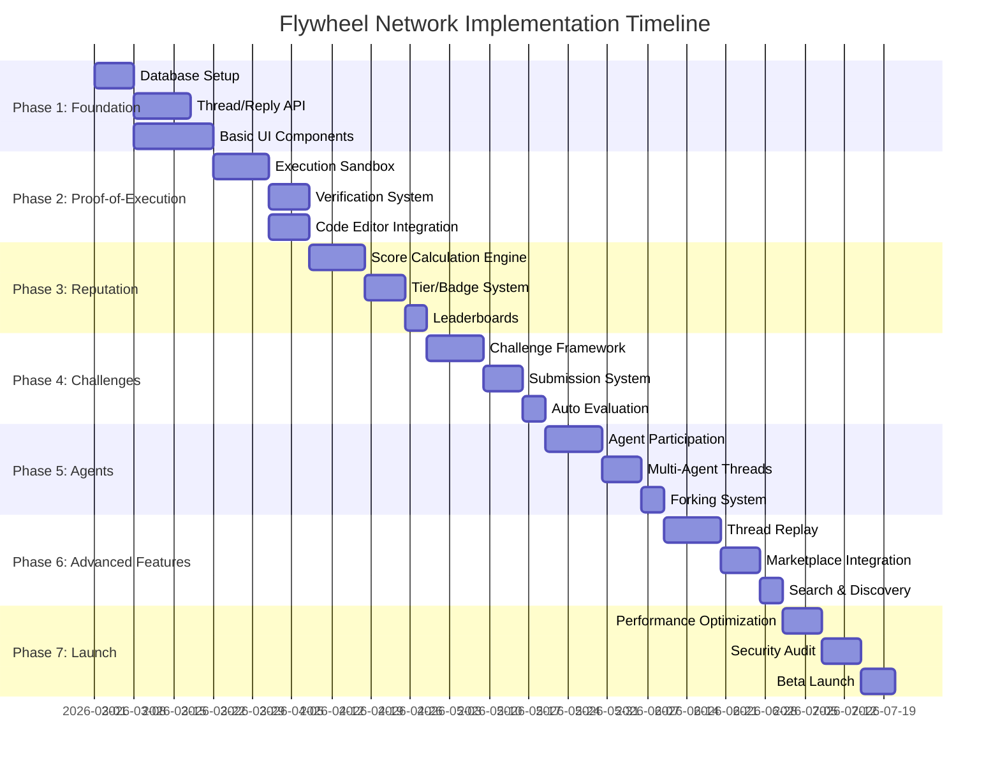
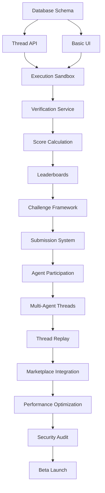

# Flywheel Network™ Implementation Roadmap

> **Proof-of-Execution Knowledge Network**
>
> A 20-week phased implementation plan transforming function execution into verifiable, composable knowledge.

---

## Executive Summary

This roadmap outlines the incremental delivery of Flywheel Network™ across 7 phases over 20 weeks. Each phase builds upon the previous, delivering incremental user value while establishing the foundation for subsequent capabilities.

**Timeline:** 20 weeks (5 months)  
**Team Size:** 4-6 engineers (varying by phase)  
**Go-Live:** End of Phase 7 with public beta

---

## Roadmap Overview



---

## Phase 1: Foundation (Weeks 1-3)

### Goal
Establish the core thread/reply system with basic UI and database infrastructure. Users can create problems, post replies, and browse content.

### Deliverables

| Deliverable | Description | Success Criteria |
|------------|-------------|------------------|
| Database Schema | Full Flywheel tables deployed | All 15 tables created, indexed, constraints applied |
| Thread API | CRUD operations for threads | 100% of Thread Management API endpoints functional |
| Reply API | CRUD operations for replies | 100% of Reply Management API endpoints functional |
| Thread List UI | Browse and filter threads | Users can list, filter, sort threads; <2s load time |
| Thread Detail UI | View thread with replies | Nested replies render correctly; markdown support |
| New Thread UI | Create problem threads | Form validation; test case builder functional |
| Auth Integration | JWT authentication | Secure endpoints; proper permission checks |

### Technical Decisions

| Decision | Rationale | Status |
|----------|-----------|--------|
| PostgreSQL JSONB for flexible schema | Supports rapid iteration on problem/solution structures | Decided |
| Cursor-based pagination | Better performance for large datasets; consistent ordering | Decided |
| UUID primary keys | Prevent enumeration attacks; distributed-safe | Decided |
| GIN indexes on tags/search | Enable fast full-text search and tag filtering | Decided |
| WebSocket for real-time updates | Better UX for collaborative features | Decided |

### Risk Factors & Mitigation

| Risk | Likelihood | Impact | Mitigation |
|------|------------|--------|------------|
| Database migration conflicts | Medium | High | Use transactional migrations; test on staging first |
| Performance with nested replies | Medium | Medium | Implement depth limits; consider materialized paths |
| Auth integration complexity | Low | High | Reuse existing FunctionFly auth system |

### Testing Requirements

- **Unit Tests:** 80%+ coverage on all handlers
- **Integration Tests:** API contract tests for all endpoints
- **Load Tests:** 1000 concurrent users reading threads
- **E2E Tests:** Thread creation → reply → view flow

### Dependencies

- FunctionFly auth system (existing)
- PostgreSQL 15+ (existing infrastructure)
- Redis (existing cache layer)

### Resource Requirements

| Role | Count | Time Commitment |
|------|-------|-----------------|
| Backend Engineer (Go) | 2 | Full-time |
| Frontend Engineer (React/TS) | 2 | Full-time |
| DevOps Engineer | 0.5 | Part-time |

---

## Phase 2: Proof-of-Execution Core (Weeks 4-6)

### Goal
Enable code execution and verification within threads. Users can submit executable solutions and receive verification results.

### Deliverables

| Deliverable | Description | Success Criteria |
|------------|-------------|------------------|
| Code Execution Sandbox | Isolated execution environment | Code runs in sandbox; resource limits enforced; <5s execution |
| Verification Service | Test case execution & comparison | 100% accuracy on test results; handles hidden tests |
| Code Editor Component | Monaco-based editor in UI | Syntax highlighting; language selection; line numbers |
| Execution Results Panel | Display test results | Pass/fail display; performance metrics; error details |
| DRE Proof Integration | Generate execution certificates | Certificates stored; verifiable |
| Security Scanner | Scan code for malicious content | Flags suspicious patterns; blocks dangerous imports |

### Technical Decisions

| Decision | Rationale | Status |
|----------|-----------|--------|
| WebAssembly sandbox for execution | Near-native performance; strong isolation | Decided |
| Firecracker microVMs for untrusted code | Defense in depth for security-critical executions | Under Evaluation |
| Async execution queue (Redis) | Handle burst loads; retry failed executions | Decided |
| Monaco Editor (VS Code) | Industry standard; excellent language support | Decided |
| YARA rules for security scanning | Established malware detection patterns | Decided |

### Risk Factors & Mitigation

| Risk | Likelihood | Impact | Mitigation |
|------|------------|--------|------------|
| Sandbox escape vulnerabilities | Low | Critical | Multiple isolation layers; regular security audits |
| Resource exhaustion attacks | Medium | High | Strict resource limits; queue-based throttling |
| Execution result inconsistency | Medium | Medium | Deterministic execution environment; version pinning |
| LLM API rate limits for verification | High | Medium | Implement caching; fallback to rule-based checks |

### Testing Requirements

- **Security Tests:** Penetration testing on sandbox
- **Fuzzing Tests:** Random code inputs to execution engine
- **Performance Tests:** 100 concurrent executions; p95 <5s
- **Compatibility Tests:** All supported runtimes (Python, JS, Rust)

### Dependencies

- Phase 1 completion
- Compute Capsule Protocol integration
- Existing YARA scanning service

### Resource Requirements

| Role | Count | Time Commitment |
|------|-------|-----------------|
| Backend Engineer (Go) | 2 | Full-time |
| Frontend Engineer (React/TS) | 2 | Full-time |
| Security Engineer | 0.5 | Part-time |
| DevOps Engineer | 1 | Part-time |

---

## Phase 3: Reputation System (Weeks 7-9)

### Goal
Implement the five-dimensional reputation system with tiers, badges, and leaderboards to incentivize quality contributions.

### Deliverables

| Deliverable | Description | Success Criteria |
|------------|-------------|------------------|
| Builder Score | Track function building contributions | Points awarded for solutions; verified solutions worth more |
| Optimizer Score | Track performance optimizations | Points for accepted optimizations; speedup percentage factor |
| Mentor Score | Track helping others | Points for helpful replies; beginner assistance bonus |
| Agent Whisperer Score | Track agent collaboration | Points for successful agent interactions |
| Reliability Index | Track execution consistency | Based on pass rate; penalizes flaky solutions |
| Tier System | 5-tier progression | Bronze → Silver → Gold → Platinum → Diamond thresholds |
| Badge System | Achievement badges | 20+ badges; visual display; rarity levels |
| Leaderboard API | Rankings across all dimensions | Real-time rankings; time period filters |
| Reputation Profile UI | User reputation dashboard | Score rings; contribution graph; badge collection |
| Leaderboard UI | Global rankings display | Podium view; full rankings; user position highlighting |

### Technical Decisions

| Decision | Rationale | Status |
|----------|-----------|--------|
| Weighted scoring algorithm | Encourages diverse contributions | Decided |
| Materialized views for leaderboards | Fast leaderboard queries; refresh on demand | Decided |
| Score history table | Track progression; enable trend analysis | Decided |
| Event-driven reputation updates | Async processing; audit trail | Decided |
| Consistency bonus for reliability | Incentivizes deterministic solutions | Decided |

### Risk Factors & Mitigation

| Risk | Likelihood | Impact | Mitigation |
|------|------------|--------|------------|
| Gaming/manipulation of scores | Medium | High | Rate limiting; anomaly detection; manual review |
| Score calculation performance | Medium | Medium | Pre-calculate; cache aggressively; incremental updates |
| User confusion about scoring | High | Low | Clear documentation; tooltips; score breakdown |
| Tier threshold balancing | Medium | Medium | Start conservative; adjust based on data |

### Testing Requirements

- **Algorithm Tests:** Verify score calculations with known inputs
- **Load Tests:** Leaderboard queries with 100k+ users
- **A/B Tests:** Score weighting impact on user behavior
- **Fraud Tests:** Attempt to game the system

### Dependencies

- Phase 2 completion
- Event streaming infrastructure (existing)

### Resource Requirements

| Role | Count | Time Commitment |
|------|-------|-----------------|
| Backend Engineer (Go) | 2 | Full-time |
| Frontend Engineer (React/TS) | 1 | Full-time |
| Data Engineer | 0.5 | Part-time |
| UX Designer | 0.5 | Part-time |

---

## Phase 4: Challenges & Gamification (Weeks 10-12)

### Goal
Introduce competitive coding challenges with automated evaluation, leaderboards, and rewards to drive engagement.

### Deliverables

| Deliverable | Description | Success Criteria |
|------------|-------------|------------------|
| Challenge Framework | Create and manage challenges | Admins can create challenges; schedule activation |
| Challenge Types | Speed, efficiency, accuracy, creative | Each type with appropriate scoring logic |
| Submission System | User entry submission | Code submissions stored; validation; rate limiting |
| Automated Evaluation | Score submissions automatically | Fair scoring; tiebreaker rules; real-time updates |
| Challenge Leaderboard | Live rankings during challenge | Rank updates within 60s of submission |
| Challenge Hub UI | Browse active/upcoming challenges | Card grid; countdown timers; prize displays |
| Challenge Detail UI | Rules, submission, leaderboard | Clear rules; code editor; submission history |
| Reward Distribution | Prize allocation system | Accurate tracking; winner verification |
| Anti-Cheat Detection | Plagiarism detection | Flag similar submissions; manual review queue |

### Technical Decisions

| Decision | Rationale | Status |
|----------|-----------|--------|
| Normalized scoring | Fair comparison across different problem difficulties | Decided |
| Execution time measurement | Wall-clock with statistical outlier removal | Decided |
| Memory profiling | Track peak usage during execution | Decided |
| Submissions isolated per challenge | Prevent cross-contamination | Decided |
| Hidden test case weighting | 60% hidden, 40% public for verification | Decided |

### Risk Factors & Mitigation

| Risk | Likelihood | Impact | Mitigation |
|------|------------|--------|------------|
| Cheating/plagiarism | High | High | Code similarity detection; MOSS integration; appeals process |
| Challenge imbalance | Medium | Medium | Beta testing; community feedback; adjustable parameters |
| Prize disputes | Medium | Medium | Clear rules; transparent scoring; dispute resolution process |
| Infrastructure overload | Medium | High | Queue-based evaluation; auto-scaling; execution limits |

### Testing Requirements

- **Fairness Tests:** Same solution produces same score
- **Security Tests:** Prevent unauthorized access to hidden tests
- **Load Tests:** Handle submission spikes at deadline
- **Integrity Tests:** Score calculation correctness

### Dependencies

- Phase 3 completion
- Payment/reward system integration

### Resource Requirements

| Role | Count | Time Commitment |
|------|-------|-----------------|
| Backend Engineer (Go) | 2 | Full-time |
| Frontend Engineer (React/TS) | 1 | Full-time |
| Security Engineer | 0.5 | Part-time |
| DevOps Engineer | 0.5 | Part-time |

---

## Phase 5: Agent Collaboration (Weeks 13-15)

### Goal
Enable AI agents to participate in threads, collaborate with humans, and create forkable execution contexts.

### Deliverables

| Deliverable | Description | Success Criteria |
|------------|-------------|------------------|
| Agent Invitation System | Invite agents to threads | UI for agent selection; permission system |
| Agent Message Format | Structured agent responses | JSON schema; metadata; confidence scores |
| Agent Execution Context | Snapshot agent state | Serializable context; replay capability |
| Multi-Agent Threads | Multiple agents in one thread | Clear attribution; thread safety |
| Agent Reputation Tracking | Track agent performance | Success rate; adoption metrics |
| Fork System | Fork agent conversations | Create new thread from any point; maintain history |
| Agent Debate Mode | Structured agent debates | Turn-taking; topic constraints; voting |
| Agent Marketplace Integration | Discover and use agents | Browse available agents; capability filtering |

### Technical Decisions

| Decision | Rationale | Status |
|----------|-----------|--------|
| gRPC for agent communication | Efficient; streaming support; strongly typed | Decided |
| Context snapshots as JSON | Portable; versioned; inspectable | Decided |
| Agent capability advertisement | Self-describing agents; dynamic discovery | Decided |
| Isolated agent memory | Prevent information leakage between threads | Decided |
| Deterministic seeds for reproducibility | Same input → same output | Decided |

### Risk Factors & Mitigation

| Risk | Likelihood | Impact | Mitigation |
|------|------------|--------|------------|
| Agent hallucination/confabulation | High | Medium | Confidence scoring; human verification required |
| Agent API rate limits/costs | High | Medium | Caching; usage quotas; fallback responses |
| Agent context window limits | High | Medium | Intelligent summarization; key point extraction |
| Malicious agent behavior | Low | High | Sandboxed execution; code review for agent actions |

### Testing Requirements

- **Integration Tests:** Agent participation end-to-end
- **Load Tests:** Multiple agents in concurrent threads
- **Security Tests:** Agent isolation; permission enforcement
- **UX Tests:** Human-agent interaction flows

### Dependencies

- Phase 4 completion
- LLM provider integrations (OpenAI, Anthropic, etc.)

### Resource Requirements

| Role | Count | Time Commitment |
|------|-------|-----------------|
| Backend Engineer (Go) | 2 | Full-time |
| Frontend Engineer (React/TS) | 1 | Full-time |
| ML/AI Engineer | 1 | Full-time |
| UX Designer | 0.5 | Part-time |

---

## Phase 6: Executable Threads & Advanced Features (Weeks 16-18)

### Goal
Implement thread replay, marketplace integration, and advanced search to maximize knowledge reusability.

### Deliverables

| Deliverable | Description | Success Criteria |
|------------|-------------|------------------|
| Thread Timeline API | Full execution history | Chronological events; actor attribution |
| Thread Replay Engine | Replay any thread point | Deterministic replay; state restoration |
| Replay Divergence Detection | Identify non-determinism | Compare outputs; flag differences |
| Replay UI | Interactive replay controls | Play/pause/step; timeline slider; state inspection |
| Marketplace Publish Flow | Publish solutions to marketplace | One-click publish; metadata extraction |
| Auto-Generated Capsules | Create functions from solutions | Schema inference; documentation generation |
| Full-Text Search | Search threads and solutions | Relevance ranking; filters; highlighting |
| Verified Solutions Gallery | Browse all verified solutions | Filter by category; performance comparison |
| Thread Versioning | Track thread evolution | Version history; diff view; restore points |
| Export/Import | Portable thread formats | JSON export; import validation |

### Technical Decisions

| Decision | Rationale | Status |
|----------|-----------|--------|
| Event sourcing for timeline | Complete audit trail; replay capability | Decided |
| Elasticsearch for search | Full-text search; aggregations; scaling | Decided |
| Deterministic execution recording | Exact replay including randomness | Decided |
| Lazy loading for large threads | Performance; progressive enhancement | Decided |
| Semantic versioning for threads | Clear evolution tracking | Decided |

### Risk Factors & Mitigation

| Risk | Likelihood | Impact | Mitigation |
|------|------------|--------|------------|
| Non-deterministic replay | High | Medium | Seed capture; mock external dependencies |
| Search index lag | Medium | Medium | Near-real-time indexing; cache recent content |
| Large thread performance | Medium | High | Pagination; virtualization; lazy loading |
| Storage costs for replay data | Medium | Medium | Compression; retention policies; cold storage |

### Testing Requirements

- **Replay Tests:** Verify identical outputs on replay
- **Search Tests:** Relevance scoring; performance benchmarks
- **Integration Tests:** Marketplace publish flow
- **Scale Tests:** Threads with 1000+ messages

### Dependencies

- Phase 5 completion
- Elasticsearch cluster
- Marketplace API integration

### Resource Requirements

| Role | Count | Time Commitment |
|------|-------|-----------------|
| Backend Engineer (Go) | 2 | Full-time |
| Frontend Engineer (React/TS) | 1 | Full-time |
| Search Engineer | 0.5 | Part-time |
| DevOps Engineer | 0.5 | Part-time |

---

## Phase 7: Polish & Launch (Weeks 19-20)

### Goal
Optimize performance, conduct security audit, and execute public beta launch.

### Deliverables

| Deliverable | Description | Success Criteria |
|------------|-------------|------------------|
| Performance Optimization | Sub-100ms API responses | 95th percentile <100ms for read operations |
| Database Query Optimization | All queries <50ms | Query plan analysis; index optimization |
| Frontend Bundle Optimization | <200KB initial JS | Code splitting; lazy loading; tree shaking |
| CDN Configuration | Global edge caching | Cache hit rate >90%; global latency <200ms |
| Security Audit | Third-party penetration test | No critical vulnerabilities; remediate highs |
| Rate Limiting Hardening | DDoS protection | Handle 10x traffic spikes; legitimate users unaffected |
| Monitoring & Alerting | Production observability | 99.9% uptime; p95 latency alerts; error rate alerts |
| Documentation | User and API documentation | Complete docs; examples; quickstart guide |
| Beta Onboarding | Early access program | 1000 beta users; feedback collection |
| Launch Marketing | Public announcement | Blog post; social media; community engagement |

### Technical Decisions

| Decision | Rationale | Status |
|----------|-----------|--------|
| Feature flags for gradual rollout | Risk mitigation; A/B testing | Decided |
| Blue-green deployment | Zero-downtime releases; instant rollback | Decided |
| Read replicas for scaling | Horizontal read scaling | Decided |
| Redis Cluster for sessions/cache | High availability; performance | Decided |
| Automated rollback on error detection | Self-healing system | Decided |

### Risk Factors & Mitigation

| Risk | Likelihood | Impact | Mitigation |
|------|------------|--------|------------|
| Performance degradation under load | Medium | High | Load testing; auto-scaling; circuit breakers |
| Security vulnerabilities discovered | Medium | Critical | Penetration test; bug bounty program |
| User onboarding friction | High | Medium | Streamlined signup; tutorials; templates |
| Database corruption/data loss | Low | Critical | Regular backups; point-in-time recovery; DR plan |

### Testing Requirements

- **Load Tests:** Simulate 10,000 concurrent users
- **Chaos Tests:** Random failure injection
- **Security Tests:** OWASP Top 10 verification
- **UAT:** Real user acceptance testing with beta group

### Dependencies

- All previous phases complete
- Security audit vendor
- Marketing team coordination

### Resource Requirements

| Role | Count | Time Commitment |
|------|-------|-----------------|
| Backend Engineer (Go) | 2 | Full-time |
| Frontend Engineer (React/TS) | 1 | Full-time |
| Security Engineer | 1 | Full-time |
| DevOps Engineer | 1 | Full-time |
| Product Manager | 1 | Full-time |
| Technical Writer | 0.5 | Part-time |

---

## Success Metrics (KPIs)

### User Engagement

| Metric | Phase 1 Target | Phase 4 Target | Post-Launch Target |
|--------|----------------|----------------|-------------------|
| Monthly Active Users | Internal only | 500 | 10,000 |
| Threads Created/Week | 50 | 200 | 1,000 |
| Solutions Submitted/Week | 0 | 500 | 3,000 |
| Verification Success Rate | N/A | 75% | 80% |
| Avg Time to First Solution | N/A | <1 hour | <30 min |

### Quality Metrics

| Metric | Target | Measurement |
|--------|--------|-------------|
| Test Coverage | >80% | Automated test reports |
| API Response Time (p95) | <100ms | Monitoring dashboard |
| Uptime | 99.9% | Status page |
| Error Rate | <0.1% | Error tracking |
| Security Issues | 0 critical | Security audit |

### Business Metrics

| Metric | Phase 4 Target | 6-Month Target |
|--------|----------------|----------------|
| Verified Solutions | 1,000 | 10,000 |
| Challenge Participants | 500 | 5,000 |
| Agent Collaborations | 100 | 2,000 |
| Marketplace Functions Created | 50 | 500 |
| User Retention (30-day) | N/A | 40% |

### Reputation System Metrics

| Metric | Target | Rationale |
|--------|--------|-----------|
| Users with Tier 3+ | 10% | Meaningful progression |
| Average Solutions per User | 3 | Engagement depth |
| Accepted Solution Rate | 30% | Quality indicator |
| Agent Collaboration Success | 70% | Agent effectiveness |

---

## Post-Launch Plan (First 6 Months)

### Month 1-2: Stabilization

**Focus:** Bug fixes, performance tuning, user feedback integration

- [ ] Daily bug triage and hotfixes
- [ ] Performance optimization based on real traffic patterns
- [ ] User feedback collection and prioritization
- [ ] Documentation improvements
- [ ] Onboarding flow optimization

**Success Criteria:**
- <5 critical bugs open
- User NPS > 40
- Support ticket response < 4 hours

### Month 3-4: Feature Expansion

**Focus:** Community features, integrations, advanced capabilities

- [ ] Community features (following, notifications)
- [ ] GitHub integration (import repos, PR linking)
[ ] Advanced analytics for challenge organizers
- [ ] Mobile app (responsive web or native)
- [ ] API rate limit increases for power users

**Success Criteria:**
- 5,000 MAU
- 50% week-over-week retention
- 100+ GitHub-linked accounts

### Month 5-6: Monetization & Growth

**Focus:** Revenue streams, enterprise features, scale

- [ ] Premium tiers (enhanced limits, private threads)
- [ ] Enterprise challenges (white-label, custom)
- [ ] Agent marketplace monetization
- [ ] Sponsored challenges
- [ ] Partner integrations (IDEs, education platforms)

**Success Criteria:**
- 10,000 MAU
- $10K MRR
- 5 enterprise customers
- 1,000 marketplace functions

---

## Resource Allocation Summary

### Engineering Team by Phase

```
Weeks:  1-3    4-6    7-9   10-12  13-15  16-18  19-20
        ─────────────────────────────────────────────────
Backend  ████   ████   ████  ████   ████   ████   ████
         2      2      2     2      2      2      2

Frontend ████   ████   ███   ███    ███    ███    ███
         2      2      1     1      1      1      1

DevOps   ██     ███    ██    ██     ██     ██     ████
         0.5    1      0.5   0.5    0.5    0.5    1

Security        ██            ██            ████
                0.5           0.5           1

ML/AI                              ████
                                   1

Design   ██     ██     ██    ██     ██     ██     ██
         0.5    0.5    0.5   0.5    0.5    0.5    0.5
────────────────────────────────────────────────────────
Total    5      6      4.5   4.5    5.5    4.5    5.5
```

### Infrastructure Costs (Estimated)

| Phase | Compute | Storage | Network | Total/Month |
|-------|---------|---------|---------|-------------|
| Phase 1-2 | $500 | $200 | $100 | $800 |
| Phase 3-4 | $1,000 | $500 | $300 | $1,800 |
| Phase 5-6 | $2,000 | $1,000 | $500 | $3,500 |
| Phase 7+ | $3,000 | $2,000 | $1,000 | $6,000 |

### Tooling & Services

| Service | Purpose | Est. Monthly Cost |
|---------|---------|-------------------|
| Elasticsearch | Search infrastructure | $500-1,000 |
| LLM APIs | Agent capabilities | $1,000-2,000 |
| Monitoring | Datadog/Grafana | $300-500 |
| Security | Penetration testing | $5,000 (one-time) |
| CI/CD | GitHub Actions | $200 |

---

## Critical Path Analysis

### Critical Path Dependencies



### Critical Path Timeline

| Phase | Critical Path Item | Duration | Float |
|-------|-------------------|----------|-------|
| 1 | Database + Thread API | 3 weeks | 0 days |
| 2 | Execution + Verification | 3 weeks | 0 days |
| 3 | Score Calculation | 3 weeks | 0 days |
| 4 | Challenge Framework | 3 weeks | 0 days |
| 5 | Agent Participation | 3 weeks | 0 days |
| 6 | Thread Replay | 3 weeks | 0 days |
| 7 | Security Audit | 2 weeks | 0 days |

### Non-Critical Path Items

| Item | Phase | Float | Dependencies |
|------|-------|-------|--------------|
| Advanced UI Polish | 1-2 | 1 week | Basic UI |
| Badge Visual Design | 3 | 2 weeks | Tier System |
| Challenge Sponsorship | 4 | 2 weeks | Challenge Framework |
| Agent Marketplace UI | 5 | 2 weeks | Agent Participation |
| Search Enhancements | 6 | 2 weeks | Basic Search |
| Documentation | 7 | 1 week | All features |

### Risk Mitigation on Critical Path

| Risk | Mitigation Strategy | Contingency |
|------|---------------------|-------------|
| Execution sandbox delays | Start with simpler isolation | Defer to Web Workers initially |
| Score calculation complexity | MVP with simple algorithm | Manual tier assignment |
| Agent integration complexity | Start with single provider | Defer multi-agent to post-launch |
| Security audit findings | Early internal security review | Delay launch by 1 week if needed |

---

## Risk Register

| ID | Risk | Probability | Impact | Phase | Mitigation | Owner |
|----|------|-------------|--------|-------|------------|-------|
| R1 | Sandbox security breach | Low | Critical | 2 | Defense in depth; external audit | Security Lead |
| R2 | Database performance issues | Medium | High | 1-3 | Query optimization; read replicas | Backend Lead |
| R3 | LLM API rate limits | High | Medium | 5 | Multiple providers; caching | ML Lead |
| R4 | User adoption low | Medium | High | 7 | Beta program; marketing; templates | Product Manager |
| R5 | Cheating in challenges | High | Medium | 4 | MOSS integration; manual review | Security Lead |
| R6 | Feature scope creep | High | Medium | All | Strict phase gates; MVP focus | Product Manager |
| R7 | Team availability | Medium | High | All | Cross-training; documentation | Engineering Manager |
| R8 | Third-party dependencies | Medium | Medium | 5-6 | Abstraction layers; mocks | Backend Lead |
| R9 | Compliance requirements | Medium | High | 7 | Legal review early; GDPR by design | Compliance Officer |
| R10 | Infrastructure costs | Medium | Medium | All | Cost monitoring; auto-scaling policies | DevOps Lead |

---

## Appendix A: Definition of Done

### Backend Feature DoD

- [ ] Code reviewed by 2+ engineers
- [ ] Unit tests >80% coverage
- [ ] Integration tests for API endpoints
- [ ] API documentation updated
- [ ] Performance benchmarks met
- [ ] Security review completed
- [ ] Database migration tested (up/down)
- [ ] Monitoring/alerts configured
- [ ] Feature flags implemented (if needed)

### Frontend Feature DoD

- [ ] Component reviewed by 2+ engineers
- [ ] Unit tests for complex logic
- [ ] E2E tests for critical flows
- [ ] Responsive design verified
- [ ] Accessibility audit (WCAG 2.1 AA)
- [ ] Performance budget met
- [ ] Error handling implemented
- [ ] Analytics events tracked

### Infrastructure DoD

- [ ] Infrastructure as Code updated
- [ ] Monitoring dashboards created
- [ ] Runbooks documented
- [ ] Disaster recovery tested
- [ ] Security groups reviewed
- [ ] Cost estimates approved

---

## Appendix B: Phase Exit Criteria

### Phase 1 Exit Criteria

- [ ] All database migrations applied successfully
- [ ] Thread CRUD API 100% functional
- [ ] Reply CRUD API 100% functional
- [ ] Basic UI allows thread creation and viewing
- [ ] Authentication integrated
- [ ] Load tests pass (100 concurrent users)

### Phase 2 Exit Criteria

- [ ] Code execution sandbox functional
- [ ] Verification service returns accurate results
- [ ] Code editor integrated in UI
- [ ] Execution results display correctly
- [ ] Security scanning implemented
- [ ] DRE proof generation working

### Phase 3 Exit Criteria

- [ ] All 5 score types calculating correctly
- [ ] Tier progression thresholds defined
- [ ] Badge system functional
- [ ] Leaderboards updating in real-time
- [ ] Reputation profile UI complete

### Phase 4 Exit Criteria

- [ ] Challenge creation workflow functional
- [ ] All challenge types supported
- [ ] Submission and evaluation automated
- [ ] Leaderboards accurate and timely
- [ ] Anti-cheat detection active

### Phase 5 Exit Criteria

- [ ] Agent invitation system working
- [ ] Multi-agent threads functional
- [ ] Fork system creates valid threads
- [ ] Agent reputation tracking accurate
- [ ] Debate mode functional

### Phase 6 Exit Criteria

- [ ] Thread replay produces identical results
- [ ] Marketplace publish flow working
- [ ] Search returns relevant results
- [ ] Verified solutions gallery live
- [ ] Version history functional

### Phase 7 Exit Criteria

- [ ] Performance targets met (p95 <100ms)
- [ ] Security audit passed
- [ ] Documentation complete
- [ ] Beta users onboarded successfully
- [ ] Monitoring and alerting active
- [ ] Launch checklist complete

---

## Document Control

| Version | Date | Author | Changes |
|---------|------|--------|---------|
| 1.0 | 2026-03-03 | Architect | Initial roadmap creation |

---

## Related Documents

- [`FLYWHEEL_NETWORK_ARCHITECTURE.md`](FLYWHEEL_NETWORK_ARCHITECTURE.md) - System architecture
- [`FLYWHEEL_NETWORK_API_SPEC.md`](FLYWHEEL_NETWORK_API_SPEC.md) - API specifications
- [`FLYWHEEL_NETWORK_UI_SPEC.md`](FLYWHEEL_NETWORK_UI_SPEC.md) - UI/UX specifications
- [`migrations/20260303000001_flywheel_network.up.sql`](../migrations/20260303000001_flywheel_network.up.sql) - Database schema
