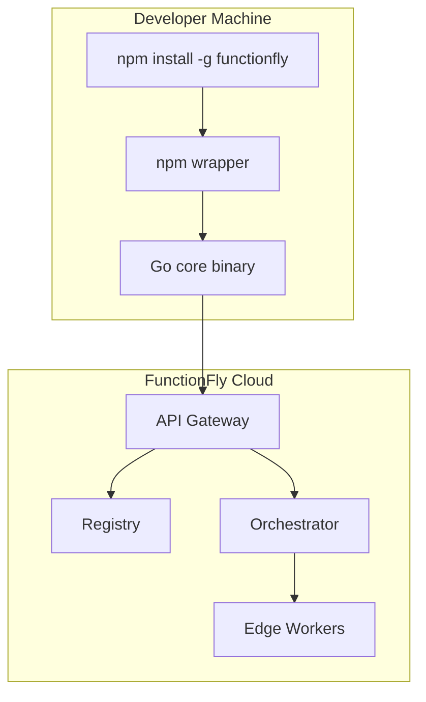
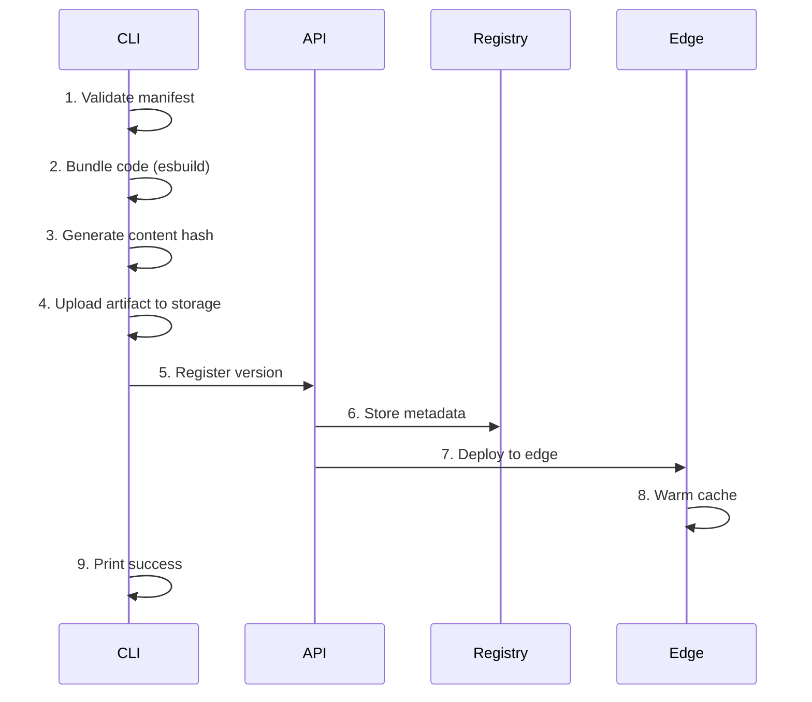
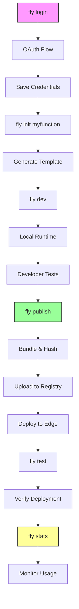

# FunctionFly `fly` CLI Specification

## Overview

The `fly` CLI is the primary developer interface for FunctionFly. It enables developers to go from idea → global API in under 60 seconds with zero infrastructure configuration.

**Core Philosophy:**
- Publishing must feel easier than writing a README
- No Docker, no infra config, no account dashboard required
- If developers think about infrastructure → we failed

---

## 1. Architecture

### 1.1 Dual Distribution



| Component | Technology | Purpose |
|-----------|------------|---------|
| npm wrapper | TypeScript | Developer ergonomics, cross-platform install |
| Core CLI | Go | Performance, bundling, file operations |
| Credentials | JSON | `~/.functionfly/credentials.json` |
| Config | JSONC | `functionfly.jsonc` per project |

### 1.2 Directory Structure

```
~/.functionfly/
├── credentials.json    # Auth tokens, user identity
└── config.yaml          # Global CLI settings

./functionfly.jsonc      # Per-project manifest (JSONC format)
./index.js              # Function code
└── test.http            # Local test requests
```

---

## 2. Commands

### 2.1 `fly login`

Creates developer identity in 5 seconds.

```bash
fly login
```

**Flow:**
1. CLI opens browser → OAuth provider (GitHub/Google)
2. User authorizes application
3. Callback received with auth code
4. Exchange code for JWT token
5. Store token in `~/.functionfly/credentials.json`

**Credentials File Format:**

```json
{
  "version": "1.0.0",
  "user": {
    "id": "usr_...",
    "username": "developer",
    "email": "dev@example.com",
    "provider": "github"
  },
  "token": "eyJhbGciOiJIUzI1...",
  "token_type": "Bearer",
  "expires_at": "2024-01-15T10:30:00Z",
  "created_at": "2024-01-14T08:00:00Z"
}
```

**Namespace:** After login, developer gets global namespace:
- `fx://username/*` 
- Example: `fx://trase/slugify`

**Implementation:**

```go
// cmd/login.go
type LoginCommand struct {
    provider string // "github" or "google"
    browser  bool   // open browser automatically
}

func (c *LoginCommand) Run(ctx context.Context) error {
    // 1. Start OAuth flow
    oauthURL, state, err := auth.GetOAuthURL(c.provider)
    if err != nil {
        return err
    }
    
    // 2. Open browser
    if c.browser {
        open.Browser(oauthURL)
    }
    
    // 3. Start local callback server
    callbackCh := startCallbackServer(state)
    
    // 4. Wait for callback
    token := <-callbackCh
    
    // 5. Save credentials
    return credentials.Save(token)
}
```

---

### 2.2 `fly init`

Creates a runnable function instantly.

```bash
fly init slugify
fly init --template=typescript slugify
fly init --template=python slugify
```

**Generates:**

```
slugify/
├── index.js              # Function code
├── functionfly.jsonc     # Manifest
└── test.http             # Local test
```

**index.js:**

```javascript
export default async function (input) {
  return input
    .toLowerCase()
    .replace(/[^a-z0-9]+/g, "-")
    .replace(/(^-|-$)/g, "");
}
```

**functionfly.jsonc:**

```json
{
  "$schema": "https://functionfly.com/schemas/functionfly.json",
  "name": "slugify",
  "version": "1.0.0",
  "runtime": "node18",
  "public": true,
  "deterministic": true,
  "cache_ttl": 86400,
  "timeout_ms": 5000,
  "memory_mb": 128,
  "description": "Convert string to URL-friendly slug"
}
```

**Implementation:**

```go
// cmd/init.go
type InitCommand struct {
    name     string
    template string // "javascript", "typescript", "python"
    force    bool
}

var templates = map[string]Template{
    "javascript": {
        File: "index.js",
        Content: `export default async function (input) {
  return input;
};`,
    },
    "typescript": {
        File: "index.ts",
        Content: `export default async function (input: string): Promise<string> {
  return input;
};`,
    },
    "python": {
        File: "main.py",
        Content: `async def handler(input: str) -> str:
    return input`,
    },
}
```

---

### 2.3 `fly dev`

Runs local execution environment identical to production.

```bash
fly dev
fly dev --port=8787
fly dev --watch
```

**Output:**

```
🚀 Local FunctionFly runtime started
   http://localhost:8787
   
Press Ctrl+C to stop
```

**Local Runtime Implementation:**

```go
// cmd/dev.go
type DevCommand struct {
    port  int
    watch bool
}

func (c *DevCommand) Run(ctx context.Context) error {
    // 1. Load function from current directory
    manifest, err := manifest.Load("")
    if err != nil {
        return fmt.Errorf("no functionfly.jsonc found. run 'fly init' first")
    }
    
    // 2. Start local runtime server
    runtime := localruntime.New(manifest)
    
    // 3. Watch for file changes (optional)
    if c.watch {
        watcher := fsnotify.New()
        defer watcher.Close()
        go func() {
            for {
                select {
                case event := <-watcher.Events:
                    if event.Has(fsnotify.Write) {
                        runtime.Reload()
                    }
                }
            }
        }()
    }
    
    // 4. Start HTTP server
    return http.ListenAndServe(fmt.Sprintf(":%d", c.port), runtime)
}
```

**Local Runtime Mock:**

```go
type LocalRuntime struct {
    manifest *Manifest
    function func(interface{}) (interface{}, error)
}

func (r *LocalRuntime) ServeHTTP(w http.ResponseWriter, req *http.Request) {
    // Read request body
    body, _ := io.ReadAll(req.Body)
    
    // Execute function
    result, err := r.function(string(body))
    if err != nil {
        http.Error(w, err.Error(), 500)
        return
    }
    
    // Return result
    w.Header().Set("Content-Type", "application/json")
    json.NewEncoder(w).Encode(result)
}
```

---

### 2.4 `fly publish` (The Magic Moment)

Publishes function to global registry with automatic infrastructure handling.

```bash
fly publish
fly publish --access=public
fly publish --access=private
```

**Automatic Workflow:**



**Output:**

```
✓ Validating manifest...
✓ Bundling code (2.1KB)...
✓ Computing hash: a1b2c3d4...
✓ Uploading to registry...
✓ Deploying to edge...
✓ Warming cache...

✓ Published trase/slugify@1.0.0

Public URL:
https://api.functionfly.com/trase/slugify

Curl:
curl https://api.functionfly.com/trase/slugify -d "Hello World"

Stats will be available in 30 seconds
```

**Implementation:**

```go
// cmd/publish.go
type PublishCommand struct {
    access string // "public" or "private"
    force  bool
}

type PublishResult struct {
    FunctionID  string    `json:"function_id"`
    Version     string    `json:"version"`
    URL         string    `json:"url"`
    Hash        string    `json:"hash"`
    DeployedAt  time.Time `json:"deployed_at"`
}

func (c *PublishCommand) Run(ctx context.Context) error {
    // 1. Load and validate manifest
    manifest, err := manifest.Load("")
    if err != nil {
        return err
    }
    if err := manifest.Validate(); err != nil {
        return fmt.Errorf("validation failed: %w", err)
    }
    
    // 2. Load credentials
    creds, err := credentials.Load()
    if err != nil {
        return fmt.Errorf("not logged in. run 'fly login' first")
    }
    
    // 3. Bundle code
    bundle, err := bundler.Bundle(manifest)
    if err != nil {
        return fmt.Errorf("bundling failed: %w", err)
    }
    
    // 4. Generate version hash
    hash := hashContent(bundle)
    
    // 5. Create API client
    client := api.NewClient(creds.Token)
    
    // 6. Upload and publish
    result, err := client.Publish(&api.PublishRequest{
        Author:    creds.User.Username,
        Name:      manifest.Name,
        Version:   manifest.Version,
        Runtime:   manifest.Runtime,
        Bundle:    base64.StdEncoding.EncodeToString(bundle),
        Hash:      hash,
        Public:    c.access == "public",
        Manifest: manifest,
    })
    if err != nil {
        return err
    }
    
    // 7. Print success
    return printSuccess(result)
}
```

---

### 2.5 `fly test`

Runs remote execution tests to verify deployment.

```bash
fly test
fly test --input="Hello World"
fly test --json
```

**Output:**

```
Testing remote deployment...
GET https://api.functionfly.com/trase/slugify

Response (200 OK):
slugify-test

latency: 14ms
cached: false
region: dfw

✓ Test passed
```

**Implementation:**

```go
// cmd/test.go
type TestCommand struct {
    input string
    json  bool
}

type TestResult struct {
    Status     int       `json:"status"`
    Body       string    `json:"body"`
    LatencyMs  int       `json:"latency_ms"`
    Cached     bool      `json:"cached"`
    Region     string    `json:"region"`
}

func (c *TestCommand) Run(ctx context.Context) error {
    // 1. Load manifest
    manifest, _ := manifest.Load("")
    
    // 2. Get function URL
    creds, _ := credentials.Load()
    url := fmt.Sprintf("https://api.functionfly.com/%s/%s",
        creds.User.Username, manifest.Name)
    
    // 3. Make request
    start := time.Now()
    resp, _ := http.Post(url, "text/plain", strings.NewReader(c.input))
    defer resp.Body.Close()
    
    body, _ := io.ReadAll(resp.Body)
    latency := time.Since(start).Milliseconds()
    
    // 4. Get headers
    cached := resp.Header.Get("X-Cache-Hit") == "true"
    region := resp.Header.Get("CF-Ray") // Cloudflare ray ID
    
    // 5. Print results
    return c.printResult(TestResult{
        Status:    resp.StatusCode,
        Body:      string(body),
        LatencyMs: int(latency),
        Cached:    cached,
        Region:    extractRegion(region),
    })
}
```

---

### 2.6 `fly update`

Safely bumps version without overwriting.

```bash
fly update patch    # 1.0.0 → 1.0.1
fly update minor   # 1.0.0 → 1.1.0
fly update major   # 1.0.0 → 2.0.0
fly update 1.2.3  # Set specific version
```

**Output:**

```
Current: 1.0.0
Updated: 1.0.1

Run 'fly publish' to deploy
```

**Implementation:**

```go
// cmd/update.go
type UpdateCommand struct {
    level string // "patch", "minor", "major" or semver
}

func (c *UpdateCommand) Run(ctx context.Context) error {
    manifest, err := manifest.Load("")
    if err != nil {
        return err
    }
    
    current, _ := semver.Parse(manifest.Version)
    
    var newVersion semver.Version
    switch c.level {
    case "patch":
        newVersion = current.IncrementPatch()
    case "minor":
        newVersion = current.IncrementMinor()
    case "major":
        newVersion = current.IncrementMajor()
    default:
        newVersion, _ = semver.Parse(c.level)
    }
    
    manifest.Version = newVersion.String()
    return manifest.Save()
}
```

---

### 2.7 `fly stats`

Provides immediate feedback on function usage.

```bash
fly stats
fly stats --period=7d
fly stats --format=json
```

**Output:**

```
slugify by trase

Calls today:     12,421
Calls this week:  87,234
Revenue:          $4.12
Success rate:     99.98%
Avg latency:      14ms

Last 7 days:
████████████░░ 12,421 calls
```

**Implementation:**

```go
// cmd/stats.go
type StatsCommand struct {
    period string // "24h", "7d", "30d"
    format string // "table", "json"
}

type StatsResponse struct {
    FunctionID     string  `json:"function_id"`
    TotalCalls     int64   `json:"total_calls"`
    SuccessRate    float64 `json:"success_rate"`
    AvgLatencyMs   float64 `json:"avg_latency_ms"`
    Revenue        float64 `json:"revenue"`
    Period         string  `json:"period"`
}

func (c *StatsCommand) Run(ctx context.Context) error {
    manifest, _ := manifest.Load("")
    creds, _ := credentials.Load()
    
    client := api.NewClient(creds.Token)
    stats, err := client.GetStats(manifest.Name, c.period)
    if err != nil {
        return err
    }
    
    return c.printStats(stats)
}
```

---

## 3. API Endpoints

### 3.1 New Endpoints Required

| Method | Endpoint | Purpose |
|--------|----------|---------|
| GET | `/v1/auth/oauth/{provider}` | Get OAuth URL |
| GET | `/v1/auth/oauth/{provider}/callback` | OAuth callback |
| POST | `/v1/registry/publish` | Publish function |
| GET | `/v1/registry/{author}/{name}` | Get function info |
| GET | `/v1/registry/{author}/{name}/versions` | List versions |
| GET | `/v1/registry/{author}/{name}/stats` | Get usage stats |
| POST | `/v1/registry/{author}/{name}/test` | Run remote test |

### 3.2 Publish Request/Response

**Request:**

```json
{
  "author": "trase",
  "name": "slugify",
  "version": "1.0.0",
  "runtime": "node18",
  "bundle": "base64_encoded_bundle",
  "hash": "a1b2c3d4...",
  "manifest": {
    "public": true,
    "deterministic": true,
    "cache_ttl": 86400,
    "timeout_ms": 5000,
    "memory_mb": 128
  }
}
```

**Response:**

```json
{
  "function_id": "fn_...",
  "version": "1.0.0",
  "url": "https://api.functionfly.com/trase/slugify",
  "deployed_regions": ["dfw", "iad", "sfo"],
  "deployed_at": "2024-01-14T10:30:00Z"
}
```

---

## 4. Manifest Schema

### 4.1 functionfly.jsonc

```json
{
  "$schema": "https://functionfly.com/schemas/functionfly.json",
  "name": "slugify",
  "version": "1.0.0",
  "runtime": "node18",
  "public": true,
  "deterministic": true,
  "cache_ttl": 86400,
  "timeout_ms": 5000,
  "memory_mb": 128,
  "description": "Convert string to URL-friendly slug",
  "dependencies": {
    "lodash": "^4.17.21"
  },
  "env": {
    "DEBUG": "false"
  }
}
```

### 4.2 Schema Definition

```json
{
  "$schema": "http://json-schema.org/draft-07/schema#",
  "type": "object",
  "required": ["name", "version", "runtime"],
  "properties": {
    "name": {
      "type": "string",
      "pattern": "^[a-z0-9-]+$",
      "maxLength": 64
    },
    "version": {
      "type": "string",
      "pattern": "^\\d+\\.\\d+\\.\\d+$"
    },
    "runtime": {
      "type": "string",
      "enum": ["node18", "node20", "python3.11", "deno"]
    },
    "public": {
      "type": "boolean",
      "default": true
    },
    "deterministic": {
      "type": "boolean",
      "default": false,
      "description": "Enable caching with content hash"
    },
    "cache_ttl": {
      "type": "integer",
      "minimum": 0,
      "maximum": 86400,
      "default": 3600
    },
    "timeout_ms": {
      "type": "integer",
      "minimum": 1000,
      "maximum": 30000,
      "default": 5000
    },
    "memory_mb": {
      "type": "integer",
      "enum": [128, 256, 512, 1024],
      "default": 128
    },
    "description": {
      "type": "string",
      "maxLength": 500
    },
    "dependencies": {
      "type": "object",
      "additionalProperties": {"type": "string"}
    },
    "env": {
      "type": "object",
      "additionalProperties": {"type": "string"}
    }
  }
}
```

---

## 5. Local Storage

### 5.1 Credentials File

Path: `~/.functionfly/credentials.json`

```json
{
  "version": "1.0.0",
  "user": {
    "id": "usr_abc123",
    "username": "trase",
    "email": "dev@trase.io",
    "provider": "github",
    "avatar_url": "https://avatars.githubusercontent.com/u/123"
  },
  "token": "eyJhbGciOiJIUzI1NiIsInR5cCI6IkpXVCJ9...",
  "refresh_token": "def5020...",
  "expires_at": "2024-01-14T18:30:00Z",
  "created_at": "2024-01-14T08:00:00Z"
}
```

### 5.2 Config File

Path: `~/.functionfly/config.yaml`

```yaml
version: "1.0.0"
api:
  url: "https://api.functionfly.com"
  timeout: 30s
dev:
  port: 8787
  watch: true
  hot_reload: true
publish:
  confirm: false
  auto_update: true
telemetry:
  enabled: true
  anonymize: false
```

---

## 6. Error Handling

### 6.1 User-Friendly Errors

| Error | Message | Resolution |
|-------|---------|-------------|
| Not logged in | `Not logged in. Run 'fly login' first` | Authenticate |
| No manifest | `No functionfly.jsonc found. Run 'fly init' first` | Initialize project |
| Invalid manifest | `Validation failed: name must be lowercase` | Fix manifest |
| Publish conflict | `Version 1.0.0 already exists. Run 'fly update patch'` | Bump version |
| Network error | `Failed to connect to API. Check your connection` | Retry |

---

## 7. Mermaid: Full Workflow



---

## 8. Implementation Priority

### Phase 1: Core Commands
1. `fly login` - OAuth authentication
2. `fly init` - Project scaffolding
3. `fly publish` - Publishing workflow

### Phase 2: Development
4. `fly dev` - Local runtime
5. `fly test` - Remote testing

### Phase 3: Management
6. `fly update` - Version management
7. `fly stats` - Usage analytics

---

## 9. Out of Scope

- Docker containers
- YAML configuration files
- Memory tuning beyond presets
- Region selection (automated)
- Complex CI/CD pipelines
- Team/organization management in v1
