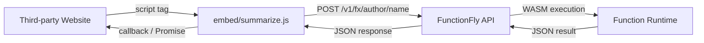

# Feature 3 — Function Embeds

> **One script tag. Any function. No backend required.**
>
> ```html
> <script src="https://functionfly.com/embed/summarize.js"></script>
> ```

---

## Overview

Function Embeds allow any website to run FunctionFly backend logic directly from a `<script>` tag — no server, no Zapier, no webhook tool, no form processor. The embed script is a self-contained JavaScript module that:

1. Exposes a callable API on `window.ff` (or a named namespace)
2. Handles input collection (optional UI mode)
3. Calls the FunctionFly execution API
4. Returns results to the page

This is a **massive adoption channel** because it removes the last barrier to using FunctionFly: you no longer need to write any backend code or set up any infrastructure.

---

## What It Replaces

| Tool | Replaced By |
|------|-------------|
| Zapier embeds | `ff.run("author/zap-equivalent", input)` |
| Form processors (Formspree, Basin) | `ff.form("author/process-form", formEl)` |
| Webhook tools | `ff.webhook("author/handler", payload)` |
| Lightweight APIs | `ff.run("author/function", input)` |

---

## Architecture



---

## URL Structure

### Embed Script URL

```
GET https://functionfly.com/embed/{author}/{name}.js
GET https://functionfly.com/embed/{author}/{name}@{version}.js
```

**Examples:**
```html
<!-- Latest version -->
<script src="https://functionfly.com/embed/functionfly/summarize.js"></script>

<!-- Pinned version -->
<script src="https://functionfly.com/embed/functionfly/summarize@1.2.0.js"></script>
```

### Query Parameters

| Parameter | Type | Description |
|-----------|------|-------------|
| `namespace` | string | Global variable name (default: `ff`) |
| `autoload` | bool | Auto-initialize on DOMContentLoaded (default: `true`) |
| `ui` | bool | Inject a default UI widget (default: `false`) |
| `theme` | string | UI theme: `light`, `dark`, `auto` (default: `auto`) |
| `allowed_origins` | string | Comma-separated allowed origins (server-side validation) |

**Example with options:**
```html
<script src="https://functionfly.com/embed/acme/email-validator.js?namespace=myApp&ui=true&theme=dark"></script>
```

---

## Embed Script API (Client-Side)

Once the script loads, it exposes a global object (default: `ff`):

### `ff.run(input, options?)`

Execute the embedded function programmatically.

```javascript
// Promise-based
const result = await ff.run({ text: "Hello world" });
console.log(result.data); // function output

// Callback-based
ff.run({ text: "Hello world" }, {
  onSuccess: (data) => console.log(data),
  onError: (err) => console.error(err),
});
```

### `ff.form(formElement, options?)`

Bind to an HTML form — on submit, serialize form data and execute the function.

```html
<form id="myForm">
  <input name="email" type="email" />
  <button type="submit">Validate</button>
</form>

<script>
  ff.form(document.getElementById("myForm"), {
    onSuccess: (data) => alert("Valid: " + data.valid),
    onError: (err) => alert("Error: " + err.message),
  });
</script>
```

### `ff.on(event, handler)`

Subscribe to embed lifecycle events.

```javascript
ff.on("ready", () => console.log("Embed loaded"));
ff.on("execute:start", (input) => console.log("Running with", input));
ff.on("execute:success", (result) => console.log("Done", result));
ff.on("execute:error", (err) => console.error("Failed", err));
```

### `ff.widget(containerEl, options?)`

Mount a full interactive UI widget into a container element.

```html
<div id="summarizer"></div>
<script>
  ff.widget(document.getElementById("summarizer"), {
    title: "Summarize Text",
    placeholder: "Paste your text here...",
    buttonText: "Summarize",
    onSuccess: (data) => console.log(data),
  });
</script>
```

---

## Backend Implementation

### New Route

```
GET /v1/embed/{author}/{name}.js
GET /v1/embed/{author}/{name}@{version}.js
```

Registered in [`internal/api/routes.go`](../internal/api/routes.go).

### New Handler

**File:** `internal/api/handlers/registry/embed.go`

```go
// HandleServeEmbed serves a per-function embed script
func (h *Handler) HandleServeEmbed(w http.ResponseWriter, r *http.Request) {
    vars := mux.Vars(r)
    author := vars["author"]
    name := vars["name"]
    version := vars["version"] // may be empty (latest)

    // 1. Look up function in registry
    fn, err := h.repo.GetFunctionByAuthorName(author, name)
    // ... error handling

    // 2. Get function version metadata (schema, description, etc.)
    fnVersion, err := h.repo.GetLatestFunctionVersion(fn.ID)
    // ... error handling

    // 3. Parse embed options from query string
    opts := parseEmbedOptions(r)

    // 4. Generate embed script
    script := generateEmbedScript(fn, fnVersion, version, opts)

    // 5. Set headers
    w.Header().Set("Content-Type", "application/javascript; charset=utf-8")
    w.Header().Set("Cache-Control", "public, max-age=300") // 5 min cache
    w.Header().Set("Access-Control-Allow-Origin", "*")     // embeds must be cross-origin
    w.Header().Set("X-Content-Type-Options", "nosniff")

    w.WriteHeader(http.StatusOK)
    w.Write([]byte(script))
}
```

### Embed Script Generator

**File:** `internal/api/handlers/registry/embed_generation.go`

The generator produces a self-contained IIFE (Immediately Invoked Function Expression) that:

1. Reads its own `<script>` tag `src` attribute to determine the API base URL
2. Exposes the `ff` (or custom namespace) global
3. Handles CORS via the existing FunctionFly API (no proxy needed)
4. Supports both Promise and callback patterns
5. Optionally injects a minimal UI widget

**Generated Script Structure:**

```javascript
(function(global, config) {
  "use strict";

  const API_BASE = "https://api.functionfly.com/v1/fx";
  const AUTHOR = "{{.Author}}";
  const NAME = "{{.Name}}";
  const VERSION = "{{.Version}}";
  const NAMESPACE = "{{.Namespace}}";

  // Core execution
  async function run(input, options = {}) { ... }

  // Form binding
  function form(formEl, options = {}) { ... }

  // Event system
  const handlers = {};
  function on(event, handler) { ... }
  function emit(event, data) { ... }

  // Optional UI widget
  function widget(container, options = {}) { ... }

  // Public API
  const api = { run, form, on, widget, version: VERSION };

  // Register global
  global[NAMESPACE] = api;

  // Auto-initialize
  if (config.autoload) {
    document.addEventListener("DOMContentLoaded", () => emit("ready", api));
  }

})(window, { autoload: {{.Autoload}}, ui: {{.UI}} });
```

---

## Security Model

### CORS

- The embed script itself is served with `Access-Control-Allow-Origin: *` (it's a public JS file)
- The **execution API** (`/v1/fx/{author}/{name}`) already supports CORS via the existing [`CORSMiddleware`](../internal/api/middleware/security.go:180)
- Function owners can optionally restrict execution to specific origins via **Allowed Origins** configuration

### Allowed Origins (Per-Function)

Function owners can configure which domains are allowed to execute their function via embed:

```json
{
  "embed": {
    "allowed_origins": ["https://mysite.com", "https://app.mysite.com"],
    "require_api_key": false
  }
}
```

The execution handler checks the `Origin` header against the function's `embed_allowed_origins` field (new DB column).

### Rate Limiting

Embed executions go through the same execution security middleware as direct API calls:
- Per-IP rate limiting via [`ExecutionCoordinatorMiddleware`](../internal/api/middleware/execution_coordinator.go)
- CAPTCHA challenge for suspicious patterns
- DDoS protection via [`AdvancedSecurityMiddleware`](../internal/api/middleware/advanced_security/middleware.go)

### API Key Support

For private functions, the embed script accepts an API key:

```html
<script src="https://functionfly.com/embed/acme/private-fn.js"
        data-api-key="ffly_live_xxxx"></script>
```

The script reads `data-api-key` from its own `<script>` tag and includes it as a `Bearer` token.

> ⚠️ **Security Note:** API keys in `data-*` attributes are visible in page source. This is acceptable for public-facing embeds with rate-limited keys. For sensitive operations, use server-side execution.

---

## Database Changes

### New Column: `registry_functions.embed_config`

```sql
ALTER TABLE registry_functions
ADD COLUMN embed_config JSONB DEFAULT NULL;
```

**Schema:**
```json
{
  "enabled": true,
  "allowed_origins": ["*"],
  "require_api_key": false,
  "ui_enabled": true,
  "ui_theme": "auto",
  "rate_limit_per_hour": 1000
}
```

### New Column: `registry_function_executions.embed_origin`

```sql
ALTER TABLE registry_function_executions
ADD COLUMN embed_origin TEXT DEFAULT NULL;
```

Tracks which domain triggered the embed execution for analytics.

---

## New Files

| File | Purpose |
|------|---------|
| `internal/api/handlers/registry/embed.go` | HTTP handler for serving embed scripts |
| `internal/api/handlers/registry/embed_generation.go` | Embed script generator (Go template → JS) |
| `internal/api/handlers/registry/embed_test.go` | Unit tests for embed generation |
| `migrations/XXXX_add_embed_config.sql` | DB migration for embed_config column |

---

## Modified Files

| File | Change |
|------|--------|
| [`internal/api/routes.go`](../internal/api/routes.go) | Add embed routes |
| [`internal/api/handlers/registry/handlers.go`](../internal/api/handlers/registry/handlers.go) | Register embed handler |
| [`internal/api/handlers/registry/sdk_generation.go`](../internal/api/handlers/registry/sdk_generation.go) | Add `generateEmbedScript()` function |
| [`internal/storage/registry/repository.go`](../internal/storage/registry/) | Add `GetFunctionEmbedConfig()` method |

---

## Dashboard UI

### Embed Tab on Function Detail Page

Add an "Embed" tab to the function detail page in the dashboard with:

1. **Embed Code Snippet** — copy-paste ready `<script>` tag
2. **Configuration Panel:**
   - Toggle embed on/off
   - Allowed origins (comma-separated)
   - Require API key toggle
   - UI widget toggle + theme selector
3. **Live Preview** — iframe showing the widget in action
4. **Analytics** — embed execution count by origin domain

### Embed Code Generator Widget

```
┌─────────────────────────────────────────────────────┐
│  📦 Embed this function                              │
├─────────────────────────────────────────────────────┤
│  Namespace:  [ff          ]  UI Widget: [✓]         │
│  Theme:      [auto ▼     ]  Autoload:  [✓]         │
├─────────────────────────────────────────────────────┤
│  <script src="https://functionfly.com/embed/        │
│    functionfly/summarize.js?ui=true&theme=auto">    │
│  </script>                                          │
│                                          [Copy]     │
└─────────────────────────────────────────────────────┘
```

---

## Analytics

Track embed usage in the existing execution analytics pipeline:

- `embed_origin` column captures the referring domain
- Dashboard shows "Top Embed Domains" chart
- Alerts when embed usage spikes (potential abuse)

---

## Rollout Plan

### Phase 1 — Core Embed (MVP)
- [ ] Backend: `GET /v1/embed/{author}/{name}.js` endpoint
- [ ] Script generator: `ff.run()` + `ff.on()` API
- [ ] CORS headers on embed endpoint
- [ ] Route registration in `routes.go`
- [ ] DB migration for `embed_config`
- [ ] Basic tests

### Phase 2 — Form & Widget Support
- [ ] `ff.form()` binding
- [ ] `ff.widget()` UI injection
- [ ] Theme support (light/dark/auto)
- [ ] Dashboard embed tab with code generator

### Phase 3 — Security & Analytics
- [ ] Allowed origins enforcement
- [ ] API key support via `data-api-key`
- [ ] Embed analytics (origin tracking)
- [ ] Rate limiting per embed domain
- [ ] Abuse detection alerts

---

## Example Use Cases

### 1. Contact Form Processor
```html
<form id="contact">
  <input name="name" placeholder="Your name" />
  <input name="email" type="email" placeholder="Email" />
  <textarea name="message"></textarea>
  <button type="submit">Send</button>
</form>

<script src="https://functionfly.com/embed/functionfly/send-email.js"></script>
<script>
  ff.form(document.getElementById("contact"), {
    onSuccess: () => alert("Message sent!"),
    onError: (e) => alert("Error: " + e.message),
  });
</script>
```

### 2. Text Summarizer Widget
```html
<div id="summarizer"></div>
<script src="https://functionfly.com/embed/functionfly/summarize.js?ui=true"></script>
<script>
  ff.widget(document.getElementById("summarizer"), {
    title: "AI Summarizer",
    placeholder: "Paste article text...",
    buttonText: "Summarize",
  });
</script>
```

### 3. Headless Data Processing
```html
<script src="https://functionfly.com/embed/functionfly/csv-to-json.js"></script>
<script>
  document.getElementById("upload").addEventListener("change", async (e) => {
    const csv = await e.target.files[0].text();
    const result = await ff.run({ csv });
    renderTable(result.data);
  });
</script>
```

### 4. Webhook Receiver (Serverless)
```html
<!-- No backend needed — process Stripe webhooks directly in the browser -->
<script src="https://functionfly.com/embed/acme/process-payment.js"
        data-api-key="ffly_live_xxxx"></script>
<script>
  ff.on("ready", () => {
    // Register as Stripe webhook handler
    stripe.on("payment_intent.succeeded", async (event) => {
      await ff.run({ event });
    });
  });
</script>
```

---

## Implementation Notes

### Script Caching Strategy

- Embed scripts are served with `Cache-Control: public, max-age=300` (5 minutes)
- Version-pinned embeds (`@1.2.0`) get `Cache-Control: public, max-age=31536000, immutable`
- CDN-friendly: the script URL is deterministic and cacheable

### Script Size Target

- Core embed (no UI): **< 3KB gzipped**
- With UI widget: **< 8KB gzipped**
- No external dependencies

### Browser Compatibility

- ES2017+ (async/await)
- No polyfills required for modern browsers
- Graceful degradation for older browsers (falls back to callback API)

### Error Handling

The embed script surfaces errors in a developer-friendly way:

```javascript
ff.run({ text: "..." }).catch((err) => {
  // err.code: "RATE_LIMITED" | "NOT_FOUND" | "EXECUTION_FAILED" | "NETWORK_ERROR"
  // err.message: human-readable description
  // err.statusCode: HTTP status code
});
```
