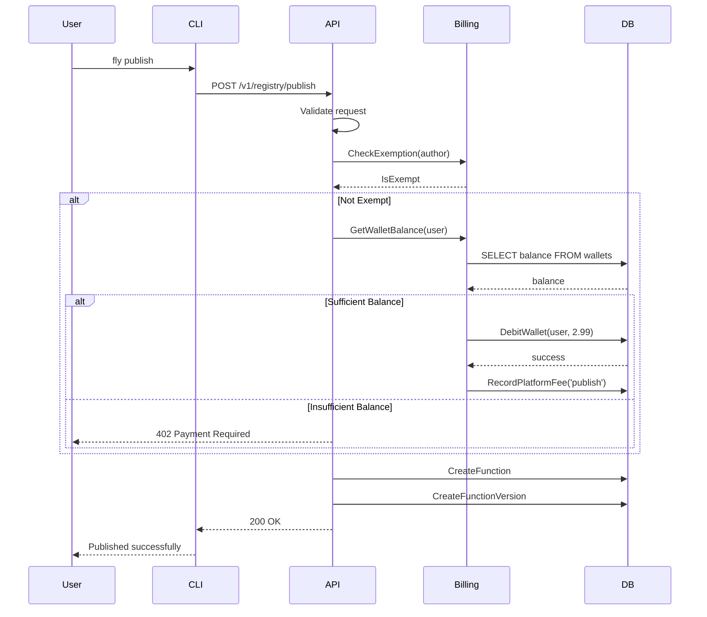

# Function Marketplace Analysis & Platform Fee Implementation Plan

**Date**: 2026-03-21  
**Status**: Analysis Complete, Implementation Planning

---

## Executive Summary

The FunctionFly marketplace has **85+ functions** but lacks:

1. **Platform fee mechanism** - No revenue model for publishing
2. **Category alignment** - UI categories don't match function metadata
3. **Pricing implementation** - All functions are free (price_per_call = 0)

This document details findings and a concrete implementation plan for adding a platform fee.

---

## Part 1: Marketplace Analysis

### 1.1 Function Inventory

**Location**: `functions/functionfly/` (~85 functions)

| Category | Count | Examples |
|----------|-------|----------|
| `arrays` | 10 | array-bsearch-closest, array-chunk, array-shuffle |
| `security` | 8 | rsa-encrypt, decrypt-aes-cbc, scrypt-verify |
| `data-format` | 12 | json-to-csv, atom-feed-parse, thrift-decode |
| `text` | 9 | pluralize, profanity-filter, twitter-text-parse |
| `conversion` | 15 | degrees-to-radians, int-to-ipv4, hex-to-color-name |
| `validation` | 6 | is-uuid, validate-credit-card, ip-validate |
| `content` | 5 | content-sentiment, content-classify |
| `ai-ml` | 3 | churn-prediction, comment-moderate |
| Other | 17 | tld-extract, pdf-extract-text, video-thumbnail |

### 1.2 Pricing Model (Current)

The database schema supports:

- `PricePerCall` (float64) - per-call cost
- `SubscriptionMonthlyUsd` (planned) - subscription model
- `RevenueShare` (planned) - revenue split model

**Current State**: All functions have `price_per_call = 0` (free)

### 1.3 Publish Flow

```
User → CLI fly publish → API /v1/registry/publish → Handler.HandlePublish
                                                          ↓
                                    CreateRegistryFunction (if new)
                                        ↓
                                    CreateFunctionVersion
                                        ↓
                                    InvalidateListCache
                                        ↓
                                    Response: {function_id, version_id}
```

**Key Finding**: No fee validation or collection occurs during publish.

---

## Part 2: Issues & Gaps

### Issue 1: Category Mismatch (HIGH PRIORITY)

**Problem**: UI expects specific categories but functions use different values.

| UI Category (FunctionMarketplace.tsx:54) | Function Categories (functionfly.jsonc) |
|------------------------------------------|----------------------------------------|
| `data-processing` | (none) |
| `utilities` | `arrays`, `conversion`, `validation` |
| `ai-ml` | `ai-ml`, `content`, `social` |
| `integrations` | (none - could add webhooks, api clients) |
| `transformations` | `data-format`, `conversion` |
| `validations` | `validation` |
| `analytics` | (none - could add metrics, logging) |

**Impact**: Filter UI shows "No functions found" for some categories.

### Issue 2: Missing Pricing Infrastructure

- No Stripe/billing integration for collecting fees
- No concept of "publisher wallet" or earnings
- No platform fee percentage configuration
- UI shows pricing badges but backend doesn't enforce

### Issue 3: Production Readiness Gaps

| Area | Status | Notes |
|------|--------|-------|
| Function coverage | ⚠️ LIMITED | ~85 functions, missing common use cases |
| Error handling | ✅ ADEQUATE | Proper error responses in handlers |
| Caching | ✅ ADEQUATE | Redis caching for search/list |
| Authentication | ✅ ADEQUATE | Auth middleware on publish |
| Verification | ✅ ADEQUATE | Malware scanning, DRE/FXCERT |
| Documentation | ⚠️ PARTIAL | Some functions lack README |
| Tests | ⚠️ UNKNOWN | Need to run `go test` |

### Issue 4: UI/UX Issues

1. **"Use Function" vs "Purchase"** - Button text varies but no actual purchase flow
2. **Rating display** - Shows 0-5 stars but many functions have no ratings
3. **Trust score badge** - UI shows deterministic verified but doesn't explain criteria
4. **Search results** - No sorting by relevance, price, or trust

---

## Part 3: Platform Fee Design

### 3.1 Recommended Platform Fee Model

**Model**: Tiered Publishing Fee + Platform Commission

| Fee Type | Amount | When Charged | Notes |
|----------|--------|--------------|-------|
| **Publish Fee** | $2.99 per function | On publish | One-time, non-refundable |
| **Update Fee** | $0.99 per version | On new version | Waived for bug fixes |
| **Platform Commission** | 15% of revenue | Monthly payout | From price_per_call earnings |

### 3.2 Fee Configuration Options

```go
// PlatformFeeConfig - in internal/plans or config
type PlatformFeeConfig struct {
    PublishFeeUSD          float64   // Default: 2.99
    VersionUpdateFeeUSD    float64   // Default: 0.99
    PlatformCommissionPct  float64   // Default: 0.15 (15%)
    ExemptAuthors          []string  // e.g., ["functionfly"]
    ExemptCategories       []string  // e.g., ["utilities"]
    MinPricePerCallUSD     float64   // Default: 0.001
    MaxPricePerCallUSD     float64   // Default: 10.00
}
```

### 3.3 Implementation Architecture

```
┌─────────────────────────────────────────────────────────────┐
│                    Publish Flow (Updated)                    │
├─────────────────────────────────────────────────────────────┤
│  User → CLI fly publish → API /v1/registry/publish          │
│                            ↓                                 │
│                    Validate Request                          │
│                            ↓                                 │
│              Check PlatformFeeConfig                          │
│                            ↓                                 │
│         Author exempt? ──yes──→ Continue to publish          │
│                            │                                 │
│                           no                                │
│                            ↓                                 │
│         Check user billing/subscription status               │
│                            ↓                                 │
│         Has sufficient credits or active subscription?       │
│                            ↓                                 │
│         Deduct publish fee from user wallet                  │
│                            ↓                                 │
│                    Continue to publish                       │
└─────────────────────────────────────────────────────────────┘
```

### 3.4 Database Changes Required

```sql
-- Add platform_fee columns to registry_functions
ALTER TABLE registry_functions 
ADD COLUMN platform_fee_paid BOOLEAN DEFAULT FALSE,
ADD COLUMN platform_fee_amount_usd DECIMAL(10,2) DEFAULT 0,
ADD COLUMN last_fee_charged_at TIMESTAMP;

-- Create platform_fees table for audit trail
CREATE TABLE platform_fees (
    id UUID PRIMARY KEY DEFAULT gen_random_uuid(),
    function_id UUID REFERENCES registry_functions(id),
    user_id UUID REFERENCES users(id),
    fee_type VARCHAR(50) NOT NULL, -- 'publish', 'version_update', 'commission'
    amount_usd DECIMAL(10,2) NOT NULL,
    charged_at TIMESTAMP DEFAULT NOW(),
    stripe_payment_id VARCHAR(255),
    status VARCHAR(50) DEFAULT 'completed' -- 'pending', 'completed', 'failed', 'refunded'
);

-- Create user_wallets for tracking balance
CREATE TABLE user_wallets (
    user_id UUID PRIMARY KEY REFERENCES users(id),
    balance_usd DECIMAL(10,2) DEFAULT 0,
    lifetime_earnings_usd DECIMAL(10,2) DEFAULT 0,
    lifetime_fees_usd DECIMAL(10,2) DEFAULT 0,
    updated_at TIMESTAMP DEFAULT NOW()
);
```

### 3.5 API Changes

**New Endpoints**:

- `POST /v1/billing/wallet/top-up` - Add funds to wallet
- `GET /v1/billing/wallet` - Get wallet balance
- `GET /v1/billing/transactions` - List transactions
- `GET /v1/billing/fees` - List platform fees

**Modified Endpoints**:

- `POST /v1/registry/publish` - Add fee validation and charging

---

## Part 4: Implementation Plan

### Phase 1: Database & Models (Day 1)

```
TASKS:
[ ] 1.1 Add platform_fee fields to RegistryFunction model
[ ] 1.2 Create PlatformFee model
[ ] 1.3 Create UserWallet model
[ ] 1.4 Add database migration
[ ] 1.5 Update RegistryRepository with wallet methods
```

**Files to Modify**:

- `internal/storage/registry/types.go` - Add new models
- `migrations/` - Add migration file
- `internal/storage/registry/platform_fees.go` - New file

### Phase 2: Billing Service (Day 1-2)

```
TASKS:
[ ] 2.1 Create PlatformFeeService in internal/billing/
[ ] 2.2 Implement wallet operations (credit, debit, balance)
[ ] 2.3 Add Stripe integration for wallet top-up
[ ] 2.4 Create billing API handlers
```

**Files to Create**:

- `internal/billing/platform_fee.go`
- `internal/billing/wallet.go`
- `internal/api/handlers/billing/wallet.go`

### Phase 3: Publish Integration (Day 2)

```
TASKS:
[ ] 3.1 Modify HandlePublish to check/charge fees
[ ] 3.2 Add fee exemption logic for functionfly author
[ ] 3.3 Update PublishResponse to include fee info
[ ] 3.4 Add fee calculation to pricing helpers
```

**Files to Modify**:

- `internal/api/handlers/registry/publish.go` - Add fee logic
- `internal/storage/registry/function_crud.go` - Add fee update

### Phase 4: Dashboard UI (Day 2-3)

```
TASKS:
[ ] 4.1 Add "Publish Fee: $2.99" badge to publish flow
[ ] 4.2 Show wallet balance in navigation
[ ] 4.3 Add wallet top-up modal
[ ] 4.4 Display fee history in billing page
[ ] 4.5 Update FunctionMarketplace to filter by priced functions
```

**Files to Modify**:

- `web/dashboard/src/components/swarm/FunctionMarketplace.tsx`
- `web/dashboard/src/pages/BillingPage.tsx` (create if not exists)
- `web/dashboard/src/api/billing.ts` (new file)

### Phase 5: Testing & Documentation (Day 3)

```
TASKS:
[ ] 5.1 Add unit tests for PlatformFeeService
[ ] 5.2 Add integration tests for publish with fees
[ ] 5.3 Update API documentation
[ ] 5.4 Add fee configuration to .env.example
```

---

## Part 5: Configuration

### Environment Variables

```bash
# Platform Fee Configuration
PLATFORM_PUBLISH_FEE_USD=2.99
PLATFORM_VERSION_UPDATE_FEE_USD=0.99
PLATFORM_COMMISSION_PCT=0.15
PLATFORM_EXEMPT_AUTHORS=functionfly
PLATFORM_MIN_PRICE_PER_CALL=0.001
PLATFORM_MAX_PRICE_PER_CALL=10.00

# Stripe (for wallet top-up)
STRIPE_SECRET_KEY=sk_...
STRIPE_WEBHOOK_SECRET=whsec_...
```

### Feature Flags

```go
const (
    FeaturePlatformFees  = "PLATFORM_FEATURES_ENABLED"
    FeatureWalletTopUp   = "WALLET_TOPUP_ENABLED"
    FeatureCommission    = "PLATFORM_COMMISSION_ENABLED"
)
```

---

## Part 6: Risk Assessment

| Risk | Likelihood | Impact | Mitigation |
|------|-------------|--------|------------|
| Publishers abandon due to fees | Medium | High | Offer free tier (3 functions free) |
| Stripe integration complexity | Low | Medium | Use simple checkout, no subscriptions |
| Database migration failure | Low | High | Test on staging first |
| Fee calculation errors | Medium | Medium | Add audit trail, reconciliation job |

---

## Appendix: Mermaid Diagram - Publish Flow with Fees



---

## Next Steps

1. **Approve this plan** - Confirm fee amounts and model
2. **Switch to Code mode** - Begin implementation
3. **Staging deployment** - Test fees in staging first
4. **Rollout** - Gradual rollout with free tier for first 3 functions
