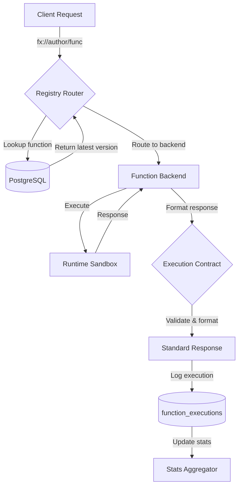

# FunctionFly Public Function Registry - Implementation Plan

## Overview

This document defines the foundational **Public Function Registry** contract for FunctionFly. Once functions are published with this contract, the format becomes permanent—this is the platform's constitution.

The registry transforms FunctionFly from a routing layer into a **globally addressable behavior catalog** where every function is callable with a predictable shape.

---

## Design Decisions (Confirmed)

| Aspect | Decision |
|--------|----------|
| **Identity System** | Standalone global addresses: `fx://author/function@version` |
| **Relationship to Apps** | Standalone - functions have own deployment targets, independent from existing apps |
| **Pricing** | Include in MVP schema (`price_per_call`) |
| **Discovery Features** | Full - searchable metadata, ratings, latency stats |

---

## 1️⃣ Database Schema

New tables to create in `internal/storage/sql/migrations/`:

### 1.1 `functions` - Function Identity Layer

```sql
CREATE TABLE IF NOT EXISTS functions (
    id UUID PRIMARY KEY DEFAULT gen_random_uuid(),
    author VARCHAR(50) NOT NULL,           -- Unique author namespace
    name VARCHAR(100) NOT NULL,            -- Function name (immutable after creation)
    latest_version VARCHAR(20),            -- Pointer to latest version (mutable)
    title VARCHAR(255),                   -- Human-readable title
    description TEXT,                     -- Full description
    category VARCHAR(50),                  -- e.g., "text-processing", "utilities"
    tags JSONB,                            -- Searchable tags array
    visibility VARCHAR(20) DEFAULT 'public', -- 'public', 'private', 'unlisted'
    
    -- Pricing (MVP)
    price_per_call NUMERIC(20, 8) DEFAULT 0, -- Price in USD per invocation
    
    -- Trust & Discovery
    popularity_score INTEGER DEFAULT 0,    -- Download/inocation count
    reliability_score NUMERIC(3, 2) DEFAULT 0, -- 0-100 percentage
    deterministic_score NUMERIC(3, 2) DEFAULT 0, -- 0-100 percentage
    
    -- Ownership (links to existing tenant system)
    tenant_id UUID REFERENCES tenants(id),
    owner_user_id UUID REFERENCES users(id),
    
    created_at TIMESTAMP WITH TIME ZONE DEFAULT NOW(),
    updated_at TIMESTAMP WITH TIME ZONE DEFAULT NOW(),
    
    CONSTRAINT uq_author_name UNIQUE (author, name)
);

CREATE INDEX IF NOT EXISTS idx_functions_author ON functions(author);
CREATE INDEX IF NOT EXISTS idx_functions_category ON functions(category);
CREATE INDEX IF NOT EXISTS idx_functions_visibility ON functions(visibility);
CREATE INDEX IF NOT EXISTS idx_functions_tags ON functions USING GIN(tags);
```

### 1.2 `function_versions` - Immutable Version Storage

```sql
CREATE TABLE IF NOT EXISTS function_versions (
    id UUID PRIMARY KEY DEFAULT gen_random_uuid(),
    function_id UUID NOT NULL REFERENCES functions(id) ON DELETE CASCADE,
    version VARCHAR(20) NOT NULL,          -- Semantic version (immutable)
    
    -- Manifest data (JSON - the functionfly.json contents)
    manifest JSONB NOT NULL,
    
    -- Execution characteristics (from manifest)
    runtime VARCHAR(50) NOT NULL,          -- 'node18', 'python3.11', etc.
    timeout_ms INTEGER DEFAULT 5000,
    memory_mb INTEGER DEFAULT 128,
    deterministic BOOLEAN DEFAULT false,
    cache_ttl INTEGER DEFAULT 0,           -- Cache TTL in seconds
    
    -- Deployment target for this version
    deployment_id UUID REFERENCES deployments(id),
    backend_id UUID REFERENCES backends(id),
    
    -- Content hash for integrity
    content_hash VARCHAR(64),              -- SHA-256 of function code
    
    published_at TIMESTAMP WITH TIME ZONE DEFAULT NOW(),
    
    CONSTRAINT uq_function_version UNIQUE (function_id, version)
);

CREATE INDEX IF NOT EXISTS idx_function_versions_function_id ON function_versions(function_id);
CREATE INDEX IF NOT EXISTS idx_function_versions_published_at ON function_versions(published_at);
```

### 1.3 `executions` - Execution Tracking (for stats & billing)

```sql
CREATE TABLE IF NOT EXISTS function_executions (
    id UUID PRIMARY KEY DEFAULT gen_random_uuid(),
    function_id UUID NOT NULL REFERENCES functions(id),
    version VARCHAR(20) NOT NULL,          -- Which version was called
    
    -- Execution details
    duration_ms INTEGER NOT NULL,
    status_code INTEGER NOT NULL,          -- HTTP-style status
    cached BOOLEAN DEFAULT false,
    
    -- Outcome
    outcome VARCHAR(20) NOT NULL,         -- 'success', 'error', 'timeout'
    error_code VARCHAR(50),                -- e.g., 'INVALID_INPUT', 'TIMEOUT'
    
    -- Request metadata
    caller_ip CIDR,                       -- For rate limiting
    user_agent TEXT,
    geo_country VARCHAR(2),
    
    timestamp TIMESTAMP WITH TIME ZONE DEFAULT NOW()
);

CREATE INDEX IF NOT EXISTS idx_function_executions_function_id ON function_executions(function_id);
CREATE INDEX IF NOT EXISTS idx_function_executions_timestamp ON function_executions(timestamp);
CREATE INDEX IF NOT EXISTS idx_function_executions_outcome ON function_executions(outcome);
```

### 1.4 `function_ratings` - Trust Layer

```sql
CREATE TABLE IF NOT EXISTS function_ratings (
    id UUID PRIMARY KEY DEFAULT gen_random_uuid(),
    function_id UUID NOT NULL REFERENCES functions(id) ON DELETE CASCADE,
    
    -- Rating scores
    overall_score NUMERIC(3, 2) DEFAULT 0, -- 0-5 stars
    reliability_score NUMERIC(3, 2) DEFAULT 0,
    latency_score NUMERIC(3, 2) DEFAULT 0,
    documentation_score NUMERIC(3, 2) DEFAULT 0,
    
    -- Aggregated stats
    total_ratings INTEGER DEFAULT 0,
    success_rate NUMERIC(5, 2) DEFAULT 0,   -- Percentage
    p95_latency_ms INTEGER DEFAULT 0,
    avg_latency_ms INTEGER DEFAULT 0,
    
    updated_at TIMESTAMP WITH TIME ZONE DEFAULT NOW(),
    
    CONSTRAINT uq_function_rating UNIQUE (function_id)
);

CREATE INDEX IF NOT EXISTS idx_function_ratings_function_id ON function_ratings(function_id);
```

---

## 2️⃣ Function Manifest Schema (`functionfly.json`)

Every published function must include this manifest. This is the heart of the registry.

### JSON Schema

```json
{
  "$schema": "https://functionfly.com/schemas/functionfly.json",
  "type": "object",
  "required": ["name", "version", "runtime", "input", "output"],
  "properties": {
    "name": {
      "type": "string",
      "pattern": "^[a-z0-9-]+$",
      "description": "URL-safe slug name"
    },
    "version": {
      "type": "string",
      "pattern": "^\\d+\\.\\d+\\.\\d+$",
      "description": "Semantic version (immutable)"
    },
    "runtime": {
      "type": "string",
      "enum": ["node18", "node20", "python3.11", "python3.12", "go1.21", "rust1.75"],
      "description": "Execution runtime"
    },
    "title": {
      "type": "string",
      "maxLength": 255
    },
    "description": {
      "type": "string",
      "maxLength": 5000
    },
    "input": {
      "type": "object",
      "properties": {
        "type": { "type": "string" },
        "example": { "type": "any" },
        "schema": { "type": "object" },
        "required": { "type": "boolean" }
      }
    },
    "output": {
      "type": "object",
      "properties": {
        "type": { "type": "string" },
        "example": { "type": "any" },
        "schema": { "type": "object" }
      }
    },
    "timeout_ms": {
      "type": "integer",
      "minimum": 100,
      "maximum": 30000,
      "default": 5000
    },
    "memory_mb": {
      "type": "integer",
      "minimum": 32,
      "maximum": 1024,
      "default": 128
    },
    "deterministic": {
      "type": "boolean",
      "default": false
    },
    "cache_ttl": {
      "type": "integer",
      "minimum": 0,
      "maximum": 86400,
      "default": 0
    },
    "public": {
      "type": "boolean",
      "default": true
    },
    "price_per_call": {
      "type": "number",
      "minimum": 0,
      "default": 0
    },
    "category": {
      "type": "string"
    },
    "tags": {
      "type": "array",
      "items": { "type": "string" }
    }
  }
}
```

### Example Manifest

```json
{
  "name": "slugify",
  "version": "1.0.0",
  "runtime": "node18",
  "title": "Text to URL Slug",
  "description": "Convert any text into a URL-safe slug string",
  
  "input": {
    "type": "string",
    "example": "Hello World!",
    "required": true
  },
  
  "output": {
    "type": "string",
    "example": "hello-world"
  },
  
  "timeout_ms": 200,
  "memory_mb": 64,
  "deterministic": true,
  "cache_ttl": 86400,
  
  "public": true,
  "price_per_call": 0.0002,
  
  "category": "text-processing",
  "tags": ["slug", "url", "seo", "text"]
}
```

---

## 3️⃣ Execution Contract (Response Formats)

Every function must respond with exactly this format. No custom responses allowed.

### Success Response

```json
{
  "ok": true,
  "data": {
    // Function's actual return value
  },
  "cached": false,
  "duration_ms": 12,
  "version": "1.0.0"
}
```

### Error Response

```json
{
  "ok": false,
  "error": {
    "code": "INVALID_INPUT",
    "message": "email must contain @ symbol"
  },
  "duration_ms": 4,
  "version": "1.0.0"
}
```

### Error Codes (Reserved)

| Code | Description |
|------|-------------|
| `INVALID_INPUT` | Input validation failed |
| `TIMEOUT` | Function exceeded timeout |
| `MEMORY_EXCEEDED` | Function exceeded memory limit |
| `RUNTIME_ERROR` | Unhandled error in function |
| `NOT_FOUND` | Function/version not found |
| `UNAUTHORIZED` | Private function access denied |
| `RATE_LIMITED` | Too many requests |

---

## 4️⃣ Function Identity & Routing

### URL Scheme

| Format | Example | Description |
|--------|---------|-------------|
| `fx://` protocol | `fx://trase/slugify` | Permanent function address |
| HTTP GET | `https://api.functionfly.com/trase/slugify` | Call latest version |
| Versioned | `https://api.functionfly.com/trase/slugify@1.0.0` | Specific version |
| Latest pointer | `https://api.functionfly.com/trase/slugify@latest` | Redirects to latest |

### API Endpoints

| Method | Path | Description |
|--------|------|-------------|
| `GET` | `/{author}` | List author's functions |
| `GET` | `/{author}/{name}` | Get function latest info |
| `GET` | `/{author}/{name}@latest` | Get latest version redirect |
| `GET` | `/{author}/{name}@1.0.0` | Get specific version |
| `POST` | `/{author}/{name}` | Execute function (latest) |
| `POST` | `/{author}/{name}@1.0.0` | Execute specific version |
| `GET` | `/{author}/{name}/stats` | Get execution stats |
| `POST` | `/publish` | Publish new function/version |

---

## 5️⃣ Discovery & Trust Layer

### Auto-generated Metadata

Each function automatically gets:

- **Searchable fields**: title, description, tags, category, runtime
- **Stats**: total calls, success rate, avg latency, p95 latency
- **Scores**: reliability score, deterministic score, popularity

### Public Function Page

```
/fx/author/function-name
```

Auto-generated page contains:
- Live playground (try it)
- cURL example
- SDK code examples (JavaScript, Python, Go)
- Latency stats graph
- Uptime percentage
- Pricing info
- Version list
- "Similar functions" recommendations

---

## 6️⃣ Implementation Steps

### Phase 1: Core Registry (MVP)

1. **Create migration** - Add `functions`, `function_versions`, `function_executions`, `function_ratings` tables
2. **Define Go types** - Create `internal/functionregistry/types.go` with manifest struct
3. **Implement publish API** - `POST /publish` endpoint that validates manifest and creates function/version
4. **Implement execution API** - `POST /{author}/{name}` that routes to backend and enforces contract
5. **Add function routing** - Integrate into existing routing layer

### Phase 2: Discovery Features

1. **Search API** - `GET /search?q=slug&category=text-processing`
2. **List API** - `GET /{author}` - list all functions by author
3. **Stats aggregation** - Background job to compute p95, success rates
4. **Ratings system** - Allow users to submit ratings

### Phase 3: Trust & UI

1. **Public pages** - `/fx/{author}/{name}` auto-generated docs
2. **Playground** - Interactive function testing UI
3. **SDK generation** - Auto-generate client SDKs
4. **Similar functions** - Recommendation engine

---

## 7️⃣ Mermaid: Execution Flow



---

## 8️⃣ Backward Compatibility Rules

Once published, these are **永久 immutable**:

1. **Version number** - Cannot be changed or reused
2. **Manifest schema** - Fields cannot be removed, only added
3. **Execution contract** - Response format cannot change
4. **Function identity** - `author/name` combination is forever

Only mutable:
- `latest_version` pointer
- Description, tags, category
- Pricing
- Visibility

---

## 9️⃣ Playground & Replays

### Overview

Every published function automatically gets a **public playground** and **shareable replays** when `playground_visibility` is not `"private"`. This enables every function to have:

- **Function docs page**: `/fx/{author}/{name}` - auto-generated documentation with code examples
- **Interactive playground**: `/run/{author}/{name}` - try the function with schema-driven forms
- **Shareable replays**: `/replay/{execution_id}` - bookmark and share execution results

### Manifest Field

Add to function manifest:

```json
{
  "playground_visibility": "public"
}
```

**Values:**
- `"public"` (default) - Function gets docs/playground/replay experience
- `"unlisted"` - Function callable but not discoverable in playground
- `"private"` - Function excluded from playground features

**Note:** This controls playground UX only; function callability is still governed by existing `visibility` field.

### Replay URLs

Format: `https://functionfly.com/replay/{execution_id}`

Example: `https://functionfly.com/replay/exec_8f3ab21`

### Execution Response Extension

Playground executions may include optional `execution_id`:

```json
{
  "ok": true,
  "data": { ... },
  "cached": false,
  "duration_ms": 150,
  "version": "1.0.0",
  "execution_id": "exec_8f3ab21"  // Optional, only for shareable runs
}
```

### Playground Marker

Execute requests from playground should include marker:

- Header: `X-Playground: 1`
- Or query param: `?playground=1`

This enables backend to record shareable executions without filling the table with normal API traffic.

### Payload Limits

Stored replays enforce max payload size:
- `input_json`: 50-100 KB
- `output_json`: 50-100 KB

Requests exceeding limits are rejected with clear error.

---

## Summary

This registry contract provides:

| Layer | Provides |
|-------|----------|
| **Identity** | Permanent global addresses (`fx://author/function`) |
| **Manifest** | Self-describing functions with input/output schemas |
| **Execution** | Predictable response format for AI/SDKs/chaining |
| **Discovery** | Searchable catalog with trust scores |
| **Pricing** | Per-call pricing infrastructure |

This foundation allows FunctionFly to become the "npm for executable APIs" - where functions are infrastructure, not files.
