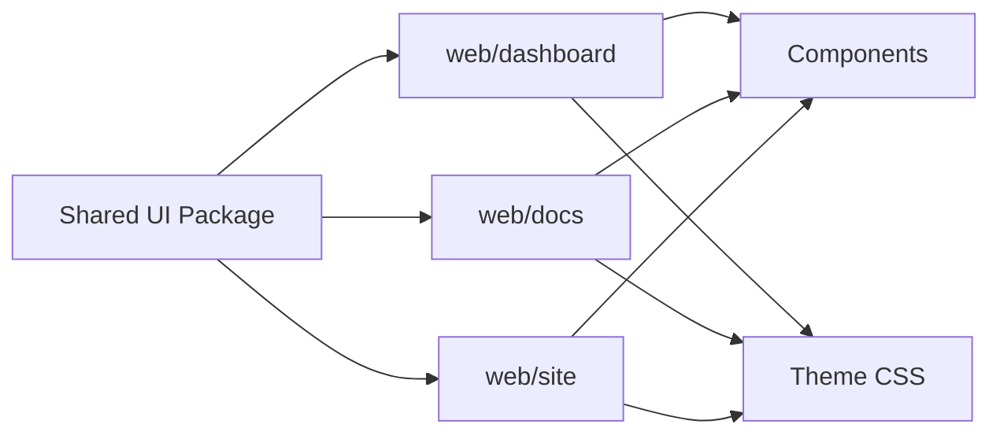
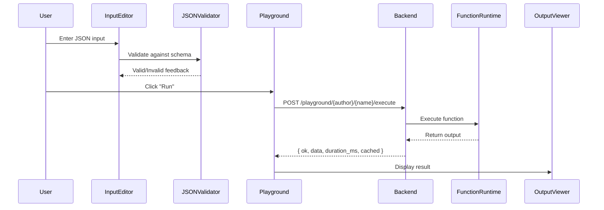

# Interactive Registry Function Docs - Architecture Plan

## Overview

Create a new React-based interactive documentation system for the Function Registry that provides auto-generated docs from function manifests, trust indicators, and an interactive playground. This will be **separate** from the general FunctionFly docs (which will be at `docs.functionfly.com`).

## Current State Analysis

### Existing Components

| Component | Technology | Purpose |
|-----------|------------|---------|
| [`web/dashboard`](web/dashboard) | Vite + React + TypeScript | Admin dashboard with comprehensive theme system |
| [`web/docs`](web/docs) | (empty structure) | Reserved for new docs |
| [`internal/api/handlers/registry/docs.go`](internal/api/handlers/registry/docs.go) | Go | Backend docs API |
| [`internal/api/handlers/registry/playground.go`](internal/api/handlers/registry/playground.go) | Go | Playground execution API |

### Existing Backend API Endpoints

```mermaid
graph LR
    A[React Frontend] --> B[Go Backend API]
    B --> C[PostgreSQL]
    
    B --> D[/docs - Function Index]
    B --> E[/docs/{author}/{name}/api - JSON Docs]
    B --> F[/docs/openapi.json - OpenAPI Spec]
    B --> G[/playground/{author}/{name}/execute - Execute]
    B --> H[/playground/{author}/{name}/share - Share]
```

| Endpoint | Method | Purpose |
|----------|--------|---------|
| `/docs` | GET | List all public functions |
| `/docs/{author}/{name}/api` | GET | JSON function docs with manifest, trust scores, examples |
| `/docs/openapi.json` | GET | OpenAPI 3.0 specification |
| `/playground/{author}/{name}/execute` | POST | Execute function with custom input |
| `/playground/{author}/{name}/share` | POST | Create shareable playground URL |

## Architecture

### Technology Stack

- **Framework**: Vite + React + TypeScript (consistent with web/dashboard)
- **Shared UI Package**: Create `@functionfly/ui` package for components & styles
- **Code Editor**: Monaco Editor (for JSON editing in playground)
- **Styling**: Shared CSS variables from theme
- **Routing**: React Router v6
- **State Management**: React Query (TanStack Query) + Zustand
- **Forms**: React Hook Form + Zod (validation)
- **HTTP Client**: Axios with React Query caching

### Project Structure

```
web/docs/                          # New Interactive Registry Docs
├── public/
├── src/
│   ├── api/                       # API clients
│   │   ├── functions.ts           # Function registry API
│   │   └── playground.ts          # Playground execution API
│   ├── components/
│   │   ├── layout/                # Layout components
│   │   │   ├── Header.tsx
│   │   │   ├── Sidebar.tsx
│   │   │   └── Footer.tsx
│   │   ├── function/              # Function-specific components
│   │   │   ├── FunctionCard.tsx
│   │   │   ├── FunctionHeader.tsx
│   │   │   ├── SchemaViewer.tsx
│   │   │   └── TrustIndicator.tsx
│   │   └── playground/            # Playground components
│   │       ├── Playground.tsx
│   │       ├── InputEditor.tsx
│   │       ├── OutputViewer.tsx
│   │       └── ShareButton.tsx
│   ├── hooks/
│   │   ├── useFunction.ts
│   │   ├── useFunctionList.ts
│   │   └── usePlayground.ts
│   ├── pages/
│   │   ├── Index.tsx              # Function listing
│   │   ├── Function.tsx           # Function docs detail
│   │   └── Category.tsx           # Category browsing
│   ├── styles/                    # Shared theme (symlink or copy)
│   │   ├── themes.css             # From web/dashboard
│   │   └── index.css
│   ├── types/
│   │   ├── function.ts
│   │   └── manifest.ts
│   ├── App.tsx
│   └── main.tsx
├── package.json
├── vite.config.ts
└── tsconfig.json
```

### Theme Sharing Strategy - Shared UI Package

**Recommended: Create `@functionfly/ui` npm package**



Create a shared package structure:

```
packages/
└── ui/
    ├── package.json
    ├── src/
    │   ├── components/
    │   │   ├── Button/
    │   │   ├── Card/
    │   │   ├── Input/
    │   │   ├── Modal/
    │   │   ├── TrustBadge/
    │   │   └── SchemaViewer/
    │   ├── styles/
    │   │   ├── themes.css
    │   │   ├── components.css
    │   │   └── animations.css
    │   ├── hooks/
    │   │   └── useTheme.ts
    │   └── index.ts
    └── tsconfig.json
```

Then import in both apps:
```bash
npm install @functionfly/ui
```

```typescript
// In any app
import { Button, TrustBadge, themes } from '@functionfly/ui';
import '@functionfly/ui/themes.css';
```

## Feature Implementation

### 1. Auto-Generated Documentation from Manifests

The backend already provides function manifest data. We need to render:

```typescript
// Types from API response
interface FunctionDocs {
  function: {
    author: string;
    name: string;
    title: string;
    description: string;
    category: string;
    version: string;
    trust_score: number;
  };
  manifest: {
    name: string;
    version: string;
    runtime: string;
    title?: string;
    description?: string;
    input?: IOType;
    output?: IOType;
    timeout_ms?: number;
    memory_mb?: number;
    capabilities?: string[];
    category?: string;
    tags?: string[];
  };
  trust_score: number;
  success_rate: number;
  avg_latency_ms: number;
  examples: ExecutionExample[];
  capabilities: string[];
}

interface IOType {
  type: string;
  example?: any;
  schema?: any;
  required?: boolean;
}
```

**Components needed:**
- [`SchemaViewer.tsx`](web/docs/src/components/function/SchemaViewer.tsx) - Renders JSON schema with syntax highlighting
- [`ExampleBlock.tsx`](web/docs/src/components/function/ExampleBlock.tsx) - Shows input/output examples

### 2. Trust Indicators

Display reliability metrics on each function page:

```mermaid
componentDiagram
    TrustIndicator --> ReliabilityScore
    TrustIndicator --> SuccessRate
    TrustIndicator --> AvgLatency
    TrustIndicator --> SecurityInfo
    
    ReliabilityScore : 0-100 score
    SuccessRate : percentage
    AvgLatency : milliseconds
    SecurityInfo : capabilities list
```

**Components needed:**
- [`TrustIndicator.tsx`](web/docs/src/components/function/TrustIndicator.tsx) - Shows trust score with visual indicator
- [`MetricsCard.tsx`](web/docs/src/components/function/MetricsCard.tsx) - Individual metric display

### 3. Example Executions

Pull real execution examples from the API and display:

```typescript
interface ExecutionExample {
  input: any;
  output: any;
  cached: boolean;
  duration_ms: number;
}
```

**Components needed:**
- [`ExecutionHistory.tsx`](web/docs/src/components/function/ExecutionHistory.tsx) - List of past executions
- [`ExampleRunner.tsx`](web/docs/src/components/function/ExampleRunner.tsx) - Run example with one click

### 4. Interactive Playground

The backend already provides `/playground/{author}/{name}/execute`. We build the UI:



**Components needed:**
- [`Playground.tsx`](web/docs/src/components/playground/Playground.tsx) - Main playground container
- [`InputEditor.tsx`](web/docs/src/components/playground/InputEditor.tsx) - Monaco Editor for JSON
- [`OutputViewer.tsx`](web/docs/src/components/playground/OutputViewer.tsx) - Formatted output display
- [`ShareButton.tsx`](web/docs/src/components/playground/ShareButton.tsx) - Share functionality
- [`ExecutionStatus.tsx`](web/docs/src/components/playground/ExecutionStatus.tsx) - Real-time status

#### Monaco Editor Integration

Use Monaco Editor for professional JSON editing:

```typescript
import Editor from '@monaco-editor/react';

<Editor
  height="300px"
  defaultLanguage="json"
  value={input}
  onChange={(value) => setInput(value)}
  options={{
    minimap: { enabled: false },
    lineNumbers: 'on',
    scrollBeyondLastLine: false,
    automaticLayout: true,
    tabSize: 2,
  }}
/>
```

#### Real-time Execution Status

Add WebSocket support for live execution updates:

```typescript
// Types for WebSocket messages
interface ExecutionStatus {
  status: 'queued' | 'running' | 'completed' | 'error';
  progress?: number;
  logs?: string[];
}

// WebSocket connection
const ws = new WebSocket(`wss://api.functionfly.com/execute/${author}/${name}`);
ws.onmessage = (event) => {
  const status: ExecutionStatus = JSON.parse(event.data);
  updateUI(status);
};
```

### 5. Responsive Design

The existing theme (`themes.css`) already supports dark/light modes. Ensure:
- Mobile-friendly navigation (hamburger menu)
- Collapsible sidebar on small screens
- Responsive code/output editors

## API Integration

### Environment Configuration

```typescript
// web/docs/src/config.ts
export const config = {
  apiBaseUrl: import.meta.env.VITE_API_BASE_URL || 'http://localhost:8080',
  docsPath: '/docs',
  playgroundPath: '/playground',
}
```

### API Client Functions

```typescript
// web/docs/src/api/functions.ts

// Get all public functions
export async function getFunctions(): Promise<FunctionDocSummary[]>

// Get function documentation (with version support)
export async function getFunctionDocs(
  author: string, 
  name: string, 
  version?: string
): Promise<FunctionDocs>

// Get function versions for version selector
export async function getFunctionVersions(
  author: string, 
  name: string
): Promise<FunctionVersion[]>

// Get OpenAPI spec
export async function getOpenAPISpec(): Promise<OpenAPISpec>
```

### React Query Caching Strategy

Use TanStack Query with stale-while-revalidate for optimal caching:

```typescript
import { QueryClient, QueryClientProvider } from '@tanstack/react-query';
import { ReactQueryDevtools } from '@tanstack/react-query-devtools';

const queryClient = new QueryClient({
  defaultOptions: {
    queries: {
      staleTime: 1000 * 60 * 5, // 5 minutes
      gcTime: 1000 * 60 * 30, // 30 minutes (formerly cacheTime)
      refetchOnWindowFocus: false,
      retry: 1,
    },
  },
});

// Usage in components
const { data, isLoading } = useQuery({
  queryKey: ['function', author, name, version],
  queryFn: () => getFunctionDocs(author, name, version),
});
```

#### Backend: Version Endpoint

Add to Go backend for version listing:

```go
// internal/api/handlers/registry/docs.go
func (h *DocumentationHandler) HandleFunctionVersions(w http.ResponseWriter, r *http.Request) {
    vars := mux.Vars(r)
    author := vars["author"]
    name := vars["name"]
    
    versions, err := h.repo.GetFunctionVersions(author, name)
    if err != nil {
        http.Error(w, err.Error(), http.StatusInternalServerError)
        return
    }
    
    json.NewEncoder(w).Encode(versions)
}
```

```typescript
// web/docs/src/api/playground.ts

// Execute function in playground
export async function executeFunction(
  author: string, 
  name: string, 
  input: any
): Promise<PlaygroundResponse>

// Create shareable playground link
export async function sharePlayground(
  author: string, 
  name: string, 
  input: any
): Promise<{ share_url: string }>
```

## Deployment Strategy

### Option: Separate Subdomain (Recommended)

```
functions.functionfly.com  →  web/docs (Vite SPA)
```

**Pros:**
- Clear separation from general docs
- Can have different branding if needed
- Independent scaling and caching

**Cons:**
- Requires CORS configuration for API calls

### Vercel Configuration

```json
// web/docs/vercel.json
{
  "rewrites": [
    { "source": "/(.*)", "destination": "/index.html" }
  ]
}
```

### CORS Configuration

The Go backend needs CORS headers for the new domain:

```go
// In Go backend - add to allowed origins
allowedOrigins := []string{
    "https://functionfly.com",
    "https://dashboard.functionfly.com", 
    "https://functions.functionfly.com",  // Add this
}
```

## Implementation Steps

### Phase 1: Project Setup

- [ ] Initialize Vite + React + TypeScript in `web/docs`
- [ ] Configure theme alias in `vite.config.ts`
- [ ] Set up React Router
- [ ] Add dark/light mode toggle (from dashboard theme)

### Phase 2: Function Listing

- [ ] Create API client for `/docs` endpoint
- [ ] Build function index page with category sidebar
- [ ] Implement function card grid
- [ ] Add search/filter functionality

### Phase 3: Function Detail Page

- [ ] Create API client for `/docs/{author}/{name}/api`
- [ ] Build function header with trust indicators
- [ ] Implement schema viewer for input/output
- [ ] Add example executions section
- [ ] **NEW: Add version selector** - Dropdown to browse function history
- [ ] **NEW: Create `@functionfly/ui` shared package** - Extract components from dashboard

### Phase 4: Interactive Playground

- [ ] Integrate `/playground/{author}/{name}/execute` API
- [ ] **NEW: Integrate Monaco Editor** for professional JSON editing
- [ ] Build JSON input editor with validation (against schema)
- [ ] Create output viewer with formatting
- [ ] Implement share functionality
- [ ] **NEW: Add WebSocket support** for real-time execution status
- [ ] **NEW: Implement React Query caching** for performance

### Phase 5: Polish

- [ ] Mobile responsive design
- [ ] Loading states and error handling
- [ ] SEO meta tags
- [ ] Analytics integration

### Phase 6: Shared UI Package (Optional but Recommended)

Create `@functionfly/ui` to share between all web apps:

- [ ] Extract theme CSS from `web/dashboard/src/styles/`
- [ ] Create reusable components:
  - Button, Card, Input, Modal
  - TrustBadge, SchemaViewer
  - CodeEditor (Monaco wrapper)
- [ ] Publish as internal npm package
- [ ] Update both dashboard and docs to use shared package

## Summary

| Item | Details |
|------|---------|
| **Location** | `web/docs` (new Vite + React app) |
| **Theme** | Shared via `@functionfly/ui` package |
| **Code Editor** | Monaco Editor for JSON editing |
| **Caching** | TanStack Query with stale-while-revalidate |
| **Real-time** | WebSocket support for execution status |
| **Versioning** | Function version selector |
| **Backend Integration** | Existing Go API (`/docs`, `/playground/*`) |
| **Key Features** | Auto-generated docs, trust indicators, interactive playground |
| **Deployment** | Separate subdomain (e.g., `functions.functionfly.com`) |
