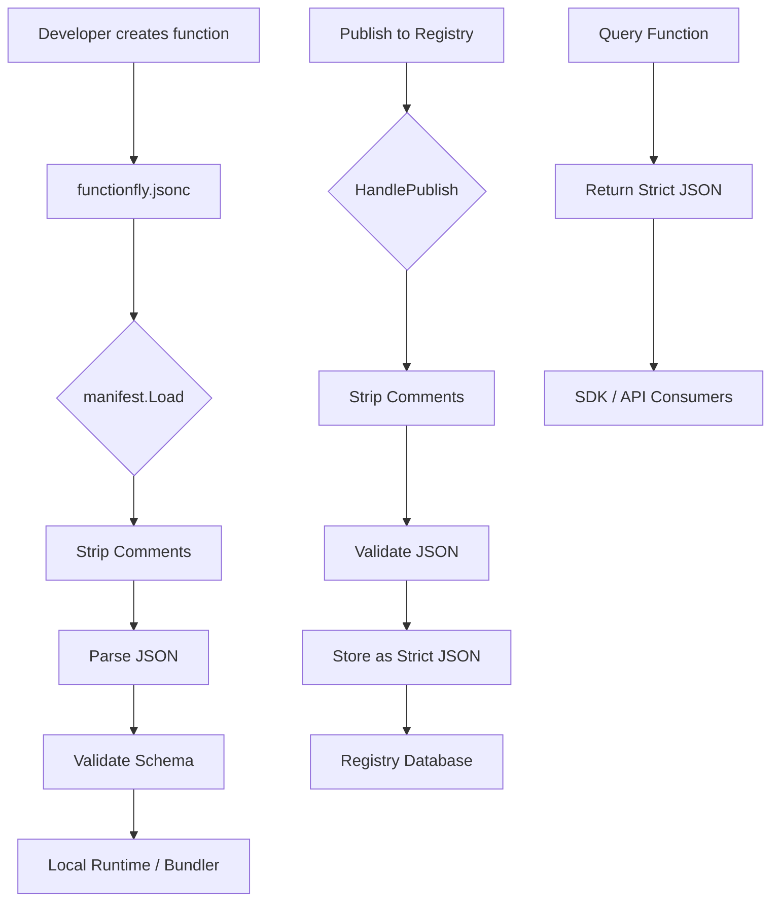

# JSONC Manifest Implementation Plan

## Overview

This document outlines the implementation plan for transitioning from strict JSON (`functionfly.json`) to JSONC (`functionfly.jsonc`) for the FunctionFly function manifest configuration.

**Recommendation**: Use JSONC for local development with a custom comment-stripping pre-processor, while storing canonical strict JSON in the registry.

---

## 1. Current State Analysis

### 1.1 Existing Components

| Component | File | Current Behavior |
|-----------|------|------------------|
| Manifest Loader | [`internal/manifest/manifest.go`](internal/manifest/manifest.go:1) | Uses `encoding/json` to parse `functionfly.json` |
| Local Runtime | [`internal/localruntime/runtime.go:208`](internal/localruntime/runtime.go:208) | Calls `manifest.Load()` |
| Bundler | [`internal/bundler/bundler.go:16`](internal/bundler/bundler.go:16) | Uses `manifest.Manifest` struct |
| Publish Handler | [`internal/api/handlers/registry/publish.go`](internal/api/handlers/registry/publish.go:1) | Receives manifest as JSON in request, stores directly |

### 1.2 Manifest Schema

The current [`Manifest`](internal/manifest/manifest.go:12) struct includes:
- `Name`, `Version`, `Runtime` (required)
- `Public`, `Deterministic`, `CacheTTL`, `TimeoutMS`, `MemoryMB` (optional with defaults)
- `Description`, `Dependencies`, `Env`

---

## 2. Implementation Approach

### 2.1 Chosen Solution: Custom Comment Stripper

**Rationale**:
- Minimal dependencies (no external JSONC libraries needed)
- Simple use case: only comment stripping required
- No full JSON5 features needed (trailing commas, unquoted keys)
- Easy to maintain and understand

### 2.2 File Naming Strategy

```
Local Development:  functionfly.jsonc    (human-readable, with comments)
Registry Storage:   (stored as strict JSON, comments stripped)
Backward Compat:    functionfly.json    (fallback for existing projects)
```

---

## 3. Implementation Tasks

### Phase 1: Core JSONC Support

#### Task 1.1: Create JSONC Utility Package
**Location**: `internal/manifest/jsonc.go` (new file)

```go
package manifest

import (
    "strings"
    "unicode"
)

// StripComments removes JSONC comments (// and /* */) from input
// Returns clean JSON string suitable for json.Unmarshal
func StripComments(input string) string {
    // Implementation details:
    // 1. Handle single-line comments (//)
    // 2. Handle multi-line comments (/* */)
    // 3. Preserve string content (don't strip // inside strings)
    // 4. Handle nested comments
    // Returns: clean JSON string
}
```

#### Task 1.2: Update Manifest Loader
**File**: [`internal/manifest/manifest.go`](internal/manifest/manifest.go:36)

Modify the [`Load()`](internal/manifest/manifest.go:37) function to:
1. Try loading `functionfly.jsonc` first
2. Fall back to `functionfly.json` if not found
3. Strip comments before JSON parsing

```go
// Load reads and parses the functionfly.jsonc file
func Load(path string) (*Manifest, error) {
    // Try .jsonc first, then .json
    // Strip comments if parsing .jsonc
    // Use standard json.Unmarshal
}
```

#### Task 1.3: Update Manifest Saver
**File**: [`internal/manifest/manifest.go`](internal/manifest/manifest.go:58)

The [`Save()`](internal/manifest/manifest.go:59) function should:
1. Write to `functionfly.jsonc` (not `.json`)
2. Include helpful comments explaining each field
3. Use formatted JSON output for readability

### Phase 2: Registry Pipeline Changes

#### Task 2.1: Update Publish Handler
**File**: [`internal/api/handlers/registry/publish.go`](internal/api/handlers/registry/publish.go:17)

The [`HandlePublish()`](internal/api/handlers/registry/publish.go:17) function should:
1. Accept both JSON and JSONC input (strip comments if needed)
2. Validate the cleaned JSON
3. Store **strict JSON** in the database (canonical format)

```go
// In HandlePublish:
func (h *Handler) HandlePublish(w http.ResponseWriter, r *http.Request) {
    // ... existing validation ...
    
    // Strip comments if present (support JSONC input)
    cleanedManifest := manifest.StripComments(string(req.Manifest))
    
    // Parse and validate
    var manifest functionregistry.FunctionManifest
    if err := json.Unmarshal([]byte(cleanedManifest), &manifest); err != nil {
        // handle error
    }
    
    // Store as STRICT JSON (canonical format)
    version := &storage.RegistryFunctionVersion{
        Manifest: []byte(cleanedManifest), // Already stripped of comments
        // ... rest of fields
    }
}
```

### Phase 3: Backward Compatibility

#### Task 3.1: Implement Fallback Strategy
**File**: [`internal/manifest/manifest.go`](internal/manifest/manifest.go:36)

```go
func Load(path string) (*Manifest, error) {
    // Priority order:
    // 1. functionfly.jsonc (new standard)
    // 2. functionfly.json (legacy support)
    
    // Try .jsonc first
    data, err := os.ReadFile(forceExtension(path, ".jsonc"))
    if err != nil {
        // Try .json as fallback
        data, err = os.ReadFile(forceExtension(path, ".json"))
    }
    // ... parse and return
}
```

### Phase 4: Migration & Documentation

#### Task 4.1: Create Sample functionfly.jsonc
**Location**: Project root or examples directory

```jsonc
{
  // Function name: lowercase, hyphens allowed
  "name": "hello-world",
  
  // Semantic version (x.y.z)
  "version": "1.0.0",
  
  // Runtime: node18, node20, python3.11, deno
  "runtime": "node20",
  
  // Make function publicly accessible
  "public": true,
  
  // Enable caching (seconds)
  "cache_ttl": 3600,
  
  // Execution timeout (milliseconds)
  "timeout_ms": 5000,
  
  // Memory allocation (MB)
  "memory_mb": 128,
  
  // Optional: mark as deterministic for caching
  "deterministic": false,
  
  // Optional: human-readable description
  "description": "A simple hello world function",
  
  // Optional: npm dependencies
  "dependencies": {
    "lodash": "^4.17.21"
  },
  
  // Optional: environment variables
  "env": {
    "NODE_ENV": "production"
  }
}
```

#### Task 4.2: Update Documentation
- README updates for new file extension
- CLI documentation
- Playground tutorials

---

## 4. Architecture Diagram



---

## 5. Testing Strategy

### Unit Tests
- [ ] Comment stripping handles single-line comments
- [ ] Comment stripping handles multi-line comments
- [ ] Comment stripping preserves string content
- [ ] Fallback from .jsonc to .json works
- [ ] Invalid JSONC returns appropriate errors

### Integration Tests
- [ ] Local runtime loads .jsonc manifest
- [ ] Publish pipeline accepts JSONC input
- [ ] Registry stores strict JSON only
- [ ] Backward compatibility with existing .json files

---

## 6. Migration Path

### For Existing Projects
1. **Automatic**: `manifest.Load()` falls back to `.json` if `.jsonc` not found
2. **Manual**: Rename `functionfly.json` → `functionfly.jsonc` (optional, for editing)
3. **New Projects**: Use `functionfly.jsonc` by default

### Registry Migration
- **No migration needed**: Registry already stores JSON
- **Optional**: Run one-time migration to ensure all stored manifests are comment-free

---

## 7. Summary Checklist

- [ ] **Task 1.1**: Create `StripComments()` utility
- [ ] **Task 1.2**: Update `manifest.Load()` for JSONC + fallback
- [ ] **Task 1.3**: Update `manifest.Save()` to write JSONC with comments
- [ ] **Task 2.1**: Update publish handler to strip comments before storage
- [ ] **Task 3.1**: Implement backward compatibility
- [ ] **Task 4.1**: Create sample `functionfly.jsonc`
- [ ] **Task 4.2**: Update documentation
- [ ] **Testing**: Write unit and integration tests

---

## 8. Benefits of This Approach

| Benefit | Description |
|---------|-------------|
| **Human-Readable** | Developers can add comments explaining fields |
| **Zero Dependencies** | No external JSONC library needed |
| **Canonical Storage** | Registry always stores clean JSON |
| **Backward Compatible** | Existing `.json` files still work |
| **VS Code Support** | JSONC syntax highlighting out of the box |
| **Simple Implementation** | Custom stripper is ~50 lines of code |

---

## 9. Risks & Mitigations

| Risk | Mitigation |
|------|------------|
| Comment stripping bugs | Comprehensive test coverage |
| Performance impact | Minimal (manifests are small files) |
| Edge cases in strings | Careful state-machine implementation |
| Developer confusion | Clear documentation and examples |
