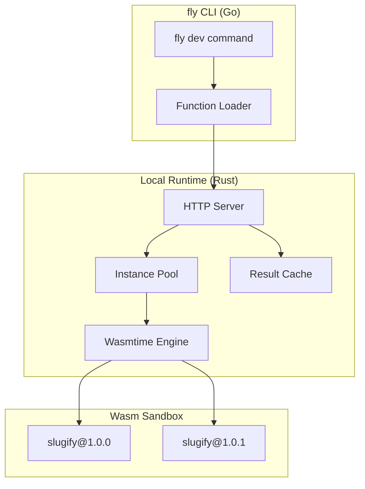
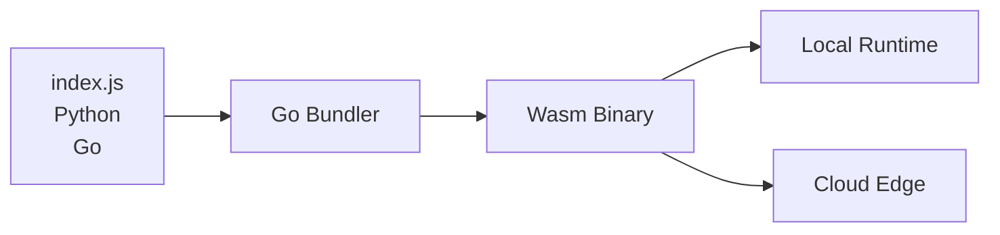

# Local Runtime Implementation Plan

## Overview

This plan details the implementation of the `fly dev` local development runtime, designed as a local equivalent of the production Wasm-based execution engine.

## Architecture Decision: Rust + Wasm

**Why Rust for the runtime engine:**

| Factor | Rust + Wasmtime | Go | Python |
|--------|-----------------|-----|--------|
| Cold start | **1-5ms** | 10-50ms | 50-200ms |
| Memory overhead | **~5MB/instance** | ~30MB | ~50MB |
| Isolation | **Wasm sandbox** | Goroutines | Process |
| Binary size | **~10MB** | ~50MB | ~100MB |
| Production parity | ✅ Same engine | Different | Different |

**Selected Stack:**

- Core runtime: **Rust** with **Wasmtime**
- CLI integration: Go (existing CLI) → spawns Rust runtime as sidecar
- Function bundling: Existing Go bundler → outputs Wasm

---

## 1. Component Architecture



---

## 2. Directory Structure

```
cmd/
└── fly/
    └── cmd/
        ├── dev.go          # Local dev command
        └── test.go         # Remote test command

runtimes/
├── local/                  # Local development runtime (Rust)
│   ├── Cargo.toml
│   ├── src/
│   │   ├── main.rs        # Entry point
│   │   ├── server.rs      # HTTP server
│   │   ├── pool.rs        # Instance pool
│   │   ├── wasm_engine.rs # Wasmtime wrapper
│   │   ├── cache.rs       # Result cache
│   │   └── sandbox.rs     # Isolated execution
│   └── wasi/              # WASI bindings
└── wasmtime/              # Shared Wasmtime config
```

---

## 3. Implementation Steps

### Step 1: Create Rust Local Runtime

Create `runtimes/local/Cargo.toml`:

```toml
[package]
name = "functionfly-local"
version = "0.1.0"
edition = "2021"

[dependencies]
wasmtime = "25.0"
wasmtime-wasi = "25.0"
tokio = { version = "1", features = ["full"] }
axum = "0.8"
serde = { version = "1", features = ["derive"] }
serde_json = "1"
tracing = "0.1"
tracing-subscriber = "0.3"
anyhow = "1"
clap = "4"
```

### Step 2: Wasm Engine Implementation

Create `runtimes/local/src/wasm_engine.rs`:

```rust
use wasmtime::*;
use wasmtime_wasi::WasiCtxBuilder;

pub struct WasmEngine {
    engine: Engine,
    config: Config,
}

impl WasmEngine {
    pub fn new() -> Result<Self> {
        let mut config = Config::new();
        config
            .consume_fuel(true)
            .epoch_interruption(true)
            .max_wasm_stack(512 * 1024); // 512KB stack
            
        let engine = Engine::new(&config)?;
        
        Ok(Self { engine, config })
    }
    
    pub fn create_instance(&self, wasm_bytes: &[u8], memory_limit: u64) -> Result<Instance> {
        let module = Module::new(&self.engine, wasm_bytes)?;
        
        // Create WASI context
        let wasi = WasiCtxBuilder::new()
            .memory_limit(memory_limit)
            .build();
            
        let mut store = Store::new(&self.engine, wasi);
        store.limiter(|_| Some(Box::new(MemoryLimiter::new(memory_limit)));
        
        // Instantiate module
        let instance = Instance::new(&mut store, &module, &[])?;
        
        Ok((store, instance))
    }
}
```

### Step 3: Instance Pool

Create `runtimes/local/src/pool.rs`:

```rust
use std::collections::HashMap;
use std::sync::{Arc, RwLock};
use wasmtime::Instance;

pub struct InstancePool {
    instances: Arc<RwLock<HashMap<String, Vec<PooledInstance>>>>,
    max_per_function: usize,
    idle_timeout_secs: u64,
}

struct PooledInstance {
    instance: Instance,
    created_at: std::time::Instant,
}

impl InstancePool {
    pub fn get(&self, function_key: &str) -> Option<Instance> {
        // Check for warm instance
        // Return pooled instance or None
    }
    
    pub fn return_instance(&self, function_key: String, instance: Instance) {
        // Return to pool for reuse
    }
    
    pub fn prune(&self) {
        // Remove idle instances
    }
}
```

### Step 4: HTTP Server

Create `runtimes/local/src/server.rs`:

```rust
use axum::{routing::*, Router};
use std::net::SocketAddr;

pub async fn run_server(port: u16) {
    let app = Router::new()
        .route("/", post(execute_function))
        .route("/health", get(health_check));
        
    let addr = SocketAddr::from(([127, 0, 0, 1], port));
    let listener = tokio::net::TcpListener::bind(addr).await.unwrap();
    
    axum::serve(listener, app).await.unwrap();
}

async fn execute_function(
    Json(payload): Json<ExecuteRequest>,
) -> Json<ExecuteResponse> {
    // Load from pool or create new instance
    // Execute Wasm
    // Return result
}
```

### Step 5: Go CLI Integration

Update `cmd/fly/cmd/dev.go`:

```go
type DevCommand struct {
    port  int
    watch bool
}

func (c *DevCommand) Run(ctx context.Context) error {
    // 1. Load manifest
    manifest, err := manifest.Load("functionfly.json")
    if err != nil {
        return fmt.Errorf("no functionfly.json found. run 'fly init' first")
    }
    
    // 2. Bundle function to Wasm
    bundle, err := bundler.BundleToWasm(manifest)
    if err != nil {
        return fmt.Errorf("bundling failed: %w", err)
    }
    
    // 3. Start Rust runtime as sidecar
    runtimePath := findRuntimeBinary()
    proc, err := startRuntime(runtimePath, bundle, c.port)
    if err != nil {
        return fmt.Errorf("failed to start runtime: %w", err)
    }
    
    // 4. Wait for ready
    waitForReady(c.port)
    
    // 5. Print startup message
    fmt.Printf("🚀 Local FunctionFly runtime started\n")
    fmt.Printf("   http://localhost:%d\n", c.port)
    fmt.Printf("\nPress Ctrl+C to stop\n")
    
    // 6. Wait for interrupt
    waitForInterrupt(proc)
    
    return nil
}
```

---

## 4. Function Bundling for Wasm

The existing Go bundler needs to compile to Wasm:



### JavaScript → Wasm

Use **QuickJS** compiled to Wasm for JS execution:

```go
func BundleToWasm(manifest *manifest.Manifest) ([]byte, error) {
    switch manifest.Runtime {
    case "node18", "node20":
        return bundleJS(manifest)
    case "python3.11":
        return bundlePython(manifest)  // Pyodide Wasm
    default:
        return bundleJS(manifest)
    }
}
```

### Supported Runtimes (Wasm)

| Runtime | Wasm Target | Status |
|---------|-------------|--------|
| JavaScript | QuickJS Wasm | Phase 1 |
| Python | Pyodide Wasm | Phase 2 |
| TypeScript | QuickJS + TS | Phase 2 |

---

## 5. Resource Limits

The manifest defines limits, enforced by runtime:

```json
{
  "name": "slugify",
  "runtime": "node18",
  "limits": {
    "memory_mb": 32,
    "timeout_ms": 100,
    "cpu_fuel": 1000000
  }
}
```

### Enforcement

| Limit | Method |
|-------|--------|
| Memory | Wasm linear memory cap |
| CPU | Fuel metering |
| Timeout | Host watchdog timer |
| Response | Output buffer cap |

---

## 6. Deterministic Caching

If `"deterministic": true` in manifest:

```rust
fn execute(&self, input: &str) -> Result<String> {
    // Check cache first
    let key = hash(input);
    if let Some(cached) = self.cache.get(&key) {
        return Ok(cached);
    }
    
    // Execute
    let result = self.run_wasm(input)?;
    
    // Cache result
    self.cache.set(key, result.clone());
    
    Ok(result)
}
```

---

## 7. CLI Commands Implementation

### fly dev

```
fly dev              # Default port 8787
fly dev --port 3000 # Custom port
fly dev --watch     # Auto-reload on file changes
```

### fly test

```
fly test                                    # Test local
fly test --remote                           # Test deployed
fly test --input="Hello World"             # Custom input
fly test --json                             # JSON output
```

---

## 8. API Endpoints

### Local Runtime Endpoints

| Method | Path | Description |
|--------|------|-------------|
| POST | / | Execute function |
| GET | /health | Health check |
| GET | /ready | Readiness check |

### Request/Response

```json
// Request
{
  "input": "Hello World",
  "context": {
    "request_id": "req_123",
    "timestamp": "2024-01-14T10:30:00Z"
  }
}

// Response
{
  "result": "hello-world",
  "exec_time_ms": 5,
  "cache_hit": false,
  "instance_id": "i_abc123"
}
```

---

## 9. Implementation Priority

### Phase 1: MVP (Week 1-2)

- [ ] Rust HTTP server with Wasmtime
- [ ] Simple JS execution (passthrough)
- [ ] CLI integration
- [ ] Basic resource limits

### Phase 2: Features (Week 3-4)

- [ ] Instance pooling
- [ ] Deterministic caching
- [ ] File watching
- [ ] Proper JS execution

### Phase 3: Polish (Week 5-6)

- [ ] Python support (Pyodide)
- [ ] Full WASI support
- [ ] Metrics collection
- [ ] Error handling

---

## 10. Testing Strategy

```bash
# Test locally
cd runtimes/local
cargo test

# Integration test
fly init myfunc
fly dev &
sleep 2
curl -X POST http://localhost:8787 -d "Hello World"
# Should return: {"result": "hello-world", ...}

# Cleanup
pkill -f functionfly-local
```

---

## 11. Summary

| Component | Technology | Notes |
|-----------|------------|-------|
| Runtime engine | Rust + Wasmtime | Same as production |
| HTTP layer | Axum (Rust) | Async, high perf |
| Instance pool | In-memory | Warm reuse |
| CLI spawn | Go sidecar | Mirrors production |
| Function input | Bundled Wasm | Parity with cloud |
