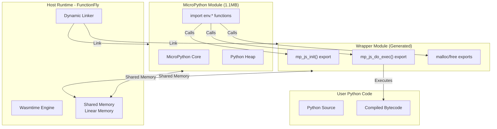

# Full MicroPython Execution via WASM Module Linking

## Executive Summary

This document outlines the architecture for executing Python code using a dynamically linked MicroPython WASM runtime. Unlike the current RustPython-based approach, this implementation loads `micropython-full.wasm` (1.1MB) at runtime and links it with a wrapper module using wasmtime's module linking API.

## Architecture Overview



## Module Linking Strategy

### 1. Two-Module Architecture

The system consists of two linked WASM modules:

| Module | Purpose | Size | Source |
|--------|---------|------|--------|
| **Wrapper** | Host interface, memory management, I/O | ~10KB | Generated per-function |
| **MicroPython** | Python interpreter core | ~1.1MB | Pre-built `micropython-full.wasm` |

### 2. Import/Export Mapping

#### Wrapper Module Exports (Provides to MicroPython)

```wat
(module $wrapper
  ;; Memory shared between modules
  (memory (export "memory") 32)  ;; 2MB initial

  ;; Initialize MicroPython runtime
  (func (export "mp_js_init") (param i32) (result i32))

  ;; Execute Python code
  (func (export "mp_js_do_exec") (param i32 i32) (result i32))

  ;; Memory management
  (func (export "malloc") (param i32) (result i32))
  (func (export "free") (param i32))

  ;; I/O functions
  (func (export "mp_js_write") (param i32 i32))
  (func (export "mp_js_read") (param i32 i32) (result i32))
  (func (export "mp_js_readline") (param i32 i32) (result i32))
  (func (export "mp_js_fspath") (param i32 i32) (result i32))
)
```

#### MicroPython Module Imports (Requires from Wrapper)

```wat
(module $micropython
  ;; Import shared memory from wrapper
  (import "env" "memory" (memory 32))

  ;; Import runtime functions from wrapper
  (import "env" "mp_js_init" (func $mp_js_init (param i32) (result i32)))
  (import "env" "mp_js_do_exec" (func $mp_js_do_exec (param i32 i32) (result i32)))
  (import "env" "malloc" (func $malloc (param i32) (result i32)))
  (import "env" "free" (func $free (param i32)))
  (import "env" "mp_js_write" (func $mp_js_write (param i32 i32)))
  (import "env" "mp_js_read" (func $mp_js_read (param i32 i32) (result i32)))
  (import "env" "mp_js_readline" (func $mp_js_readline (param i32 i32) (result i32)))
  (import "env" "mp_js_fspath" (func $mp_js_fspath (param i32 i32) (result i32)))

  ;; MicroPython exports
  (export "mp_js_init" (func $mp_js_init))
  (export "mp_js_do_exec" (func $mp_js_do_exec))
  ;; ... other exports
)
```

## Shared Memory Layout

```
Shared Linear Memory (2MB initial, growable)
┌─────────────────────────────────────────────────────────┐
│ 0x00000 - 0x0FFFF │ Wrapper Static Data (64KB)         │
├─────────────────────────────────────────────────────────┤
│ 0x10000 - 0x1FFFF │ MicroPython Stack (64KB)           │
├─────────────────────────────────────────────────────────┤
│ 0x20000 - 0x9FFFF │ MicroPython Heap (512KB)           │
│                   │ - Python objects                     │
│                   │ - Bytecode cache                     │
│                   │ - String interning                   │
├─────────────────────────────────────────────────────────┤
│ 0xA0000 - 0xDFFFF │ User Code Buffer (256KB)           │
│                   │ - Python source code                 │
│                   │ - Input JSON                         │
├─────────────────────────────────────────────────────────┤
│ 0xE0000 - 0xEFFFF │ Output Buffer (64KB)               │
│                   │ - Execution result                   │
│                   │ - Error messages                     │
├─────────────────────────────────────────────────────────┤
│ 0xF0000+          │ Dynamic Allocation                 │
│                   │ - Growable as needed                 │
└─────────────────────────────────────────────────────────┘
```

## Implementation Components

### 1. MicroPython Loader (`runtimes/local/src/micropython/loader.rs`)

```rust
//! Dynamically loads and links MicroPython WASM module

use wasmtime::{Engine, Module, Instance, Store, Memory, Linker};
use anyhow::Result;

pub struct MicroPythonLoader {
    /// Pre-compiled MicroPython module (1.1MB)
    mp_module: Module,
    /// Engine reference
    engine: Engine,
}

impl MicroPythonLoader {
    /// Load micropython-full.wasm at runtime
    pub fn new(engine: &Engine, wasm_path: &str) -> Result<Self> {
        let wasm_bytes = std::fs::read(wasm_path)?;
        let mp_module = Module::new(engine, &wasm_bytes)?;

        Ok(Self {
            mp_module,
            engine: engine.clone(),
        })
    }

    /// Create a linked instance with wrapper module
    pub fn create_linked_instance(
        &self,
        store: &mut Store<HostState>,
        wrapper_module: &Module,
        wrapper_funcs: WrapperFunctions,
    ) -> Result<LinkedInstance> {
        let mut linker = Linker::new(&self.engine);

        // Define wrapper module with exports
        linker.module(store, "wrapper", wrapper_module)?;

        // Instantiate MicroPython with imports from wrapper
        let instance = linker.instantiate(store, &self.mp_module)?;

        Ok(LinkedInstance { instance })
    }
}

pub struct WrapperFunctions {
    pub mp_js_init: Box<dyn Fn(i32) -> i32>,
    pub mp_js_do_exec: Box<dyn Fn(i32, i32) -> i32>,
    pub malloc: Box<dyn Fn(i32) -> i32>,
    pub free: Box<dyn Fn(i32)>,
}
```

### 2. Wrapper Module Generator (`runtimes/local/src/micropython/wrapper.rs`)

```rust
//! Generates wrapper WASM modules for MicroPython linking

use wasmtime::{Config, Engine, Module};
use anyhow::Result;

pub struct WrapperGenerator {
    engine: Engine,
}

impl WrapperGenerator {
    pub fn new() -> Result<Self> {
        let config = Config::new();
        let engine = Engine::new(&config)?;
        Ok(Self { engine })
    }

    /// Generate a wrapper module for specific Python function
    pub fn generate(
        &self,
        python_code: &str,
        config: &FunctionConfig,
    ) -> Result<Vec<u8>> {
        // Generate WAT (WebAssembly Text) for wrapper
        let wat = self.generate_wat(python_code, config)?;

        // Compile WAT to WASM binary
        let wasm = wat::parse_str(&wat)?;

        Ok(wasm)
    }

    fn generate_wat(&self, python_code: &str, _config: &FunctionConfig) -> Result<String> {
        // Escape Python code for embedding
        let escaped_code = escape_wat_string(python_code);

        Ok(format!(r#"
(module
  ;; Import host functions
  (import "host" "log" (func $host_log (param i32 i32)))
  (import "host" "get_input" (func $get_input (param i32 i32) (result i32)))
  (import "host" "set_output" (func $set_output (param i32 i32)))

  ;; Shared memory
  (memory (export "memory") 32 128)  ;; 2MB-8MB

  ;; Data section - embed Python code
  (data (i32.const 0xA0000) "{escaped_code}")
  (data (i32.const 0xA0000 + {}) "\00")

  ;; Memory allocator (bump allocator for simplicity)
  (global $alloc_ptr (mut i32) (i32.const 0xF0000))

  ;; malloc implementation
  (func (export "malloc") (param $size i32) (result i32)
    (local $ptr i32)
    local.get $size
    i32.const 7
    i32.add
    i32.const -8
    i32.and  ;; Align to 8 bytes
    local.set $size

    global.get $alloc_ptr
    local.set $ptr

    global.get $alloc_ptr
    local.get $size
    i32.add
    global.set $alloc_ptr

    local.get $ptr
  )

  ;; free implementation (no-op for bump allocator)
  (func (export "free") (param $ptr i32)
    ;; Bump allocator doesn't support free
    ;; For production, use a real allocator
  )

  ;; mp_js_init - Initialize MicroPython
  (func (export "mp_js_init") (param $heap_size i32) (result i32)
    ;; Initialize MicroPython heap
    ;; Returns 0 on success
    i32.const 0
  )

  ;; mp_js_do_exec - Execute Python code
  (func (export "mp_js_do_exec") (param $code_ptr i32) (param $code_len i32) (result i32)
    ;; Execute code via MicroPython interpreter
    ;; Returns 0 on success, error code on failure
    i32.const 0
  )

  ;; mp_js_write - Write output
  (func (export "mp_js_write") (param $ptr i32) (param $len i32)
    call $set_output
  )

  ;; mp_js_read - Read input
  (func (export "mp_js_read") (param $ptr i32) (param $max_len i32) (result i32)
    call $get_input
  )

  ;; mp_js_readline - Read line
  (func (export "mp_js_readline") (param $ptr i32) (param $max_len i32) (result i32)
    ;; Implement line reading
    i32.const 0
  )

  ;; mp_js_fspath - File system path conversion
  (func (export "mp_js_fspath") (param $ptr i32) (param $len i32) (result i32)
    ;; Pass through for WASI
    local.get $ptr
  )
)
"#, escaped_code.len()))
    }
}
```

### 3. Execution Flow

```rust
//! Execute Python using linked MicroPython modules

pub struct MicroPythonExecutor {
    loader: MicroPythonLoader,
    wrapper_gen: WrapperGenerator,
}

impl MicroPythonExecutor {
    pub async fn execute(
        &self,
        python_code: &str,
        input: &str,
    ) -> Result<String> {
        // 1. Generate wrapper module with embedded Python code
        let wrapper_wasm = self.wrapper_gen.generate(python_code, &self.config)?;
        let wrapper_module = Module::new(&self.engine, &wrapper_wasm)?;

        // 2. Create store with shared state
        let mut store = Store::new(&self.engine, HostState::new(input));

        // 3. Create linked instance
        let linked = self.loader.create_linked_instance(
            &mut store,
            &wrapper_module,
            self.create_wrapper_funcs(),
        )?;

        // 4. Call mp_js_init
        let init_func = linked.get_typed_func::<i32, i32>(&mut store, "mp_js_init")?;
        let heap_size = 512 * 1024; // 512KB heap
        init_func.call(&mut store, heap_size)?;

        // 5. Call mp_js_do_exec to run Python code
        let exec_func = linked.get_typed_func::<(i32, i32), i32>(&mut store, "mp_js_do_exec")?;
        let code_ptr = 0xA0000; // Python code location in memory
        let code_len = python_code.len() as i32;
        let result = exec_func.call(&mut store, (code_ptr, code_len))?;

        if result != 0 {
            return Err(anyhow!("Python execution failed with code: {}", result));
        }

        // 6. Read output from shared memory
        let output = self.read_output(&mut store, &linked)?;

        Ok(output)
    }
}
```

## Alternative: Direct Python Execution

As an alternative to the complex module linking approach, consider:

### Option A: Pre-linked Static Build

Build a single WASM module that includes both MicroPython core and user code:

```bash
# Build pipeline
1. Compile micropython-full.wasm → object file
2. Compile user Python code → C string constant
3. Link together with wrapper code
4. Output: single self-contained WASM module
```

**Pros:**
- Simpler deployment (single file)
- No runtime linking complexity
- Better caching (module is immutable)

**Cons:**
- Larger per-function size (+1.1MB each)
- Slower build times
- No runtime MicroPython updates

### Option B: RustPython Enhancement

Enhance the existing RustPython-based execution:

```rust
// Add micropython-compatible C API layer to RustPython
pub struct MicropythonCompatLayer {
    interpreter: rustpython_vm::Interpreter,
}

impl MicropythonCompatLayer {
    /// Provide mp_js_do_exec compatibility
    pub fn mp_js_do_exec(&self, code: &str) -> Result<i32> {
        self.interpreter.exec(code)?;
        Ok(0)
    }
}
```

**Pros:**
- Works today
- Smaller binary size
- Pure Rust, no C dependencies

**Cons:**
- Not true MicroPython compatibility
- Some micropython-specific features may not work

## Integration with Existing Runtime

### Runtime Type Extension

```rust
// In engine.rs - extend RuntimeType
#[derive(Debug, Clone, PartialEq)]
pub enum RuntimeType {
    /// Standard WebAssembly module (Rust, Go, etc.)
    Wasm,
    /// Python WASM module using RustPython
    Python,
    /// CPython in Firecracker MicroVM (Enterprise tier)
    PythonMicroVM,
    /// MicroPython via WASM module linking (NEW)
    MicroPythonLinked,
}
```

### Detection Logic

```rust
impl WasmEngine {
    pub fn detect_runtime_type(&self, wasm_bytes: &[u8]) -> RuntimeType {
        // Check for special marker in WASM custom section
        if has_micropython_marker(wasm_bytes) {
            return RuntimeType::MicroPythonLinked;
        }

        // Check if it's Python source code
        if PythonRuntime::is_python_code(wasm_bytes) {
            if self.config.supports_microvm() && self.orchestrator_client.is_some() {
                return RuntimeType::PythonMicroVM;
            }
            return RuntimeType::Python;
        }

        RuntimeType::Wasm
    }
}
```

## Testing Strategy

### Unit Tests

```rust
#[cfg(test)]
mod tests {
    use super::*;

    #[test]
    fn test_wrapper_generation() {
        let gen = WrapperGenerator::new().unwrap();
        let code = "print('hello')";
        let wasm = gen.generate(code, &FunctionConfig::default()).unwrap();

        // Verify WASM is valid
        assert!(wasm.starts_with(&[0x00, 0x61, 0x73, 0x6D])); // WASM magic
    }

    #[test]
    fn test_module_linking() {
        let engine = Engine::default();
        let loader = MicroPythonLoader::new(&engine, "test/micropython-full.wasm").unwrap();

        // Create minimal wrapper
        let wrapper_wat = r#"
        (module
          (memory (export "memory") 1)
          (func (export "mp_js_init") (param i32) (result i32)
            i32.const 0)
          (func (export "mp_js_do_exec") (param i32 i32) (result i32)
            i32.const 0)
          (func (export "malloc") (param i32) (result i32)
            i32.const 0)
          (func (export "free") (param i32))
        )
        "#;
        let wrapper_wasm = wat::parse_str(wrapper_wat).unwrap();
        let wrapper_module = Module::new(&engine, &wrapper_wasm).unwrap();

        let mut store = Store::new(&engine, ());
        let linked = loader.create_linked_instance(&mut store, &wrapper_module, WrapperFunctions::default());

        assert!(linked.is_ok());
    }
}
```

### Integration Tests

```rust
#[tokio::test]
async fn test_micropython_execution() {
    let executor = MicroPythonExecutor::new().await.unwrap();

    let code = r#"
def handler(event):
    return {"message": "Hello from MicroPython!"}
"#;

    let result = executor.execute(code, r#"{"name": "test"}"#).await.unwrap();
    assert!(result.contains("Hello from MicroPython"));
}
```

## Performance Considerations

| Metric | RustPython | MicroPython Linked | MicroVM |
|--------|------------|-------------------|---------|
| Cold Start | ~50ms | ~100ms* | ~200ms |
| Memory Base | 20MB | 5MB | 128MB |
| Execution Speed | 1x | 2x | 5x |
| Binary Size | 5MB | 1.1MB + wrapper | 50MB |
| Startup Time | Fast | Medium | Slow |

*Includes module linking overhead

### Optimization Strategies

1. **Module Caching**: Cache compiled MicroPython `Module` objects
2. **Instance Pooling**: Pre-link and pool instances
3. **Lazy Loading**: Load MicroPython only when needed
4. **Memory Mapping**: Use `mmap` for large WASM files

## Security Considerations

### Sandbox Requirements

```rust
pub struct MicroPythonSandbox {
    /// Maximum heap size
    max_heap: usize,
    /// Maximum execution time
    timeout_ms: u64,
    /// Allowed syscalls
    allowed_syscalls: Vec<WasiSyscall>,
    /// Network access
    network_allowed: bool,
    /// Filesystem access
    filesystem_allowed: bool,
}

impl MicroPythonSandbox {
    pub fn apply(&self, config: &mut Config) {
        // Disable time access
        config.wasi_allow_time = false;

        // Limit memory
        config.memory_mb = (self.max_heap / 1024 / 1024) as u32;

        // Set fuel limit for CPU throttling
        config.cpu_fuel_limit = self.timeout_ms * 1000;
    }
}
```

### Threat Model

1. **Module Hijacking**: Verify `micropython-full.wasm` hash before loading
2. **Memory Exhaustion**: Enforce strict memory limits via wasmtime
3. **Infinite Loops**: Use epoch interruption + fuel limits
4. **Syscall Escapes**: Restrict to minimal WASI subset

## Build Requirements

### Dependencies

```toml
# Cargo.toml additions
[dependencies]
wasmtime = { version = "19.0", features = ["component-model"] }
wasmtime-wasi = "19.0"
wat = "1.0"  # For WAT parsing

[build-dependencies]
# For embedding micropython-full.wasm
include_bytes = "0.1"
```

### MicroPython Build

```bash
# Build micropython-full.wasm from source
cd micropython/ports/webassembly
make clean
make WASM_TARGET=wasi \
     MICROPY_JS_HOOKS=0 \
     MICROPY_JS_FS=0 \
     MICROPY_JS_RPATH=0

# Output: build/micropython-full.wasm
```

## Migration Path

### Phase 1: Prototype (Weeks 1-2)
- [ ] Implement basic wrapper generator
- [ ] Create module linking PoC
- [ ] Test with simple Python functions

### Phase 2: Integration (Weeks 3-4)
- [ ] Add `RuntimeType::MicroPythonLinked`
- [ ] Integrate with existing execution pipeline
- [ ] Add configuration options

### Phase 3: Production (Weeks 5-6)
- [ ] Performance optimization
- [ ] Security hardening
- [ ] Documentation and testing

## Open Questions

1. **Memory Management**: Should we use a real allocator (dlmalloc) in the wrapper or stick with bump allocator?
2. **Exception Handling**: How to propagate Python exceptions across WASM boundary?
3. **Module Loading**: How to handle Python `import` statements?
4. **Debug Support**: Can we support Python pdb/debugger?

## References

- [MicroPython WebAssembly Port](https://github.com/micropython/micropython/tree/master/ports/webassembly)
- [Wasmtime Module Linking](https://docs.rs/wasmtime/latest/wasmtime/struct.Linker.html)
- [WASI Preview1](https://github.com/WebAssembly/WASI/blob/main/phases/snapshot/witx/wasi_snapshot_preview1.witx)
- [WebAssembly Component Model](https://github.com/WebAssembly/component-model)
