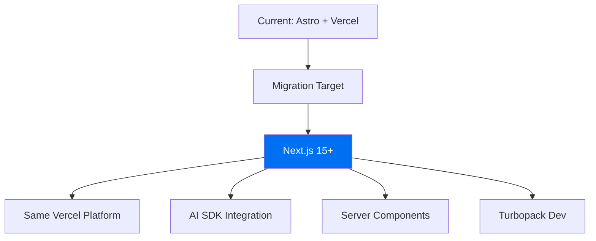
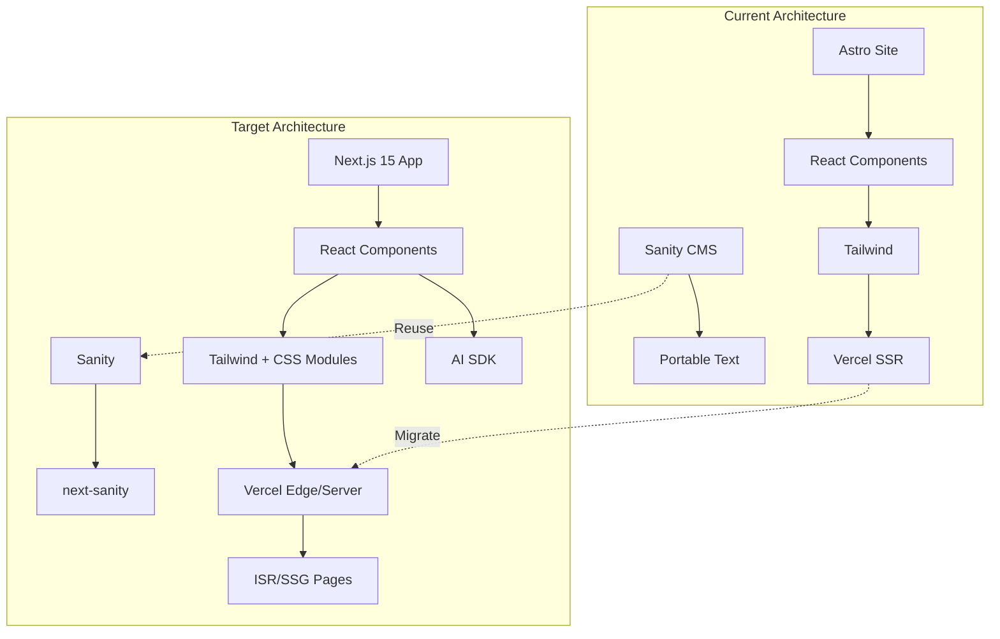

# Migration Path from Astro to Top 2026 Tech

## Executive Summary

This document outlines the best migration path from Astro to modern 2026 frameworks, evaluated against your requirements: **performance, developer experience, AI/edge-readiness, and full-stack capabilities**.

---

## Current State Analysis

| Aspect | Current |
|--------|---------|
| Framework | Astro 5.x |
| UI Library | React |
| Styling | Tailwind CSS |
| CMS | Sanity |
| Deployment | Vercel Serverless |
| Pages | ~15 (blog, docs, pricing, tools, case-studies) |
| Features | SSR, MDX, Sitemap, SEO |

---

## Top 2026 Framework Comparison

### 1. Next.js 15+ (App Router) - **RECOMMENDED**

| Criteria | Rating | Notes |
|----------|--------|-------|
| Performance | ⭐⭐⭐⭐⭐ | Server Components, React Compiler |
| Developer Experience | ⭐⭐⭐⭐⭐ | Hot reload, TypeScript-first, AI SDK |
| AI-Ready | ⭐⭐⭐⭐⭐ | Vercel AI SDK, native LLM integrations |
| Full-Stack | ⭐⭐⭐⭐⭐ | API Routes, Server Actions, Database |
| Edge-Ready | ⭐⭐⭐⭐⭐ | Edge Runtime, Vercel Edge Network |

**Strengths:**
- Largest ecosystem (20k+ packages)
- Vercel-native (you already deploy there)
- AI SDK is industry-leading in 2026
- Server Components = Astro-like performance
- Turbopack for blazing fast dev

### 2. SvelteKit

| Criteria | Rating | Notes |
|----------|--------|-------|
| Performance | ⭐⭐⭐⭐⭐ | Smallest bundles, best Lighthouse |
| Developer Experience | ⭐⭐⭐⭐⭐ | Simplest syntax, great DX |
| AI-Ready | ⭐⭐⭐⭐ | Community adapters exist |
| Full-Stack | ⭐⭐⭐⭐ | Form actions, hooks |
| Edge-Ready | ⭐⭐⭐⭐⭐ | Cloudflare, Vercel, Netlify adapters |

**Strengths:**
- Best raw performance
- Simpler than React for new teams
- Runes = modern reactivity

### 3. Remix

| Criteria | Rating | Notes |
|----------|--------|-------|
| Performance | ⭐⭐⭐⭐ | Solid SSR |
| Developer Experience | ⭐⭐⭐⭐⭐ | Loaders/actions pattern |
| AI-Ready | ⭐⭐⭐ | Requires more setup |
| Full-Stack | ⭐⭐⭐⭐⭐ | Best data loading pattern |
| Edge-Ready | ⭐⭐⭐⭐ | Cloudflare Workers, Vercel |

**Strengths:**
- Best for complex data requirements
- Progressive enhancement
- Great nested routing

---

## Recommendation: Next.js 15+ with AI SDK

### Why Next.js 15+?



1. **Same Platform** - Already on Vercel, zero infrastructure changes
2. **AI SDK** - Industry-leading for AI features in 2026
3. **Server Components** - Match Astro's performance characteristics
4. **Ecosystem** - Largest, most packages, best hiring pool
5. **Turbopack** - 10x faster dev server than Webpack

---

## Migration Architecture



---

## Migration Strategy

### Phase 1: Preparation
- [ ] Audit all Astro components
- [ ] Map Sanity schema to new project
- [ ] Create Next.js 15 skeleton
- [ ] Set up Sanity client in Next.js

### Phase 2: Core Migration
- [ ] Migrate layouts and routing
- [ ] Port React components (should be 90% compatible)
- [ ] Set up MDX with @next/mdx or next-mdx-remote
- [ ] Configure Tailwind with Next.js

### Phase 3: Advanced Features
- [ ] Implement AI SDK for any AI features
- [ ] Add Server Actions for forms
- [ ] Set up ISR/SSG for blog/docs
- [ ] Migrate API routes to Route Handlers

### Phase 4: SEO & Performance
- [ ] Implement next-sitemap
- [ ] Add metadata API for SEO
- [ ] Set up Analytics
- [ ] Configure Edge caching

### Phase 5: Deployment
- [ ] Deploy to Vercel (same platform!)
- [ ] Set up preview deployments
- [ ] Configure environment variables
- [ ] Test and validate

---

## Component Mapping

| Astro Component | Next.js Equivalent |
|-----------------|-------------------|
| `pages/blog/[slug].astro` | `app/blog/[slug]/page.tsx` |
| `layouts/Layout.astro` | `app/layout.tsx` |
| `SEOHead.astro` | `metadata` API |
| `PortableText.astro` | `@portabletext/react` |
| API: `pages/api/*.ts` | Route Handlers: `app/api/*/route.ts` |

---

## Code Comparison

### Before (Astro)
```astro
---
import { getPost } from '@/lib/sanity';
const { slug } = Astro.params;
const post = await getPost(slug);
---
<Layout title={post.title}>
  <h1>{post.title}</h1>
  <PortableText content={post.body} />
</Layout>
```

### After (Next.js 15)
```tsx
// app/blog/[slug]/page.tsx
import { getPost } from '@/lib/sanity';
import { Metadata } from 'next';

export async function generateMetadata({ params }): Promise<Metadata> {
  const post = await getPost(params.slug);
  return { title: post.title };
}

export default async function BlogPost({ params }) {
  const post = await getPost(params.slug);
  return (
    <article>
      <h1>{post.title}</h1>
      <PortableText value={post.body} />
    </article>
  );
}
```

---

## Timeline Estimate

| Phase | Effort | Notes |
|-------|--------|-------|
| Preparation | 1-2 days | Audit, setup |
| Core Migration | 3-5 days | Main pages |
| Advanced Features | 2-3 days | AI, API |
| SEO & Performance | 1-2 days | Sitemap, metadata |
| Deployment | 1 day | Vercel setup |

**Total: ~8-13 days**

---

## Risk Mitigation

| Risk | Mitigation |
|------|------------|
| Component incompatibilities | React components are 90% reusable |
| CMS data changes | Use same Sanity client |
| SEO drop | Maintain exact URL structure |
| Performance regression | Use Server Components, ISR |
| Learning curve | Team familiar with React |

---

## Alternative: Stay on Astro

If your team is happy with Astro, consider **upgrading to latest Astro 5.x** which includes:
- Content Layer API (improved from Sanity)
- Server Islands (hybrid rendering)
- Astro AI (new in 2026)
- Better React Server Components support

This would require minimal changes while gaining new features.

---

## Decision Required

Please confirm which path you prefer:

1. **Next.js 15+** - Best for AI, ecosystem, full-stack
2. **SvelteKit** - Best for raw performance, simplicity
3. **Remix** - Best for data-heavy applications
4. **Stay with Astro 5.x** - Upgrade in-place

Once confirmed, I can create detailed implementation steps for Code mode.
