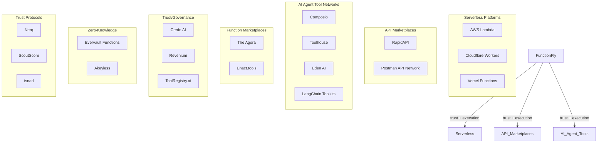
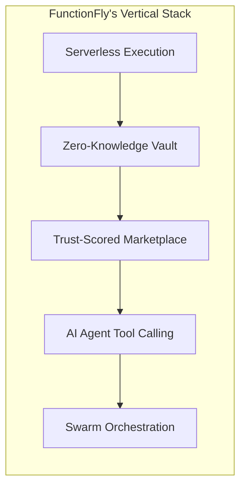
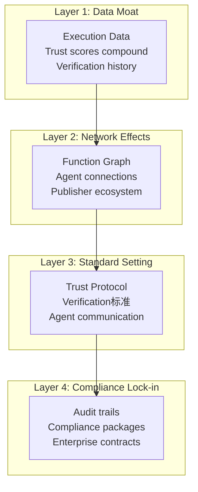
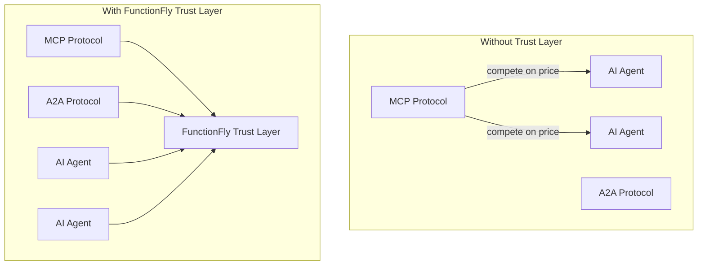
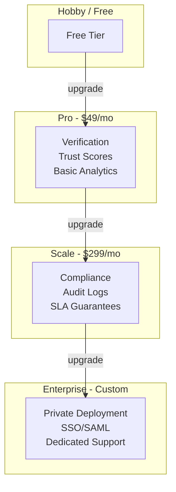

# FunctionFly — Moat Competitive Analysis

**Date**: 2026-03-21  
**Status**: Strategic Analysis Complete  
**Audience**: Leadership, Product, Marketing

---

## Executive Summary

FunctionFly's competitive moat is **not** its serverless infrastructure — that is a commodity. The durable defensibility lies in being **the trust infrastructure layer for AI agents**, combining:

- **Zero-knowledge vault** (client-side encryption, server never sees secrets)
- **Trust-scored function marketplace** with verification
- **AI agent-native tool discovery and execution**
- **Multi-agent swarm orchestration**

No competitor combines all four. This document analyzes the competitive landscape, identifies strategic gaps, and defines how to build and reinforce the moat.

---

## Section 1: FunctionFly Core Offerings

| Capability | Description |
|------------|-------------|
| **Serverless Platform** | Multi-language functions (Go, Python, Node.js), edge execution, auto-scaling, pay-per-use |
| **Zero-Knowledge Vault** | Client-side encryption — server never sees plaintext secrets |
| **Function Registry** | Trust-scored function marketplace with verification |
| **Flywheel Network** | Community for verified solutions, reputation, challenges (in development) |
| **AI Agent Integration** | Agents can discover/execute functions as tools with trust scoring, policy enforcement, swarm orchestration |

---

## Section 2: Competitive Landscape

### 2.1 Competitor Map

### 2.2 Competitor Deep-Dive

| Competitor | What They Do | FunctionFly Comparison |
|------------|--------------|------------------------|
| **Evervault Functions** | Serverless that processes encrypted data — decrypts inside AWS Nitro enclave, runs function, you never handle plaintext | Similar "encrypt-then-process" concept but Evervault holds keys (not zero-knowledge). No function marketplace or AI agent integration |
| **ToolRegistry.ai** | Enterprise tool registry for AI agents — orchestration, governance, endpoint allowlists, audit logs | Focuses on connecting agents to enterprise APIs/SaaS. No serverless, no function marketplace, no zero-knowledge vault |
| **The Agora** | Agent-to-agent marketplace with atomic escrow, 4-tier verification, reputation, USDC payments | Closest to Flywheel marketplace vision. Agents trade functions for money. Built on blockchain/DeFi, no serverless execution, no zero-knowledge vault |
| **Revenium** | Cost tracking for AI agents — tracks API calls, external services, human review costs | Economic visibility for agents. Doesn't execute functions or have marketplace |
| **Enact.tools** | "npm for AI tools" — skill bundles, verified execution, portable capabilities | Tool registry concept similar. No serverless, no AI agent execution integration |
| **Credo AI** | Enterprise AI agent registry — governance, compliance, audit trails | Focuses on governance/compliance, not function execution or marketplace |
| **Nerq/ScoutScore/isnad** | AI agent trust protocols — verify agent trustworthiness before interaction | Trust scoring systems but don't combine with function execution or marketplace |

### 2.3 Category Positioning

| Category | Leaders | FunctionFly Position |
|----------|---------|---------------------|
| **Serverless Platforms** | AWS Lambda, Cloudflare Workers, Vercel | Differentiation via trust layer, not execution |
| **API Marketplaces** | RapidAPI, Postman | Execution-native vs. static catalogs |
| **AI Tool Networks** | Composio, Toolhouse, Eden AI | Open publishing vs. curated; trust scores vs. breadth |
| **Function Marketplaces** | The Agora, Enact | Blockchain-free; serverless-native; zero-knowledge vault |
| **Trust/Governance** | Credo AI, Revenium | Execution + trust signals vs. monitoring-only |

---

## Section 3: Competitive Gaps — The Whitespace

### 3.1 Unclaimed Strategic Positions

No competitor clearly owns any of the following:

| # | Whitespace | Why It's Unclaimed |
|---|------------|-------------------|
| **1** | **The function creator economy** — platform where developers *earn* from functions they publish | Serverless platforms don't share revenue. Marketplaces list APIs but don't handle execution or micropayments. Agent tool networks treat integrations as internal infrastructure. |
| **2** | **Agent-native function discovery** — semantic, intent-based lookup designed for AI callers | RapidAPI/Postman assume human readers. Composio does semantic selection but only within curated set. No open publishing for agents. |
| **3** | **Cross-tenant function sharing as a first-class primitive** | Every serverless platform is single-tenant by design. No "npm for executable functions" that works at runtime. |
| **4** | **Trust and quality signals for executable functions** | API marketplaces show ratings but don't enforce execution quality. Agent tool networks expose no trust signals. No platform surfaces trust scores AI agents can act on programmatically. |
| **5** | **Unified publish-discover-execute loop** | Requires combining serverless runtime + marketplace + agent tooling + payments. No single competitor spans all four. |

### 3.2 Vertical Integration Gap

**No other company offers this exact combination:**

**Competitor Coverage:**

| Component | Evervault | ToolRegistry | Agora | Enact | Credo | FunctionFly |
|-----------|-----------|--------------|-------|-------|-------|-------------|
| Serverless | ✅ | ❌ | ❌ | ❌ | ❌ | ✅ |
| Zero-Knowledge Vault | Partial | ❌ | ❌ | ❌ | ❌ | ✅ |
| Function Marketplace | ❌ | ❌ | ✅ | ✅ | ❌ | ✅ |
| Trust Scoring | ❌ | Partial | ✅ | Partial | ✅ | ✅ |
| AI Agent Tool Calling | ❌ | ✅ | ❌ | ✅ | ❌ | ✅ |
| Swarm Orchestration | ❌ | ❌ | ❌ | ❌ | ❌ | ✅ |

---

## Section 4: The Moat Architecture

### 4.1 Four-Layer Defense

### 4.2 Moat Components

| Layer | Asset | Defensibility |
|-------|-------|---------------|
| **Data Moat** | Execution history, trust scores, verification data | New entrants cannot replicate accumulated verification history |
| **Network Effects** | More verified functions → more trust → more agents use it | Classic two-sided network effects |
| **Standard Setting** | Define the trust protocol; competitors must adopt or be seen as untrusted | Platform leverage |
| **Compliance Lock-in** | Enterprises can't switch audit trails | High switching cost |

### 4.3 Key Differentiators Summary

| Feature | Competitors with Similar Feature |
|---------|--------------------------------|
| **Zero-knowledge vault** (client-side encryption, server never sees secrets) | Evervault (but they hold keys), Akeyless (enterprise focus) |
| **Function marketplace with trust scoring + execution** | The Agora (marketplace only, no serverless), Enact (registry only) |
| **AI agents can discover & execute functions as tools** | OpenAI/Anthropic tool calling (hardcoded tools, no marketplace), MCP (protocol only) |
| **Multi-agent swarm orchestration** | No direct competitor combining this with function marketplace |
| **Flywheel Network** (community + verification + challenges) | No direct competitor — Stack Overflow meets GitHub meets Kaggle for functions |

---

## Section 5: Threats & Opportunities

### 5.1 Threat Analysis

| Area | Threat | Severity | Mitigation |
|------|--------|----------|------------|
| **Agent Commerce** | The Agora is ahead in agent-to-agent payments | HIGH | Partner or compete on function execution layer |
| **Tool Registries** | ToolRegistry.ai has enterprise traction | MEDIUM | Differentiate on serverless + trust scoring |
| **Zero-Knowledge** | Enterprise-focused (Akeyless, Evervault) | MEDIUM | Position as developer-first alternative |
| **Protocols** | MCP/A2A emerging standards could commoditize | HIGH | Build compatibility early, own trust layer above protocol |

### 5.2 Opportunity Matrix

| Opportunity | Strategic Fit | Timeline |
|-------------|---------------|----------|
| Define trust protocol standard | HIGH — leverage existing differentiation | IMMEDIATE |
| Agent SDK integrations (LangChain, AutoGen, CrewAI) | HIGH — embed FunctionFly into agent frameworks | Q2 2026 |
| Verification as a service | MEDIUM — license trust infrastructure | Q3 2026 |
| Enterprise compliance packages | HIGH — high-margin revenue | Q2 2026 |

### 5.3 Protocol Commoditization Risk

---

## Section 6: Strategic Positioning

### 6.1 Repositioning Imperative

**Current positioning**: "Serverless platform with extra features"

**Target positioning**: **"The Trust Layer for AI Agents"**

### 6.2 Why This Works

| Reason | Explanation |
|--------|-------------|
| **No leader yet** | The Agent OS layer has confirmed no leader |
| **Trust is the differentiator** | Other platforms lack comprehensive trust/verification |
| **Unique combination** | Verification + trust scores + zero-knowledge vault + marketplace = exactly what agents need |
| **Defensible positioning** | Not just "another serverless platform" |

### 6.3 Core Messaging Framework

| Audience | Message | Tagline |
|----------|---------|---------|
| **AI Startups** | "Where AI agents find trusted functions" | "Publish once. Run everywhere. Get paid." |
| **Indie Developers** | "Earn from your functions while you sleep" | "The function network for AI agents." |
| **Enterprise** | "Audit trails, compliance, zero-knowledge security" | "Infrastructure for the agentic web." |

### 6.4 Positioning Statement

> **FunctionFly is the shared execution network where developers publish programmable functions once and any application or AI agent — anywhere — can discover, trust, and call them instantly, with billing handled automatically.**

---

## Section 7: Revenue Model — Trust as Premium

### 7.1 The Core Insight

> Stop competing on execution (commodity) and start charging for trust (premium).

### 7.2 Pricing Tiers

| Tier | Price | Audience | Features |
|------|-------|----------|----------|
| **Hobby** | Free | Developers trying it out | Basic functions, limited executions |
| **Pro** | $49/mo | Teams wanting verified functions | Verification badges, trust scores, basic analytics |
| **Scale** | $299/mo | Companies needing compliance | Audit logs, SLA guarantees, team management |
| **Enterprise** | Custom | Big enterprises needing audit trails | Private deployment, SSO/SAML, dedicated support |

### 7.3 Revenue Streams

| Stream | Model | Who Pays | Strategic Value |
|--------|-------|---------|-----------------|
| **Verification fees** | $5-25/function | Sellers | Incentivizes quality; revenue from publishers |
| **Marketplace cut** | 10-15% per sale | Sellers | Core marketplace monetization |
| **Agent subscriptions** | $10/agent/mo | AI companies | Recurring revenue from agent builders |
| **Compliance packages** | $100-500/mo | Enterprises | High-margin, lock-in revenue |
| **Trust API** | Usage-based | Other platforms | B2B2B revenue; standard-setting leverage |

### 7.4 Revenue Model Diagram

### 7.5 Why This Revenue Model Works

| Factor | Explanation |
|--------|-------------|
| **Trust is scarce** | Nobody else offers comprehensive verification |
| **Verification compounds** | New entrants cannot replicate execution history |
| **Agents have budgets** | AI companies pay for verified tools |
| **Compliance locks in** | Enterprises cannot switch audit trail providers |

---

## Section 8: Quick Wins — Trust Layer Acceleration

| Priority | Action | Impact | Timeline |
|----------|--------|--------|----------|
| **1** | Reposition messaging — "Where AI agents find trusted functions" | Immediate market perception shift | IMMEDIATE |
| **2** | Free verification — make every function verified by default | Build verification data moat | Q2 2026 |
| **3** | Agent SDKs — native LangChain, AutoGen, CrewAI integrations | Embed into agent frameworks | Q2 2026 |
| **4** | Open-source verification — become the standard | Protocol lock-in | Q3 2026 |
| **5** | Trust API — license verification to other platforms | B2B2B revenue | Q3 2026 |

---

## Section 9: Implementation Priorities

### 9.1 Phase 1: Trust Foundation (Q2 2026)

- [ ] Launch trust scoring v1 with execution verification
- [ ] Integrate with LangChain, AutoGen, CrewAI
- [ ] Enable free verification for all published functions
- [ ] Publish trust protocol specification

### 9.2 Phase 2: Trust Scale (Q3 2026)

- [ ] Launch compliance packages ($100-500/mo)
- [ ] Open-source verification components
- [ ] Trust API for platform partners
- [ ] Expand agent subscription model

### 9.3 Phase 3: Trust Standard (Q4 2026)

- [ ] Position as industry trust standard
- [ ] Launch partner program for verification
- [ ] Enterprise custom pricing expansion
- [ ] Evaluate M&A for adjacent trust providers

---

## Appendix A: Competitive Feature Matrix

| Feature | FunctionFly | Evervault | ToolRegistry | Agora | Enact | Credo |
|---------|-------------|-----------|--------------|-------|-------|-------|
| Serverless Execution | ✅ | ✅ | ❌ | ❌ | ❌ | ❌ |
| Zero-Knowledge Vault | ✅ | Partial | ❌ | ❌ | ❌ | ❌ |
| Function Marketplace | ✅ | ❌ | ❌ | ✅ | ✅ | ❌ |
| Trust Scoring | ✅ | ❌ | Partial | ✅ | Partial | ✅ |
| AI Agent Integration | ✅ | ❌ | ✅ | ❌ | ✅ | ❌ |
| Swarm Orchestration | ✅ | ❌ | ❌ | ❌ | ❌ | ❌ |
| Client-Side Encryption | ✅ | ❌ | ❌ | ❌ | ❌ | ❌ |
| Verification Badges | ✅ | ✅ | ❌ | ✅ | ✅ | ✅ |
| Audit Trails | ✅ | ✅ | ✅ | ❌ | ❌ | ✅ |
| Compliance Packages | ✅ | ✅ | ✅ | ❌ | ❌ | ✅ |

---

## Appendix B: Strategic Recommendations Summary

1. **Reposition as "Trust Layer for AI Agents"** — stop competing on serverless execution
2. **Accelerate trust data moat** — make verification free and automatic
3. **Own the trust protocol** — publish specification before competitors
4. **Embed deeply** — native SDKs for LangChain, AutoGen, CrewAI
5. **Monetize trust** — verification fees, compliance packages, agent subscriptions
6. **Build network effects** — more verified functions = more trust = more agents
7. **Monitor Agora** — they are closest competitor; watch for serverless pivot
8. **Prepare for protocol wars** — MCP/A2A commoditization risk is real; build above protocol layer

---

**Document Version**: 1.0  
**Next Review**: Q2 2026  
**Owner**: Product Strategy
