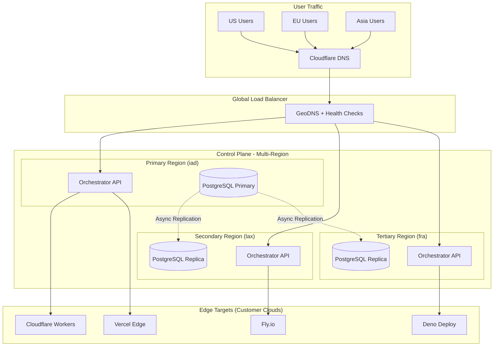

# Multi-Region Deployment Plan

## Executive Summary

This plan outlines the implementation of Multi-Region Deployment for FunctionFly, covering three core areas:
1. **Multi-Region Control Plane** - Deploy the orchestrator across multiple geographic regions
2. **Global Load Balancing** - Enhance geographic routing with intelligent traffic distribution
3. **Disaster Recovery** - Implement backup procedures, point-in-time recovery, and failover mechanisms

**Recommended Infrastructure**: Fly.io for the control plane (cost-effective, ~$5-10/month initially, scales with usage)

---

## Architecture Overview



---

## Phase 1: Multi-Region Control Plane

### 1.1 Infrastructure Setup (Fly.io)

**Recommended Regions:**
- `iad` (Virginia, USA) - Primary region
- `lax` (Los Angeles, USA) - US West Coast fallback
- `fra` (Frankfurt, Germany) - European coverage

**Cost Estimate:**
- Fly.io VMs: ~$5-10/month per region (shared CPUs)
- Volume storage: ~$1/month
- Total initial: $15-30/month

### 1.2 Implementation Steps

#### Step 1.1: Create Fly.io Application Configuration

**File: `deploy/fly/functionfly-control/Dockerfile`**
```dockerfile
# Multi-stage build for minimal image
FROM golang:1.21-alpine AS builder
WORKDIR /app
COPY go.mod go.sum ./
RUN go mod download
COPY . .
RUN CGO_ENABLED=0 GOOS=linux go build -o /orchestrator

FROM alpine:3.18
RUN apk --no-cache add ca-certificates
WORKDIR /app
COPY --from=builder /orchestrator .
EXPOSE 8080
CMD ["./orchestrator"]
```

**File: `deploy/fly/functionfly-control/fly.toml`**
```toml
app = "functionfly-control"
kill_signal = "SIGINT"
kill_timeout = 10

[build]
  dockerfile = "Dockerfile"

[[services]]
  http_checks = []
  internal_port = 8080
  processes = ["app"]
  protocol = "tcp"
  script_builtin = null

  [services.concurrency]
    hard_limit = 25
    soft_limit = 20
    type = "connections"

[[regions]]
  code = "iad"
  weight = 100

[[regions]]
  code = "lax"
  weight = 0  # Standby until promoted

[[regions]]
  code = "fra"
  weight = 0  # Standby until promoted
```

#### Step 1.2: Database Multi-Region Setup

**Option A: Neon (Serverless PostgreSQL)**
- Free tier: 0.5GB storage, 1 project
- Paid: ~$20/month for production
- Built-in read replicas in multiple regions

**Option B: Supabase (PostgreSQL)**
- Free tier: 500MB database, 2 concurrent connections
- Paid: ~$25/month for production
- Good for smaller scale

**Option C: Fly PostgreSQL**
- $5.47/month for 2GB volume
- Manual replica setup required

**Recommendation**: Start with **Neon** (easiest multi-region) or **Fly.io PostgreSQL** (cheapest control).

#### Step 1.3: Implement Leader Election

**File: `internal/leader/election.go`**
```go
package leader

import (
    "context"
    "time"
    
    "github.com/functionfly/functionfly/internal/storage"
    "github.com/sirupsen/logrus"
)

// Election manages leader election for multi-region control plane
type Election struct {
    repo     storage.LeaderRepository
    instance string
    region   string
    isLeader bool
    ticker   *time.Ticker
}

// NewElection creates a new leader election instance
func NewElection(repo storage.LeaderRepository, instance, region string) *Election {
    return &Election{
        repo:     repo,
        instance: instance,
        region:   region,
        isLeader: false,
        ticker:   time.NewTicker(5 * time.Second),
    }
}

// Start begins the leader election process
func (e *Election) Start(ctx context.Context) {
    go e.run(ctx)
}

// IsLeader returns true if this instance is the leader
func (e *Election) IsLeader() bool {
    return e.isLeader
}

func (e *Election) run(ctx context.Context) {
    for {
        select {
        case <-ctx.Done():
            e.ticker.Stop()
            return
        case <-e.ticker.C:
            e.elect(ctx)
        }
    }
}

func (e *Election) elect(ctx context.Context) {
    // Attempt to acquire leadership
    leader, err := e.repo.GetLeader(ctx)
    if err != nil {
        logrus.Errorf("Failed to get leader: %v", err)
        return
    }

    if leader == nil || leader.InstanceID == e.instance {
        // No leader or we are leader, claim leadership
        err := e.repo.ClaimLeadership(ctx, e.instance, e.region, 30*time.Second)
        if err == nil {
            if !e.isLeader {
                logrus.Infof("This instance (%s/%s) became leader", e.instance, e.region)
                e.isLeader = true
            }
        } else if e.isLeader {
            logrus.Warnf("Lost leadership: %v", err)
            e.isLeader = false
        }
    } else {
        if e.isLeader {
            logrus.Infof("Another instance (%s/%s) is leader", leader.InstanceID, leader.Region)
            e.isLeader = false
        }
    }
}
```

#### Step 1.4: Add Leader Election to Storage Repository

**File: `internal/storage/leader_repository.go`**
```go
package storage

import (
    "context"
    "time"
    
    "github.com/google/uuid"
)

// Leader represents a leader election entry
type Leader struct {
    ID          uuid.UUID
    InstanceID  string
    Region      string
    AcquiredAt time.Time
    ExpiresAt  time.Time
}

// LeaderRepository defines leader election operations
type LeaderRepository interface {
    GetLeader(ctx context.Context) (*Leader, error)
    ClaimLeadership(ctx context.Context, instanceID, region string, ttl time.Duration) error
    ReleaseLeadership(ctx context.Context, instanceID string) error
}

// GetLeader retrieves the current leader
func (db *PostgresDB) GetLeader(ctx context.Context) (*Leader, error) {
    var leader Leader
    err := db.db.QueryRowContext(ctx, `
        SELECT id, instance_id, region, acquired_at, expires_at
        FROM leader_election
        WHERE expires_at > NOW()
        ORDER BY acquired_at DESC
        LIMIT 1
    `).Scan(&leader.ID, &leader.InstanceID, &leader.Region, &leader.AcquiredAt, &leader.ExpiresAt)
    
    if err == ErrNoRows {
        return nil, nil
    }
    if err != nil {
        return nil, err
    }
    return &leader, nil
}

// ClaimLeadership attempts to claim leadership
func (db *PostgresDB) ClaimLeadership(ctx context.Context, instanceID, region string, ttl time.Duration) error {
    _, err := db.db.ExecContext(ctx, `
        INSERT INTO leader_election (id, instance_id, region, acquired_at, expires_at)
        VALUES ($1, $2, $3, NOW(), NOW() + $4)
        ON CONFLICT DO NOTHING
    `, uuid.New(), instanceID, region, ttl)
    return err
}
```

---

## Phase 2: Global Load Balancing Enhancement

### 2.1 Enhanced GeoRouter Features

#### Step 2.1: Add Anycast/DNS-Based Routing

**File: `internal/routing/global_load_balancer.go`**
```go
package routing

import (
    "context"
    "net"
    "sync"
    "time"
    
    "github.com/functionfly/functionfly/internal/storage"
    "github.com/sirupsen/logrus"
)

// GlobalLoadBalancer provides global load balancing across regions
type GlobalLoadBalancer struct {
    geoRouter     *GeoRouter
    healthChecker *HealthChecker
    regionalStats map[string]*RegionalStats
    mu            sync.RWMutex
    config        *GLBConfig
}

// GLBConfig holds Global Load Balancer configuration
type GLBConfig struct {
    HealthCheckInterval time.Duration
    FailoverThreshold  int           // Consecutive failures before failover
    RecoveryThreshold   int           // Successes needed to restore
    LatencyWeight       float64       // Weight for latency in scoring
    LoadWeight          float64       // Weight for current load
    ErrorRateWeight     float64       // Weight for error rate
    RegionWeight        map[string]float64 // Regional preferences
}

// RegionalStats holds statistics for a region
type RegionalStats struct {
    Region           string
    TotalRequests    int64
    FailedRequests  int64
    AverageLatency  time.Duration
    LastHealthCheck time.Time
    Healthy         bool
}

// NewGlobalLoadBalancer creates a new global load balancer
func NewGlobalLoadBalancer(geoRouter *GeoRouter, config *GLBConfig) *GlobalLoadBalancer {
    if config == nil {
        config = DefaultGLBConfig()
    }
    
    return &GlobalLoadBalancer{
        geoRouter:     geoRouter,
        healthChecker: NewHealthChecker(config.HealthCheckInterval),
        regionalStats: make(map[string]*RegionalStats),
        config:        config,
    }
}

// DefaultGLBConfig returns default GLB configuration
func DefaultGLBConfig() *GLBConfig {
    return &GLBConfig{
        HealthCheckInterval: 10 * time.Second,
        FailoverThreshold:  3,
        RecoveryThreshold:  5,
        LatencyWeight:      0.4,
        LoadWeight:         0.3,
        ErrorRateWeight:    0.3,
        RegionWeight: map[string]float64{
            "iad": 1.0,  // Primary
            "lax": 0.5,  // US West
            "fra": 0.5,  // Europe
        },
    }
}

// SelectBackend selects the best backend using global load balancing
func (glb *GlobalLoadBalancer) SelectBackend(ctx context.Context, clientIP string) (*storage.Backend, RegionalStats, error) {
    // Get client region
    clientRegion := glb.getClientRegion(clientIP)
    
    // Get regional backends
    regionalBackends := glb.geoRouter.GetBackendsByRegion(clientRegion)
    if len(regionalBackends) == 0 {
        // Fallback to any available backend
        regionalBackends = glb.geoRouter.GetAllBackends()
        if len(regionalBackends) == 0 {
            return nil, RegionalStats{}, ErrNoBackendsAvailable
        }
    }
    
    // Score and select backend
    selected, stats := glb.scoreAndSelect(ctx, regionalBackends, clientRegion)
    
    return selected, stats, nil
}

// getClientRegion determines client region from IP
func (glb *GlobalLoadBalancer) getClientRegion(clientIP string) string {
    // Use existing GeoRouter's GeoIP client
    return glb.geoRouter.LookupRegion(clientIP)
}

// scoreAndSelect scores backends and selects the best one
func (glb *GlobalLoadBalancer) scoreAndSelect(ctx context.Context, backends []*BackendLoad, preferredRegion string) (*storage.Backend, RegionalStats) {
    var best *BackendLoad
    bestScore := float64(^uint(0) >> 1) // Max int
    
    stats := RegionalStats{
        Region:      preferredRegion,
        Healthy:     true,
    }
    
    for _, backend := range backends {
        if !backend.Healthy {
            continue
        }
        
        // Calculate composite score (lower is better)
        score := glb.calculateScore(backend, preferredRegion)
        
        if score < bestScore {
            bestScore = score
            best = backend
        }
    }
    
    if best == nil {
        stats.Healthy = false
        return nil, stats
    }
    
    return nil, stats // Backend would be fetched from repo
}

// calculateScore calculates a composite score for a backend
func (glb *GlobalLoadBalancer) calculateScore(backend *BackendLoad, preferredRegion string) float64 {
    // Latency score (normalized to 0-100)
    latencyScore := backend.ResponseTime.Seconds() * 10
    
    // Load score (0-100)
    loadScore := backend.CurrentLoad * 100
    
    // Error rate score (0-100)
    errorScore := backend.ErrorRate * 100
    
    // Region preference
    regionWeight := glb.config.RegionWeight[string(backend.Region)]
    if regionWeight == 0 {
        regionWeight = 0.5
    }
    
    // Composite score
    score := (latencyScore * glb.config.LatencyWeight) +
             (loadScore * glb.config.LoadWeight) +
             (errorScore * glb.config.ErrorRateWeight)
    
    // Apply region preference (lower is better for preferred region)
    if regionWeight < 1.0 {
        score = score / regionWeight
    }
    
    return score
}
```

#### Step 2.2: Implement Active Health Checking

**File: `internal/routing/health_checker.go`**
```go
package routing

import (
    "context"
    "sync"
    "time"
)

// HealthChecker performs active health checks on backends
type HealthChecker struct {
    backends   map[string]*HealthState
    mu         sync.RWMutex
    interval   time.Duration
    client     *http.Client
    checkURL   string
}

// HealthState tracks health state for a backend
type HealthState struct {
    BackendID      string
    ConsecutiveOK  int
    ConsecutiveFail int
    LastCheck     time.Time
    Latency       time.Duration
    ErrorRate     float64
    IsHealthy     bool
}

// NewHealthChecker creates a new health checker
func NewHealthChecker(interval time.Duration) *HealthChecker {
    return &HealthChecker{
        backends: make(map[string]*HealthState),
        interval: interval,
        client: &http.Client{
            Timeout: 5 * time.Second,
        },
        checkURL: "/healthz",
    }
}

// Start begins health checking all registered backends
func (hc *HealthChecker) Start(ctx context.Context, getBackends func() []*BackendLoad) {
    ticker := time.NewTicker(hc.interval)
    
    go func() {
        for {
            select {
            case <-ctx.Done():
                ticker.Stop()
                return
            case <-ticker.C:
                backends := getBackends()
                for _, backend := range backends {
                    hc.check(ctx, backend)
                }
            }
        }
    }()
}

// check performs a health check on a single backend
func (hc *HealthChecker) check(ctx context.Context, backend *BackendLoad) {
    url := backend.URL + hc.checkURL
    
    start := time.Now()
    resp, err := hc.client.Get(url)
    latency := time.Since(start)
    
    hc.mu.Lock()
    defer hc.mu.Unlock()
    
    state, exists := hc.backends[backend.BackendID]
    if !exists {
        state = &HealthState{BackendID: backend.BackendID}
        hc.backends[backend.BackendID] = state
    }
    
    state.LastCheck = time.Now()
    state.Latency = latency
    
    if err != nil || resp.StatusCode >= 500 {
        state.ConsecutiveFail++
        state.ConsecutiveOK = 0
        
        if state.ConsecutiveFail >= 3 {
            state.IsHealthy = false
        }
    } else {
        state.ConsecutiveOK++
        state.ConsecutiveFail = 0
        
        if state.ConsecutiveOK >= 5 {
            state.IsHealthy = true
        }
    }
    
    // Update backend health in GeoRouter
    // This would call back to the GeoRouter to update health status
}

// GetHealthState returns the health state for a backend
func (hc *HealthChecker) GetHealthState(backendID string) *HealthState {
    hc.mu.RLock()
    defer hc.mu.RUnlock()
    return hc.backends[backendID]
}
```

### 2.2 DNS-Based Global Routing

#### Step 2.3: Configure Cloudflare GeoDNS

**File: `deploy/dns/cloudflare-geo-dns.json`**
```json
{
  "zones": [
    {
      "name": "functionfly.com",
      "records": [
        {
          "type": "A",
          "name": "api",
          "content": ["<primary-region-ip>", "<secondary-region-ip>", "<tertiary-region-ip>"],
          "proxied": true,
          "ttl": 60,
          "geo": {
            "default": "<primary-region-ip>",
            "US": "<primary-region-ip>",
            "EU": "<tertiary-region-ip>",
            "ASIA": "<tertiary-region-ip>"
          }
        },
        {
          "type": "CNAME",
          "name": "@",
          "content": "functionfly.pages.dev",
          "proxied": true,
          "ttl": 300
        }
      ]
    }
  ]
}
```

---

## Phase 3: Disaster Recovery Procedures

### 3.1 Database Backup System

#### Step 3.1: Enhanced Backup Script

**File: `scripts/multi-region-backup.sh`**
```bash
#!/bin/bash
set -euo pipefail

# Configuration
BACKUP_RETENTION_DAYS=${BACKUP_RETENTION_DAYS:-30}
S3_BUCKET=${S3_BUCKET:-functionfly-backups}
DB_PRIMARY_REGION=${DB_PRIMARY_REGION:-iad}
TIMESTAMP=$(date +%Y%m%d_%H%M%S)

# Colors for output
RED='\033[0;31m'
GREEN='\033[0;32m'
YELLOW='\033[1;33m'
NC='\033[0m'

log_info() { echo -e "${GREEN}[INFO]${NC} $1"; }
log_warn() { echo -e "${YELLOW}[WARN]${NC} $1"; }
log_error() { echo -e "${RED}[ERROR]${NC} $1"; }

# Database backup function
backup_database() {
    local region=$1
    local endpoint=$2
    
    log_info "Starting backup for region: $region"
    
    # Set database URL for this region
    export DATABASE_URL="postgres://user:pass@${endpoint}:5432/functionfly?sslmode=require"
    
    # Create backup filename
    BACKUP_FILE="functionfly_${region}_${TIMESTAMP}.sql.gz"
    
    # Perform backup
    pg_dump $DATABASE_URL | gzip > "/tmp/${BACKUP_FILE}"
    
    # Calculate checksum
    CHECKSUM=$(sha256sum "/tmp/${BACKUP_FILE}" | awk '{print $1}')
    
    # Upload to S3 with regional prefix
    aws s3 cp "/tmp/${BACKUP_FILE}" "s3://${S3_BUCKET}/${region}/backups/${BACKUP_FILE}"
    aws s3 cp "/tmp/${BACKUP_FILE}" "s3://${S3_BUCKET}/${region}/backups/latest.sql.gz"
    
    # Store checksum for verification
    echo "${CHECKSUM}" | aws s3 cp - "s3://${S3_BUCKET}/${region}/backups/${BACKUP_FILE}.sha256"
    
    # Cleanup local file
    rm -f "/tmp/${BACKUP_FILE}"
    
    log_info "Backup completed for region: $region"
}

# Cross-region backup replication
replicate_backups() {
    local source_region=$1
    
    log_info "Replicating backups from $source_region to all regions"
    
    # Copy backups to secondary regions
    for region in lax fra; do
        if [ "$source_region" != "$region" ]; then
            aws s3 sync "s3://${S3_BUCKET}/${source_region}/" "s3://${S3_BUCKET}/${region}/" --source-region "$source_region" --region "$region"
        fi
    done
}

# Main backup process
main() {
    log_info "Starting multi-region backup process"
    
    # Get primary database endpoint
    PRIMARY_ENDPOINT=$(aws rds describe-db-instances --db-instance-identifier functionfly-primary --region "$DB_PRIMARY_REGION" --query 'DBInstances[0].Endpoint.Address' --output text)
    
    # Perform backup
    backup_database "$DB_PRIMARY_REGION" "$PRIMARY_ENDPOINT"
    
    # Replicate to other regions
    replicate_backups "$DB_PRIMARY_REGION"
    
    # Cleanup old backups
    log_info "Cleaning up backups older than ${BACKUP_RETENTION_DAYS} days"
    aws s3 ls "s3://${S3_BUCKET}/" | while read -r line; do
        backup_date=$(echo "$line" | awk '{print $1}')
        backup_name=$(echo "$line" | awk '{print $4}')
        
        # Calculate age and delete if needed
        # Implementation would use date comparison
    done
    
    log_info "Multi-region backup process completed"
}

main "$@"
```

#### Step 3.2: Point-in-Time Recovery

**File: `scripts/point-in-time-recovery.sh`**
```bash
#!/bin/bash
set -euo pipefail

# Configuration
TARGET_TIMESTAMP=${TARGET_TIMESTAMP:-}  # Format: "2024-01-15 14:30:00"
S3_BUCKET=${S3_BUCKET:-functionfly-backups}
RESTORE_REGION=${RESTORE_REGION:-iad}
NEW_INSTANCE_ID=${NEW_INSTANCE_ID:-functionfly-restore}

# ... (implementation for point-in-time recovery)
```

### 3.2 Failover Procedures

#### Step 3.3: Automated Failover Script

**File: `scripts/failover-control-plane.sh`**
```bash
#!/bin/bash
set -euo pipefail

# Configuration
PRIMARY_REGION=${PRIMARY_REGION:-iad}
SECONDARY_REGION=${SECONDARY_REGION:-lax}
TERTIARY_REGION=${TERTIARY_REGION:-fra}
HEALTH_CHECK_URL=${HEALTH_CHECK_URL:-http://localhost:8080/healthz}
FAILOVER_THRESHOLD=${FAILOVER_THRESHOLD:-3}

log_info() { echo "[INFO] $1"; }
log_error() { echo "[ERROR] $1" >&2; }

# Check primary region health
check_region_health() {
    local region=$1
    local health=0
    
    for i in $(seq 1 $FAILOVER_THRESHOLD); do
        if curl -sf --max-time 5 "${HEALTH_CHECK_URL}" > /dev/null 2>&1; then
            health=$((health + 1))
        fi
        sleep 2
    done
    
    return $((health >= 2 ? 0 : 1))
}

# Promote secondary region to primary
promote_region() {
    local current_primary=$1
    local new_primary=$2
    
    log_info "Promoting region $new_primary to primary"
    
    # Update DNS to point to new primary
    cfctl update-dns --region "$new_primary"
    
    # Update Fly.io region weights
    flyctl regions set "$new_primary" --app functionfly-control
    flyctl regions remove "$current_primary" --app functionfly-control
    
    # Notify monitoring systems
    curl -X POST "$ALERT_WEBHOOK_URL" \
        -H "Content-Type: application/json" \
        -d '{"alert": "failover", "from": "'"$current_primary"'", "to": "'"$new_primary"'", "timestamp": "'"$(date -Iseconds)"'"}'
    
    log_info "Failover completed to region $new_primary"
}

# Main failover logic
main() {
    local current_primary=$PRIMARY_REGION
    
    # Check primary health
    if check_region_health "$current_primary"; then
        log_info "Primary region $current_primary is healthy"
        exit 0
    fi
    
    log_error "Primary region $current_primary is unhealthy, initiating failover"
    
    # Try secondary region
    if check_region_health "$SECONDARY_REGION"; then
        promote_region "$current_primary" "$SECONDARY_REGION"
    elif check_region_health "$TERTIARY_REGION"; then
        promote_region "$current_primary" "$TERTIARY_REGION"
    else
        log_error "No healthy regions available for failover"
        exit 1
    fi
}

main "$@"
```

### 3.3 Runbook for Disaster Recovery

**File: `docs/DISASTER_RECOVERY_RUNBOOK.md`**
```markdown
# Disaster Recovery Runbook

## Emergency Contacts

- Primary On-Call: [Phone]
- Secondary On-Call: [Phone]
- Infrastructure Team: [Email]

## Scenario 1: Complete Region Outage

### Detection
- Health checks failing for all instances in region
- Increased error rates from monitoring
- Customer complaints

### Steps
1. Acknowledge alert in PagerDuty
2. Run failover script: `./scripts/failover-control-plane.sh`
3. Verify DNS propagation: `dig api.functionfly.com`
4. Check application health in new region
5. Notify customers via status page

### Recovery Time Objective: 5 minutes

---

## Scenario 2: Database Corruption

### Detection
- Database health checks failing
- Query errors in logs
- Replication lag increasing

### Steps
1. Stop application traffic (scale to 0)
2. Identify last good backup
3. Restore to point-in-time: `./scripts/point-in-time-recovery.sh --timestamp "2024-01-15 14:30:00"`
4. Verify data integrity
5. Resume traffic

### Recovery Time Objective: 30 minutes

---

## Scenario 3: Data Loss (Accidental Delete)

### Detection
- Missing data in application
- Backup verification failures

### Steps
1. Immediately stop all write operations
2. Identify scope of data loss
3. Restore from latest backup before deletion
4. Compare restored data with any logs
5. Apply any transactions after backup

### Recovery Time Objective: 1 hour

---

## Scenario 4: Security Breach

### Detection
- Unauthorized access alerts
- Suspicious API activity
- Unexpected data exfiltration

### Steps
1. Isolate affected systems (block network access)
2. Rotate all credentials and secrets
3. Enable audit logging
4. Restore from known-good backup
5. Review access logs for scope of breach
6. Report to compliance team

### Recovery Time Objective: 2 hours

---

## Verification Checklist

After any failover or recovery:

- [ ] Health endpoints responding
- [ ] Database connections working
- [ ] DNS resolving correctly
- [ ] Edge targets accessible
- [ ] Customer authentication working
- [ ] Monitoring showing green status
- [ ] Recent backups verified
- [ ] Team notified of recovery
```

---

## Implementation Priority Matrix

| Component | Priority | Effort | Cost Impact |
|-----------|----------|--------|-------------|
| Fly.io multi-region setup | P0 | Medium | $15-30/mo |
| Leader election | P0 | Medium | $0 |
| Enhanced GeoRouter | P0 | Medium | $0 |
| Database backups | P1 | Low | $5/mo |
| Automated failover | P1 | Medium | $0 |
| Point-in-time recovery | P2 | High | $0 |
| Cross-region replication | P2 | Medium | $10/mo |

---

## Migration Path

### Phase 1 (Week 1-2): Core Infrastructure
1. Deploy single Fly.io app with multi-region config
2. Set up leader election
3. Configure database (Neon or Fly PostgreSQL)

### Phase 2 (Week 3-4): Load Balancing
1. Enhance GeoRouter with scoring algorithm
2. Add health checking
3. Configure Cloudflare GeoDNS

### Phase 3 (Week 5-6): Disaster Recovery
1. Implement backup automation
2. Create failover procedures
3. Document runbook
4. Conduct tabletop exercise

### Phase 4 (Week 7+): Optimization
1. Tune failover thresholds
2. Add more regions as needed
3. Implement chaos engineering

---

## Cost Summary

| Component | Monthly Cost (Initial) |
|-----------|----------------------|
| Fly.io (3 regions) | $15-30 |
| Database (Neon) | $20-40 |
| S3 Backups | $5-10 |
| Cloudflare Pro | $20 |
| **Total** | **$60-100/month** |

This scales appropriately as traffic increases.
