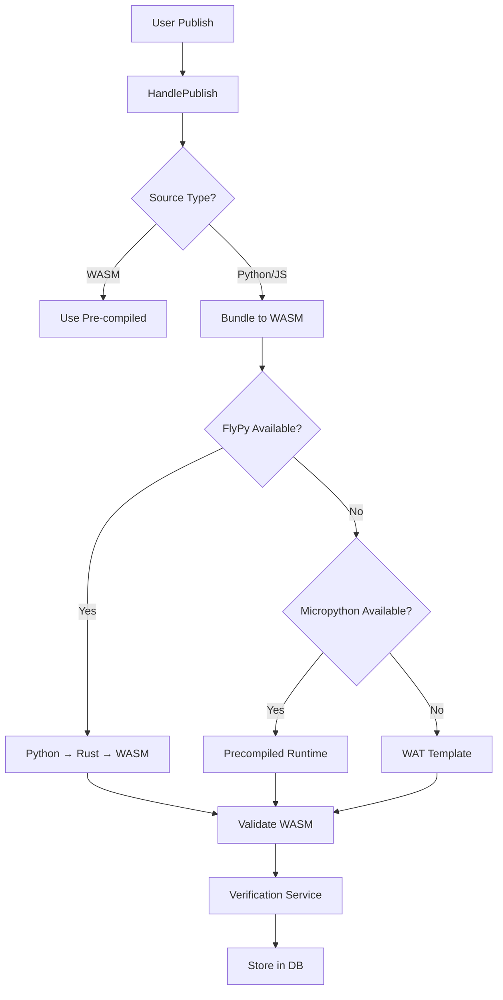

# MVP Gap Analysis - FunctionFly

## Executive Summary

This document provides a detailed gap analysis for the FunctionFly MVP. The system has substantial implementation across all major components (FlyPy compiler, publishing pipeline, routing, security, edge targets). However, several gaps and issues need to be addressed before MVP launch.

---

## 1. FlyPy Compiler - Gaps

### 1.1 Runtime Dependencies
| Gap | Severity | Description |
|-----|----------|-------------|
| Rust/Cargo Required | High | FlyPy compiler requires Rust toolchain (`cargo`, `rustc`) to be installed on the build system. Falls back to precompiled runtime but with reduced functionality. |
| WASI Target | Medium | Requires `wasm32-wasip1` or `wasm32-unknown-unknown` Rust targets to be installed. |

**Simplified Approach**: The bundler now uses a 2-tier fallback system:
1. **FlyPy compiler** (primary) - Transpiles Python to Rust, then compiles to WASM. No external runtime needed.
2. **Precompiled Micropython runtime** (fallback) - Uses bundled micropython.wasm for full Python stdlib support.

**Removed**: Pyodide CLI, Micropython CLI, WASM Pack, and WAT template approaches (not needed for MVP).

**Action Item**: Document build environment requirements or create Docker build container.

### 1.2 Python Feature Coverage
| Feature | Status | Notes |
|---------|--------|-------|
| Basic types (int, str, bool, float, list, dict) | ✅ Complete | |
| Arithmetic operations | ✅ Complete | +, -, *, /, %, ** |
| Comparison operators | ✅ Complete | ==, !=, <, <=, >, >= |
| Boolean operators | ✅ Complete | and, or, not |
| If/else statements | ✅ Complete | |
| For loops | ✅ Full Support | All modes (deterministic, complex, compatible) |
| While loops | ✅ Full Support | All modes (deterministic, complex, compatible) |
| List comprehensions | ✅ Full Support | All modes (deterministic, complex, compatible) |
| Try/except blocks | ✅ Full Support | All modes (deterministic, complex, compatible) |
| Classes/OO | ❌ Not Supported | Not in scope for MVP |
| Generators | ❌ Not Supported | Not in scope for MVP |
| Decorators | ❌ Not Supported | Not in scope for MVP |

### 1.3 Standard Library Coverage
| Module | Deterministic Mode | Complex Mode |
|--------|-------------------|--------------|
| json | ✅ | ✅ |
| math | ✅ | ✅ |
| csv | ❌ | ✅ |
| datetime | ❌ | ✅ |
| hashlib | ❌ | ✅ |
| base64 | ❌ | ✅ |
| re | ❌ | ✅ |
| itertools | ❌ | ✅ |
| functools | ❌ | ✅ |

**Action Item**: Document supported Python features and stdlib modules clearly for users.

---

## 2. Publishing Pipeline - Gaps

### 2.1 Compilation Pipeline

### 2.2 Identified Issues
| Issue | Severity | Description |
|-------|----------|-------------|
| No Compilation Feedback | Medium | User doesn't see detailed compilation errors, only success/failure |
| Bundle Size Not Optimized | Low | No-shaking or minification of generated WASM |
| Version Conflict Handling | Medium | tree Publishing same version multiple times doesn't update - creates duplicate |

**Action Item**: Add detailed compilation error messages and version conflict handling.

### 2.3 Verification Service
| Component | Status | Notes |
|-----------|--------|-------|
| Content Hash | ✅ Implemented | SHA256 of source code |
| Malware Scanning | ⚠️ Stub | Requires ClamAV external service |
| Signature Service | ✅ Implemented | For function signing |
| Approval Workflow | ✅ Implemented | For high-trust functions |

**Gap**: Malware scanner is a stub implementation - needs external ClamAV integration or alternative.

---

## 3. Routing & Health - Gaps

### 3.1 Current Implementation
| Feature | Status | Location |
|---------|--------|----------|
| Health-aware selection | ✅ Complete | `internal/routing/router.go` |
| EWMA latency scoring | ✅ Complete | `calculateEWMAScore()` |
| Circuit breaker | ✅ Complete | `internal/health/monitor.go` |
| Fast failover (idempotent) | ✅ Complete | Returns top 3 backends |
| Priority-based routing | ✅ Complete | For Pro plan |

### 3.2 Gaps
| Gap | Severity | Description |
|-----|----------|-------------|
| ~~No Health Check Scheduler~~ | ~~High~~ | ~~Monitor exists but needs to be run as background service~~ ✅ FIXED |
| No Latency Aggregation | Medium | EWMA calculates from health checks but no periodic aggregation job |
| Circuit State Persistence | Medium | Circuit state stored in DB but no automatic recovery timing |

**Action Item**: Implement health check scheduler as background goroutine or cron job.

---

## 4. Edge Deployment Targets - Gaps

### 4.1 Provider Support Status
| Provider | Template Status | Deployment Docs |
|----------|-----------------|------------------|
| Fly.io | ✅ Complete | README with steps |
| Cloudflare Workers | ✅ Complete | README with steps |
| Vercel | ✅ Complete | README with steps |
| Deno Deploy | ✅ Complete | README with steps |

### 4.2 Gaps
| Gap | Severity | Description |
|-----|----------|-------------|
| No Auto-deployment | High | Templates exist but no CI/CD integration |
| HMAC Key Distribution | Medium | Edge targets need shared secret configured manually |
| Backend URL Configuration | Medium | Each deployment needs BACKEND_URL set |

**Action Item**: Create deployment scripts or GitHub Actions workflows for each provider.

---

## 5. Security - Gaps

### 5.1 Current Implementation
| Feature | Status |
|---------|--------|
| JWT Authentication | ✅ Complete |
| App Keys | ✅ Complete |
| HMAC Signing | ✅ Complete |
| Rate Limiting | ✅ Complete |
| Input Validation | ✅ Complete |

### 5.2 Gaps
| Gap | Severity | Description |
|-----|----------|-------------|
| No Tenant Isolation Tests | Medium | Need to verify cross-tenant access is blocked |
| Rate Limit Config | Low | Currently global, should be per-tenant/plan |
| HMAC Key Rotation | Low | No automated key rotation mechanism |

---

## 6. Observability - Gaps

### 6.1 Current Implementation
| Feature | Status |
|---------|--------|
| Structured Logs | ✅ Complete |
| Request ID Tracing | ✅ Complete |
| Prometheus Metrics | ✅ Complete |
| Health Checks | ✅ Complete |

### 6.2 Gaps
| Gap | Severity | Description |
|-----|----------|-------------|
| Distributed Tracing | Medium | No Jaeger/Zipkin integration |
| Log Aggregation | Medium | No centralized logging (ELK/CloudWatch) |
| Alerting | Low | Alert engine exists but no notification channels configured |

---

## 7. Function Execution - Gaps

### 7.1 WASM Runtime
| Component | Status | Notes |
|-----------|--------|-------|
| Sandbox Executor | ✅ Complete | Rust runtime with resource limits |
| WASM Validation | ✅ Complete | Magic number + version check |
| Timeout Handling | ✅ Complete | Configurable per function |
| Memory Limits | ✅ Complete | Configurable per function |

### 7.2 Gaps
| Gap | Severity | Description |
|-----|----------|-------------|
| No Local WASM Runtime | High | Python functions can't run locally without deployment |
| Execution Logging | Medium | No stdout/stderr capture from WASM runtime |
| Cold Start Optimization | Medium | No pre-warming of function instances |

---

## 8. MVP Success Criteria Review

From `plans/SCOPE_AND_SUCCESS.md`:

| Criteria | Status | Notes |
|----------|--------|-------|
| User can register app + add 2-4 backends | ✅ | Handler exists |
| Health monitor detects unhealthy backend | ✅ | Monitor running as background service |
| Router chooses lowest score healthy backend | ✅ | Implemented |
| Circuit breaker for failover | ✅ | Implemented |
| End-to-end request ID | ✅ | Implemented |
| Local smoke test for failover | ✅ | scripts/smoke_test.sh available |

**Action Item**: Create smoke test script demonstrating failover and recovery.

---

## 9. Priority Action Items

### Critical (Must Fix)
1. ~~**Health Check Scheduler**~~: ~~Implement background job to run health checks~~ ✅ FIXED
2. ~~**Smoke Test Script**~~: ~~Create end-to-end test demonstrating MVP features~~ ✅ FIXED
3. **Build Environment Docs**: Document Rust/Cargo requirements for FlyPy

### High Priority
4. **Edge Deployment Scripts**: Create deploy scripts for each provider
5. **Compilation Error Messages**: Improve user feedback during publish
6. **Version Conflict Handling**: Handle re-publish of same version

### Medium Priority
7. **Malware Scanner Integration**: Implement or document external service requirement
8. **Distributed Tracing**: Add Jaeger integration
9. **Tenant Isolation Tests**: Verify cross-tenant access controls

### Low Priority
10. Rate limit per-tenant configuration
11. HMAC key rotation mechanism
12. Log aggregation setup

---

## 10. Overall Assessment

| Area | Score | Notes |
|------|-------|-------|
| FlyPy Compiler | 7/10 | Solid foundation, Rust dependency is main limitation |
| Publishing Pipeline | 8/10 | Complete flow, needs error message improvements |
| Routing & Health | 8/10 | All features present, needs scheduler |
| Edge Targets | 7/10 | Templates ready, needs deployment automation |
| Security | 8/10 | Comprehensive, needs testing |
| Observability | 7/10 | Good foundation, needs centralized logging |

**Overall: 75% Ready for MVP**

The core functionality is in place. Main gaps are operational (health check scheduling, deployment automation) rather than architectural.
