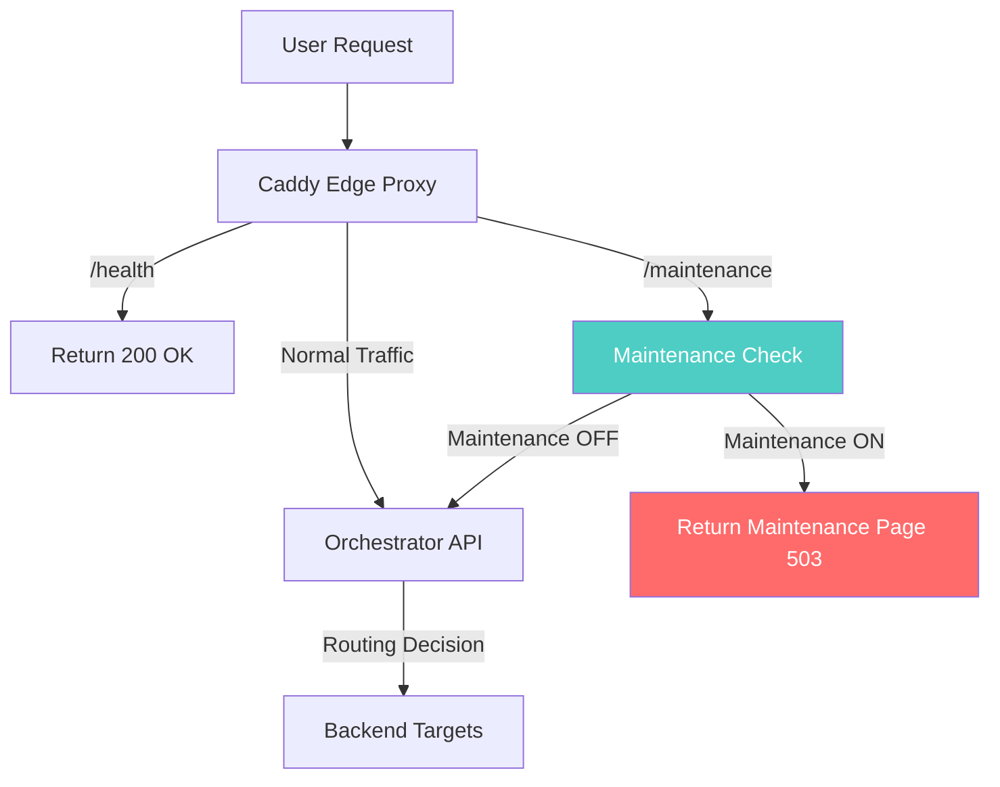
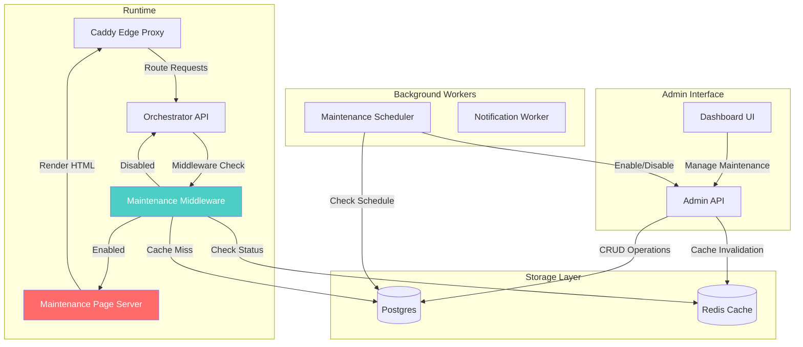

# Platform-Wide Maintenance Mode Architecture

## Overview

This document specifies the architecture for an innovative platform-wide maintenance mode system for FunctionFly. The system allows operators to show a maintenance page to all visitors during infrastructure updates, with advanced features like scheduling, customization, and gradual rollouts.

## Goals

- Enable operators to take the platform offline with a user-friendly maintenance page
- Support scheduled maintenance windows for predictable updates
- Provide customizable maintenance pages with branding
- Ensure fast response times by caching maintenance state
- Support gradual/percentage-based rollouts for testing
- Maintain audit trail of all maintenance mode changes

## Non-Goals (MVP)

- Per-application maintenance mode (users can maintain their own apps)
- Geographic-specific maintenance (all regions affected equally)
- Advanced A/B testing of maintenance pages

## Architecture Overview

### Request Flow with Maintenance Mode



### Components

1. **Database (Postgres)** - Source of truth for maintenance configuration
2. **Redis Cache** - Fast lookup for maintenance state (critical path)
3. **Orchestrator API** - Middleware checks maintenance mode before routing
4. **Admin API** - Endpoints to manage maintenance mode
5. **Dashboard UI** - Interface for operators to control maintenance mode
6. **Maintenance Page Server** - Serves customizable HTML pages

## Database Schema

### Table: platform_settings

Add maintenance-related fields to an existing or new platform settings table:

```sql
-- Main maintenance mode table
CREATE TABLE platform_maintenance (
    id UUID PRIMARY KEY DEFAULT gen_random_uuid(),
    enabled BOOLEAN NOT NULL DEFAULT false,
    name VARCHAR(255) NOT NULL,
    description TEXT,
    message TEXT, -- Custom message shown to users
    page_template VARCHAR(100) DEFAULT 'default', -- References maintenance_page_templates
    retry_after_seconds INTEGER DEFAULT 3600,
    
    -- Rollout control (for gradual enablement)
    rollout_percentage INTEGER DEFAULT 100 CHECK (rollout_percentage BETWEEN 0 AND 100),
    rollout_seed VARCHAR(50), -- For consistent user grouping
    
    -- Scheduling
    scheduled_start TIMESTAMPTZ,
    scheduled_end TIMESTAMPTZ,
    is_scheduled BOOLEAN DEFAULT false,
    
    -- Maintenance window (recurring)
    recurrence_rule VARCHAR(100), -- iCal RRULE format
    timezone VARCHAR(50) DEFAULT 'UTC',
    
    -- Metadata
    created_by UUID REFERENCES users(id),
    created_at TIMESTAMPTZ NOT NULL DEFAULT NOW(),
    updated_at TIMESTAMPTZ NOT NULL DEFAULT NOW()
);

-- Customizable maintenance page templates
CREATE TABLE maintenance_page_templates (
    id UUID PRIMARY KEY DEFAULT gen_random_uuid(),
    name VARCHAR(100) NOT NULL UNIQUE,
    title VARCHAR(255),
    message_html TEXT,
    logo_url VARCHAR(500),
    background_color VARCHAR(20) DEFAULT '#1a1a2e',
    text_color VARCHAR(20) DEFAULT '#ffffff',
    accent_color VARCHAR(20) DEFAULT '#4ecdc4',
    show_contact_info BOOLEAN DEFAULT true,
    contact_email VARCHAR(255),
    show_social_links BOOLEAN DEFAULT true,
    is_default BOOLEAN DEFAULT false,
    created_at TIMESTAMPTZ NOT NULL DEFAULT NOW(),
    updated_at TIMESTAMPTZ NOT NULL DEFAULT NOW()
);

-- Audit log for maintenance mode changes
CREATE TABLE maintenance_audit_log (
    id UUID PRIMARY KEY DEFAULT gen_random_uuid(),
    maintenance_id UUID REFERENCES platform_maintenance(id),
    action VARCHAR(50) NOT NULL, -- 'enabled', 'disabled', 'updated', 'scheduled', 'cancelled'
    old_values JSONB,
    new_values JSONB,
    changed_by UUID REFERENCES users(id),
    changed_at TIMESTAMPTZ NOT NULL DEFAULT NOW(),
    ip_address INET,
    user_agent TEXT
);

-- Index for quick lookup
CREATE INDEX idx_platform_maintenance_enabled ON platform_maintenance(enabled) WHERE enabled = true;
CREATE INDEX idx_maintenance_audit_log_maintenance_id ON maintenance_audit_log(maintenance_id);
```

### Redis Keys

```
platform:maintenance:enabled     # Boolean - fast check
platform:maintenance:config      # JSON - full config cached
platform:maintenance:ttl        # TTL for cache invalidation
```

Cache invalidation happens on:
- Manual enable/disable
- Scheduled start/end
- Configuration changes (via database trigger or application-level)

## API Endpoints

### Admin API (Protected - Admin Only)

| Method | Endpoint | Description |
|--------|----------|-------------|
| GET | `/v1/admin/maintenance` | Get current maintenance mode status |
| POST | `/v1/admin/maintenance` | Enable maintenance mode |
| PUT | `/v1/admin/maintenance` | Update maintenance configuration |
| DELETE | `/v1/admin/maintenance` | Disable maintenance mode |
| GET | `/v1/admin/maintenance/templates` | List page templates |
| POST | `/v1/admin/maintenance/templates` | Create page template |
| PUT | `/v1/admin/maintenance/templates/{id}` | Update page template |
| GET | `/v1/admin/maintenance/schedule` | Get scheduled maintenance |
| POST | `/v1/admin/maintenance/schedule` | Schedule future maintenance |
| DELETE | `/v1/admin/maintenance/schedule/{id}` | Cancel scheduled maintenance |
| GET | `/v1/admin/maintenance/audit` | Get audit log |

### Public Endpoint

| Method | Endpoint | Description |
|--------|----------|-------------|
| GET | `/maintenance/status` | Public endpoint for CDN/status page integration |

## Orchestrator Middleware Design

### Location

The maintenance check should be added early in the request pipeline, after basic routing but before expensive operations.

### Implementation

```go
// Middleware priority (executed in order)
// 1. Request ID / Logging
// 2. Maintenance Mode Check <-- ADD HERE
// 3. Rate Limiting
// 4. Authentication (if required)
// 5. Routing决策
// 6. Backend Proxy

// CheckMaintenanceMode middleware
func (m *MaintenanceMiddleware) CheckMaintenanceMode(next http.Handler) http.Handler {
    return http.HandlerFunc(func(w http.ResponseWriter, r *http.Request) {
        // Fast path: check Redis cache first
        enabled, err := m.cache.GetMaintenanceEnabled(r.Context())
        if err != nil {
            // Cache miss - check database
            enabled, err = m.db.GetMaintenanceEnabled(r.Context())
            if err != nil {
                // On error, fail open (allow traffic) but log
                log.Error("Maintenance check failed", "error", err)
                next.ServeHTTP(w, r)
                return
            }
            // Update cache
            m.cache.SetMaintenanceEnabled(r.Context(), enabled)
        }
        
        if !enabled {
            next.ServeHTTP(w, r)
            return
        }
        
        // Maintenance is enabled - serve maintenance page
        m.serveMaintenancePage(w, r)
    })
}

func (m *MaintenanceMiddleware) serveMaintenancePage(w http.ResponseWriter, r *http.Request) {
    // Get full config (cached)
    config, _ := m.cache.GetMaintenanceConfig(r.Context())
    
    // Set appropriate headers
    w.Header().Set("Retry-After", strconv.Itoa(config.RetryAfter))
    w.Header().Set("X-Maintenance-Mode", "true")
    
    // For gradual rollout: check if this request should be allowed
    if config.RolloutPercentage < 100 {
        userHash := hashUserIdentifier(r)
        if !shouldAllowRequest(userHash, config.RolloutPercentage) {
            w.WriteHeader(http.StatusServiceUnavailable)
            m.renderMaintenancePage(w, config)
            return
        }
    }
    
    w.WriteHeader(http.StatusServiceUnavailable)
    m.renderMaintenancePage(w, config)
}
```

## Maintenance Page System

### Default Template

The default maintenance page should include:
- Platform logo
- Clear "We'll be back soon" message
- Estimated return time (if known)
- Contact information for emergencies
- Social media links for updates

### Template Variables

```html
<!-- Available variables -->
{{.PlatformName}}      <!-- "FunctionFly" -->
{{.Message}}            <!-- Custom message -->
{{.ScheduledEnd}}      <!-- Formatted end time -->
{{.ContactEmail}}       <!-- Support email -->
{{.StatusPageUrl}}      <!-- Link to status page -->
{{.RetryAfter}}         <!-- Seconds until retry -->
```

### Customization Options

1. **Built-in themes**: Default, Dark, Light, Minimal
2. **Custom branding**: Logo, colors, background
3. **Embedded content**: Custom HTML for rich messages
4. **Multi-language**: Support for common languages

## Scheduling System

### Scheduled Maintenance

Operators can schedule maintenance in advance:

```json
{
  "name": "Database Upgrade",
  "description": "Upgrading PostgreSQL to v17",
  "scheduled_start": "2026-03-15T02:00:00Z",
  "scheduled_end": "2026-03-15T04:00:00Z",
  "message": "We'll be performing scheduled maintenance",
  "page_template": "default"
}
```

### Recurring Maintenance Windows

Support weekly/monthly recurring maintenance:

```json
{
  "name": "Weekly Security Updates",
  "recurrence_rule": "FREQ=WEEKLY;BYDAY=SU;BYHOUR=2",
  "duration_minutes": 60,
  "message": "Weekly security maintenance"
}
```

### Scheduler Service

A background worker (or cron job) that:
1. Checks for upcoming scheduled maintenance
2. Automatically enables maintenance mode at scheduled start
3. Automatically disables at scheduled end
4. Sends notifications before/after maintenance windows

## Rollout Control

### Gradual Rollout

Allow enabling maintenance for a percentage of users to test the page:

- **0%**: No users see maintenance page
- **1-99%**: Percentage of users see maintenance
- **100%**: All users see maintenance page

Uses consistent hashing based on:
- IP address
- Cookie value (if set)
- API token (if authenticated)

This allows operators to preview the maintenance page before full rollout.

## Audit Logging

All maintenance mode changes are logged with:

```json
{
  "maintenance_id": "uuid",
  "action": "enabled|disabled|updated|scheduled|cancelled",
  "old_values": {
    "enabled": false,
    "message": "old message"
  },
  "new_values": {
    "enabled": true,
    "message": "new message",
    "scheduled_end": "2026-03-15T04:00:00Z"
  },
  "changed_by": "user-uuid",
  "changed_at": "2026-03-14T20:00:00Z",
  "ip_address": "192.168.1.1",
  "user_agent": "Mozilla/5.0..."
}
```

## Security Considerations

1. **Admin access required**: Only authenticated admins can change maintenance mode
2. **Rate limiting**: Protect admin endpoints from abuse
3. **Audit trail**: All changes tracked with user attribution
4. **Fail-open behavior**: If maintenance check fails, allow traffic (with warning)
5. **Cache invalidation**: Ensure maintenance state is properly propagated
6. **HTTPS only**: Maintenance page served over HTTPS

## Integration with Existing Systems

### Health Checks

The `/health` endpoint should NOT be affected by maintenance mode - it should always return 200 OK so that:
- Load balancers can check health
- Monitoring systems can verify uptime
- Orchestrator can continue health monitoring

### Status Page Integration

Provide a public endpoint that status page services (like Statuspage.io) can query:

```
GET /maintenance/status

Response:
{
  "maintenance_mode": false,
  "scheduled_maintenance": [
    {
      "name": "Database Upgrade",
      "scheduled_start": "2026-03-15T02:00:00Z",
      "scheduled_end": "2026-03-15T04:00:00Z",
      "status": "scheduled"
    }
  ]
}
```

## Mermaid: Full Architecture



## Implementation Phases

### Phase 1: Core (MVP)
- Database schema for maintenance config
- Basic enable/disable API
- Redis caching
- Default maintenance page
- Middleware integration

### Phase 2: Advanced Features
- Scheduled maintenance
- Page templates
- Audit logging
- Rollout control

### Phase 3: Polish
- Dashboard UI
- Notifications
- Recurring schedules
- Status page integration
