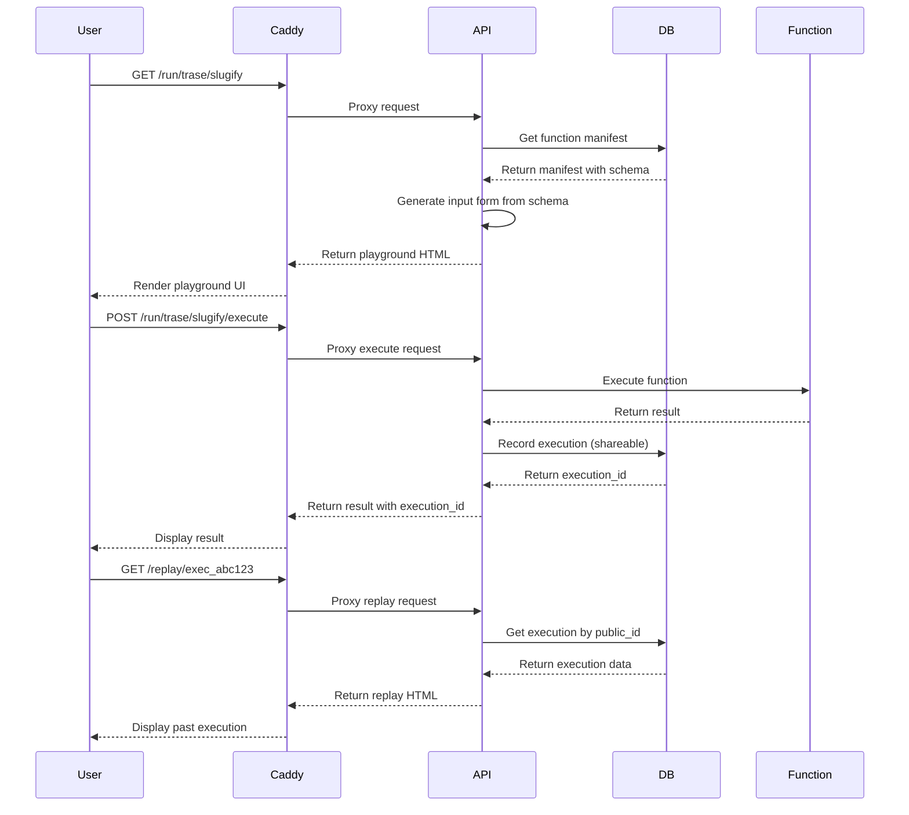

# Perfect Playground Implementation Plan

## Overview

Transform the FunctionFly registry into an interactive playground where every function automatically becomes:
- A documentation page
- A demo app
- An interactive API tester
- A debugging tool
- An AI-callable tool

**Core Principle:** The registry generates everything dynamically from the manifest - no custom UI code required.

---

## URL Structure

### New URL Patterns

```
# Public function page (documentation + playground)
https://functionfly.com/fx/{author}/{slug}
https://functionfly.com/fx/trase/slugify

# Live playground session  
https://functionfly.com/run/{author}/{slug}
https://functionfly.com/run/trase/slugify

# Shareable test run with pre-filled input
https://functionfly.com/run/trase/slugify?input=Hello+World

# Permanent reproducible run (replay)
https://functionfly.com/replay/exec_8f3ab21
```

### Route Mapping

| Pattern | Handler | Description |
|---------|---------|-------------|
| `/fx/{author}/{slug}` | `HandleFunctionPage` | Combined docs + playground |
| `/run/{author}/{slug}` | `HandlePlaygroundUI` | Interactive playground |
| `/run/{author}/{slug}/execute` | `HandlePlaygroundExecute` | Execute function |
| `/run/{author}/{slug}/share` | `HandlePlaygroundShare` | Create shareable link |
| `/replay/{execution_id}` | `HandleReplay` | View past execution |
| `/fx/{author}/{slug}/code` | `HandleCodeExamples` | Get code snippets |
| `/fx/{author}/{slug}/ai-schema` | `HandleAIToolSchema` | Get AI tool schema |

---

## Database Schema

### Existing Tables (Already Implemented)

1. **`registry_executions_public`** - Shareable execution records
   - `id` (UUID, PK)
   - `public_id` (string, unique) - shareable ID like `exec_8f3ab21`
   - `function_id` (UUID)
   - `version` (string)
   - `input_json` (jsonb)
   - `output_json` (jsonb)
   - `duration_ms` (int)
   - `cached` (bool)
   - `shareable` (bool)
   - `created_at` (timestamp)

2. **`registry_functions`** - Function registry
   - Already has `playground_visibility` field

### New Columns (If Needed)

```sql
-- Add to registry_functions if not exists
ALTER TABLE registry_functions 
ADD COLUMN IF NOT EXISTS playground_visibility VARCHAR(20) DEFAULT 'public';
```

---

## API Endpoints

### 1. Function Page (Combined Docs + Playground)

```
GET /fx/{author}/{slug}
```

**Response:** HTML page with:
- Function metadata (title, description, author, version)
- Interactive playground
- Code examples tabs
- AI tool schema section

### 2. Playground UI

```
GET /run/{author}/{slug}
```

**Response:** HTML playground with:
- Auto-generated input form from schema
- Run button
- Output display
- Share button
- Code examples

### 3. Execute Function

```
POST /run/{author}/{slug}/execute
Content-Type: application/json

{
  "input": { /* function input */ }
}
```

**Response:**
```json
{
  "ok": true,
  "data": "hello-world",
  "cached": false,
  "duration_ms": 9,
  "version": "1.0.0",
  "execution_id": "exec_abc123"  // For replay
}
```

### 4. Shareable Link

```
POST /run/{author}/{slug}/share
Content-Type: application/json

{
  "input": { /* function input */ }
}
```

**Response:**
```json
{
  "share_url": "https://functionfly.com/replay/exec_abc123",
  "full_url": "https://functionfly.com/replay/exec_abc123"
}
```

### 5. Replay Execution

```
GET /replay/{execution_id}
```

**Response:** HTML page showing:
- Original input
- Output
- Metadata (function, version, timing)
- Option to re-run with same input

### 6. Code Examples

```
GET /fx/{author}/{slug}/code
```

**Response:**
```json
{
  "curl": "curl -X POST https://api.functionfly.com/trase/slugify -d '\"Hello World\"'",
  "javascript": "await fetch('https://api.functionfly.com/trase/slugify', { method: 'POST', body: '\"Hello World\"' })",
  "python": "requests.post('https://api.functionfly.com/trase/slugify', data='\"Hello World\"')"
}
```

### 7. AI Tool Schema

```
GET /fx/{author}/{slug}/ai-schema
```

**Response:** OpenAI tool schema + JSON Schema for function input

---

## Auto-Generated Input UI

### From Manifest Schema

The playground automatically generates input UI from the manifest:

```json
{
  "input": {
    "type": "object",
    "properties": {
      "text": { "type": "string", "example": "Hello World" }
    }
  }
}
```

**Renders as:**
- Text input prefilled with "Hello World"

### Schema to UI Mapping

| JSON Schema Type | UI Component |
|-----------------|--------------|
| `string` | Text input |
| `number` | Number input |
| `boolean` | Checkbox |
| `object` | Nested form fields |
| `array` | Dynamic list input |
| `enum` | Dropdown select |

---

## Implementation Steps

### Phase 1: URL Routing & API

1. **Update route registration** in `internal/api/routes.go`
   - Add `/fx/{author}/{slug}` routes
   - Add `/run/{author}/{slug}` routes  
   - Add `/replay/{execution_id}` routes

2. **Create new handler** `internal/api/handlers/playground/registry.go`
   - `HandleFunctionPage` - Combined docs + playground
   - `HandleReplay` - Replay past execution
   - `HandleCodeExamples` - Generate code snippets
   - `HandleAIToolSchema` - Generate AI tool schema

3. **Enhance existing handlers**
   - Update `HandlePlaygroundExecute` to return execution_id
   - Add recording to public executions table
   - Support input from query params

### Phase 2: Enhanced Playground UI

4. **Rewrite playground HTML generator**
   - Auto-generate input form from schema
   - Add code examples tabs (curl, JS, Python)
   - Add AI schema section
   - Add replay support

5. **Input form generation**
   - Parse input schema from manifest
   - Generate appropriate UI components
   - Support nested objects and arrays

### Phase 3: Shareable Replay

6. **Enhance execution recording**
   - Record every playground execution to public table
   - Generate unique public_id
   - Support shareable flag

7. **Replay page**
   - Fetch execution by public_id
   - Display input/output
   - Allow re-running with same input

### Phase 4: Code Generation

8. **Code examples endpoint**
   - Generate curl command
   - Generate JavaScript fetch code
   - Generate Python requests code

9. **AI tool schema endpoint**
   - Generate OpenAI tool definition
   - Generate JSON Schema

---

## File Changes

| Action | File | Description |
|--------|------|-------------|
| MODIFY | `internal/api/routes.go` | Add new routes |
| CREATE | `internal/api/handlers/playground/registry.go` | New registry playground handler |
| MODIFY | `internal/api/handlers/registry/playground.go` | Enhance existing |
| MODIFY | `internal/storage/registry/execution_tracking.go` | Add replay methods |
| CREATE | `migrations/YYYYMMDDHHMMSS_add_playground_visibility.up.sql` | DB migration if needed |
| MODIFY | `deploy/caddy/Caddyfile` | Add new routes |

---

## Security Considerations

1. **Rate Limiting:** 
   - Playground: 60 req/min per IP
   - Replay: 120 req/min per IP

2. **Function Validation:**
   - Only public/unlisted functions accessible
   - Must have valid deployment

3. **Input Validation:**
   - Validate against input schema
   - Sanitize before execution

4. **CORS:**
   - Allow cross-origin for embedding

---

## Mermaid: Request Flow



---

## Testing Checklist

- [ ] `/fx/{author}/{slug}` returns combined page
- [ ] `/run/{author}/{slug}` returns playground UI
- [ ] `/run/{author}/{slug}?input=X` pre-fills input
- [ ] `/run/{author}/{slug}/execute` executes function
- [ ] Execution returns `execution_id`
- [ ] `/replay/{execution_id}` shows past execution
- [ ] Code examples generate correctly
- [ ] AI schema generates correctly
- [ ] Input form generates from schema
- [ ] Rate limiting works
- [ ] Only public functions accessible
