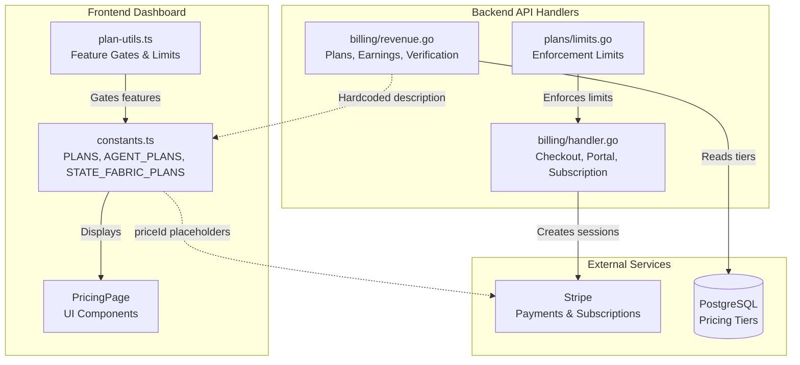

# FunctionFly Pricing Audit Report

**Date:** 2026-03-25  
**Status:** 🚨 CRITICAL ISSUES FOUND  
**Prepared by:** Architect Mode

---

## Executive Summary

A comprehensive sweep of the FunctionFly codebase reveals **critical pricing inconsistencies** between frontend display and backend enforcement, as well as several gaps that could cause billing disputes, customer confusion, and revenue leakage at launch. These issues must be resolved before going live.

---

## Critical Issues

### 1. REQUEST LIMITS MISMATCH (CRITICAL - Revenue Impact)

**Location:**

- Frontend: [`web/dashboard/src/lib/constants.ts`](web/dashboard/src/lib/constants.ts:216) (PLANS)
- Backend: [`internal/plans/limits.go`](internal/plans/limits.go:17)

**Problem:** The request limits enforced by the backend do NOT match what the frontend displays to users.

| Plan | Frontend Display | Backend Enforcement | Discrepancy |
|------|------------------|---------------------|-------------|
| **Starter** | 1,000,000 requests/mo | 100,000 requests/mo | **10x** |
| **Professional/Pro** | 10,000,000 requests/mo | 500,000 requests/mo | **20x** |
| **Enterprise** | Unlimited | 10,000,000 requests/mo | Not unlimited |

**Impact:**

- Users on "Professional" plan seeing 10M requests/mo in UI but backend caps at 500K
- Potential for customer complaints and billing disputes
- Could trigger overages or service disruptions unexpectedly

**Fix Required:**

```go
// internal/plans/limits.go - FIX THESE VALUES:
StarterMaxRequestsPerMonth           = 1_000_000   // Was: 100_000
DefaultProMaxRequestsPerMonth        = 10_000_000  // Was: 500_000
DefaultEnterpriseMaxRequestsPerMonth  = -1          // Was: 10_000_000 (use -1 for unlimited)
```

---

### 2. PLAN NAMING INCONSISTENCY (CRITICAL)

**Location:**

- Frontend: [`web/dashboard/src/lib/constants.ts`](web/dashboard/src/lib/constants.ts:262) (PROFESSIONAL)
- Frontend: [`web/dashboard/src/lib/plan-utils.ts`](web/dashboard/src/lib/plan-utils.ts:3) (PlanTier type)
- Backend: [`internal/plans/limits.go`](internal/plans/limits.go:55) (PlanPro = "pro")

**Problem:**

- Frontend uses `PLANS.PROFESSIONAL` with `id: 'professional'`
- Backend Go code uses `PlanPro = "pro"`
- The `plan-utils.ts` defines `PlanTier = 'free' | 'starter' | 'professional' | 'enterprise'`

**Impact:** Feature gating in plan-utils.ts checks for 'professional' but backend may use 'pro'.

**Fix Required:** Standardize on one naming convention across frontend and backend. Recommendation: Use `professional` everywhere.

---

### 3. STATE FABRIC ENTERPRISE PRICE DISCREPANCY (CRITICAL)

**Location:**

- [`web/dashboard/src/lib/constants.ts`](web/dashboard/src/lib/constants.ts:486) - price: 'Custom'
- [`web/dashboard/src/pages/PricingPage/components/StateFabricPricingSection/data.ts`](web/dashboard/src/pages/PricingPage/components/StateFabricPricingSection/data.ts:120) - price: "$1,999"

**Problem:** Two different prices for State Fabric Enterprise.

---

## High Priority Issues

### 4. MISSING STRIPE PRICE IDs

**Location:** [`web/dashboard/src/lib/constants.ts`](web/dashboard/src/lib/constants.ts:241)

```typescript
priceId: import.meta.env.VITE_STRIPE_PRICE_STARTER || 'price_starter_placeholder'
```

**Problem:** Price IDs are placeholders in development. If these aren't replaced with real Stripe price IDs before launch, checkout will fail.

**Required Environment Variables:**

```
VITE_STRIPE_PRICE_STARTER=price_xxx
VITE_STRIPE_PRICE_PROFESSIONAL=price_xxx
VITE_STRIPE_PRICE_AGENT_STARTER=price_xxx
VITE_STRIPE_PRICE_AGENT_SCALE=price_xxx
VITE_STRIPE_PRICE_AGENT_PRO=price_xxx
VITE_STRIPE_PRICE_SF_STARTER=price_xxx
VITE_STRIPE_PRICE_SF_PRO=price_xxx
VITE_STRIPE_PRICE_SF_BUSINESS=price_xxx
```

---

### 5. BACKEND PLAN TIERS NOT SYNCED WITH FRONTEND

**Location:** [`internal/api/handlers/billing/revenue.go`](internal/api/handlers/billing/revenue.go:162)

```go
Description: "FunctionFly pricing plans - Hobby (free), Pro ($49/mo), Scale ($299/mo), Enterprise (custom)"
```

**Problem:** Hardcoded description mentions "$49/mo" for Pro and "$299/mo" for Scale, but:

- Frontend AGENT_PLANS.SCALE.price is 299 (correct)
- But description says "Pro" not "Agent Starter"

**Also:** The backend reads from database via `ListPricingTiersExtended()`. If Stripe prices don't match database records, there's a sync gap.

---

### 6. AGENT PRICING SECTION - MIXED DISPLAY

**Location:** [`web/dashboard/src/pages/PricingPage/components/AgentPricingSection/index.tsx`](web/dashboard/src/pages/PricingPage/components/AgentPricingSection/index.tsx:20)

The `agentPlans` array hardcodes some display values while pulling others from `AGENT_PLANS`. This creates maintenance burden and potential drift.

---

## Medium Priority Issues

### 7. MISSING FEATURE GATES FOR STATE FABRIC AND AGENTS

**Location:** [`web/dashboard/src/lib/plan-utils.ts`](web/dashboard/src/lib/plan-utils.ts:146)

```typescript
export const FEATURES: Record<string, readonly PlanTier[]> = {
  ADVANCED_ANALYTICS: ['professional', 'enterprise'],
  // ... only has 4 features total
```

**Problem:**

- `FEATURES` object only gates 4 features
- State Fabric and Agent-specific features are not included
- No feature gates for agent concurrency, state writes, etc.

---

### 8. NO VALIDATION BETWEEN FRONTEND LIMITS AND BACKEND LIMITS

**Location:** Throughout codebase

**Problem:** Frontend has limits in `PLANS.*.limits`, backend has limits in `plans/` package. There's no shared schema or validation between them.

---

### 9. PRICE CALCULATION FORMULA NOT DOCUMENTED

**Location:** [`internal/agent/pricing/service.go`](internal/agent/pricing/service.go:36)

```go
func (s *Service) CalculatePrice(ctx context.Context, listing *identity.FunctionListing, callsInPeriod int) (float64, error)
```

**Problem:** Complex pricing models exist (fixed, tiered, dynamic, auction) but formulas are not documented for customers or salespeople.

---

## Low Priority Issues

### 10. FAQ SECTION SHOWS INCONSISTENT PRICING

**Location:** [`web/dashboard/src/pages/LandingPage/components/FAQSection.tsx`](web/dashboard/src/pages/LandingPage/components/FAQSection.tsx:14)

```typescript
{
  question: "How does pricing work?",
  answer: "Start with our free tier for up to 100,000 function invocations per month. Paid plans start at $9/month for the Developer plan (1M invocations)..."
}
```

**Problems:**

- Mentions "$9/month Developer plan" - doesn't match any actual plan
- Mentions "1M invocations" for Developer plan - not consistent with current plans

---

### 11. STATE FABRIC ADD-ONS NOT IN CONSTANTS

**Location:** [`web/dashboard/src/pages/PricingPage/components/StateFabricPricingSection/data.ts`](web/dashboard/src/pages/PricingPage/components/StateFabricPricingSection/data.ts:154)

```typescript
export const STATE_FABRIC_ADDONS = [
  { name: "Hot Cache Booster", price: "$49", period: "/mo per 5GB", ... },
  { name: "Advanced Security Pack", price: "$99", ... },
  { name: "AI Memory Pack", price: "$149", ... },
  { name: "Advanced Insights", price: "$79", ... },
];
```

**Problem:** These add-ons are hardcoded in the component, not defined in constants. No backend implementation found for these add-on charges.

---

## Pricing Architecture Diagram



---

## Recommended Actions

### Phase 1: Critical Fixes (Before Any Launch)

1. **Fix Request Limits** in `internal/plans/limits.go` to match frontend
2. **Standardize Plan Naming** - pick "professional" or "pro" and use consistently
3. **Fix State Fabric Enterprise Price** - pick $1,999 or "Custom" and use consistently
4. **Create Real Stripe Price IDs** and set environment variables
5. **Audit Backend `HandleGetPlans`** to return accurate description

### Phase 2: High Priority

1. **Add Feature Gating** for State Fabric and Agent-specific features
2. **Create Shared Pricing Schema** - consider a JSON file or Go package that both frontend and backend import
3. **Document Pricing Formulas** for all pricing models

### Phase 3: Medium Priority

1. **Move State Fabric Add-ons** to constants and implement backend tracking
2. **Update FAQ Section** to match actual pricing
3. **Add Integration Tests** that verify frontend limits match backend enforcement

---

## Files to Review/Modify

| File | Action | Priority |
|------|--------|----------|
| `internal/plans/limits.go` | Fix request limits, standardize naming | CRITICAL |
| `web/dashboard/src/lib/constants.ts` | Add Stripe price IDs to env vars list | CRITICAL |
| `web/dashboard/src/lib/plan-utils.ts` | Add State Fabric & Agent feature gates | HIGH |
| `internal/api/handlers/billing/revenue.go` | Fix hardcoded description | HIGH |
| `web/dashboard/src/pages/PricingPage/components/StateFabricPricingSection/data.ts` | Fix Enterprise price | CRITICAL |
| `web/dashboard/src/pages/LandingPage/components/FAQSection.tsx` | Update pricing text | MEDIUM |
| `internal/agent/pricing/service.go` | Document pricing formulas | MEDIUM |

---

## Verification Checklist

Before launch, verify:

- [ ] Backend request limits match frontend display
- [ ] Plan names are consistent (professional vs pro)
- [ ] State Fabric Enterprise price is consistent
- [ ] All Stripe price IDs are real, not placeholders
- [ ] Feature gates cover all product features
- [ ] FAQ and marketing materials match actual pricing
- [ ] State Fabric add-ons have backend support
- [ ] Pricing description in API matches frontend
- [ ] Enterprise pricing is clearly communicated
