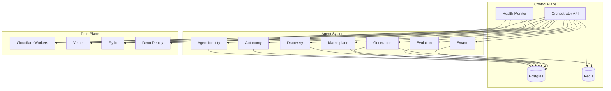
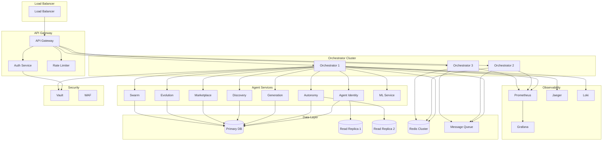

# FunctionFly Platform - Production Readiness & Capability Improvements

## Executive Summary

This document outlines comprehensive improvements to strengthen FunctionFly's platform capabilities and ensure production readiness. Based on analysis of the current architecture, agent system, and infrastructure, these recommendations focus on reliability, scalability, security, and operational excellence.

---

## 1. Current Agent Capabilities Assessment

### 1.1 Agent Identity & Management

- **Agent Registration**: Multi-tenant agent identity with API key authentication
- **Plan Tiers**: Starter, Pro, Enterprise tier support
- **Swarm Roles**: Worker, Manager, Infrastructure roles
- **Parent-Child Relationships**: Hierarchical agent delegation (max depth: 5)
- **Trust & Economic Scoring**: Per-agent trust and economic performance metrics

### 1.2 Agent Autonomy

- **Scheduled Execution**: Cron-based recurring schedules
- **One-Time Execution**: Single-run scheduled tasks
- **Trigger-Based Execution**: Event-driven automation
- **Action Types**:
  - Execute Function
  - Spawn Agent
  - Send Message
  - Update State
  - Evolve

### 1.3 Function Generation

- **AI-Powered Code Generation**: LLM-backed function creation
- **Multi-Runtime Support**: Python 3.11, Node.js 20
- **Deterministic Certification**: SHA-256 based determinism verification
- **Manifest Generation**: Automatic function manifest creation
- **Marketplace Publishing**: Direct publish to marketplace

### 1.4 Discovery & Opportunity Scanning

- **Multi-Source Scanning**: GitHub, Reddit, StackOverflow
- **Demand Scoring**: Heuristic-based demand signal analysis
- **Quality Scoring**: Automated quality assessment
- **Review Workflow**: Manual review for high-impact opportunities
- **Deduplication**: Source-based deduplication

### 1.5 Marketplace

- **Agent Listings**: Worker, Manager, Infrastructure listings
- **Function Listings**: Public function marketplace
- **Pricing Models**: Free, Per-Call, Subscription, Revenue Share
- **Ranking Algorithm**: Multi-factor ranking (trust, economic, reliability, ROI, volume)
- **Rating System**: 0-5 star rating with execution success rate

### 1.6 Evolution & Learning

- **Performance Analysis**: Success rate, latency, cost analysis
- **Evolution Proposals**: Automated improvement suggestions
- **Proposal Types**:
  - Spawn Specialist
  - Modify Policy
  - Adjust Timeout
  - Generate Function
  - Retire Child
  - Upgrade Capabilities
- **Approval Workflow**: Parent approval for child agent proposals

### 1.7 Agent-to-Agent Communication

- **Message Types**: Task delegation, results, queries, responses
- **Capability Discovery**: A2A capability negotiation
- **Heartbeat Monitoring**: Agent health monitoring
- **Budget Requests**: Economic resource requests

### 1.8 Economic System

- **Agent Wallets**: USD balance, escrow, earnings, spending
- **Revenue Transactions**: Delegation payments, function calls, subscriptions
- **Quota Management**: Per-minute, per-day, per-execution limits
- **Cost Controls**: Max daily spend, max cost per execution

---

## 2. Production Readiness Improvements

### 2.1 Reliability & Resilience

#### 2.1.1 Circuit Breaker Enhancement

**Current State**: Basic circuit breaker with 3-failure threshold
**Improvements**:

- [ ] Configurable failure thresholds per backend type
- [ ] Exponential backoff for half-open state
- [ ] Circuit breaker metrics dashboard
- [ ] Automatic circuit breaker tuning based on historical data

#### 2.1.2 Retry Policies

**Current State**: Basic retry for idempotent methods
**Improvements**:

- [ ] Configurable retry policies per endpoint
- [ ] Retry budget enforcement (max retries per time window)
- [ ] Retry-after header support
- [ ] Dead letter queue for failed requests

#### 2.1.3 Graceful Degradation

**Current State**: Basic failover to next backend
**Improvements**:

- [ ] Feature flag-based degradation
- [ ] Read-only mode during outages
- [ ] Cached response serving during backend failures
- [ ] Progressive enhancement based on backend availability

#### 2.1.4 Health Check Improvements

**Current State**: 5-second probe interval
**Improvements**:

- [ ] Configurable probe intervals per backend
- [ ] Multi-endpoint health checks (liveness + readiness)
- [ ] Health check aggregation across regions
- [ ] Predictive health scoring using ML

### 2.2 Scalability

#### 2.2.1 Database Optimization

**Current State**: Single Postgres instance
**Improvements**:

- [ ] Read replicas for query scaling
- [ ] Connection pooling (PgBouncer)
- [ ] Query optimization and indexing
- [ ] Partitioning for time-series data (health_checks, routing_events)
- [ ] Materialized views for complex aggregations

#### 2.2.2 Caching Strategy

**Current State**: Redis for registry cache
**Improvements**:

- [ ] Multi-layer caching (L1: in-memory, L2: Redis)
- [ ] Cache warming for frequently accessed data
- [ ] Cache invalidation strategies (write-through, write-behind)
- [ ] Cache hit rate monitoring and optimization

#### 2.2.3 Horizontal Scaling

**Current State**: Single orchestrator instance
**Improvements**:

- [ ] Stateless orchestrator design
- [ ] Load balancer for orchestrator instances
- [ ] Session affinity for WebSocket connections
- [ ] Distributed lock management (Redis-based)

#### 2.2.4 Queue-Based Processing

**Current State**: Synchronous processing
**Improvements**:

- [ ] Async processing for non-critical operations
- [ ] Priority queues for different request types
- [ ] Queue depth monitoring and auto-scaling
- [ ] Message deduplication

### 2.3 Security

#### 2.3.1 Authentication & Authorization

**Current State**: JWT + API keys
**Improvements**:

- [ ] OAuth 2.0 / OpenID Connect support
- [ ] Role-based access control (RBAC)
- [ ] API key rotation mechanism
- [ ] Multi-factor authentication (MFA)
- [ ] Session management improvements

#### 2.3.2 Request Validation

**Current State**: Basic HMAC signing
**Improvements**:

- [ ] Request schema validation
- [ ] Rate limiting per API key
- [ ] IP allowlisting/blocklisting
- [ ] Request size limits
- [ ] SQL injection prevention
- [ ] XSS protection

#### 2.3.3 Secrets Management

**Current State**: Environment variables
**Improvements**:

- [ ] HashiCorp Vault integration
- [ ] Secrets rotation automation
- [ ] Encryption at rest for sensitive data
- [ ] Audit logging for secrets access

#### 2.3.4 Network Security

**Current State**: Basic TLS
**Improvements**:

- [ ] Mutual TLS (mTLS) for service-to-service
- [ ] Network segmentation
- [ ] DDoS protection
- [ ] Web Application Firewall (WAF)

### 2.4 Observability

#### 2.4.1 Logging

**Current State**: Structured logs with logrus
**Improvements**:

- [ ] Centralized log aggregation (ELK/Loki)
- [ ] Log correlation with request IDs
- [ ] Log retention policies
- [ ] Log-based alerting

#### 2.4.2 Metrics

**Current State**: Prometheus metrics
**Improvements**:

- [ ] Custom business metrics
- [ ] SLO/SLI tracking
- [ ] Metric aggregation across regions
- [ ] Cost attribution metrics

#### 2.4.3 Tracing

**Current State**: Basic request ID propagation
**Improvements**:

- [ ] Distributed tracing (OpenTelemetry)
- [ ] Trace sampling strategies
- [ ] Performance bottleneck identification
- [ ] Trace-based debugging

#### 2.4.4 Alerting

**Current State**: Basic alerting
**Improvements**:

- [ ] Alert routing and escalation
- [ ] Alert deduplication
- [ ] Alert fatigue prevention
- [ ] Automated incident response

### 2.5 Operational Excellence

#### 2.5.1 Deployment

**Current State**: Docker Compose
**Improvements**:

- [ ] Kubernetes deployment manifests
- [ ] Helm charts
- [ ] Blue-green deployment support
- [ ] Canary deployment support
- [ ] Feature flags

#### 2.5.2 Configuration Management

**Current State**: Environment variables
**Improvements**:

- [ ] Centralized configuration (Consul/etcd)
- [ ] Configuration versioning
- [ ] Configuration validation
- [ ] Dynamic configuration updates

#### 2.5.3 Disaster Recovery

**Current State**: Basic backups
**Improvements**:

- [ ] Automated backup verification
- [ ] Point-in-time recovery
- [ ] Cross-region replication
- [ ] Disaster recovery runbooks

#### 2.5.4 Documentation

**Current State**: Basic README and plans
**Improvements**:

- [ ] API documentation (OpenAPI/Swagger)
- [ ] Runbooks for common operations
- [ ] Architecture decision records (ADRs)
- [ ] Onboarding guides

---

## 3. Agent Capability Enhancements

### 3.1 Advanced Agent Intelligence

#### 3.1.1 Machine Learning Integration

- [ ] Predictive health scoring
- [ ] Anomaly detection for agent behavior
- [ ] Automated performance optimization
- [ ] Cost prediction models

#### 3.1.2 Enhanced Evolution System

- [ ] A/B testing for evolution proposals
- [ ] Rollback capabilities for failed evolutions
- [ ] Evolution impact analysis
- [ ] Multi-objective optimization

#### 3.1.3 Swarm Intelligence

- [ ] Collective learning across agents
- [ ] Knowledge sharing protocols
- [ ] Collaborative problem solving
- [ ] Emergent behavior detection

### 3.2 Agent Collaboration

#### 3.2.1 Enhanced A2A Communication

- [ ] Message queuing for reliability
- [ ] Message encryption for security
- [ ] Message compression for efficiency
- [ ] Message versioning for compatibility

#### 3.2.2 Agent Discovery

- [ ] Capability-based agent discovery
- [ ] Agent reputation system
- [ ] Agent recommendation engine
- [ ] Agent compatibility checking

#### 3.2.3 Task Delegation

- [ ] Task complexity estimation
- [ ] Optimal agent selection
- [ ] Task decomposition
- [ ] Result aggregation

### 3.3 Economic System Enhancements

#### 3.3.1 Advanced Pricing

- [ ] Dynamic pricing based on demand
- [ ] Volume discounts
- [ ] Subscription tiers
- [ ] Usage-based billing

#### 3.3.2 Financial Controls

- [ ] Budget alerts and notifications
- [ ] Spending forecasts
- [ ] Cost optimization recommendations
- [ ] Financial reporting

#### 3.3.3 Marketplace Improvements

- [ ] Agent reviews and testimonials
- [ ] Performance guarantees
- [ ] SLA enforcement
- [ ] Dispute resolution

### 3.4 Security Enhancements

#### 3.4.1 Agent Security

- [ ] Agent sandboxing
- [ ] Resource limits per agent
- [ ] Behavior monitoring
- [ ] Anomaly detection

#### 3.4.2 Data Protection

- [ ] Data encryption at rest
- [ ] Data encryption in transit
- [ ] Data retention policies
- [ ] GDPR compliance tools

#### 3.4.3 Audit & Compliance

- [ ] Comprehensive audit logging
- [ ] Compliance reporting
- [ ] Access control auditing
- [ ] Security incident response

---

## 4. Implementation Roadmap

### Phase 1: Foundation (Weeks 1-4)

**Focus**: Reliability and observability

- [ ] Circuit breaker enhancements
- [ ] Retry policies
- [ ] Distributed tracing
- [ ] Centralized logging
- [ ] SLO/SLI tracking

### Phase 2: Scalability (Weeks 5-8)

**Focus**: Performance and scaling

- [ ] Database optimization
- [ ] Caching improvements
- [ ] Horizontal scaling
- [ ] Queue-based processing

### Phase 3: Security (Weeks 9-12)

**Focus**: Security hardening

- [ ] OAuth 2.0 support
- [ ] RBAC implementation
- [ ] Secrets management
- [ ] Network security

### Phase 4: Agent Intelligence (Weeks 13-16)

**Focus**: Agent capabilities

- [ ] ML integration
- [ ] Enhanced evolution
- [ ] Swarm intelligence
- [ ] Advanced A2A

### Phase 5: Operational Excellence (Weeks 17-20)

**Focus**: Operations and deployment

- [ ] Kubernetes deployment
- [ ] Configuration management
- [ ] Disaster recovery
- [ ] Documentation

### Phase 6: Economic System (Weeks 21-24)

**Focus**: Marketplace and economics

- [ ] Advanced pricing
- [ ] Financial controls
- [ ] Marketplace improvements
- [ ] Compliance tools

---

## 5. Success Metrics

### Reliability

- **Uptime**: 99.9% → 99.99%
- **MTTR**: < 5 minutes
- **Error Rate**: < 0.1%

### Performance

- **P50 Latency**: < 100ms
- **P95 Latency**: < 500ms
- **P99 Latency**: < 1000ms
- **Throughput**: 10,000 RPS → 100,000 RPS

### Scalability

- **Concurrent Agents**: 1,000 → 100,000
- **Functions**: 10,000 → 1,000,000
- **Requests/Day**: 1M → 1B

### Security

- **Zero Security Incidents**
- **100% Audit Coverage**
- **< 24h Vulnerability Patching**

### Agent Capabilities

- **Agent Success Rate**: > 95%
- **Evolution Success Rate**: > 80%
- **Marketplace Satisfaction**: > 4.5/5

---

## 6. Resource Requirements

### Infrastructure

- **Compute**: 3x orchestrator instances, 2x health monitors
- **Database**: Primary + 2 read replicas, PgBouncer
- **Cache**: Redis cluster (3 nodes)
- **Queue**: Redis or RabbitMQ cluster
- **Storage**: S3/R2 for artifacts, backups

### Team

- **Backend Engineers**: 2-3
- **DevOps/SRE**: 1-2
- **Security Engineer**: 1
- **QA Engineer**: 1

### Tools

- **Monitoring**: Prometheus, Grafana, PagerDuty
- **Logging**: ELK Stack or Loki
- **Tracing**: Jaeger or Tempo
- **CI/CD**: GitHub Actions, ArgoCD
- **Security**: Vault, Snyk, SonarQube

---

## 7. Risk Assessment

### High Risk

- **Database Migration**: Requires careful planning and testing
- **Security Changes**: May break existing integrations
- **Horizontal Scaling**: Complex distributed systems challenges

### Medium Risk

- **Caching Changes**: Potential cache invalidation issues
- **Queue Implementation**: Message ordering and deduplication
- **Agent Evolution**: Unpredictable agent behavior

### Low Risk

- **Documentation**: Low technical risk
- **Monitoring**: Incremental improvements
- **Configuration**: Non-breaking changes

---

## 8. Next Steps

1. **Review and Prioritize**: Review this plan with stakeholders
2. **Resource Allocation**: Assign team members to phases
3. **Detailed Design**: Create detailed design documents for Phase 1
4. **Implementation**: Begin Phase 1 implementation
5. **Testing**: Comprehensive testing at each phase
6. **Deployment**: Gradual rollout with feature flags
7. **Monitoring**: Continuous monitoring and optimization

---

## Appendix A: Current Architecture Diagram

## Appendix B: Proposed Enhanced Architecture

---

*Document Version: 1.0*
*Last Updated: 2026-03-19*
*Author: FunctionFly Architecture Team*
