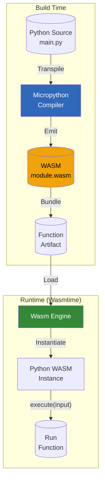

# Python Runtime Support - Micropython/WASM Integration Plan

## Overview

This plan outlines the implementation of Python runtime support using **pre-compiled Python WASM modules**. Python functions are compiled/transpiled to WebAssembly, becoming standalone WASM artifacts that execute in the same Wasmtime runtime as Rust/Go functions.

**Strategic Principle**: "Everything is a function. Everything compiles to WASM."

---

## Architecture



---

## Implementation Phases

### Phase 1: Core Infrastructure

#### 1.1 Python-to-WASM Transpiler Integration

**Approach**: Use **Micropython** compiled to WASM as the runtime, with user Python code embedded as a module.

**Options evaluated**:
- Pyodide: Requires JavaScript (Emscripten) - ❌
- Micropython WASM: Pure WASM possible with custom build - ✅
- Transcrypt: Python→JS transpiler - ❌ (produces JS, not WASM)

**Decision**: Build a custom Micropython WASM runtime that:
1. Is compiled with minimal JS dependencies
2. Exports a clean WASI-like interface
3. Accepts Python source code as a module

**Technical implementation**:
```rust
// In bundler: Generate WASM that embeds Python source
// The WASM module exports:
// - _start() -> initialize
// - execute(input_ptr, input_len) -> output_ptr
```

#### 1.2 WASM Module Interface

Standardize the function interface across all runtimes:

```rust
// WASM exports required for all function modules
#[wasm_interface]
pub interface FunctionModule {
    /// Initialize the function (called once on cold start)
    fn init() -> void;
    
    /// Execute the function with input
    /// Returns: JSON string or plain text
    fn execute(input: string) -> string;
    
    /// Optional: Get function metadata
    fn metadata() -> FunctionMetadata;
}
```

**Memory model**:
- Input passed via shared memory or string return
- Output returned as string (JSON or plain text)
- Memory limits enforced by Wasmtime

#### 1.3 Bundler Updates

Modify [`internal/bundler/bundler.go`](internal/bundler/bundler.go) to:

1. **Compile Python to WASM**:
   - Embed Micropython WASM runtime
   - Inject user Python code as embedded module
   - Generate WASM with proper exports

2. **Bundle structure**:
   ```json
   {
     "type": "python-wasm",
     "version": "1.0",
     "runtime": "micropython-1.20",
     "entry": "main",
     "dependencies": []
   }
   ```

---

### Phase 2: Runtime Integration

#### 2.1 Wasmtime Engine Updates

Extend [`runtimes/local/src/engine.rs`](runtimes/local/src/engine.rs) to:

1. **Detect Python WASM modules**:
   ```rust
   fn detect_runtime_type(wasm_bytes: &[u8]) -> RuntimeType {
       // Check for Python WASM magic bytes or metadata section
       if is_python_wasm(wasm_bytes) {
           RuntimeType::Python
       } else {
           RuntimeType::Wasm
       }
   }
   ```

2. **Execute Python modules**:
   ```rust
   async fn execute_python(&self, wasm_bytes: &[u8], input: &str) -> Result<String> {
       // Initialize Micropython runtime
       // Load embedded Python code
       // Execute with input
       // Return output
   }
   ```

#### 2.2 Configuration Updates

Update [`runtimes/local/src/config.rs`](runtimes/local/src/config.rs):

```rust
pub struct Config {
    // ... existing fields
    
    /// Python runtime version
    #[arg(long, default_value = "micropython-1.20")]
    pub python_runtime: String,
    
    /// Python stdlib packages to include
    #[arg(long)]
    pub python_packages: Vec<String>,
}
```

#### 2.3 Pool Management

The existing instance pooling ([`runtimes/local/src/pool.rs`](runtimes/local/src/pool.rs)) should work for Python WASM with no changes. Each pooled instance contains a warm Python interpreter.

---

### Phase 3: Resource Management & Isolation

#### 3.1 Memory Limits

- **Default**: 128MB (configurable)
- **Stack**: 512KB (same as existing WASM)
- **Heap**: Remaining memory

```rust
// In engine.rs
let memory_limit = self.config.memory_mb * 1024 * 1024;
let mut store = Store::new(&self.engine, wasi_ctx);
store.limiter().memory_maximum(memory_limit);
```

#### 3.2 Execution Timeout

- **Default**: 5 seconds
- **CPU fuel**: 1M units (configurable)

```rust
store.set_fuel(1_000_000)?; // 1M fuel units
```

#### 3.3 Network & Filesystem

- Use existing WASI integration
- Python code gets WASI filesystem/network via Micropython's `os`, `socket` modules
- Default: read-only filesystem, no network

---

### Phase 4: Cold Start & Caching Optimization

#### 4.1 Precompiled Python Runtime

**Problem**: Compiling Python to WASM on every request is slow.

**Solution**: Prebundle the Micropython runtime:

```
bundler/
├── python/
│   ├── micropython-core.wasm   # Precompiled runtime
│   └── stdlib/                 # Precompiled stdlib modules
└── templates/
    └── python-wrapper.wat      # WebAssembly Text template
```

#### 4.2 Caching Strategy

1. **Function-level cache**: Hash of Python source → compiled WASM
2. **Runtime cache**: Micropython runtime cached across invocations
3. **Instance pool**: Warm instances retained in pool

```rust
// In cache.rs - add Python-specific caching
impl ResultCache {
    pub fn get_python(&self, source_hash: &str) -> Option<Vec<u8>> {
        // Return precompiled WASM if available
    }
}
```

---

### Phase 5: Package Management (Future)

#### 5.1 Allowlist System

Only allow pre-approved packages:

```toml
# functionfly.toml
[python]
allowed_packages = [
    "numpy",
    "pandas", 
    "requests",
]
```

#### 5.2 Package Precompilation

Packages are compiled to WASM at build time, not runtime:

```
build-pipeline/
├── compile-packages.py   # Compiles PyPI packages to WASM
├── package-index.json   # Precompiled package registry
└── wasi-shim/          # WASI compatibility layer
```

---

## File Changes Summary

### New Files

| File | Purpose |
|------|---------|
| `runtimes/local/src/python.rs` | Python WASM execution engine |
| `runtimes/local/src/python/runtime.rs` | Micropython runtime wrapper |
| `bundler/python/` | Python-to-WASM transpilation |
| `examples/python/` | Example Python functions |

### Modified Files

| File | Changes |
|------|---------|
| `runtimes/local/src/engine.rs` | Add Python execution path |
| `runtimes/local/src/config.rs` | Add Python config options |
| `runtimes/local/src/handlers.rs` | Route to Python executor |
| `internal/bundler/bundler.go` | Implement Python→WASM bundling |

---

## Example Python Function

```python
# main.py
import json
import os

def handler(event):
    """
    Function entry point.
    Receives: dict or string
    Returns: dict or string
    """
    # Access environment
    api_key = os.environ.get("API_KEY", "")
    
    # Process input
    if isinstance(event, dict):
        name = event.get("name", "World")
    else:
        name = str(event)
    
    # Return result
    return {
        "message": f"Hello, {name}!",
        "api_key_set": bool(api_key),
    }
```

**WASM Bundle output**:
- Runtime: Micropython 1.20 compiled to WASM
- User code: Embedded as frozen module
- Size: ~1-2MB (base runtime)

---

## Success Criteria

1. ✅ Python functions compile to WASM
2. ✅ Execute in same Wasmtime runtime as other WASM functions
3. ✅ Memory/CPU limits enforced
4. ✅ Instance pooling works for Python functions
5. ✅ Input/output interface consistent with other runtimes
6. ✅ Cold start < 100ms (with warm cache)
7. ✅ Deterministic execution option works

---

## Timeline Estimate

| Phase | Description | Complexity |
|-------|-------------|------------|
| Phase 1 | Core transpiler + bundler | Medium |
| Phase 2 | Runtime integration | Low |
| Phase 3 | Resource management | Low |
| Phase 4 | Caching optimization | Medium |
| Phase 5 | Package management | High |

---

## Alternatives Considered

### Option A: Pyodide in Wasmtime (Rejected)
- Requires JavaScript engine embedded in WASM
- Complex dependency chain
- Violates "pure WASM" principle

### Option B: RustPython WASM (Future)
- Pure Rust implementation
- Better Python 3 compatibility
- Currently experimental

### Option C: CPython compiled to WASM (Future)
- Full Python 3.x support
- Larger binary size (~10MB+)
- Complex build process

**Current choice (Micropython)** provides best balance of size, simplicity, and purity.
